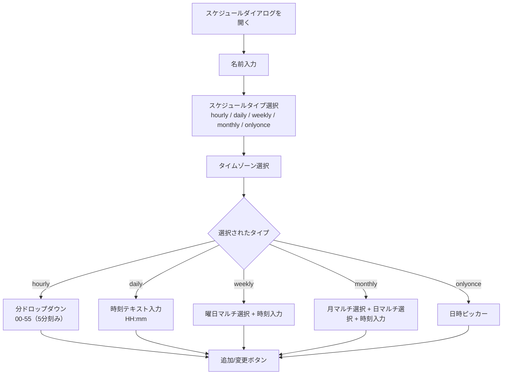
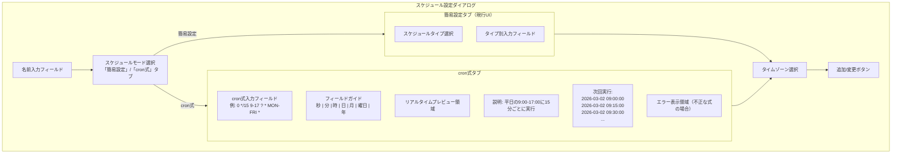
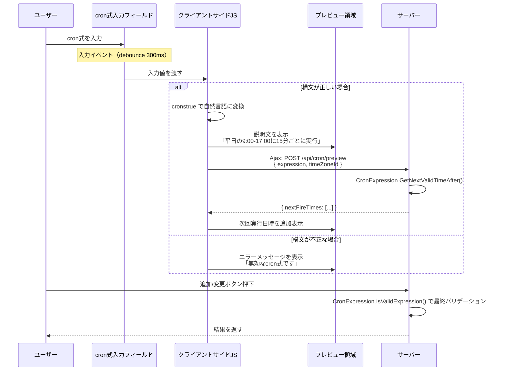

# バックグラウンドサーバスクリプトの cron 式スケジュール対応

バックグラウンドサーバスクリプトのスケジュール設定を cron 式で直接入力できるようにするための調査を行う。
入力時にバリデーションを兼ねてリアルタイムで動作条件（次回実行日時・自然言語での説明）を画面上に表示する方式を検討する。

<!-- START doctoc generated TOC please keep comment here to allow auto update -->
<!-- DON'T EDIT THIS SECTION, INSTEAD RE-RUN doctoc TO UPDATE -->

- [調査情報](#調査情報)
- [調査目的](#調査目的)
- [現行のスケジュール管理方式](#現行のスケジュール管理方式)
    - [データモデル](#データモデル)
    - [cron 式への変換ロジック](#cron-式への変換ロジック)
    - [現行 UI のスケジュール設定ダイアログ](#現行-ui-のスケジュール設定ダイアログ)
    - [現行バリデーション](#現行バリデーション)
    - [現行方式の制約](#現行方式の制約)
- [Quartz.NET の cron 式サポート](#quartznet-の-cron-式サポート)
    - [Quartz cron 式フォーマット（7 フィールド）](#quartz-cron-式フォーマット7-フィールド)
    - [現行コードとの比較](#現行コードとの比較)
    - [Quartz.NET のバリデーション API](#quartznet-のバリデーション-api)
- [cron 式入力 UI の設計案](#cron-式入力-ui-の設計案)
    - [概要](#概要)
    - [UI レイアウト案](#ui-レイアウト案)
    - [設計方針: 簡易設定との共存](#設計方針-簡易設定との共存)
- [データモデルの変更案](#データモデルの変更案)
    - [BackgroundSchedule への cron 式プロパティ追加](#backgroundschedule-への-cron-式プロパティ追加)
    - [GetTrigger メソッドの改修](#gettrigger-メソッドの改修)
- [リアルタイムプレビューの実装方式](#リアルタイムプレビューの実装方式)
    - [方式比較](#方式比較)
    - [クライアントサイドライブラリの候補](#クライアントサイドライブラリの候補)
    - [Quartz 7 フィールド完全対応の検証結果](#quartz-7-フィールド完全対応の検証結果)
    - [プレビュー処理フロー](#プレビュー処理フロー)
    - [次回実行日時の取得方法](#次回実行日時の取得方法)
- [バリデーション設計](#バリデーション設計)
    - [クライアントサイドバリデーション（即時フィードバック）](#クライアントサイドバリデーション即時フィードバック)
    - [サーバーサイドバリデーション（最終検証）](#サーバーサイドバリデーション最終検証)
    - [バリデーション層の整理](#バリデーション層の整理)
- [改修対象ファイル一覧](#改修対象ファイル一覧)
    - [バックエンド](#バックエンド)
    - [フロントエンド](#フロントエンド)
    - [cronstrue ライブラリの配置](#cronstrue-ライブラリの配置)
- [実装手順](#実装手順)
- [結論](#結論)
- [関連ソースコード](#関連ソースコード)

<!-- END doctoc generated TOC please keep comment here to allow auto update -->

## 調査情報

| 調査日       | リポジトリ | ブランチ | タグ/バージョン    | コミット   | 備考     |
| ------------ | ---------- | -------- | ------------------ | ---------- | -------- |
| 2026年3月2日 | Pleasanter | main     | Pleasanter_1.5.1.0 | `34f162a4` | 初回調査 |

## 調査目的

現行のバックグラウンドサーバスクリプトでは、スケジュールタイプ（毎時・毎日・毎週・毎月・一回のみ）を
ドロップダウンから選択し、対応する入力フィールドで時刻・曜日・日付を指定する方式を採用している。
この方式では「平日の 9:00-18:00 に 15 分ごと」「毎月第 2 火曜日の 10:00」といった
複雑なスケジュールを表現できない。

本調査では以下を明らかにする。

1. 現行のスケジュール管理方式の構造と制約
2. cron 式入力への移行に必要な改修箇所
3. リアルタイムプレビュー付き cron 式入力 UI の設計案
4. バリデーションとエラーハンドリングの方針

---

## 現行のスケジュール管理方式

### データモデル

**ファイル**: `Implem.Pleasanter/Libraries/Settings/BackgroundSchedule.cs`

```csharp
[Serializable()]
public class BackgroundSchedule : ISettingListItem
{
    public int Id { get; set; }
    public string Name;
    public string ScheduleType;           // "hourly" | "daily" | "weekly" | "monthly" | "onlyonce"
    public string ScheduleTimeZoneId;
    public string ScheduleHourlyTime;     // 分（"00"〜"55"、5分刻み）
    public string ScheduleDailyTime;      // "HH:mm" 形式
    public string ScheduleWeeklyWeek;     // 曜日の JSON 配列 "[1,2,3]"
    public string ScheduleWeeklyTime;     // "HH:mm" 形式
    public string ScheduleMonthlyMonth;   // 月の JSON 配列 "[1,6,12]"
    public string ScheduleMonthlyDay;     // 日の JSON 配列 "[1,15,32]"（32=月末）
    public string ScheduleMonthlyTime;    // "HH:mm" 形式
    public string ScheduleOnlyOnceTime;   // DateTime 文字列
}
```

スケジュールタイプごとに個別のプロパティを持つ設計であり、タイプ数が増えると横方向にプロパティが膨張する構造になっている。

### cron 式への変換ロジック

**ファイル**: `Implem.Pleasanter/Libraries/Settings/BackgroundServerScriptUtilities.cs`（行番号: 111-178）

現行のコードは `GetTrigger()` メソッド内で `BackgroundSchedule` の各プロパティから Quartz cron 式を組み立てている。

```csharp
private static TriggerBuilder GetTrigger(BackgroundSchedule schedule)
{
    string cronStr = null;
    switch (schedule.ScheduleType)
    {
        case "hourly":
            cronStr = $"0 {mm} * * * ? *";           // 秒 分 時 日 月 曜 年
            break;
        case "daily":
            cronStr = $"0 {mm} {hh} * * ? *";
            break;
        case "weekly":
            cronStr = $"0 {mm} {hh} ? * {week} *";
            break;
        case "monthly":
            cronStr = $"0 {mm} {hh} {days} {months} ? *";
            break;
        case "onlyonce":
            cronStr = $"0 {mm} {hh} {dd} {MM} ? {yyyy}";
            break;
    }
    // TimeZone 適用
    var timeZone = TimeZoneInfo.FindSystemTimeZoneById(...);
    return TriggerBuilder.Create()
        .WithCronSchedule(cronStr, (s) => s.InTimeZone(timeZone));
}
```

最終的に Quartz の `WithCronSchedule()` に cron 文字列を渡しているため、入力段階で cron 式を直接受け取る方式に変更しても、内部処理との整合性は保たれる。

### 現行 UI のスケジュール設定ダイアログ

**ファイル**: `Implem.Pleasanter/Models/Tenants/TenantUtilities.cs`（行番号: 2360-2542）



スケジュールタイプに応じて `FieldSet` の表示・非表示が切り替わる方式である。
各 `FieldSet` には `ServerScriptScheduleHourlyField`、
`ServerScriptScheduleDailyField` などの ID が付与されている。

### 現行バリデーション

**ファイル**: `Implem.Pleasanter/Libraries/Settings/BackgroundScheduleValidators.cs`

```csharp
private static ErrorData Validator(Context context, BackgroundSchedule script)
{
    var validateRegex = "^(([0-1][0-9])|20|21|22|23):[0-5][0-9]$";
    // ScheduleDailyTime, ScheduleWeeklyTime, ScheduleMonthlyTime を検証
}
```

HH:mm 形式の正規表現チェックのみであり、ドロップダウン選択の値（曜日・月・日）に対するサーバーサイドバリデーションは行われていない。

### 現行方式の制約

| 制約                     | 詳細                                                                     |
| ------------------------ | ------------------------------------------------------------------------ |
| 分刻みの柔軟性が低い     | 毎時実行は 5 分刻みのドロップダウンのみ（任意の分指定不可）              |
| 複合条件が指定できない   | 「平日のみ」「第 N 曜日」「範囲指定（9-17 時の毎時）」などが不可能       |
| ステップ指定ができない   | 「15 分ごと」「3 時間ごと」などの間隔指定ができない                      |
| スケジュールタイプが固定 | 新しいパターンを追加するにはコード改修が必要                             |
| プロパティの冗長性       | タイプごとに個別プロパティを持つため、不使用プロパティが JSON に残留する |

---

## Quartz.NET の cron 式サポート

### Quartz cron 式フォーマット（7 フィールド）

プリザンターが使用する Quartz.NET 3.15.1 は、標準 Unix cron（5 フィールド）とは異なる 7 フィールド形式を採用している。

| フィールド | 位置 | 許容値              | 特殊文字              |
| ---------- | ---- | ------------------- | --------------------- |
| 秒         | 1    | 0-59                | `, - * /`             |
| 分         | 2    | 0-59                | `, - * /`             |
| 時         | 3    | 0-23                | `, - * /`             |
| 日         | 4    | 1-31                | `, - * / ? L W`       |
| 月         | 5    | 1-12 または JAN-DEC | `, - * /`             |
| 曜日       | 6    | 1-7 または SUN-SAT  | `, - * / ? L #`       |
| 年         | 7    | 空 または 1970-2099 | `, - * /`（省略可能） |

**重要**: 日フィールドと曜日フィールドは相互排他であり、一方を指定する場合はもう一方を `?` にする必要がある。

### 現行コードとの比較

現行コードが生成する cron 式の例:

| スケジュールタイプ | 生成される cron 式  | 説明                   |
| ------------------ | ------------------- | ---------------------- |
| hourly（分=30）    | `0 30 * * * ? *`    | 毎時 30 分             |
| daily（09:00）     | `0 0 9 * * ? *`     | 毎日 9:00              |
| weekly（月水金）   | `0 0 9 ? * 2,4,6 *` | 月水金の 9:00          |
| monthly（1,15 日） | `0 0 9 1,15 * ? *`  | 毎月 1 日と 15 日 9:00 |
| onlyonce           | `0 0 9 15 3 ? 2026` | 2026/3/15 9:00         |

cron 式で直接入力すれば、以下のような複雑なスケジュールも表現できる。

| cron 式                     | 説明                         |
| --------------------------- | ---------------------------- |
| `0 */15 9-17 ? * MON-FRI *` | 平日 9:00-17:00 に 15 分ごと |
| `0 0 9 ? * 3#2 *`           | 毎月第 2 火曜日の 9:00       |
| `0 0 0 L * ? *`             | 毎月最終日の 0:00            |
| `0 0 */3 * * ? *`           | 3 時間ごと                   |
| `0 30 8,12,18 * * ? *`      | 毎日 8:30, 12:30, 18:30      |

### Quartz.NET のバリデーション API

Quartz.NET は `CronExpression` クラスを提供しており、cron 式のパースとバリデーション、次回実行日時の計算が可能である。

```csharp
// バリデーション
bool isValid = CronExpression.IsValidExpression("0 */15 9-17 ? * MON-FRI *");

// パースと次回実行日時の取得
var cronExpr = new CronExpression("0 */15 9-17 ? * MON-FRI *");
cronExpr.TimeZone = TimeZoneInfo.FindSystemTimeZoneById("Asia/Tokyo");
DateTimeOffset? nextFire = cronExpr.GetNextValidTimeAfter(DateTimeOffset.UtcNow);

// 複数回の次回実行日時を取得
var times = new List<DateTimeOffset>();
var current = DateTimeOffset.UtcNow;
for (int i = 0; i < 5; i++)
{
    var next = cronExpr.GetNextValidTimeAfter(current);
    if (next.HasValue)
    {
        times.Add(next.Value);
        current = next.Value;
    }
}
```

サーバーサイドバリデーションに `CronExpression.IsValidExpression()` を使用すれば、既存のバリデーションコードより厳密な検証が可能になる。

---

## cron 式入力 UI の設計案

### 概要

Site24x7 の Cron Generator（参考: `https://www.site24x7.com/ja/tools/crontab/cron-generator.html`）のように、cron 式を入力すると画面上にリアルタイムで以下の情報を表示する。

1. **自然言語での説明**（例: 「平日の 9:00 から 17:00 まで 15 分ごとに実行」）
2. **次回実行日時の一覧**（直近 5 件程度）
3. **バリデーション結果**（不正な式の場合はエラーメッセージ）

### UI レイアウト案



### 設計方針: 簡易設定との共存

cron 式入力を追加する際、既存の簡易設定（ドロップダウン選択方式）を残すかどうかが設計上の分岐点となる。

| 方式                  | メリット                             | デメリット                                      |
| --------------------- | ------------------------------------ | ----------------------------------------------- |
| A. cron 式のみ        | データモデルが単純化される           | cron 構文に不慣れなユーザには敷居が高い         |
| B. 簡易設定 + cron    | 既存ユーザの操作性を維持できる       | UI の複雑化、データモデルの互換性維持が必要     |
| C. 簡易設定→cron 変換 | 簡易設定で選択した結果を cron で表示 | 双方向変換が困難（cron→簡易設定の逆変換が複雑） |

推奨は **方式 B**（簡易設定 + cron）であり、タブまたはトグルで切り替える方式が望ましい。理由は以下の通り。

- 既存の設定データとの後方互換性を維持できる
- cron 式の入力機能はオプショナルな高度機能として提供できる
- 簡易設定タブから cron 式タブへ切り替えた際に、現在の設定を cron 式に変換して表示すれば学習にもなる

---

## データモデルの変更案

### BackgroundSchedule への cron 式プロパティ追加

```csharp
[Serializable()]
public class BackgroundSchedule : ISettingListItem
{
    public int Id { get; set; }
    public string Name;
    public string ScheduleType;           // 既存: "hourly" | "daily" | ... | "cron"（追加）
    public string CronExpression;         // 追加: cron 式文字列
    public string ScheduleTimeZoneId;
    // 既存プロパティはそのまま維持（後方互換性）
    public string ScheduleHourlyTime;
    public string ScheduleDailyTime;
    // ...
}
```

`ScheduleType` に `"cron"` を追加し、対応する `CronExpression` プロパティを追加する。既存のスケジュールタイプは変更しない。

### GetTrigger メソッドの改修

```csharp
private static TriggerBuilder GetTrigger(BackgroundSchedule schedule)
{
    string cronStr = null;
    switch (schedule.ScheduleType)
    {
        case "cron":
            // 新規: cron 式をそのまま使用
            if (CronExpression.IsValidExpression(schedule.CronExpression))
            {
                cronStr = schedule.CronExpression;
            }
            break;
        case "hourly":
            // 既存ロジックをそのまま維持
            // ...
    }
    // 以降は既存コードと同じ
}
```

---

## リアルタイムプレビューの実装方式

### 方式比較

| 方式                                     | レスポンス | 実装コスト | サーバー負荷 |
| ---------------------------------------- | ---------- | ---------- | ------------ |
| A. クライアントサイド JS ライブラリ      | 即時       | 低         | なし         |
| B. サーバーサイド API（Ajax）            | 遅延あり   | 中         | あり         |
| C. Svelte コンポーネント + JS ライブラリ | 即時       | 中         | なし         |

推奨は **方式 A**（クライアントサイド JS ライブラリ）である。
cron 式のパースと説明文生成はクライアントサイドで完結できるため、サーバーへのリクエストは不要である。
ただし、最終的なバリデーションはサーバーサイドでも行う
（Quartz.NET の `CronExpression.IsValidExpression()` を使用）。

### クライアントサイドライブラリの候補

cron 式のリアルタイムプレビューに必要な機能は 2 つある。

1. **cron 式→自然言語変換**: 入力された cron 式を人間が読める説明に変換する
2. **次回実行日時の計算**: cron 式から直近の実行予定日時を算出する

| ライブラリ  | 機能              | サイズ  | 日本語対応 | Quartz 7 フィールド対応 |
| ----------- | ----------------- | ------- | ---------- | ----------------------- |
| cronstrue   | cron→自然言語変換 | 約 10KB | 対応       | 対応                    |
| cron-parser | 次回実行日時計算  | 約 15KB | -          | 5 フィールドのみ        |

**cronstrue** は Quartz 形式の 7 フィールド cron 式にも対応しており、
30 以上の言語（日本語含む）での説明文生成が可能である。
Quartz 固有の特殊文字（`L`、`W`、`#`、`?`）および年フィールドも正しく処理する。

```javascript
// cronstrue の使用例
import cronstrue from 'cronstrue/i18n';

// 日本語で説明を生成（Quartz 互換オプション必須）
cronstrue.toString('0 */15 9-17 ? * MON-FRI *', {
    locale: 'ja',
    dayOfWeekStartIndexZero: false, // Quartz形式: 1=SUN, 2=MON, ..., 7=SAT
});
// → "15 分ごと, 09:00 と 17:59 の間、月曜日 から 金曜日 まで"
```

**cron-parser** は 5 フィールド（標準 Unix cron）のみの対応であるため、
Quartz 7 フィールド形式の先頭（秒）と末尾（年）を除去して渡す必要がある。
ただし、次回実行日時の計算はサーバーサイドの
Quartz.NET `CronExpression.GetNextValidTimeAfter()` で行う方が正確であるため、
クライアントサイドでの計算は省略可能である。

### Quartz 7 フィールド完全対応の検証結果

cronstrue が Quartz.NET の 7 フィールド cron 式を忠実に表示できるかを検証した。

#### 曜日番号の解釈差異と対処

cronstrue のデフォルト設定（`dayOfWeekStartIndexZero: true`）では、
曜日番号が Unix cron 形式（0=SUN, 1=MON, ..., 6=SAT）で解釈される。
Quartz.NET は独自の曜日番号体系（1=SUN, 2=MON, ..., 7=SAT）を使用するため、
デフォルトのままでは**曜日が 1 日ずれて表示される**。

| 番号 | デフォルト（Unix） | `dayOfWeekStartIndexZero: false`（Quartz） |
| ---- | ------------------ | ------------------------------------------ |
| 1    | 月曜日（不正確）   | 日曜日（正確）                             |
| 2    | 火曜日（不正確）   | 月曜日（正確）                             |
| 3    | 水曜日（不正確）   | 火曜日（正確）                             |
| 4    | 木曜日（不正確）   | 水曜日（正確）                             |
| 5    | 金曜日（不正確）   | 木曜日（正確）                             |
| 6    | 土曜日（不正確）   | 金曜日（正確）                             |
| 7    | 日曜日（不正確）   | 土曜日（正確）                             |

`dayOfWeekStartIndexZero: false` を指定することで
Quartz.NET と完全に一致する曜日解釈になる。
**このオプションは必ず設定する必要がある。**

`MON`、`FRI` 等のテキスト名称はオプションに関係なく正しく解釈される。

#### 特殊文字の対応状況

| cron 式                     | cronstrue 出力（日本語）                                          | 対応状況 |
| --------------------------- | ----------------------------------------------------------------- | :------: |
| `0 */15 9-17 ? * MON-FRI *` | 15 分ごと, 09:00 と 17:59 の間、月曜日 から 金曜日 まで           |    o     |
| `0 0 9 ? * 2#2 *`           | 09:00、月のうち 2 番目 月曜日                                     |    o     |
| `0 0 0 L * ? *`             | 00:00、最終日に                                                   |    o     |
| `0 0 12 15W * ? *`          | 12:00、月の 15 日の直近の平日 に                                  |    o     |
| `0 0 12 ? * 6L *`           | 12:00、月の最後の 金曜日 に                                       |    o     |
| `0 30 8,12,18 * * ? *`      | 08:30, 12:30 と 18:30                                             |    o     |
| `0 0 */3 * * ? *`           | 時ちょうど, 3 時間ごと                                            |    o     |
| `0 0 9 15 3 ? 2026`         | 09:00、月の 15 日目、3月 でのみ、2026 でのみ                      |    o     |
| `*/30 * * * * ? *`          | 30 秒ごと                                                         |    o     |
| `0 0,30 9-17 ? * MON-FRI *` | 毎時 0 と 30 分過ぎ, 09:00 と 17:59 の間、月曜日 から 金曜日 まで |    o     |

`?`（no specific value）、`L`（last）、`W`（weekday）、`#`（nth）、
年指定、秒指定のいずれも正しく自然言語に変換される。

#### 必須の初期化コード

フロントサイドで Quartz 7 フィールド形式に忠実な表示を行うには、
cronstrue の呼び出し時に以下のオプションを**常に**指定する。

```javascript
function describeCron(cronExpression) {
    try {
        return cronstrue.toString(cronExpression, {
            locale: 'ja',
            dayOfWeekStartIndexZero: false, // 必須: Quartz DOW (1=SUN)
            use24HourTimeFormat: true, // 24時間表記
        });
    } catch (e) {
        return null; // パースエラー時
    }
}
```

`dayOfWeekStartIndexZero: false` を省略すると、
数値指定の曜日（`2#2` 等）が 1 日ずれて表示されるため、
ラッパー関数で強制的に指定する設計が望ましい。

### プレビュー処理フロー



### 次回実行日時の取得方法

次回実行日時の計算はサーバーサイドで行う方が望ましい理由は以下の通り。

1. Quartz.NET の `CronExpression` クラスは Quartz 独自の拡張（`L`、`W`、`#`）を正しく処理できる
2. タイムゾーン処理がサーバー側で統一される
3. クライアントサイドのライブラリでは Quartz 7 フィールド形式を完全にサポートしていない

サーバーサイドに専用の Ajax エンドポイントを追加する。

```csharp
// TenantsController に追加
[HttpPost]
public string PreviewCronSchedule(long tenantId)
{
    var context = new Context();
    var cronExpression = context.Forms.Data("CronExpression");
    var timeZoneId = context.Forms.Data("TimeZoneId");

    if (!CronExpression.IsValidExpression(cronExpression))
    {
        return new { valid = false, message = "無効なcron式です" }.ToJson();
    }

    var cron = new CronExpression(cronExpression);
    cron.TimeZone = TimeZoneInfo.FindSystemTimeZoneById(
        !string.IsNullOrEmpty(timeZoneId)
            ? timeZoneId
            : Parameters.Service.TimeZoneDefault ?? TimeZoneInfo.Utc.Id);

    var nextTimes = new List<string>();
    var current = DateTimeOffset.UtcNow;
    for (int i = 0; i < 5; i++)
    {
        var next = cron.GetNextValidTimeAfter(current);
        if (next.HasValue)
        {
            nextTimes.Add(next.Value.ToOffset(cron.TimeZone.BaseUtcOffset)
                .ToString("yyyy-MM-dd HH:mm:ss"));
            current = next.Value;
        }
    }

    return new { valid = true, nextFireTimes = nextTimes }.ToJson();
}
```

---

## バリデーション設計

### クライアントサイドバリデーション（即時フィードバック）

cron 式入力フィールドの `input` イベント（debounce 付き）で以下を検証する。

```javascript
function validateCronExpression(cronStr) {
    // 1. フィールド数チェック（6-7フィールド）
    var fields = cronStr.trim().split(/\s+/);
    if (fields.length < 6 || fields.length > 7) {
        return { valid: false, message: 'cron式は6〜7個のフィールドで構成されます' };
    }

    // 2. cronstrue で自然言語変換を試行（パースエラーで検出）
    try {
        var description = cronstrue.toString(cronStr, { locale: 'ja' });
        return { valid: true, description: description };
    } catch (e) {
        return { valid: false, message: e.message || '無効なcron式です' };
    }
}
```

### サーバーサイドバリデーション（最終検証）

`BackgroundScheduleValidators.cs` に cron 式のバリデーションを追加する。

```csharp
private static ErrorData Validator(Context context, BackgroundSchedule script)
{
    // 既存バリデーション（HH:mm 形式チェック）はそのまま維持

    // cron 式バリデーション追加
    if (script.ScheduleType == "cron")
    {
        if (string.IsNullOrWhiteSpace(script.CronExpression))
        {
            return new ErrorData(type: Error.Types.InputMailAddress); // 適切なエラータイプに要変更
        }
        if (!CronExpression.IsValidExpression(script.CronExpression))
        {
            return new ErrorData(type: Error.Types.InvalidCronExpression); // 新規エラータイプ追加
        }
        // 次回実行日時が存在するか確認（過去のみの式を排除）
        var cron = new CronExpression(script.CronExpression);
        if (cron.GetNextValidTimeAfter(DateTimeOffset.UtcNow) == null)
        {
            return new ErrorData(type: Error.Types.InvalidCronExpression);
        }
    }
    return new ErrorData(type: Error.Types.None);
}
```

### バリデーション層の整理

| バリデーション層     | タイミング        | 検証内容                                            |
| -------------------- | ----------------- | --------------------------------------------------- |
| クライアントサイド   | 入力中（即時）    | フィールド数、cronstrue パースの成否                |
| サーバーサイド API   | Ajax プレビュー時 | `CronExpression.IsValidExpression()` + 次回日時計算 |
| サーバーサイド保存時 | 追加/変更ボタン時 | 上記 + 次回実行日時の存在確認                       |

---

## 改修対象ファイル一覧

### バックエンド

| ファイル                                                                  | 改修内容                                                          |
| ------------------------------------------------------------------------- | ----------------------------------------------------------------- |
| `Implem.Pleasanter/Libraries/Settings/BackgroundSchedule.cs`              | `CronExpression` プロパティ追加                                   |
| `Implem.Pleasanter/Libraries/Settings/BackgroundServerScriptUtilities.cs` | `GetTrigger()` に `case "cron"` 分岐追加                          |
| `Implem.Pleasanter/Libraries/Settings/BackgroundScheduleValidators.cs`    | cron 式バリデーション追加                                         |
| `Implem.Pleasanter/Models/Tenants/TenantUtilities.cs`                     | スケジュールダイアログに cron 入力 UI 追加                        |
| `Implem.Pleasanter/Controllers/TenantsController.cs`                      | cron プレビュー用 Ajax エンドポイント追加（任意）                 |
| `Implem.Pleasanter/Libraries/General/Error.Types.cs`                      | `InvalidCronExpression` エラータイプ追加                          |
| `Implem.DefinitionAccessor/Displays/`                                     | cron 関連の表示文字列追加（`CronExpression`、`CronPreview` など） |

### フロントエンド

| ファイル                                                              | 改修内容                      |
| --------------------------------------------------------------------- | ----------------------------- |
| `Implem.PleasanterFrontend/wwwroot/src/scripts/generals/tenants.js`   | cron 入力イベントハンドラ追加 |
| `Implem.PleasanterFrontend/wwwroot/Extensions/`（または同等の配置先） | cronstrue ライブラリ配置      |

### cronstrue ライブラリの配置

プリザンターの外部 JS ライブラリは `wwwroot/Extensions/` ディレクトリに配置される慣例がある（例: `mermaid-11.9.0.min.js`）。cronstrue も同様にミニファイ済みファイルを配置する。

```
wwwroot/Extensions/cronstrue-2.x.x.min.js
```

`HtmlScripts.cs` の拡張スクリプト読み込み処理でテナント設定画面でのみ読み込むか、または `ExtensionInitializer` 経由で登録する。

---

## 実装手順

1. **BackgroundSchedule.cs**: `CronExpression` プロパティを追加
2. **BackgroundServerScriptUtilities.cs**: `GetTrigger()` メソッドに `case "cron"` を追加
3. **BackgroundScheduleValidators.cs**: cron 式のバリデーションロジックを追加
4. **TenantUtilities.cs**: スケジュールタイプのドロップダウンに `"cron"` 選択肢を追加し、cron 式入力フィールドとプレビュー領域を追加
5. **tenants.js**: cron 入力フィールドの `input` イベントで cronstrue による説明文表示とサーバーへのプレビューリクエストを実装
6. **cronstrue ライブラリ配置**: `wwwroot/Extensions/` に配置
7. **エラータイプ・表示文字列追加**: `Error.Types.cs` と Displays 定義に cron 関連の文字列を追加
8. **（任意）プレビュー API**: `TenantsController` に cron プレビュー用エンドポイントを追加

---

## 結論

| 項目                       | 結果                                                                         |
| -------------------------- | ---------------------------------------------------------------------------- |
| 現行方式の制約             | 5 種類の固定パターンのみ、複合条件・ステップ指定が不可能                     |
| cron 式導入の技術的障壁    | 低い（既に Quartz.NET の cron 式を内部で使用しているため、構造変更は最小限） |
| データモデル変更           | `BackgroundSchedule` に `CronExpression` プロパティを 1 つ追加するのみ       |
| cron 式バリデーション      | サーバー: `CronExpression.IsValidExpression()`、クライアント: cronstrue      |
| リアルタイムプレビュー     | cronstrue（日本語対応）で説明文を即時表示、次回実行は Ajax でサーバー計算    |
| 既存機能との互換性         | 簡易設定モード（現行 UI）をそのまま維持し、cron 式モードをタブ切替で追加     |
| 推奨ライブラリ             | cronstrue（約 10KB、日本語対応、Quartz 7 フィールド対応）                    |
| Quartz.NET との整合性      | cron 式を直接 `WithCronSchedule()` に渡すため、変換ロジックが不要になる      |
| 7 フィールド完全対応の要件 | `dayOfWeekStartIndexZero: false` の指定が必須（省略すると曜日が 1 日ずれる） |

現行のバックグラウンドサーバスクリプトは既に内部的に Quartz cron 式を使用しているため、
UI から cron 式を直接入力する方式への移行は技術的に容易である。
cronstrue ライブラリを用いたクライアントサイドでのリアルタイムプレビューにより、
cron 構文に不慣れなユーザーにも入力内容の意味を即座にフィードバックできる。

## 関連ソースコード

| ファイル                                                                      | 内容                                         |
| ----------------------------------------------------------------------------- | -------------------------------------------- |
| `Implem.Pleasanter/Libraries/Settings/BackgroundSchedule.cs`                  | スケジュールデータモデル                     |
| `Implem.Pleasanter/Libraries/Settings/BackgroundServerScript.cs`              | バックグラウンドサーバスクリプトモデル       |
| `Implem.Pleasanter/Libraries/Settings/BackgroundServerScriptUtilities.cs`     | cron 式生成・スケジュール登録ユーティリティ  |
| `Implem.Pleasanter/Libraries/Settings/BackgroundScheduleValidators.cs`        | スケジュールバリデーション                   |
| `Implem.Pleasanter/Libraries/BackgroundServices/BackgroundServerScriptJob.cs` | Quartz ジョブ実行処理                        |
| `Implem.Pleasanter/Libraries/BackgroundServices/CustomQuartzHostedService.cs` | Quartz スケジューラホスティング              |
| `Implem.Pleasanter/Models/Tenants/TenantUtilities.cs`                         | テナント管理 UI（スケジュールダイアログ）    |
| `Implem.PleasanterFrontend/wwwroot/src/scripts/generals/tenants.js`           | クライアントサイドスケジュールダイアログ処理 |
| `Implem.Pleasanter/Controllers/TenantsController.cs`                          | テナント管理コントローラー                   |
