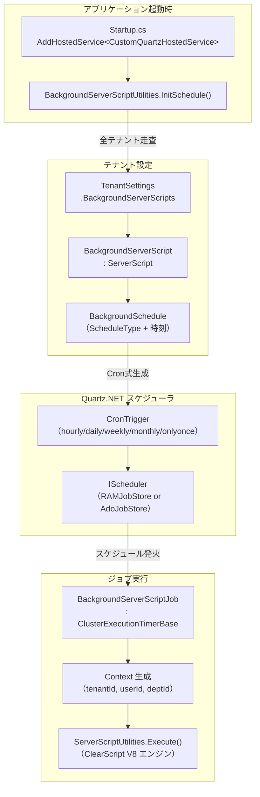
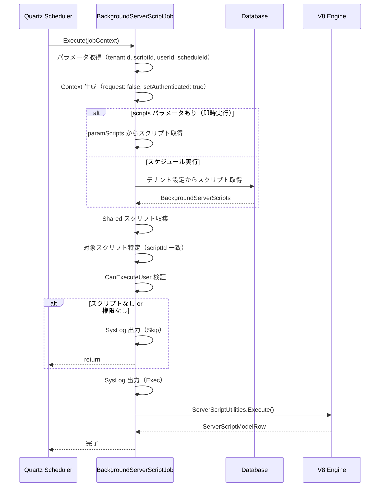
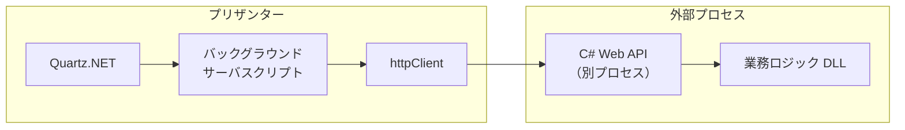
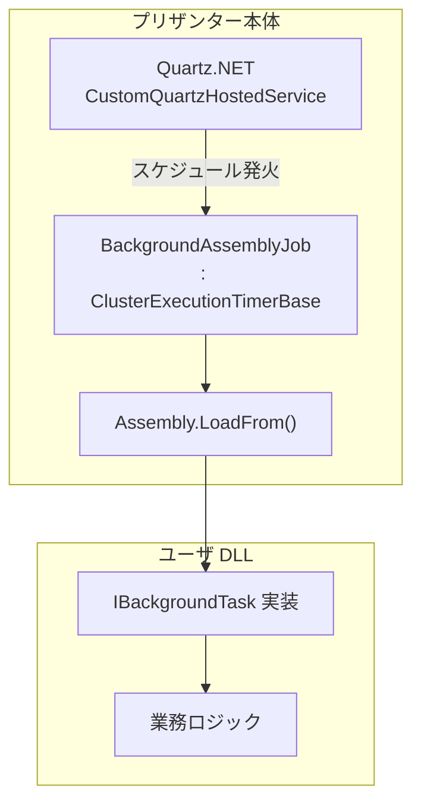
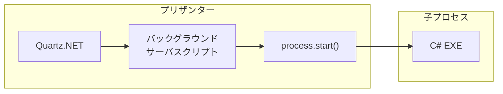
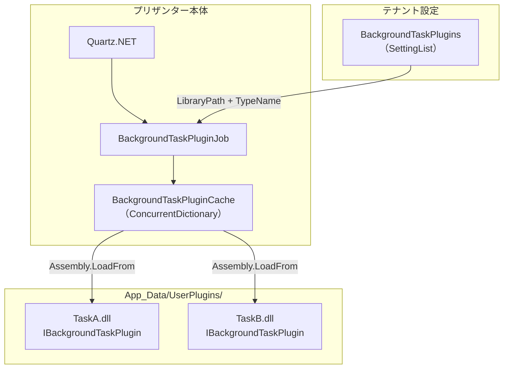
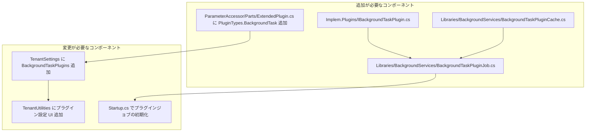

# バックグラウンドタスクでの C# DLL/EXE 実行

プリザンターのバックグラウンドサーバスクリプト機能を流用して、C# の DLL や EXE をスケジュール実行する方法を調査する。既存の Quartz.NET スケジューラ基盤・プラグイン読み込み機構を組み合わせた実装アプローチを検討する。

<!-- START doctoc generated TOC please keep comment here to allow auto update -->
<!-- DON'T EDIT THIS SECTION, INSTEAD RE-RUN doctoc TO UPDATE -->

- [調査情報](#調査情報)
- [調査目的](#調査目的)
- [既存のバックグラウンドサーバスクリプト実装](#既存のバックグラウンドサーバスクリプト実装)
    - [全体構成](#全体構成)
    - [BackgroundServerScriptJob の処理フロー](#backgroundserverscriptjob-の処理フロー)
    - [Context 生成の特殊処理](#context-生成の特殊処理)
- [スケジューラ基盤（Quartz.NET）](#スケジューラ基盤quartznet)
    - [CustomQuartzHostedService](#customquartzhostedservice)
    - [スケジュール種別と Cron 式生成](#スケジュール種別と-cron-式生成)
- [既存のプラグイン読み込み機構](#既存のプラグイン読み込み機構)
    - [ExtendedLibrary（ASP.NET Core 拡張）](#extendedlibraryaspnet-core-拡張)
    - [PdfPlugin（動的アセンブリ読み込み）](#pdfplugin動的アセンブリ読み込み)
- [C# DLL/EXE のバックグラウンド実行アプローチ](#c-dllexe-のバックグラウンド実行アプローチ)
    - [アプローチ 1: サーバスクリプトから httpClient 経由で呼び出し](#アプローチ-1-サーバスクリプトから-httpclient-経由で呼び出し)
    - [アプローチ 2: Quartz ジョブとして直接組み込み](#アプローチ-2-quartz-ジョブとして直接組み込み)
    - [アプローチ 3: サーバスクリプトから Process.Start で EXE 実行](#アプローチ-3-サーバスクリプトから-processstart-で-exe-実行)
    - [アプローチ 4: PdfPlugin パターンの汎用化](#アプローチ-4-pdfplugin-パターンの汎用化)
- [アプローチ比較](#アプローチ比較)
- [推奨アプローチ](#推奨アプローチ)
    - [短期: アプローチ 1（httpClient 経由）](#短期-アプローチ-1httpclient-経由)
    - [中期: アプローチ 4（Plugin 汎用化）](#中期-アプローチ-4plugin-汎用化)
- [実装上の注意点](#実装上の注意点)
    - [アセンブリ依存関係の競合](#アセンブリ依存関係の競合)
    - [タイムアウト制御](#タイムアウト制御)
    - [SysLog によるログ管理](#syslog-によるログ管理)
- [結論](#結論)
- [関連ソースコード](#関連ソースコード)
- [関連ドキュメント](#関連ドキュメント)

<!-- END doctoc generated TOC please keep comment here to allow auto update -->

## 調査情報

| 調査日       | リポジトリ | ブランチ | タグ/バージョン    | コミット    | 備考     |
| ------------ | ---------- | -------- | ------------------ | ----------- | -------- |
| 2026年3月2日 | Pleasanter | main     | Pleasanter_1.5.1.0 | `34f162a43` | 初回調査 |

## 調査目的

- バックグラウンドサーバスクリプトの既存実装を把握する
- C# DLL/EXE を組み込んでバックグラウンド実行する方法を検討する
- 既存のプラグイン読み込み機構（ExtendedLibrary / PdfPlugin）との連携可能性を評価する
- 実装アプローチごとのメリット・デメリットを比較する

---

## 既存のバックグラウンドサーバスクリプト実装

### 全体構成

バックグラウンドサーバスクリプトは、Quartz.NET スケジューラの上に構築されている。テナント設定に保存された JavaScript コードを、Quartz ジョブとして定期実行する仕組みである。



### BackgroundServerScriptJob の処理フロー

`BackgroundServerScriptJob` は `ClusterExecutionTimerBase` を継承し、`[DisallowConcurrentExecution]` 属性で同時実行を防止している。



**ソースコード**: `Libraries/BackgroundServices/BackgroundServerScriptJob.cs`（行 18-121）

### Context 生成の特殊処理

バックグラウンドスクリプト実行時は、HTTP リクエストが存在しない。そのため、通常とは異なる Context 生成パスを通る。

```csharp
// BackgroundServerScriptJob.CreateContext()（行 103-120）
var user = SiteInfo.User(
    context: new Context(tenantId: tenantId, request: false),
    userId: userId);
var context = new Context(
    tenantId: tenantId,
    userId: userId,
    deptId: user.DeptId,
    request: false,
    setAuthenticated: true);
context.SetTenantProperties(force: true);
context.BackgroundServerScript = true;
context.AbsoluteUri = Parameters.Service.AbsoluteUri;
```

`ServerScriptUtilities.Execute` 内では `context.BackgroundServerScript == true` の場合、
API リクエストボディのマージを行わず、最小限の Context を生成する（行 1300-1323）。

---

## スケジューラ基盤（Quartz.NET）

### CustomQuartzHostedService

`IHostedService` を実装し、ASP.NET Core のライフサイクルで Quartz スケジューラを管理する。

| 設定項目                 | シングルノード        | クラスタリング                     |
| ------------------------ | --------------------- | ---------------------------------- |
| JobStore                 | RAMJobStore（メモリ） | AdoJobStore（DB 永続化）           |
| 同時実行数               | デフォルト            | `MaxConcurrency`（デフォルト: 10） |
| DB プロバイダ            | なし                  | SQLServer / PostgreSQL / MySQL     |
| チェックインインターバル | なし                  | 15000ms                            |
| ミスファイア閾値         | なし                  | 60000ms                            |

**ソースコード**: `Libraries/BackgroundServices/CustomQuartzHostedService.cs`（行 14-126）

### スケジュール種別と Cron 式生成

`BackgroundServerScriptUtilities.GetTrigger()` メソッドで、スケジュール種別から Quartz の Cron 式（7 フィールド）を生成する。

| ScheduleType | Cron 式パターン                      | 例                           |
| ------------ | ------------------------------------ | ---------------------------- |
| `hourly`     | `0 {mm} * * * ? *`                   | 毎時 30 分: `0 30 * * * ? *` |
| `daily`      | `0 {mm} {hh} * * ? *`                | 毎日 9:00: `0 0 9 * * ? *`   |
| `weekly`     | `0 {mm} {hh} ? * {week} *`           | 月・水・金 18:00             |
| `monthly`    | `0 {mm} {hh} {days} {months} ? *`    | 毎月 1 日 0:00               |
| `onlyonce`   | `0 {mm} {hh} {day} {month} ? {year}` | 特定日時の 1 回実行          |

タイムゾーンは `BackgroundSchedule.ScheduleTimeZoneId` > `Parameters.Service.TimeZoneDefault` > UTC の優先順で決定される。

**ソースコード**: `Libraries/Settings/BackgroundServerScriptUtilities.cs`（行 111-178）

---

## 既存のプラグイン読み込み機構

プリザンター本体には 2 種類の外部 DLL 読み込み機構が存在する。

### ExtendedLibrary（ASP.NET Core 拡張）

起動時にアセンブリを動的読み込みし、Controller やサービスを追加する方式。

```text
{アプリケーション実行ディレクトリ}/
└── ExtendedLibraries/
    ├── MyExtension.dll
    └── SubFolder/
        └── AnotherExtension.dll
```

```csharp
// Startup.cs（行 293-303）
private IEnumerable<string> GetExtendedLibraryPaths()
{
    var basePath = Path.Combine(
        Path.GetDirectoryName(Assembly.GetEntryAssembly().Location),
        "ExtendedLibraries");
    // basePath + 1 階層のサブディレクトリを走査
}
```

`services.AddMvc().AddApplicationPart()` でアセンブリ内の Controller を ASP.NET Core に登録する。アプリケーション起動時に 1 回だけ読み込まれ、ホットリロードは不可。

**ソースコード**: `Startup.cs`（行 293-303）、`Libraries/Initializers/ExtensionInitializer.cs`

### PdfPlugin（動的アセンブリ読み込み）

実行時にアセンブリをオンデマンドで読み込み、インターフェース実装を探索する方式。

```csharp
// Libraries/Pdf/PdfPluginCache.cs
var lib = Path.Combine(
    Environments.CurrentDirectoryPath,
    "App_Data", "UserPlugins", libraryPath);
var assembly = Assembly.LoadFrom(lib);
var pluginType = assembly.GetTypes()
    .FirstOrDefault(t => !t.IsInterface && typeof(IPdfPlugin).IsAssignableFrom(t));
plugin = Activator.CreateInstance(pluginType) as IPdfPlugin;
```

| 項目               | ExtendedLibrary            | PdfPlugin                          |
| ------------------ | -------------------------- | ---------------------------------- |
| 配置場所           | `ExtendedLibraries/`       | `App_Data/UserPlugins/`            |
| 読み込みタイミング | 起動時                     | 初回使用時（遅延読み込み）         |
| キャッシュ         | ApplicationPart（永続）    | ConcurrentDictionary（プロセス内） |
| インターフェース   | Controller / ApiController | IPdfPlugin                         |
| 設定管理           | ファイルシステム           | Extensions テーブル（DB）          |
| ホットリロード     | 不可                       | 不可（キャッシュ済みのため）       |

**ソースコード**: `Libraries/Pdf/PdfPluginCache.cs`、`Implem.ParameterAccessor/Parts/ExtendedPlugin.cs`

---

## C# DLL/EXE のバックグラウンド実行アプローチ

### アプローチ 1: サーバスクリプトから httpClient 経由で呼び出し

バックグラウンドサーバスクリプト内の `httpClient` を使い、別プロセスで動作する C# アプリケーションを HTTP 経由で呼び出す。

```javascript
// バックグラウンドサーバスクリプト（JavaScript）
httpClient.RequestUri = 'http://localhost:5001/api/my-task';
httpClient.Content = JSON.stringify({ tenantId: context.TenantId });
let result = httpClient.Post();
if (!httpClient.IsSuccess) {
    logs.LogSystemError('Task failed: ' + httpClient.StatusCode);
}
```



| 項目               | 評価                                                  |
| ------------------ | ----------------------------------------------------- |
| 改修規模           | なし（既存機能のみ）                                  |
| プロセス分離       | 完全分離                                              |
| デプロイ           | 別途 Web API のデプロイが必要                         |
| エラーハンドリング | HTTP ステータスコードで判定可能                       |
| 認証・認可         | API キーや JWT 等の独自実装が必要                     |
| 制約               | `DisableServerScriptHttpClient` が `false` であること |

### アプローチ 2: Quartz ジョブとして直接組み込み

`BackgroundServerScriptJob` と同様に `ClusterExecutionTimerBase` を継承した新しいジョブクラスを作成し、C# DLL を直接呼び出す。

```csharp
// 新規ジョブクラスの実装例
public class BackgroundAssemblyJob : ClusterExecutionTimerBase
{
    public override async Task Execute(IJobExecutionContext jobContext)
    {
        var dataMap = jobContext.MergedJobDataMap;
        var tenantId = dataMap.GetInt("tenantId");
        var assemblyPath = dataMap.GetString("assemblyPath");
        var typeName = dataMap.GetString("typeName");

        await Task.Run(() =>
        {
            var context = CreateBackgroundContext(tenantId);
            try
            {
                var assembly = Assembly.LoadFrom(assemblyPath);
                var taskType = assembly.GetTypes()
                    .FirstOrDefault(t => typeof(IBackgroundTask).IsAssignableFrom(t)
                        && t.FullName == typeName);
                if (taskType == null) return;

                var task = Activator.CreateInstance(taskType) as IBackgroundTask;
                task.Execute(new BackgroundTaskContext
                {
                    TenantId = tenantId,
                    // 必要なコンテキスト情報を渡す
                });
            }
            catch (Exception e)
            {
                new SysLogModel(context: context, e: e);
            }
        }, jobContext.CancellationToken);
    }
}
```



| 項目               | 評価                                             |
| ------------------ | ------------------------------------------------ |
| 改修規模           | 中（新規ジョブクラス + UI + テナント設定の拡張） |
| プロセス分離       | なし（同一プロセス内で実行）                     |
| デプロイ           | DLL を `App_Data/UserPlugins/` 等に配置          |
| エラーハンドリング | try-catch + SysLog で統一                        |
| 認証・認可         | プリザンターの Context をそのまま利用可能        |
| 制約               | DLL の依存関係がプリザンター本体と競合する可能性 |

### アプローチ 3: サーバスクリプトから Process.Start で EXE 実行

サーバスクリプトに `System.Diagnostics.Process` を公開し、外部 EXE を実行する。

```javascript
// サーバスクリプトからの EXE 実行（仮想的な API）
let result = process.start({
    fileName: 'C:/Tasks/my-task.exe',
    arguments: '--tenant ' + context.TenantId,
    waitForExit: true,
    timeoutMs: 30000,
});
logs.LogInfo('Exit code: ' + result.exitCode);
```



| 項目               | 評価                                               |
| ------------------ | -------------------------------------------------- |
| 改修規模           | 小〜中（ホストオブジェクト追加）                   |
| プロセス分離       | 完全分離（子プロセス）                             |
| デプロイ           | EXE をサーバ上の任意パスに配置                     |
| エラーハンドリング | 終了コード + 標準出力で判定                        |
| 認証・認可         | EXE 側で独自に対応が必要                           |
| 制約               | セキュリティリスクが高い（任意コマンド実行の恐れ） |

### アプローチ 4: PdfPlugin パターンの汎用化

既存の `PdfPluginCache` のパターンを汎用化し、任意のインターフェースを実装した DLL をバックグラウンド実行する。

```csharp
// 汎用タスクプラグインインターフェース
public interface IBackgroundTaskPlugin
{
    string Name { get; }
    BackgroundTaskResult Execute(BackgroundTaskContext context);
}

public class BackgroundTaskContext
{
    public int TenantId { get; set; }
    public int UserId { get; set; }
    public string Parameters { get; set; }  // JSON
}

public class BackgroundTaskResult
{
    public bool Success { get; set; }
    public string Message { get; set; }
}
```



| 項目               | 評価                                                      |
| ------------------ | --------------------------------------------------------- |
| 改修規模           | 中〜大（インターフェース定義 + ジョブ + キャッシュ + UI） |
| プロセス分離       | なし（同一プロセス内）                                    |
| デプロイ           | DLL を `App_Data/UserPlugins/` に配置                     |
| エラーハンドリング | インターフェースで統一された結果型                        |
| 認証・認可         | プリザンターの Context 情報を渡せる                       |
| 制約               | 依存関係の競合に注意が必要                                |

---

## アプローチ比較

| 観点               | アプローチ 1<br/>httpClient | アプローチ 2<br/>Quartz ジョブ | アプローチ 3<br/>Process.Start | アプローチ 4<br/>Plugin 汎用化 |
| ------------------ | --------------------------- | ------------------------------ | ------------------------------ | ------------------------------ |
| 改修規模           | なし                        | 中                             | 小〜中                         | 中〜大                         |
| プリザンター改修   | 不要                        | 必要                           | 必要                           | 必要                           |
| プロセス分離       | あり                        | なし                           | あり                           | なし                           |
| 既存機構の流用度   | 高                          | 高                             | 低                             | 高                             |
| セキュリティリスク | 低                          | 中                             | 高                             | 中                             |
| スケーラビリティ   | 高                          | 中                             | 低                             | 中                             |
| デバッグ容易性     | 中                          | 高                             | 低                             | 高                             |
| クラスタリング対応 | 対応済み                    | 対応可能                       | ノード依存                     | 対応可能                       |

---

## 推奨アプローチ

### 短期: アプローチ 1（httpClient 経由）

プリザンター本体の改修が不要で、即座に利用可能である。C# で Web API を作成し、バックグラウンドサーバスクリプトから HTTP で呼び出す構成が最もリスクが低い。

実装手順:

1. C# で ASP.NET Core Minimal API または Controller ベースの Web API を作成する
2. 業務ロジックを DLL として実装し、Web API から呼び出す
3. プリザンターのバックグラウンドサーバスクリプトで `httpClient` を使って呼び出す
4. 必要に応じて API キー等の認証を追加する

### 中期: アプローチ 4（Plugin 汎用化）

`PdfPlugin` のパターンを参考に、バックグラウンドタスク用の汎用プラグイン機構を実装する。以下の改修が必要になる。



---

## 実装上の注意点

### アセンブリ依存関係の競合

同一プロセス内で DLL を読み込む場合（アプローチ 2, 4）、プリザンター本体と DLL の依存ライブラリのバージョンが競合する可能性がある。

| 競合パターン                 | 影響                           | 対策                                  |
| ---------------------------- | ------------------------------ | ------------------------------------- |
| 同一ライブラリの異バージョン | `FileLoadException` / 動作不正 | `AssemblyLoadContext` で分離          |
| プリザンター本体 DLL の参照  | バージョン固定が必要           | `Implem.Plugins` プロジェクトのみ参照 |
| ネイティブライブラリの競合   | クラッシュ                     | プロセス分離（アプローチ 1 or 3）     |

`AssemblyLoadContext` を使うことで、プラグイン DLL を独立したコンテキストに読み込み、依存関係の競合を軽減できる。

```csharp
// AssemblyLoadContext による分離読み込み
public class PluginLoadContext : AssemblyLoadContext
{
    private AssemblyDependencyResolver _resolver;

    public PluginLoadContext(string pluginPath) : base(isCollectible: true)
    {
        _resolver = new AssemblyDependencyResolver(pluginPath);
    }

    protected override Assembly Load(AssemblyName assemblyName)
    {
        string assemblyPath = _resolver.ResolveAssemblyToPath(assemblyName);
        if (assemblyPath != null)
        {
            return LoadFromAssemblyPath(assemblyPath);
        }
        return null;  // デフォルト ALCにフォールバック
    }
}
```

### タイムアウト制御

バックグラウンドサーバスクリプトには `ServerScript.TimeOut` プロパティでタイムアウトを設定できる。C# DLL 実行でも同様のタイムアウト制御が必要である。

| 方式          | タイムアウト制御                                    |
| ------------- | --------------------------------------------------- |
| httpClient    | `ServerScriptModelHttpClient.TimeOut`               |
| Quartz ジョブ | `CancellationToken` を利用                          |
| Process.Start | `Process.WaitForExit(timeout)`                      |
| Plugin        | `CancellationToken` を IBackgroundTaskPlugin に渡す |

### SysLog によるログ管理

既存のバックグラウンドサーバスクリプトは `SysLogModel` でログを記録している。新しいバックグラウンドタスク実行機構でも同じパターンを踏襲すべきである。

```csharp
// 既存のログパターン（BackgroundServerScriptJob.cs 行 60-64）
var log = new SysLogModel(
    context: sqlContext,
    method: nameof(BackgroundServerScriptJob) + ":" + nameof(Execute),
    message: $"Exec BGServerScript TenantId={tenantId},ScriptId={scriptId}",
    sysLogType: SysLogModel.SysLogTypes.Info);
// ... 処理実行 ...
log.Finish(context: sqlContext);
```

---

## 結論

| 項目                  | 内容                                                                                                                       |
| --------------------- | -------------------------------------------------------------------------------------------------------------------------- |
| 既存基盤              | Quartz.NET 3.x + CustomQuartzHostedService で堅牢なスケジューラ基盤が存在する                                              |
| 最小改修アプローチ    | バックグラウンドサーバスクリプトの `httpClient` で外部 Web API を呼び出す（プリザンター改修不要）                          |
| 組み込みアプローチ    | `PdfPluginCache` パターンを汎用化し、`IBackgroundTaskPlugin` インターフェースで DLL を動的読み込み・実行する               |
| Quartz ジョブ直接方式 | `ClusterExecutionTimerBase` 継承で Quartz ジョブを追加する方式も可能だが、テナント設定 UI の改修が必要                     |
| プロセス分離の要否    | 依存関係の競合リスクがある場合は httpClient 経由（アプローチ 1）が安全。競合がなければ Plugin 方式（アプローチ 4）が効率的 |
| セキュリティ          | `Process.Start` 方式はコマンドインジェクションのリスクが高く、本番環境では推奨しない                                       |
| 推奨順序              | 短期: アプローチ 1（httpClient） → 中期: アプローチ 4（Plugin 汎用化）                                                     |

---

## 関連ソースコード

| ファイル                                                                      | 説明                                 |
| ----------------------------------------------------------------------------- | ------------------------------------ |
| `Implem.Pleasanter/Libraries/BackgroundServices/BackgroundServerScriptJob.cs` | バックグラウンドスクリプトジョブ     |
| `Implem.Pleasanter/Libraries/BackgroundServices/CustomQuartzHostedService.cs` | Quartz.NET ホステッドサービス        |
| `Implem.Pleasanter/Libraries/BackgroundServices/ClusterExecutionTimerBase.cs` | ジョブ基底クラス（同時実行防止）     |
| `Implem.Pleasanter/Libraries/BackgroundServices/ExecutionTimerBase.cs`        | ジョブ基底クラス（Context/Log 生成） |
| `Implem.Pleasanter/Libraries/Settings/BackgroundServerScript.cs`              | バックグラウンドスクリプト定義       |
| `Implem.Pleasanter/Libraries/Settings/BackgroundServerScriptUtilities.cs`     | スケジュール管理・Cron 式生成        |
| `Implem.Pleasanter/Libraries/Settings/BackgroundSchedule.cs`                  | スケジュール定義                     |
| `Implem.Pleasanter/Libraries/ServerScripts/ServerScriptUtilities.cs`          | スクリプト実行ロジック               |
| `Implem.Pleasanter/Libraries/ServerScripts/ServerScriptModelHttpClient.cs`    | HTTP クライアントホストオブジェクト  |
| `Implem.Pleasanter/Libraries/Pdf/PdfPluginCache.cs`                           | PDF プラグインキャッシュ             |
| `Implem.Pleasanter/Implem.ParameterAccessor/Parts/ExtendedPlugin.cs`          | プラグイン設定                       |
| `Implem.Pleasanter/Implem.ParameterAccessor/Parts/Script.cs`                  | スクリプトパラメータ                 |
| `Implem.Pleasanter/Startup.cs`                                                | サービス登録・初期化                 |

## 関連ドキュメント

| ドキュメント                                                                                    | 説明                                    |
| ----------------------------------------------------------------------------------------------- | --------------------------------------- |
| [ServerScript 実装](001-ServerScript実装.md)                                                    | ClearScript V8 統合・ホストオブジェクト |
| [拡張ライブラリ（ExtendedLibrary）の仕様と使い方](../15-拡張機能・多言語/001-拡張ライブラリ.md) | ExtendedLibrary の DLL 読み込み機構     |
