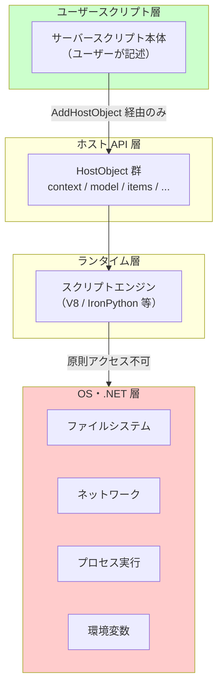
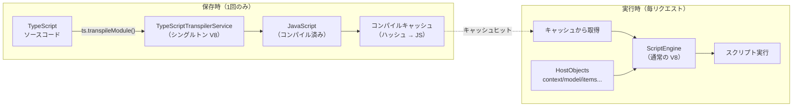
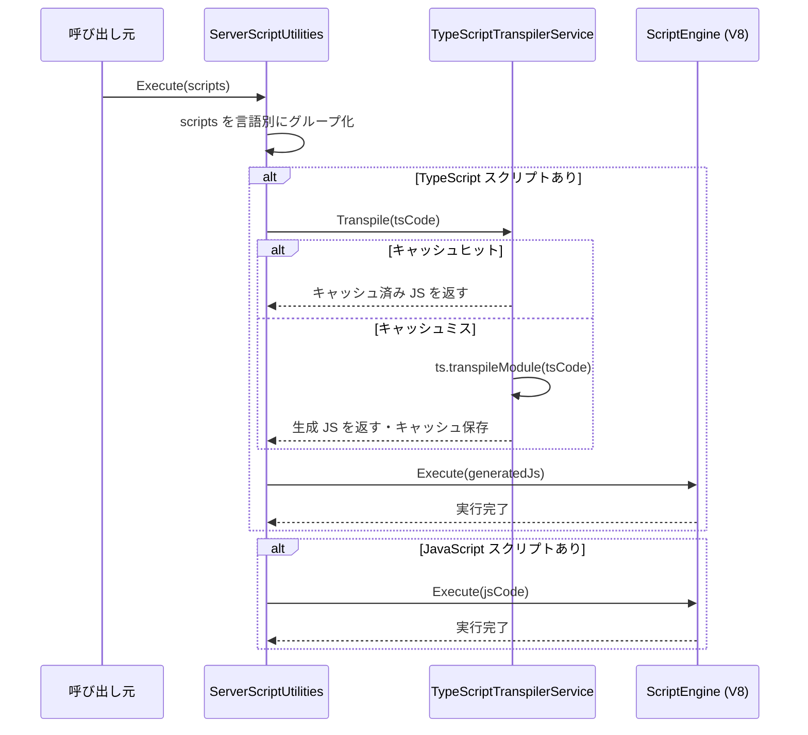
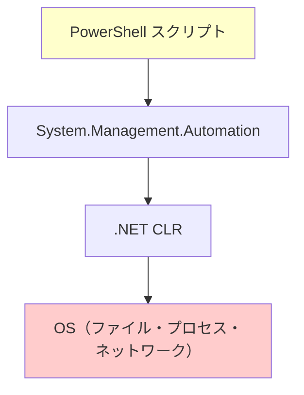
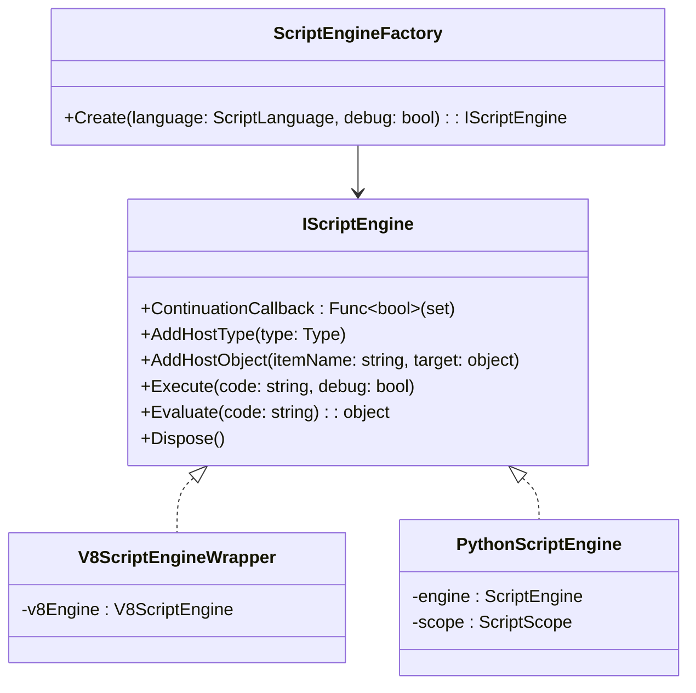
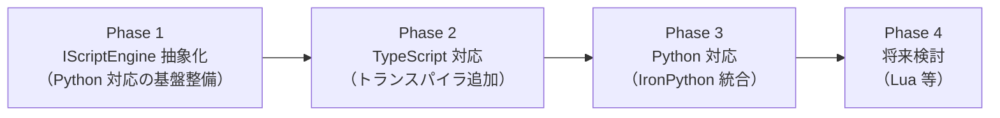

# ServerScript TypeScript（および MS 系言語）対応の実現可能性調査

サーバースクリプト（ServerScript）に TypeScript をはじめとする MS 系言語サポートを追加するための実現可能性、実装方針、セキュリティ設計を調査する。Python 対応（[002-ServerScript-Python対応.md](002-ServerScript-Python対応.md)）で確立したセキュリティ原則・層分離設計を基準に、各言語の採用可否を評価する。

<!-- START doctoc generated TOC please keep comment here to allow auto update -->
<!-- DON'T EDIT THIS SECTION, INSTEAD RE-RUN doctoc TO UPDATE -->

- [調査情報](#調査情報)
- [調査目的](#調査目的)
- [前提：Python 対応で確立したセキュリティ原則](#前提python-対応で確立したセキュリティ原則)
    - [層分離の要件](#層分離の要件)
    - [各言語が満たすべき基準](#各言語が満たすべき基準)
- [候補言語の概観](#候補言語の概観)
- [TypeScript](#typescript)
    - [TypeScript の特徴と採用理由](#typescript-の特徴と採用理由)
    - [.NET における TypeScript 実行方式の比較](#net-における-typescript-実行方式の比較)
    - [推奨アプローチ B: 共有エンジンによる保存時コンパイル](#推奨アプローチ-b-共有エンジンによる保存時コンパイル)
    - [セキュリティ分析](#セキュリティ分析)
    - [ホストオブジェクトとの互換性](#ホストオブジェクトとの互換性)
    - [UI・エディタ対応](#uiエディタ対応)
    - [リスク評価](#リスク評価)
- [他の MS 系言語候補の評価](#他の-ms-系言語候補の評価)
    - [PowerShell](#powershell)
    - [F# Scripting（FSharp.Compiler.Service）](#f-scriptingfsharpcompilerservice)
    - [VBScript / VB.NET Script](#vbscript--vbnet-script)
    - [Lua（MoonSharp）— 参考：MS 系ではないが比較対象として](#luamoonsharp-参考ms-系ではないが比較対象として)
- [言語別比較マトリクス](#言語別比較マトリクス)
    - [基本特性](#基本特性)
    - [セキュリティ・サンドボックス](#セキュリティサンドボックス)
    - [実装コスト](#実装コスト)
- [TypeScript 実装の詳細設計](#typescript-実装の詳細設計)
    - [NuGet / リソース依存](#nuget--リソース依存)
    - [TypeScriptTranspilerService（実装スケッチ）](#typescripttranspilerservice実装スケッチ)
    - [ScriptEngine インターフェース（再掲）](#scriptengine-インターフェース再掲)
    - [ServerScript データモデル変更（Language プロパティ）](#serverscript-データモデル変更language-プロパティ)
    - [ServerScriptUtilities の変更箇所](#serverscriptutilities-の変更箇所)
    - [UI 変更: 言語選択ドロップダウン](#ui-変更-言語選択ドロップダウン)
    - [型定義ファイル（d.ts）の構成](#型定義ファイルdtsの構成)
- [パフォーマンス特性](#パフォーマンス特性)
- [結論](#結論)
    - [採用推奨言語](#採用推奨言語)
    - [実装優先度](#実装優先度)
- [関連ドキュメント](#関連ドキュメント)
- [関連ソースコード](#関連ソースコード)
- [関連リンク](#関連リンク)

<!-- END doctoc generated TOC please keep comment here to allow auto update -->

## 調査情報

| 調査日       | リポジトリ | ブランチ | タグ/バージョン    | コミット    | 備考     |
| ------------ | ---------- | -------- | ------------------ | ----------- | -------- |
| 2026年3月8日 | Pleasanter | main     | Pleasanter_1.5.1.0 | `34f162a43` | 初回調査 |

## 調査目的

- Python 対応で確立したセキュリティ原則・層分離設計を基準に、TypeScript をはじめとする MS 系言語の実現可能性を評価する
- TypeScript を ServerScript に追加する具体的な実装方針（トランスパイル方式・エンジン設計・セキュリティ）を明らかにする
- TypeScript 以外の MS 系言語（PowerShell、F#、VBScript）の採用可否を評価する
- 実現可能な言語を比較マトリクスで整理し、導入優先度を明確にする

---

## 前提：Python 対応で確立したセキュリティ原則

詳細は [002-ServerScript-Python対応.md](002-ServerScript-Python対応.md) を参照。  
本調査では以下の原則を各言語の評価基準として使用する。

### 層分離の要件



### 各言語が満たすべき基準

| 基準                    | 説明                                                                   |
| ----------------------- | ---------------------------------------------------------------------- |
| ホストオブジェクト注入  | `AddHostObject` 相当の機構で `context`/`model`/`items` 等を注入できる  |
| OS 操作の遮断           | ファイル I/O・プロセス実行・ネットワーク直接接続が原則不可能           |
| タイムアウト制御        | 無限ループ・長時間実行を既存の `ContinuationCallback` 相当で制御できる |
| .NET 既存依存との整合性 | 追加依存は NuGet のみ（ネイティブ DLL 追加・外部プロセス必須は避ける） |
| 後方互換性              | 既存 JavaScript スクリプトへの影響なし                                 |

---

## 候補言語の概観

| 言語             | ライブラリ                          | MS 系 | サンドボックス                   | 推奨度 |
| ---------------- | ----------------------------------- | ----- | -------------------------------- | ------ |
| **TypeScript**   | 既存 ClearScript V8 + typescript.js | ◎     | V8 と同等（実行はJS）            | ◎ 推奨 |
| **PowerShell**   | Microsoft.PowerShell.SDK            | ◎     | 困難（設計上 OS 操作前提）       | ×      |
| **F# Scripting** | FSharp.Compiler.Service             | ○     | C# Script 相当（.NET CLR上）     | △      |
| **VBScript**     | なし（非推奨）                      | △     | 困難（.NET 未対応）              | ×      |
| **Lua**          | MoonSharp                           | ×     | 優秀（設計上サンドボックス前提） | ○ 参考 |

---

## TypeScript

### TypeScript の特徴と採用理由

TypeScript は Microsoft が開発・管理するオープンソース言語であり、JavaScript のスーパーセットとして設計されている。

| 特徴              | 内容                                                          |
| ----------------- | ------------------------------------------------------------- |
| 開発元            | Microsoft（Apache 2.0）                                       |
| 実行モデル        | TypeScript はコンパイル時に JavaScript へトランスパイルされる |
| 型システム        | 静的型付け（型注釈は実行時に消去）                            |
| JavaScript 互換性 | すべての JavaScript は valid TypeScript                       |
| ランタイム        | 実行は JavaScript（V8 と同一）                                |
| .NET との親和性   | VS Code・Azure・TypeScript 自体が .NET エコシステムと深く統合 |

プリザンターのサーバースクリプトに TypeScript を追加する主な動機：

- 型安全性により、スクリプト記述時のミスを早期検出できる
- 既存の JavaScript スクリプトをそのまま TypeScript として動作させられる
- VS Code の IntelliSense / 型補完が使えるようになる（型定義ファイル提供により）
- 実行エンジンは既存の V8（ClearScript）をそのまま使用するため、セキュリティモデルに変更なし

### .NET における TypeScript 実行方式の比較

| アプローチ                                | 概要                                                            | 推奨度 |
| ----------------------------------------- | --------------------------------------------------------------- | ------ |
| **A: V8 内での実行時トランスパイル**      | リクエストごとに typescript.js を V8 内でロードしトランスパイル | △      |
| **B: 共有エンジンによる保存時コンパイル** | 専用シングルトン V8 エンジンでコンパイルキャッシュ              | ◎ 推奨 |
| **C: Node.js プロセス経由**               | Jering.Javascript.NodeJS 等で Node.js プロセスを起動            | △      |

**アプローチ A の問題点：**

現行の `ScriptEngine` はリクエストごとに `new ScriptEngine(debug)` → `Dispose()` を繰り返す（`ServerScriptUtilities.cs:1127`）。  
`typescript.js`（npm パッケージの minified 版で約 6 MB）をリクエストごとにロードすると、実行ごとに数百 ms のオーバーヘッドが発生する。

**アプローチ B が推奨される理由：**

- TypeScript コンパイラを専用のシングルトン V8 エンジンでホスト（起動コスト 1 回のみ）
- スクリプト保存時（または初回実行時）にトランスパイルし、コンパイル済み JavaScript をキャッシュ
- 実行時には通常の `ScriptEngine`（V8）でキャッシュ済み JavaScript を実行
- セキュリティモデルは変更なし（実行は既存 V8）
- 新規 NuGet パッケージ不要（`typescript.js` を埋め込みリソースとして追加するのみ）

**アプローチ C の問題点：**

- Node.js のサーバーインストールが必要（NuGet のみ依存という原則に反する）
- プロセス間通信のオーバーヘッド

### 推奨アプローチ B: 共有エンジンによる保存時コンパイル

#### 設計概要



#### TypeScriptTranspilerService の実装スケッチ

**ファイル**: `Implem.Pleasanter/Libraries/ServerScripts/TypeScriptTranspilerService.cs`（新規）

```csharp
using Microsoft.ClearScript.V8;
using System;
using System.Collections.Concurrent;
using System.IO;
using System.Reflection;
using System.Security.Cryptography;
using System.Text;

namespace Implem.Pleasanter.Libraries.ServerScripts
{
    /// <summary>
    /// TypeScript コードを JavaScript にトランスパイルするシングルトンサービス。
    /// 専用の V8 エンジンに typescript.js を一度だけロードし、
    /// ts.transpileModule() を通じて変換する。
    /// 変換結果はハッシュ単位でメモリキャッシュする。
    /// </summary>
    public sealed class TypeScriptTranspilerService : IDisposable
    {
        private static readonly Lazy<TypeScriptTranspilerService> _instance =
            new(() => new TypeScriptTranspilerService());

        public static TypeScriptTranspilerService Instance => _instance.Value;

        private readonly V8ScriptEngine _compilerEngine;
        private readonly ConcurrentDictionary<string, string> _cache = new();
        private readonly object _compileLock = new();

        private TypeScriptTranspilerService()
        {
            _compilerEngine = new V8ScriptEngine(V8ScriptEngineFlags.None);

            // 埋め込みリソースから typescript.js を読み込む
            var asm = Assembly.GetExecutingAssembly();
            using var stream = asm.GetManifestResourceStream(
                "Implem.Pleasanter.Resources.typescript.min.js");
            using var reader = new StreamReader(stream!);
            var typescriptJs = reader.ReadToEnd();

            _compilerEngine.Execute(typescriptJs);
        }

        /// <summary>
        /// TypeScript ソースコードを JavaScript にトランスパイルする。
        /// 同一ソースのキャッシュが存在する場合はキャッシュを返す。
        /// </summary>
        /// <param name="typeScriptCode">TypeScript ソースコード</param>
        /// <returns>トランスパイル後の JavaScript コード</returns>
        public string Transpile(string typeScriptCode)
        {
            var hash = ComputeHash(typeScriptCode);

            return _cache.GetOrAdd(hash, _ =>
            {
                lock (_compileLock)
                {
                    // ダブルチェック
                    if (_cache.TryGetValue(hash, out var cached))
                        return cached;

                    return TranspileInternal(typeScriptCode);
                }
            });
        }

        private string TranspileInternal(string typeScriptCode)
        {
            // ts.transpileModule() で TypeScript → JavaScript に変換
            // compilerOptions: target ES2020, strict モードは無効（既存 JS との互換性）
            var escapedCode = typeScriptCode
                .Replace("\\", "\\\\")
                .Replace("`", "\\`");

            var script = $@"
(function() {{
    var result = ts.transpileModule(`{escapedCode}`, {{
        compilerOptions: {{
            target: ts.ScriptTarget.ES2020,
            module: ts.ModuleKind.None,
            strict: false,
            noEmitOnError: false
        }},
        reportDiagnostics: true
    }});
    return result.outputText;
}})()";

            var outputJs = _compilerEngine.Evaluate(script) as string;

            if (string.IsNullOrWhiteSpace(outputJs))
                throw new InvalidOperationException(
                    "TypeScript transpilation returned empty output.");

            return outputJs;
        }

        private static string ComputeHash(string input)
        {
            var bytes = SHA256.HashData(Encoding.UTF8.GetBytes(input));
            return Convert.ToHexString(bytes);
        }

        /// <summary>
        /// コンパイルキャッシュをクリアする。
        /// スクリプトが更新された際にサイト設定保存ハンドラから呼ぶ。
        /// </summary>
        public void ClearCache() => _cache.Clear();

        public void Dispose()
        {
            _compilerEngine.Dispose();
        }
    }
}
```

> **スレッド安全性**: `_compilerEngine.Evaluate()` はスレッドセーフではないため、
> トランスパイル処理全体を `lock (_compileLock)` で保護する。
> キャッシュヒット時は `ConcurrentDictionary.GetOrAdd` でロックフリーに返却するため、
> 実行時のホットパスにはロックが発生しない。

#### ServerScript データモデルへの影響

TypeScript スクリプトの実行フローでは、
`ServerScript.Body` に TypeScript コードを保存し、
実行前にトランスパイルして V8 に渡す。

既存の `Language` プロパティ（Python 対応で追加予定）に `TypeScript = 2` を追加する。

**ファイル**: `Implem.Pleasanter/Libraries/Settings/ServerScript.cs`

```csharp
public enum ScriptLanguage
{
    JavaScript = 0,  // デフォルト（後方互換性）
    Python = 1,
    TypeScript = 2   // 追加
}
```

#### 実行フロー（変更後）



### セキュリティ分析

#### V8 と同等のサンドボックス保証

TypeScript の最大の利点は、**実行フェーズのセキュリティが既存 JavaScript と完全に同一**である点にある。

```text
現行 JavaScript:
  TypeScript ソース → [なし] → V8 実行
                                ↑
                          OS API = 存在しない（原理的保証）

TypeScript 追加後:
  TypeScript ソース → [ts.transpileModule] → JavaScript → V8 実行
                       ↑コンパイルのみ                    ↑
                    型注釈を消去                    OS API = 存在しない（原理的保証）
```

TypeScript の型注釈（`: string`、`interface Foo {}`等）はトランスパイル時に**完全に消去**される。  
実行時に残るのは純粋な JavaScript であり、V8 のサンドボックス特性はそのまま維持される。

#### TypeScript 固有のリスク検討

| リスク                            | 評価 | 対策                                                                     |
| --------------------------------- | ---- | ------------------------------------------------------------------------ |
| `declare` による型拡張            | なし | 型宣言は実行時に消去されるため、ランタイムへの影響なし                   |
| `namespace` / `module` キーワード | なし | `module: ts.ModuleKind.None` 指定により CommonJS/ESM 構文を禁止          |
| `/// <reference>` ディレクティブ  | 低   | トランスパイル結果に影響しない（型情報のみ）                             |
| デコレータ（`@Decorator`）        | なし | メタデータ生成オプションを無効化（`emitDecoratorMetadata: false`）       |
| 動的 import（`import()`）         | 低   | ES Module は V8 側でも制限済み。`module: None` で構文エラーに            |
| `as unknown as T` キャスト        | なし | 型キャストは実行時に消去。V8 のサンドボックスを迂回できない              |
| コンパイルエンジン自体への攻撃    | 低   | コンパイルは専用シングルトンエンジン（ユーザーコード実行エンジンと分離） |

> **結論**: TypeScript のセキュリティリスクは既存 JavaScript と同等か、それ以下である。  
> トランスパイル後の JavaScript が V8 で実行されるという構造上、  
> JavaScript では不可能な操作を TypeScript から行うことは**原理的に不可能**。

### ホストオブジェクトとの互換性

既存の `AddHostObject` で注入された `ExpandoObject` ベースのホストオブジェクトは、  
トランスパイル後の JavaScript からもそのまま参照可能であり、変更不要。

```typescript
// TypeScript スクリプト例（サーバースクリプトとして記述）
const title: string = model.Title as string;
const userId: number = context.UserId as number;

if (userId === 0) {
    context.ErrorData.Type = 1;
}

model.ClassA = `処理済み: ${title}`;

// items.Get() 等のメソッド呼び出しも同様
const result = items.Get(123) as any;
```

#### 型定義ファイル（d.ts）の提供

TypeScript の型補完を有効にするために、ホストオブジェクトの型定義ファイルを提供する。

**ファイル**: `pleasanter.d.ts`（ダウンロード提供または VS Code 拡張として配布）

```typescript
// pleasanter.d.ts（型定義ファイルの例）
declare const context: {
    readonly UserId: number;
    readonly LoginId: string;
    readonly DeptId: number;
    readonly SiteId: number;
    readonly Language: string;
    readonly Controller: string;
    readonly Action: string;
    ErrorData: { Type: number };
};

declare const model: {
    Title: string;
    Body: string;
    SiteId: number;
    ClassA: string | null;
    ClassB: string | null;
    // ... ClassA〜ClassZ, NumA〜NumZ, DateA〜DateZ 等
    [key: string]: any;
};

declare const items: {
    Get(id: number): any;
    Create(siteId: number, body: object): any;
    Update(id: number, body: object): any;
    Delete(id: number): any;
    // ...
};

// ... その他ホストオブジェクト
```

> **注意**: 型定義ファイルは IDE サポート（補完・型チェック）専用であり、  
> サーバー側の実行時には使用されない。プリザンター本体のコードに含める必要はない。

### UI・エディタ対応

サーバースクリプトダイアログには既存の JavaScript 言語セレクタ（Python 対応で追加予定）に  
`TypeScript` 選択肢を追加する。

**ファイル**: `Implem.Pleasanter/Models/Sites/SiteUtilities.cs`（`ServerScriptDialog` メソッド）

```csharp
.FieldDropDown(
    controlId: "ServerScriptLanguage",
    fieldCss: "field-normal",
    controlCss: " always-send",
    labelText: Displays.Language(context: context),
    optionCollection: new Dictionary<string, string>
    {
        { "0", "JavaScript" },
        { "1", "Python" },
        { "2", "TypeScript" }   // 追加
    },
    selectedValue: script.Language?.ToString() ?? "0")
```

コードエディタ（CodeMirror / Monaco）の言語モード：

| 言語       | エディタモード | 設定                       |
| ---------- | -------------- | -------------------------- |
| JavaScript | `javascript`   | 現行のまま                 |
| Python     | `python`       | Python 対応で追加          |
| TypeScript | `typescript`   | `language: 2` 選択時に切替 |

### リスク評価

| リスク                                    | 影響度 | 発生確率 | 対策                                                               |
| ----------------------------------------- | ------ | -------- | ------------------------------------------------------------------ |
| typescript.js のバージョン管理            | 低     | 低       | 埋め込みリソースとして固定バージョン管理。更新は明示的なリリースで |
| TypeScriptTranspilerService のメモリ      | 低     | 低       | キャッシュ上限設定（LRU キャッシュへの変更で対応可能）             |
| `ts.transpileModule` のタイムアウト       | 低     | 低       | 通常 10ms 以内。念のためコンパイル用に別タイムアウト設定           |
| コンパイルエンジンの並行アクセス          | 低     | 中       | `_compileLock` でシリアライズ。キャッシュヒット時はロックフリー    |
| TypeScript 構文エラー時のエラーメッセージ | 中     | 中       | `reportDiagnostics: true` でエラー詳細を取得し、ユーザーに表示     |

---

## 他の MS 系言語候補の評価

### PowerShell

#### 概要

| 項目         | 内容                                                            |
| ------------ | --------------------------------------------------------------- |
| 開発元       | Microsoft（MIT）                                                |
| NuGet        | `Microsoft.PowerShell.SDK`（約 50 MB）                          |
| ランタイム   | .NET 上の PowerShell ランタイム（System.Management.Automation） |
| ホスト注入   | `InitialSessionState` / `PSVariable` で変数を渡せる             |
| .NET 10 対応 | Yes（PowerShell 7.x）                                           |



#### セキュリティ評価

PowerShell は**システム管理を目的として設計された言語**であり、OS 操作が言語の核心機能となっている。

| 操作                    | PowerShell での実現                                |
| ----------------------- | -------------------------------------------------- |
| ファイル読み書き        | `Get-Content`、`Set-Content` で可能                |
| プロセス実行            | `Start-Process`、`Invoke-Command` で可能           |
| ネットワーク通信        | `Invoke-WebRequest`、`New-NetTCPConnection` で可能 |
| .NET クラス直接アクセス | `[System.IO.File]::ReadAllText()` 等で可能         |
| レジストリ操作          | `Get-Item HKLM:\...` で可能                        |

**サンドボックス実現の困難さ：**

PowerShell には `Constrained Language Mode`（`$ExecutionContext.SessionState.LanguageMode = "ConstrainedLanguage"`) という制限モードが存在するが：

- `ConstrainedLanguage` でも `Get-Content` / `New-Object` 等の基本コマンドレットは使用可能
- 完全なホワイトリスト方式の制御には `AppLocker` / `WDAC`（Windows Defender Application Control）が必要
- WDAC は OS レベルのポリシーであり、アプリケーションレベルでの制御は不可能
- `LanguageMode = "NoLanguage"` にすると変数代入すら禁止され、実用的なスクリプトが書けない

#### 結論

PowerShell は**採用不可**。

システム管理目的で設計された言語であり、アプリケーションレベルでの OS 操作遮断が技術的に困難。  
「値操作のみ許可」という ServerScript の設計原則との根本的な相違がある。

---

### F# Scripting（FSharp.Compiler.Service）

#### 概要

| 項目         | 内容                                                |
| ------------ | --------------------------------------------------- |
| 開発元       | Microsoft / F# Software Foundation（Apache 2.0）    |
| NuGet        | `FSharp.Compiler.Service`（約 30 MB）               |
| ランタイム   | .NET CLR 上で直接実行（Roslyn の F# 版に相当）      |
| ホスト注入   | `InteractiveChecker` / `ScriptState` で変数渡し可能 |
| .NET 10 対応 | Yes（FCS 43.8.x）                                   |

```fsharp
// F# スクリプト実行例（ホストオブジェクト参照）
// model.ClassA <- "test"  // ExpandoObject へのアクセス
// let userId = context.UserId
```

#### セキュリティ評価

F# Scripting は .NET CLR 上で直接実行されるため、セキュリティモデルは **C# Script（Roslyn）と同等**。

[004-CSharpScript-Roslyn対応.md](004-CSharpScript-Roslyn対応.md) で検討した C# Script の課題がそのまま適用される：

| 問題                           | F# Script での状況                            |
| ------------------------------ | --------------------------------------------- |
| .NET CLR 直接アクセス          | `System.IO.File` 等に直接アクセス可能         |
| `open System.IO` 等の封鎖      | F# の構文木解析でブロック可能だが完全ではない |
| リフレクション経由のエスケープ | `typeof<obj>.Assembly.GetTypes()` 等で可能    |
| 構文木（SyntaxTree）検査の限界 | C# Script と同様に限界あり（迂回手段が存在）  |

ただし C# Script と比較した F# の特徴：

- F# は純粋関数型パラダイムが中心であり、副作用を起こしにくい文化的背景がある
- F# の構文は C# より制限が多く（ミュータブルは `mutable` キーワード明示）、安全性は若干高い
- `ExpandoObject`（動的オブジェクト）への F# からのアクセスは `?` 演算子拡張等が必要であり、JavaScript/Python と比べてホスト API 連携の相性がやや低い

#### 結論

F# Scripting は**条件付きで検討可能**だが、優先度は低い。

C# Script と同様の構文木検査ベースのサンドボックスが必要であり、実装コストが高い。  
また `ExpandoObject` との連携が JavaScript/Python より複雑になるため、ユーザー体験も劣る。  
TypeScript と比較して MS 系ではあるが、ServerScript の用途（フォーム値操作・バリデーション）に対して F# の関数型パラダイムはミスマッチが生じやすい。

---

### VBScript / VB.NET Script

#### 概要

| 項目             | 内容                                                                    |
| ---------------- | ----------------------------------------------------------------------- |
| VBScript         | COM ベースのレガシー技術。.NET 10 上での実行は非サポート                |
| VB.NET Scripting | Roslyn の VB.NET 対応（`Microsoft.CodeAnalysis.VisualBasic.Scripting`） |
| NuGet（VB.NET）  | `Microsoft.CodeAnalysis.VisualBasic.Scripting`                          |
| .NET 10 対応     | VBScript: ×（COM 依存）、VB.NET Scripting: Yes                          |

**VBScript：**

VBScript は Windows Script Host（WSH）ベースの技術であり、.NET Core / .NET 10 上での実行はサポートされていない。  
Microsoft 自身が 2023 年に VBScript の廃止ロードマップを発表しており、採用対象外。

**VB.NET Scripting（Roslyn）：**

C# Script と同じ Roslyn 基盤上に実装されており、[004-CSharpScript-Roslyn対応.md](004-CSharpScript-Roslyn対応.md) で検討した  
サンドボックスの根本的な問題がそのまま適用される。  
さらに VB.NET は現代の開発者への普及度が C# や TypeScript より大幅に低く、  
ServerScript のユーザー層（Pleasanter カスタマイザー）にとってのメリットが少ない。

#### 結論

VBScript / VB.NET Script はいずれも**採用不可**。

---

### Lua（MoonSharp）— 参考：MS 系ではないが比較対象として

#### 概要

| 項目         | 内容                                                                         |
| ------------ | ---------------------------------------------------------------------------- |
| 開発元       | コミュニティ（MoonSharp は Roberto Ierusalimschy らの Lua に基づく C# 実装） |
| NuGet        | `MoonSharp` v2.0.0（MIT、純粋 C# 実装、約 1 MB）                             |
| ランタイム   | 独立した Lua VM（.NET CLR とは分離）                                         |
| .NET 10 対応 | Yes                                                                          |
| MS 系        | ×（ゲームスクリプティングが主用途）                                          |

#### セキュリティ評価

MoonSharp は**ゲームモッディングを想定した設計**であり、サンドボックスが言語の設計思想の中核にある。

```text
MoonSharp のサンドボックスモデル:
  ┌──────────────────────────────┐
  │  ユーザースクリプト          │
  │  OS API = 存在しない（設計上）│ ← Lua VM は OS API を内蔵しない
  │  .NET interop = UserData のみ │ ← 明示的登録したクラスのみ公開
  └──────────────────────────────┘
```

| 機能                  | MoonSharp での扱い                                            |
| --------------------- | ------------------------------------------------------------- |
| OS ファイルアクセス   | Lua 標準ライブラリの `io` / `os` モジュールは無効化可能       |
| .NET オブジェクト公開 | `UserData.RegisterType<T>()` で明示登録したクラスのみ公開     |
| 動的型アクセス        | `DynValue` でラップされ、型安全な受け渡しが可能               |
| タイムアウト          | `ScriptExecutionContext.EnforceBytecodeContraints` で制御可能 |

**ClearScript（V8）との比較：**

| 観点               | V8（ClearScript）    | MoonSharp（Lua）                             |
| ------------------ | -------------------- | -------------------------------------------- |
| OS API の不在      | 原理的保証（V8設計） | 設計的保証（io/os モジュールを組み込まない） |
| ホスト注入         | `AddHostObject`      | `UserData.RegisterType` + `Script.Globals`   |
| ExpandoObject 対応 | ネイティブ           | `IDictionary` 経由（変換必要）               |
| 既存 JS との互換性 | 完全互換             | 非互換（Lua は別言語）                       |

#### 結論

Lua（MoonSharp）は MS 系ではないため**今回の対象外**だが、サンドボックス設計の参考として価値がある。  
IronPython よりもサンドボックスの構造的安全性が高く、ExpandoObject との連携が改善できれば  
将来的な選択肢として検討の余地がある。

---

## 言語別比較マトリクス

### 基本特性

| 言語                 | 実行環境               | MS 系 | 既存 JS スクリプトとの互換性 | NuGet 依存                                |
| -------------------- | ---------------------- | ----- | ---------------------------- | ----------------------------------------- |
| TypeScript           | V8（トランスパイル後） | ◎     | ◎（JS は有効な TS）          | なし（ts.js のみ）                        |
| Python（IronPython） | IronPython DLR         | △     | ×                            | `IronPython` 3.4.x                        |
| C# Script            | .NET CLR               | ◎     | ×                            | `Microsoft.CodeAnalysis.CSharp.Scripting` |
| PowerShell           | .NET CLR + PSSDK       | ◎     | ×                            | `Microsoft.PowerShell.SDK`                |
| F# Scripting         | .NET CLR               | ○     | ×                            | `FSharp.Compiler.Service`                 |
| Lua（MoonSharp）     | Lua VM（純粋 C#）      | ×     | ×                            | `MoonSharp`                               |

### セキュリティ・サンドボックス

| 言語                 | OS 操作の遮断 | 根拠の種類             | 実装コスト | 総合評価 |
| -------------------- | ------------- | ---------------------- | ---------- | -------- |
| TypeScript           | ◎             | 原理的保証（V8）       | 低         | ◎        |
| Python（IronPython） | ○             | 実装的保証（4層）      | 高         | ○        |
| C# Script            | △             | 構文木検査（不完全）   | 高         | △        |
| PowerShell           | ×             | 不可（設計原則と矛盾） | -          | ×        |
| F# Scripting         | △             | 構文木検査（不完全）   | 高         | △        |
| Lua（MoonSharp）     | ◎             | 設計的保証（VM分離）   | 中         | ◎        |

### 実装コスト

| 言語                 | ホスト注入の変更    | エンジン実装                         | UI 変更            | 総合コスト |
| -------------------- | ------------------- | ------------------------------------ | ------------------ | ---------- |
| TypeScript           | なし                | トランスパイラのみ                   | 最小（選択肢追加） | 低         |
| Python（IronPython） | スコープ変数        | PythonScriptEngine 実装              | 言語選択追加       | 高         |
| C# Script            | ScriptState Globals | CSharpScriptEngine + SyntaxTree 検査 | 言語選択追加       | 高         |
| PowerShell           | PSVariable          | RunspacePool 管理                    | 言語選択追加       | 中         |
| F# Scripting         | InteractiveChecker  | F#ScriptEngine + SyntaxTree 検査     | 言語選択追加       | 高         |
| Lua（MoonSharp）     | Script.Globals      | LuaScriptEngine 実装                 | 言語選択追加       | 中         |

---

## TypeScript 実装の詳細設計

### NuGet / リソース依存

| 依存                  | 種別             | 説明                                                            |
| --------------------- | ---------------- | --------------------------------------------------------------- |
| `typescript.min.js`   | 埋め込みリソース | TypeScript compiler bundle（npm `typescript` パッケージに同梱） |
| 新規 NuGet パッケージ | なし             | 既存の `Microsoft.ClearScript.Complete` のみで実現可能          |

TypeScript の `typescript.min.js` は `npm install typescript` の `lib/typescript.js`（または `lib/typescript.min.js`）を使用する。  
バージョンは `.csproj` の `TypescriptVersion` プロパティで管理し、MSBuild でリソースとして埋め込む。

```xml
<!-- Implem.Pleasanter.csproj への追記（例） -->
<ItemGroup>
  <EmbeddedResource Include="Resources\typescript.min.js" />
</ItemGroup>
```

### TypeScriptTranspilerService（実装スケッチ）

（[推奨アプローチ B の詳細設計](#推奨アプローチ-b-共有エンジンによる保存時コンパイル) 参照）

### ScriptEngine インターフェース（再掲）

Python 対応で導入予定の `IScriptEngine` インターフェース（[002-ServerScript-Python対応.md](002-ServerScript-Python対応.md) 参照）は TypeScript にも適用される。



TypeScript は `V8ScriptEngineWrapper` をそのまま使用し、`TypeScriptTranspilerService` でトランスパイルした JavaScript を渡す。  
**新規のエンジン実装クラスは不要**。

### ServerScript データモデル変更（Language プロパティ）

Python 対応で追加予定の `Language` プロパティに `TypeScript = 2` を追加する。

**ファイル**: `Implem.Pleasanter/Libraries/Settings/ServerScript.cs`

```csharp
public class ServerScript : ISettingListItem
{
    public string Body;

    // 追加（Python 対応で導入済みの想定）
    public int? Language;  // null: JavaScript (default), 1: Python, 2: TypeScript

    [NonSerialized]
    public ScriptLanguage ScriptLanguageValue =>
        (ScriptLanguage)(Language ?? 0);
}

public enum ScriptLanguage
{
    JavaScript = 0,
    Python = 1,
    TypeScript = 2
}
```

### ServerScriptUtilities の変更箇所

**ファイル**: `Implem.Pleasanter/Libraries/ServerScripts/ServerScriptUtilities.cs`

```csharp
// Execute メソッド内（既存の ScriptEngine 生成箇所に分岐追加）
using (var engine = new V8ScriptEngineWrapper(debug: debug))
{
    // ... 既存の AddHostObject 等は変更なし ...

    // TypeScript スクリプトは事前にトランスパイル
    var scriptBody = script.ScriptLanguageValue == ScriptLanguage.TypeScript
        ? TypeScriptTranspilerService.Instance.Transpile(script.Body)
        : script.Body;

    engine.Execute(scriptBody, debug: debug);
}
```

### UI 変更: 言語選択ドロップダウン

（[UI・エディタ対応](#uiエディタ対応) 参照）

### 型定義ファイル（d.ts）の構成

型定義ファイルはプリザンター本体に同梱するのではなく、以下の方法で提供する：

| 提供方法                         | 説明                                                     |
| -------------------------------- | -------------------------------------------------------- |
| GitHub リポジトリでの公開        | `@vehiclevision/pleasanter-types` として npm 公開        |
| VS Code 拡張での同梱             | プリザンター VS Code 拡張に型定義を含める                |
| サイト設定画面からのダウンロード | 「型定義ファイルをダウンロード」ボタンをダイアログに追加 |

---

## パフォーマンス特性

| フェーズ               | TypeScript                                              | JavaScript（現行） |
| ---------------------- | ------------------------------------------------------- | ------------------ |
| スクリプト初回実行     | トランスパイル（約 10〜50 ms）+ V8 実行                 | V8 実行のみ        |
| 2 回目以降の実行       | キャッシュ取得（< 1 ms）+ V8 実行                       | V8 実行のみ        |
| エンジン起動（型定義） | `TypeScriptTranspilerService` 初期化（1 回、約 500 ms） | なし               |

> **トランスパイル時間の根拠：**  
> `ts.transpileModule()` は型チェックを行わず、構文変換のみを実施する。  
> 100 行程度のスクリプトで約 5〜20 ms（V8 上での計測）。  
> 型チェックを含む `tsc` フルコンパイルとは異なり、非常に高速。

---

## 結論

### 採用推奨言語

| 言語                 | 採用可否 | 理由                                                                     |
| -------------------- | -------- | ------------------------------------------------------------------------ |
| **TypeScript**       | **推奨** | 既存 V8 基盤の再利用、セキュリティ変更なし、MS 開発、型安全性、JS と互換 |
| Python（IronPython） | 推奨済み | [002-ServerScript-Python対応.md](002-ServerScript-Python対応.md) を参照  |
| C# Script            | 条件付き | [004-CSharpScript-Roslyn対応.md](004-CSharpScript-Roslyn対応.md) を参照  |
| PowerShell           | 不可     | OS 操作遮断が原理的に困難                                                |
| F# Scripting         | 低優先   | C# Script と同等のサンドボックス課題、ホスト API 連携の複雑さ            |
| VBScript             | 不可     | .NET 10 非対応、Microsoft が廃止予告                                     |
| Lua（MoonSharp）     | 参考     | MS 系でないが優秀なサンドボックス。将来の選択肢として記録                |

### 実装優先度



TypeScript は IScriptEngine 抽象化（Phase 1）さえ完了すれば、**新規エンジン実装なし**で追加できる。  
追加コストが最も小さく、セキュリティリスクもゼロであるため、Python 対応と並行して、  
あるいは Python より先に着手することを推奨する。

| フェーズ              | 対象                 | 追加依存         | セキュリティリスク      |
| --------------------- | -------------------- | ---------------- | ----------------------- |
| Phase 1（既存基盤）   | IScriptEngine 抽象化 | なし             | なし                    |
| Phase 2（TypeScript） | トランスパイラ追加   | typescript.js    | なし（V8 と同等）       |
| Phase 3（Python）     | IronPython 統合      | IronPython NuGet | 中（4層サンドボックス） |

---

## 関連ドキュメント

- [001-ServerScript実装.md](001-ServerScript実装.md) — 現行アーキテクチャの詳細
- [002-ServerScript-Python対応.md](002-ServerScript-Python対応.md) — Python 対応・IScriptEngine 設計
- [003-IronPythonサンドボックス.md](003-IronPythonサンドボックス.md) — IronPython サンドボックス実装
- [004-CSharpScript-Roslyn対応.md](004-CSharpScript-Roslyn対応.md) — C# Script の課題と代替アプローチ

## 関連ソースコード

| ファイル                                                             | 説明                                             |
| -------------------------------------------------------------------- | ------------------------------------------------ |
| `Implem.Pleasanter/Libraries/ServerScripts/ScriptEngine.cs`          | 既存 V8 エンジンラッパー（IScriptEngine 化対象） |
| `Implem.Pleasanter/Libraries/ServerScripts/ServerScriptUtilities.cs` | メイン実行ロジック（Language 分岐追加対象）      |
| `Implem.Pleasanter/Libraries/Settings/ServerScript.cs`               | データモデル（Language プロパティ追加対象）      |
| `Implem.Pleasanter/Models/Sites/SiteUtilities.cs`                    | UI（ダイアログ改修対象）                         |
| `Implem.Pleasanter/Implem.Pleasanter.csproj`                         | リソース追加（typescript.min.js 埋め込み）       |

## 関連リンク

- [TypeScript GitHub（Microsoft/TypeScript）](https://github.com/microsoft/TypeScript) — TypeScript コンパイラの公式リポジトリ
- [TypeScript Compiler API](https://github.com/microsoft/TypeScript/wiki/Using-the-Compiler-API)
- [MoonSharp GitHub](https://github.com/moonsharp-devs/moonsharp) — .NET 向け Lua 実装（参考）
- [Microsoft.ClearScript GitHub](https://github.com/microsoft/ClearScript) — ClearScript（V8 ラッパー）
