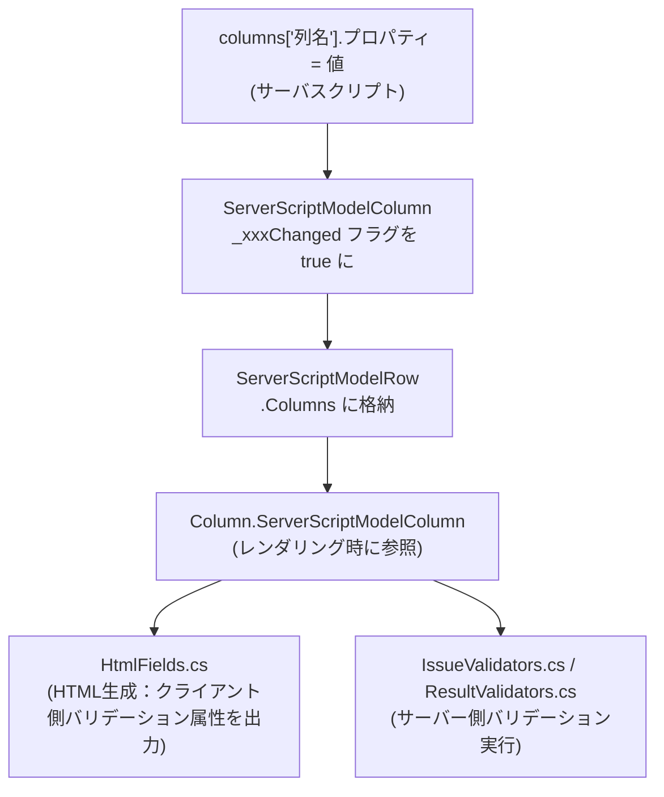
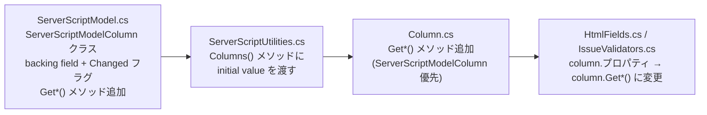

# サーバスクリプト 項目プロパティ変更不可一覧と実装方針

サーバスクリプトの `columns` オブジェクトで変更できない項目プロパティを洗い出し、主要プロパティを追加するための実装方針を示す。

<!-- START doctoc generated TOC please keep comment here to allow auto update -->
<!-- DON'T EDIT THIS SECTION, INSTEAD RE-RUN doctoc TO UPDATE -->

- [調査情報](#調査情報)
- [調査目的](#調査目的)
- [columns オブジェクトの仕組み](#columns-オブジェクトの仕組み)
    - [プロパティ変更の適用フロー](#プロパティ変更の適用フロー)
- [現在サポートされているプロパティ](#現在サポートされているプロパティ)
- [変更できないプロパティ一覧](#変更できないプロパティ一覧)
    - [バリデーション系](#バリデーション系)
    - [入力補助系](#入力補助系)
    - [数値制御系](#数値制御系)
    - [表示制御系](#表示制御系)
- [実装方針](#実装方針)
    - [共通パターン](#共通パターン)
    - [正規表現バリデーション（ClientRegexValidation / ServerRegexValidation / RegexValidationMessage）](#正規表現バリデーションclientregexvalidation--serverregexvalidation--regexvalidationmessage)
    - [数値・日付・メール・文字数バリデーション](#数値日付メール文字数バリデーション)
    - [入力補助（Description / InputGuide）](#入力補助description--inputguide)
    - [数値制御（Min / Max / Step / DecimalPlaces / Unit）](#数値制御min--max--step--decimalplaces--unit)
- [改修対象ファイル一覧](#改修対象ファイル一覧)
- [結論](#結論)
- [関連ソースコード](#関連ソースコード)

<!-- END doctoc generated TOC please keep comment here to allow auto update -->

## 調査情報

| 調査日       | リポジトリ | ブランチ | タグ/バージョン    | コミット    | 備考     |
| ------------ | ---------- | -------- | ------------------ | ----------- | -------- |
| 2026年3月9日 | Pleasanter | main     | Pleasanter_1.5.1.0 | `34f162a43` | 初回調査 |

## 調査目的

サーバスクリプトの `columns["列名"]` オブジェクトでは、項目の表示制御（非表示・読み取り専用など）は変更できる。
しかし、正規表現バリデーションや数値バリデーションなど、サイト設定で定義したバリデーションルールをスクリプトで動的に変更する手段がない。  
変更できないプロパティを洗い出し、主要なものについて実装方針を示す。

---

## columns オブジェクトの仕組み

`ServerScriptModelColumn` クラスがスクリプト側での変更を保持し、HTML 生成・サーバーバリデーション時に `Column` の実値と合成される。

### プロパティ変更の適用フロー



**ファイル**: `Implem.Pleasanter/Libraries/ServerScripts/ServerScriptModel.cs`（行番号: 166-309）

```csharp
public class ServerScriptModelColumn
{
    private string _labelText;
    private bool _labelTextChanged;
    // ... 各プロパティに backing field と Changed フラグを持つ ...

    public string LabelText
    {
        get { return _labelText; }
        set { _labelText = value; _labelTextChanged = true; }
    }

    public bool Changed()
    {
        return _labelTextChanged
            || _readOnlyChanged
            || _hideChanged
            // ... すべての Changed フラグの OR ...
    }
}
```

`Column.GetEditorReadOnly()` / `Column.GetHide()` / `Column.GetValidateRequired()` のように、
`ServerScriptModelColumn` が設定されていればその値を優先し、未設定なら `Column` 本来の値を返す
`Get*()` メソッドパターンが実装されている。

**ファイル**: `Implem.Pleasanter/Libraries/Settings/Column.cs`（行番号: 966-1002）

```csharp
public bool GetEditorReadOnly()
{
    var readOnly = ServerScriptModelColumn?.GetReadOnly();
    if (readOnly != null) return readOnly == true;
    return StatusReadOnly || EditorReadOnly == true;
}

public bool GetValidateRequired()
{
    var validateRequired = ServerScriptModelColumn?.GetValidateRequired();
    if (validateRequired != null) return validateRequired == true;
    return ValidateRequired == true;
}
```

---

## 現在サポートされているプロパティ

`ServerScriptModelColumn` に実装済みで、スクリプトから変更可能なプロパティ一覧。

| プロパティ名                                    | 対応する Column プロパティ           | 適用箇所                                     |
| ----------------------------------------------- | ------------------------------------ | -------------------------------------------- |
| `LabelText`                                     | `LabelText`                          | HtmlFields.cs（ラベル）                      |
| `LabelRaw`                                      | （HTML 直接指定）                    | HtmlFields.cs（ラベル）                      |
| `RawText`                                       | （HTML 直接指定）                    | HtmlFields.cs（フィールド）                  |
| `ReadOnly`                                      | `EditorReadOnly`                     | HtmlFields.cs / Column.GetEditorReadOnly()   |
| `Hide`                                          | `Hide`                               | Column.GetHide()                             |
| `ValidateRequired`                              | `ValidateRequired`                   | HtmlFields.cs / Column.GetValidateRequired() |
| `ExtendedFieldCss`                              | `ExtendedFieldCss`                   | HtmlFields.cs（FieldCss）                    |
| `ExtendedControlCss`                            | `ExtendedControlCss`                 | HtmlFields.cs（ControlCss）                  |
| `ExtendedCellCss`                               | `ExtendedCellCss`                    | 一覧セル                                     |
| `ExtendedHtmlBeforeField`                       | `ExtendedHtmlBeforeField`            | HtmlFields.cs                                |
| `ExtendedHtmlBeforeLabel`                       | `ExtendedHtmlBeforeLabel`            | HtmlFields.cs                                |
| `ExtendedHtmlBetweenLabelAndControl`            | `ExtendedHtmlBetweenLabelAndControl` | HtmlFields.cs                                |
| `ExtendedHtmlAfterControl`                      | `ExtendedHtmlAfterControl`           | HtmlFields.cs                                |
| `ExtendedHtmlAfterField`                        | `ExtendedHtmlAfterField`             | HtmlFields.cs                                |
| `ChoiceHash`（AddChoiceHash / ClearChoiceHash） | `ChoiceHash`                         | 選択肢の動的変更                             |

> `LabelText` はすでに動的変更をサポートしている。「項目名が変更できない」と感じる場合は `columns["ClassA"].LabelText = "新しいラベル"` の形式で設定できることを確認すること。

---

## 変更できないプロパティ一覧

`ServerScriptModelColumn` に存在せず、スクリプトから変更できないプロパティ。`Column` の値が直接参照されるため、サーバスクリプトでの動的変更ができない。

### バリデーション系

| プロパティ名             | UI上の名称                   | 種別                             | バリデーション適用箇所             |
| ------------------------ | ---------------------------- | -------------------------------- | ---------------------------------- |
| `ClientRegexValidation`  | 正規表現（クライアント）     | クライアント側 JS バリデーション | HtmlFields.cs → HTML の data 属性  |
| `ServerRegexValidation`  | 正規表現（サーバー）         | サーバー側 C# バリデーション     | IssueValidators / ResultValidators |
| `RegexValidationMessage` | 正規表現エラーメッセージ     | エラーメッセージ                 | HtmlFields.cs / Validators.cs      |
| `ValidateNumber`         | 数値チェック                 | クライアント側                   | HtmlFields.cs → HTML の data 属性  |
| `ValidateDate`           | 日付チェック                 | クライアント側                   | HtmlFields.cs → HTML の data 属性  |
| `ValidateEmail`          | メールアドレスチェック       | クライアント側                   | HtmlFields.cs → HTML の data 属性  |
| `ValidateEqualTo`        | 一致確認                     | クライアント側                   | HtmlFields.cs → HTML の data 属性  |
| `ValidateMaxLength`      | 最大文字数（バリデーション） | クライアント側                   | HtmlFields.cs → HTML の data 属性  |
| `MaxLength`              | 最大文字数（入力制限）       | クライアント・サーバー両方       | HtmlFields.cs / IssueValidators    |

### 入力補助系

| プロパティ名   | UI上の名称   | 適用箇所                        |
| -------------- | ------------ | ------------------------------- |
| `Description`  | 説明文       | HtmlFields.cs（フィールド説明） |
| `InputGuide`   | 入力ガイド   | HtmlFields.cs（プレースホルダ） |
| `DefaultInput` | デフォルト値 | HtmlFields.cs（初期値）         |

### 数値制御系

| プロパティ名    | UI上の名称     | 適用箇所                        |
| --------------- | -------------- | ------------------------------- |
| `Min`           | 最小値         | HtmlFields.cs（TextBoxNumeric） |
| `Max`           | 最大値         | HtmlFields.cs（TextBoxNumeric） |
| `Step`          | ステップ       | HtmlFields.cs（TextBoxNumeric） |
| `DecimalPlaces` | 小数点以下桁数 | 表示フォーマット                |
| `Unit`          | 単位           | HtmlFields.cs（TextBoxNumeric） |

### 表示制御系

| プロパティ名            | UI上の名称          | 適用箇所                           |
| ----------------------- | ------------------- | ---------------------------------- |
| `NoDuplication`         | 重複禁止            | IssueValidators / ResultValidators |
| `MessageWhenDuplicated` | 重複時メッセージ    | IssueValidators / ResultValidators |
| `NoWrap`                | 折り返しなし        | 一覧セル                           |
| `AutoPostBack`          | オートポストバック  | HtmlFields.cs                      |
| `Section`               | セクション区切り    | HtmlFields.cs                      |
| `FieldCss`              | フィールドCSSクラス | HtmlFields.cs                      |
| `TextAlign`             | テキスト配置        | 一覧セル                           |

---

## 実装方針

### 共通パターン

各プロパティを追加する際は、既存の実装パターンに従って以下の 4 ファイルを改修する。



---

### 正規表現バリデーション（ClientRegexValidation / ServerRegexValidation / RegexValidationMessage）

サーバスクリプトで正規表現バリデーションを動的に変更する最もニーズが高いケース。クライアント側バリデーション（HTML data 属性）とサーバー側バリデーション（C# Validators）の両方を対応する必要がある。

#### 1. ServerScriptModel.cs への追加

**ファイル**: `Implem.Pleasanter/Libraries/ServerScripts/ServerScriptModel.cs`

```csharp
// backing field
private string _clientRegexValidation;
private bool _clientRegexValidationChanged;
private string _serverRegexValidation;
private bool _serverRegexValidationChanged;
private string _regexValidationMessage;
private bool _regexValidationMessageChanged;

// public プロパティ
public string ClientRegexValidation
{
    get { return _clientRegexValidation; }
    set { _clientRegexValidation = value; _clientRegexValidationChanged = true; }
}
public string ServerRegexValidation
{
    get { return _serverRegexValidation; }
    set { _serverRegexValidation = value; _serverRegexValidationChanged = true; }
}
public string RegexValidationMessage
{
    get { return _regexValidationMessage; }
    set { _regexValidationMessage = value; _regexValidationMessageChanged = true; }
}

// Get*() メソッド（変更時のみ値を返す）
public string GetClientRegexValidation()
{
    return _clientRegexValidationChanged ? _clientRegexValidation : null;
}
public string GetServerRegexValidation()
{
    return _serverRegexValidationChanged ? _serverRegexValidation : null;
}
public string GetRegexValidationMessage()
{
    return _regexValidationMessageChanged ? _regexValidationMessage : null;
}
```

`Changed()` メソッドにもフラグを追加する。

```csharp
public bool Changed()
{
    return _labelTextChanged
        // ... 既存フラグ ...
        || _clientRegexValidationChanged
        || _serverRegexValidationChanged
        || _regexValidationMessageChanged;
}
```

コンストラクタにも初期値パラメータを追加する。

```csharp
public ServerScriptModelColumn(
    // ... 既存パラメータ ...
    string clientRegexValidation,
    string serverRegexValidation,
    string regexValidationMessage)
{
    // ...
    _clientRegexValidation = clientRegexValidation;
    _serverRegexValidation = serverRegexValidation;
    _regexValidationMessage = regexValidationMessage;
}
```

#### 2. ServerScriptUtilities.cs への追加

**ファイル**: `Implem.Pleasanter/Libraries/ServerScripts/ServerScriptUtilities.cs`（行番号: 572-588）

`Columns()` メソッドの `ServerScriptModelColumn` コンストラクタ呼び出しに初期値を渡す。

```csharp
new ServerScriptModelColumn(
    labelText: column?.LabelText,
    // ... 既存パラメータ ...
    clientRegexValidation: column?.ClientRegexValidation,
    serverRegexValidation: column?.ServerRegexValidation,
    regexValidationMessage: column?.RegexValidationMessage)
```

#### 3. Column.cs への追加

**ファイル**: `Implem.Pleasanter/Libraries/Settings/Column.cs`

```csharp
public string GetClientRegexValidation()
{
    return ServerScriptModelColumn?.GetClientRegexValidation()
        ?? ClientRegexValidation;
}

public string GetServerRegexValidation()
{
    return ServerScriptModelColumn?.GetServerRegexValidation()
        ?? ServerRegexValidation;
}

public string GetRegexValidationMessage()
{
    return ServerScriptModelColumn?.GetRegexValidationMessage()
        ?? RegexValidationMessage;
}
```

#### 4. 呼び出し箇所の変更

**クライアント側**（HtmlFields.cs）: `column.ClientRegexValidation` を `column.GetClientRegexValidation()` に変更（複数箇所）。

**ファイル**: `Implem.Pleasanter/Libraries/HtmlParts/HtmlFields.cs`（行番号: 521, 548, 739, 769, 800, 835, 876, 908 等）

```csharp
// 変更前
validateRegex: column.ClientRegexValidation,
validateRegexErrorMessage: column.RegexValidationMessage,

// 変更後
validateRegex: column.GetClientRegexValidation(),
validateRegexErrorMessage: column.GetRegexValidationMessage(),
```

**サーバー側**（IssueValidators.cs / ResultValidators.cs）:

**ファイル**: `Implem.Pleasanter/Models/Issues/IssueValidators.cs`（行番号: 1361）

```csharp
// 変更前
serverRegexValidation: column.ServerRegexValidation,
regexValidationMessage: column.RegexValidationMessage,

// 変更後
serverRegexValidation: column.GetServerRegexValidation(),
regexValidationMessage: column.GetRegexValidationMessage(),
```

#### 利用例（サーバスクリプト）

```javascript
// 条件付き正規表現バリデーション：特定の区分が選択された場合のみ郵便番号形式を適用
if (model.ClassA === 'JP') {
    columns['ClassB'].ClientRegexValidation = '^\\d{3}-\\d{4}$';
    columns['ClassB'].ServerRegexValidation = '^\\d{3}-\\d{4}$';
    columns['ClassB'].RegexValidationMessage = '郵便番号は「000-0000」形式で入力してください';
}
```

---

### 数値・日付・メール・文字数バリデーション

（ValidateNumber / ValidateDate / ValidateEmail / ValidateMaxLength / ValidateEqualTo）

クライアント側 HTML data 属性として出力されるバリデーション。サーバー側では `ValidateNumber` / `ValidateDate` /
`ValidateEmail` の専用チェックは実装されていないため、クライアント側対応のみで十分。
`ValidateMaxLength` はサーバー側でも `Validators.ValidateMaxLength()` が呼ばれるが `MaxLength` カラムに統合されている。

正規表現と同じパターンで `ServerScriptModelColumn` にプロパティを追加し、HtmlFields.cs の参照箇所を `Get*()` 呼び出しに変更する。

| プロパティ          | Column の型 | 優先挙動            |
| ------------------- | ----------- | ------------------- |
| `ValidateNumber`    | `bool?`     | スクリプト値 > 元値 |
| `ValidateDate`      | `bool?`     | スクリプト値 > 元値 |
| `ValidateEmail`     | `bool?`     | スクリプト値 > 元値 |
| `ValidateMaxLength` | `int?`      | スクリプト値 > 元値 |
| `ValidateEqualTo`   | `string`    | スクリプト値 > 元値 |

`bool?` 型の場合は `GetReadOnly()` と同じパターン（`_changed ? (bool?)value : null`）を使う。

---

### 入力補助（Description / InputGuide）

フィールド説明文とプレースホルダをスクリプトで動的に変更するケース。

HtmlFields.cs では下記のように `column.Description` / `column.InputGuide` が直接参照されている。

**ファイル**: `Implem.Pleasanter/Libraries/HtmlParts/HtmlFields.cs`（行番号: 151-192）

```csharp
fieldDescription: Strings.CoalesceEmpty(
    ColumnUtilities.GetMultilingualDescription(...),
    column.Description),          // ← ここを GetDescription() に変更

placeholder: Strings.CoalesceEmpty(
    multilingualInputGuide,
    column.InputGuide,            // ← ここを GetInputGuide() に変更
    serverScriptModelColumn?.LabelText,
    column.LabelText),
```

実装方針は正規表現と同じパターン。`string` 型プロパティなので、未設定時は `null` を返す `Get*()` を追加し、`Strings.CoalesceEmpty` の先頭に挿入する。

```csharp
fieldDescription: Strings.CoalesceEmpty(
    serverScriptModelColumn?.GetDescription(),   // 追加
    ColumnUtilities.GetMultilingualDescription(...),
    column.Description),
```

---

### 数値制御（Min / Max / Step / DecimalPlaces / Unit）

数値入力フィールドの最小値・最大値・ステップ・小数桁数・単位を動的に制御するケース。

HtmlFields.cs では下記のように直接参照される。

**ファイル**: `Implem.Pleasanter/Libraries/HtmlParts/HtmlFields.cs`（行番号: 951-978）

```csharp
min: column.Min.ToDecimal(),
max: column.Max.ToDecimal(),
// step: column.Step は HtmlControls.cs に渡される
unit: column.Unit,
```

`Min` / `Max` / `Step` は `decimal?` 型、`DecimalPlaces` は `int?` 型。それぞれ同じパターンで `Get*()` を追加する。`Unit` は `string` 型。

---

## 改修対象ファイル一覧

正規表現バリデーション対応を例として、必要な改修ファイルを示す。

| ファイル                                                             | 変更内容                                                                                         |
| -------------------------------------------------------------------- | ------------------------------------------------------------------------------------------------ |
| `Implem.Pleasanter/Libraries/ServerScripts/ServerScriptModel.cs`     | `ServerScriptModelColumn` に3プロパティ追加、コンストラクタ・`Changed()` 更新                    |
| `Implem.Pleasanter/Libraries/ServerScripts/ServerScriptUtilities.cs` | `Columns()` の `ServerScriptModelColumn` コンストラクタ呼び出しに初期値追加                      |
| `Implem.Pleasanter/Libraries/Settings/Column.cs`                     | `GetClientRegexValidation()` / `GetServerRegexValidation()` / `GetRegexValidationMessage()` 追加 |
| `Implem.Pleasanter/Libraries/HtmlParts/HtmlFields.cs`                | `column.ClientRegexValidation` を `column.GetClientRegexValidation()` に変更（9箇所程度）        |
| `Implem.Pleasanter/Models/Issues/IssueValidators.cs`                 | `column.ServerRegexValidation` を `column.GetServerRegexValidation()` に変更                     |
| `Implem.Pleasanter/Models/Results/ResultValidators.cs`               | 同上                                                                                             |
| `Implem.Pleasanter/Libraries/HtmlParts/HtmlComments.cs`              | コメントフィールドの `ClientRegexValidation` を変更                                              |

`ValidateNumber` / `ValidateDate` / `ValidateEmail` / `ValidateMaxLength` / `ValidateEqualTo` のバリデーションを追加する場合は、
`ServerScriptModel.cs` / `ServerScriptUtilities.cs` / `Column.cs` / `HtmlFields.cs` の 4 ファイルが対象となる。

---

## 結論

| 分類                       | プロパティ                                                                                | 対応状況   | 対応難易度             |
| -------------------------- | ----------------------------------------------------------------------------------------- | ---------- | ---------------------- |
| ラベル・表示制御           | `LabelText`、`LabelRaw`、`RawText`                                                        | 対応済み   | -                      |
| 読み取り専用・非表示       | `ReadOnly`、`Hide`                                                                        | 対応済み   | -                      |
| 必須バリデーション         | `ValidateRequired`                                                                        | 対応済み   | -                      |
| CSS 拡張                   | `ExtendedFieldCss`、`ExtendedControlCss`、`ExtendedCellCss`                               | 対応済み   | -                      |
| HTML 挿入                  | `ExtendedHtmlBefore*`、`ExtendedHtmlAfter*`                                               | 対応済み   | -                      |
| 選択肢動的変更             | `ChoiceHash`（AddChoiceHash / ClearChoiceHash）                                           | 対応済み   | -                      |
| **正規表現**               | `ClientRegexValidation`、`ServerRegexValidation`、`RegexValidationMessage`                | **未対応** | 低（既存パターン踏襲） |
| **数値・型バリデーション** | `ValidateNumber`、`ValidateDate`、`ValidateEmail`、`ValidateEqualTo`、`ValidateMaxLength` | **未対応** | 低                     |
| **入力補助**               | `Description`、`InputGuide`                                                               | **未対応** | 低                     |
| **数値制御**               | `Min`、`Max`、`Step`、`DecimalPlaces`、`Unit`                                             | **未対応** | 低〜中                 |
| **重複禁止**               | `NoDuplication`、`MessageWhenDuplicated`                                                  | **未対応** | 中                     |
| 表示フォーマット           | `GridFormat`、`EditorFormat`、`ExportFormat`                                              | 未対応     | 高                     |
| その他                     | `AutoPostBack`、`Section`、`DefaultInput`                                                 | 未対応     | 低〜中                 |

- 未対応プロパティの追加は、**既存の `GetReadOnly()` / `GetValidateRequired()` パターンを踏襲するだけ**であり、実装難易度は低い
- 特にニーズが高いのは**正規表現バリデーション**（クライアント・サーバー両方）と**入力補助（InputGuide）**
- サーバー側バリデーション（`ServerRegexValidation` / `MaxLength`）は `IssueValidators.cs` / `ResultValidators.cs` の改修が必要
- `GridFormat` / `EditorFormat` は日付入力コンポーネントと密結合しているため実装難易度が高い

---

## 関連ソースコード

| ファイル                                                             | 説明                                         |
| -------------------------------------------------------------------- | -------------------------------------------- |
| `Implem.Pleasanter/Libraries/ServerScripts/ServerScriptModel.cs`     | `ServerScriptModelColumn` クラス定義         |
| `Implem.Pleasanter/Libraries/ServerScripts/ServerScriptUtilities.cs` | `Columns()` メソッド（初期値設定）           |
| `Implem.Pleasanter/Libraries/Settings/Column.cs`                     | `Column` クラス（`Get*()` メソッド群）       |
| `Implem.Pleasanter/Libraries/HtmlParts/HtmlFields.cs`                | フィールド HTML 生成・バリデーション属性出力 |
| `Implem.Pleasanter/Models/Issues/IssueValidators.cs`                 | サーバー側バリデーション実装                 |
| `Implem.Pleasanter/Libraries/General/Validators.cs`                  | 正規表現・文字数バリデーション共通ロジック   |
