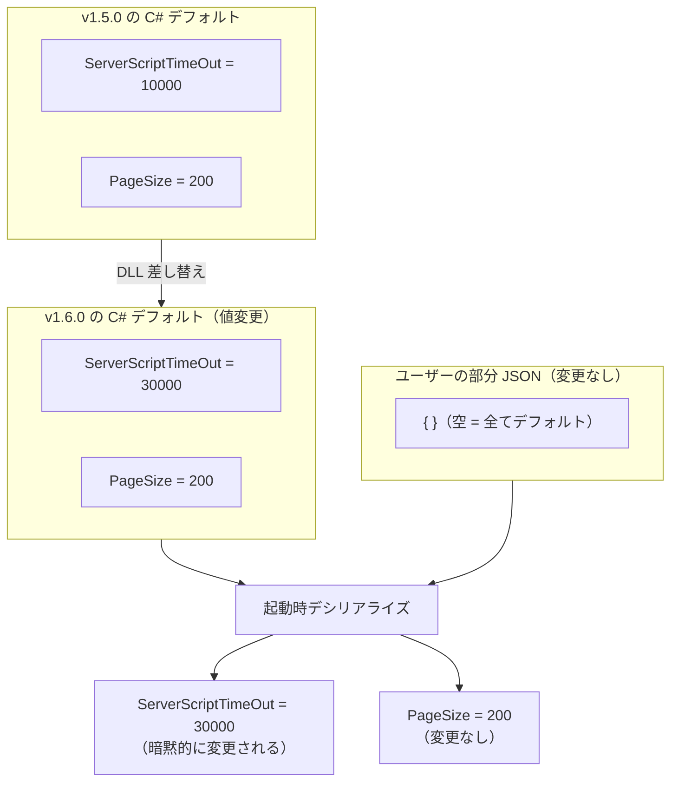
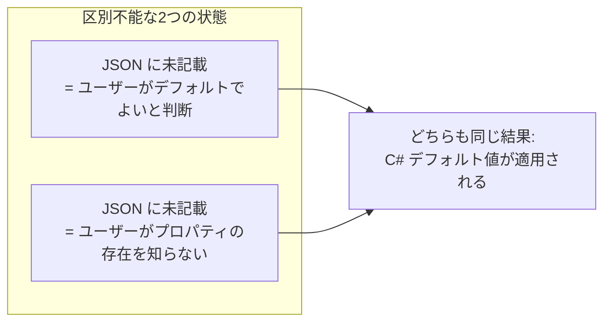
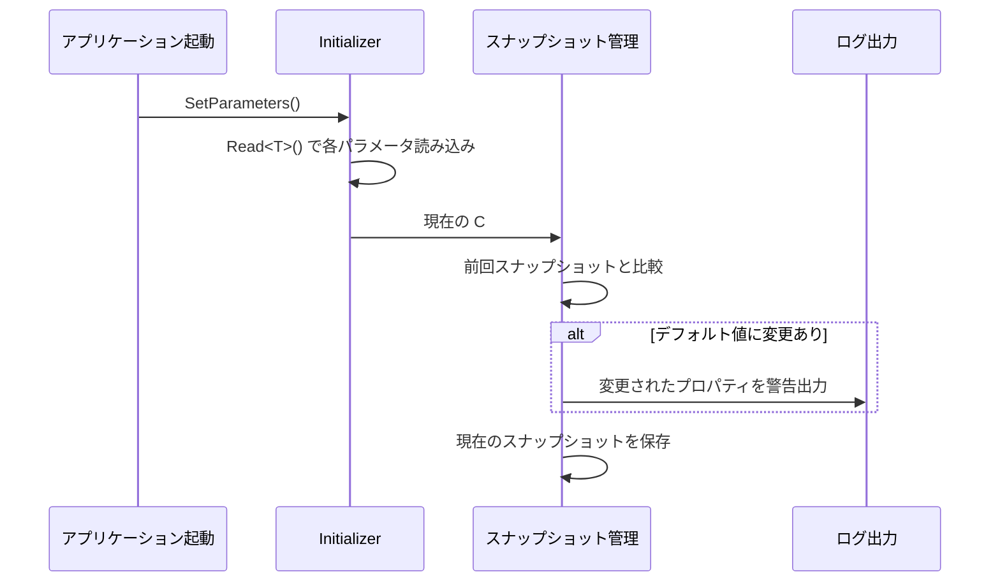
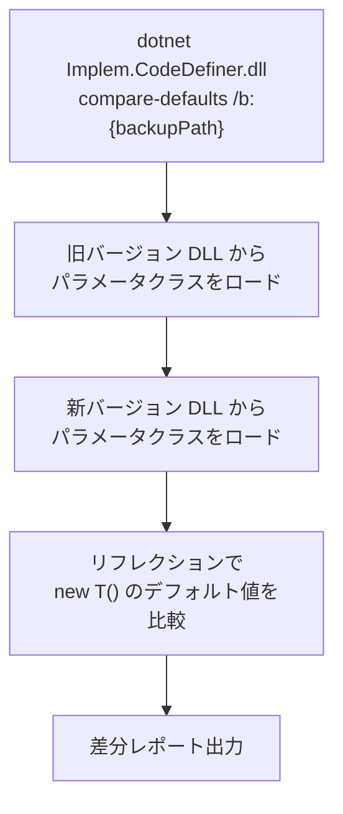
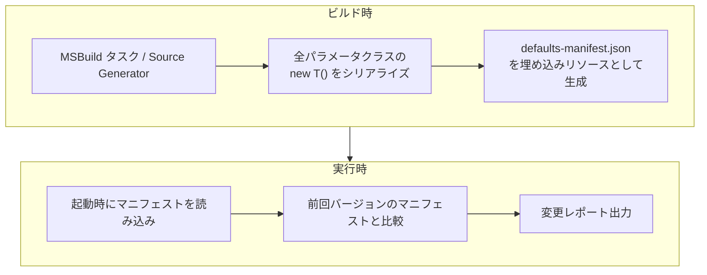
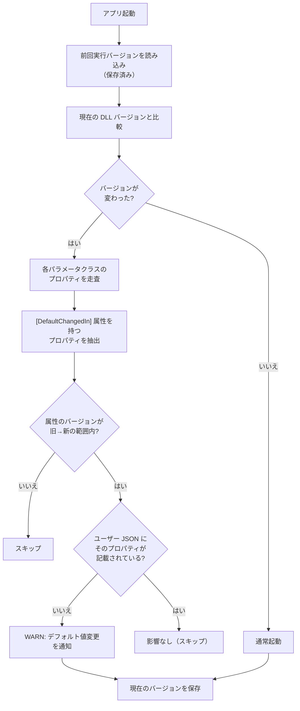
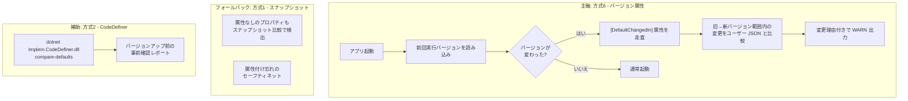
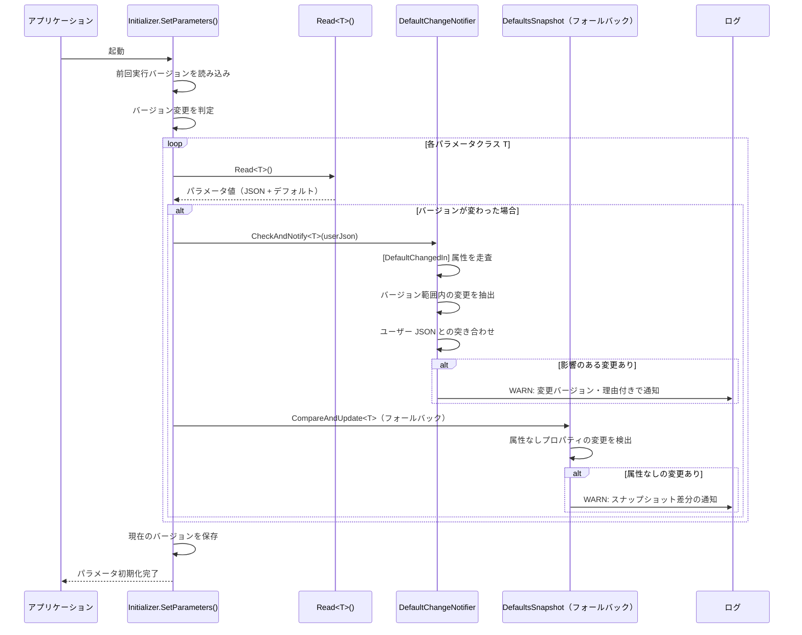
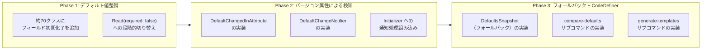
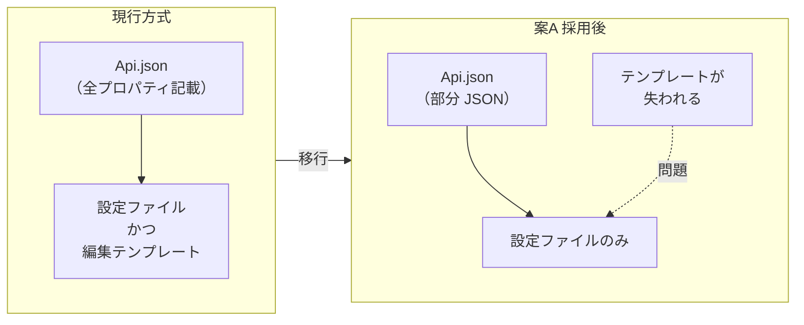

# パラメータデフォルト値の変更検知方式

案A（C# デフォルト値 + 部分 JSON 方式）を採用するにあたり、バージョンアップ時に C# 側のデフォルト値が変更された場合の検知・通知方法を調査する。

<!-- START doctoc generated TOC please keep comment here to allow auto update -->
<!-- DON'T EDIT THIS SECTION, INSTEAD RE-RUN doctoc TO UPDATE -->

- [調査情報](#調査情報)
- [調査目的](#調査目的)
- [案A の前提整理](#案a-の前提整理)
    - [動作原理](#動作原理)
    - [バージョンアップ時のデフォルト値変更パターン](#バージョンアップ時のデフォルト値変更パターン)
    - [通知が必要なケース](#通知が必要なケース)
- [デフォルト値変更が検知困難な理由](#デフォルト値変更が検知困難な理由)
- [検知方式の候補](#検知方式の候補)
    - [方式1: デフォルト値スナップショット比較（起動時自動検知）](#方式1-デフォルト値スナップショット比較起動時自動検知)
    - [方式2: CodeDefiner サブコマンド（明示的な差分レポート）](#方式2-codedefiner-サブコマンド明示的な差分レポート)
    - [方式3: デフォルト値マニフェスト同梱方式](#方式3-デフォルト値マニフェスト同梱方式)
    - [方式4: `[DefaultValue]` 属性の標準化 + 起動時バリデーション](#方式4-defaultvalue-属性の標準化--起動時バリデーション)
    - [方式5: ソースコード差分方式（Git タグ間比較）](#方式5-ソースコード差分方式git-タグ間比較)
    - [方式6: バージョン属性方式（変更バージョンタグ + JSON 比較）](#方式6-バージョン属性方式変更バージョンタグ--json-比較)
- [方式の比較](#方式の比較)
- [推奨方式](#推奨方式)
    - [方式6（バージョン属性）を主軸とした構成](#方式6バージョン属性を主軸とした構成)
    - [詳細設計](#詳細設計)
- [既存コードへの改修箇所](#既存コードへの改修箇所)
    - [改修対象一覧](#改修対象一覧)
    - [段階的な導入計画](#段階的な導入計画)
- [テンプレート JSON の自動生成](#テンプレート-json-の自動生成)
    - [課題: 編集テンプレートの消失](#課題-編集テンプレートの消失)
    - [解決策: Code First によるテンプレート JSON 生成](#解決策-code-first-によるテンプレート-json-生成)
    - [生成タイミングと配布方法の比較](#生成タイミングと配布方法の比較)
    - [テンプレート JSON の付加価値](#テンプレート-json-の付加価値)
    - [推奨](#推奨)
- [複合型プロパティの扱い](#複合型プロパティの扱い)
    - [ネストオブジェクトのデフォルト値比較](#ネストオブジェクトのデフォルト値比較)
    - [コンストラクタで初期化されるクラス](#コンストラクタで初期化されるクラス)
    - [`[OnDeserialized]` パターンとの整合](#ondeserialized-パターンとの整合)
- [結論](#結論)
- [関連ソースコード](#関連ソースコード)
- [関連ドキュメント](#関連ドキュメント)

<!-- END doctoc generated TOC please keep comment here to allow auto update -->

## 調査情報

| 調査日       | リポジトリ | ブランチ           | タグ/バージョン | コミット    | 備考     |
| ------------ | ---------- | ------------------ | --------------- | ----------- | -------- |
| 2026年3月7日 | Pleasanter | Pleasanter_1.5.1.0 | v1.5.1.0        | `34f162a43` | 初回調査 |

## 調査目的

[前回の調査](002-CodeDefiner-Parameterマージ.md)で推奨した案A（C# デフォルト値 + 部分 JSON 方式）では、
ユーザーは変更したプロパティのみを JSON に記載し、
未記載のプロパティは C# フィールド初期化子のデフォルト値で動作する。
この方式では**バージョンアップで C# 側のデフォルト値が変更された場合、
JSON に未記載のプロパティは暗黙的に新しい値に切り替わる**。
これは多くの場合は望ましい動作だが、
運用に影響する変更（タイムアウト値の変更、機能の有効/無効切り替え等）については管理者への通知が必要である。

本ドキュメントでは、デフォルト値の変更を検知し通知する具体的な方式を検討する。

---

## 案A の前提整理

### 動作原理

Newtonsoft.Json の `DeserializeObject<T>()` は以下の順序で動作する。

1. `new T()` でインスタンスを生成（C# フィールド初期化子のデフォルト値が適用）
2. JSON に存在するプロパティだけを上書き
3. JSON に書かれていないプロパティは C# のデフォルト値がそのまま残る

### バージョンアップ時のデフォルト値変更パターン



### 通知が必要なケース

| ケース                                               | 影響度 | 例                                         |
| ---------------------------------------------------- | :----: | ------------------------------------------ |
| タイムアウト値・リトライ回数等の性能パラメータの変更 |   中   | `ServerScriptTimeOut`: 10000 → 30000       |
| 機能の有効/無効のデフォルト切り替え                  |   高   | `ServerScript`: true → false               |
| セキュリティ関連パラメータの変更                     |   高   | `PasswordExpirationPeriod`: 0 → 90         |
| API バージョン・互換性フラグの変更                   |   高   | `Compatibility_1_3_12`: false → true       |
| 文字列パターン（正規表現等）の変更                   |   低   | `ChoiceSplitRegexPattern` の正規表現変更   |
| 新プロパティ追加（デフォルト値付き）                 |   低   | 新しい機能フラグが追加されデフォルトで有効 |
| 数値の上限/下限の変更                                |   中   | `LimitPerSite`: 0（無制限） → 1000         |

---

## デフォルト値変更が検知困難な理由

案A では JSON に未記載のプロパティは C# デフォルト値がそのまま使われるため、**どのプロパティが「ユーザーが意図的にデフォルトのままにしている」のか「ユーザーが存在を知らない」のかを区別できない**。



現行のコードにはデフォルト値の変更を検知する仕組みは存在しない。`Read<T>()` メソッドは JSON の読み込みとデシリアライズのみを行い、デフォルト値との比較は一切行わない。

---

## 検知方式の候補

### 方式1: デフォルト値スナップショット比較（起動時自動検知）

起動時にリフレクションで C# デフォルト値のスナップショットを生成し、前回起動時のスナップショットと比較する方式。

#### 仕組み



#### 実装イメージ

```csharp
public static class DefaultsSnapshot
{
    private const string SnapshotDir = "App_Data/Parameters/.defaults-snapshot";

    /// <summary>
    /// C# デフォルト値のスナップショットを生成し、前回と比較する。
    /// 変更があればログに警告を出力する。
    /// </summary>
    public static void CompareAndUpdate<T>() where T : new()
    {
        var name = typeof(T).Name;
        var currentDefaults = new T();
        var currentJson = JsonConvert.SerializeObject(
            currentDefaults, Formatting.Indented);

        var snapshotPath = Path.Combine(SnapshotDir, $"{name}.json");
        if (File.Exists(snapshotPath))
        {
            var previousJson = File.ReadAllText(snapshotPath);
            if (currentJson != previousJson)
            {
                var changes = DetectChanges(previousJson, currentJson);
                foreach (var change in changes)
                {
                    Console.WriteLine(
                        $"[WARN] {name}.{change.Property}: "
                        + $"デフォルト値が変更されました "
                        + $"({change.OldValue} → {change.NewValue})");
                }
            }
        }
        Directory.CreateDirectory(SnapshotDir);
        File.WriteAllText(snapshotPath, currentJson);
    }
}
```

#### 評価

| 項目           | 評価                                                                        |
| -------------- | --------------------------------------------------------------------------- |
| 検知タイミング | 起動時に自動検知                                                            |
| 検知精度       | C# デフォルト値の全プロパティを網羅的に比較可能                             |
| 実装コスト     | 小（リフレクション + JSON 比較のみ）                                        |
| 運用負荷       | なし（自動動作）                                                            |
| 制約           | 初回起動時はスナップショットがないため比較不可                              |
| 副作用         | スナップショットファイルの管理が必要（`.defaults-snapshot/` の Git 管理等） |

---

### 方式2: CodeDefiner サブコマンド（明示的な差分レポート）

CodeDefiner に `compare-defaults` サブコマンドを追加し、バージョンアップ前後のデフォルト値差分をレポートする方式。

#### 仕組み



#### 出力イメージ

```text
=== パラメータデフォルト値 変更レポート ===
比較: v1.5.0.0 → v1.5.1.0

[変更あり] Script.json:
  ServerScriptTimeOut: 10000 → 30000
  ServerScriptTimeOutMax: 86400000 → 172800000

[変更あり] Security.json:
  PasswordExpirationPeriod: 0 → 90
  MinimumPasswordLength: 8 → 10

[変更なし] Api.json
[変更なし] Rds.json
[新規追加] NewFeature.json (v1.5.1.0 で追加)

合計: 2 ファイルに変更、4 プロパティが変更されました。
```

#### 評価

| 項目           | 評価                                                                            |
| -------------- | ------------------------------------------------------------------------------- |
| 検知タイミング | バージョンアップ時に管理者が明示的に実行                                        |
| 検知精度       | DLL 間の直接比較で正確                                                          |
| 実装コスト     | 中（DLL の動的ロード + リフレクション + レポート生成）                          |
| 運用負荷       | 小（バージョンアップ手順に組み込み可能）                                        |
| 制約           | 旧バージョンの DLL が必要（バックアップから取得）                               |
| 副作用         | 異なるバージョンの DLL を同一プロセスにロードする際の依存関係の問題が発生しうる |

#### DLL 動的ロードの技術的課題

異なるバージョンの DLL を同一プロセスで扱う場合、以下の課題がある。

| 課題                  | 説明                                                                 | 対策                                              |
| --------------------- | -------------------------------------------------------------------- | ------------------------------------------------- |
| 型の不一致            | 同じ名前のクラスでも異なる DLL からロードすると別の型として扱われる  | JSON シリアライズ経由で比較する（型に依存しない） |
| 依存関係の競合        | 新旧 DLL が異なるバージョンの Newtonsoft.Json 等に依存する場合がある | `AssemblyLoadContext` で分離ロードする            |
| プロパティの追加/削除 | 旧バージョンに存在しないプロパティの比較ができない                   | JSON 化して `JObject` レベルで比較する            |

この課題を回避するため、**DLL からリフレクションでデフォルト値を JSON にエクスポートし、JSON 同士で比較する**方式が現実的である。

---

### 方式3: デフォルト値マニフェスト同梱方式

リリース時に全パラメータクラスのデフォルト値を JSON ファイル（マニフェスト）として DLL に埋め込み、バージョン間で比較する方式。

#### 仕組み



#### マニフェストの形式

```json
{
    "version": "1.5.1.0",
    "generatedAt": "2026-03-07T00:00:00Z",
    "defaults": {
        "Api": {
            "Version": 0,
            "Enabled": false,
            "PageSize": 0,
            "LimitPerSite": 0,
            "Compatibility_1_3_12": false
        },
        "Script": {
            "ServerScript": true,
            "ServerScriptTimeOut": 10000,
            "ServerScriptTimeOutMax": 86400000
        }
    }
}
```

#### 評価

| 項目           | 評価                                                     |
| -------------- | -------------------------------------------------------- |
| 検知タイミング | 起動時に自動検知                                         |
| 検知精度       | ビルド時に生成するため正確                               |
| 実装コスト     | 大（MSBuild タスクまたは Source Generator の実装が必要） |
| 運用負荷       | なし（自動動作）                                         |
| 制約           | ビルドパイプラインの変更が必要                           |
| 副作用         | DLL サイズの微増                                         |

---

### 方式4: `[DefaultValue]` 属性の標準化 + 起動時バリデーション

既に `Script.cs` 等で部分的に使われている `[DefaultValue]` 属性を全パラメータクラスに拡張し、属性値とフィールド初期化子の一貫性を保証する方式。

#### 現状の使用パターン

```csharp
// Script.cs - [DefaultValue] とフィールド初期化子の二重定義
[DefaultValue(true)]
public bool ServerScript { get; set; } = true;

[DefaultValue(10000)]
public long ServerScriptTimeOut { get; set; } = 10000;
```

`[DefaultValue]` 属性は現在のコードでは**メタデータとしてのみ存在し、実行時に読み取られていない**。

#### 活用方法

```csharp
public static class DefaultValueValidator
{
    /// <summary>
    /// [DefaultValue] 属性の値とフィールド初期化子の値が一致しているか検証する。
    /// 不一致はデフォルト値の変更漏れ（属性の更新忘れ）を示す。
    /// </summary>
    public static void Validate<T>() where T : new()
    {
        var instance = new T();
        foreach (var prop in typeof(T).GetProperties())
        {
            var attr = prop.GetCustomAttribute<DefaultValueAttribute>();
            if (attr == null) continue;

            var actualDefault = prop.GetValue(instance);
            if (!Equals(attr.Value, actualDefault))
            {
                Console.WriteLine(
                    $"[WARN] {typeof(T).Name}.{prop.Name}: "
                    + $"[DefaultValue({attr.Value})] と "
                    + $"フィールド初期化子({actualDefault}) が不一致");
            }
        }
    }
}
```

#### 評価

| 項目           | 評価                                                                  |
| -------------- | --------------------------------------------------------------------- |
| 検知タイミング | 起動時またはテスト時                                                  |
| 検知精度       | `[DefaultValue]` 属性が付与されたプロパティのみ対象                   |
| 実装コスト     | 中（全クラスへの `[DefaultValue]` 属性追加 + バリデーションロジック） |
| 運用負荷       | 中（プロパティ追加/変更時に属性の更新が必要）                         |
| 制約           | 属性の更新忘れが発生しうる（属性値とフィールド初期化子の二重管理）    |
| 副作用         | なし                                                                  |

この方式は**デフォルト値の二重管理**が必要であり、属性の更新忘れというヒューマンエラーのリスクがある。ただし、方式1と組み合わせて「`[DefaultValue]` 属性とフィールド初期化子の一貫性チェック」として利用する価値はある。

---

### 方式5: ソースコード差分方式（Git タグ間比較）

バージョンアップ時に `Implem.ParameterAccessor/Parts/*.cs` ファイルの Git 差分を解析し、フィールド初期化子の変更を検出する方式。

#### 実行イメージ

```bash
# v1.5.0 → v1.5.1 間のパラメータクラス変更を検出
git diff v1.5.0.0..v1.5.1.0 -- Implem.ParameterAccessor/Parts/
```

#### 評価

| 項目           | 評価                                                           |
| -------------- | -------------------------------------------------------------- |
| 検知タイミング | バージョンアップ前に手動実行                                   |
| 検知精度       | ソースレベルで正確（ただしパース精度に依存）                   |
| 実装コスト     | 小（Git コマンドのみ。自動解析にはパーサーが必要）             |
| 運用負荷       | 中（手動実行 + 出力の読解が必要）                              |
| 制約           | Git リポジトリへのアクセスが必要、ソース非公開の場合は使用不可 |
| 副作用         | なし                                                           |

ソースコードが公開されているプリザンターでは有効だが、**自動化が困難**であり、運用手順としての定着が課題となる。

---

### 方式6: バージョン属性方式（変更バージョンタグ + JSON 比較）

プロパティに「いつのバージョンでデフォルト値が変わったか」を示すカスタム属性を付与し、
バージョンアップ時にそのバージョンをまたぐ場合のみ、
ユーザーの JSON と比較して通知する方式。

#### 仕組み



#### カスタム属性の定義

```csharp
/// <summary>
/// デフォルト値が変更されたバージョンを示す属性。
/// バージョンアップ時にこのバージョンをまたぐ場合、
/// ユーザー JSON に未記載であれば警告を出力する。
/// </summary>
[AttributeUsage(AttributeTargets.Property | AttributeTargets.Field,
    AllowMultiple = true)]  // 複数回のデフォルト値変更に対応
public class DefaultChangedInAttribute : Attribute
{
    public string Version { get; }
    public string OldValue { get; set; }
    public string NewValue { get; set; }
    public string Description { get; set; }

    public DefaultChangedInAttribute(string version)
    {
        Version = version;
    }
}
```

#### パラメータクラスでの使用例

```csharp
public class Script
{
    [DefaultChangedIn("1.5.1.0",
        OldValue = "10000",
        NewValue = "30000",
        Description = "サーバースクリプトのタイムアウトを延長")]
    public long ServerScriptTimeOut { get; set; } = 30000;

    [DefaultChangedIn("1.5.1.0",
        OldValue = "86400000",
        NewValue = "172800000")]
    public int ServerScriptTimeOutMax { get; set; } = 172800000;

    // デフォルト値が2回変更された例
    [DefaultChangedIn("1.4.0.0",
        OldValue = "false", NewValue = "true",
        Description = "サーバースクリプトをデフォルト有効化")]
    [DefaultChangedIn("1.6.0.0",
        OldValue = "true", NewValue = "false",
        Description = "セキュリティ強化のため既定で無効化")]
    public bool ServerScript { get; set; } = false;
}
```

#### 検知ロジックの実装イメージ

```csharp
public static class DefaultChangeNotifier
{
    private const string VersionFilePath =
        "App_Data/Parameters/.last-run-version";

    public static void CheckAndNotify<T>(string userJson) where T : new()
    {
        var lastVersion = ReadLastVersion();
        var currentVersion = GetCurrentAppVersion();
        if (lastVersion == null || lastVersion == currentVersion)
            return;

        var lastVer = new Version(lastVersion);
        var currVer = new Version(currentVersion);
        var userObj = string.IsNullOrEmpty(userJson)
            ? new JObject()
            : JObject.Parse(userJson);
        var name = typeof(T).Name;

        foreach (var member in typeof(T).GetMembers(
            BindingFlags.Public | BindingFlags.Instance))
        {
            var attrs = member
                .GetCustomAttributes<DefaultChangedInAttribute>();
            foreach (var attr in attrs)
            {
                var changedVer = new Version(attr.Version);
                // 旧バージョン < 変更バージョン <= 新バージョン の場合のみ通知
                if (lastVer < changedVer && changedVer <= currVer)
                {
                    // ユーザー JSON に記載されていなければ警告
                    if (!userObj.ContainsKey(member.Name))
                    {
                        Console.WriteLine(
                            $"[WARN] {name}.{member.Name}: "
                            + $"v{attr.Version} でデフォルト値が変更 "
                            + $"({attr.OldValue} → {attr.NewValue})"
                            + (attr.Description != null
                                ? $" - {attr.Description}" : ""));
                    }
                }
            }
        }
    }

    public static void SaveCurrentVersion()
    {
        File.WriteAllText(
            VersionFilePath, GetCurrentAppVersion());
    }
}
```

#### 出力イメージ

```text
[2026-03-07 09:00:00] [WARN] バージョンアップに伴うデフォルト値変更:
[2026-03-07 09:00:00] [WARN]   Script.ServerScriptTimeOut:
    v1.5.1.0 でデフォルト値が変更 (10000 → 30000)
    - サーバースクリプトのタイムアウトを延長
[2026-03-07 09:00:00] [WARN]   Script.ServerScriptTimeOutMax:
    v1.5.1.0 でデフォルト値が変更 (86400000 → 172800000)
[2026-03-07 09:00:00] [WARN] 上記のプロパティは JSON に未記載のため
    新しいデフォルト値が適用されます。
[2026-03-07 09:00:00] [WARN] 旧デフォルト値に戻す場合は
    パラメータ JSON に明示的に値を記載してください。
```

#### 方式1（スナップショット）との比較

| 観点                     | 方式1: スナップショット                  | 方式6: バージョン属性                                |
| ------------------------ | ---------------------------------------- | ---------------------------------------------------- |
| 外部ファイルの必要性     | `.defaults-snapshot/` ディレクトリが必要 | バージョン番号1つのみ（小さなファイル）              |
| 変更理由の伝達           | 値の差分のみ（理由は不明）               | `Description` で変更理由を伝達可能                   |
| 変更バージョンの特定     | 不可（前回起動時との差分のみ）           | 属性で明示的に記録されている                         |
| 複数バージョンスキップ時 | 前回起動時との差分のみ検出               | スキップしたバージョン全ての変更を個別に通知可能     |
| 開発者の作業負荷         | なし（自動検出）                         | デフォルト値変更時に属性の追記が必要                 |
| 属性の付け忘れリスク     | なし                                     | あり（ただしコードレビューで検出可能）               |
| ダウングレード対応       | 前回スナップショットとの比較で対応       | `changedVer <= currVer` の条件を調整すれば対応可能   |
| 初回起動時の動作         | スナップショットがないため検知不可       | バージョンファイルがなければ全属性をスキャンして通知 |

#### 評価

| 項目             | 評価                                                                 |
| ---------------- | -------------------------------------------------------------------- |
| 検知タイミング   | 起動時に自動検知                                                     |
| 検知精度         | 高（バージョン境界 + JSON 有無の二重判定）                           |
| 実装コスト       | 小（カスタム属性 + リフレクション。外部ファイルは最小限）            |
| 運用負荷         | 小（起動時自動動作。開発者はデフォルト値変更時に属性を追記するだけ） |
| 変更理由の伝達   | 可能（`Description` プロパティで変更理由を記述可能）                 |
| 外部ファイル管理 | バージョン番号1ファイルのみ（スナップショット不要）                  |
| 制約             | 開発者が属性を付け忘れると検知漏れが発生する                         |
| 本体改修         | 必要                                                                 |

---

## 方式の比較

| 方式                              | 自動検知 |  精度  | 実装コスト | 運用負荷 | 本体改修 | 変更理由の伝達 |
| --------------------------------- | :------: | :----: | :--------: | :------: | :------: | :------------: |
| 1: スナップショット比較（起動時） |   自動   |   高   |     小     |   なし   |   必要   |      不可      |
| 2: CodeDefiner サブコマンド       |   手動   |   高   |     中     |    小    |   必要   |      不可      |
| 3: デフォルト値マニフェスト同梱   |   自動   |   高   |     大     |   なし   |   必要   |      不可      |
| 4: `[DefaultValue]` 属性標準化    |   自動   |   中   |     中     |    中    |   必要   |      不可      |
| 5: ソースコード差分（Git タグ間） |   手動   |   高   |     小     |    中    |   不要   |      不可      |
| **6: バージョン属性（変更タグ）** | **自動** | **高** |   **小**   |  **小**  | **必要** |    **可能**    |

---

## 推奨方式

### 方式6（バージョン属性）を主軸とした構成

**方式6（バージョン属性）** を主軸とし、
**方式1（スナップショット比較）** をフォールバック、
**方式2（CodeDefiner サブコマンド）** を補助的に利用する構成を推奨する。

方式6は変更バージョンと変更理由をソースコード内に記録できるため、
「いつ・なぜ変更されたか」を管理者に伝達できる点で他の方式より優れている。
属性の付け忘れに対するフォールバックとして方式1を併用することで、検知漏れを防止する。



#### 推奨理由

| 理由                   | 説明                                                                         |
| ---------------------- | ---------------------------------------------------------------------------- |
| 変更理由を伝達可能     | `Description` に変更理由を記述でき、管理者が影響を判断しやすい               |
| バージョン境界で判定   | 複数バージョンをスキップしたアップグレードでも、全ての変更を個別に通知できる |
| 外部ファイルが最小限   | スナップショットディレクトリ不要。保存するのはバージョン番号1つのみ          |
| フォールバックで安全   | 方式1を併用することで、属性の付け忘れがあっても検知漏れを防止                |
| 自己文書化             | ソースコードを見るだけで「いつ・何が・なぜ変わったか」が分かる               |
| CodeDefiner で事前確認 | バージョンアップ前に差分を確認し、影響範囲を事前に把握できる                 |

### 詳細設計

#### バージョン番号の保存

バージョン属性方式では、前回実行時のバージョン番号のみを保存すればよい。

```text
App_Data/Parameters/
├── Api.json                  ← ユーザーパラメータ（部分 JSON）
├── Script.json
├── ...
└── .last-run-version         ← 前回実行バージョン（自動生成、1行テキスト）
```

スナップショットディレクトリは方式1をフォールバックとして併用する場合にのみ使用する。

```text
App_Data/Parameters/
├── ...
├── .last-run-version
└── .defaults-snapshot/       ← フォールバック用（方式1併用時のみ）
    ├── .gitignore
    ├── Api.json
    └── Script.json
```

#### ログ出力の形式

方式6による通知では、変更バージョンと変更理由が付与される。

```text
[2026-03-07 09:00:00] [WARN] バージョンアップに伴うデフォルト値変更を検知しました:
[2026-03-07 09:00:00] [WARN]   Script.ServerScriptTimeOut:
    v1.5.1.0 で変更 (10000 → 30000)
    - サーバースクリプトのタイムアウトを延長
[2026-03-07 09:00:00] [WARN]   Script.ServerScriptTimeOutMax:
    v1.5.1.0 で変更 (86400000 → 172800000)
[2026-03-07 09:00:00] [WARN]   Security.MinimumPasswordLength:
    v1.5.1.0 で変更 (8 → 10)
[2026-03-07 09:00:00] [WARN] 上記のプロパティは JSON に未記載のため
    新しいデフォルト値が適用されています。
[2026-03-07 09:00:00] [WARN] 変更を維持する場合は対応不要です。
[2026-03-07 09:00:00] [WARN] 旧デフォルト値に戻す場合は
    パラメータ JSON に明示的に値を記載してください。
```

方式1（フォールバック）による通知では、属性のないプロパティの変更を検出する。

```text
[2026-03-07 09:00:00] [WARN] デフォルト値の変更を検知しました
    （属性未付与のため詳細不明）:
[2026-03-07 09:00:00] [WARN]   Rds.DeadlockRetryCount: 4 → 8
```

#### JSON に記載済みのプロパティとの区別

方式6では `[DefaultChangedIn]` 属性を持つプロパティのみを対象とし、
ユーザーの JSON に記載されているプロパティはスキップする。
方式1（フォールバック）では、属性のないプロパティについて
スナップショット比較とユーザー JSON の突き合わせを行う。

```csharp
/// <summary>
/// ユーザーの JSON に記載されていない（= デフォルト値に依存している）
/// プロパティのうち、デフォルト値が変更されたものを検出する。
/// </summary>
public static List<DefaultChange> DetectAffectedChanges<T>(
    string userJson,
    string previousDefaultsJson,
    string currentDefaultsJson) where T : new()
{
    var userObj = string.IsNullOrEmpty(userJson)
        ? new JObject()
        : JObject.Parse(userJson);
    var prevDefaults = JObject.Parse(previousDefaultsJson);
    var currDefaults = JObject.Parse(currentDefaultsJson);

    var changes = new List<DefaultChange>();
    foreach (var prop in currDefaults.Properties())
    {
        // ユーザー JSON に記載されているプロパティはスキップ
        // （ユーザーが明示的に値を指定しているため影響なし）
        if (userObj.ContainsKey(prop.Name)) continue;

        var prevValue = prevDefaults[prop.Name];
        var currValue = prop.Value;
        if (!JToken.DeepEquals(prevValue, currValue))
        {
            changes.Add(new DefaultChange
            {
                Property = prop.Name,
                OldValue = prevValue?.ToString(),
                NewValue = currValue?.ToString()
            });
        }
    }
    return changes;
}
```

この処理により、ユーザーが JSON で明示的に値を指定しているプロパティについてはデフォルト値の変更があっても警告を出さない（ユーザーの設定が優先されるため影響がない）。

#### 処理フロー全体



---

## 既存コードへの改修箇所

案A（デフォルト値整備）とデフォルト値変更検知を導入する場合の改修対象を整理する。

### 改修対象一覧

| 改修対象                                        | 内容                                                         | 工数 |
| ----------------------------------------------- | ------------------------------------------------------------ | :--: |
| `Implem.ParameterAccessor/Parts/*.cs`（約70件） | JSON の値をフィールド初期化子に転記                          |  中  |
| `DefaultChangedInAttribute.cs`（新規）          | カスタム属性の定義                                           |  小  |
| `DefaultChangeNotifier.cs`（新規）              | バージョン属性の走査・JSON 比較・通知ロジック                |  小  |
| `DefaultsSnapshot.cs`（新規）                   | フォールバック用スナップショット生成・比較・保存ロジック     |  小  |
| `Implem.DefinitionAccessor/Initializer.cs`      | `Read<T>(required: false)` への変更 + 通知処理の組み込み     |  小  |
| `Implem.CodeDefiner/Starter.cs`                 | `compare-defaults` / `generate-templates` サブコマンドの追加 |  小  |

### 段階的な導入計画



| Phase   | 内容                                                                                                            | 前提条件     |
| ------- | --------------------------------------------------------------------------------------------------------------- | ------------ |
| Phase 1 | C# クラスへのデフォルト値転記、`required: false` への切り替え                                                   | なし         |
| Phase 2 | バージョン属性の定義、通知ロジックの実装、Initializer への組み込み                                              | Phase 1 完了 |
| Phase 3 | スナップショット（フォールバック）、CodeDefiner サブコマンド（`compare-defaults` + `generate-templates`）の実装 | Phase 2 完了 |

Phase 2 と Phase 3 は段階的に導入する。Phase 3 はフォールバックとしての役割が主であり、
Phase 2 の導入後に属性の付け忘れが実運用上問題となるか観察してから着手しても遅くない。

---

## テンプレート JSON の自動生成

### 課題: 編集テンプレートの消失

案A を採用すると `App_Data/Parameters/` 配下の JSON ファイル（Extension フォルダを除く）は
ユーザーがカスタマイズしたプロパティのみを記載する部分 JSON となり、
最終的には空の `{}` やファイル自体が不要になる。

現行の全プロパティ記載 JSON はパラメータの**編集テンプレート**としても機能しており、
管理者はこれを参考にどのプロパティが存在し、どのような値が設定可能かを把握している。
案A 採用後にこのテンプレートが失われると、管理者にとって不便である。



### 解決策: Code First によるテンプレート JSON 生成

C# パラメータクラスから `new T()` → `JsonConvert.SerializeObject()` で
全プロパティのデフォルト値を含む JSON を自動生成する。
この仕組みは方式1（スナップショット比較）のデフォルト値生成ロジックと同一であり、
追加の実装コストは最小限で済む。

```csharp
/// <summary>
/// パラメータクラスのデフォルト値を JSON テンプレートとして出力する。
/// </summary>
public static class ParameterTemplateGenerator
{
    public static void GenerateAll(string outputDir)
    {
        Directory.CreateDirectory(outputDir);
        Generate<Api>(outputDir);
        Generate<Script>(outputDir);
        Generate<Security>(outputDir);
        // ... 全パラメータクラス
    }

    private static void Generate<T>(string outputDir) where T : new()
    {
        var instance = new T();
        // ラウンドトリップで [OnDeserialized] を発火させる
        var json = JsonConvert.SerializeObject(instance, Formatting.Indented);
        var roundTripped = JsonConvert.DeserializeObject<T>(json);
        var templateJson = JsonConvert.SerializeObject(
            roundTripped, Formatting.Indented);

        var fileName = $"{typeof(T).Name}.json";
        File.WriteAllText(
            Path.Combine(outputDir, fileName), templateJson);
    }
}
```

### 生成タイミングと配布方法の比較

テンプレート JSON の生成タイミングと配布方法について、以下の選択肢がある。

| 方法                        | 生成タイミング       | 配布形態                           | 実装コスト |
| --------------------------- | -------------------- | ---------------------------------- | :--------: |
| A: CodeDefiner サブコマンド | 管理者が明示的に実行 | 任意のフォルダに出力               |     小     |
| B: MSBuild ターゲット       | ビルド時に自動生成   | 別フォルダに同梱                   |     中     |
| C: リリースパッケージに同梱 | CI/CD パイプラインで | 別の配布物（zip 等）としてまとめる |     小     |

#### 方法A: CodeDefiner サブコマンド（推奨）

CodeDefiner に `generate-templates` サブコマンドを追加し、管理者が必要なときにテンプレートを生成する。

```bash
# テンプレート JSON を指定フォルダに生成
dotnet Implem.CodeDefiner.dll generate-templates /p:{出力先パス}

# 例: App_Data/Parameters/_templates/ に生成
dotnet Implem.CodeDefiner.dll generate-templates \
  /p:App_Data/Parameters/_templates
```

```text
App_Data/Parameters/
├── Api.json                 ← ユーザー設定（部分 JSON）
├── Script.json
├── ...
├── Extension/               ← 拡張設定（従来通り）
│   └── ...
└── _templates/              ← テンプレート（自動生成）
    ├── .gitignore           ← Git 管理対象外
    ├── Api.json             ← 全プロパティ + デフォルト値
    ├── Script.json
    └── ...
```

既存の CodeDefiner のコマンド体系（`_rds`, `rds`, `def`, `merge` 等）と一貫したインタフェースであり、
管理者にとって馴染みやすい。
また、`compare-defaults` サブコマンド（Phase 3）の実装基盤を共有できる。

#### 方法B: MSBuild ターゲット

`.csproj` にカスタム MSBuild ターゲットを追加し、ビルド時に自動生成する。

```xml
<!-- Implem.Pleasanter.csproj -->
<Target Name="GenerateParameterTemplates" AfterTargets="Build">
  <Exec Command="dotnet run --project ../Implem.CodeDefiner -- generate-templates /p:$(OutputPath)/App_Data/Parameters/_templates" />
</Target>
```

ビルドのたびにテンプレートが生成されるため常に最新の状態が保たれるが、
ビルド時間の増加や CI 環境での副作用に注意が必要。
また、現行のプリザンターには MSBuild カスタムターゲットの利用実績がないため、
保守性の観点から慎重な検討が必要。

#### 方法C: リリースパッケージに同梱

CI/CD パイプラインでテンプレート JSON を生成し、リリース配布物に同梱する。

```text
pleasanter-v1.5.1.0/
├── Implem.Pleasanter/          ← 本体
│   └── App_Data/Parameters/    ← ユーザー設定用（空 or 部分 JSON）
└── ParameterTemplates/         ← テンプレート集（参照用）
    ├── Api.json
    ├── Script.json
    └── ...
```

本体とテンプレートを分離して配布することで、
ユーザー設定を上書きするリスクを排除できる。

### テンプレート JSON の付加価値

自動生成するテンプレート JSON には、以下の情報を付加することで編集補助としての価値を高められる。

```jsonc
// _templates/Script.json（生成例）
{
    // ServerScriptTimeOut: サーバースクリプトのタイムアウト（ミリ秒）
    // [DefaultChangedIn v1.5.1.0] 10000 → 30000（タイムアウトを延長）
    "ServerScriptTimeOut": 30000,

    // ServerScriptTimeOutMax: サーバースクリプトのタイムアウト上限（ミリ秒）
    "ServerScriptTimeOutMax": 172800000,

    // ServerScript: サーバースクリプト機能の有効/無効
    "ServerScript": true,
}
```

`[DefaultChangedIn]` 属性の情報を JSON コメント（JSONC 形式）として出力すれば、
管理者はテンプレートを見るだけで「いつ・何が・なぜ変わったか」を把握できる。
ただし、標準の JSON パーサーではコメントを扱えないため、
テンプレートはあくまで参照用であり、そのままユーザー設定にコピーする際はコメントを除去する必要がある。

### 推奨

テンプレート JSON 生成は **方法A（CodeDefiner サブコマンド）** を推奨する。
Phase 3 の `compare-defaults` サブコマンドと実装基盤を共有でき、
追加の実装コストが最小限で済む。

導入計画としては Phase 3 に含め、`compare-defaults` と `generate-templates` を
同時に実装することで効率的に進められる。

---

## 複合型プロパティの扱い

### ネストオブジェクトのデフォルト値比較

`PleasanterExtensions.cs` のようにネストされたオブジェクトを持つパラメータクラスでは、`JToken.DeepEquals()` によるディープ比較が必要となる。

```csharp
// PleasanterExtensions.cs
public class PleasanterExtensions
{
    public class SiteVisualizerData
    {
        public bool Disabled { get; set; } = false;
        public int ErdLinkDepth { get; set; } = 10;
        public int ErdLinkLimit { get; set; } = 60;
    }
    public SiteVisualizerData SiteVisualizer = new();
}
```

スナップショット方式では `new T()` → `JsonConvert.SerializeObject()` でネストオブジェクトも含めて JSON 化されるため、特別な処理なしにディープ比較が可能である。

### コンストラクタで初期化されるクラス

`QuartzClustering` のようにコンストラクタでデフォルト値を設定するパターンも、`new T()` で正しくデフォルト値が反映される。

```csharp
// Quartz.cs
public class QuartzClustering
{
    public QuartzClustering()
    {
        Enabled = false;
        SchedulerName = "PleasanterScheduler";
        // ...
    }
}
```

### `[OnDeserialized]` パターンとの整合

`Rds.cs` の `[OnDeserialized]` パターンは JSON デシリアライズ後に実行されるため、`new T()` だけでは `Dbms` が空文字列のままとなる。

```csharp
// Rds.cs
[OnDeserialized]
private void OnDeserialized(StreamingContext streamingContext)
{
    Dbms = string.IsNullOrWhiteSpace(Dbms) ? "SQLServer" : Dbms;
}
```

スナップショット生成時は `new T()` → `JsonConvert.SerializeObject()`
→ `JsonConvert.DeserializeObject<T>()` のラウンドトリップを行うことで
`[OnDeserialized]` も発火させる必要がある。

---

## 結論

| 項目             | 内容                                                                                                                                                    |
| ---------------- | ------------------------------------------------------------------------------------------------------------------------------------------------------- |
| 採用方式         | 案A（C# デフォルト値 + 部分 JSON 方式）                                                                                                                 |
| デフォルト値検知 | **方式6（バージョン属性）を主軸**。方式1（スナップショット）をフォールバック、方式2（CodeDefiner サブコマンド）を補助的に利用                           |
| 検知の仕組み     | `[DefaultChangedIn]` 属性でバージョン境界を判定し、ユーザー JSON に未記載のプロパティのみ変更理由付きで警告。属性なしの変更はスナップショット比較で検出 |
| ログ出力         | WARN レベルで変更バージョン・変更理由・新旧値を出力。ユーザー JSON に記載済みのプロパティは警告対象外                                                   |
| 導入計画         | Phase 1（デフォルト値整備）→ Phase 2（バージョン属性による検知）→ Phase 3（スナップショットフォールバック + CodeDefiner 拡張 + テンプレート生成）       |
| 既存環境への影響 | 既存の全プロパティ記載 JSON はそのまま動作し、破壊的変更なし。通知は WARN ログ出力のみで動作には影響しない                                              |

## 関連ソースコード

| ファイル                                   | 説明                                         |
| ------------------------------------------ | -------------------------------------------- |
| `Implem.DefinitionAccessor/Initializer.cs` | パラメータ初期化・`Read<T>()` メソッド       |
| `Implem.ParameterAccessor/Parts/*.cs`      | パラメータクラス定義（デフォルト値整備対象） |
| `Implem.ParameterAccessor/Parameters.cs`   | パラメータインスタンス保持クラス             |
| `Implem.Libraries/Utilities/Jsons.cs`      | JSON デシリアライズ（`Deserialize<T>()`）    |
| `Implem.CodeDefiner/Starter.cs`            | CLI エントリポイント・コマンド定義           |
| `Implem.ParameterAccessor/Parts/Script.cs` | `[DefaultValue]` 属性の使用例                |
| `Implem.ParameterAccessor/Parts/Rds.cs`    | `[OnDeserialized]` パターンの使用例          |
| `Implem.ParameterAccessor/Parts/Quartz.cs` | コンストラクタデフォルトの使用例             |

## 関連ドキュメント

| ドキュメント                                                                                | 説明                                            |
| ------------------------------------------------------------------------------------------- | ----------------------------------------------- |
| [CodeDefiner パラメータマージ（merge）の問題点と代替案](002-CodeDefiner-Parameterマージ.md) | 案A 〜 E の比較検討（本調査の前提ドキュメント） |
