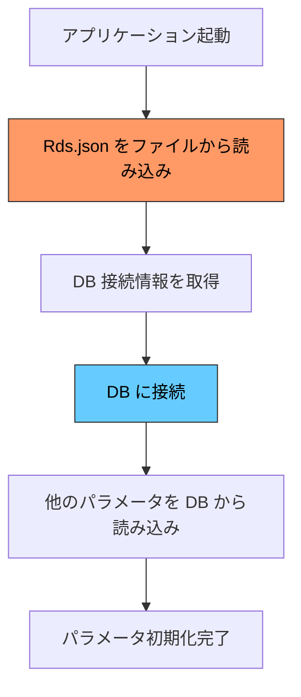
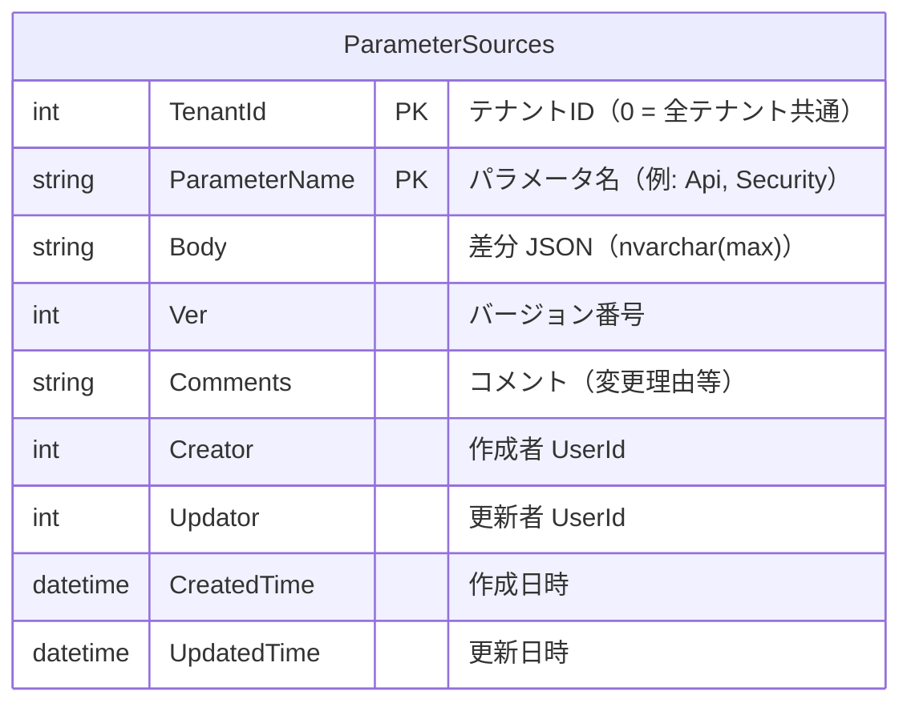
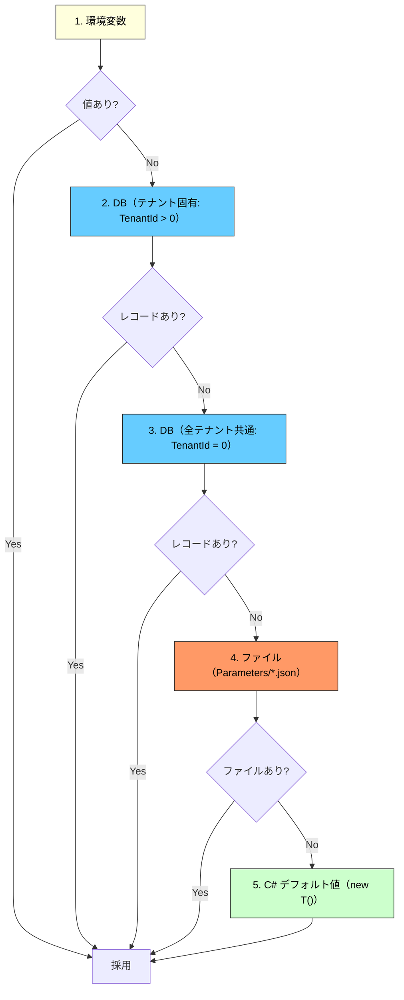
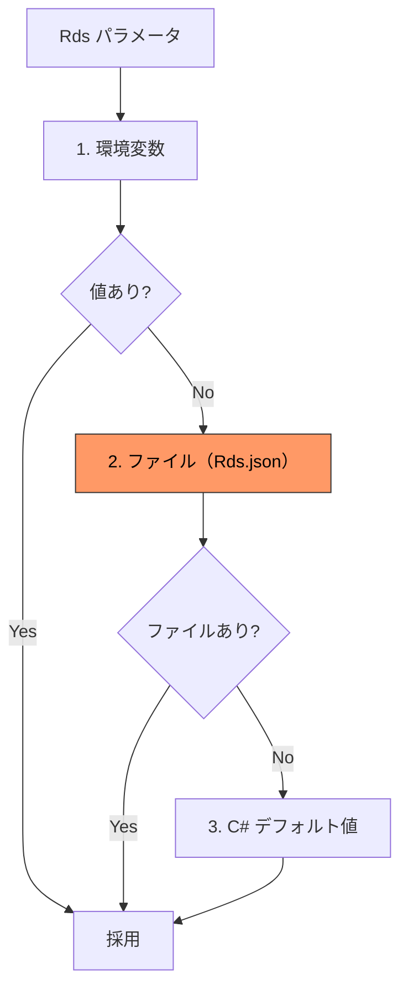
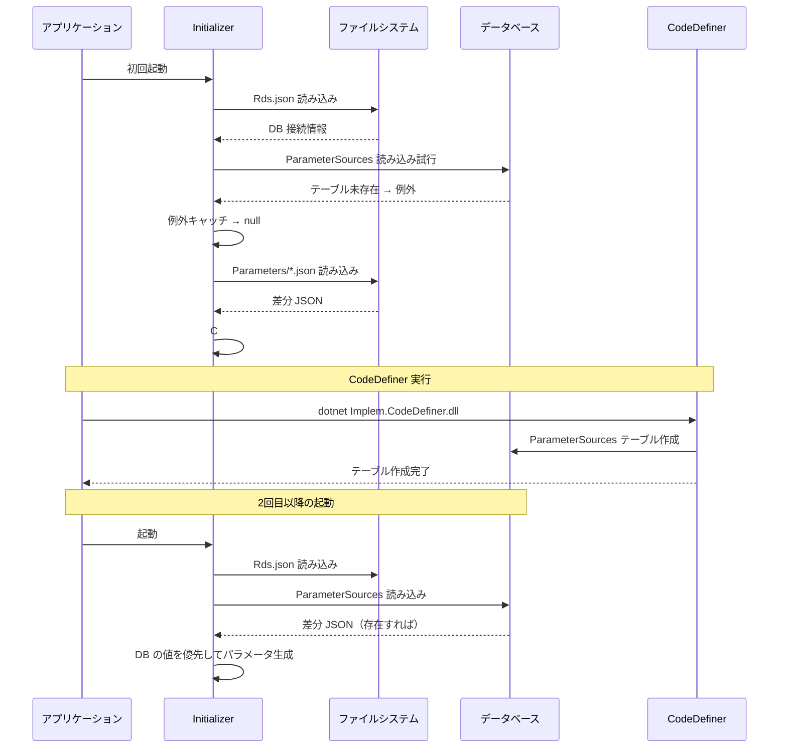
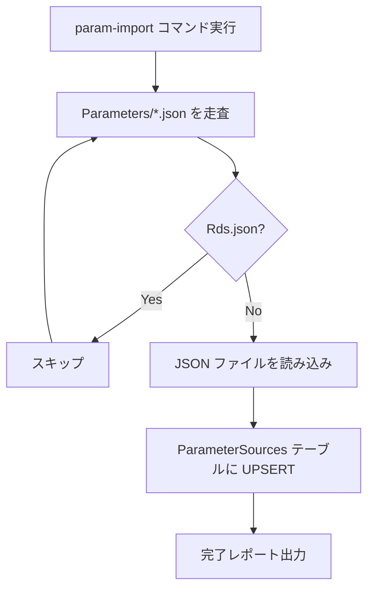
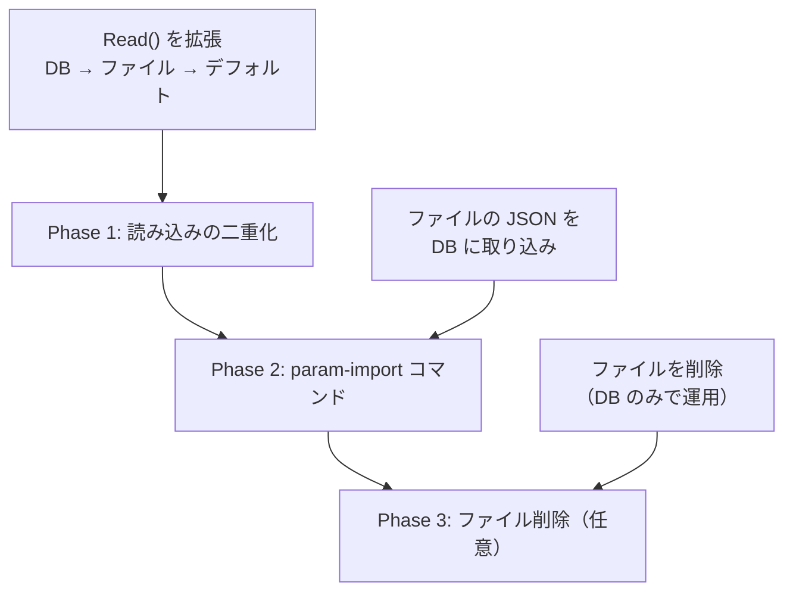
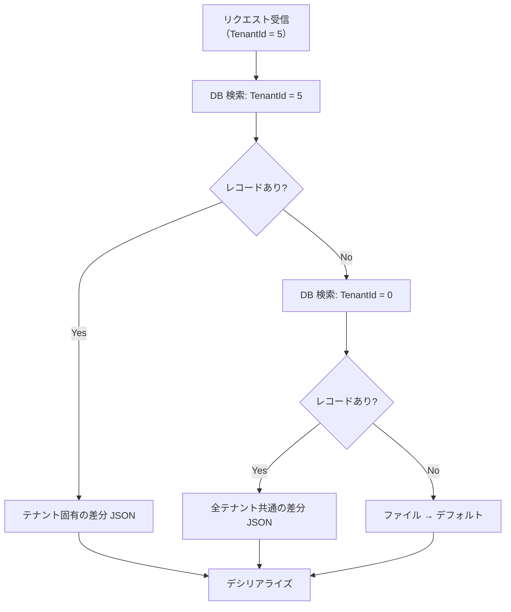

# パラメータ差分 JSON の DB 格納方式

案A（C# デフォルト値 + 部分 JSON 方式）を採用する前提で、差分 JSON をデータベースに格納する方式を設計する。Rds.json は DB 接続情報を含むためファイル必須とし、その他のパラメータは DB とファイルの両方から読み出し可能にする。

<!-- START doctoc generated TOC please keep comment here to allow auto update -->
<!-- DON'T EDIT THIS SECTION, INSTEAD RE-RUN doctoc TO UPDATE -->

- [調査情報](#調査情報)
- [調査目的](#調査目的)
- [前提: Rds.json のファイル必須制約](#前提-rdsjson-のファイル必須制約)
- [テーブル設計](#テーブル設計)
    - [ParameterSources テーブル](#parametersources-テーブル)
    - [TenantId = 0 の設計意図](#tenantid--0-の設計意図)
- [読み込みアーキテクチャ](#読み込みアーキテクチャ)
    - [優先順位チェーン](#優先順位チェーン)
    - [Rds の特殊処理](#rds-の特殊処理)
- [実装設計](#実装設計)
    - [Read メソッドの拡張](#read-メソッドの拡張)
    - [SetParameters の変更](#setparameters-の変更)
    - [初回起動時の考慮](#初回起動時の考慮)
- [DB への書き込み](#db-への書き込み)
    - [書き込みパターン](#書き込みパターン)
    - [書き込み時の SQL イメージ](#書き込み時の-sql-イメージ)
- [デシリアライズの動作](#デシリアライズの動作)
    - [差分 JSON のマージ方式](#差分-json-のマージ方式)
    - [DB とファイルの両方に値がある場合](#db-とファイルの両方に値がある場合)
- [注意すべきエッジケース](#注意すべきエッジケース)
- [CodeDefiner への追加タスク](#codedefiner-への追加タスク)
    - [カラム定義ファイル](#カラム定義ファイル)
    - [param-import コマンド（新規）](#param-import-コマンド新規)
- [ファイルから DB への移行](#ファイルから-db-への移行)
    - [移行フロー](#移行フロー)
    - [移行の可逆性](#移行の可逆性)
- [テナント毎パラメータの将来拡張](#テナント毎パラメータの将来拡張)
    - [テナント毎パラメータの読み込みフロー（将来）](#テナント毎パラメータの読み込みフロー将来)
    - [テナント毎パラメータの適用例](#テナント毎パラメータの適用例)
    - [テナント毎パラメータの注意点](#テナント毎パラメータの注意点)
- [結論](#結論)
- [関連ソースコード](#関連ソースコード)
- [関連ドキュメント](#関連ドキュメント)

<!-- END doctoc generated TOC please keep comment here to allow auto update -->

## 調査情報

| 調査日        | リポジトリ | ブランチ           | タグ/バージョン | コミット    | 備考     |
| ------------- | ---------- | ------------------ | --------------- | ----------- | -------- |
| 2026年3月11日 | Pleasanter | Pleasanter_1.5.1.0 | v1.5.1.0        | `34f162a43` | 初回調査 |

## 調査目的

[案A（C# デフォルト値 + 部分 JSON 方式）](002-CodeDefiner-Parameterマージ.md)では、
ユーザーは変更したプロパティのみを JSON に記載し、
未記載のプロパティは C# フィールド初期化子のデフォルト値で動作する。
この部分 JSON（差分 JSON）をファイルだけでなくデータベースにも格納できるようにすることで、
以下のユースケースに対応する。

| ユースケース                   | 説明                                                                                                  |
| ------------------------------ | ----------------------------------------------------------------------------------------------------- |
| マルチインスタンス環境         | 複数の Web サーバーで構成される環境で、パラメータ変更を全インスタンスに即時反映する                   |
| 管理画面からの設定変更         | 将来的に管理 UI からパラメータを変更し、DB に保存する運用を想定する                                   |
| テナント毎のパラメータ管理     | マルチテナント SaaS 環境で、テナント毎に異なるパラメータを適用する拡張の基盤とする                    |
| バックアップ・リストアの一元化 | DB バックアップにパラメータ設定も含められるようになる                                                 |
| 変更履歴の追跡                 | DB に格納することで、いつ・誰が・何を変更したかの履歴を既存の仕組み（\_history テーブル）で追跡できる |

---

## 前提: Rds.json のファイル必須制約

Rds.json には DB 接続文字列（`SaConnectionString`、`OwnerConnectionString`、`UserConnectionString`）が含まれる。
DB に接続するためにこの情報が必要であるため、
**Rds.json を DB から読むことは論理的に不可能**である（鶏と卵の問題）。



したがって、パラメータの読み込みソースは以下の 2 種類に分類される。

| 分類               | パラメータ                                          | 読み込みソース |
| ------------------ | --------------------------------------------------- | -------------- |
| **ファイル専用**   | `Rds`                                               | ファイルのみ   |
| **デュアルソース** | `Api`, `Security`, `General`, `Mail` 等（Rds 以外） | ファイル + DB  |

---

## テーブル設計

### ParameterSources テーブル

差分 JSON を格納する専用テーブルを新設する。プリザンターの既存テーブル設計パターン（3 テーブルセット: ベース / \_deleted / \_history）に準拠する。



#### カラム定義

| カラム名        | 型              | NULL 許容 | 説明                                                                               |
| --------------- | --------------- | :-------: | ---------------------------------------------------------------------------------- |
| `TenantId`      | `int`           |    No     | テナント ID。`0` はシステム全体（全テナント共通）の設定を表す                      |
| `ParameterName` | `nvarchar(128)` |    No     | パラメータ名。C# クラス名と一致させる（例: `Api`, `Security`, `General`）          |
| `Body`          | `nvarchar(max)` |    Yes    | 差分 JSON。案A の「変更分のみ」を格納する。NULL の場合は C# デフォルト値のみで動作 |
| `Ver`           | `int`           |    No     | バージョン番号。楽観的排他制御に使用。更新の度にインクリメント                     |
| `Comments`      | `nvarchar(max)` |    Yes    | JSON 形式のコメント配列。変更理由等を記録する                                      |
| `Creator`       | `int`           |    No     | 作成者の UserId                                                                    |
| `Updator`       | `int`           |    No     | 更新者の UserId                                                                    |
| `CreatedTime`   | `datetime`      |    No     | レコード作成日時                                                                   |
| `UpdatedTime`   | `datetime`      |    No     | レコード更新日時                                                                   |

#### 主キー

```sql
PRIMARY KEY (TenantId, ParameterName)
```

`TenantId = 0` はシステム全体の共通設定を表す特別な値である。テナント毎のパラメータ管理が不要な場合、全てのレコードは `TenantId = 0` で格納される。

#### 3 テーブルセット

プリザンターの標準パターンに従い、以下の 3 テーブルを生成する。

| テーブル名                 | 用途                                                 |
| -------------------------- | ---------------------------------------------------- |
| `ParameterSources`         | 現在の差分 JSON を保持する                           |
| `ParameterSources_history` | 変更履歴を保持する（`Ver` 毎にレコードが追加される） |
| `ParameterSources_deleted` | 論理削除されたレコードを保持する                     |

#### DDL（SQL Server）

```sql
CREATE TABLE [ParameterSources] (
    [TenantId]      INT             NOT NULL,
    [ParameterName] NVARCHAR(128)   NOT NULL,
    [Body]          NVARCHAR(MAX)       NULL,
    [Ver]           INT             NOT NULL DEFAULT 1,
    [Comments]      NVARCHAR(MAX)       NULL,
    [Creator]       INT             NOT NULL,
    [Updator]       INT             NOT NULL,
    [CreatedTime]   DATETIME        NOT NULL,
    [UpdatedTime]   DATETIME        NOT NULL,
    CONSTRAINT [PK_ParameterSources] PRIMARY KEY ([TenantId], [ParameterName])
);

CREATE TABLE [ParameterSources_history] (
    [TenantId]      INT             NOT NULL,
    [ParameterName] NVARCHAR(128)   NOT NULL,
    [Ver]           INT             NOT NULL,
    [Body]          NVARCHAR(MAX)       NULL,
    [Comments]      NVARCHAR(MAX)       NULL,
    [Creator]       INT             NOT NULL,
    [Updator]       INT             NOT NULL,
    [CreatedTime]   DATETIME        NOT NULL,
    [UpdatedTime]   DATETIME        NOT NULL,
    CONSTRAINT [PK_ParameterSources_history] PRIMARY KEY ([TenantId], [ParameterName], [Ver])
);

CREATE TABLE [ParameterSources_deleted] (
    [TenantId]      INT             NOT NULL,
    [ParameterName] NVARCHAR(128)   NOT NULL,
    [Body]          NVARCHAR(MAX)       NULL,
    [Ver]           INT             NOT NULL,
    [Comments]      NVARCHAR(MAX)       NULL,
    [Creator]       INT             NOT NULL,
    [Updator]       INT             NOT NULL,
    [CreatedTime]   DATETIME        NOT NULL,
    [UpdatedTime]   DATETIME        NOT NULL
);
```

#### DDL（PostgreSQL）

```sql
CREATE TABLE "ParameterSources" (
    "TenantId"      INTEGER         NOT NULL,
    "ParameterName" VARCHAR(128)    NOT NULL,
    "Body"          TEXT,
    "Ver"           INTEGER         NOT NULL DEFAULT 1,
    "Comments"      TEXT,
    "Creator"       INTEGER         NOT NULL,
    "Updator"       INTEGER         NOT NULL,
    "CreatedTime"   TIMESTAMP       NOT NULL,
    "UpdatedTime"   TIMESTAMP       NOT NULL,
    PRIMARY KEY ("TenantId", "ParameterName")
);

CREATE TABLE "ParameterSources_history" (
    "TenantId"      INTEGER         NOT NULL,
    "ParameterName" VARCHAR(128)    NOT NULL,
    "Ver"           INTEGER         NOT NULL,
    "Body"          TEXT,
    "Comments"      TEXT,
    "Creator"       INTEGER         NOT NULL,
    "Updator"       INTEGER         NOT NULL,
    "CreatedTime"   TIMESTAMP       NOT NULL,
    "UpdatedTime"   TIMESTAMP       NOT NULL,
    PRIMARY KEY ("TenantId", "ParameterName", "Ver")
);

CREATE TABLE "ParameterSources_deleted" (
    "TenantId"      INTEGER         NOT NULL,
    "ParameterName" VARCHAR(128)    NOT NULL,
    "Body"          TEXT,
    "Ver"           INTEGER         NOT NULL,
    "Comments"      TEXT,
    "Creator"       INTEGER         NOT NULL,
    "Updator"       INTEGER         NOT NULL,
    "CreatedTime"   TIMESTAMP       NOT NULL,
    "UpdatedTime"   TIMESTAMP       NOT NULL
);
```

#### DDL（MySQL）

```sql
CREATE TABLE `ParameterSources` (
    `TenantId`      INT             NOT NULL,
    `ParameterName` VARCHAR(128)    NOT NULL,
    `Body`          LONGTEXT,
    `Ver`           INT             NOT NULL DEFAULT 1,
    `Comments`      LONGTEXT,
    `Creator`       INT             NOT NULL,
    `Updator`       INT             NOT NULL,
    `CreatedTime`   DATETIME        NOT NULL,
    `UpdatedTime`   DATETIME        NOT NULL,
    PRIMARY KEY (`TenantId`, `ParameterName`)
) ENGINE=InnoDB DEFAULT CHARSET=utf8mb4;

CREATE TABLE `ParameterSources_history` (
    `TenantId`      INT             NOT NULL,
    `ParameterName` VARCHAR(128)    NOT NULL,
    `Ver`           INT             NOT NULL,
    `Body`          LONGTEXT,
    `Comments`      LONGTEXT,
    `Creator`       INT             NOT NULL,
    `Updator`       INT             NOT NULL,
    `CreatedTime`   DATETIME        NOT NULL,
    `UpdatedTime`   DATETIME        NOT NULL,
    PRIMARY KEY (`TenantId`, `ParameterName`, `Ver`)
) ENGINE=InnoDB DEFAULT CHARSET=utf8mb4;

CREATE TABLE `ParameterSources_deleted` (
    `TenantId`      INT             NOT NULL,
    `ParameterName` VARCHAR(128)    NOT NULL,
    `Body`          LONGTEXT,
    `Ver`           INT             NOT NULL,
    `Comments`      LONGTEXT,
    `Creator`       INT             NOT NULL,
    `Updator`       INT             NOT NULL,
    `CreatedTime`   DATETIME        NOT NULL,
    `UpdatedTime`   DATETIME        NOT NULL
) ENGINE=InnoDB DEFAULT CHARSET=utf8mb4;
```

### TenantId = 0 の設計意図

`TenantId = 0` を「全テナント共通」の設定として使用する設計にはいくつかの利点がある。

| 観点                 | 説明                                                                                          |
| -------------------- | --------------------------------------------------------------------------------------------- |
| 現行との互換性       | 現行の `Parameters/*.json` はテナント区分なしの全体設定。`TenantId = 0` がこれに対応する      |
| 拡張性               | 将来テナント毎にパラメータを変えたい場合、`TenantId > 0` のレコードを追加するだけで実現できる |
| フォールバック       | テナント固有の設定がない場合は `TenantId = 0` にフォールバックする階層構造を構築できる        |
| 既存テーブルとの整合 | Tenants テーブルの `TenantId` カラムとの整合性が保たれる（ただし FK 制約は設けない）          |

---

## 読み込みアーキテクチャ

### 優先順位チェーン

パラメータの読み込みは以下の優先順位で行う。先に見つかった値が優先される。



| 優先度 | ソース                         | 用途                                                      |
| :----: | ------------------------------ | --------------------------------------------------------- |
|   1    | 環境変数                       | 機密情報（接続文字列、パスワード等）の注入。既存の仕組み  |
|   2    | DB（テナント固有）             | テナント毎のカスタマイズ（将来拡張）                      |
|   3    | DB（全テナント共通）           | 管理画面から変更した全体設定                              |
|   4    | ファイル（Parameters/\*.json） | 従来通りのファイルベース設定。DB 未使用時のフォールバック |
|   5    | C# デフォルト値                | JSON にもDB にも値がない場合のフォールバック              |

### Rds の特殊処理

`Rds` パラメータは DB 接続前に読み込む必要があるため、優先順位チェーンから DB を除外する。



---

## 実装設計

### Read メソッドの拡張

現行の `Read<T>()` メソッドを拡張し、DB からの読み込みに対応する。

**現行**: `Implem.DefinitionAccessor/Initializer.cs`

```csharp
private static T Read<T>(bool required = true)
{
    var name = typeof(T).Name;
    var json = Files.Read(JsonFilePath(name));
    var data = json.Deserialize<T>();
    if (required)
    {
        if (json.IsNullOrEmpty())
        {
            throw new ParametersNotFoundException(name + ".json");
        }
        if (!json.IsNullOrEmpty() && data == null)
        {
            throw new ParametersIllegalSyntaxException(name + ".json");
        }
    }
    return data;
}
```

**改修後のイメージ**:

```csharp
/// <summary>
/// パラメータを読み込む。DB → ファイル → C# デフォルト値の順でフォールバックする。
/// dbAvailable が false の場合（Rds 等）は DB からの読み込みをスキップする。
/// </summary>
private static T Read<T>(bool required = true, bool dbAvailable = true) where T : new()
{
    var name = typeof(T).Name;

    // 1. DB から読み込み（DB 接続が利用可能な場合のみ）
    string json = null;
    if (dbAvailable)
    {
        json = ReadFromDb(name, tenantId: 0);
    }

    // 2. ファイルから読み込み（DB に存在しなかった場合）
    if (json.IsNullOrEmpty())
    {
        json = Files.Read(JsonFilePath(name));
    }

    // 3. デシリアライズ（JSON があれば C# デフォルト + JSON 上書き）
    if (!json.IsNullOrEmpty())
    {
        var data = json.Deserialize<T>();
        if (data == null && required)
        {
            throw new ParametersIllegalSyntaxException(name + ".json");
        }
        return data ?? new T();
    }

    // 4. JSON がなければ C# デフォルト値のみ
    if (required)
    {
        throw new ParametersNotFoundException(name + ".json");
    }
    return new T();
}

/// <summary>
/// ParameterSources テーブルから差分 JSON を読み込む。
/// </summary>
private static string ReadFromDb(string parameterName, int tenantId)
{
    try
    {
        // テナント固有 → 全テナント共通の順で検索
        return Rds.ExecuteScalar_string(
            commandText: Def.Sql.SelectParameterSource,
            param: new SqlParamCollection {
                { "TenantId", tenantId },
                { "ParameterName", parameterName }
            });
    }
    catch
    {
        // DB 未初期化（初回起動時等）の場合は null を返す
        return null;
    }
}
```

### SetParameters の変更

`SetParameters()` メソッドでは、`Rds` の読み込みを先に行い、その後に DB 接続が可能な状態で他のパラメータを読み込む。

```csharp
public static void SetParameters()
{
    // Phase 1: DB 接続前に読み込むパラメータ（ファイルのみ）
    Parameters.Env = Read<Env>(required: false, dbAvailable: false);
    if (Parameters.Env?.ParametersPath.IsNullOrEmpty() == false)
    {
        ParametersPath = Parameters.Env?.ParametersPath;
    }
    Parameters.Rds = Read<Rds>(dbAvailable: false);  // ← ファイルのみ
    Parameters.Kvs = Read<Kvs>(dbAvailable: false);  // ← DB 接続前に必要

    // Phase 2: DB 接続後に読み込むパラメータ（DB + ファイル）
    Parameters.Api = Read<Api>();             // DB → ファイル → デフォルト
    Parameters.Authentication = Read<Authentication>();
    Parameters.Security = Read<Security>();
    Parameters.General = Read<General>();
    Parameters.Mail = Read<Mail>();
    Parameters.Service = Read<Service>();
    // ... 他のパラメータも同様
}
```

### 初回起動時の考慮

初回起動時は DB テーブルがまだ存在しないため、`ReadFromDb()` は例外をキャッチして `null` を返す。この場合はファイルまたは C# デフォルト値にフォールバックする。



---

## DB への書き込み

### 書き込みパターン

差分 JSON を DB に書き込む方法として、以下のパターンを想定する。

| パターン             | 説明                                                                                      |
| -------------------- | ----------------------------------------------------------------------------------------- |
| 管理画面 UI          | 将来的にパラメータ編集画面を実装し、変更を DB に保存する                                  |
| API                  | 管理用 API 経由でパラメータを変更する                                                     |
| CodeDefiner コマンド | `dotnet Implem.CodeDefiner.dll param-import` のようなコマンドでファイルから DB に取り込む |
| 直接 SQL             | 運用担当者が SQL で直接 INSERT/UPDATE する                                                |

### 書き込み時の SQL イメージ

```sql
-- UPSERT（SQL Server）
MERGE INTO [ParameterSources] AS target
USING (VALUES (@TenantId, @ParameterName)) AS source ([TenantId], [ParameterName])
ON target.[TenantId] = source.[TenantId]
   AND target.[ParameterName] = source.[ParameterName]
WHEN MATCHED THEN
    UPDATE SET
        [Body] = @Body,
        [Ver] = target.[Ver] + 1,
        [Comments] = @Comments,
        [Updator] = @Updator,
        [UpdatedTime] = GETDATE()
WHEN NOT MATCHED THEN
    INSERT ([TenantId], [ParameterName], [Body], [Ver], [Comments],
            [Creator], [Updator], [CreatedTime], [UpdatedTime])
    VALUES (@TenantId, @ParameterName, @Body, 1, @Comments,
            @Creator, @Updator, GETDATE(), GETDATE());
```

```sql
-- 読み込み用 SELECT
-- テナント固有 → 全テナント共通のフォールバック
SELECT TOP 1 [Body]
FROM [ParameterSources]
WHERE [ParameterName] = @ParameterName
  AND [TenantId] IN (@TenantId, 0)
ORDER BY [TenantId] DESC;  -- テナント固有（TenantId > 0）を優先
```

---

## デシリアライズの動作

### 差分 JSON のマージ方式

案A の原理に基づき、Newtonsoft.Json の `DeserializeObject<T>()` が差分 JSON のマージを自動的に行う。

```mermaid
flowchart LR
    A["new T()\n（C# デフォルト値）"] --> B["JSON のプロパティで上書き"]
    B --> C["結果オブジェクト"]

    subgraph JSON["差分 JSON（DB または ファイル）"]
        J1['"PageSize": 500']
    end

    subgraph Default["C# デフォルト値"]
        D1["Version = 1.1m"]
        D2["Enabled = true"]
        D3["PageSize = 200"]
        D4["LimitPerSite = 0"]
    end

    subgraph Result["結果"]
        R1["Version = 1.1"]
        R2["Enabled = true"]
        R3["PageSize = 500 ← JSON"]
        R4["LimitPerSite = 0"]
    end

    Default --> A
    JSON --> B
```

### DB とファイルの両方に値がある場合

DB とファイルの両方に差分 JSON が存在する場合、**DB の値が優先**される。ファイルの値は読み込まれない（上書きではなく排他的な選択）。

```csharp
// DB に値があればそれを使用し、なければファイルを使用する
// 両方の差分 JSON を「マージ」するのではなく、一方のみを選択する
string json = ReadFromDb(name) ?? Files.Read(JsonFilePath(name));
```

これは以下の理由による。

| 理由               | 説明                                                                                                  |
| ------------------ | ----------------------------------------------------------------------------------------------------- |
| 予測可能性         | 2 つの差分 JSON をマージすると、結果が予測困難になる                                                  |
| デバッグ容易性     | どちらのソースが使われているかが明確である                                                            |
| 既存の案A との整合 | 案A は「C# デフォルト値 + 1 つの差分 JSON」を前提としており、差分の多段マージは想定外                 |
| 運用上の混乱防止   | ファイルにも DB にも設定がある状態は管理が煩雑になるため、DB 移行後はファイルを削除する運用を推奨する |

---

## 注意すべきエッジケース

| ケース                                     | 影響 | 対応方針                                                                                        |
| ------------------------------------------ | :--: | ----------------------------------------------------------------------------------------------- |
| DB テーブル未作成（初回起動）              |  低  | `ReadFromDb()` で例外キャッチし `null` を返す。ファイル / デフォルトにフォールバック            |
| DB 接続障害                                |  中  | `ReadFromDb()` で例外キャッチし `null` を返す。ファイル / デフォルトにフォールバック            |
| Body が不正な JSON                         |  中  | デシリアライズエラーを検出し、ParametersIllegalSyntaxException をスロー                         |
| テナント固有と共通の両方にレコードあり     |  低  | `TenantId DESC` の ORDER BY でテナント固有を優先（設計通り）                                    |
| 同じパラメータがファイルと DB の両方に存在 |  低  | DB を優先。ファイルは読み込まない。運用上は DB 移行後にファイルを削除することを推奨             |
| DB に `Rds` のレコードを誤って格納         |  低  | `Rds` は `dbAvailable: false` で読み込むため、DB のレコードは無視される                         |
| 環境変数によるプロパティ単位の上書き       |  低  | 環境変数は従来通り最優先。DB / ファイルで読み込んだ後に環境変数で個別プロパティを上書き         |
| パラメータの配列プロパティ（`List<T>` 等） |  中  | `DeserializeObject<T>()` は配列全体を置換する。部分的な配列操作は不可                           |
| バージョンアップで C# デフォルト値が変更   |  低  | [方式6（バージョン属性方式）](003-Parameterデフォルト値変更検知.md)による検知は DB/ファイル共通 |

---

## CodeDefiner への追加タスク

ParameterSources テーブルは CodeDefiner のテーブル生成機構で作成する。

### カラム定義ファイル

プリザンターのテーブル生成は `App_Data/Definitions/Definition_Column/` 配下の JSON ファイルで定義される。ParameterSources テーブル用の定義ファイルを追加する必要がある。

| 定義ファイル                          | 内容           |
| ------------------------------------- | -------------- |
| `ParameterSources_TenantId.json`      | テナント ID    |
| `ParameterSources_ParameterName.json` | パラメータ名   |
| `ParameterSources_Body.json`          | 差分 JSON 本体 |
| `ParameterSources_Ver.json`           | バージョン番号 |
| `ParameterSources_Comments.json`      | コメント       |
| `ParameterSources_Creator.json`       | 作成者         |
| `ParameterSources_Updator.json`       | 更新者         |
| `ParameterSources_CreatedTime.json`   | 作成日時       |
| `ParameterSources_UpdatedTime.json`   | 更新日時       |

### param-import コマンド（新規）

ファイルの差分 JSON を DB に取り込むための CodeDefiner コマンドを追加する。

```text
dotnet Implem.CodeDefiner.dll param-import [/t:{tenantId}]
```



---

## ファイルから DB への移行

### 移行フロー

既存のファイルベース運用から DB ベース運用への移行は段階的に行う。



| Phase   | 内容                                                                                  | 既存環境への影響 |
| ------- | ------------------------------------------------------------------------------------- | :--------------: |
| Phase 1 | `Read<T>()` を拡張し、DB → ファイル → デフォルトの優先順位で読み込む                  |       なし       |
| Phase 2 | `param-import` コマンドでファイルの JSON を DB に取り込む                             |       なし       |
| Phase 3 | DB に取り込み済みのファイルを削除（任意。ファイルを残しても DB が優先されるため無害） |       なし       |

### 移行の可逆性

DB に格納した差分 JSON をファイルに書き戻すコマンド（`param-export`）も提供することで、いつでもファイルベース運用に戻せるようにする。

```text
dotnet Implem.CodeDefiner.dll param-export [/t:{tenantId}] [/o:{outputPath}]
```

---

## テナント毎パラメータの将来拡張

現時点では全パラメータを `TenantId = 0`（全テナント共通）で管理するが、テーブル設計に `TenantId` を含めることで将来の拡張に備える。

### テナント毎パラメータの読み込みフロー（将来）



### テナント毎パラメータの適用例

```json
// ParameterSources: TenantId = 0, ParameterName = "Api"
// 全テナント共通設定
{
    "PageSize": 500
}

// ParameterSources: TenantId = 5, ParameterName = "Api"
// テナント 5 の固有設定
{
    "PageSize": 1000,
    "LimitPerSite": 100
}
```

この場合、テナント 5 のリクエストでは `PageSize = 1000`, `LimitPerSite = 100` が適用され、
他のプロパティは C# デフォルト値が使用される。
テナント 5 以外のリクエストでは `PageSize = 500` が適用される。

### テナント毎パラメータの注意点

| 項目                                        | 内容                                                                                   |
| ------------------------------------------- | -------------------------------------------------------------------------------------- |
| パラメータのスコープ                        | 全てのパラメータがテナント毎に分離可能とは限らない。DB 接続（`Rds`）は当然不可         |
| テナント毎に変えて意味があるもの            | `Api`（PageSize 等）、`Security`（LockoutCount 等）、`General`（GridPageSize 等）      |
| テナント毎に変えるべきでないもの            | `BinaryStorage`（ストレージパス）、`Service`（サービス名）等のインフラ設定             |
| テナント毎パラメータのキャッシュ            | テナント毎にパラメータをキャッシュする仕組みが必要。リクエスト毎の DB アクセスは避ける |
| 既存の Context.SetTenantProperties との関係 | テナントプロパティ設定と同じタイミングでテナント毎パラメータを読み込むことが考えられる |

---

## 結論

| 項目                | 内容                                                                                                                           |
| ------------------- | ------------------------------------------------------------------------------------------------------------------------------ |
| 採用方式            | 案A（C# デフォルト値 + 部分 JSON 方式）を前提に、差分 JSON の格納先として DB を追加                                            |
| 新規テーブル        | `ParameterSources`（+ `_history` / `_deleted`）。複合主キー `(TenantId, ParameterName)` で、テナント毎のパラメータ管理にも対応 |
| Rds.json の扱い     | ファイル必須。DB 接続情報を含むため、DB からの読み込みは行わない（`dbAvailable: false`）                                       |
| 読み込み優先順位    | 環境変数 → DB（テナント固有）→ DB（全テナント共通）→ ファイル → C# デフォルト値                                                |
| DB とファイルの共存 | DB に値があれば DB を優先。ファイルは読み込まない（差分 JSON の多段マージは行わない）                                          |
| 移行方式            | 段階的に移行。Phase 1（読み込み二重化）→ Phase 2（param-import）→ Phase 3（ファイル削除、任意）                                |
| 将来拡張            | `TenantId` カラムにより、テナント毎のパラメータ管理に拡張可能                                                                  |
| 既存環境への影響    | なし。DB にレコードがなければ従来通りファイル / デフォルト値で動作する                                                         |

## 関連ソースコード

| ファイル                                   | 説明                                              |
| ------------------------------------------ | ------------------------------------------------- |
| `Implem.DefinitionAccessor/Initializer.cs` | パラメータ初期化・`Read<T>()` / `SetParameters()` |
| `Implem.ParameterAccessor/Parts/Rds.cs`    | DB 接続情報パラメータ（ファイル必須の根拠）       |
| `Implem.ParameterAccessor/Parts/*.cs`      | パラメータクラス定義（約87クラス）                |
| `Implem.ParameterAccessor/Parameters.cs`   | パラメータインスタンス保持クラス                  |
| `Implem.Libraries/Utilities/Jsons.cs`      | JSON デシリアライズ                               |
| `Implem.CodeDefiner/Starter.cs`            | CLI エントリポイント・コマンド定義                |

## 関連ドキュメント

| ドキュメント                                                                                | 説明                                            |
| ------------------------------------------------------------------------------------------- | ----------------------------------------------- |
| [CodeDefiner パラメータマージ（merge）の問題点と代替案](002-CodeDefiner-Parameterマージ.md) | 案A 〜 E の比較検討（本調査の前提ドキュメント） |
| [パラメータデフォルト値の変更検知方式](003-Parameterデフォルト値変更検知.md)                | 案A 採用時のデフォルト値変更検知方法            |
| [データベーステーブル定義一覧](../12-データベース/001-データベーステーブル定義一覧.md)      | 既存テーブル構造の参照                          |
| [テナント履歴機能追加調査](../12-データベース/009-テナント履歴機能追加調査.md)              | \_history テーブルの設計パターン                |
