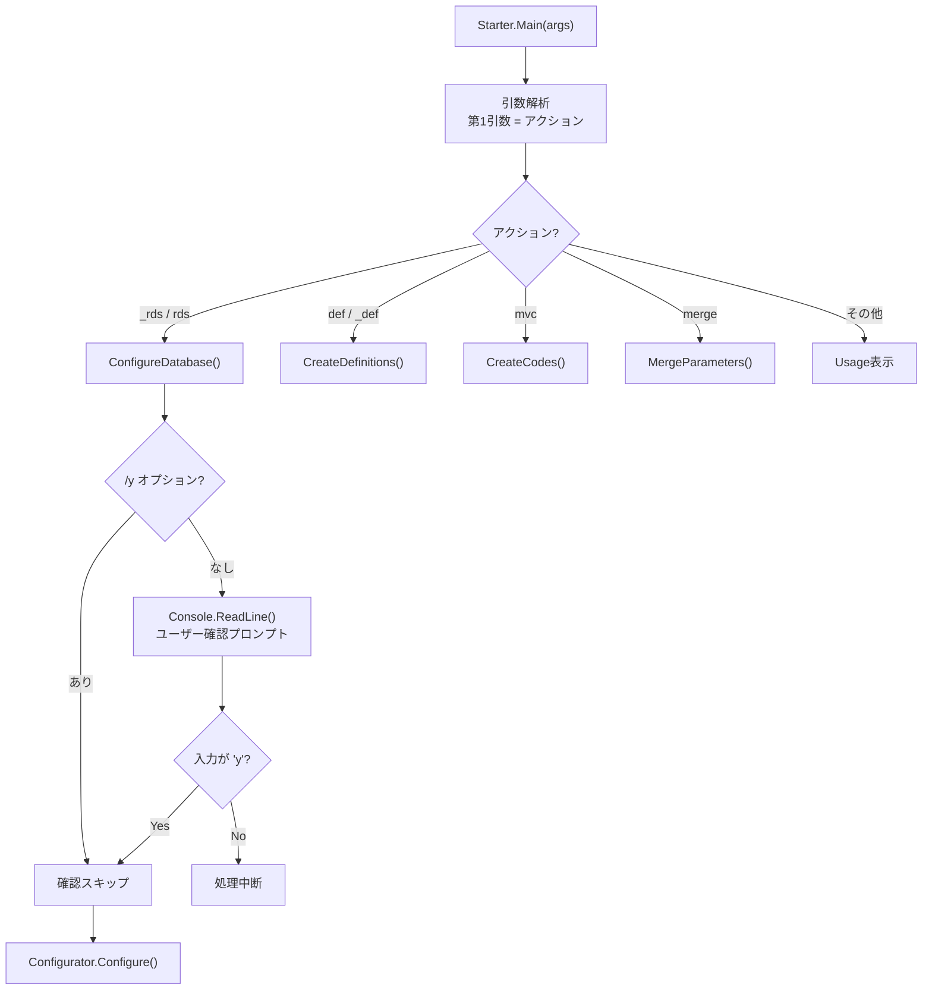
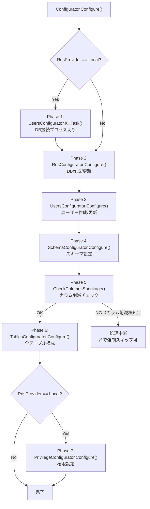
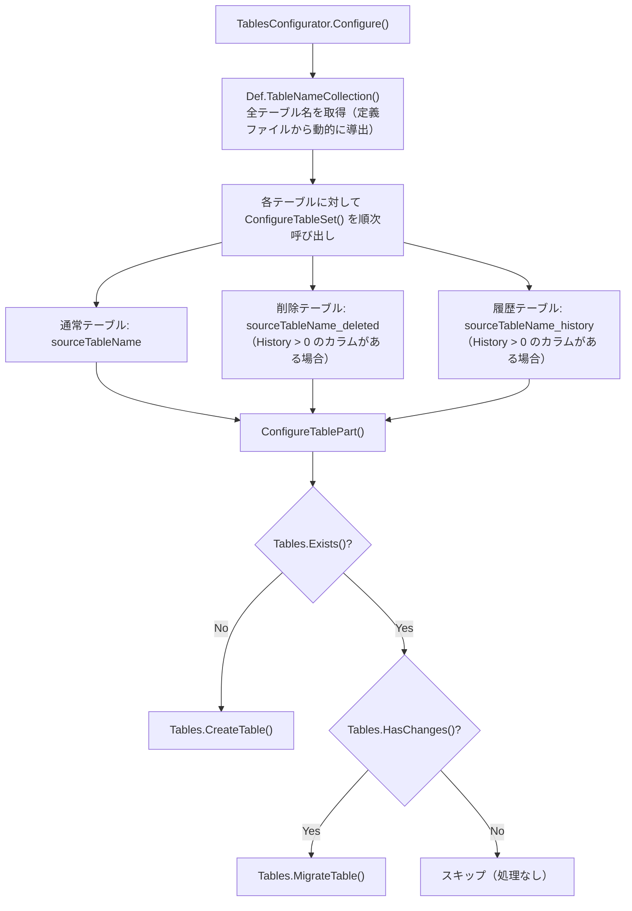
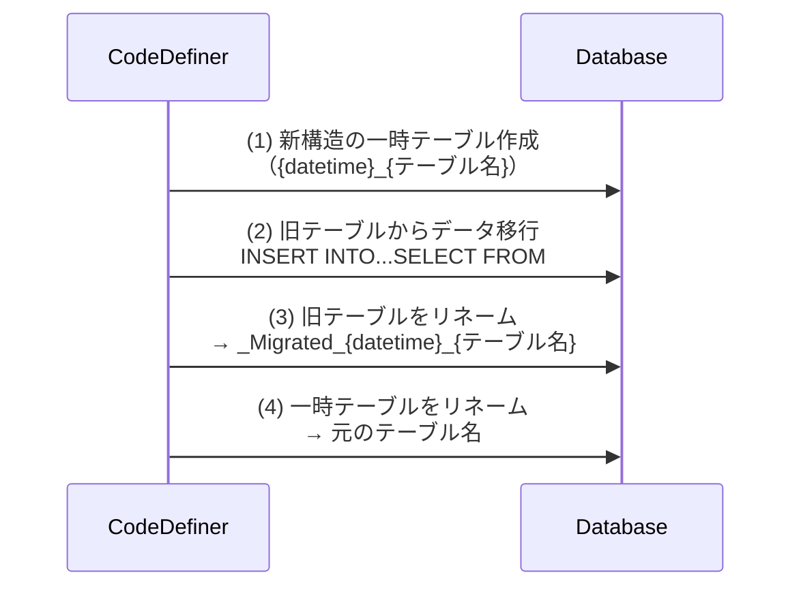
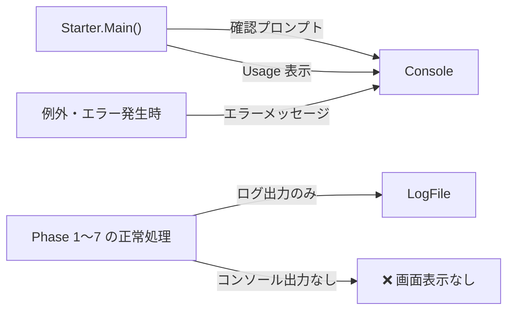

# CodeDefiner セットアップ処理フローと画面出力

CodeDefiner の `_rds`/`rds` コマンド実行時に、ユーザーが `y` を入力してから処理が完了するまでの内部処理フロー・ループ処理・コンソール出力の仕組みを調査した。

<!-- START doctoc generated TOC please keep comment here to allow auto update -->
<!-- DON'T EDIT THIS SECTION, INSTEAD RE-RUN doctoc TO UPDATE -->

- [調査情報](#調査情報)
- [調査目的](#調査目的)
- [エントリポイントと確認プロンプト](#エントリポイントと確認プロンプト)
    - [Starter.Main() の全体構造](#startermain-の全体構造)
    - [確認プロンプトの仕組み](#確認プロンプトの仕組み)
- [y 入力後の処理フロー](#y-入力後の処理フロー)
    - [Configurator.Configure() のオーケストレーション](#configuratorconfigure-のオーケストレーション)
    - [各フェーズの処理時間特性](#各フェーズの処理時間特性)
- [ループ処理の詳細（Phase 6）](#ループ処理の詳細phase-6)
    - [TablesConfigurator のループ構造](#tablesconfigurator-のループ構造)
    - [テーブル数と処理量](#テーブル数と処理量)
    - [MigrateTable のコスト](#migratetable-のコスト)
- [コンソール出力の仕組み](#コンソール出力の仕組み)
    - [出力先の分類](#出力先の分類)
    - [標準出力（コンソール）への出力箇所](#標準出力コンソールへの出力箇所)
    - [ログ出力の仕組み](#ログ出力の仕組み)
- [「画面に何も表示されない」問題の原因](#画面に何も表示されない問題の原因)
    - [原因1: 正常処理中の標準出力が存在しない](#原因1-正常処理中の標準出力が存在しない)
    - [原因2: Phase 6 のループが長時間無音で実行される](#原因2-phase-6-のループが長時間無音で実行される)
    - [原因3: エラーが発生してもコンソールに出ないケースがある](#原因3-エラーが発生してもコンソールに出ないケースがある)
    - [原因まとめ](#原因まとめ)
- [改善の方向性](#改善の方向性)
    - [改善案](#改善案)
    - [出力例（改善後のイメージ）](#出力例改善後のイメージ)
- [結論](#結論)
- [関連ソースコード](#関連ソースコード)
- [関連ドキュメント](#関連ドキュメント)

<!-- END doctoc generated TOC please keep comment here to allow auto update -->

---

## 調査情報

| 調査日     | リポジトリ | ブランチ           | タグ/バージョン | コミット    | 備考     |
| ---------- | ---------- | ------------------ | --------------- | ----------- | -------- |
| 2026-04-16 | Pleasanter | Pleasanter_1.5.1.0 |                 | `e58aa58fc` | 初回調査 |

## 調査目的

CodeDefiner セットアップ時にユーザーが `y` を入力してから画面に何も表示されない・進捗が見えないという問題がある。原因を明らかにするため、エントリポイントから完了までの処理フロー・ループ処理・コンソール出力の仕組みを調査する。

---

## エントリポイントと確認プロンプト

### Starter.Main() の全体構造

**ファイル**: `Implem.CodeDefiner/Starter.cs`

`Starter.Main()` はコマンドライン引数を解析し、対応するメソッドへディスパッチする。`_rds` および `rds` コマンドは `ConfigureDatabase()` メソッドに委譲される。



### 確認プロンプトの仕組み

`/y` オプションが指定されていない場合、`Starter.cs` は `Console.ReadLine()` でユーザー入力を待機する。入力が `"y"` と一致した場合のみ処理を継続する。`/y` オプションはこの確認をスキップし、即座に `Configurator.Configure()` へ進む。

| 状況           | 挙動                           |
| -------------- | ------------------------------ |
| `/y` なし      | プロンプト表示 → 入力待ち      |
| `/y` あり      | 入力待ちなし → 即処理開始      |
| `y` 以外を入力 | 処理中断（コンソールのみ終了） |

---

## y 入力後の処理フロー

### Configurator.Configure() のオーケストレーション

**ファイル**: `Implem.CodeDefiner/Functions/Rds/Configurator.cs`

`y` 入力（または `/y` オプション）の後、`Configurator.Configure()` が呼ばれる。ここが実際のセットアップ処理全体のオーケストレーターである。



### 各フェーズの処理時間特性

| フェーズ | クラス                  | 処理内容                        | 時間特性                                           |
| -------- | ----------------------- | ------------------------------- | -------------------------------------------------- |
| 1        | `UsersConfigurator`     | DB接続プロセス切断              | 短い（数秒以内）                                   |
| 2        | `RdsConfigurator`       | DB作成/更新                     | 短い（DBが既に存在する場合は軽量）                 |
| 3        | `UsersConfigurator`     | ユーザー作成/更新               | 短い（数秒以内）                                   |
| 4        | `SchemaConfigurator`    | スキーマ設定                    | 短い                                               |
| 5        | `CheckColumnsShrinkage` | Issues/Resultsカラム削減確認    | 短い（2テーブルのみ）                              |
| 6        | `TablesConfigurator`    | 全テーブル作成/マイグレーション | **最も長い（全テーブル × 3バリアントを順次処理）** |
| 7        | `PrivilegeConfigurator` | 権限付与                        | 短い                                               |

---

## ループ処理の詳細（Phase 6）

`y` 入力後に画面が止まって見える主な原因は **Phase 6（TablesConfigurator）** の逐次ループ処理である。

### TablesConfigurator のループ構造

**ファイル**: `Implem.CodeDefiner/Functions/Rds/TablesConfigurator.cs`



### テーブル数と処理量

プリザンター標準インストール時の定義テーブルは約 50 テーブル（`Def.TableNameCollection()` が返す数）であり、それぞれに対して最大 3 バリアント（通常/\_deleted/\_history）の構成が行われる。そのため、最大で約 150 回の `ConfigureTablePart()` 呼び出しが発生する。

| 条件                               | `ConfigureTablePart()` の実行回数    |
| ---------------------------------- | ------------------------------------ |
| 初回インストール（テーブル未存在） | 約 50〜150 回（CREATE TABLE）        |
| バージョンアップ（変更ありの場合） | 約 50〜150 回（MigrateTable を含む） |
| バージョンアップ（変更なし）       | 約 50〜150 回（ほぼスキップ）        |

### MigrateTable のコスト

テーブルに変更がある場合、マイグレーションは「テンポラリテーブル作成 → データ移行 → RENAME」方式で実行される。大量データがある本番環境では、1テーブルあたりのマイグレーションに数分かかることもある。



---

## コンソール出力の仕組み

### 出力先の分類

CodeDefiner の出力は **コンソール（標準出力）** と **ログファイル** の 2 系統に分かれる。

| 出力先                 | 内容                               | 備考                           |
| ---------------------- | ---------------------------------- | ------------------------------ |
| 標準出力（コンソール） | 確認プロンプト・エラーメッセージ   | ユーザーが直接目にする         |
| `logs/*.log`           | 実行ログ（処理の詳細・エラー詳細） | ファイルに逐次書き込み         |
| `logs/*.sql`           | 実行 SQL スクリプト                | SQL 変更が発生した場合のみ生成 |

ログファイルの命名規則:

| ファイル名                               | 内容                           |
| ---------------------------------------- | ------------------------------ |
| `Implem.CodeDefiner_yyyyMMdd_HHmmss.log` | 実行ログ                       |
| `Implem.CodeDefiner_yyyyMMdd_HHmmss.sql` | 実行 SQL（変更がある場合のみ） |

### 標準出力（コンソール）への出力箇所

調査した範囲では、`y` 入力後の処理中に標準出力へ書き込む箇所は**確認プロンプトとエラー系のみ**に限られており、正常処理中の各フェーズ・各テーブル処理に対するプログレス表示は存在しない。



### ログ出力の仕組み

各 Configurator クラスはログライブラリ経由でログファイルに書き込む。処理の開始・終了・SQL 実行内容・エラーはログに記録されるが、**標準出力には出力されない**。

---

## 「画面に何も表示されない」問題の原因

以上の調査から、`y` 入力後に画面に何も表示されない原因は以下の通りである。

### 原因1: 正常処理中の標準出力が存在しない

各フェーズ（Phase 1〜7）の処理において、フェーズ開始・完了・テーブル単位の進捗を標準出力に書き出す処理が実装されていない。全ての詳細はログファイルにのみ記録される。

### 原因2: Phase 6 のループが長時間無音で実行される

`TablesConfigurator.Configure()` は約 50 テーブル × 最大 3 バリアントを逐次処理するが、この間コンソールには一切出力されない。初回インストール時は全テーブルの CREATE TABLE が実行されるため、特に時間がかかる。

### 原因3: エラーが発生してもコンソールに出ないケースがある

DB 接続エラーや SQL 実行エラーが `catch` ブロックでログファイルに書き込まれるだけで、標準出力に伝搬しない場合がある。その結果、処理が途中で止まっていてもユーザーには「無表示のまま待機中」と見える。

### 原因まとめ

| 原因                           | 詳細                                                                        |
| ------------------------------ | --------------------------------------------------------------------------- |
| 正常処理中の標準出力がない     | Phase 1〜7 のフェーズ開始・完了・テーブル単位の進捗が標準出力に出力されない |
| Phase 6 のループが長い         | 全テーブル × 3 バリアントを逐次処理するため、初回インストール時は特に長い   |
| エラーがコンソールに伝搬しない | エラーがログファイルにのみ記録され、ユーザーには無表示のまま止まって見える  |

---

## 改善の方向性

問題を解消するには、標準出力への進捗出力を追加することが有効である。

### 改善案

| 対象箇所                                    | 追加すべき出力内容                                     | 効果                                 |
| ------------------------------------------- | ------------------------------------------------------ | ------------------------------------ |
| `Configurator.Configure()` の各フェーズ前後 | `"[Phase N/7] {フェーズ名} 開始/完了"` の出力          | ユーザーが処理の進行段階を把握できる |
| `TablesConfigurator.Configure()` のループ内 | `"[N/total] {テーブル名} ..."` の逐次出力              | テーブル単位の進捗が見える           |
| `MigrateTable()` 実行前後                   | `"Migrating {テーブル名} ..."` と完了メッセージ        | データ移行中であることが分かる       |
| エラー発生時                                | `Console.Error.WriteLine()` でエラーを標準エラーに出力 | エラーが画面で即座に把握できる       |

### 出力例（改善後のイメージ）

```text
Starting CodeDefiner _rds...
[Phase 1/7] KillTask: DB接続プロセス切断...完了
[Phase 2/7] RdsConfigurator: データベース更新...完了
[Phase 3/7] UsersConfigurator: ユーザー設定...完了
[Phase 4/7] SchemaConfigurator: スキーマ設定...完了
[Phase 5/7] CheckColumnsShrinkage: カラム削減チェック...OK
[Phase 6/7] TablesConfigurator: テーブル構成...
  [ 1/51] Items...スキップ（変更なし）
  [ 2/51] Issues...スキップ（変更なし）
  ...
  [51/51] Wikis...スキップ（変更なし）
[Phase 6/7] TablesConfigurator: 完了
[Phase 7/7] PrivilegeConfigurator: 権限設定...完了
CodeDefiner completed successfully.
```

---

## 結論

| 項目               | 内容                                                                                           |
| ------------------ | ---------------------------------------------------------------------------------------------- |
| エントリポイント   | `Starter.Main()` → `ConfigureDatabase()` → `Configurator.Configure()`                          |
| 確認プロンプト     | `/y` なしの場合に `Console.ReadLine()` で `y` 入力を待機。`y` 以外で処理中断                   |
| 主要ループ         | `TablesConfigurator.Configure()` が全テーブル（約50）× 最大3バリアントを逐次処理する           |
| コンソール出力     | 確認プロンプトとエラー系のみ。正常処理中はログファイル（`logs/*.log`）にのみ記録される         |
| 画面無表示の主因   | 正常処理中の標準出力が一切実装されていないため、`y` 入力後は処理完了まで画面が動かない         |
| エラー不可視の問題 | エラーがログのみに記録されるケースがあり、処理が止まってもユーザーには「無表示待機中」に見える |
| 改善方針           | フェーズ単位・テーブル単位の進捗を標準出力に追加し、エラーは `Console.Error` で即時表示する    |

---

## 関連ソースコード

| ファイル                                                    | 役割                                     |
| ----------------------------------------------------------- | ---------------------------------------- |
| `Implem.CodeDefiner/Starter.cs`                             | エントリポイント・確認プロンプト処理     |
| `Implem.CodeDefiner/Functions/Rds/Configurator.cs`          | DB構成処理のオーケストレーション         |
| `Implem.CodeDefiner/Functions/Rds/RdsConfigurator.cs`       | データベース作成・更新                   |
| `Implem.CodeDefiner/Functions/Rds/UsersConfigurator.cs`     | ユーザー作成・更新・プロセス切断         |
| `Implem.CodeDefiner/Functions/Rds/SchemaConfigurator.cs`    | スキーマ設定                             |
| `Implem.CodeDefiner/Functions/Rds/TablesConfigurator.cs`    | テーブル構成ループ（主要ループ）         |
| `Implem.CodeDefiner/Functions/Rds/PrivilegeConfigurator.cs` | 権限設定                                 |
| `Implem.CodeDefiner/Functions/Rds/Parts/Tables.cs`          | テーブル作成・マイグレーション・変更検知 |

---

## 関連ドキュメント

- [CodeDefiner データベース作成・更新ロジック](001-CodeDefiner-DB作成更新.md) - DB 構成フローの詳細・RDBMS 差違吸収メカニズム
