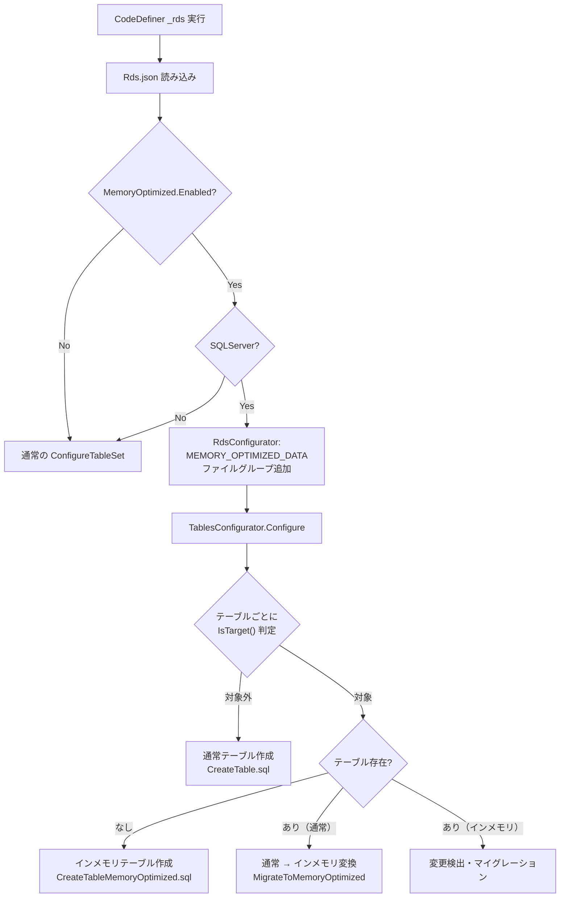
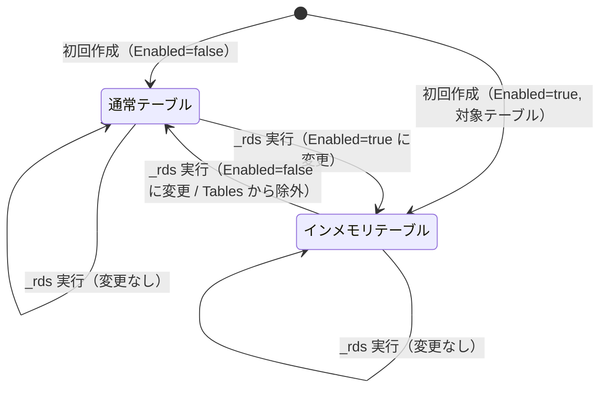
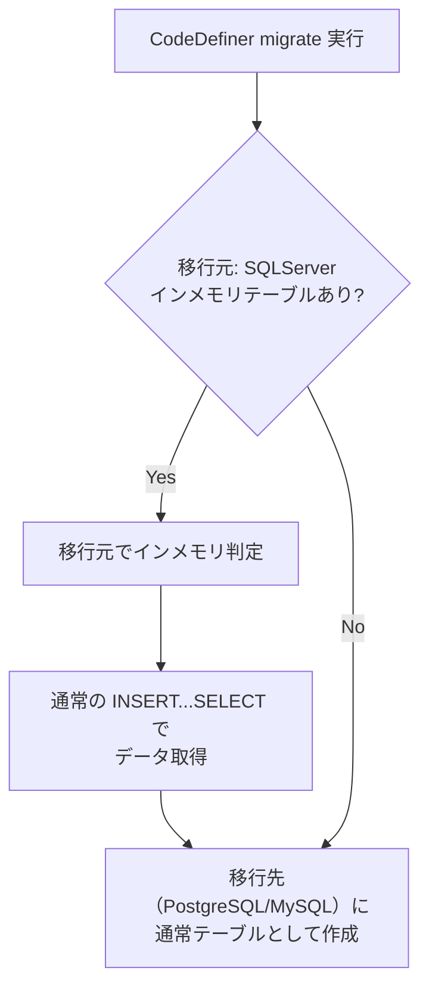

# SQL Server インメモリ OLTP 対応

SQL Server のインメモリ OLTP（In-Memory OLTP）機能を Pleasanter に適用するための実装方針を、CodeDefiner の既存アーキテクチャを基に調査・整理した。

<!-- START doctoc generated TOC please keep comment here to allow auto update -->
<!-- DON'T EDIT THIS SECTION, INSTEAD RE-RUN doctoc TO UPDATE -->

- [調査情報](#調査情報)
- [調査目的](#調査目的)
- [インメモリ OLTP の概要](#インメモリ-oltp-の概要)
    - [通常テーブルとの主要な差異](#通常テーブルとの主要な差異)
    - [SQL Server バージョン別の制限事項](#sql-server-バージョン別の制限事項)
- [Pleasanter テーブルのインメモリ OLTP 互換性](#pleasanter-テーブルのインメモリ-oltp-互換性)
    - [nvarchar(max) カラムの分布](#nvarcharmax-カラムの分布)
    - [image 型カラム](#image-型カラム)
    - [全文検索インデックスの制約](#全文検索インデックスの制約)
- [対象テーブルの選定方針](#対象テーブルの選定方針)
    - [全テーブル対応 vs 選択的対応](#全テーブル対応-vs-選択的対応)
    - [推奨対象テーブル](#推奨対象テーブル)
    - [非推奨テーブル](#非推奨テーブル)
- [実装方針](#実装方針)
    - [アプローチ: Rds.json にインメモリ OLTP 設定を追加](#アプローチ-rdsjson-にインメモリ-oltp-設定を追加)
    - [データベース準備: MEMORY_OPTIMIZED_DATA ファイルグループ](#データベース準備-memory_optimized_data-ファイルグループ)
- [CodeDefiner の変更箇所](#codedefiner-の変更箇所)
    - [1. パラメータクラスの追加](#1-パラメータクラスの追加)
    - [2. SQL テンプレートの追加](#2-sql-テンプレートの追加)
    - [3. インデックス生成の変更](#3-インデックス生成の変更)
    - [4. TablesConfigurator の変更](#4-tablesconfigurator-の変更)
    - [5. RdsConfigurator の変更](#5-rdsconfigurator-の変更)
    - [6. マイグレーション処理の変更](#6-マイグレーション処理の変更)
    - [変更の全体像](#変更の全体像)
- [通常構成とインメモリ構成の相互切り替え](#通常構成とインメモリ構成の相互切り替え)
    - [切り替えフロー](#切り替えフロー)
    - [テーブル状態の判定方法](#テーブル状態の判定方法)
    - [切り替え時のデータ保全](#切り替え時のデータ保全)
- [他 RDBMS への移行時の考慮事項](#他-rdbms-への移行時の考慮事項)
    - [PostgreSQL / MySQL にはインメモリ OLTP 相当の機能がない](#postgresql--mysql-にはインメモリ-oltp-相当の機能がない)
    - [マイグレーション時の互換性確保](#マイグレーション時の互換性確保)
    - [CodeDefiner migrate コマンドへの影響](#codedefiner-migrate-コマンドへの影響)
- [実装時の注意事項](#実装時の注意事項)
    - [FILEGROUP の事前作成](#filegroup-の事前作成)
    - [BUCKET_COUNT の決定](#bucket_count-の決定)
    - [トランザクション分離レベル](#トランザクション分離レベル)
- [結論](#結論)
- [関連ソースコード](#関連ソースコード)
- [関連ドキュメント](#関連ドキュメント)

<!-- END doctoc generated TOC please keep comment here to allow auto update -->

---

## 調査情報

| 調査日       | リポジトリ | ブランチ | タグ/バージョン    | コミット    | 備考     |
| ------------ | ---------- | -------- | ------------------ | ----------- | -------- |
| 2026年3月3日 | Pleasanter | main     | Pleasanter_1.5.1.0 | `34f162a43` | 初回調査 |

## 調査目的

SQL Server のインメモリ OLTP（メモリ最適化テーブル）を Pleasanter に適用し、
CodeDefiner `_rds` 実行時に通常構成とインメモリ OLTP 構成を相互に切り替え可能にする実装方針を明らかにする。
また、全テーブルを対応対象とすべきか、必要なテーブルのみに限定すべきかの判断基準を整理し、
他 RDBMS へのマイグレーション時の影響も考慮する。

---

## インメモリ OLTP の概要

SQL Server のインメモリ OLTP は、テーブルデータをメモリ上に保持することで高速なトランザクション処理を実現する機能である。SQL Server 2014 以降で利用可能。

### 通常テーブルとの主要な差異

| 項目                       | 通常テーブル（ディスクベース）         | メモリ最適化テーブル                                       |
| -------------------------- | -------------------------------------- | ---------------------------------------------------------- |
| データ格納先               | ディスク（バッファプールにキャッシュ） | メモリ（永続化はチェックポイントファイルペア）             |
| ロック制御                 | ロック・ラッチベース                   | ロックフリー（楽観的同時実行制御: MVCC）                   |
| インデックス種類           | B-tree（クラスタ化 / 非クラスタ化）    | ハッシュインデックス / BW-tree（非クラスタ化のみ）         |
| IDENTITY                   | 対応                                   | 対応（IDENTITY(1,1) が利用可能）                           |
| LOB 型（nvarchar(max) 等） | 対応                                   | SQL Server 2016 以降で対応（行外格納）                     |
| 全文検索インデックス       | 対応                                   | 非対応                                                     |
| DDL 変更（ALTER TABLE）    | 対応                                   | SQL Server 2016 以降で ALTER TABLE...ADD/DROP/ALTER に対応 |
| 外部キー制約               | 対応                                   | メモリ最適化テーブル同士のみ対応                           |
| AFTER トリガー             | 対応                                   | 非対応（ネイティブコンパイル SP で代替）                   |
| PRIMARY KEY                | クラスタ化 / 非クラスタ化選択可能      | 非クラスタ化のみ（ハッシュまたは BW-tree）                 |
| DURABILITY                 | -                                      | `SCHEMA_AND_DATA`（永続）/ `SCHEMA_ONLY`（揮発）           |
| FILEGROUP                  | 不要（PRIMARY に格納）                 | `MEMORY_OPTIMIZED_DATA` ファイルグループが必要             |

### SQL Server バージョン別の制限事項

| 制限事項                 | SQL Server 2014        | SQL Server 2016 以降                             |
| ------------------------ | ---------------------- | ------------------------------------------------ |
| LOB 型サポート           | 非対応                 | 対応（nvarchar(max), varbinary(max) を行外格納） |
| ALTER TABLE              | 非対応（再作成が必要） | ADD/DROP COLUMN, ALTER COLUMN に対応             |
| テーブルあたり最大メモリ | 256GB                  | 制限なし（利用可能メモリに依存）                 |
| 最大インデックス数       | 8                      | 8（非クラスタ化） + PRIMARY KEY                  |
| nvarchar 最大長          | 4,000 バイト           | nvarchar(max) 対応                               |
| 並列プラン               | 非対応                 | 対応                                             |

SQL Server 2016 以降であれば LOB 型（nvarchar(max)）が利用可能であるため、Pleasanter の既存カラム定義をそのまま適用できる。

---

## Pleasanter テーブルのインメモリ OLTP 互換性

### nvarchar(max) カラムの分布

Pleasanter のテーブルには多数の nvarchar(max) カラムが存在する。
SQL Server 2016 以降ではインメモリ OLTP で nvarchar(max) が利用可能であるため、
これ自体は互換性の障害にはならない。

ただし、nvarchar(max) カラムは行外格納となり、
ディスクベーステーブルと比較してインメモリ OLTP のパフォーマンスメリットが薄れる可能性がある。

代表的な nvarchar(max) カラムを持つテーブル:

| テーブル      | nvarchar(max) カラム例                                                     |
| ------------- | -------------------------------------------------------------------------- |
| Items         | FullText                                                                   |
| Sites         | SiteSettings, AnalyGuide, BurnDownGuide, CalendarGuide 等（10 カラム以上） |
| Tenants       | Body, ContractSettings, TenantSettings, TopDashboards, TopScript, TopStyle |
| Users         | Body, UserSettings, PasswordHistries                                       |
| Sessions      | Value                                                                      |
| SysLogs       | ErrStackTrace, RequestData, UserAgent, Description 等（7 カラム以上）      |
| OutgoingMails | Body, To, Cc, Bcc, From                                                    |
| Extensions    | Body, Description, ExtensionSettings                                       |
| Results       | Body, Comments（\_Base 由来）                                              |
| Issues        | Body, Comments（\_Base 由来）                                              |

### image 型カラム

Binaries テーブルには `image` 型のカラム（Bin, Thumbnail, Icon）が存在する。
`image` 型はインメモリ OLTP では非対応のため、`varbinary(max)` への変換が必要である。
ただし Binaries テーブルをインメモリ化する必要性は低い（後述）。

### 全文検索インデックスの制約

インメモリ OLTP テーブルでは全文検索インデックス（FULLTEXT INDEX）が利用できない。
Pleasanter では Items テーブルの `FullText` カラムと Binaries テーブルの `Bin` カラムに全文検索インデックスが設定されている。

**ファイル**: `App_Data/Definitions/Sqls/SQLServer/CreateFullText.sql`

これらのテーブルをインメモリ化する場合、全文検索は別途ディスクベースのビューまたはテーブルで実現する必要がある。

---

## 対象テーブルの選定方針

### 全テーブル対応 vs 選択的対応

全 28 業務テーブル + 派生テーブル（計 84 テーブル）をインメモリ化するのではなく、
アクセス頻度と特性に基づいて選択的に対応すべきである。

理由:

| 観点               | 全テーブル対応の問題点                                                                   |
| ------------------ | ---------------------------------------------------------------------------------------- |
| メモリ消費         | nvarchar(max) の行外格納を含め、全テーブルをメモリに保持するとメモリ要件が大幅に増加する |
| 全文検索           | Items テーブルのインメモリ化は全文検索インデックスと競合する                             |
| バイナリデータ     | Binaries テーブルは image 型を含み、データサイズが大きいためインメモリ化は不適切         |
| Quartz テーブル    | 外部ライブラリ管理のテーブルであり、スキーマ変更のリスクが高い                           |
| 履歴・削除テーブル | `_history` / `_deleted` は参照頻度が低く、インメモリ化のメリットが小さい                 |
| 他 RDBMS 互換      | PostgreSQL / MySQL にはインメモリ OLTP 相当の機能がないため、移行時に差異が拡大する      |

### 推奨対象テーブル

高頻度でアクセスされ、かつインメモリ OLTP の制約に抵触しにくいテーブルを対象とする。

| 対象テーブル | 選定理由                                     | 注意事項                     |
| ------------ | -------------------------------------------- | ---------------------------- |
| Sessions     | セッションストアとして高頻度に読み書きされる | Value が nvarchar(max)       |
| Permissions  | レコードアクセスの度に権限チェックが発生する | 特になし                     |
| Statuses     | レコード操作ごとにステータス更新が発生する   | 特になし                     |
| Orders       | 一覧表示のソート順を管理し、頻繁に参照される | Data が nvarchar(max)        |
| Links        | レコード間リンクの解決で頻繁に参照される     | Subset が nvarchar(max)      |
| LoginKeys    | 認証のたびに参照される                       | TenantNames が nvarchar(max) |

### 非推奨テーブル

| 非推奨テーブル    | 理由                                                             |
| ----------------- | ---------------------------------------------------------------- |
| Items             | 全文検索インデックスが設定されており、インメモリ OLTP と競合する |
| Binaries          | image 型カラムが存在し、データサイズが大きい                     |
| Sites             | nvarchar(max) カラムが 10 以上あり、更新頻度が低い（設定データ） |
| SysLogs           | INSERT 主体のログテーブルであり、データ量が大きい                |
| Results / Issues  | レコード数が多く、Body / Comments が nvarchar(max)               |
| QRTZ\_\* テーブル | Quartz.NET が管理するテーブルであり、スキーマ変更は非推奨        |
| \*\_history       | 参照頻度が低いアーカイブ用テーブル                               |
| \*\_deleted       | 参照頻度が低い論理削除用テーブル                                 |

---

## 実装方針

### アプローチ: Rds.json にインメモリ OLTP 設定を追加

CodeDefiner の既存アーキテクチャを活用し、`Rds.json` にインメモリ OLTP 設定を追加する。
新たな DBMS タイプの追加は不要であり、SQL Server 固有のオプションとして実装する。

#### Rds.json の拡張

```json
{
    "Dbms": "SQLServer",
    "Provider": "Local",
    "SaConnectionString": "...",
    "OwnerConnectionString": "...",
    "UserConnectionString": "...",
    "MemoryOptimized": {
        "Enabled": false,
        "Tables": ["Sessions", "Permissions", "Statuses", "Orders", "Links", "LoginKeys"],
        "Durability": "SCHEMA_AND_DATA",
        "IncludeDeletedTables": false,
        "IncludeHistoryTables": false
    }
}
```

| パラメータ             | 型       | 説明                                             |
| ---------------------- | -------- | ------------------------------------------------ |
| `Enabled`              | bool     | インメモリ OLTP を有効にするか                   |
| `Tables`               | string[] | インメモリ化する対象テーブル名の一覧             |
| `Durability`           | string   | `SCHEMA_AND_DATA`（永続）/ `SCHEMA_ONLY`（揮発） |
| `IncludeDeletedTables` | bool     | `_deleted` テーブルもインメモリ化するか          |
| `IncludeHistoryTables` | bool     | `_history` テーブルもインメモリ化するか          |

### データベース準備: MEMORY_OPTIMIZED_DATA ファイルグループ

インメモリ OLTP を利用するには、データベースに `MEMORY_OPTIMIZED_DATA` ファイルグループが必要である。

```sql
ALTER DATABASE [Implem.Pleasanter]
ADD FILEGROUP [InMemoryData] CONTAINS MEMORY_OPTIMIZED_DATA;

ALTER DATABASE [Implem.Pleasanter]
ADD FILE (
    NAME = N'InMemoryData',
    FILENAME = N'C:\Data\InMemoryData'
) TO FILEGROUP [InMemoryData];
```

この処理は `RdsConfigurator` の `CreateDatabase` または `UpdateDatabase` に追加する。

---

## CodeDefiner の変更箇所

### 1. パラメータクラスの追加

`Rds.json` の `MemoryOptimized` セクションを読み取るパラメータクラスを追加する。

**ファイル**: `Implem.DefinitionAccessor/Parts/Rds.cs`

```csharp
public class MemoryOptimizedSettings
{
    public bool Enabled { get; set; } = false;
    public List<string> Tables { get; set; } = new List<string>();
    public string Durability { get; set; } = "SCHEMA_AND_DATA";
    public bool IncludeDeletedTables { get; set; } = false;
    public bool IncludeHistoryTables { get; set; } = false;

    public bool IsTarget(string tableName, Sqls.TableTypes tableType)
    {
        if (!Enabled) return false;
        var baseName = tableName
            .Replace("_deleted", "")
            .Replace("_history", "");
        if (!Tables.Contains(baseName)) return false;
        return tableType switch
        {
            Sqls.TableTypes.Normal => true,
            Sqls.TableTypes.Deleted => IncludeDeletedTables,
            Sqls.TableTypes.History => IncludeHistoryTables,
            _ => false
        };
    }
}
```

### 2. SQL テンプレートの追加

SQL Server 用のインメモリ OLTP テーブル作成テンプレートを追加する。

**ファイル**: `App_Data/Definitions/Sqls/SQLServer/CreateTableMemoryOptimized.sql`（新規）

```sql
#DropConstraint#
    create table "dbo"."#TableName#"
    (
#Columns#
#MemoryOptimizedPk#
    )
    with (memory_optimized = on, durability = #Durability#);
#Defaults#
```

通常テーブルとの主な差異:

| 要素                     | 通常テーブル（CreateTable.sql）    | インメモリテーブル（新規）                        |
| ------------------------ | ---------------------------------- | ------------------------------------------------- |
| PRIMARY KEY              | ALTER TABLE で後付け（クラスタ化） | CREATE TABLE 内でインラインで定義（非クラスタ化） |
| WITH 句                  | なし                               | `MEMORY_OPTIMIZED = ON, DURABILITY = ...`         |
| セカンダリインデックス   | CREATE INDEX で後付け              | CREATE TABLE 内でインライン定義                   |
| lock_escalation          | `SET (LOCK_ESCALATION = TABLE)`    | 不要（ロックフリー）                              |
| pad_index 等のオプション | `WITH (pad_index = off, ...)`      | 不要（B-tree 非使用）                             |

### 3. インデックス生成の変更

インメモリ OLTP テーブルではインデックスを `CREATE TABLE` 文内でインライン定義する必要がある。
既存の `Indexes.cs` の処理に分岐を追加する。

**ファイル**: `Implem.CodeDefiner/Functions/Rds/Parts/Indexes.cs`

```csharp
// インメモリ OLTP テーブル用のインラインインデックス定義
internal static string CreateInlineIndex(
    string indexName,
    IEnumerable<string> columns,
    bool isPrimaryKey,
    bool isUnique,
    bool useHash,
    int? bucketCount)
{
    var indexType = useHash
        ? $"HASH WITH (BUCKET_COUNT = {bucketCount})"
        : "NONCLUSTERED";

    if (isPrimaryKey)
    {
        return $"CONSTRAINT [{indexName}] PRIMARY KEY NONCLUSTERED ({string.Join(", ", columns)})";
    }
    return $"INDEX [{indexName}] {(isUnique ? "UNIQUE " : "")}{indexType} ({string.Join(", ", columns)})";
}
```

### 4. TablesConfigurator の変更

`ConfigureTablePart` メソッドにインメモリ OLTP の分岐を追加する。

**ファイル**: `Implem.CodeDefiner/Functions/Rds/TablesConfigurator.cs`

```csharp
private static bool ConfigureTablePart(
    ISqlObjectFactory factory,
    string generalTableName,
    string sourceTableName,
    Sqls.TableTypes tableType,
    IEnumerable<ColumnDefinition> columnDefinitionCollection,
    IEnumerable<IndexInfo> tableIndexCollection,
    bool checkMigration)
{
    if (!Tables.Exists(factory, sourceTableName))
    {
        // インメモリ OLTP 対象かどうかを判定
        if (Parameters.Rds.MemoryOptimized?.IsTarget(sourceTableName, tableType) == true)
        {
            Tables.CreateMemoryOptimizedTable(
                factory, generalTableName, sourceTableName,
                tableType, columnDefinitionCollection, tableIndexCollection);
        }
        else
        {
            Tables.CreateTable(
                factory, generalTableName, sourceTableName,
                tableType, columnDefinitionCollection, tableIndexCollection);
        }
        return true;
    }
    // 既存テーブルの変更検出・マイグレーション処理...
}
```

### 5. RdsConfigurator の変更

データベース作成時にインメモリ OLTP 用のファイルグループを追加する。

**ファイル**: `Implem.CodeDefiner/Functions/Rds/RdsConfigurator.cs`

```csharp
private static void CreateDatabase(ISqlObjectFactory factory, string serviceName)
{
    Def.SqlIoBySa(factory).ExecuteNonQuery(
        factory,
        Def.Sql.CreateDatabase
            .Replace("#InitialCatalog#", Environments.ServiceName));

    // インメモリ OLTP が有効な場合、ファイルグループを追加
    if (Parameters.Rds.MemoryOptimized?.Enabled == true
        && Parameters.Rds.Dbms == "SQLServer")
    {
        Def.SqlIoBySa(factory).ExecuteNonQuery(
            factory,
            Def.Sql.CreateMemoryOptimizedFileGroup
                .Replace("#InitialCatalog#", Environments.ServiceName));
    }
    // ...
}
```

### 6. マイグレーション処理の変更

既存の通常テーブルからインメモリテーブルへの変換、およびその逆の変換を実現する。

**ファイル**: `Implem.CodeDefiner/Functions/Rds/Parts/Tables.cs`

```csharp
internal static void MigrateToMemoryOptimized(
    ISqlObjectFactory factory,
    string generalTableName,
    string sourceTableName,
    Sqls.TableTypes tableType,
    IEnumerable<ColumnDefinition> columnDefinitionCollection,
    IEnumerable<IndexInfo> tableIndexCollection)
{
    // 1. 新しいインメモリテーブルをタイムスタンプ付き名前で作成
    var tempTableName = $"_{DateTime.Now:yyyyMMdd_HHmmss}_{sourceTableName}";
    CreateMemoryOptimizedTable(
        factory, generalTableName, tempTableName,
        tableType, columnDefinitionCollection, tableIndexCollection);

    // 2. データを移行
    // (MigrateTable.sql / MigrateTableWithIdentity.sql のテンプレートを使用)

    // 3. テーブル名をリネーム（sp_rename）
}

internal static void MigrateFromMemoryOptimized(
    ISqlObjectFactory factory,
    string generalTableName,
    string sourceTableName,
    Sqls.TableTypes tableType,
    IEnumerable<ColumnDefinition> columnDefinitionCollection,
    IEnumerable<IndexInfo> tableIndexCollection)
{
    // インメモリテーブルから通常テーブルへの逆変換
    // 同様の手順で通常テーブルとして再作成し、データを移行
}
```

### 変更の全体像



---

## 通常構成とインメモリ構成の相互切り替え

### 切り替えフロー

CodeDefiner `_rds` 実行時にテーブルの現在の状態（通常 / インメモリ）と `Rds.json` の設定を比較し、
必要に応じて変換を実行する。



### テーブル状態の判定方法

既存テーブルがインメモリかどうかは `sys.tables` のメタデータで判定できる。

```sql
SELECT
    t.name AS TableName,
    t.is_memory_optimized,
    t.durability,
    t.durability_desc
FROM sys.tables t
WHERE t.name = @TableName;
```

この判定を `Tables.cs` の `HasChanges()` メソッドに組み込む。

```csharp
internal static bool IsMemoryOptimized(ISqlObjectFactory factory, string tableName)
{
    var dataTable = Def.SqlIoByAdmin(factory).ExecuteTable(
        factory,
        "SELECT is_memory_optimized FROM sys.tables WHERE name = @TableName",
        SqlParamCollection(new { TableName = tableName }));
    return dataTable.Rows.Count > 0
        && Convert.ToBoolean(dataTable.Rows[0]["is_memory_optimized"]);
}
```

### 切り替え時のデータ保全

| 操作                    | データ保全方法                                            |
| ----------------------- | --------------------------------------------------------- |
| 通常 → インメモリ       | 新テーブル作成 → INSERT...SELECT でデータ移行 → sp_rename |
| インメモリ → 通常       | 新テーブル作成 → INSERT...SELECT でデータ移行 → sp_rename |
| インメモリ → インメモリ | スキーマ変更は ALTER TABLE（SQL Server 2016 以降）で対応  |

いずれの方向への切り替えでも、既存の `MigrateTable.sql` / `MigrateTableWithIdentity.sql` テンプレートのデータ移行パターン（INSERT...SELECT + sp_rename）を流用できる。

---

## 他 RDBMS への移行時の考慮事項

### PostgreSQL / MySQL にはインメモリ OLTP 相当の機能がない

| RDBMS      | インメモリ OLTP 相当機能                                           |
| ---------- | ------------------------------------------------------------------ |
| SQL Server | インメモリ OLTP（MEMORY_OPTIMIZED テーブル）                       |
| PostgreSQL | なし（共有バッファによるキャッシュのみ、UNLOGGED TABLE は別用途）  |
| MySQL      | なし（MEMORY ストレージエンジンは揮発性のみ、InnoDB がデフォルト） |

### マイグレーション時の互換性確保

`Rds.json` の `MemoryOptimized` 設定は SQL Server 固有のオプションであるため、
他の RDBMS への移行時には以下のように処理する。



移行時に考慮すべき点:

| 項目             | 対応方針                                                                  |
| ---------------- | ------------------------------------------------------------------------- |
| データ取得       | インメモリテーブルからの SELECT は通常テーブルと同じ構文で動作する        |
| スキーマ変換     | `MEMORY_OPTIMIZED` / `DURABILITY` 句を除去するだけでよい                  |
| インデックス変換 | インラインインデックスを通常の CREATE INDEX に変換する                    |
| IDENTITY         | PostgreSQL の SERIAL / MySQL の AUTO_INCREMENT に変換（既存の変換と同じ） |
| image 型         | Binaries テーブルは非推奨対象のため影響なし                               |

### CodeDefiner migrate コマンドへの影響

既存の `Migrator.cs` は INSERT...SELECT でデータを移行するため、
移行元テーブルがインメモリであっても特別な処理は不要である。
ただし、移行先にインメモリ OLTP を適用する場合は、
移行先の `Rds.json` で `MemoryOptimized` を設定する必要がある。

---

## 実装時の注意事項

### FILEGROUP の事前作成

インメモリ OLTP を利用するには `MEMORY_OPTIMIZED_DATA` ファイルグループが必要である。
マネージドサービス（Azure SQL Database 等）では、ファイルグループの追加が制限される場合がある。

| 環境                      | ファイルグループ追加   | 備考                                                 |
| ------------------------- | ---------------------- | ---------------------------------------------------- |
| オンプレミス              | CodeDefiner で自動作成 | `ALTER DATABASE ... ADD FILEGROUP` を実行            |
| Azure SQL Database        | 自動管理               | Premium / Business Critical 層でインメモリ OLTP 対応 |
| Amazon RDS for SQL Server | 制限あり               | Multi-AZ 構成で対応、ファイルグループは自動管理      |

`Provider` パラメータで Azure 等の場合はファイルグループ作成をスキップする分岐が必要。

### BUCKET_COUNT の決定

ハッシュインデックスを使用する場合、`BUCKET_COUNT` はテーブル行数の 1〜2 倍が推奨される。
Pleasanter のテーブルは運用環境ごとにデータ量が異なるため、
`Rds.json` で指定可能にするか、BW-tree（非クラスタ化）インデックスをデフォルトにすべきである。

BW-tree インデックスはハッシュインデックスと比較して範囲スキャンに強く、
Pleasanter のクエリパターン（範囲検索・ORDER BY が多い）に適している。

推奨: デフォルトでは BW-tree（NONCLUSTERED）インデックスを使用し、
ハッシュインデックスはオプション設定とする。

### トランザクション分離レベル

インメモリ OLTP テーブルとディスクベーステーブルを混在させる場合（クロスコンテナトランザクション）、
以下の制約がある。

| 分離レベル      | ディスクベース → インメモリ | インメモリ → ディスクベース |
| --------------- | :-------------------------: | :-------------------------: |
| READ COMMITTED  |            対応             |            対応             |
| SNAPSHOT        |            対応             |            対応             |
| REPEATABLE READ |            対応             |           非対応            |
| SERIALIZABLE    |            対応             |           非対応            |

Pleasanter はデフォルトで `READ COMMITTED` を使用しているため、
クロスコンテナトランザクションでの問題は発生しない。

---

## 結論

| 項目                      | 結論                                                                    |
| ------------------------- | ----------------------------------------------------------------------- |
| 対応範囲                  | 全テーブルではなく、選択的に対象テーブルを指定すべき                    |
| 推奨対象                  | Sessions, Permissions, Statuses, Orders, Links, LoginKeys               |
| 非推奨対象                | Items（全文検索競合）, Binaries（image型）, SysLogs（大量INSERT）       |
| 派生テーブル              | `_history` / `_deleted` はデフォルトでインメモリ化しない                |
| 設定方法                  | `Rds.json` の `MemoryOptimized` セクションで制御                        |
| 切り替え                  | `_rds` 実行時に `sys.tables.is_memory_optimized` で現状を判定し自動変換 |
| SQL Server バージョン     | SQL Server 2016 以降を前提とする（LOB 型 / ALTER TABLE 対応）           |
| 他 RDBMS マイグレーション | インメモリ設定は SQL Server 固有オプションとし、移行時は自動的に無視    |
| DBMS 抽象層への影響       | ISqlObjectFactory の変更は不要、SQL テンプレートの追加で対応            |

---

## 関連ソースコード

| ファイル                                                           | 内容                                 |
| ------------------------------------------------------------------ | ------------------------------------ |
| `Implem.CodeDefiner/Starter.cs`                                    | \_rds コマンドのエントリーポイント   |
| `Implem.CodeDefiner/Functions/Rds/TablesConfigurator.cs`           | テーブル構成のオーケストレーション   |
| `Implem.CodeDefiner/Functions/Rds/RdsConfigurator.cs`              | データベース作成・更新               |
| `Implem.CodeDefiner/Functions/Rds/Parts/Tables.cs`                 | CREATE TABLE / マイグレーション実行  |
| `Implem.CodeDefiner/Functions/Rds/Parts/Indexes.cs`                | インデックス定義・作成               |
| `Implem.CodeDefiner/Functions/Rds/Parts/Columns.cs`                | カラム定義生成                       |
| `Implem.CodeDefiner/Functions/Rds/Parts/Constraints.cs`            | DEFAULT 制約管理                     |
| `Implem.CodeDefiner/Functions/AspNetMvc/CSharp/Migrator.cs`        | RDBMS 間マイグレーション             |
| `Implem.DefinitionAccessor/Parts/Rds.cs`                           | Rds.json パラメータ定義              |
| `Implem.Factory/RdsFactory.cs`                                     | DBMS 判定と Factory 生成             |
| `Rds/Implem.SqlServer/SqlServerObjectFactory.cs`                   | SQL Server 接続抽象層                |
| `App_Data/Definitions/Sqls/SQLServer/CreateTable.sql`              | テーブル作成 DDL テンプレート        |
| `App_Data/Definitions/Sqls/SQLServer/CreatePk.sql`                 | PRIMARY KEY 作成テンプレート         |
| `App_Data/Definitions/Sqls/SQLServer/CreateIx.sql`                 | インデックス作成テンプレート         |
| `App_Data/Definitions/Sqls/SQLServer/MigrateTable.sql`             | データ移行テンプレート               |
| `App_Data/Definitions/Sqls/SQLServer/MigrateTableWithIdentity.sql` | IDENTITY 保持データ移行テンプレート  |
| `App_Data/Definitions/Sqls/SQLServer/CreateFullText.sql`           | 全文検索インデックス作成テンプレート |

---

## 関連ドキュメント

- [CodeDefiner データベース作成・更新ロジック](../11-CodeDefiner/001-CodeDefiner-DB作成更新.md)
- [データベーステーブル定義一覧](001-データベーステーブル定義一覧.md)
- [TiDB 対応実装方針](006-TiDB対応.md)
