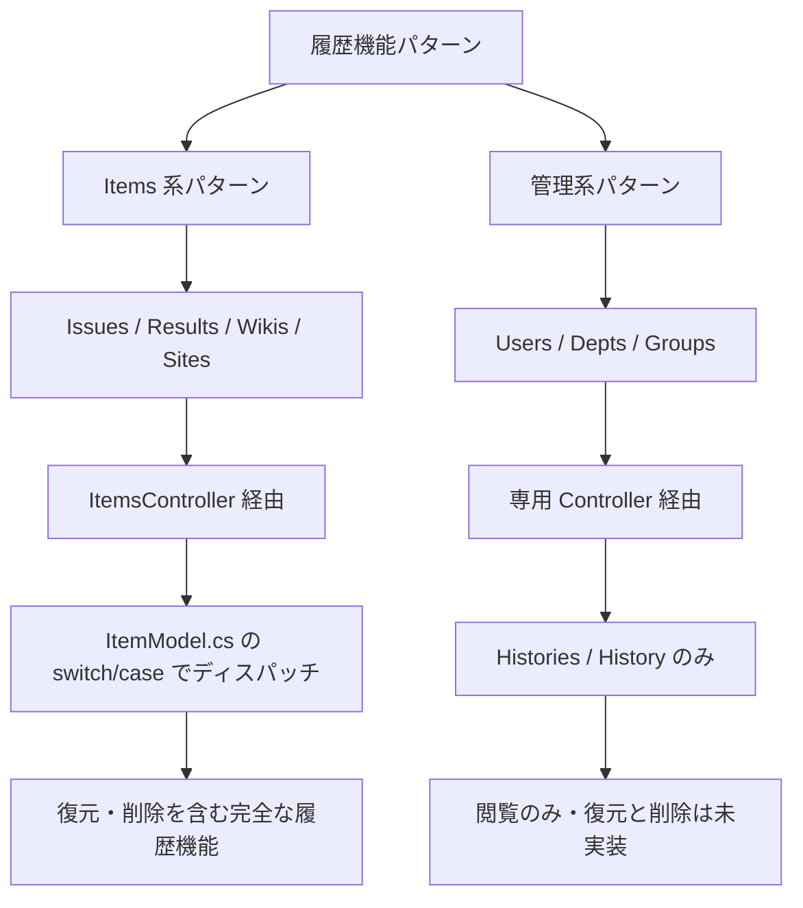

# テナント履歴機能追加調査

テナント管理画面に変更履歴の閲覧・復元・削除機能を追加するために、既存の履歴機能の実装パターンとテナントモデルの現状を調査した結果。

<!-- START doctoc generated TOC please keep comment here to allow auto update -->
<!-- DON'T EDIT THIS SECTION, INSTEAD RE-RUN doctoc TO UPDATE -->

- [調査情報](#調査情報)
- [調査目的](#調査目的)
- [現状分析](#現状分析)
    - [テナントの履歴機能の現状](#テナントの履歴機能の現状)
    - [履歴データの記録状況](#履歴データの記録状況)
- [他モデルとの比較](#他モデルとの比較)
    - [モデル別の履歴機能実装状況](#モデル別の履歴機能実装状況)
    - [2 つのパターン](#2-つのパターン)
- [必要な実装変更](#必要な実装変更)
    - [変更 1: EditorTabs に履歴タブを追加](#変更-1-editortabs-に履歴タブを追加)
    - [変更 2: TenantsController にルートを追加](#変更-2-tenantscontroller-にルートを追加)
    - [変更 3: 復元機能の追加（任意）](#変更-3-復元機能の追加任意)
    - [変更 4: 履歴削除機能の追加（任意）](#変更-4-履歴削除機能の追加任意)
    - [変更 5: HistoryCommands のコントローラ条件変更](#変更-5-historycommands-のコントローラ条件変更)
    - [変更 6: TenantValidators への追加（任意）](#変更-6-tenantvalidators-への追加任意)
- [DB 構造変更](#db-構造変更)
    - [Tenants_history テーブルの現状](#tenants_history-テーブルの現状)
    - [DB 構造変更の必要性](#db-構造変更の必要性)
- [実装の段階分け](#実装の段階分け)
    - [第 1 段階: 履歴閲覧機能](#第-1-段階-履歴閲覧機能)
    - [第 2 段階: 復元・削除機能](#第-2-段階-復元削除機能)
- [実装上の注意事項](#実装上の注意事項)
    - [CodeDefiner による自動生成コードへの影響](#codedefiner-による自動生成コードへの影響)
    - [テナント特有のセキュリティ考慮](#テナント特有のセキュリティ考慮)
    - [HistoryCommands のコントローラ条件](#historycommands-のコントローラ条件)
- [結論](#結論)
- [関連ソースコード](#関連ソースコード)
- [関連ドキュメント](#関連ドキュメント)

<!-- END doctoc generated TOC please keep comment here to allow auto update -->

## 調査情報

| 調査日       | リポジトリ | ブランチ | タグ/バージョン    | コミット    | 備考     |
| ------------ | ---------- | -------- | ------------------ | ----------- | -------- |
| 2026年3月4日 | Pleasanter | main     | Pleasanter_1.5.1.0 | `34f162a43` | 初回調査 |

## 調査目的

テナント管理画面には現在、変更履歴を閲覧・復元・削除する機能が存在しない。
他のモデル（Users、Depts、Groups、Issues、Results 等）では履歴機能が実装されているため、
テナントに同等の機能を追加するために必要な実装変更・DB 構造変更を明らかにする。

---

## 現状分析

### テナントの履歴機能の現状

テナントモデルには履歴関連のインフラが**部分的に**実装されている。

| 項目                                     | 状態           | 説明                                                |
| ---------------------------------------- | -------------- | --------------------------------------------------- |
| `Tenants_history` テーブル               | 存在する       | DB テーブルは CodeDefiner により作成済み            |
| `Ver` カラム                             | 存在する       | バージョン番号の追跡カラムあり                      |
| `TenantsCopyToStatement`                 | 存在する       | 更新時に履歴テーブルへコピーする SQL 文あり         |
| `TenantUtilities.Histories()`            | 存在する       | 履歴一覧を取得・表示するメソッドあり                |
| `TenantUtilities.History()`              | 存在する       | 特定バージョンの履歴を表示するメソッドあり          |
| `FieldSetHistories`                      | 存在する       | 履歴タブのコンテンツ領域は生成されている            |
| EditorTabs に履歴タブ                    | **存在しない** | EditorTabs に `#FieldSetHistories` へのリンクがない |
| `TenantsController.Histories()`          | **存在しない** | コントローラにルートが未定義                        |
| `TenantsController.History()`            | **存在しない** | コントローラにルートが未定義                        |
| `TenantUtilities.RestoreFromHistory()`   | **存在しない** | 履歴からの復元メソッドが未実装                      |
| `TenantUtilities.DeleteHistory()`        | **存在しない** | 履歴の物理削除メソッドが未実装                      |
| `TenantsController.RestoreFromHistory()` | **存在しない** | コントローラにルートが未定義                        |
| `TenantsController.DeleteHistory()`      | **存在しない** | コントローラにルートが未定義                        |

### 履歴データの記録状況

テナント更新時の履歴記録は**既に動作している**。
`TenantModel.UpdateStatements()` で `verUp` フラグが true の場合、
`TenantsCopyToStatement` が実行され、現在のレコードが `Tenants_history`
テーブルにコピーされた後、`Ver` がインクリメントされる。

**ファイル**: `Implem.Pleasanter/Models/Tenants/TenantModel.cs`（行番号: 839-846）

```csharp
if (verUp)
{
    statements.Add(Rds.TenantsCopyToStatement(
        where: where,
        tableType: Sqls.TableTypes.History,
        ColumnNames()));
    Ver++;
}
```

---

## 他モデルとの比較

### モデル別の履歴機能実装状況

各モデルの履歴機能の実装状況を以下に示す。

| モデル      | Controller 種別       | 履歴閲覧         | 履歴タブ | 復元     | 削除     | 履歴 DB テーブル |
| ----------- | --------------------- | ---------------- | -------- | -------- | -------- | ---------------- |
| Issues      | ItemsController       | あり             | あり     | あり     | あり     | あり             |
| Results     | ItemsController       | あり             | あり     | あり     | あり     | あり             |
| Wikis       | ItemsController       | あり             | あり     | あり     | あり     | あり             |
| Sites       | ItemsController       | あり             | なし     | あり     | あり     | あり             |
| Users       | UsersController       | あり             | あり     | なし     | なし     | あり             |
| Depts       | DeptsController       | あり             | あり     | なし     | なし     | あり             |
| Groups      | GroupsController      | あり             | あり     | なし     | なし     | あり             |
| **Tenants** | **TenantsController** | **メソッドのみ** | **なし** | **なし** | **なし** | **あり**         |

### 2 つのパターン

履歴機能の実装には 2 つのパターンが存在する。



テナントは「管理系パターン」に分類されるが、そのパターンの中でも履歴タブとコントローラルートが欠落している唯一のモデルである。

---

## 必要な実装変更

### 変更 1: EditorTabs に履歴タブを追加

テナント編集画面のタブに履歴タブのリンクを追加する。

**対象ファイル**: `Implem.Pleasanter/Models/Tenants/TenantUtilities.cs`

**現在の実装**（行番号: 615-632）:

```csharp
private static HtmlBuilder EditorTabs(
    this HtmlBuilder hb, Context context, TenantModel tenantModel)
{
    return hb.Ul(id: "EditorTabs", action: () => hb
        .Li(action: () => hb
            .A(
                href: "#FieldSetGeneral",
                text: Displays.General(context: context)))
        .Li(
            action: () => hb
                .A(
                    href: "#FieldSetServerScript",
                    text: Displays.ServerScript(context: context)),
            _using: context.HasPrivilege != false
                        && context.ContractSettings.ServerScript != false
                        && Parameters.Script.ServerScript != false
                        && Parameters.Script.BackgroundServerScript != false));
}
```

**変更後**: 末尾に履歴タブのリンクを追加する。

```csharp
private static HtmlBuilder EditorTabs(
    this HtmlBuilder hb, Context context, TenantModel tenantModel)
{
    return hb.Ul(id: "EditorTabs", action: () => hb
        .Li(action: () => hb
            .A(
                href: "#FieldSetGeneral",
                text: Displays.General(context: context)))
        .Li(
            action: () => hb
                .A(
                    href: "#FieldSetServerScript",
                    text: Displays.ServerScript(context: context)),
            _using: context.HasPrivilege != false
                        && context.ContractSettings.ServerScript != false
                        && Parameters.Script.ServerScript != false
                        && Parameters.Script.BackgroundServerScript != false)
        .Li(
            _using: tenantModel.MethodType != BaseModel.MethodTypes.New,
            action: () => hb
                .A(
                    href: "#FieldSetHistories",
                    text: Displays.ChangeHistoryList(context: context))));
}
```

Users / Depts / Groups の EditorTabs と同じパターンで、`MethodType != New` の場合のみ表示する。

---

### 変更 2: TenantsController にルートを追加

コントローラに Histories / History アクションを追加する。Users / Depts / Groups と同じパターンに従う。

**対象ファイル**: `Implem.Pleasanter/Controllers/TenantsController.cs`

**追加するアクション**:

```csharp
[HttpPost]
public string Histories()
{
    var context = new Context();
    var log = new SysLogModel(context: context);
    var json = TenantUtilities.Histories(
        context: context,
        ss: SiteSettingsUtilities.TenantsSiteSettings(context: context),
        tenantId: context.TenantId);
    log.Finish(context: context, responseSize: json.Length);
    return json;
}

[HttpPost]
public string History()
{
    var context = new Context();
    var log = new SysLogModel(context: context);
    var json = TenantUtilities.History(
        context: context,
        ss: SiteSettingsUtilities.TenantsSiteSettings(context: context),
        tenantId: context.TenantId);
    log.Finish(context: context, responseSize: json.Length);
    return json;
}
```

テナントは TenantId をパスパラメータで受け取らず `context.TenantId` を使用する点が、Users / Depts / Groups と異なる（セキュリティ上、自テナント以外の操作を防止するため）。

---

### 変更 3: 復元機能の追加（任意）

復元機能を追加する場合は、以下の追加実装が必要となる。

#### 3a. TenantUtilities.RestoreFromHistory() メソッド

**対象ファイル**: `Implem.Pleasanter/Models/Tenants/TenantUtilities.cs`

ResultUtilities.RestoreFromHistory() をベースに、テナント向けに実装する。

```csharp
public static string RestoreFromHistory(
    Context context, SiteSettings ss, int tenantId)
{
    if (!Parameters.History.Restore)
    {
        return Error.Types.InvalidRequest.MessageJson(context: context);
    }
    var tenantModel = new TenantModel(context: context, ss: ss, tenantId: tenantId);
    var invalid = TenantValidators.OnUpdating(
        context: context,
        ss: ss,
        tenantModel: tenantModel);
    switch (invalid.Type)
    {
        case Error.Types.None: break;
        default: return invalid.MessageJson(context: context);
    }
    var ver = context.Forms.Data("GridCheckedItems")
        .Split(',')
        .Where(o => !o.IsNullOrEmpty())
        .ToList();
    if (ver.Count() != 1)
    {
        return Error.Types.SelectOne.MessageJson(context: context);
    }
    tenantModel.SetByModel(new TenantModel().Get(
        context: context,
        ss: ss,
        tableType: Sqls.TableTypes.History,
        where: Rds.TenantsWhere()
            .TenantId(tenantId)
            .Ver(ver.First().ToInt())));
    tenantModel.VerUp = true;
    var errorData = tenantModel.Update(
        context: context,
        ss: ss,
        otherInitValue: true);
    switch (errorData.Type)
    {
        case Error.Types.None:
            // SessionUtilities による通知等が必要な場合はここに追加
            return EditorResponse(
                context: context,
                ss: ss,
                tenantModel: tenantModel)
                    .Message(Messages.RestoredFromHistory(
                        context: context,
                        data: ver.First()))
                    .Messages(context.Messages)
                    .ToJson();
        default:
            return errorData.MessageJson(context: context);
    }
}
```

#### 3b. TenantsController.RestoreFromHistory() ルート

```csharp
[HttpPost]
public string RestoreFromHistory()
{
    var context = new Context();
    var log = new SysLogModel(context: context);
    var json = TenantUtilities.RestoreFromHistory(
        context: context,
        ss: SiteSettingsUtilities.TenantsSiteSettings(context: context),
        tenantId: context.TenantId);
    log.Finish(context: context, responseSize: json.Length);
    return json;
}
```

---

### 変更 4: 履歴削除機能の追加（任意）

#### 4a. TenantUtilities.DeleteHistory() メソッド

**対象ファイル**: `Implem.Pleasanter/Models/Tenants/TenantUtilities.cs`

```csharp
public static string DeleteHistory(
    Context context, SiteSettings ss, int tenantId)
{
    if (!Parameters.History.PhysicalDelete)
    {
        return Error.Types.InvalidRequest.MessageJson(context: context);
    }
    var tenantModel = new TenantModel(
        context: context,
        ss: ss,
        tenantId: tenantId);
    // TenantValidators に OnDeleteHistory が必要
    var selector = new RecordSelector(context: context);
    var selected = selector
        .Selected
        .Select(o => o.ToInt())
        .ToList();
    var count = 0;
    if (selector.All)
    {
        count = DeleteHistory(
            context: context,
            ss: ss,
            tenantId: tenantId,
            selected: selected,
            negative: true);
    }
    else
    {
        if (selector.Selected.Any())
        {
            count = DeleteHistory(
                context: context,
                ss: ss,
                tenantId: tenantId,
                selected: selected);
        }
        else
        {
            return Messages.ResponseSelectTargets(context: context).ToJson();
        }
    }
    return Histories(
        context: context,
        ss: ss,
        tenantId: tenantId,
        message: Messages.HistoryDeleted(
            context: context,
            data: count.ToString()));
}
```

#### 4b. TenantsController.DeleteHistory() ルート

```csharp
[HttpDelete]
public string DeleteHistory()
{
    var context = new Context();
    var log = new SysLogModel(context: context);
    var json = TenantUtilities.DeleteHistory(
        context: context,
        ss: SiteSettingsUtilities.TenantsSiteSettings(context: context),
        tenantId: context.TenantId);
    log.Finish(context: context, responseSize: json.Length);
    return json;
}
```

---

### 変更 5: HistoryCommands のコントローラ条件変更

復元・削除ボタンを表示する `HistoryCommands` メソッドには、`context.Controller == "items"` というハードコードされた条件がある。テナントで復元・削除機能を有効にする場合はこの条件の変更が必要。

**対象ファイル**: `Implem.Pleasanter/Libraries/HtmlParts/HtmlHistoryCommands.cs`

**現在の実装**:

```csharp
public static HtmlBuilder HistoryCommands(
    this HtmlBuilder hb, Context context, SiteSettings ss)
{
    return hb.Div(
        css: "command-left",
        action: () => hb
            .Button(
                text: Displays.Restore(context: context),
                // ... 復元ボタン ...
                _using: Parameters.History.Restore
                    && context.CanUpdate(ss: ss)
                    && ss.AllowRestoreHistories != false)
            .Button(
                text: Displays.DeleteHistory(context: context),
                // ... 削除ボタン ...
                _using: Parameters.History.PhysicalDelete
                    && context.CanManageSite(ss: ss)
                    && ss.AllowPhysicalDeleteHistories != false),
        _using: (Parameters.History.Restore || Parameters.History.PhysicalDelete)
            && context.Controller == "items"  // ★ この条件がボトルネック
            && (context.CanUpdate(ss: ss) || context.CanManageSite(ss: ss))
            && (ss.AllowRestoreHistories != false || ss.AllowPhysicalDeleteHistories != false)
            && !ss.Locked());
}
```

**変更案**:

```csharp
_using: (Parameters.History.Restore || Parameters.History.PhysicalDelete)
    && (context.Controller == "items" || context.Controller == "tenants")
    && (context.CanUpdate(ss: ss) || context.CanManageSite(ss: ss))
    && (ss.AllowRestoreHistories != false || ss.AllowPhysicalDeleteHistories != false)
    && !ss.Locked());
```

ただし、この変更は Users / Depts / Groups にも影響する可能性があるため、慎重な検討が必要。

---

### 変更 6: TenantValidators への追加（任意）

復元・削除機能を追加する場合、バリデーションメソッドの追加が必要。

**対象ファイル**: `Implem.Pleasanter/Models/Tenants/TenantValidators.cs`

```csharp
public static ErrorData OnDeleteHistory(
    Context context, SiteSettings ss, TenantModel tenantModel)
{
    if (!Parameters.History.PhysicalDelete)
    {
        return new ErrorData(type: Error.Types.InvalidRequest);
    }
    if (!context.CanManageTenant())
    {
        return new ErrorData(type: Error.Types.HasNotPermission);
    }
    return new ErrorData(type: Error.Types.None);
}
```

---

## DB 構造変更

### Tenants_history テーブルの現状

`Tenants_history` テーブルは既に存在し、CodeDefiner によって自動生成されている。カラム構成は以下の通り。

| カラム名                  | 型            | 説明                      |
| ------------------------- | ------------- | ------------------------- |
| TenantId                  | int           | テナント ID（PK）         |
| Ver                       | int           | バージョン番号（PK）      |
| TenantName                | nvarchar      | テナント名                |
| Title                     | nvarchar      | タイトル                  |
| Body                      | nvarchar(max) | 本文                      |
| ContractSettings          | nvarchar(max) | 契約設定（JSON）          |
| ContractDeadline          | datetime      | 契約期限                  |
| DisableAllUsersPermission | bit           | 全ユーザ権限無効化        |
| DisableApi                | bit           | API 無効化                |
| AllowExtensionsApi        | bit           | 拡張 API 許可             |
| DisableStartGuide         | bit           | スタートガイド無効化      |
| LogoType                  | int           | ロゴタイプ                |
| HtmlTitleTop              | nvarchar      | HTML タイトル（トップ）   |
| HtmlTitleSite             | nvarchar      | HTML タイトル（サイト）   |
| HtmlTitleRecord           | nvarchar      | HTML タイトル（レコード） |
| TopStyle                  | nvarchar(max) | トップスタイル            |
| TopScript                 | nvarchar(max) | トップスクリプト          |
| TopDashboards             | nvarchar(max) | トップダッシュボード      |
| Theme                     | nvarchar      | テーマ                    |
| Language                  | nvarchar      | 言語                      |
| TimeZone                  | nvarchar      | タイムゾーン              |
| TenantSettings            | nvarchar(max) | テナント設定（JSON）      |
| Comments                  | nvarchar(max) | コメント                  |
| Creator                   | int           | 作成者                    |
| Updator                   | int           | 更新者                    |
| CreatedTime               | datetime      | 作成日時                  |
| UpdatedTime               | datetime      | 更新日時                  |

### DB 構造変更の必要性

**DB 構造の変更は不要**。`Tenants_history` テーブルは既に存在し、更新時の履歴記録も動作している。必要な変更はアプリケーションレイヤーのみとなる。

---

## 実装の段階分け

テナント履歴機能は以下の 2 段階で実装することを推奨する。

### 第 1 段階: 履歴閲覧機能

最小限の変更で履歴の閲覧を可能にする。

| 変更箇所               | 変更内容                        | 影響範囲         |
| ---------------------- | ------------------------------- | ---------------- |
| `TenantUtilities.cs`   | EditorTabs に履歴タブリンク追加 | テナント編集画面 |
| `TenantsController.cs` | Histories / History ルート追加  | ルーティング     |

変更ファイル数: 2 ファイル

### 第 2 段階: 復元・削除機能

復元と履歴物理削除の機能を追加する。

| 変更箇所                 | 変更内容                                  | 影響範囲               |
| ------------------------ | ----------------------------------------- | ---------------------- |
| `TenantUtilities.cs`     | RestoreFromHistory / DeleteHistory 追加   | テナント編集画面       |
| `TenantsController.cs`   | RestoreFromHistory / DeleteHistory ルート | ルーティング           |
| `TenantValidators.cs`    | OnDeleteHistory バリデーション追加        | テナントバリデーション |
| `HtmlHistoryCommands.cs` | コントローラ条件の拡張                    | 全モデルの履歴タブ     |

変更ファイル数: 4 ファイル

---

## 実装上の注意事項

### CodeDefiner による自動生成コードへの影響

以下のファイルは CodeDefiner による自動生成コードを含む。

| ファイル               | 自動生成     | 注意事項                                                                |
| ---------------------- | ------------ | ----------------------------------------------------------------------- |
| `TenantModel.cs`       | 一部自動生成 | 履歴記録（CopyToStatement）は自動生成済み・変更不要                     |
| `TenantUtilities.cs`   | 一部自動生成 | Histories / History メソッドは自動生成済み・EditorTabs は手動変更が必要 |
| `TenantsController.cs` | 自動生成     | 手動で追加したルートが CodeDefiner 再生成時に上書きされるリスクあり     |
| `TenantValidators.cs`  | 自動生成     | 同上                                                                    |

CodeDefiner 再生成時に手動追加コードが失われないよう、以下のいずれかの対策が必要。

1. CodeDefiner のテンプレート（`App_Data/Definitions/Definition_Code/`）を修正して、テナント用の履歴ルートも自動生成されるようにする
2. 手動追加コードを CodeDefiner 再生成後に毎回適用する運用ルールを設ける

### テナント特有のセキュリティ考慮

| 項目                             | 考慮事項                                                                 |
| -------------------------------- | ------------------------------------------------------------------------ |
| テナント ID の制御               | `context.TenantId` を使用し、パスパラメータでの ID 指定は行わない        |
| 権限チェック                     | テナント管理権限（`context.CanManageTenant()`）が必要                    |
| 復元時のキャッシュ               | テナント設定はキャッシュされているため、復元後にキャッシュの再構築が必要 |
| バックグラウンドサーバスクリプト | テナント設定の復元により BGS のスケジュールに影響する可能性あり          |

### HistoryCommands のコントローラ条件

`HtmlHistoryCommands.cs` の `context.Controller == "items"` 条件は、
復元・削除ボタンの表示を Items 系モデル（Issues / Results / Wikis / Sites）に限定している。
この条件は Users / Depts / Groups でも復元・削除が未実装である理由の一つと考えられる。
テナントに限定した条件変更を行う場合は、他の管理系モデルへの波及を考慮する必要がある。

---

## 結論

| 項目               | 結論                                                                         |
| ------------------ | ---------------------------------------------------------------------------- |
| DB 構造変更        | 不要（`Tenants_history` テーブルは既存）                                     |
| 履歴データの記録   | 既に動作している（`TenantsCopyToStatement` による自動コピー）                |
| 履歴閲覧           | EditorTabs の変更とコントローラルート追加の 2 ファイル変更で実現可能         |
| 復元・削除         | 4 ファイルの変更が必要、HistoryCommands のコントローラ条件変更が最大の障壁   |
| CodeDefiner の影響 | 自動生成コードへの手動変更は再生成時に上書きされるリスクがある               |
| 推奨アプローチ     | まず第 1 段階（閲覧のみ）を実装し、動作確認後に第 2 段階（復元・削除）へ進む |

---

## 関連ソースコード

| ファイル                                                       | 説明                                             |
| -------------------------------------------------------------- | ------------------------------------------------ |
| `Implem.Pleasanter/Models/Tenants/TenantModel.cs`              | テナントモデル（CopyToStatement）                |
| `Implem.Pleasanter/Models/Tenants/TenantUtilities.cs`          | テナントユーティリティ（EditorTabs / Histories） |
| `Implem.Pleasanter/Models/Tenants/TenantValidators.cs`         | テナントバリデーション                           |
| `Implem.Pleasanter/Controllers/TenantsController.cs`           | テナントコントローラ                             |
| `Implem.Pleasanter/Libraries/HtmlParts/HtmlHistoryCommands.cs` | 履歴コマンドボタン（復元・削除）                 |
| `Implem.Pleasanter/Libraries/DataSources/Rds.cs`               | DB アクセス（Tenants_history 定義）              |
| `Implem.Pleasanter/Models/Results/ResultUtilities.cs`          | Results 履歴実装（参考）                         |
| `Implem.Pleasanter/Models/Users/UserUtilities.cs`              | Users 履歴実装（参考）                           |
| `Implem.Pleasanter/Controllers/UsersController.cs`             | Users コントローラ（参考）                       |
| `Implem.ParameterAccessor/Parts/History.cs`                    | 履歴パラメータ定義                               |

## 関連ドキュメント

- [History テーブルカラム欠損調査](004-Historyテーブルカラム欠損調査.md)
- [テーブルバリアント使用パターンの逸脱分析](002-テーブルバリアント使用パターンの逸脱分析.md)
- [派生テーブルカラム差分パターン](003-派生テーブルカラム差分パターン.md)
- [履歴タブ表示条件](../07-編集画面・モーダル/005-履歴タブ表示条件.md)
