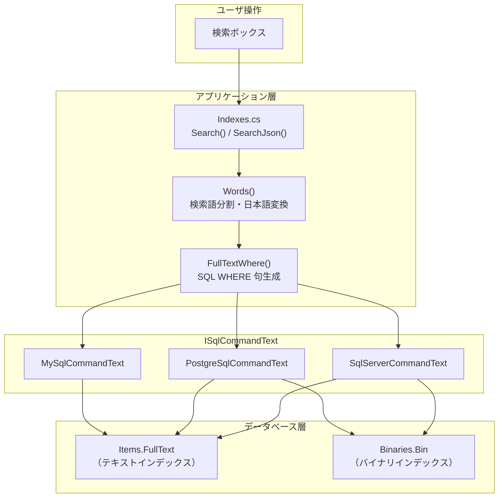
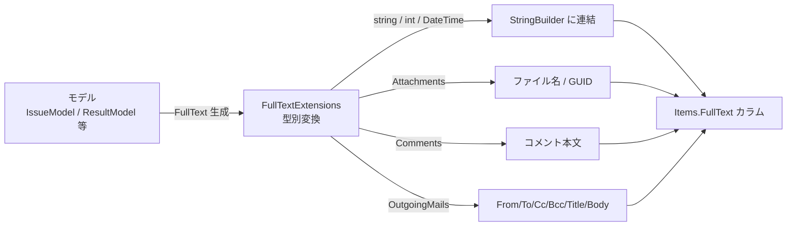
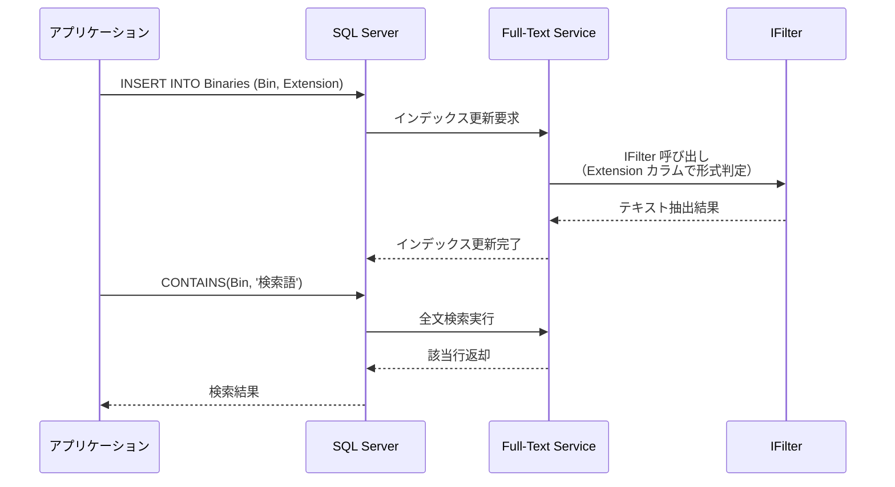
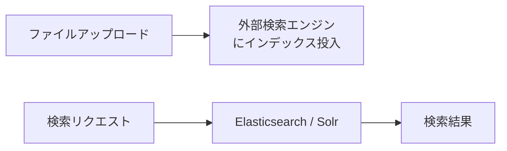
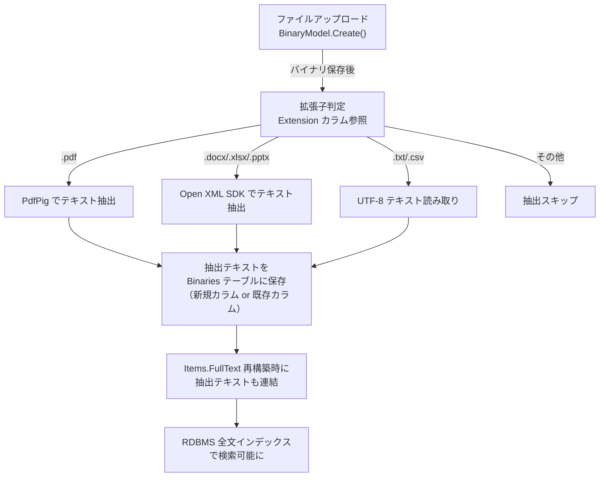

# 検索インデックスと添付ファイル検索フィルター

各種 RDBMS（SQL Server・PostgreSQL・MySQL）での全文検索インデックスの実装差異と、添付ファイルへの検索フィルター導入について調査した。

<!-- START doctoc generated TOC please keep comment here to allow auto update -->
<!-- DON'T EDIT THIS SECTION, INSTEAD RE-RUN doctoc TO UPDATE -->

- [調査情報](#調査情報)
- [調査目的](#調査目的)
- [全文検索の全体アーキテクチャ](#全文検索の全体アーキテクチャ)
- [Items.FullText カラムへのインデックス投入フロー](#itemsfulltext-カラムへのインデックス投入フロー)
- [RDBMS 別インデックス構成](#rdbms-別インデックス構成)
    - [インデックス作成 DDL の比較](#インデックス作成-ddl-の比較)
    - [インデックス構成の比較表](#インデックス構成の比較表)
- [RDBMS 別検索クエリ構文](#rdbms-別検索クエリ構文)
    - [SQL Server: CONTAINS](#sql-server-contains)
    - [PostgreSQL: pg_trgm 演算子](#postgresql-pg_trgm-演算子)
    - [MySQL: MATCH...AGAINST](#mysql-matchagainst)
    - [検索構文の比較表](#検索構文の比較表)
- [SearchDocuments パラメータによる制御](#searchdocuments-パラメータによる制御)
- [添付ファイル検索の RDBMS 別対応状況](#添付ファイル検索の-rdbms-別対応状況)
    - [SQL Server: IFilter による全文検索](#sql-server-ifilter-による全文検索)
    - [PostgreSQL: 限定的なバイナリ検索](#postgresql-限定的なバイナリ検索)
    - [MySQL: 完全に未対応](#mysql-完全に未対応)
    - [対応状況まとめ](#対応状況まとめ)
- [添付ファイル検索フィルターの導入検討](#添付ファイル検索フィルターの導入検討)
    - [課題](#課題)
    - [アプローチ 1: アプリケーション層でのテキスト抽出](#アプローチ-1-アプリケーション層でのテキスト抽出)
    - [アプローチ 2: 外部検索エンジンの導入](#アプローチ-2-外部検索エンジンの導入)
    - [アプローチ 3: PostgreSQL / MySQL 固有の全文検索拡張](#アプローチ-3-postgresql--mysql-固有の全文検索拡張)
    - [推奨アプローチ](#推奨アプローチ)
    - [アプローチ 1 の実装イメージ](#アプローチ-1-の実装イメージ)
- [結論](#結論)
- [関連ソースコード](#関連ソースコード)

<!-- END doctoc generated TOC please keep comment here to allow auto update -->

## 調査情報

| 調査日       | リポジトリ | ブランチ | タグ/バージョン    | コミット     | 備考     |
| ------------ | ---------- | -------- | ------------------ | ------------ | -------- |
| 2026年3月3日 | Pleasanter | main     | Pleasanter_1.5.1.0 | `34f162a439` | 初回調査 |

## 調査目的

プリザンターが対応する RDBMS ごとに全文検索インデックスの構成・検索構文・制限事項がどのように異なるかを明確にし、特に添付ファイル（バイナリデータ）の本文検索を可能にする検索フィルターの導入可否を検討する。

---

## 全文検索の全体アーキテクチャ

プリザンターの全文検索は以下のレイヤで構成されている。



---

## Items.FullText カラムへのインデックス投入フロー

各モデル（Issues / Results / Wikis / Sites / Dashboards）は `FullText()` メソッドを持ち、レコードの更新時にカラム値を連結して `Items.FullText` に格納する。



`Column.FullTextType` 列挙体により、各カラムのインデックス投入内容を制御する。

| FullTextType          | インデックスに含まれる内容       |
| --------------------- | -------------------------------- |
| `None`                | インデックス対象外               |
| `DisplayName`         | 表示名のみ（添付ファイル名など） |
| `Value`               | 値のみ（GUID など）              |
| `ValueAndDisplayName` | 値と表示名の両方                 |

**ファイル**: `Implem.Pleasanter/Libraries/Extensions/FullTextExtensions.cs`（行番号: 426-458）

```csharp
public static void FullText(
    this Attachments self,
    Context context,
    Column column,
    StringBuilder fullText)
{
    if (self != null)
    {
        switch (column?.FullTextType)
        {
            case Column.FullTextTypes.DisplayName:
                self?.ForEach(o =>
                    fullText.Append(" ").Append(o.Name));
                break;
            case Column.FullTextTypes.Value:
                self?.ForEach(o =>
                    fullText.Append(" ").Append(o.Guid));
                break;
            case Column.FullTextTypes.ValueAndDisplayName:
                self?.ForEach(o =>
                    fullText.Append(" ").Append(o.Guid)
                            .Append(" ").Append(o.Name));
                break;
        }
    }
}
```

添付ファイルのメタデータ（ファイル名・GUID）はインデックスに含まれるが、ファイル本文（バイナリ内容）は `Items.FullText` には含まれない。ファイル本文の検索は別途 `Binaries.Bin` カラムへの全文検索で実現する。

---

## RDBMS 別インデックス構成

### インデックス作成 DDL の比較

CodeDefiner の `TablesConfigurator` クラスが RDBMS ごとに異なる DDL を実行してインデックスを作成する。

**ファイル**: `Implem.CodeDefiner/Supports/CodeDefiner/TablesConfigurator.cs`

#### SQL Server

**ファイル**: `Implem.Pleasanter/App_Data/Definitions/Sqls/SQLServer/CreateFullText.sql`

```sql
-- Full-Text Catalog の作成
CREATE FULLTEXT CATALOG ftx
WITH ACCENT_SENSITIVITY = OFF;

-- Items テーブルの全文インデックス
CREATE FULLTEXT INDEX ON [Items]
    ([FullText] Language 'Japanese')
    KEY INDEX #PKItems#
    ON ftx;

-- Binaries テーブルの全文インデックス（IFilter 連携）
CREATE FULLTEXT INDEX ON [Binaries]
    ([Bin] TYPE COLUMN Extension Language 'Japanese')
    KEY INDEX #PKBinaries#
    ON ftx;
```

| 項目                  | 値                                     |
| --------------------- | -------------------------------------- |
| カタログ名            | `ftx`                                  |
| アクセント感度        | OFF                                    |
| 言語                  | Japanese                               |
| Items インデックス    | `FullText` カラム                      |
| Binaries インデックス | `Bin` カラム（TYPE COLUMN: Extension） |
| IFilter 連携          | あり（Extension カラムで形式判定）     |

`TYPE COLUMN Extension` の指定により、`Binaries.Extension` カラム（nvarchar(32)）に格納された拡張子をもとに、
SQL Server が適切な IFilter を自動選択してバイナリ内容をテキスト抽出する。

#### PostgreSQL

**ファイル**: `Implem.Pleasanter/App_Data/Definitions/Sqls/PostgreSQL/CreateFullText.sql`

```sql
create index if not exists "ftx" on "Items" using gin ("FullText" gin_trgm_ops);
```

| 項目                  | 値                 |
| --------------------- | ------------------ |
| インデックス名        | `ftx`              |
| インデックス種別      | GIN                |
| 演算子クラス          | `gin_trgm_ops`     |
| 必要な拡張            | `pg_trgm`          |
| Binaries インデックス | なし（DDL 未定義） |

`pg_trgm` 拡張は `CreateSchema.sql` で `create extension if not exists pg_trgm;` として作成される。

#### MySQL

**ファイル**: `Implem.Pleasanter/App_Data/Definitions/Sqls/MySQL/CreateFullText.sql`

```sql
create fulltext index "ftx" on "Items"("FullText") with parser "ngram";
```

| 項目                  | 値                 |
| --------------------- | ------------------ |
| インデックス名        | `ftx`              |
| パーサ                | ngram（CJK 対応）  |
| Binaries インデックス | なし（DDL 未定義） |

### インデックス構成の比較表

| 項目                   | SQL Server             | PostgreSQL            | MySQL                  |
| ---------------------- | ---------------------- | --------------------- | ---------------------- |
| インデックス種別       | Full-Text Catalog      | GIN + pg_trgm         | FULLTEXT INDEX + ngram |
| Items.FullText         | 対応                   | 対応                  | 対応                   |
| Binaries.Bin           | 対応（IFilter）        | DDL 未定義            | DDL 未定義             |
| 日本語対応             | Language 'Japanese'    | トライグラム分割      | ngram パーサ           |
| アクセント感度制御     | あり（OFF）            | なし                  | なし                   |
| バイナリ内テキスト抽出 | IFilter（OS 組み込み） | encode + トライグラム | 未対応                 |

---

## RDBMS 別検索クエリ構文

`ISqlCommandText` インタフェースの実装クラスが RDBMS ごとに異なる WHERE 句を生成する。

### SQL Server: CONTAINS

**ファイル**: `Rds/Implem.SqlServer/SqlServerCommandText.cs`（行番号: 81-99）

```csharp
// Items 検索
public string CreateFullTextWhereItem(...)
{
    return $"(contains(\"{itemsTableName}\".\"FullText\", @{paramName}...))";
}

// Binaries 検索
public string CreateFullTextWhereBinary(...)
{
    return $"(exists(select * from \"Binaries\" "
         + $"where \"Binaries\".\"ReferenceId\"=\"{itemsTableName}\".\"ReferenceId\" "
         + $"and contains(\"Bin\", @{paramName}...)))";
}
```

SQL Server は `CONTAINS()` 述語を使用する。`Binaries.Bin` に対しても `CONTAINS()` が使え、IFilter によりバイナリデータ内のテキストが検索対象になる。

### PostgreSQL: pg_trgm 演算子

**ファイル**: `Rds/Implem.PostgreSql/PostgreSqlCommandText.cs`（行番号: 93-119）

```csharp
// Items 検索
public string CreateFullTextWhereItem(...)
{
    return $"(\"{itemsTableName}\".\"FullText\" %> @{paramName}...)";
}

// Binaries 検索
public string CreateFullTextWhereBinary(...)
{
    return $"(exists(select * from \"Binaries\" "
         + $"where \"Binaries\".\"ReferenceId\"=\"{itemsTableName}\".\"ReferenceId\" "
         + $"and (encode(\"Bin\", 'escape') %> @{paramName}...)))";
}

// 検索語の前処理
public Dictionary<string,string> CreateSearchTextWords(...)
{
    // 複数語を単一パラメータに結合して返す
    return new Dictionary<string, string> { [Strings.NewGuid()] = searchText };
}
```

PostgreSQL は `pg_trgm` 拡張のトライグラム類似度演算子 `%>` を使用する。`encode("Bin", 'escape')` でバイナリデータをテキストに変換して検索するが、Office 文書や PDF のバイナリデータをそのままテキスト変換しても有意な結果は得られない。

### MySQL: MATCH...AGAINST

**ファイル**: `Rds/Implem.MySql/MySqlCommandText.cs`（行番号: 92-115）

```csharp
// Items 検索
public string CreateFullTextWhereItem(...)
{
    return $"match(\"{itemsTableName}\".\"FullText\") "
         + $"against (@{paramName}... in boolean mode)";
}

// Binaries 検索 ── 未対応
public string CreateFullTextWhereBinary(...)
{
    return "0=1"; // 常に false を返す
}
```

MySQL は `MATCH...AGAINST` を BOOLEAN MODE で使用する。Binaries 検索は `0=1`（常に偽）を返すため、添付ファイル内容の検索は完全に未対応である。

### 検索構文の比較表

| 項目           | SQL Server               | PostgreSQL                    | MySQL                             |
| -------------- | ------------------------ | ----------------------------- | --------------------------------- |
| Items 検索     | `CONTAINS(FullText, @p)` | `FullText %> @p`              | `MATCH(FullText) AGAINST(@p ...)` |
| Binaries 検索  | `CONTAINS(Bin, @p)`      | `encode(Bin, 'escape') %> @p` | `0=1`（未対応）                   |
| 検索語の前処理 | なし（単語そのまま）     | 単一パラメータに結合          | なし（単語そのまま）              |
| 否定検索       | `NOT CONTAINS`           | `NOT (%>)`                    | `NOT MATCH...AGAINST`             |

---

## SearchDocuments パラメータによる制御

添付ファイル内容の検索は `Parameters.Search.SearchDocuments` パラメータで制御される。

**ファイル**: `Implem.Pleasanter/App_Data/Parameters/Search.json`

```json
{
    "SearchDocuments": false,
    "CreateIndexes": true,
    "PageSize": 20,
    "DisableCrossSearch": false,
    "DisableCrossSearchSites": false,
    "FullTextIncludeBreadcrumb": false,
    "FullTextIncludeSiteId": false,
    "FullTextIncludeSiteTitle": true,
    "FullTextNumberOfMails": 10,
    "FullTextMaxNumberOfMails": 100
}
```

**ファイル**: `Implem.Pleasanter/Libraries/Search/Indexes.cs`（行番号: 900-911）

```csharp
private static string FullTextWhere(
    ISqlObjectFactory factory,
    string name,
    string itemsTableName = "Items",
    bool negative = false)
{
    var item = factory.SqlCommandText.CreateFullTextWhereItem(itemsTableName, name, negative);
    var binary = factory.SqlCommandText.CreateFullTextWhereBinary(itemsTableName, name, negative);
    return Parameters.Search.SearchDocuments
        ? $"({item} or {binary})"
        : item;
}
```

| パラメータ                 | デフォルト | 説明                                       |
| -------------------------- | ---------- | ------------------------------------------ |
| `SearchDocuments`          | `false`    | Binaries テーブルも検索対象に含めるか      |
| `CreateIndexes`            | `true`     | バックグラウンドでインデックスを作成するか |
| `FullTextIncludeSiteTitle` | `true`     | サイト名をインデックスに含めるか           |
| `FullTextNumberOfMails`    | `10`       | インデックスに含める送信メール数           |
| `FullTextMaxNumberOfMails` | `100`      | インデックスに含める送信メール最大数       |

`SearchDocuments` を `true` に設定すると、生成される WHERE 句が `(Items検索 OR Binaries検索)` に変わり、
添付ファイルの内容も検索対象になる。ただし、実際に有効に機能するのは SQL Server のみである。

---

## 添付ファイル検索の RDBMS 別対応状況

### SQL Server: IFilter による全文検索

SQL Server は OS に組み込まれた IFilter（Index Filter）を利用して、バイナリデータからテキストを抽出する。



#### IFilter の標準対応形式

Windows に標準搭載される IFilter で対応可能な形式は以下の通り。

| 形式             | 拡張子                    | IFilter                   |
| ---------------- | ------------------------- | ------------------------- |
| プレーンテキスト | `.txt`                    | 標準搭載                  |
| HTML             | `.html`, `.htm`           | 標準搭載                  |
| XML              | `.xml`                    | 標準搭載                  |
| Office 2007 以降 | `.docx`, `.xlsx`, `.pptx` | Office Filter Pack        |
| Office レガシー  | `.doc`, `.xls`, `.ppt`    | Office Filter Pack        |
| PDF              | `.pdf`                    | Adobe PDF IFilter / Foxit |

Office Filter Pack は別途インストールが必要。PDF 用 IFilter も別途導入する必要がある。

#### IFilter の確認方法

SQL Server にインストール済みの IFilter は以下のクエリで確認できる。

```sql
SELECT document_type, path
FROM sys.fulltext_document_types
ORDER BY document_type;
```

### PostgreSQL: 限定的なバイナリ検索

PostgreSQL の現在の実装は `encode("Bin", 'escape')` でバイナリデータをテキストに変換し、
`pg_trgm` のトライグラム検索を行う。この方法はプレーンテキストのバイナリデータに対しては機能するが、
Office 文書や PDF 等のバイナリ形式にはほぼ無効である。

#### 有効なケース

- プレーンテキストファイル（`.txt`, `.csv`）
- ソースコードファイル（`.cs`, `.js`, `.json`）

#### 無効なケース

- PDF（圧縮ストリーム内にテキストが格納される）
- Office 文書（ZIP アーカイブ + XML 構造）
- 画像ファイル（テキスト情報を持たない）

### MySQL: 完全に未対応

`CreateFullTextWhereBinary()` が `0=1` を返すため、`SearchDocuments` を有効にしても添付ファイル内容は一切検索されない。

### 対応状況まとめ

| RDBMS      | Items.FullText | Binaries テキスト | Binaries バイナリ（PDF/Office 等） |
| ---------- | -------------- | ----------------- | ---------------------------------- |
| SQL Server | 対応           | 対応              | 対応（IFilter 必要）               |
| PostgreSQL | 対応           | 限定的            | 未対応                             |
| MySQL      | 対応           | 未対応            | 未対応                             |

---

## 添付ファイル検索フィルターの導入検討

### 課題

PostgreSQL と MySQL では添付ファイル（PDF・Office 文書等）のバイナリ内容を直接検索する手段がない。SQL Server でも IFilter の導入・管理が必要である。

### アプローチ 1: アプリケーション層でのテキスト抽出

RDBMS に依存せず、アプリケーション層で添付ファイルからテキストを抽出し、`Items.FullText` に追記する方式。


#### 候補ライブラリ

| ライブラリ                                                       | 対応形式           | ライセンス | .NET 対応 | 備考                              |
| ---------------------------------------------------------------- | ------------------ | ---------- | --------- | --------------------------------- |
| [itext7](https://github.com/itext/itext-dotnet)                  | PDF                | AGPL       | .NET 6+   | 商用利用は有償ライセンス必要      |
| [PdfPig](https://github.com/UglyToad/PdfPig)                     | PDF                | Apache 2.0 | .NET 6+   | PDF テキスト抽出に特化            |
| [DocumentFormat.OpenXml](https://github.com/dotnet/Open-XML-SDK) | docx/xlsx/pptx     | MIT        | .NET 6+   | Microsoft 公式 SDK                |
| [NPOI](https://github.com/nissl-lab/npoi)                        | doc/xls/ppt/docx等 | Apache 2.0 | .NET 6+   | レガシー Office 形式にも対応      |
| [Apache Tika](https://tika.apache.org/)                          | 多形式             | Apache 2.0 | Java      | REST API 経由で .NET から利用可能 |

#### メリット

- 全 RDBMS で統一的に動作する
- IFilter のインストール・管理が不要
- 抽出テキストの加工（正規化・不要文字除去）が可能
- `Items.FullText` の既存インデックスをそのまま活用できる

#### デメリット

- ファイル形式ごとにライブラリの導入・メンテナンスが必要
- ファイルアップロード時の処理負荷が増加する
- `Items.FullText` カラムのサイズが増大する
- 大容量ファイルの処理でメモリ消費が増加する

### アプローチ 2: 外部検索エンジンの導入

Elasticsearch や Apache Solr 等の外部検索エンジンを利用する方式。



#### メリット

- PDF・Office 文書等を含む多形式に標準対応
- スケーラビリティが高い
- 高度な検索機能（ファセット・ハイライト・スコアリング等）

#### デメリット

- 外部サービスの運用・管理コストが発生する
- プリザンターの既存検索アーキテクチャとの統合に大幅な改修が必要
- セキュリティ（権限チェック）の二重管理が必要になる

### アプローチ 3: PostgreSQL / MySQL 固有の全文検索拡張

各 RDBMS の全文検索機能を拡充する方式。

#### PostgreSQL

| 拡張       | 説明                               |
| ---------- | ---------------------------------- |
| `tsvector` | 組み込みの全文検索型に変更する     |
| `pgroonga` | Groonga ベースの多言語全文検索拡張 |
| `pg_bigm`  | 2-gram ベースの日本語全文検索拡張  |

現在の実装は `pg_trgm`（トライグラム）を使用しているが、`tsvector` + `to_tsvector()` に変更することで、より標準的な全文検索が可能になる。ただし、バイナリデータのテキスト抽出は別途必要。

#### MySQL

MySQL 8.0 以降は InnoDB FULLTEXT INDEX を標準サポートしている。現在の ngram パーサ実装は Items.FullText に対しては適切だが、バイナリデータの直接検索機能は持たない。

### 推奨アプローチ

| 観点               | アプローチ 1（アプリ層抽出） | アプローチ 2（外部エンジン） | アプローチ 3（RDBMS 拡張） |
| ------------------ | ---------------------------- | ---------------------------- | -------------------------- |
| 実装コスト         | 中                           | 大                           | 中～大                     |
| RDBMS 非依存       | はい                         | はい                         | いいえ                     |
| 既存構造との親和性 | 高い                         | 低い                         | 中                         |
| 対応形式の拡張性   | ライブラリ追加で対応         | 標準で多形式対応             | RDBMS 依存                 |
| 運用コスト         | 低                           | 高                           | 中                         |

プリザンターの既存アーキテクチャとの親和性を考慮すると、**アプローチ 1（アプリケーション層でのテキスト抽出）が最も現実的**である。理由は以下の通り。

- `Items.FullText` カラムへの追記で既存のインデックス構造を活用できる
- RDBMS に依存しない統一的な動作が実現できる
- ファイルアップロード時またはバックグラウンドタスクでのテキスト抽出が可能
- PdfPig（PDF）+ Open XML SDK（Office）の組み合わせで主要形式をカバーできる

### アプローチ 1 の実装イメージ



#### 主要な改修箇所

| 対象                    | 改修内容                                   |
| ----------------------- | ------------------------------------------ |
| `BinaryModel`           | ファイル保存時にテキスト抽出を呼び出す     |
| `FullTextExtensions.cs` | 抽出テキストを `Items.FullText` に含める   |
| `Binaries` テーブル     | 抽出テキスト保存用カラムの追加を検討       |
| `Search.json`           | テキスト抽出の有効化パラメータを追加       |
| `Indexes.cs`            | インデックス再構築時の抽出テキスト連結処理 |

---

## 結論

| 項目                       | 結論                                                                                               |
| -------------------------- | -------------------------------------------------------------------------------------------------- |
| SQL Server の全文検索      | Full-Text Catalog + CONTAINS で Items / Binaries 両方に対応済み。IFilter で PDF・Office も検索可能 |
| PostgreSQL の全文検索      | pg_trgm + GIN で Items に対応済み。Binaries は encode + トライグラム方式で限定的                   |
| MySQL の全文検索           | ngram パーサ + MATCH...AGAINST で Items に対応済み。Binaries は完全に未対応                        |
| 添付ファイル検索の現状     | SQL Server のみ IFilter 経由で実用的。PostgreSQL・MySQL は実質未対応                               |
| 推奨改善策                 | アプリケーション層でのテキスト抽出が最も現実的。PdfPig + Open XML SDK で主要形式をカバー可能       |
| SearchDocuments パラメータ | デフォルト false。true にしても SQL Server 以外ではほぼ無効                                        |

---

## 関連ソースコード

| ファイルパス                                                                | 内容                               |
| --------------------------------------------------------------------------- | ---------------------------------- |
| `Implem.Pleasanter/Libraries/Search/Indexes.cs`                             | 全文検索のコアロジック             |
| `Implem.Pleasanter/Libraries/Extensions/FullTextExtensions.cs`              | 型別の全文テキスト変換             |
| `Rds/Implem.SqlServer/SqlServerCommandText.cs`                              | SQL Server 用 WHERE 句生成         |
| `Rds/Implem.PostgreSql/PostgreSqlCommandText.cs`                            | PostgreSQL 用 WHERE 句生成         |
| `Rds/Implem.MySql/MySqlCommandText.cs`                                      | MySQL 用 WHERE 句生成              |
| `Rds/Implem.IRds/ISqlCommandText.cs`                                        | RDBMS 共通インタフェース           |
| `Implem.Pleasanter/App_Data/Definitions/Sqls/SQLServer/CreateFullText.sql`  | SQL Server インデックス DDL        |
| `Implem.Pleasanter/App_Data/Definitions/Sqls/PostgreSQL/CreateFullText.sql` | PostgreSQL インデックス DDL        |
| `Implem.Pleasanter/App_Data/Definitions/Sqls/MySQL/CreateFullText.sql`      | MySQL インデックス DDL             |
| `Implem.Pleasanter/App_Data/Parameters/Search.json`                         | 検索パラメータ設定                 |
| `Implem.ParameterAccessor/Parts/Search.cs`                                  | Search パラメータクラス            |
| `Implem.CodeDefiner/Supports/CodeDefiner/TablesConfigurator.cs`             | CodeDefiner によるインデックス作成 |
