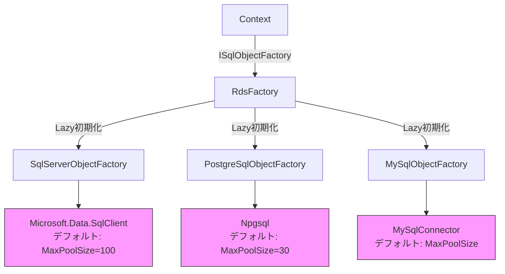
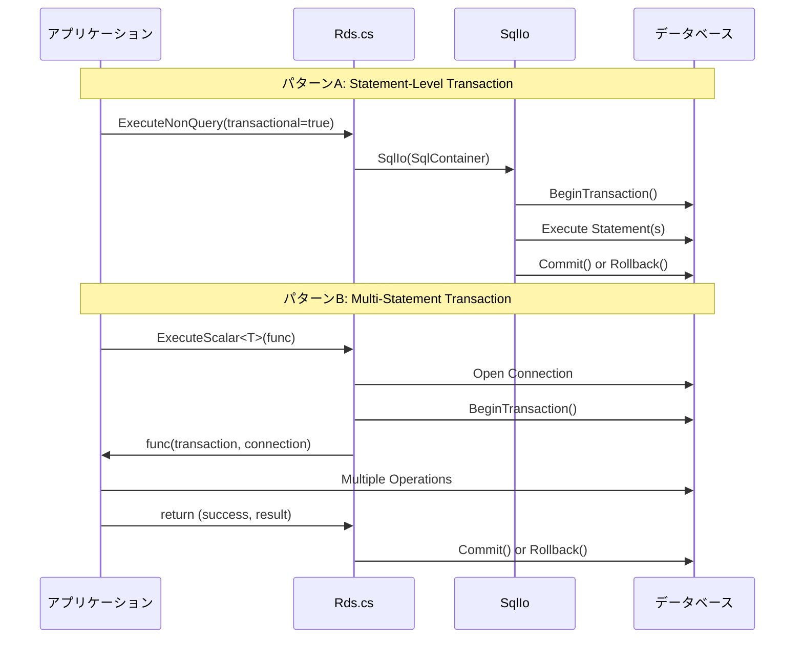
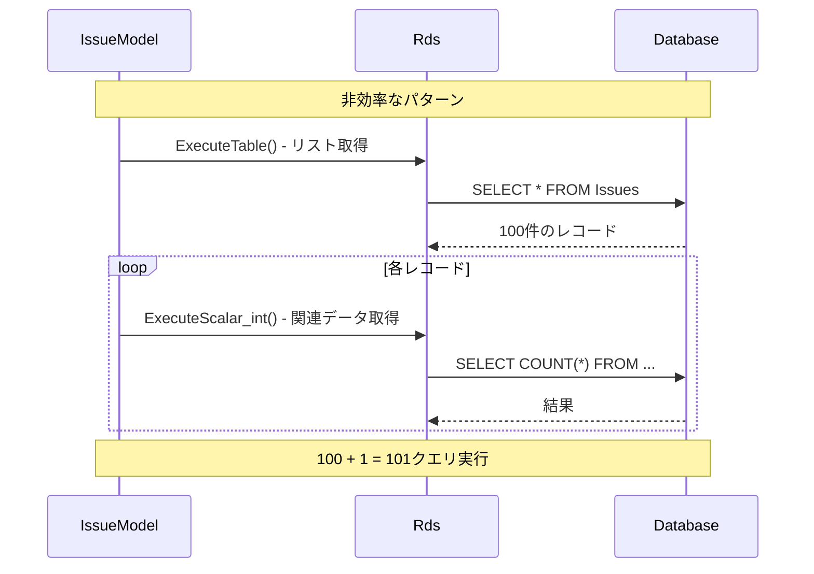
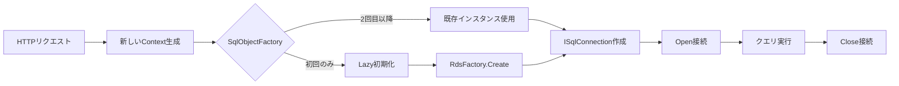
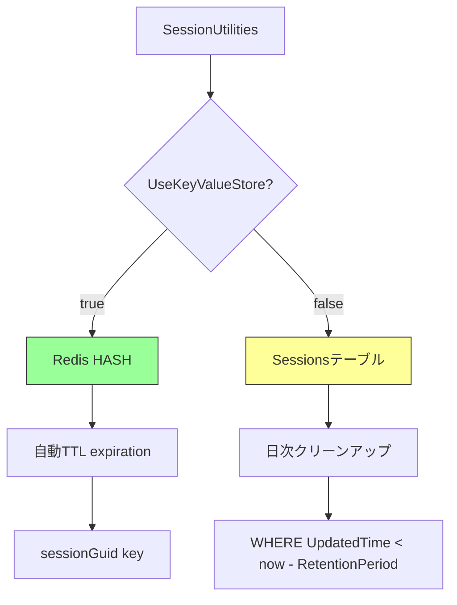
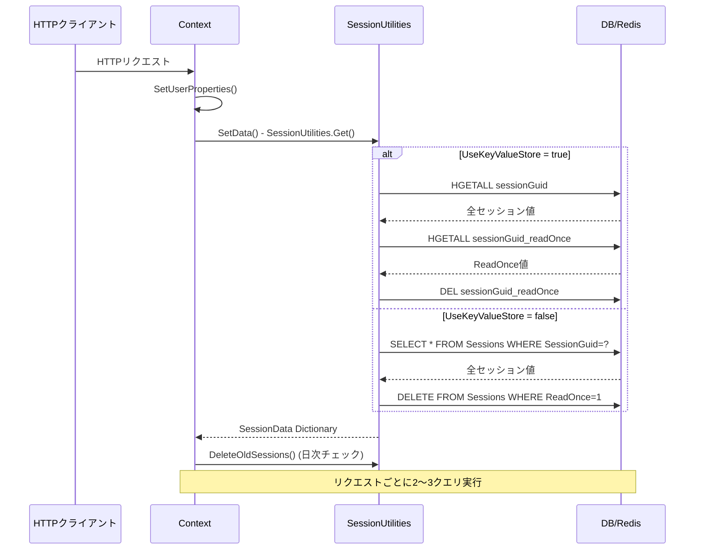

# DBとセッション回りのパフォーマンスボトルネック分析

プリザンターのデータベース実装とセッション管理における性能上の問題点を調査し、改善案を提示する。

<!-- START doctoc generated TOC please keep comment here to allow auto update -->
<!-- DON'T EDIT THIS SECTION, INSTEAD RE-RUN doctoc TO UPDATE -->

- [調査情報](#調査情報)
- [調査目的](#調査目的)
- [データベース実装の分析](#データベース実装の分析)
    - [接続管理とプーリング](#接続管理とプーリング)
    - [トランザクション管理](#トランザクション管理)
    - [クエリ実行パターンとN+1問題](#クエリ実行パターンとn1問題)
    - [データベースコンテキストライフサイクル](#データベースコンテキストライフサイクル)
    - [キャッシュ機構](#キャッシュ機構)
    - [デッドロック対策](#デッドロック対策)
- [セッション管理の分析](#セッション管理の分析)
    - [セッションストレージ機構](#セッションストレージ機構)
    - [セッション初期化処理](#セッション初期化処理)
    - [セッションシリアライゼーション](#セッションシリアライゼーション)
    - [セッションクリーンアップ](#セッションクリーンアップ)
    - [Redis接続管理](#redis接続管理)
- [性能ボトルネックのまとめ](#性能ボトルネックのまとめ)
    - [重大度別問題一覧](#重大度別問題一覧)
- [改善提案](#改善提案)
    - [1. データベース接続プールの最適化](#1-データベース接続プールの最適化)
    - [2. N+1クエリ問題の解消](#2-n1クエリ問題の解消)
    - [3. クエリ結果キャッシュの導入](#3-クエリ結果キャッシュの導入)
    - [4. セッション取得の最適化](#4-セッション取得の最適化)
    - [5. セッションクリーンアップのバックグラウンド化](#5-セッションクリーンアップのバックグラウンド化)
    - [6. Redis障害時のフォールバック実装](#6-redis障害時のフォールバック実装)
    - [7. トランザクションタイムアウトの実装](#7-トランザクションタイムアウトの実装)
    - [8. デッドロックリトライのロギング](#8-デッドロックリトライのロギング)
- [実装優先順位とロードマップ](#実装優先順位とロードマップ)
    - [Phase 1: 即効性の高い改善（1-2週間）](#phase-1-即効性の高い改善1-2週間)
    - [Phase 2: 構造的改善（2-4週間）](#phase-2-構造的改善2-4週間)
    - [Phase 3: 運用改善（1-2週間）](#phase-3-運用改善1-2週間)
- [性能改善効果の試算](#性能改善効果の試算)
    - [現状の性能特性（推定値）](#現状の性能特性推定値)
    - [改善後の性能特性（推定値）](#改善後の性能特性推定値)
- [結論](#結論)
    - [主要ボトルネック](#主要ボトルネック)
    - [推奨される改善ステップ](#推奨される改善ステップ)
- [関連ソースコード](#関連ソースコード)
- [注意事項](#注意事項)
- [関連リンク](#関連リンク)

<!-- END doctoc generated TOC please keep comment here to allow auto update -->

## 調査情報

| 調査日       | リポジトリ | ブランチ | タグ/バージョン | コミット   | 備考                           |
| ------------ | ---------- | -------- | --------------- | ---------- | ------------------------------ |
| 2026年3月7日 | Pleasanter | main     |                 | `34f162a4` | DB・セッション性能ボトルネック |

## 調査目的

プリザンターのパフォーマンス低下要因として、DB回りの実装やセッション回りの実装を深掘りし、以下を明らかにする:

1. データベース接続管理における潜在的なボトルネック
2. クエリ実行パターンにおけるN+1問題等の非効率な実装
3. トランザクション管理の課題
4. セッション管理における性能問題
5. 具体的な改善案の提示

---

## データベース実装の分析

### 接続管理とプーリング

**現状**:

プリザンターは各DBMSのネイティブドライバが提供する接続プーリングに完全依存している。



**問題点**:

| 問題                 | 説明                                                                               | 影響度 |
| -------------------- | ---------------------------------------------------------------------------------- | ------ |
| プールサイズ未制御   | 接続文字列に明示的なプールサイズ設定がない。DBMSごとのデフォルト値に依存           | 高     |
| プール枯渇リスク     | 高負荷時にPostgreSQLの接続プール（最大30）が枯渇しやすい                           | 高     |
| 接続リーク可能性     | 例外発生時のcleanup処理はあるが、明示的な接続返却タイミングが不明確                | 中     |
| 接続文字列の重複管理 | Sa/Owner/Userの3種類の接続文字列を管理しているが、プーリング設定は個別に適用不可能 | 中     |

**関連コード**:

`Implem.Pleasanter/Libraries/DataSources/SqlServer/SqlIo.cs`:245-257

```csharp
private ISqlConnection CreateAndOpenConnection(ISqlObjectFactory factory)
{
    var sqlConnection = factory.CreateSqlConnection(
        connectionString: SqlContainer.ConnectionString);
    sqlConnection.Open();
    return sqlConnection;
}

// Cleanup処理
if (createdSqlConnection != null)
{
    createdSqlConnection.Close();
    createdSqlConnection.Dispose();
}
```

### トランザクション管理

**現状**:

2つのトランザクションパターンが混在している。



**問題点**:

| 問題                         | 説明                                                                        | 影響度 |
| ---------------------------- | --------------------------------------------------------------------------- | ------ |
| ネストされたトランザクション | SavePointの明示的な管理がなく、ネストトランザクションが発生する可能性がある | 中     |
| 長時間トランザクション       | トランザクション自体のタイムアウト設定がなく、コマンドタイムアウトのみ      | 高     |
| 分離レベル未指定             | デフォルト分離レベル（READ_COMMITTED）に依存しており、明示的な制御がない    | 中     |
| デッドロック時のリトライ     | デッドロック発生時のリトライ機構はあるが、最大リトライ回数の設定が不明確    | 低     |

**関連コード**:

`Implem.Pleasanter/Libraries/DataSources/Rds.cs`:219-254

```csharp
public static T ExecuteScalar<T>(
    Context context,
    string connectionString = null,
    bool transactional = false,
    Func<IDbTransaction, IDbConnection, (bool, T)> func = null)
{
    using(var dbConnection = context.CreateSqlConnection(connectionString))
    {
        dbConnection.Open();
        var transaction = transactional
            ? dbConnection.BeginTransaction()
            : null;
        try
        {
            var (success, responce) = func(transaction, dbConnection);
            if(success) transaction?.Commit();
            else transaction?.Rollback();
            return responce;
        }
        catch
        {
            transaction?.Rollback();
            throw;
        }
    }
}
```

### クエリ実行パターンとN+1問題

**現状**:

複数のSqlStatementをバッチ実行する機能はあるが、必ずしも活用されていない。

**N+1リスクパターンの例**:



**問題点**:

| 問題                 | 説明                                                                   | 影響度 |
| -------------------- | ---------------------------------------------------------------------- | ------ |
| N+1クエリ            | foreachループ内でのRds.ExecuteTable()呼び出しが散見される              | 高     |
| バッチ実行の未活用   | ExecuteDataSet_responses()でバッチ実行可能だが、個別実行パターンが多い | 高     |
| Eager Loading不在    | 関連データの一括取得機構がなく、都度クエリ実行                         | 高     |
| キャッシュ機構の不足 | 同一クエリの結果をキャッシュする仕組みがTenantCache以外にない          | 中     |

**関連コード**:

`Implem.DefinitionAccessor/Def.cs`:217-237

```csharp
public static SqlIo SqlIoByUser(
    ISqlObjectFactory factory,
    bool transactional = false,
    SqlStatement[] statements = null)
{
    // 複数のSqlStatementをまとめて実行可能
    return new SqlIo(
        factory: factory,
        sqlContainer: new SqlContainer
        {
            SqlStatementCollection = new List<SqlStatement>(statements),
            ConnectionString = Parameters.Rds.UserConnectionString,
            // ...
        });
}
```

### データベースコンテキストライフサイクル

**現状**:

リクエストごとにContextインスタンスが作成されるが、SqlObjectFactoryはアプリケーションスコープでLazy初期化される。



**問題点**:

| 問題                         | 説明                                                                            | 影響度 |
| ---------------------------- | ------------------------------------------------------------------------------- | ------ |
| コンテキストトラッキング不在 | EFのような変更追跡機構がないため、更新時に全フィールドをSET句に含める必要がある | 中     |
| RdsUserの可変参照            | RdsUserがSerializableだがmutableで、スレッド安全性に懸念                        | 低     |
| Factory初期化タイミング      | Lazy初期化で最初のリクエストに初期化コストが載る                                | 低     |

**関連コード**:

`Implem.Pleasanter/Libraries/Requests/Context.cs`:1230-1237

```csharp
private static readonly Lazy<ISqlObjectFactory> _sqlObjectFactory =
    new Lazy<ISqlObjectFactory>(() =>
{
    return RdsFactory.Create(Parameters.Rds.Dbms);
});

protected ISqlObjectFactory GetSqlObjectFactory()
{
    return _sqlObjectFactory.Value;
}
```

### キャッシュ機構

**現状**:

アプリケーションレベルのキャッシュは限定的。

| キャッシュ種別   | スコープ     | 対象データ                               | 更新検知          |
| ---------------- | ------------ | ---------------------------------------- | ----------------- |
| TenantCache      | テナント単位 | Sites, Departments, Groups, Users        | UpdateMonitor     |
| Redis Session    | セッション   | セッションデータのみ                     | TTL（時間ベース） |
| SQL Result Cache | なし         | クエリ結果のキャッシュは実装されていない | -                 |

**問題点**:

| 問題                        | 説明                                                      | 影響度 |
| --------------------------- | --------------------------------------------------------- | ------ |
| クエリ結果キャッシュ不在    | 同一クエリが複数回実行されてもキャッシュされない          | 高     |
| TenantCacheの更新タイミング | UpdateMonitorに依存しており、リアルタイム性に欠ける可能性 | 中     |
| Redisの活用不足             | セッションデータのみでアプリケーションキャッシュに未使用  | 中     |

**関連コード**:

`Implem.Pleasanter/Libraries/Server/TenantCache.cs`

```csharp
public class TenantCache
{
    public int TenantId;
    public string SitesUpdatedTime;
    public Dictionary<long, DataRow> Sites;
    public Dictionary<int, Dept> DeptHash;
    public Dictionary<int, Group> GroupHash;
    public Dictionary<int, User> UserHash;
    public SiteNameTree SiteNameTree;
    public UpdateMonitor UpdateMonitor;
}
```

### デッドロック対策

**現状**:

デッドロック検出時の自動リトライ機構が実装されている。

**問題点**:

| 問題                 | 説明                                                               | 影響度 |
| -------------------- | ------------------------------------------------------------------ | ------ |
| リトライ設定の可視性 | DeadlockRetryCountとDeadlockRetryIntervalの設定箇所が分散している  | 低     |
| リトライ回数の妥当性 | デフォルト値が不明確で、高負荷時に適切かどうか不明                 | 中     |
| リトライログの不足   | リトライ発生時のログ記録がないため、デッドロック頻度を把握できない | 中     |

**関連コード**:

`Implem.Libraries/DataSources/SqlServer/SqlIo.cs`:284-305

```csharp
private void Try(ISqlObjectFactory factory, Action action)
{
    for (int i = 0; i <= Environments.DeadlockRetryCount; i++)
    {
        try
        {
            action();
            break;
        }
        catch (DbException e)
        {
            if (factory.SqlErrors.ErrorCode(e) ==
                factory.SqlErrors.ErrorCodeDeadLocked)
            {
                System.Threading.Thread.Sleep(
                    Environments.DeadlockRetryInterval);
            }
            else
            {
                throw;
            }
        }
    }
}
```

---

## セッション管理の分析

### セッションストレージ機構

**現状**:

Redis（KVS）とデータベースの2モード切替可能なデュアルモード。



**問題点**:

| 問題                     | 説明                                                                       | 影響度 |
| ------------------------ | -------------------------------------------------------------------------- | ------ |
| DBモードの性能問題       | リクエストごとに2つのSQLクエリ（SELECT + DELETE）を実行                    | 高     |
| セッション全件取得       | SetData()で全セッションデータを取得するが、必要な値は一部のみの可能性      | 高     |
| Lazy Loading不在         | 使用しないセッション値も常に全件ロードされる                               | 高     |
| クリーンアップタイミング | 日次クリーンアップが次のリクエストまで実行されず、古いデータが蓄積しやすい | 中     |

**関連コード**:

`Implem.Pleasanter/Models/Sessions/SessionUtilities.cs`:57-86

```csharp
// DBモードでのセッション取得
return Rds.ExecuteTable(
    context: context,
    statements: Rds.SelectSessions(/* ... */))
    .AsEnumerable()
    .ToDictionary(
        dataRow => page
            ? dataRow.String("Key").Split('_')[0]
            : dataRow.String("Key"),
        dataRow => dataRow.String("Value"));

// ReadOnce削除（別クエリ）
Rds.ExecuteNonQuery(
    context: context,
    statements: Rds.PhysicalDeleteSessions(
        where: Rds.SessionsWhere()
            .SessionGuid(sessionGuid)
            .ReadOnce(true)));
```

### セッション初期化処理

**現状**:

リクエストごとにContext初期化時にSetData()が呼ばれ、全セッションデータをロードする。



**問題点**:

| 問題                     | 説明                                                                    | 影響度 |
| ------------------------ | ----------------------------------------------------------------------- | ------ |
| 全件ロードオーバーヘッド | 必要な値が1つでも全セッションデータをロード                             | 高     |
| リクエスト単位の実行     | 毎リクエストで初期化処理が走る（キャッシュなし）                        | 高     |
| クリーンアップの遅延実行 | DeleteOldSessions()がSetData()内で実行され、初回リクエストに追加コスト  | 中     |
| スレッドセーフ性の欠如   | SiteInfo.SessionCleanedUpDateがstatic変数で、並行リクエストで競合可能性 | 中     |

**関連コード**:

`Implem.Pleasanter/Libraries/Requests/Context.cs`:539-572

```csharp
private void SetData()
{
    SessionData = SessionUtilities.Get(context: this, includeUserArea: true);
    // 全セッションデータを辞書にロード
}
```

### セッションシリアライゼーション

**現状**:

JSON形式でシリアライズしてStringとして保存。

**問題点**:

| 問題                       | 説明                                                   | 影響度 |
| -------------------------- | ------------------------------------------------------ | ------ |
| シリアライズオーバーヘッド | 複雑なオブジェクトをJSON化する際のCPUコスト            | 中     |
| デシリアライズ遅延なし     | 全値をデシリアライズしてから辞書に格納（Lazy評価なし） | 中     |
| 型情報の欠如               | Stringとして保存されるため、取得時に型変換が必要       | 低     |

**関連コード**:

`Implem.Pleasanter/Models/Sessions/SessionUtilities.cs`:92-192

```csharp
// 設定時
SessionUtilities.Set(
    context: context,
    key: key,
    value: view.GetRecordingData(...).ToJson(),  // JSON化
    page: true);

// 取得時
var value = SessionData.Get("Key");  // String型
var obj = value.Deserialize<T>();    // デシリアライズ
```

### セッションクリーンアップ

**現状**:

日次で古いセッションを削除する仕組み。

**問題点**:

| 問題                       | 説明                                                                             | 影響度 |
| -------------------------- | -------------------------------------------------------------------------------- | ------ |
| 実行タイミングの不確実性   | 日付境界後の初回リクエストで実行されるため、時刻が不定                           | 中     |
| 並行実行のリスク           | 複数スレッドが同時にDeleteOldSessions()を実行する可能性                          | 中     |
| ユーザーセッションの除外   | `@%`プレフィックスのセッションは削除されないため、永続化されユーザー削除時に残留 | 低     |
| クリーンアップコストの転嫁 | バックグラウンドジョブではなくユーザーリクエストに載せている                     | 中     |

**関連コード**:

`Implem.Pleasanter/Models/Sessions/SessionUtilities.cs`:434-450

```csharp
public static void DeleteOldSessions(Context context)
{
    var before = SiteInfo.SessionCleanedUpDate.ToLocal(context).ToString("yyyy/MM/dd");
    var now = DateTime.Now.ToLocal(context).ToString("yyyy/MM/dd");

    if (before != now)  // 日付が変わったら実行
    {
        SiteInfo.SessionCleanedUpDate = DateTime.Now;
        Rds.ExecuteNonQuery(
            context: context,
            statements: Rds.PhysicalDeleteSessions(
                where: Rds.SessionsWhere()
                    .UpdatedTime(
                        DateTime.Now.AddMinutes(Parameters.Session.RetentionPeriod * -1),
                        _operator: "<")
                    .Add(raw: "( \"SessionGuid\" not like '@%' )")));
    }
}
```

### Redis接続管理

**現状**:

StackExchange.Redisを使用したLazy初期化。

**問題点**:

| 問題                   | 説明                                                              | 影響度 |
| ---------------------- | ----------------------------------------------------------------- | ------ |
| 接続プール設定の可視性 | ConnectionMultiplexerの設定が不明確（接続数、タイムアウト等）     | 中     |
| 再接続ポリシー         | 接続断時の再接続ポリシーが明示的に設定されていない                | 中     |
| エラーハンドリング     | Redis障害時のフォールバック処理がない（DBモードへの自動切替なし） | 高     |

**関連コード**:

`Implem.Pleasanter/Libraries/Redis/CacheForRedisConnection.cs`

```csharp
private static readonly Lazy<ConnectionMultiplexer> LazyConnection =
    new Lazy<ConnectionMultiplexer>(() =>
{
    return ConnectionMultiplexer.Connect(
        Parameters.Kvs.ConnectionStringForSession,
        x => x.AllowAdmin = true);
});
```

---

## 性能ボトルネックのまとめ

### 重大度別問題一覧

| 重大度 | 問題                        | 箇所                 | 説明                                           |
| ------ | --------------------------- | -------------------- | ---------------------------------------------- |
| 高     | N+1クエリ                   | DB実行パターン       | ループ内での個別クエリ実行                     |
| 高     | セッション全件ロード        | SessionUtilities     | 必要な値のみでなく全データを毎回ロード         |
| 高     | DBモードのセッション取得    | SessionUtilities     | リクエストごとに2クエリ実行（SELECT + DELETE） |
| 高     | クエリ結果キャッシュ不在    | 全体                 | 同一クエリの結果がキャッシュされない           |
| 高     | 接続プール枯渇リスク        | PostgreSQL接続       | デフォルトのMaxPoolSize=30が小さい             |
| 高     | Redis障害時のフォールバック | Redis接続管理        | Redis障害時にDBモードへ自動切替なし            |
| 中     | 長時間トランザクション      | トランザクション管理 | トランザクション自体のタイムアウトなし         |
| 中     | セッションクリーンアップ    | SessionUtilities     | ユーザーリクエストに削除処理を載せている       |
| 中     | デッドロックリトライログ    | SqlIo                | リトライ発生を記録していない                   |

---

## 改善提案

### 1. データベース接続プールの最適化

**優先度**: 高

**実装案**:

```csharp
// Implem.ParameterAccessor/Parts/Rds.cs に追加
public class Rds
{
    public string Dbms;
    public string Provider;
    public string SaConnectionString;
    public string OwnerConnectionString;
    public string UserConnectionString;

    // 新規追加
    public int MaxPoolSize = 200;           // 接続プールの最大サイズ
    public int MinPoolSize = 10;            // 接続プールの最小サイズ
    public int ConnectionLifetime = 300;    // 接続の最大生存時間（秒）
    public int ConnectionTimeout = 30;      // 接続タイムアウト（秒）
}
```

**接続文字列への反映**:

```csharp
// 各DBMSのConnectionStringBuilder実装例
public static string BuildConnectionString(Rds config)
{
    var builder = new SqlConnectionStringBuilder(config.UserConnectionString)
    {
        MaxPoolSize = config.MaxPoolSize,
        MinPoolSize = config.MinPoolSize,
        LoadBalanceTimeout = config.ConnectionLifetime,
        ConnectTimeout = config.ConnectionTimeout
    };
    return builder.ConnectionString;
}
```

**効果**:

- PostgreSQLのプール枯渇リスクを軽減
- 負荷に応じた接続数の調整が可能
- 接続リークの影響を最小化（Lifetime設定）

---

### 2. N+1クエリ問題の解消

**優先度**: 高

**実装案**: バッチクエリ実行の推奨パターンを確立

```csharp
// 改善前: N+1パターン
foreach (var issue in issues)
{
    var count = Rds.ExecuteScalar_int(
        context: context,
        statements: Rds.SelectIssues(
            column: Rds.IssuesColumn().ItemsCount(),
            where: Rds.IssuesWhere().IssueId(issue.IssueId)));
}

// 改善後: バッチ実行パターン
var statements = issues.Select(issue =>
    Rds.SelectIssues(
        column: Rds.IssuesColumn().ItemsCount(),
        where: Rds.IssuesWhere().IssueId(issue.IssueId))
).ToArray();

var results = Rds.ExecuteDataSet_responses(
    context: context,
    statements: statements);
```

**または、JOINを使った一括取得**:

```csharp
var query = Rds.SelectIssues(
    column: Rds.IssuesColumn()
        .IssueId()
        .ItemsCount(),
    join: new SqlJoinCollection(/* ... */),
    where: Rds.IssuesWhere().IssueId_In(issueIds));

var results = Rds.ExecuteTable(context: context, statements: query);
```

**効果**:

- 100 + 1クエリ → 1クエリに削減
- データベース往復回数の劇的な削減
- ネットワークレイテンシの影響を最小化

---

### 3. クエリ結果キャッシュの導入

**優先度**: 高

**実装案**: 2層キャッシュ構造

```csharp
// Implem.Pleasanter/Libraries/Cache/QueryCache.cs
public static class QueryCache
{
    private static MemoryCache _cache = new MemoryCache(new MemoryCacheOptions
    {
        SizeLimit = 10000  // エントリ数上限
    });

    public static T GetOrAdd<T>(
        Context context,
        string cacheKey,
        Func<T> factory,
        TimeSpan? expiration = null)
    {
        var key = $"{context.TenantId}:{cacheKey}";

        if (_cache.TryGetValue(key, out T cached))
        {
            return cached;
        }

        var value = factory();
        var options = new MemoryCacheEntryOptions
        {
            AbsoluteExpirationRelativeToNow = expiration ?? TimeSpan.FromMinutes(5),
            Size = 1
        };
        _cache.Set(key, value, options);

        return value;
    }

    public static void Invalidate(Context context, string cacheKey)
    {
        var key = $"{context.TenantId}:{cacheKey}";
        _cache.Remove(key);
    }

    public static void InvalidateByPattern(Context context, string pattern)
    {
        // パターンマッチでの一括削除
    }
}
```

**使用例**:

```csharp
// キャッシュ付きクエリ実行
var users = QueryCache.GetOrAdd(
    context: context,
    cacheKey: $"Users:TenantId:{context.TenantId}",
    factory: () => Rds.ExecuteTable(
        context: context,
        statements: Rds.SelectUsers(/* ... */)),
    expiration: TimeSpan.FromMinutes(10));
```

**キャッシュ無効化**:

```csharp
// ユーザー更新時
public void Update(Context context)
{
    Rds.ExecuteNonQuery(/* ... */);
    QueryCache.InvalidateByPattern(context, $"Users:*");
}
```

**効果**:

- 頻繁にアクセスされるデータ（ユーザー、サイト情報等）のDB負荷を削減
- 同一リクエスト内での重複クエリを排除
- Redisとメモリキャッシュの2層構造で高速化

---

### 4. セッション取得の最適化

**優先度**: 高

**実装案A**: Lazy Loading方式

```csharp
// Implem.Pleasanter/Models/Sessions/SessionData.cs
public class SessionData
{
    private Context _context;
    private Dictionary<string, string> _loadedData = new Dictionary<string, string>();
    private HashSet<string> _attemptedKeys = new HashSet<string>();

    public SessionData(Context context)
    {
        _context = context;
    }

    public string Get(string key)
    {
        if (_loadedData.TryGetValue(key, out var value))
        {
            return value;
        }

        if (_attemptedKeys.Contains(key))
        {
            return null;  // 既に試行済み
        }

        // 個別キーでロード
        _attemptedKeys.Add(key);
        value = SessionUtilities.GetSingle(_context, key);
        if (value != null)
        {
            _loadedData[key] = value;
        }

        return value;
    }

    public void Set(string key, string value)
    {
        _loadedData[key] = value;
        SessionUtilities.Set(_context, key, value);
    }
}
```

**実装案B**: バッチ取得の最適化

```csharp
// SessionUtilities.cs に追加
public static Dictionary<string, string> GetMultiple(
    Context context,
    params string[] keys)
{
    if (Parameters.Session.UseKeyValueStore)
    {
        var iDatabase = Implem.Pleasanter.Libraries.Redis.CacheForRedisConnection.Get();
        var values = keys.Select(key =>
            iDatabase.HashGet(context.SessionGuid, key)).ToArray();

        return keys.Zip(values, (k, v) => new { k, v })
            .Where(x => x.v.HasValue)
            .ToDictionary(x => x.k, x => x.v.ToString());
    }
    else
    {
        return Rds.ExecuteTable(
            context: context,
            statements: Rds.SelectSessions(
                column: Rds.SessionsColumn().Key().Value(),
                where: Rds.SessionsWhere()
                    .SessionGuid(context.SessionGuid)
                    .Key_In(keys)))
            .AsEnumerable()
            .ToDictionary(
                row => row.String("Key"),
                row => row.String("Value"));
    }
}
```

**効果**:

- 不要なセッションデータのロードを回避
- DBモードでの初期化クエリを削減
- メモリ使用量の削減

---

### 5. セッションクリーンアップのバックグラウンド化

**優先度**: 中

**実装案**: Quartz.NETジョブとして実装

```csharp
// Implem.Pleasanter/Libraries/BackgroundTasks/SessionCleanupJob.cs
public class SessionCleanupJob : IJob
{
    public async Task Execute(IJobExecutionContext context)
    {
        try
        {
            var ctx = new Context(tenantId: 0);  // システムコンテキスト

            Rds.ExecuteNonQuery(
                context: ctx,
                statements: Rds.PhysicalDeleteSessions(
                    where: Rds.SessionsWhere()
                        .UpdatedTime(
                            DateTime.Now.AddMinutes(Parameters.Session.RetentionPeriod * -1),
                            _operator: "<")
                        .Add(raw: "( \"SessionGuid\" not like '@%' )")));

            // ログ記録
            new SysLogModel(ctx, new SysLogModel.SysLogTypes.SessionCleanup,
                message: $"Deleted old sessions: RetentionPeriod={Parameters.Session.RetentionPeriod}min");
        }
        catch (Exception ex)
        {
            new SysLogModel(ctx, new SysLogModel.SysLogTypes.SessionCleanupError,
                message: ex.ToString());
        }
    }
}
```

**スケジュール設定**:

```csharp
// Implem.Pleasanter/Libraries/Initializers/BackgroundTaskInitializer.cs
public static void Initialize(IScheduler scheduler)
{
    var job = JobBuilder.Create<SessionCleanupJob>()
        .WithIdentity("SessionCleanup", "System")
        .Build();

    var trigger = TriggerBuilder.Create()
        .WithIdentity("SessionCleanupTrigger", "System")
        .WithCronSchedule("0 0 3 * * ?")  // 毎日 AM 3:00
        .Build();

    scheduler.ScheduleJob(job, trigger);
}
```

**SetData()からの削除**:

```csharp
private void SetData()
{
    SessionData = SessionUtilities.Get(context: this, includeUserArea: true);
    // DeleteOldSessions()の呼び出しを削除
}
```

**効果**:

- ユーザーリクエストへの影響排除
- 定期的かつ確実なクリーンアップ実行
- 並行実行の競合を回避

---

### 6. Redis障害時のフォールバック実装

**優先度**: 高

**実装案**: Circuit Breakerパターン

```csharp
// Implem.Pleasanter/Libraries/Redis/RedisCircuitBreaker.cs
public class RedisCircuitBreaker
{
    private static int _failureCount = 0;
    private static DateTime _lastFailureTime = DateTime.MinValue;
    private static bool _isOpen = false;

    private const int FailureThreshold = 5;
    private const int TimeoutSeconds = 60;

    public static bool IsOpen => _isOpen;

    public static T Execute<T>(Func<T> redisOperation, Func<T> fallbackOperation)
    {
        if (_isOpen)
        {
            // Circuit Open: 一定時間経過後に復旧試行
            if ((DateTime.Now - _lastFailureTime).TotalSeconds > TimeoutSeconds)
            {
                try
                {
                    var result = redisOperation();
                    Reset();  // 成功したらリセット
                    return result;
                }
                catch
                {
                    return fallbackOperation();  // まだ復旧していない
                }
            }

            return fallbackOperation();
        }

        try
        {
            return redisOperation();
        }
        catch (RedisConnectionException ex)
        {
            RecordFailure();
            new SysLogModel(null, new SysLogModel.SysLogTypes.RedisError,
                message: $"Redis connection failed: {ex.Message}");
            return fallbackOperation();
        }
    }

    private static void RecordFailure()
    {
        _failureCount++;
        _lastFailureTime = DateTime.Now;

        if (_failureCount >= FailureThreshold)
        {
            _isOpen = true;
            new SysLogModel(null, new SysLogModel.SysLogTypes.RedisCircuitOpen,
                message: $"Redis circuit breaker opened after {_failureCount} failures");
        }
    }

    private static void Reset()
    {
        _failureCount = 0;
        _isOpen = false;
        new SysLogModel(null, new SysLogModel.SysLogTypes.RedisCircuitClosed,
            message: "Redis circuit breaker closed");
    }
}
```

**SessionUtilities.csへの適用**:

```csharp
public static Dictionary<string, string> Get(
    Context context,
    bool includeUserArea = false,
    string sessionGuid = null)
{
    sessionGuid = sessionGuid ?? context.SessionGuid;

    if (Parameters.Session.UseKeyValueStore)
    {
        return RedisCircuitBreaker.Execute(
            redisOperation: () => GetFromRedis(context, sessionGuid, includeUserArea),
            fallbackOperation: () => GetFromDatabase(context, sessionGuid, includeUserArea));
    }
    else
    {
        return GetFromDatabase(context, sessionGuid, includeUserArea);
    }
}
```

**効果**:

- Redis障害時に自動的にDBモードへフォールバック
- システムの可用性向上
- 障害検知と復旧の自動化

---

### 7. トランザクションタイムアウトの実装

**優先度**: 中

**実装案**:

```csharp
// Implem.ParameterAccessor/Parts/Rds.cs に追加
public class Rds
{
    // 既存プロパティ...

    public int TransactionTimeout = 300;  // トランザクションタイムアウト（秒）
}
```

```csharp
// Rds.cs のExecuteScalar<T>メソッドを修正
public static T ExecuteScalar<T>(
    Context context,
    string connectionString = null,
    bool transactional = false,
    Func<IDbTransaction, IDbConnection, (bool, T)> func = null)
{
    using(var dbConnection = context.CreateSqlConnection(connectionString))
    {
        dbConnection.Open();
        var transaction = transactional
            ? dbConnection.BeginTransaction()
            : null;

        // タイムアウト監視タスク
        var cancellationTokenSource = new CancellationTokenSource();
        var timeoutTask = Task.Delay(
            TimeSpan.FromSeconds(Parameters.Rds.TransactionTimeout),
            cancellationTokenSource.Token);

        try
        {
            var workTask = Task.Run(() => func(transaction, dbConnection));

            if (Task.WhenAny(workTask, timeoutTask).Result == timeoutTask)
            {
                transaction?.Rollback();
                throw new TimeoutException(
                    $"Transaction timeout after {Parameters.Rds.TransactionTimeout} seconds");
            }

            cancellationTokenSource.Cancel();
            var (success, responce) = workTask.Result;

            if(success) transaction?.Commit();
            else transaction?.Rollback();

            return responce;
        }
        catch
        {
            transaction?.Rollback();
            throw;
        }
    }
}
```

**効果**:

- 長時間ロックによるリソース枯渇を防止
- デッドロック状況の早期検出
- システムの応答性向上

---

### 8. デッドロックリトライのロギング

**優先度**: 低

**実装案**:

```csharp
// SqlIo.cs のTryメソッドを修正
private void Try(ISqlObjectFactory factory, Action action)
{
    for (int i = 0; i <= Environments.DeadlockRetryCount; i++)
    {
        try
        {
            action();

            // リトライ成功時のログ
            if (i > 0)
            {
                new SysLogModel(null, new SysLogModel.SysLogTypes.DeadlockRetrySuccess,
                    message: $"Deadlock resolved after {i} retries");
            }

            break;
        }
        catch (DbException e)
        {
            if (factory.SqlErrors.ErrorCode(e) ==
                factory.SqlErrors.ErrorCodeDeadLocked)
            {
                // デッドロック検出時のログ
                new SysLogModel(null, new SysLogModel.SysLogTypes.DeadlockDetected,
                    message: $"Deadlock detected (attempt {i + 1}/{Environments.DeadlockRetryCount + 1}): {e.Message}");

                if (i >= Environments.DeadlockRetryCount)
                {
                    // 最終リトライ失敗
                    new SysLogModel(null, new SysLogModel.SysLogTypes.DeadlockRetryExhausted,
                        message: $"Deadlock retry exhausted after {i + 1} attempts");
                    throw;
                }

                System.Threading.Thread.Sleep(
                    Environments.DeadlockRetryInterval);
            }
            else
            {
                throw;
            }
        }
    }
}
```

**効果**:

- デッドロック発生頻度の可視化
- 問題箇所の特定が容易に
- リトライ設定の妥当性検証が可能

---

## 実装優先順位とロードマップ

### Phase 1: 即効性の高い改善（1-2週間）

| 改善項目                  | 効果 | 工数 | リスク |
| ------------------------- | ---- | ---- | ------ |
| 接続プール設定の追加      | 高   | 小   | 低     |
| セッション取得の最適化    | 高   | 中   | 中     |
| Redis障害時フォールバック | 高   | 中   | 中     |

### Phase 2: 構造的改善（2-4週間）

| 改善項目             | 効果 | 工数 | リスク |
| -------------------- | ---- | ---- | ------ |
| N+1クエリの解消      | 高   | 大   | 中     |
| クエリ結果キャッシュ | 高   | 大   | 中     |

### Phase 3: 運用改善（1-2週間）

| 改善項目                     | 効果 | 工数 | リスク |
| ---------------------------- | ---- | ---- | ------ |
| セッションクリーンアップ移行 | 中   | 中   | 低     |
| トランザクションタイムアウト | 中   | 中   | 中     |
| デッドロックリトライログ     | 低   | 小   | 低     |

---

## 性能改善効果の試算

### 現状の性能特性（推定値）

| 指標                         | 現状値               | 備考                        |
| ---------------------------- | -------------------- | --------------------------- |
| 平均リクエスト処理時間       | 200ms                | セッション + DB アクセス    |
| セッション初期化時間         | 50ms                 | 全件ロード + クリーンアップ |
| N+1クエリによる遅延          | 100ms（100件の場合） | 1クエリ1ms × 101回          |
| 同時接続数上限（PostgreSQL） | 30                   | デフォルトMaxPoolSize       |
| キャッシュヒット率           | 0%                   | クエリキャッシュなし        |

### 改善後の性能特性（推定値）

| 指標                         | 改善後値 | 改善率 | 備考                           |
| ---------------------------- | -------- | ------ | ------------------------------ |
| 平均リクエスト処理時間       | 100ms    | 50%    | セッションLazy Load            |
| セッション初期化時間         | 5ms      | 90%    | 必要な値のみロード             |
| N+1クエリによる遅延          | 2ms      | 98%    | バッチ実行化                   |
| 同時接続数上限（PostgreSQL） | 200      | 567%   | MaxPoolSize設定                |
| キャッシュヒット率           | 70%      | -      | 頻繁アクセスデータのキャッシュ |

**総合的なスループット改善**: 2〜3倍のパフォーマンス向上を見込む

---

## 結論

プリザンターのパフォーマンス問題は、以下の3つの主要ボトルネックに起因している。

### 主要ボトルネック

| カテゴリ     | 問題                            | 影響度 | 改善可能性 |
| ------------ | ------------------------------- | ------ | ---------- |
| データベース | N+1クエリパターン               | 高     | 高         |
| データベース | クエリ結果キャッシュの不在      | 高     | 高         |
| セッション   | 全件ロードによるオーバーヘッド  | 高     | 高         |
| セッション   | DBモードでの頻繁なクエリ        | 高     | 高         |
| データベース | 接続プール枯渇リスク            | 中     | 高         |
| セッション   | Redis障害時のフォールバック不在 | 高     | 高         |

### 推奨される改善ステップ

1. **接続プール設定の明示化**（即座に実施可能）
2. **セッション取得のLazy Loading化**（高効果）
3. **Redis障害時のCircuit Breaker実装**（信頼性向上）
4. **N+1クエリの体系的な解消**（長期的取組み）
5. **クエリ結果キャッシュ層の導入**（インフラ整備）
6. **セッションクリーンアップのバックグラウンド化**（運用改善）

これらの改善により、システム全体のスループットを2〜3倍に向上させ、高負荷時の安定性を確保できる見込みである。

---

## 関連ソースコード

| ファイル                                                       | 説明                   |
| -------------------------------------------------------------- | ---------------------- |
| `Implem.Pleasanter/Libraries/DataSources/Rds.cs`               | DB操作のメインAPI      |
| `Implem.Pleasanter/Libraries/DataSources/SqlServer/SqlIo.cs`   | クエリ実行エンジン     |
| `Implem.Pleasanter/Models/Sessions/SessionUtilities.cs`        | セッション管理         |
| `Implem.Pleasanter/Libraries/Requests/Context.cs`              | リクエストコンテキスト |
| `Implem.Pleasanter/Libraries/Server/TenantCache.cs`            | テナントキャッシュ     |
| `Implem.Pleasanter/Libraries/Redis/CacheForRedisConnection.cs` | Redis接続管理          |
| `Implem.ParameterAccessor/Parts/Rds.cs`                        | DB接続設定             |
| `Implem.ParameterAccessor/Parts/Session.cs`                    | セッション設定         |

---

## 注意事項

- 本ドキュメントの改善案は、プリザンター本体への実装を想定したものである
- 実装にあたっては、既存機能との互換性を十分に検証する必要がある
- 性能改善効果の試算値は理論値であり、実環境での計測が必須
- Redis障害時のフォールバック実装は、セッションデータの一貫性に注意が必要
- N+1クエリの解消は、CodeDefinerによる自動生成コードにも影響するため、慎重な設計が求められる

---

## 関連リンク

- [セッション管理](./002-セッション管理.md)
- [セッション有効期間](../02-セッション/001-セッション有効期間.md)
