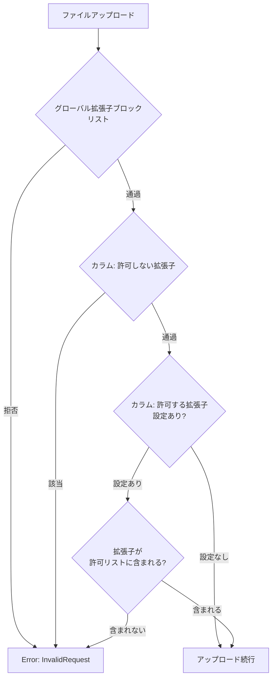
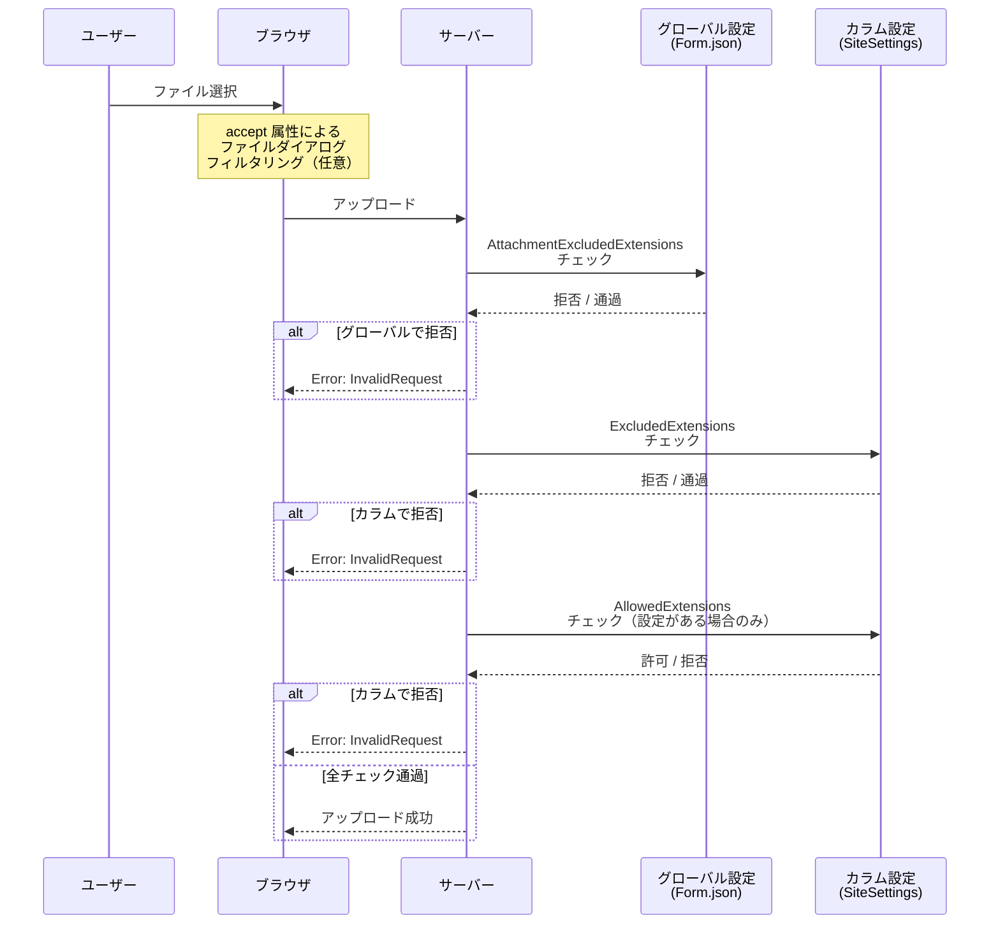

# 添付ファイル拡張子制限の実装方法

添付ファイル項目のカラム詳細設定に、拡張子の許可・拒否リストを追加する方法を調査する。入力 UI にはバスケットコントロール（入力した文字列がタグ状のボタンになり、個別にクリックで削除できる UI）を採用する。

<!-- START doctoc generated TOC please keep comment here to allow auto update -->
<!-- DON'T EDIT THIS SECTION, INSTEAD RE-RUN doctoc TO UPDATE -->

- [調査情報](#調査情報)
- [調査目的](#調査目的)
- [現行の拡張子制限の仕組み](#現行の拡張子制限の仕組み)
    - [グローバル拡張子ブロックリスト](#グローバル拡張子ブロックリスト)
    - [バリデーションロジック](#バリデーションロジック)
    - [呼び出し箇所](#呼び出し箇所)
    - [制限事項](#制限事項)
- [既存の添付ファイルカラム詳細設定](#既存の添付ファイルカラム詳細設定)
    - [現行の設定項目一覧](#現行の設定項目一覧)
- [カラム単位の拡張子制限を追加する実装方針](#カラム単位の拡張子制限を追加する実装方針)
    - [全体設計](#全体設計)
    - [1. Column クラスへのプロパティ追加](#1-column-クラスへのプロパティ追加)
    - [2. SiteSettings のカラム保存ロジック追加](#2-sitesettings-のカラム保存ロジック追加)
    - [3. カラム詳細エディタ UI の追加](#3-カラム詳細エディタ-ui-の追加)
    - [4. バスケットコントロール（タグ入力 UI）](#4-バスケットコントロールタグ入力-ui)
    - [5. フロントエンド JavaScript の追加](#5-フロントエンド-javascript-の追加)
    - [6. バリデーションロジックの拡張](#6-バリデーションロジックの拡張)
    - [7. フロントエンド accept 属性によるフィルタリング](#7-フロントエンド-accept-属性によるフィルタリング)
    - [8. 多言語対応](#8-多言語対応)
- [改修対象ファイル一覧](#改修対象ファイル一覧)
- [バリデーション優先順位](#バリデーション優先順位)
- [許可リストと拒否リストの動作仕様](#許可リストと拒否リストの動作仕様)
- [結論](#結論)
- [関連ソースコード](#関連ソースコード)
- [関連リンク](#関連リンク)

<!-- END doctoc generated TOC please keep comment here to allow auto update -->

## 調査情報

| 調査日     | リポジトリ | ブランチ        | タグ/バージョン    | コミット    | 備考                                   |
| ---------- | ---------- | --------------- | ------------------ | ----------- | -------------------------------------- |
| 2026-03-02 | Pleasanter | (detached HEAD) | Pleasanter_1.5.1.0 | `34f162a43` | 添付ファイル拡張子制限の実装方法を調査 |

## 調査目的

- 添付ファイル項目のカラム詳細設定に、ファイル拡張子の許可・拒否を設定できる仕組みを追加する方法を明らかにする
- 現行のグローバル拡張子ブロックリスト（`Form.json`）に加え、カラム単位で拡張子を制御する設計を検討する
- UI として「入力したワードがタグ状のボタンになり、個別に削除できる」バスケットコントロールの流用可否を確認する

---

## 現行の拡張子制限の仕組み

### グローバル拡張子ブロックリスト

現行の拡張子制限はサーバーパラメータ `Form.json` で**グローバルに**定義されている。

**ファイル**: `Implem.ParameterAccessor/Parts/Form.cs`

```csharp
public class Form
{
    public bool Enabled;
    public HashSet<string> AttachmentExcludedExtensions;
}
```

**ファイル**: `App_Data/Parameters/Form.json`

```json
{
    "Enabled": false,
    "AttachmentExcludedExtensions": [
        ".exe",
        ".dll",
        ".com",
        ".scr",
        ".pif",
        ".msi",
        ".msp",
        ".bat",
        ".cmd",
        ".ps1",
        ".vbs",
        ".vbe",
        ".js",
        ".jse",
        ".wsf",
        ".wsh",
        ".aspx",
        ".asp",
        ".php",
        ".php3",
        ".php4",
        ".php5",
        ".phtml",
        ".jsp",
        ".jspx",
        ".cfm",
        ".cfc",
        ".hta",
        ".htaccess",
        ".htpasswd",
        ".config",
        ".cer",
        ".sh",
        ".bash",
        ".csh",
        ".ksh",
        ".pl",
        ".py",
        ".rb",
        ".jar",
        ".war"
    ]
}
```

`Form.Enabled` が `false`（デフォルト）の場合、拡張子バリデーションは無効である。

### バリデーションロジック

**ファイル**: `Implem.Pleasanter/Models/Binaries/BinaryValidators.cs`（627-652 行）

```csharp
public static bool IsAllowedExtension(string fileName)
{
    if (string.IsNullOrEmpty(fileName)) return false;
    var firstDotIndex = fileName.IndexOf('.');
    if (firstDotIndex < 0) return true;
    var parts = fileName[firstDotIndex..].Split('.');
    foreach (var part in parts)
    {
        if (string.IsNullOrEmpty(part)) continue;
        var extension = "." + part;
        if (Parameters.Form.AttachmentExcludedExtensions.Contains(extension))
            return false;
    }
    return true;
}
```

特徴:

- ブロックリスト方式（拒否リストに含まれていれば拒否）
- 複合拡張子対応（`file.tar.gz` の場合、`.tar` と `.gz` の両方をチェック）
- カラム情報を参照しない（グローバル設定のみ参照）

### 呼び出し箇所

`IsAllowedExtension` は `OnValidatingFormUpload` メソッドから呼び出される。

**ファイル**: `Implem.Pleasanter/Models/Binaries/BinaryValidators.cs`（657-708 行）

```csharp
public static Error.Types OnValidatingFormUpload(
    Context context,
    string[] uuids,
    string[] fileUuid,
    string[] fileNames)
{
    // ... UUID バリデーション ...
    if (fileNames != null)
    {
        foreach (var fileName in fileNames)
        {
            if (!IsValidFileName(fileName) || !IsAllowedExtension(fileName))
                return Error.Types.InvalidRequest;
        }
    }
    if (context.PostedFiles != null)
    {
        foreach (var file in context.PostedFiles)
        {
            if (!IsValidFileName(file.FileName) || !IsAllowedExtension(file.FileName))
                return Error.Types.InvalidRequest;
        }
    }
    return Error.Types.None;
}
```

### 制限事項

| 項目           | 内容                                                        |
| -------------- | ----------------------------------------------------------- |
| 制御粒度       | グローバルのみ（全サイト・全カラム共通）                    |
| デフォルト状態 | `Form.Enabled = false` で無効                               |
| 方式           | ブロックリスト（拒否リスト）のみ、許可リスト方式は未対応    |
| カラム個別設定 | 不可（Column プロパティに拡張子関連の設定項目が存在しない） |

---

## 既存の添付ファイルカラム詳細設定

添付ファイルカラムの詳細設定は `SiteUtilities.cs` で描画される。`ControlType == "Attachments"` の場合にのみ表示される設定項目群である。

**ファイル**: `Implem.Pleasanter/Models/Sites/SiteUtilities.cs`（8114-8204 行）

```csharp
case "Attachments":
    var provider = BinaryUtilities.BinaryStorageProvider(column: column);
    hb
        .FieldCheckBox(controlId: "AllowDeleteAttachments", ...)
        .FieldCheckBox(controlId: "NotDeleteExistHistory", ...)
        .FieldDropDown(controlId: "BinaryStorageProvider", ...)
        .FieldCheckBox(controlId: "OverwriteSameFileName", ...)
        .FieldSpinner(controlId: "LimitQuantity", ...)
        .FieldSpinner(controlId: "LimitSize", ...)
        .FieldSpinner(controlId: "LimitTotalSize", ...)
        .FieldSpinner(controlId: "LocalFolderLimitSize", ...)
        .FieldSpinner(controlId: "LocalFolderLimitTotalSize", ...);
    break;
```

### 現行の設定項目一覧

| 設定項目                   | controlId                 | 型       | 説明                                  |
| -------------------------- | ------------------------- | -------- | ------------------------------------- |
| 添付ファイル削除の許可     | AllowDeleteAttachments    | CheckBox | 添付ファイルの削除を許可するかどうか  |
| 既存履歴の削除禁止         | NotDeleteExistHistory     | CheckBox | 既存の履歴を削除禁止にするかどうか    |
| バイナリ保存先             | BinaryStorageProvider     | DropDown | DataBase / LocalFolder / Auto         |
| 同名ファイルの上書き       | OverwriteSameFileName     | CheckBox | 同名ファイルをアップロード時に上書き  |
| 添付ファイル数上限         | LimitQuantity             | Spinner  | 添付可能なファイル数の上限            |
| ファイルサイズ上限         | LimitSize                 | Spinner  | 1 ファイルあたりのサイズ上限（MB）    |
| 合計サイズ上限             | LimitTotalSize            | Spinner  | カラム合計のサイズ上限（MB）          |
| ローカルフォルダサイズ上限 | LocalFolderLimitSize      | Spinner  | ローカル保存時の 1 ファイルサイズ上限 |
| ローカルフォルダ合計上限   | LocalFolderLimitTotalSize | Spinner  | ローカル保存時の合計サイズ上限        |

---

## カラム単位の拡張子制限を追加する実装方針

### 全体設計

カラム詳細設定に「許可する拡張子」「許可しない拡張子」の 2 つの設定を追加する。拡張子の入力にはプリザンター既存のバスケットコントロール（タグ入力 UI）を活用する。



### 1. Column クラスへのプロパティ追加

**ファイル**: `Implem.Pleasanter/Libraries/Settings/Column.cs`

```csharp
// 既存プロパティ（139行付近）の後に追加
public bool? AllowDeleteAttachments;    // 既存
public bool? NotDeleteExistHistory;     // 既存
public bool? AllowImage;                // 既存
public HashSet<string> AllowedExtensions;       // 追加: 許可する拡張子
public HashSet<string> ExcludedExtensions;      // 追加: 許可しない拡張子
```

`HashSet<string>` 型にすることで、`Contains` メソッドによる O(1) の拡張子チェックが可能になる。JSON シリアライズ/デシリアライズにも対応している。

### 2. SiteSettings のカラム保存ロジック追加

**ファイル**: `Implem.Pleasanter/Libraries/Settings/SiteSettings.cs`

既存のカラム保存ロジック（1729 行付近）に拡張子設定の保存処理を追加する。

```csharp
// 既存の添付ファイル設定保存処理の後に追加
if (column.AllowedExtensions?.Any() == true)
{
    newColumn.AllowedExtensions = column.AllowedExtensions;
}
if (column.ExcludedExtensions?.Any() == true)
{
    newColumn.ExcludedExtensions = column.ExcludedExtensions;
}
```

### 3. カラム詳細エディタ UI の追加

**ファイル**: `Implem.Pleasanter/Models/Sites/SiteUtilities.cs`（8128-8204 行付近）

既存の `case "Attachments":` ブロックの末尾（`LocalFolderLimitTotalSize` の後、`break;` の前）に拡張子設定 UI を追加する。

```csharp
// 許可する拡張子（バスケットコントロール）
.FieldBasket(
    controlId: "AllowedExtensions",
    fieldCss: "field-wide",
    controlCss: "control-basket cf",
    labelAction: () => hb
        .Text(text: Displays.AllowedExtensions(context: context)))
.FieldTextBox(
    textType: HtmlTypes.TextTypes.Normal,
    controlId: "AllowedExtensionsInput",
    fieldCss: "field-wide",
    labelText: string.Empty,
    text: string.Empty,
    placeholder: ".pdf",
    action: "AddAllowedExtension",
    method: "post")
// 許可しない拡張子（バスケットコントロール）
.FieldBasket(
    controlId: "ExcludedExtensions",
    fieldCss: "field-wide",
    controlCss: "control-basket cf",
    labelAction: () => hb
        .Text(text: Displays.ExcludedExtensions(context: context)))
.FieldTextBox(
    textType: HtmlTypes.TextTypes.Normal,
    controlId: "ExcludedExtensionsInput",
    fieldCss: "field-wide",
    labelText: string.Empty,
    text: string.Empty,
    placeholder: ".exe",
    action: "AddExcludedExtension",
    method: "post")
```

### 4. バスケットコントロール（タグ入力 UI）

プリザンターには既存のバスケットコントロールがあり、これを拡張子入力に流用する。

**ファイル**: `Implem.PleasanterFrontend/wwwroot/src/scripts/generals/basket.js`

```javascript
$p.addBasket = function ($control, text, value) {
    var $li = $('<li/>');
    if (value !== undefined) {
        $li.attr('data-value', value);
    }
    $li.addClass('ui-widget-content ui-selectee')
        .append($('<span/>').text(text))
        .append($('<span/>').addClass('ui-icon ui-icon-close delete'));
    $control.append($li);
    $p.setData($control);
};
```

**ファイル**: `Implem.PleasanterFrontend/wwwroot/src/scripts/generals/basketevents.js`

```javascript
$(function () {
    $(document).on('click', '.control-basket > li > .delete', function () {
        var $control = $(this).closest('ol');
        $(this).parent().remove();
        $p.setData($control);
    });
});
```

バスケットコントロールの動作:

1. テキストボックスに拡張子（例: `.pdf`）を入力して Enter を押す
2. 入力した拡張子がタグ状のボタンとして表示される
3. 各タグの右側にある「x」アイコンをクリックすると、そのタグが削除される
4. 複数の拡張子を追加・削除できる


### 5. フロントエンド JavaScript の追加

テキスト入力からバスケットに拡張子を追加するロジックを追加する。

```javascript
// 拡張子入力をバスケットに追加するハンドラ
$p.addExtensionToBasket = function (inputId, basketId) {
    var $input = $('#' + inputId);
    var extension = $input.val().trim().toLowerCase();
    // バリデーション: ドットで始まること
    if (!extension.startsWith('.')) {
        extension = '.' + extension;
    }
    // 重複チェック
    var exists = false;
    $('#' + basketId + ' li').each(function () {
        if ($(this).find('span:first').text() === extension) {
            exists = true;
            return false;
        }
    });
    if (!exists && extension.length > 1) {
        $p.addBasket($('#' + basketId), extension, extension);
    }
    $input.val('');
};
```

### 6. バリデーションロジックの拡張

**ファイル**: `Implem.Pleasanter/Models/Binaries/BinaryValidators.cs`

既存の `IsAllowedExtension` メソッドを拡張し、カラム情報を受け取るオーバーロードを追加する。

```csharp
/// <summary>
/// カラム単位の拡張子制限を含むバリデーション
/// </summary>
public static bool IsAllowedExtension(string fileName, Column column)
{
    // 1. グローバルブロックリストチェック（既存ロジック）
    if (!IsAllowedExtension(fileName))
    {
        return false;
    }
    // 2. カラム単位の拡張子チェック
    if (column == null) return true;
    var firstDotIndex = fileName.IndexOf('.');
    if (firstDotIndex < 0) return true;
    var parts = fileName[firstDotIndex..].Split('.');
    foreach (var part in parts)
    {
        if (string.IsNullOrEmpty(part)) continue;
        var extension = "." + part.ToLower();
        // 2a. カラムの拒否リストチェック
        if (column.ExcludedExtensions?.Contains(extension) == true)
        {
            return false;
        }
        // 2b. カラムの許可リストチェック（設定がある場合のみ）
        if (column.AllowedExtensions?.Any() == true
            && !column.AllowedExtensions.Contains(extension))
        {
            return false;
        }
    }
    return true;
}
```

### 7. フロントエンド accept 属性によるフィルタリング

HTML5 の `<input type="file">` には `accept` 属性があり、ファイル選択ダイアログで表示するファイルの種類を制限できる。カラムの `AllowedExtensions` が設定されている場合、この属性を動的に設定する。

**ファイル**: `Implem.Pleasanter/Libraries/HtmlParts/HtmlControls.cs`（1053-1057 行）

現行の添付ファイル用 `<input type="file">` には `accept` 属性が設定されていない。

```csharp
// 現行コード
.Input(attributes: new HtmlAttributes()
    .Id(columnName + ".input")
    .Class("hidden")
    .Type("file")
    .Multiple(true))
```

`AllowedExtensions` が設定されている場合に `accept` 属性を追加する。

```csharp
// 改修後
.Input(attributes: new HtmlAttributes()
    .Id(columnName + ".input")
    .Class("hidden")
    .Type("file")
    .Multiple(true)
    .Accept(column?.AllowedExtensions?.Any() == true
        ? string.Join(",", column.AllowedExtensions)
        : null))
```

`accept` 属性はあくまでブラウザ側のヒントであり、ユーザーが「すべてのファイル」を選択することで回避できる。そのため、サーバー側のバリデーションは必須である。

### 8. 多言語対応

**ファイル**: `App_Data/Displays/` 配下の各言語ファイルに表示文字列を追加する。

| キー               | 日本語           | 英語                |
| ------------------ | ---------------- | ------------------- |
| AllowedExtensions  | 許可する拡張子   | Allowed Extensions  |
| ExcludedExtensions | 許可しない拡張子 | Excluded Extensions |

---

## 改修対象ファイル一覧

| #   | ファイル                                                               | 改修内容                                                 |
| --- | ---------------------------------------------------------------------- | -------------------------------------------------------- |
| 1   | `Libraries/Settings/Column.cs`                                         | `AllowedExtensions`・`ExcludedExtensions` プロパティ追加 |
| 2   | `Libraries/Settings/SiteSettings.cs`                                   | カラム保存ロジックに拡張子設定の保存・初期化追加         |
| 3   | `Models/Sites/SiteUtilities.cs`                                        | カラム詳細エディタに拡張子バスケット UI 追加             |
| 4   | `Models/Binaries/BinaryValidators.cs`                                  | カラム単位の拡張子バリデーション追加                     |
| 5   | `Libraries/HtmlParts/HtmlControls.cs`                                  | `accept` 属性の動的設定                                  |
| 6   | `PleasanterFrontend/.../scripts/generals/sitesettings.js` (または新規) | 拡張子入力のバスケット追加ハンドラ                       |
| 7   | `Models/Sites/ApiSiteSettings/ColumnApiSettingModel.cs`                | API 用モデルにプロパティ追加                             |
| 8   | `App_Data/Displays/` 配下                                              | 多言語表示文字列追加                                     |

---

## バリデーション優先順位

拡張子チェックは以下の優先順位で適用される。



---

## 許可リストと拒否リストの動作仕様

| 設定状態                                | 動作                                             |
| --------------------------------------- | ------------------------------------------------ |
| 両方とも未設定                          | グローバル設定のみ適用（現行動作と同一）         |
| 許可リストのみ設定                      | リストに含まれる拡張子のみアップロード可能       |
| 拒否リストのみ設定                      | リストに含まれる拡張子はアップロード不可         |
| 両方設定                                | 拒否リストを先に評価し、次に許可リストで絞り込む |
| 許可リスト: `.pdf` / 拒否リスト: `.pdf` | 拒否リストが優先され、`.pdf` はアップロード不可  |

---

## 結論

| 項目                   | 内容                                                                         |
| ---------------------- | ---------------------------------------------------------------------------- |
| 実現可否               | 実現可能                                                                     |
| Column プロパティ      | `AllowedExtensions`（許可リスト）と `ExcludedExtensions`（拒否リスト）を追加 |
| UI                     | 既存のバスケットコントロール（タグ入力 UI）を流用可能                        |
| バリデーション         | サーバー側で必須、ブラウザ側 `accept` 属性は補助的に使用                     |
| グローバル設定との関係 | グローバル設定（`Form.json`）を先に評価し、カラム設定で追加制御              |
| 改修ファイル数         | 8 ファイル                                                                   |
| CodeDefiner の影響     | Column.cs は CodeDefiner による自動生成対象ではないため影響なし              |

## 関連ソースコード

| ファイル                                                                 | 概要                           |
| ------------------------------------------------------------------------ | ------------------------------ |
| `Implem.Pleasanter/Libraries/Settings/Column.cs`                         | カラム設定クラス               |
| `Implem.Pleasanter/Libraries/Settings/SiteSettings.cs`                   | サイト設定の保存・初期化       |
| `Implem.Pleasanter/Models/Sites/SiteUtilities.cs`                        | カラム詳細エディタ UI 描画     |
| `Implem.Pleasanter/Models/Binaries/BinaryValidators.cs`                  | アップロードバリデーション     |
| `Implem.Pleasanter/Libraries/HtmlParts/HtmlControls.cs`                  | HTML コントロール描画          |
| `Implem.Pleasanter/Libraries/HtmlParts/HtmlFields.cs`                    | FieldBasket / FieldAttachments |
| `Implem.PleasanterFrontend/wwwroot/src/scripts/generals/basket.js`       | バスケットコントロール JS      |
| `Implem.PleasanterFrontend/wwwroot/src/scripts/generals/basketevents.js` | バスケットイベントハンドラ     |
| `Implem.PleasanterFrontend/wwwroot/src/scripts/generals/attachments.js`  | 添付ファイルアップロード JS    |
| `Implem.ParameterAccessor/Parts/Form.cs`                                 | グローバル Form パラメータ     |
| `App_Data/Parameters/Form.json`                                          | グローバル拡張子ブロックリスト |

## 関連リンク

- [添付ファイルのウイルススキャン手法](001-添付ファイルウイルススキャン.md)
- [添付ファイルウイルススキャン実装行程](002-添付ファイルウイルススキャン実装行程.md)
