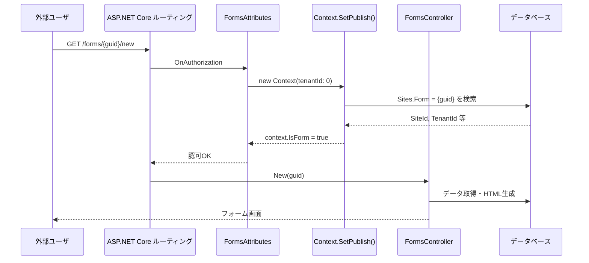
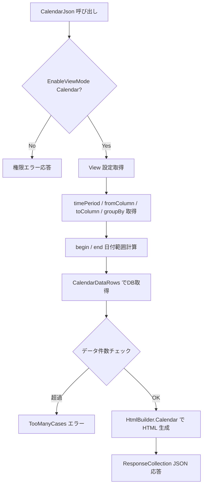
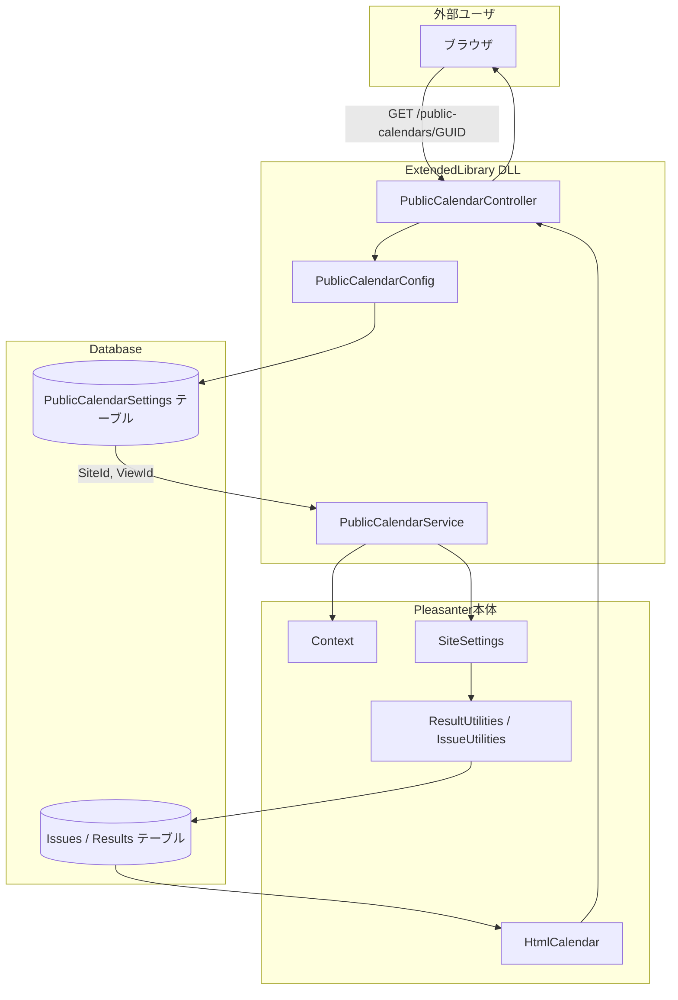
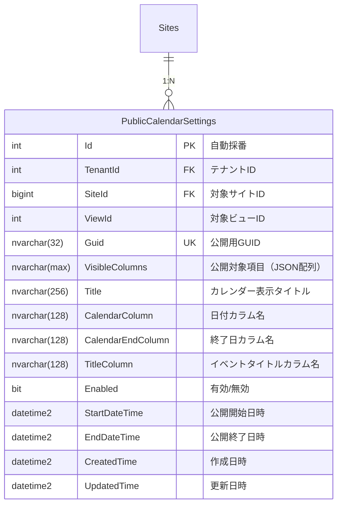
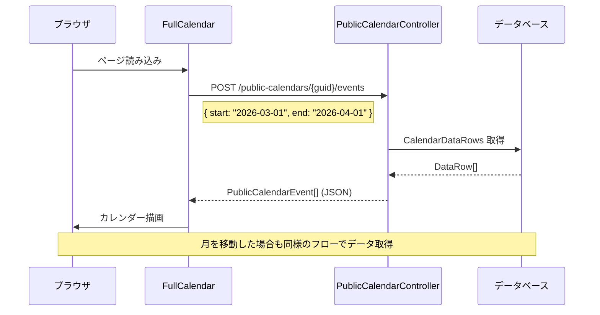

# 拡張ライブラリによる外部公開カレンダーの実装設計

拡張ライブラリ（ExtendedLibrary）機能を使用して、認証不要で外部公開可能なカレンダービューを提供する方法を設計した。

<!-- START doctoc generated TOC please keep comment here to allow auto update -->
<!-- DON'T EDIT THIS SECTION, INSTEAD RE-RUN doctoc TO UPDATE -->

- [調査情報](#調査情報)
- [調査目的](#調査目的)
- [前提知識: フォーム機能の GUID ベース公開パターン](#前提知識-フォーム機能の-guid-ベース公開パターン)
    - [フォーム機能のアーキテクチャ](#フォーム機能のアーキテクチャ)
    - [GUID の管理方法](#guid-の管理方法)
    - [Context による認可フロー](#context-による認可フロー)
    - [フォーム機能の Controller と Filter](#フォーム機能の-controller-と-filter)
- [前提知識: カレンダービューの実装](#前提知識-カレンダービューの実装)
    - [カレンダーの種類](#カレンダーの種類)
    - [カレンダーデータの取得フロー](#カレンダーデータの取得フロー)
    - [カレンダーイベントのデータ構造](#カレンダーイベントのデータ構造)
- [拡張ライブラリによる外部公開カレンダーの設計](#拡張ライブラリによる外部公開カレンダーの設計)
    - [設計方針](#設計方針)
    - [全体アーキテクチャ](#全体アーキテクチャ)
- [URL 設計](#url-設計)
    - [エンドポイント一覧](#エンドポイント一覧)
    - [GUID の仕様](#guid-の仕様)
- [データベース設計](#データベース設計)
    - [PublicCalendarSettings テーブル](#publiccalendarsettings-テーブル)
    - [カラム詳細](#カラム詳細)
    - [VisibleColumns の形式](#visiblecolumns-の形式)
- [Controller 実装設計](#controller-実装設計)
    - [プロジェクト構成](#プロジェクト構成)
    - [ExtendedLibrary.cs（初期化処理）](#extendedlibrarycs初期化処理)
    - [PublicCalendarController](#publiccalendarcontroller)
    - [リクエスト / レスポンスモデル](#リクエスト--レスポンスモデル)
- [サービス層の実装設計](#サービス層の実装設計)
    - [Context の生成](#context-の生成)
    - [カレンダーデータの取得](#カレンダーデータの取得)
    - [公開対象項目のフィルタリング](#公開対象項目のフィルタリング)
- [フロントエンド実装設計](#フロントエンド実装設計)
    - [FullCalendar を用いた描画](#fullcalendar-を用いた描画)
    - [イベントデータの受け渡し](#イベントデータの受け渡し)
- [セキュリティ設計](#セキュリティ設計)
    - [GUID による推測防止](#guid-による推測防止)
    - [アクセス制御](#アクセス制御)
    - [公開アクセス可否判定](#公開アクセス可否判定)
    - [情報漏洩防止](#情報漏洩防止)
    - [レート制限](#レート制限)
- [管理 API の設計](#管理-api-の設計)
    - [管理用エンドポイント](#管理用エンドポイント)
    - [設定作成リクエスト例](#設定作成リクエスト例)
    - [設定作成レスポンス例](#設定作成レスポンス例)
- [iCalendar 形式対応](#icalendar-形式対応)
    - [iCalendar エクスポート](#icalendar-エクスポート)
- [実装手順](#実装手順)
    - [Phase 1: 基盤構築](#phase-1-基盤構築)
    - [Phase 2: フロントエンド](#phase-2-フロントエンド)
    - [Phase 3: 管理機能](#phase-3-管理機能)
    - [Phase 4: セキュリティ強化](#phase-4-セキュリティ強化)
    - [Phase 5: 追加機能](#phase-5-追加機能)
- [結論](#結論)
- [関連ソースコード](#関連ソースコード)
- [関連リンク](#関連リンク)

<!-- END doctoc generated TOC please keep comment here to allow auto update -->

## 調査情報

| 調査日        | リポジトリ | ブランチ | タグ/バージョン    | コミット    | 備考     |
| ------------- | ---------- | -------- | ------------------ | ----------- | -------- |
| 2026年3月10日 | Pleasanter | main     | Pleasanter_1.5.1.0 | `34f162a43` | 初回調査 |

## 調査目的

- 拡張ライブラリを用いて、認証なしでアクセス可能な外部公開カレンダーを実現する
- サイトID・ビューID・公開対象項目を指定できる設計とする
- フォーム機能と同様にGUID ベースの URL で推測されにくいアクセス経路を提供する

---

## 前提知識: フォーム機能の GUID ベース公開パターン

拡張ライブラリで同等の仕組みを構築するにあたり、プリザンター本体のフォーム機能が採用している GUID ベースの公開パターンを整理する。

### フォーム機能のアーキテクチャ

フォーム機能は、認証なしで外部ユーザにレコード作成画面を公開する仕組みである。以下の要素で構成される。



### GUID の管理方法

フォーム機能では、Sites テーブルの `Form` カラム（`nvarchar(32)`）に GUID を格納する。

**ファイル**: `Implem.Pleasanter/App_Data/Definitions/Definition_Column/Sites_Form.json`

| 項目         | 値         |
| ------------ | ---------- |
| カラム名     | `Form`     |
| データ型     | `nvarchar` |
| 最大長       | 32         |
| Null許容     | Yes        |
| インデックス | Ix4        |

GUID は 32 文字の 16 進数文字列（ハイフンなし）として格納される。ルート制約でも `[A-Fa-f0-9]{32}` で検証される。

**ファイル**: `Implem.Pleasanter/Startup.cs`（行番号: 461-475）

```csharp
endpoints.MapControllerRoute(
    name: "FormBinaries",
    pattern: "{reference}/{guid}/{controller}/{action}",
    defaults: new { Reference = "Forms" },
    constraints: new
    {
        Reference = "[A-Za-z][A-Za-z0-9_]*",
        Guid = "[A-Fa-f0-9]{32}",
        Controller = "FormBinaries",
        Action = "[A-Za-z][A-Za-z]*"
    });
```

### Context による認可フロー

`Context.SetPublish()` メソッドで、コントローラ名に応じた認可処理を行う。

**ファイル**: `Implem.Pleasanter/Libraries/Requests/Context.cs`（行番号: 633-660）

```csharp
public void SetPublish()
{
    if (!HasRoute) return;
    switch (Controller)
    {
        case "forms":
        case "formbinaries":
            TrySetupController(
                extensionKey: "Form",
                validator: dr => !dr.String("Form").IsNullOrEmpty(),
                specificAction: dr =>
                {
                    Id = dr.Int("SiteId");
                    IsForm = true;
                });
            break;
    }
}
```

`TrySetupController` 内では `IsExtensionAllowed` メソッドにより、`Parameters.Form.Enabled` またはテナントの `ContractSettings.Extensions` で機能の有効性を検証する。

**ファイル**: `Implem.Pleasanter/Libraries/Requests/Context.cs`（行番号: 678-685）

```csharp
bool IsExtensionAllowed(string extensionKey, ContractSettings cs)
{
    if (extensionKey == "Form")
    {
        return Parameters.Form.Enabled == true || cs.Extensions.Get(extensionKey);
    }
    return cs.Extensions.Get(extensionKey);
}
```

### フォーム機能の Controller と Filter

FormsController は `[AllowAnonymous]` と専用フィルタ `[FormsAttributes]` で保護される。

**ファイル**: `Implem.Pleasanter/Controllers/FormsController.cs`（行番号: 1-15）

```csharp
[AllowAnonymous]
[FormsAttributes]
[ConditionalValidateAntiForgeryToken]
public class FormsController : Controller
{
    // GET/POST /forms/{guid}/new
    public ActionResult New(string guid) { ... }

    // POST /forms/{guid}/create
    public async Task<string> Create(string guid) { ... }
}
```

**ファイル**: `Implem.Pleasanter/Filters/FormsAttributes.cs`

```csharp
public class FormsAttributes : ActionFilterAttribute, IAuthorizationFilter
{
    public void OnAuthorization(AuthorizationFilterContext filterContext)
    {
        var context = new Context(tenantId: 0);
        if (!context.IsForm)
        {
            filterContext.Result = new RedirectResult(
                Locations.BadRequest(context: context));
        }
    }
}
```

---

## 前提知識: カレンダービューの実装

### カレンダーの種類

プリザンターには 2 種類のカレンダーが存在する。

| 種類         | 値                                 | レンダリング方式              | ライブラリ          |
| ------------ | ---------------------------------- | ----------------------------- | ------------------- |
| Standard     | `CalendarTypes.Standard (= 1)`     | サーバサイド HTML テーブル    | 独自実装            |
| FullCalendar | `CalendarTypes.FullCalendar (= 2)` | クライアントサイド JavaScript | FullCalendar v6.1.8 |

**ファイル**: `Implem.Pleasanter/Libraries/Settings/SiteSettings.cs`（行番号: 67-71）

```csharp
public enum CalendarTypes : int
{
    Standard = 1,
    FullCalendar = 2
}
```

### カレンダーデータの取得フロー

`CalendarJson` メソッドがカレンダーデータを JSON で返す。Issues テーブルと Results テーブルの両方に同等の実装がある。

**ファイル**: `Implem.Pleasanter/Models/Results/ResultUtilities.cs`（行番号: 8498-8642）



主要な処理ステップは以下の通り。

1. **View 設定の取得**: セッションから View オブジェクトを取得し、カレンダー表示に必要なカラム（fromColumn / toColumn）、表示期間（timePeriod）、グループ化カラム（groupBy）を決定する
2. **日付範囲の計算**: `Calendars.BeginDate()` / `Calendars.EndDate()` で表示範囲を計算する
3. **データの取得**: `CalendarDataRows()` で指定範囲のレコードを取得する
4. **HTML の生成**: `HtmlCalendar.Calendar()` でカレンダー HTML を組み立てる

### カレンダーイベントのデータ構造

Standard カレンダーと FullCalendar でデータモデルが異なる。

**ファイル**: `Implem.Pleasanter/Libraries/ViewModes/FullCalendarElement.cs`

```csharp
public class FullCalendarElement
{
    public long id;
    public long siteId;
    public string title;
    public string time;
    public string DateFormat;
    public DateTime start;
    public DateTime? end;
    public bool? Changed;
    public string StatusHtml;
}
```

**ファイル**: `Implem.Pleasanter/Libraries/ViewModes/CalendarElement.cs`

```csharp
public class CalendarElement
{
    public long Id;
    public long SiteId;
    public string Title;
    public string Time;
    public string DateFormat;
    public DateTime From;
    public DateTime? To;
    public bool? Changed;
    public string StatusHtml;
}
```

| プロパティ | CalendarElement | FullCalendarElement | 用途           |
| ---------- | --------------- | ------------------- | -------------- |
| ID         | `Id` (Pascal)   | `id` (camel)        | レコード ID    |
| サイト     | `SiteId`        | `siteId`            | サイト ID      |
| タイトル   | `Title`         | `title`             | 表示タイトル   |
| 開始日     | `From`          | `start`             | イベント開始日 |
| 終了日     | `To`            | `end`               | イベント終了日 |
| 状態HTML   | `StatusHtml`    | `StatusHtml`        | ステータス表示 |

---

## 拡張ライブラリによる外部公開カレンダーの設計

### 設計方針

フォーム機能のパターンを踏襲しつつ、拡張ライブラリとして独立した実装とする。

| 項目           | フォーム機能            | 外部公開カレンダー（本設計）     |
| -------------- | ----------------------- | -------------------------------- |
| URL パターン   | `/forms/{guid}/new`     | `/public-calendars/{guid}`       |
| GUID 格納先    | Sites.Form カラム       | 専用設定テーブル（拡張側で管理） |
| 認証           | 不要（AllowAnonymous）  | 不要（AllowAnonymous）           |
| コントローラ   | FormsController（本体） | PublicCalendarController（拡張） |
| データソース   | サイト設定に従う        | サイトID + ビューID で指定       |
| 公開対象の制御 | サイト単位              | 項目単位で指定可能               |

### 全体アーキテクチャ



---

## URL 設計

### エンドポイント一覧

| メソッド | URL パターン                          | 説明                         |
| -------- | ------------------------------------- | ---------------------------- |
| GET      | `/public-calendars/{guid}`            | カレンダー HTML 画面         |
| POST     | `/public-calendars/{guid}/events`     | カレンダーイベント JSON 取得 |
| GET      | `/public-calendars/{guid}/events.ics` | iCalendar 形式エクスポート   |

### GUID の仕様

フォーム機能と同様に、32 文字の 16 進数文字列（ハイフンなし）を使用する。

```csharp
// GUID 生成例
var guid = Guid.NewGuid().ToString("N"); // "a1b2c3d4e5f6789abcdef0123456789a"
```

| 項目           | 仕様                            |
| -------------- | ------------------------------- |
| 形式           | 32 文字 16 進数（ハイフンなし） |
| 文字種         | `[a-f0-9]`（小文字に正規化）    |
| 格納先         | PublicCalendarSettings テーブル |
| 生成タイミング | 公開設定の作成時                |
| 一意性保証     | DB ユニーク制約                 |

---

## データベース設計

### PublicCalendarSettings テーブル

外部公開カレンダーの設定を管理する専用テーブルを拡張ライブラリ側で作成する。



### カラム詳細

| カラム名          | 型            | Null | 説明                                      |
| ----------------- | ------------- | ---- | ----------------------------------------- |
| Id                | int           | No   | 主キー（自動採番）                        |
| TenantId          | int           | No   | テナント ID                               |
| SiteId            | bigint        | No   | 対象サイト ID                             |
| ViewId            | int           | No   | 対象ビュー ID（0 = デフォルトビュー）     |
| Guid              | nvarchar(32)  | No   | 公開用 GUID（ユニーク制約）               |
| VisibleColumns    | nvarchar(max) | Yes  | 公開対象項目の JSON 配列                  |
| Title             | nvarchar(256) | Yes  | カレンダー表示タイトル                    |
| CalendarColumn    | nvarchar(128) | No   | 日付（開始）カラム名                      |
| CalendarEndColumn | nvarchar(128) | Yes  | 終了日カラム名（指定なし = 単日イベント） |
| TitleColumn       | nvarchar(128) | No   | イベントタイトルに使用するカラム名        |
| Enabled           | bit           | No   | 有効フラグ（デフォルト: 1）               |
| StartDateTime     | datetime2     | Yes  | 公開開始日時（null = 即時公開）           |
| EndDateTime       | datetime2     | Yes  | 公開終了日時（null = 無期限）             |
| CreatedTime       | datetime2     | No   | 作成日時                                  |
| UpdatedTime       | datetime2     | No   | 更新日時                                  |

### VisibleColumns の形式

公開対象項目を JSON 配列で指定する。指定されたカラムのみがカレンダーイベントの情報として外部に公開される。

```json
["Title", "DateA", "DateB", "ClassA", "Status"]
```

---

## Controller 実装設計

### プロジェクト構成

```text
Implem.Pleasanter.ExtendedLibrary.PublicCalendar/
  ├── ExtendedLibrary.cs          # 初期化（テーブル作成等）
  ├── Controllers/
  │   └── PublicCalendarController.cs
  ├── Models/
  │   ├── PublicCalendarSettingsModel.cs
  │   └── PublicCalendarEventModel.cs
  ├── Services/
  │   └── PublicCalendarService.cs
  └── Views/
      └── PublicCalendar/
          └── Index.cshtml
```

### ExtendedLibrary.cs（初期化処理）

拡張ライブラリのエントリポイント。初回起動時に設定テーブルを作成する。

```csharp
namespace Implem.Pleasanter.NetCore.ExtendedLibrary
{
    public static class ExtendedLibrary
    {
        public static void Initialize()
        {
            // PublicCalendarSettings テーブルの存在確認と作成
            EnsureTableExists();
        }

        private static void EnsureTableExists()
        {
            // CREATE TABLE IF NOT EXISTS に相当する処理
            // マイグレーション管理を含む
        }
    }
}
```

Pleasanter 本体は `Startup.cs` の起動処理で `ExtendedLibrary.Initialize()` を呼び出す。

**ファイル**: `Implem.Pleasanter/Startup.cs`（行番号: 293-302）

```csharp
foreach (var path in GetExtendedLibraryPaths())
{
    foreach (var assembly in Directory.GetFiles(path, "*.dll")
        .Select(dll => Assembly.LoadFrom(dll)).ToArray())
    {
        mvcBuilder.AddApplicationPart(assembly);
        assembly.GetType(
            "Implem.Pleasanter.NetCore.ExtendedLibrary.ExtendedLibrary")?
            .GetMethod("Initialize")?
            .Invoke(null, null);
    }
}
```

### PublicCalendarController

フォーム機能の `FormsController` と同様のパターンで、`[AllowAnonymous]` を付与した MVC Controller を実装する。

```csharp
using Microsoft.AspNetCore.Authorization;
using Microsoft.AspNetCore.Mvc;

namespace Implem.Pleasanter.ExtendedLibrary.PublicCalendar.Controllers
{
    [AllowAnonymous]
    [Route("public-calendars")]
    public class PublicCalendarController : Controller
    {
        /// <summary>
        /// カレンダー画面の表示
        /// GET /public-calendars/{guid}
        /// </summary>
        [HttpGet("{guid:regex([[a-fA-F0-9]]{{32}})}")]
        public ActionResult Index(string guid)
        {
            var settings = PublicCalendarService.GetSettings(guid);
            if (settings == null || !settings.IsAccessible())
            {
                return NotFound();
            }
            var context = PublicCalendarService.CreateContext(settings);
            var html = PublicCalendarService.BuildCalendarHtml(context, settings);
            return View("Index", html);
        }

        /// <summary>
        /// カレンダーイベントの JSON 取得
        /// POST /public-calendars/{guid}/events
        /// </summary>
        [HttpPost("{guid:regex([[a-fA-F0-9]]{{32}})}/events")]
        public ActionResult Events(
            string guid,
            [FromBody] CalendarEventsRequest request)
        {
            var settings = PublicCalendarService.GetSettings(guid);
            if (settings == null || !settings.IsAccessible())
            {
                return NotFound();
            }
            var context = PublicCalendarService.CreateContext(settings);
            var events = PublicCalendarService.GetEvents(
                context, settings, request.Start, request.End);
            return Json(events);
        }

        /// <summary>
        /// iCalendar 形式のエクスポート
        /// GET /public-calendars/{guid}/events.ics
        /// </summary>
        [HttpGet("{guid:regex([[a-fA-F0-9]]{{32}})}/events.ics")]
        public ActionResult ExportIcs(string guid)
        {
            var settings = PublicCalendarService.GetSettings(guid);
            if (settings == null || !settings.IsAccessible())
            {
                return NotFound();
            }
            var context = PublicCalendarService.CreateContext(settings);
            var icsContent = PublicCalendarService.GenerateIcs(context, settings);
            return File(
                System.Text.Encoding.UTF8.GetBytes(icsContent),
                "text/calendar",
                "calendar.ics");
        }
    }
}
```

### リクエスト / レスポンスモデル

```csharp
/// <summary>
/// イベント取得リクエスト
/// </summary>
public class CalendarEventsRequest
{
    public DateTime Start { get; set; }
    public DateTime End { get; set; }
}

/// <summary>
/// カレンダーイベント（公開用）
/// FullCalendar 互換形式
/// </summary>
public class PublicCalendarEvent
{
    public long Id { get; set; }
    public string Title { get; set; }
    public DateTime Start { get; set; }
    public DateTime? End { get; set; }
    public Dictionary<string, string> ExtendedProps { get; set; }
}
```

---

## サービス層の実装設計

### Context の生成

フォーム機能では `Context.SetPublish()` で `IsForm` フラグを設定し、テナント・サイト情報を解決している。
拡張ライブラリでは本体の `SetPublish` を経由せず、設定テーブルの情報から直接 Context を構築する。

```csharp
public static class PublicCalendarService
{
    /// <summary>
    /// 公開カレンダー用の Context を生成する。
    /// フォーム機能の Context 生成パターンを参考に、
    /// TenantId と SiteId を設定テーブルから取得して構築する。
    /// </summary>
    public static Context CreateContext(PublicCalendarSettingsModel settings)
    {
        var context = new Context(tenantId: settings.TenantId);
        // SiteSettings の取得に必要な最低限の情報を設定
        return context;
    }
}
```

### カレンダーデータの取得

本体の `CalendarDataRows` 相当の処理を、公開対象カラムのフィルタリングを加えて実装する。

```csharp
/// <summary>
/// カレンダーイベントを取得する。
/// 本体の CalendarJson メソッドのデータ取得部分を参考にしつつ、
/// VisibleColumns で指定された項目のみを返す。
/// </summary>
public static List<PublicCalendarEvent> GetEvents(
    Context context,
    PublicCalendarSettingsModel settings,
    DateTime start,
    DateTime end)
{
    // 1. SiteSettings を取得
    var ss = new SiteModel(
        context: context,
        siteId: settings.SiteId)
        .SiteSettings;

    // 2. View を構築（指定された ViewId から）
    var view = ss.Views?.FirstOrDefault(v => v.Id == settings.ViewId)
        ?? new View();

    // 3. 日付カラムの取得
    var fromColumn = ss.GetColumn(
        context: context,
        columnName: settings.CalendarColumn);
    var toColumn = !string.IsNullOrEmpty(settings.CalendarEndColumn)
        ? ss.GetColumn(context: context, columnName: settings.CalendarEndColumn)
        : null;

    // 4. データ取得（本体の CalendarDataRows 相当）
    var dataRows = GetCalendarDataRows(
        context: context,
        ss: ss,
        view: view,
        fromColumn: fromColumn,
        toColumn: toColumn,
        begin: start,
        end: end);

    // 5. 公開対象カラムでフィルタリングしてイベントに変換
    var visibleColumns = settings.GetVisibleColumnsList();
    var titleColumn = settings.TitleColumn;
    return dataRows.Select(row => new PublicCalendarEvent
    {
        Id = row.Long("Id"),
        Title = row.String(titleColumn),
        Start = row.DateTime(fromColumn.ColumnName),
        End = toColumn != null ? row.DateTime(toColumn.ColumnName) : null,
        ExtendedProps = BuildExtendedProps(row, visibleColumns, ss)
    }).ToList();
}
```

### 公開対象項目のフィルタリング

`VisibleColumns` に指定されたカラムのみを `ExtendedProps` として返す。これにより、サイトに登録された全カラムが外部に漏洩することを防ぐ。

```csharp
/// <summary>
/// 公開対象カラムの値を ExtendedProps として構築する。
/// VisibleColumns に含まれないカラムの値は返さない。
/// </summary>
private static Dictionary<string, string> BuildExtendedProps(
    DataRow row,
    List<string> visibleColumns,
    SiteSettings ss)
{
    var props = new Dictionary<string, string>();
    foreach (var columnName in visibleColumns)
    {
        var column = ss.GetColumn(columnName: columnName);
        if (column == null) continue;
        var value = row[column.ColumnName]?.ToString();
        if (!string.IsNullOrEmpty(value))
        {
            props[column.LabelText] = value;
        }
    }
    return props;
}
```

---

## フロントエンド実装設計

### FullCalendar を用いた描画

外部公開カレンダーでは FullCalendar ライブラリを使用してクライアントサイドで描画する。プリザンター本体が FullCalendar v6.1.8 を使用しているため、同じバージョンを採用する。

```html
<!DOCTYPE html>
<html lang="ja">
    <head>
        <meta charset="utf-8" />
        <title>@Model.Title</title>
        <link href="https://cdn.jsdelivr.net/npm/fullcalendar@6.1.8/index.global.min.css" rel="stylesheet" />
    </head>
    <body>
        <h1>@Model.Title</h1>
        <div id="calendar"></div>
        <script src="https://cdn.jsdelivr.net/npm/fullcalendar@6.1.8/index.global.min.js"></script>
        <script>
            document.addEventListener('DOMContentLoaded', function () {
                var calendarEl = document.getElementById('calendar');
                var calendar = new FullCalendar.Calendar(calendarEl, {
                    initialView: 'dayGridMonth',
                    locale: 'ja',
                    events: function (info, successCallback, failureCallback) {
                        fetch('@Model.EventsUrl', {
                            method: 'POST',
                            headers: { 'Content-Type': 'application/json' },
                            body: JSON.stringify({
                                start: info.startStr,
                                end: info.endStr,
                            }),
                        })
                            .then((response) => response.json())
                            .then((data) => successCallback(data))
                            .catch((error) => failureCallback(error));
                    },
                });
                calendar.render();
            });
        </script>
    </body>
</html>
```

### イベントデータの受け渡し

FullCalendar の `events` コールバックから `/public-calendars/{guid}/events` エンドポイントに POST リクエストを送信し、表示範囲のイベントデータを取得する。



---

## セキュリティ設計

### GUID による推測防止

| 対策               | 説明                                            |
| ------------------ | ----------------------------------------------- |
| 32 文字 16 進 GUID | 128bit のランダム値で推測困難（2^128 通り）     |
| 小文字正規化       | URL での大文字小文字差異による混乱を防止        |
| ユニーク制約       | DB レベルでの一意性保証                         |
| インデックス       | GUID カラムにインデックスを付与し検索性能を確保 |

### アクセス制御

| 対策              | 説明                                           |
| ----------------- | ---------------------------------------------- |
| 有効/無効フラグ   | Enabled = false で即座にアクセス遮断           |
| 公開期間制限      | StartDateTime / EndDateTime による期間限定公開 |
| 公開項目制限      | VisibleColumns で指定されたカラムのみ返却      |
| View フィルタ適用 | 指定された ViewId のフィルタ条件を適用         |

### 公開アクセス可否判定

```csharp
public bool IsAccessible()
{
    if (!Enabled) return false;
    var now = DateTime.UtcNow;
    if (StartDateTime.HasValue && now < StartDateTime.Value) return false;
    if (EndDateTime.HasValue && now > EndDateTime.Value) return false;
    return true;
}
```

### 情報漏洩防止

外部公開カレンダーでは以下の情報を返さない。

| 項目                    | 理由                                             |
| ----------------------- | ------------------------------------------------ |
| レコード ID             | 内部情報の推測防止（公開用にはハッシュ化を検討） |
| VisibleColumns 以外の値 | 意図しない項目の漏洩防止                         |
| ユーザ情報              | 作成者・更新者情報の漏洩防止                     |
| サイト設定              | SiteSettings の内部構造の漏洩防止                |
| エラー詳細              | スタックトレース等の内部情報の漏洩防止           |

### レート制限

外部公開エンドポイントに対するレート制限を検討する。フォーム投稿でのレート制限の調査結果（`14-セキュリティ/004-フォーム投稿へのレートリミッター適用.md`）を参考に、`AspNetCoreRateLimit` ライブラリの導入を推奨する。

---

## 管理 API の設計

### 管理用エンドポイント

外部公開カレンダーの設定を管理するための API を、認証付きで提供する。

| メソッド | URL パターン                         | 説明                      | 認証     |
| -------- | ------------------------------------ | ------------------------- | -------- |
| GET      | `/api/public-calendar-settings`      | 設定一覧取得              | API キー |
| POST     | `/api/public-calendar-settings`      | 設定作成（GUID 自動生成） | API キー |
| GET      | `/api/public-calendar-settings/{id}` | 設定詳細取得              | API キー |
| PUT      | `/api/public-calendar-settings/{id}` | 設定更新                  | API キー |
| DELETE   | `/api/public-calendar-settings/{id}` | 設定削除                  | API キー |

### 設定作成リクエスト例

```json
{
    "SiteId": 12345,
    "ViewId": 1,
    "Title": "社内イベントカレンダー",
    "CalendarColumn": "DateA",
    "CalendarEndColumn": "DateB",
    "TitleColumn": "Title",
    "VisibleColumns": ["Title", "DateA", "DateB", "ClassA"],
    "Enabled": true,
    "StartDateTime": null,
    "EndDateTime": null
}
```

### 設定作成レスポンス例

```json
{
    "Id": 1,
    "Guid": "a1b2c3d4e5f6789abcdef0123456789a",
    "Url": "https://example.com/public-calendars/a1b2c3d4e5f6789abcdef0123456789a",
    "SiteId": 12345,
    "ViewId": 1,
    "Title": "社内イベントカレンダー",
    "CalendarColumn": "DateA",
    "CalendarEndColumn": "DateB",
    "TitleColumn": "Title",
    "VisibleColumns": ["Title", "DateA", "DateB", "ClassA"],
    "Enabled": true,
    "StartDateTime": null,
    "EndDateTime": null,
    "CreatedTime": "2026-03-10T00:00:00Z",
    "UpdatedTime": "2026-03-10T00:00:00Z"
}
```

---

## iCalendar 形式対応

### iCalendar エクスポート

`/public-calendars/{guid}/events.ics` エンドポイントで、RFC 5545 準拠の iCalendar ファイルを提供する。外部カレンダーアプリ（Google Calendar、Outlook 等）での購読に対応する。

```text
BEGIN:VCALENDAR
VERSION:2.0
PRODID:-//Pleasanter//PublicCalendar//JA
CALSCALE:GREGORIAN
METHOD:PUBLISH
X-WR-CALNAME:社内イベントカレンダー
BEGIN:VEVENT
DTSTART:20260310T090000Z
DTEND:20260310T180000Z
SUMMARY:定例会議
UID:event-12345@example.com
END:VEVENT
END:VCALENDAR
```

iCalendar 形式の実装については、既存の iCal インターフェース設計（`04-外部連携・フィード/001-iCalインターフェース設計.md`）を参照のこと。

---

## 実装手順

以下の順序で段階的に実装する。

### Phase 1: 基盤構築

1. 拡張ライブラリプロジェクトの作成
2. PublicCalendarSettings テーブルの作成（Initialize メソッド）
3. PublicCalendarController の実装（カレンダー画面表示）
4. PublicCalendarService の実装（データ取得・変換）

### Phase 2: フロントエンド

1. FullCalendar を用いたカレンダー画面の作成
2. イベントデータの動的取得（events エンドポイント）
3. 月・週・日ビューの切り替え対応

### Phase 3: 管理機能

1. 管理用 API エンドポイントの実装
2. GUID の自動生成と URL の表示
3. 公開期間の設定機能

### Phase 4: セキュリティ強化

1. レート制限の適用
2. 情報漏洩防止の検証
3. CORS ポリシーの設定

### Phase 5: 追加機能

1. iCalendar 形式エクスポートの実装
2. カレンダーのスタイルカスタマイズ対応

---

## 結論

| 項目           | 結論                                                                                       |
| -------------- | ------------------------------------------------------------------------------------------ |
| 実現方式       | 拡張ライブラリ（ExtendedLibrary）として DLL を配置し、独立した Controller で公開する       |
| URL 設計       | `/public-calendars/{guid}` 形式で GUID ベースの推測困難な URL を提供する                   |
| GUID 管理      | 専用テーブル（PublicCalendarSettings）で管理し、フォーム機能と同じ 32 文字 16 進形式を採用 |
| 公開対象の制御 | サイトID・ビューID・VisibleColumns の 3 段階で公開範囲を限定する                           |
| カレンダー描画 | FullCalendar v6.1.8 を使用し、クライアントサイドで描画する                                 |
| データ取得     | 本体の CalendarDataRows 相当の処理を実装し、VisibleColumns でフィルタリングする            |
| セキュリティ   | GUID 推測防止・公開期間制限・項目制限・レート制限の多層防御                                |
| 拡張性         | iCalendar エクスポート・管理 API により外部サービスとの連携にも対応可能                    |

---

## 関連ソースコード

| ファイル                                                       | 行番号      | 内容                            |
| -------------------------------------------------------------- | ----------- | ------------------------------- |
| `Implem.Pleasanter/Startup.cs`                                 | 293-302     | ExtendedLibrary の読み込み処理  |
| `Implem.Pleasanter/Startup.cs`                                 | 461-475     | Form ルーティング定義           |
| `Implem.Pleasanter/Controllers/FormsController.cs`             | 1-110       | フォーム公開コントローラ        |
| `Implem.Pleasanter/Filters/FormsAttributes.cs`                 | 1-17        | フォーム認可フィルタ            |
| `Implem.Pleasanter/Filters/PublishesAttributes.cs`             | 1-17        | 公開認可フィルタ                |
| `Implem.Pleasanter/Libraries/Requests/Context.cs`              | 633-685     | SetPublish / IsExtensionAllowed |
| `Implem.Pleasanter/Libraries/Settings/SiteSettings.cs`         | 67-71       | CalendarTypes 定義              |
| `Implem.Pleasanter/Libraries/ViewModes/CalendarElement.cs`     | 1-46        | Standard カレンダーイベント     |
| `Implem.Pleasanter/Libraries/ViewModes/FullCalendarElement.cs` | 1-46        | FullCalendar イベント           |
| `Implem.Pleasanter/Models/Results/ResultUtilities.cs`          | 8498-8642   | CalendarJson 実装               |
| `Implem.Pleasanter/Libraries/HtmlParts/HtmlCalendar.cs`        | 22-201      | カレンダー HTML 生成            |
| `Implem.Pleasanter/Models/Sites/SiteUtilities.cs`              | 16967-17010 | フォーム設定 UI                 |

---

## 関連リンク

- [拡張ライブラリ（ExtendedLibrary）の仕様と使い方](001-拡張ライブラリ.md)
- [カレンダー祝日表示](../06-一覧・ビュー/003-カレンダー祝日表示.md)
- [iCal インターフェース設計](../04-外部連携・フィード/001-iCalインターフェース設計.md)
- [フォーム投稿へのレートリミッター適用](../14-セキュリティ/004-フォーム投稿へのレートリミッター適用.md)
- [短縮 URL 機能設計](../04-外部連携・フィード/006-短縮URL機能設計.md)
