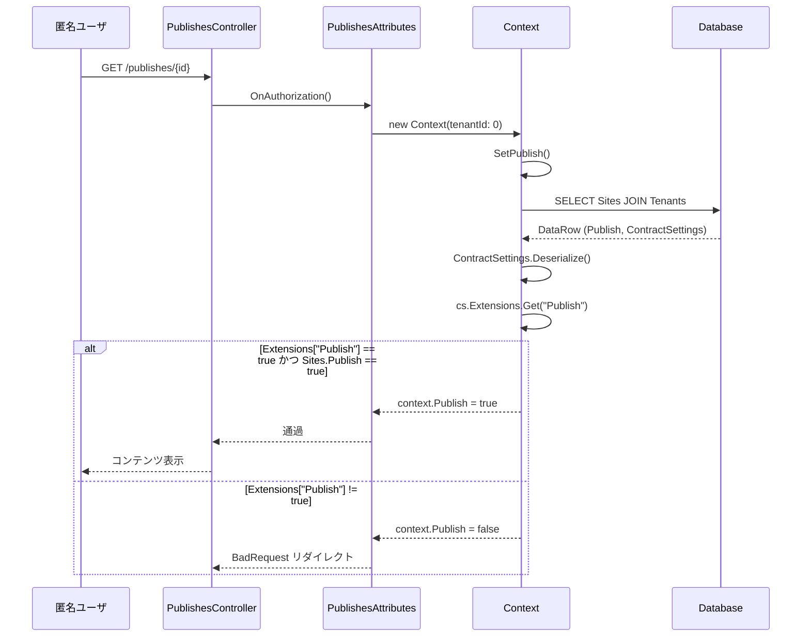
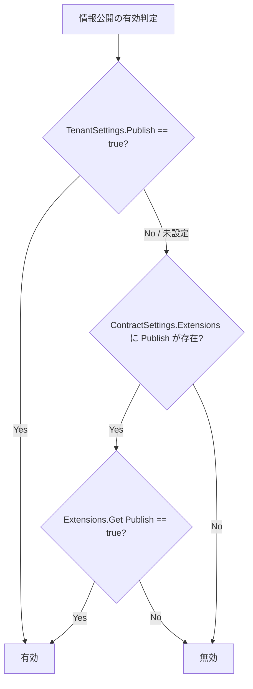
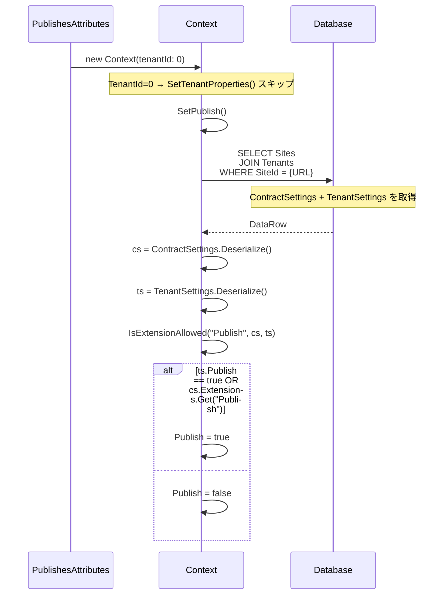

# 情報公開機能の TenantSettings 移行検討

プリザンターの情報公開（Publish）機能は、現在 `ContractSettings.Extensions["Publish"]` で有効/無効を制御している。
本ドキュメントでは、この制御を `TenantSettings` に移行する方法を調査し、従来方式とのフォールバック設計を示す。

<!-- START doctoc generated TOC please keep comment here to allow auto update -->
<!-- DON'T EDIT THIS SECTION, INSTEAD RE-RUN doctoc TO UPDATE -->

- [調査情報](#調査情報)
- [調査目的](#調査目的)
- [現行の情報公開機能アーキテクチャ](#現行の情報公開機能アーキテクチャ)
    - [情報公開機能の概要](#情報公開機能の概要)
    - [現行の有効/無効制御フロー](#現行の有効無効制御フロー)
    - [ContractSettings.Extensions の構造](#contractsettingsextensions-の構造)
    - [Extensions.Get("Publish") の参照箇所](#extensionsgetpublish-の参照箇所)
- [ContractSettings と TenantSettings の比較](#contractsettings-と-tenantsettings-の比較)
    - [ContractSettings の特性](#contractsettings-の特性)
    - [TenantSettings の特性](#tenantsettings-の特性)
    - [両者の比較表](#両者の比較表)
- [移行方針](#移行方針)
    - [方針概要](#方針概要)
    - [フォールバック判定ロジック](#フォールバック判定ロジック)
- [具体的な改修内容](#具体的な改修内容)
    - [改修 1: TenantSettings へのプロパティ追加](#改修-1-tenantsettings-へのプロパティ追加)
    - [改修 2: Context への TenantSettings アクセス経路の追加](#改修-2-context-への-tenantsettings-アクセス経路の追加)
    - [改修 3: SetPublish() のフォールバック判定](#改修-3-setpublish-のフォールバック判定)
    - [改修 4: サイト設定画面の表示制御](#改修-4-サイト設定画面の表示制御)
    - [改修 5: テナント管理画面への UI 追加](#改修-5-テナント管理画面への-ui-追加)
    - [改修箇所の一覧](#改修箇所の一覧)
- [SetPublish() における TenantSettings 取得の考慮事項](#setpublish-における-tenantsettings-取得の考慮事項)
- [フォールバック設計の詳細](#フォールバック設計の詳細)
    - [フォールバック方針](#フォールバック方針)
    - [判定パターンの網羅](#判定パターンの網羅)
    - [Form 機能との対比](#form-機能との対比)
- [CodeDefiner への影響](#codedefiner-への影響)
- [移行手順](#移行手順)
    - [段階 1: TenantSettings の拡張（後方互換を維持）](#段階-1-tenantsettings-の拡張後方互換を維持)
    - [段階 2: テナント管理画面の UI 追加](#段階-2-テナント管理画面の-ui-追加)
    - [段階 3: 既存テナントの移行（任意）](#段階-3-既存テナントの移行任意)
- [結論](#結論)
- [関連ソースコード](#関連ソースコード)

<!-- END doctoc generated TOC please keep comment here to allow auto update -->

## 調査情報

| 調査日        | リポジトリ | ブランチ | タグ/バージョン    | コミット    | 備考     |
| ------------- | ---------- | -------- | ------------------ | ----------- | -------- |
| 2026年3月10日 | Pleasanter | main     | Pleasanter_1.5.1.0 | `34f162a43` | 初回調査 |

## 調査目的

- 情報公開機能の有効/無効制御が `ContractSettings.Extensions` に依存している現状を整理する
- `TenantSettings` に移行するための具体的な改修方針を示す
- 従来の `ContractSettings.Extensions` 方式とのフォールバック設計を示す
- 移行時の影響範囲と注意事項を明確にする

---

## 現行の情報公開機能アーキテクチャ

### 情報公開機能の概要

情報公開（Publish）機能は、サイトのコンテンツを匿名ユーザに公開するための機能である。
公開されたサイトには認証なしでアクセスでき、読み取り専用の権限が付与される。

対応する SiteType は Results / Issues / Wikis / Dashboards の 4 種類である。

### 現行の有効/無効制御フロー

現行では以下の流れで情報公開の可否が判定される。



### ContractSettings.Extensions の構造

`ContractSettings` は Tenants テーブルの `ContractSettings` カラムに JSON 文字列として格納される。
`Extensions` プロパティは `Dictionary<string, bool>` 型で、機能フラグを管理する。

```csharp
// Libraries/Settings/ContractSettings.cs:33
public Dictionary<string, bool> Extensions;
```

格納例:

```json
{
    "Extensions": {
        "Publish": true,
        "Form": true
    }
}
```

現在 `Extensions` で管理されている機能フラグは以下の 2 つである。

| キー    | 用途                 | 備考                                       |
| ------- | -------------------- | ------------------------------------------ |
| Publish | 情報公開機能の有効化 | ContractSettings.Extensions のみで制御     |
| Form    | フォーム機能の有効化 | `Parameters.Form.Enabled` との OR 判定あり |

### Extensions.Get("Publish") の参照箇所

`ContractSettings.Extensions.Get("Publish")` は以下の 6 箇所で参照されている。

| ファイル                            | 行番号 | 用途                                           |
| ----------------------------------- | ------ | ---------------------------------------------- |
| `Context.cs`                        | 684    | `SetPublish()` 内の `IsExtensionAllowed()`     |
| `SiteUtilities.cs`                  | 3978   | サイト設定タブ「公開」タブの表示制御（Wikis）  |
| `SiteUtilities.cs`                  | 4164   | サイト設定タブ「公開」タブの表示制御（その他） |
| `SiteUtilities.cs`                  | 16952  | `PublishSettingsEditor()` の表示制御           |
| `SettingsJsonConverter.Settings.cs` | 7385   | `PublishSettingsModel.Create()` の生成判定     |
| `SettingsJsonConverter.Settings.cs` | 7408   | 公開チェックボックスカラム定義の生成判定       |

---

## ContractSettings と TenantSettings の比較

### ContractSettings の特性

- Tenants テーブルの `ContractSettings` カラム（nvarchar(max)）に JSON で格納
- `Context.SetTenantProperties()` で毎リクエスト読み込まれる
- 契約に関連するリソース制限（ユーザ数・サイト数・容量等）と機能フラグを含む
- `Context.ContractSettings` プロパティとしてリクエスト中いつでもアクセス可能
- SaaS 版では契約プランに応じて外部から設定されることを想定した設計

```csharp
// Libraries/Requests/Context.cs:493-537
public void SetTenantProperties(bool force = false)
{
    // ...
    ContractSettings = dataRow.String("ContractSettings")
        .Deserialize<ContractSettings>() ?? ContractSettings;
    // ...
}
```

### TenantSettings の特性

- Tenants テーブルの `TenantSettings` カラム（nvarchar(max)）に JSON で格納
- 現在は `BackgroundServerScripts` のみを保持する
- `TenantModel` 経由でのみアクセス可能（`Context` には直接プロパティがない）
- テナント管理画面から管理者が設定変更可能

```csharp
// Libraries/Settings/TenantSettings.cs
public class TenantSettings
{
    public BackgroundServerScripts BackgroundServerScripts { get; set; }

    // ... コンストラクタ・シリアライズ関連メソッド
}
```

### 両者の比較表

| 観点               | ContractSettings                    | TenantSettings                                 |
| ------------------ | ----------------------------------- | ---------------------------------------------- |
| 格納場所           | Tenants.ContractSettings            | Tenants.TenantSettings                         |
| アクセス経路       | `context.ContractSettings`          | `TenantModel.TenantSettings`（Context に無し） |
| 読み込みタイミング | 毎リクエスト（SetTenantProperties） | TenantModel 生成時のみ                         |
| 設計意図           | 契約条件（外部管理・SaaS 用）       | テナント管理者が設定する項目                   |
| UI                 | なし（直接 DB 操作が前提）          | テナント管理画面で編集可能                     |
| カラム番号         | No.104                              | No.124                                         |

---

## 移行方針

### 方針概要

`TenantSettings` に `Publish` プロパティを追加し、`ContractSettings.Extensions["Publish"]` よりも優先的に参照する。
従来の `Extensions` 指定も引き続き有効とし、どちらか一方が `true` であれば機能を有効にする（OR フォールバック）。

この方式は、既に `Form` 機能で `Parameters.Form.Enabled` と `ContractSettings.Extensions.Get("Form")` の OR 判定を採用しているパターンと同様である。

```csharp
// 現行の Form 機能のフォールバック（Context.cs:680-682）
if (extensionKey == "Form")
{
    return Parameters.Form.Enabled == true || cs.Extensions.Get(extensionKey);
}
```

### フォールバック判定ロジック



判定式:

```csharp
bool IsPublishEnabled = tenantSettings?.Publish == true
    || cs.Extensions.Get("Publish");
```

---

## 具体的な改修内容

### 改修 1: TenantSettings へのプロパティ追加

`TenantSettings` クラスに `Publish` プロパティを追加する。

```csharp
// Libraries/Settings/TenantSettings.cs
public class TenantSettings
{
    public BackgroundServerScripts BackgroundServerScripts { get; set; }
    public bool? Publish { get; set; }  // 追加

    // ...
}
```

`bool?`（Nullable）とすることで、未設定時（`null`）と明示的な `false` を区別できる。
`RecordingJson()` での null 除外ロジックを追加する。

```csharp
internal string RecordingJson(Context context)
{
    var obj = this.ToJson().Deserialize<TenantSettings>();
    if ((obj.BackgroundServerScripts?.Scripts?.Count ?? 0) == 0)
    {
        obj.BackgroundServerScripts = null;
    }
    // Publish が null の場合は出力しない（既定値）
    // bool? 型のため、Newtonsoft.Json の NullValueHandling で制御可能
    return obj.ToJson();
}
```

### 改修 2: Context への TenantSettings アクセス経路の追加

現行の `Context` には `TenantSettings` プロパティが存在しない。
`SetTenantProperties()` の読み込み対象に `TenantSettings` カラムを追加する。

```csharp
// Libraries/Requests/Context.cs
// プロパティ追加
public TenantSettings TenantSettings { get; set; } = new TenantSettings();

// SetTenantProperties() への追加
public void SetTenantProperties(bool force = false)
{
    if (HasRoute || force)
    {
        var dataRow = Repository.ExecuteTable(
            context: this,
            statements: Rds.SelectTenants(
                column: Rds.TenantsColumn()
                    .Title()
                    .ContractSettings()
                    .ContractDeadline()
                    // ... 既存カラム
                    .TenantSettings()   // 追加
                    .Theme(),
                where: Rds.TenantsWhere().TenantId(TenantId)))
                    .AsEnumerable()
                    .FirstOrDefault();
        if (dataRow != null)
        {
            // ... 既存処理
            TenantSettings = dataRow.String("TenantSettings")
                .Deserialize<TenantSettings>() ?? TenantSettings;  // 追加
        }
    }
}
```

注意: `SetTenantProperties()` は毎リクエスト実行されるため、`TenantSettings` カラムの追加はクエリの負荷増加を伴う。
ただし `TenantSettings` は nvarchar(max) であるが、現行でも `ContractSettings`（同じく nvarchar(max)）や `TopStyle` / `TopScript`（同じく nvarchar(max)）を読み込んでおり、許容範囲と判断できる。

### 改修 3: SetPublish() のフォールバック判定

`IsExtensionAllowed()` メソッドを修正し、`TenantSettings.Publish` を優先的に評価する。

```csharp
// Libraries/Requests/Context.cs - SetPublish() 内
bool IsExtensionAllowed(string extensionKey, ContractSettings cs)
{
    if (extensionKey == "Form")
    {
        return Parameters.Form.Enabled == true || cs.Extensions.Get(extensionKey);
    }
    if (extensionKey == "Publish")
    {
        // TenantSettings を優先し、ContractSettings.Extensions へフォールバック
        return TenantSettings?.Publish == true || cs.Extensions.Get(extensionKey);
    }
    return cs.Extensions.Get(extensionKey);
}
```

ただし、`SetPublish()` 内ではテナントの `TenantSettings` を別途取得する必要がある点に注意が必要である。
`SetPublish()` は `Context(tenantId: 0)` で呼ばれるため、`SetTenantProperties()` とは異なる経路で動作する。

現行の `GetDataRow()` は Sites テーブルと Tenants テーブルを JOIN して `ContractSettings` を取得している。
同じ JOIN で `TenantSettings` カラムも取得する方法が最も効率的である。

```csharp
// SetPublish() 内の GetDataRow() を修正
DataRow GetDataRow()
{
    var statement = Rds.SelectSites(
        column: Rds.SitesColumn()
            .TenantId()
            .Publish()
            .Form()
            .SiteId()
            .Tenants_ContractSettings()
            .Tenants_TenantSettings()     // 追加
            .Tenants_HtmlTitleTop()
            .Tenants_HtmlTitleSite()
            .Tenants_HtmlTitleRecord(),
        join: Rds.SitesJoin().Add(new SqlJoin(
            tableBracket: "\"Tenants\"",
            joinType: SqlJoin.JoinTypes.Inner,
            joinExpression: "\"Sites\".\"TenantId\"=\"Tenants\".\"TenantId\"")),
        where: GetSiteIdQuery());

    var dataTable = Repository.ExecuteTable(
        context: this,
        statements: statement);

    return dataTable.AsEnumerable().FirstOrDefault();
}
```

`TrySetupController()` メソッドも対応が必要である。

```csharp
bool TrySetupController(string extensionKey,
    Func<DataRow, bool> validator,
    Action<DataRow> specificAction)
{
    var dataRow = GetDataRow();
    if (dataRow == null || !validator(dataRow)) return false;

    var cs = dataRow.String("ContractSettings")
        .Deserialize<ContractSettings>() ?? ContractSettings;
    var ts = dataRow.String("TenantSettings")
        .Deserialize<TenantSettings>();  // 追加

    if (!IsExtensionAllowed(extensionKey, cs, ts)) return false;  // 引数追加

    SetCommonProperties(dataRow, cs);
    specificAction(dataRow);
    return true;
}

bool IsExtensionAllowed(string extensionKey, ContractSettings cs, TenantSettings ts)
{
    if (extensionKey == "Form")
    {
        return Parameters.Form.Enabled == true || cs.Extensions.Get(extensionKey);
    }
    if (extensionKey == "Publish")
    {
        return ts?.Publish == true || cs.Extensions.Get(extensionKey);
    }
    return cs.Extensions.Get(extensionKey);
}
```

### 改修 4: サイト設定画面の表示制御

`SiteUtilities.cs` と `SettingsJsonConverter.Settings.cs` の参照箇所を修正する。

```csharp
// SiteUtilities.cs:3978, 4164 - タブ表示制御
_using: context.TenantSettings?.Publish == true
    || context.ContractSettings.Extensions.Get("Publish")

// SiteUtilities.cs:16952 - エディタ表示制御
if (context.TenantSettings?.Publish != true
    && context.ContractSettings.Extensions?.Get("Publish") != true)
{
    return hb;
}

// SettingsJsonConverter.Settings.cs:7385, 7408
if (context.TenantSettings?.Publish != true
    && context.ContractSettings.Extensions.Get("Publish") != true) return null;
```

### 改修 5: テナント管理画面への UI 追加

テナント管理画面に「情報公開」の有効/無効チェックボックスを追加する。
`TenantUtilities.cs` のテナント編集画面に `FieldCheckBox` を追加する。

```csharp
// Models/Tenants/TenantUtilities.cs - テナント編集画面
.FieldCheckBox(
    controlId: "Tenants_TenantSettings_Publish",
    fieldCss: "field-auto-thin",
    labelText: Displays.Publish(context: context),
    _checked: tenantModel.TenantSettings.Publish == true)
```

### 改修箇所の一覧

| #   | ファイル                            | 改修内容                                         |
| --- | ----------------------------------- | ------------------------------------------------ |
| 1   | `TenantSettings.cs`                 | `Publish` プロパティの追加                       |
| 2   | `Context.cs`（プロパティ）          | `TenantSettings` プロパティの追加                |
| 3   | `Context.cs`（SetTenantProperties） | TenantSettings カラム読み込みの追加              |
| 4   | `Context.cs`（SetPublish）          | GetDataRow / IsExtensionAllowed のフォールバック |
| 5   | `SiteUtilities.cs`（3978, 4164）    | タブ表示制御のフォールバック判定                 |
| 6   | `SiteUtilities.cs`（16952）         | エディタ表示制御のフォールバック判定             |
| 7   | `SettingsJsonConverter.Settings.cs` | 設定モデル生成判定のフォールバック               |
| 8   | `TenantUtilities.cs`                | テナント管理画面の UI 追加                       |

---

## SetPublish() における TenantSettings 取得の考慮事項

`SetPublish()` は `PublishesAttributes` フィルタ内で `new Context(tenantId: 0)` として呼ばれる。
この時点では `TenantId` が未確定であり、`SetTenantProperties()` は実行されない。

`SetPublish()` 内部の `GetDataRow()` で Sites テーブルと Tenants テーブルを JOIN し、
URL の SiteId からテナント情報を取得する流れである。
したがって、`TenantSettings` は `GetDataRow()` の SELECT カラムに追加することで取得可能である。



---

## フォールバック設計の詳細

### フォールバック方針

Form 機能の既存パターンに倣い、OR 結合のフォールバックとする。

| 優先度 | 判定元                        | 説明                                    |
| ------ | ----------------------------- | --------------------------------------- |
| 1      | `TenantSettings.Publish`      | テナント管理画面から設定可能            |
| 2      | `ContractSettings.Extensions` | 従来方式（SaaS 契約管理など外部設定用） |

### 判定パターンの網羅

| TenantSettings.Publish | Extensions["Publish"] | 結果 | 説明                        |
| ---------------------- | --------------------- | ---- | --------------------------- |
| true                   | true                  | 有効 | 両方有効                    |
| true                   | false / 未設定        | 有効 | TenantSettings で有効化     |
| false / null           | true                  | 有効 | Extensions でフォールバック |
| false / null           | false / 未設定        | 無効 | どちらも無効                |

### Form 機能との対比

| 観点            | Form 機能                                       | Publish 機能（移行後）                       |
| --------------- | ----------------------------------------------- | -------------------------------------------- |
| 第 1 優先       | `Parameters.Form.Enabled`（パラメータファイル） | `TenantSettings.Publish`（DB・テナント設定） |
| 第 2 優先       | `ContractSettings.Extensions["Form"]`           | `ContractSettings.Extensions["Publish"]`     |
| 結合方式        | OR                                              | OR                                           |
| 第 1 優先の特性 | サーバ全体で共通（全テナント）                  | テナント単位で個別設定可能                   |

---

## CodeDefiner への影響

`TenantSettings` クラスへのプロパティ追加は JSON シリアライズで管理されるため、データベーススキーマの変更は不要である。
`TenantSettings` カラムは既に nvarchar(max) 型で定義されており、JSON 内にプロパティが増えても CodeDefiner の再実行は不要である。

ただし、`Context.cs` の `SetTenantProperties()` は CodeDefiner による自動生成対象ではなく、手動実装（Fixed セクション）であるため、直接編集が可能である。

---

## 移行手順

### 段階 1: TenantSettings の拡張（後方互換を維持）

1. `TenantSettings.cs` に `Publish` プロパティを追加
2. `Context.cs` に `TenantSettings` プロパティを追加し、`SetTenantProperties()` で読み込む
3. `SetPublish()` 内でフォールバック判定を実装
4. `SiteUtilities.cs` / `SettingsJsonConverter.Settings.cs` のフォールバック判定を実装

この段階では `ContractSettings.Extensions["Publish"]` が設定済みのテナントは影響を受けない。

### 段階 2: テナント管理画面の UI 追加

1. `TenantUtilities.cs` にチェックボックス UI を追加
2. テナント管理者が画面から Publish の有効/無効を切り替えられるようにする

### 段階 3: 既存テナントの移行（任意）

1. `ContractSettings.Extensions["Publish"]` が `true` のテナントについて、`TenantSettings.Publish = true` に移行
2. 移行後も `ContractSettings.Extensions` のフォールバックは残すため、移行は必須ではない

---

## 結論

| 項目               | 内容                                                                                             |
| ------------------ | ------------------------------------------------------------------------------------------------ |
| 移行先             | `TenantSettings.Publish`（bool? 型）                                                             |
| フォールバック     | `TenantSettings.Publish == true \|\| ContractSettings.Extensions.Get("Publish")` の OR           |
| 既存パターン       | Form 機能の `Parameters.Form.Enabled \|\| Extensions.Get("Form")` と同等                         |
| DB スキーマ変更    | 不要（TenantSettings カラムは既存の nvarchar(max)）                                              |
| CodeDefiner 再実行 | 不要                                                                                             |
| 影響箇所           | 8 ファイル（TenantSettings / Context / SiteUtilities / SettingsJsonConverter / TenantUtilities） |
| Context への追加   | `TenantSettings` プロパティと `SetTenantProperties()` での読み込みが必要                         |
| 後方互換性         | フォールバックにより従来の Extensions 指定はそのまま動作する                                     |

---

## 関連ソースコード

- `Implem.Pleasanter/Libraries/Settings/ContractSettings.cs` - Extensions 定義（33 行目）
- `Implem.Pleasanter/Libraries/Settings/TenantSettings.cs` - 移行先クラス
- `Implem.Pleasanter/Libraries/Requests/Context.cs` - SetPublish()（633-719 行）/ SetTenantProperties()（493-537 行）
- `Implem.Pleasanter/Filters/PublishesAttributes.cs` - 公開フィルタ
- `Implem.Pleasanter/Controllers/PublishesController.cs` - 公開コントローラ
- `Implem.Pleasanter/Models/Sites/SiteUtilities.cs` - 公開設定 UI（3978, 4164, 16952 行）
- `Implem.Pleasanter/Libraries/SiteManagement/SettingsJsonConverter.Settings.cs` - 設定 JSON 変換（7385, 7408 行）
- `Implem.Pleasanter/Models/Tenants/TenantUtilities.cs` - テナント管理画面
- `Implem.Pleasanter/Models/Tenants/TenantModel.cs` - TenantSettings 管理（49 行目）
- `Implem.Pleasanter/App_Data/Definitions/Definition_Column/Tenants_TenantSettings.json` - TenantSettings カラム定義
- `Implem.Pleasanter/App_Data/Definitions/Definition_Column/Tenants_ContractSettings.json` - ContractSettings カラム定義
- `Implem.ParameterAccessor/Parts/Form.cs` - Form パラメータ（フォールバックパターンの参考）
