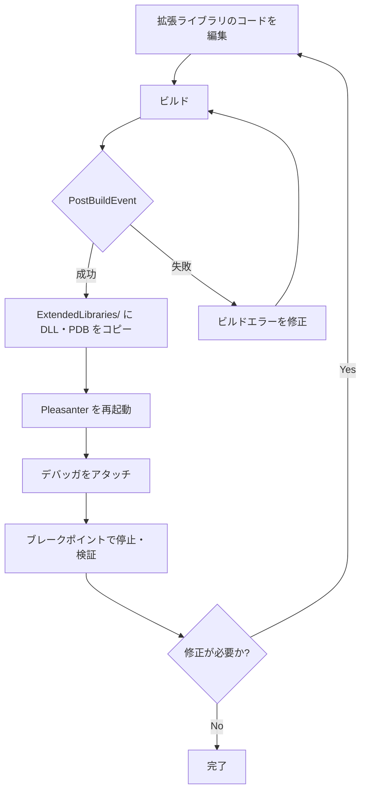
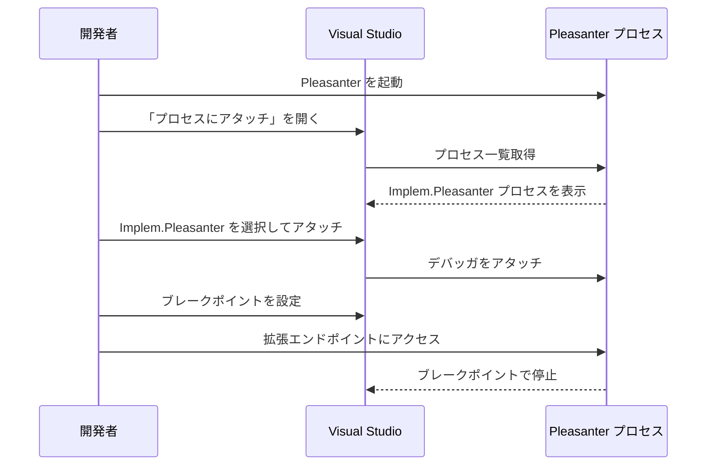

# 拡張ライブラリの開発・デバッグ方法

拡張ライブラリ（ExtendedLibrary）を開発する際の環境構築手順と、VS Code および Visual Studio の 2 パターンでのデバッグ方法を整理した。

<!-- START doctoc generated TOC please keep comment here to allow auto update -->
<!-- DON'T EDIT THIS SECTION, INSTEAD RE-RUN doctoc TO UPDATE -->

- [調査情報](#調査情報)
- [調査目的](#調査目的)
- [前提条件](#前提条件)
- [プロジェクト構成](#プロジェクト構成)
    - [ディレクトリ構成](#ディレクトリ構成)
    - [csproj の定義](#csproj-の定義)
    - [PostBuildEvent による自動配置](#postbuildevent-による自動配置)
- [開発フロー](#開発フロー)
- [デバッグ方法：VS Code パターン](#デバッグ方法vs-code-パターン)
    - [方法 A：プロセスアタッチ](#方法-aプロセスアタッチ)
    - [方法 B：Compound Launch（VS Code から Pleasanter ごと起動）](#方法-bcompound-launchvs-code-から-pleasanter-ごと起動)
- [デバッグ方法：Visual Studio パターン](#デバッグ方法visual-studio-パターン)
    - [方法 A：同一ソリューションで起動デバッグ](#方法-a同一ソリューションで起動デバッグ)
    - [方法 B：プロセスアタッチ](#方法-bプロセスアタッチ)
- [各パターンの比較](#各パターンの比較)
- [注意事項](#注意事項)
    - [DLL 更新後は必ず Pleasanter を再起動する](#dll-更新後は必ず-pleasanter-を再起動する)
    - [pdb ファイルを ExtendedLibraries/ に配置する](#pdb-ファイルを-extendedlibraries-に配置する)
    - [try-catch が存在しない](#try-catch-が存在しない)
    - [本体依存 DLL を拡張ライブラリに含めない](#本体依存-dll-を拡張ライブラリに含めない)
- [結論](#結論)

<!-- END doctoc generated TOC please keep comment here to allow auto update -->

## 調査情報

| 調査日       | リポジトリ | ブランチ | タグ/バージョン | コミット    | 備考     |
| ------------ | ---------- | -------- | --------------- | ----------- | -------- |
| 2026年3月9日 | Pleasanter | main     |                 | `34f162a43` | 初回調査 |

## 調査目的

- 拡張ライブラリの開発環境セットアップ手順を確立する
- VS Code と Visual Studio それぞれでのデバッグ方法を明確にする
- ビルド→配置→デバッグのフローを自動化する方法を整理する

---

## 前提条件

| 要件                    | 内容                                                                                                                                                                                      |
| ----------------------- | ----------------------------------------------------------------------------------------------------------------------------------------------------------------------------------------- |
| .NET SDK                | Pleasanter 本体と同一バージョン（現行: `net10.0`）                                                                                                                                        |
| Pleasanter ソースコード | プロジェクト参照を使う場合は必要。バイナリ参照のみの場合は公開済みバイナリで可                                                                                                            |
| Pleasanter の起動環境   | デバッグ対象として別途起動できること（開発機または Docker）                                                                                                                               |
| VS Code 拡張機能        | [C# Dev Kit](https://marketplace.visualstudio.com/items?itemName=ms-dotnettools.csdevkit) または [C# 拡張機能](https://marketplace.visualstudio.com/items?itemName=ms-dotnettools.csharp) |
| Visual Studio           | Visual Studio 2022 以降（Community / Professional / Enterprise）                                                                                                                          |

---

## プロジェクト構成

### ディレクトリ構成

```text
MyExtendedLibrary/                     ← 拡張ライブラリのリポジトリルート
├── MyExtendedLibrary.sln              ← ソリューションファイル
├── MyExtendedLibrary/
│   ├── MyExtendedLibrary.csproj
│   ├── ExtendedLibrary.cs             ← 初期化クラス（任意）
│   ├── Controllers/
│   │   └── CustomPageController.cs
│   └── Api/
│       └── CustomApiController.cs
└── (Implem.Pleasanter/)               ← サブモジュールまたは ../Implem.Pleasanter へのパス
```

### csproj の定義

```xml
<Project Sdk="Microsoft.NET.Sdk">
  <PropertyGroup>
    <!-- Pleasanter 本体と同じターゲットフレームワークを指定 -->
    <TargetFramework>net10.0</TargetFramework>
    <Nullable>disable</Nullable>
    <!-- デバッグシンボルを pdb ファイルとして生成 -->
    <DebugType>portable</DebugType>
    <DebugSymbols>true</DebugSymbols>
  </PropertyGroup>

  <ItemGroup>
    <!-- ASP.NET Core MVC の型を参照するために必要 -->
    <FrameworkReference Include="Microsoft.AspNetCore.App" />
  </ItemGroup>

  <ItemGroup>
    <!--
      本体の Context クラス等を使う場合はプロジェクト参照を追加。
      Private="false" と ExcludeAssets="runtime" で本体 DLL を出力に含めない。
    -->
    <ProjectReference
      Include="..\Implem.Pleasanter\Implem.Pleasanter.csproj"
      Private="false"
      ExcludeAssets="runtime" />
  </ItemGroup>
</Project>
```

> **重要**: `Private="false"` と `ExcludeAssets="runtime"` を指定することで、
> 本体がロード済みの DLL を拡張ライブラリの出力に含めない。
> これにより DLL 競合を防止できる。

### PostBuildEvent による自動配置

ビルド後に自動的に `ExtendedLibraries/` へコピーするよう PostBuildEvent を設定する。

```xml
<PropertyGroup>
  <!--
    Pleasanter の実行ディレクトリを指定する。
    開発環境に合わせてパスを変更する。
  -->
  <PleasanterOutputDir>..\Implem.Pleasanter\bin\Debug\net10.0</PleasanterOutputDir>
</PropertyGroup>

<Target Name="CopyToExtendedLibraries" AfterTargets="Build">
  <ItemGroup>
    <ExtendedLibraryFiles Include="$(OutputPath)$(AssemblyName).dll" />
    <ExtendedLibraryFiles Include="$(OutputPath)$(AssemblyName).pdb" />
  </ItemGroup>
  <Copy
    SourceFiles="@(ExtendedLibraryFiles)"
    DestinationFolder="$(PleasanterOutputDir)\ExtendedLibraries"
    SkipUnchangedFiles="true" />
  <Message
    Text="拡張ライブラリを $(PleasanterOutputDir)\ExtendedLibraries にコピーしました"
    Importance="high" />
</Target>
```

> **補足**: `SkipUnchangedFiles="true"` により、変更がない場合はコピーをスキップする。
> pdb ファイルをコピーすることでデバッガがブレークポイントを解決できる。

---

## 開発フロー



> **注意**: Pleasanter は起動時に DLL を読み込む（`Assembly.LoadFrom`）ため、
> DLL を更新した場合は必ず Pleasanter を**再起動**する必要がある。
> ホットリロードは機能しない。

---

## デバッグ方法：VS Code パターン

### 方法 A：プロセスアタッチ

既に起動している Pleasanter プロセスにデバッガをアタッチする方法。
Pleasanter のソースコードが手元になくても実行できる。

#### 手順

1. Pleasanter を通常起動する（`dotnet run` またはサービスとして）
2. 拡張ライブラリのソースコードを VS Code で開く
3. `.vscode/launch.json` を作成または編集する

#### `.vscode/launch.json`

```json
{
    "version": "0.2.0",
    "configurations": [
        {
            "name": "Attach to Pleasanter",
            "type": "coreclr",
            "request": "attach",
            "processId": "${command:pickProcess}",
            "justMyCode": false,
            "symbolOptions": {
                "searchPaths": ["${workspaceFolder}/MyExtendedLibrary/bin/Debug/net10.0"]
            }
        }
    ]
}
```

1. F5 キーを押してデバッグを開始する
2. プロセス選択ダイアログで `Implem.Pleasanter` を選択する
3. 拡張ライブラリのソースコードにブレークポイントを設定する
4. Pleasanter の画面から拡張エンドポイントにアクセスするとブレークポイントで停止する

#### シンボルが解決されない場合

pdb ファイルが `ExtendedLibraries/` に配置されているか確認する。
配置されている場合は `symbolOptions.searchPaths` にそのディレクトリを追加する。

```json
"symbolOptions": {
  "searchPaths": [
    "${workspaceFolder}/MyExtendedLibrary/bin/Debug/net10.0",
    "/path/to/Implem.Pleasanter/bin/Debug/net10.0/ExtendedLibraries"
  ]
}
```

---

### 方法 B：Compound Launch（VS Code から Pleasanter ごと起動）

VS Code から Pleasanter と拡張ライブラリの両方をビルドし、一括起動してデバッグする方法。
Pleasanter のソースコードが手元にある場合に利用できる。

#### 前提

- Pleasanter のソースコードが拡張ライブラリのリポジトリと隣接して配置されていること
- ワークスペース（`.code-workspace` ファイル）で 2 つのプロジェクトを管理していること

#### マルチルートワークスペースの例（`development.code-workspace`）

```json
{
    "folders": [
        {
            "name": "MyExtendedLibrary",
            "path": "."
        },
        {
            "name": "Implem.Pleasanter",
            "path": "../Implem.Pleasanter"
        }
    ],
    "settings": {}
}
```

#### `.vscode/launch.json`

```json
{
    "version": "0.2.0",
    "configurations": [
        {
            "name": "Launch Pleasanter",
            "type": "coreclr",
            "request": "launch",
            "preLaunchTask": "build-extension",
            "program": "${workspaceFolder:Implem.Pleasanter}/bin/Debug/net10.0/Implem.Pleasanter.dll",
            "args": [],
            "cwd": "${workspaceFolder:Implem.Pleasanter}",
            "env": {
                "ASPNETCORE_ENVIRONMENT": "Development"
            },
            "sourceFileMap": {
                "/": "${workspaceFolder:Implem.Pleasanter}"
            },
            "justMyCode": false,
            "symbolOptions": {
                "searchPaths": ["${workspaceFolder:Implem.Pleasanter}/bin/Debug/net10.0/ExtendedLibraries"]
            }
        }
    ],
    "compounds": [
        {
            "name": "Launch Pleasanter with Extension",
            "configurations": ["Launch Pleasanter"]
        }
    ]
}
```

#### `.vscode/tasks.json`

```json
{
    "version": "2.0.0",
    "tasks": [
        {
            "label": "build-extension",
            "command": "dotnet",
            "type": "process",
            "args": [
                "build",
                "${workspaceFolder}/MyExtendedLibrary/MyExtendedLibrary.csproj",
                "--configuration",
                "Debug"
            ],
            "problemMatcher": "$msCompile",
            "group": "build",
            "presentation": {
                "reveal": "always",
                "panel": "new"
            }
        }
    ]
}
```

#### 手順

1. `development.code-workspace` を VS Code で開く
2. `F5` キーを押して `Launch Pleasanter with Extension` を選択する
3. 拡張ライブラリのビルドが自動実行され、DLL が `ExtendedLibraries/` にコピーされる
4. Pleasanter が起動し、拡張ライブラリが読み込まれる
5. 拡張ライブラリのソースにブレークポイントを設定した状態でアクセスするとブレークポイントで停止する

---

## デバッグ方法：Visual Studio パターン

### 方法 A：同一ソリューションで起動デバッグ

Pleasanter のソースコードと拡張ライブラリを同一ソリューションに追加し、
Pleasanter をスタートアッププロジェクトとして起動デバッグする方法。

#### 手順

1. Visual Studio で拡張ライブラリのソリューション（`.sln`）を開く
2. ソリューションエクスプローラーでソリューションを右クリック →「追加」→「既存のプロジェクト」
3. `Implem.Pleasanter.csproj` を追加する
4. ソリューションエクスプローラーで `Implem.Pleasanter` を右クリック →「スタートアップ プロジェクトに設定」
5. 拡張ライブラリのビルド後にコピーが行われるよう PostBuildEvent を設定する（前述の `CopyToExtendedLibraries` ターゲット参照）
6. 拡張ライブラリのソースコードにブレークポイントを設定する
7. `F5` キーでデバッグ開始する（Pleasanter が起動し、拡張ライブラリも読み込まれる）

#### ソリューション構成の例

```text
MyExtendedLibrary.sln
├── MyExtendedLibrary       ← 拡張ライブラリ（クラスライブラリ）
└── Implem.Pleasanter       ← 本体（スタートアッププロジェクト）
```

#### 注意事項

- Pleasanter の起動には `appsettings.json` や `Parameters/` ディレクトリが必要なため、
  Pleasanter のワーキングディレクトリを正しく設定する必要がある
- Visual Studio のプロジェクトプロパティ →「デバッグ」→「作業ディレクトリ」に
  Pleasanter ソースのルートパスを設定する

---

### 方法 B：プロセスアタッチ

起動済みの Pleasanter プロセスにデバッガをアタッチする方法。
VS Code の方法 A と同様の流れだが、Visual Studio の UI で操作する。

#### 手順

1. Pleasanter を通常起動する（`dotnet run` またはサービスとして）
2. 拡張ライブラリのソリューションを Visual Studio で開く
3. メニューから「デバッグ」→「プロセスにアタッチ」（`Ctrl+Alt+P`）を開く
4. 接続の種類に「マネージド（.NET Core、.NET 5+）」を選択する
5. プロセス一覧から `Implem.Pleasanter` を選択して「アタッチ」をクリックする



1. 拡張ライブラリのソースコードにブレークポイントを設定する
2. 拡張エンドポイントにアクセスするとブレークポイントで停止する

#### シンボルが解決されない場合

Visual Studio がシンボル（pdb）を見つけられない場合は、以下を確認する。

1. メニュー「デバッグ」→「オプション」→「シンボル」を開く
2. 「シンボルファイル (.pdb) の場所」に pdb ファイルのあるディレクトリを追加する

---

## 各パターンの比較

| 項目                             | VS Code 方法 A       | VS Code 方法 B        | VS 方法 A                          | VS 方法 B            |
| -------------------------------- | -------------------- | --------------------- | ---------------------------------- | -------------------- |
| 概要                             | プロセスアタッチ     | Compound Launch       | 同一ソリューション起動             | プロセスアタッチ     |
| Pleasanter ソース要否            | 不要                 | 必要                  | 必要                               | 不要                 |
| 拡張ライブラリのブレークポイント | 可                   | 可                    | 可                                 | 可                   |
| 本体コードのブレークポイント     | 不可（ソースなし時） | 可                    | 可                                 | 不可（ソースなし時） |
| セットアップの手間               | 低                   | 中                    | 中                                 | 低                   |
| 再起動のたびに手動アタッチ       | 必要                 | 不要（F5 で一括起動） | 不要（F5 で一括起動）              | 必要                 |
| 推奨シーン                       | 素早く確認したいとき | 日常的な開発ループ    | 本体とともに深くデバッグしたいとき | 素早く確認したいとき |

---

## 注意事項

### DLL 更新後は必ず Pleasanter を再起動する

Pleasanter は起動時に `Assembly.LoadFrom()` で DLL を読み込む。
起動後に `ExtendedLibraries/` の DLL を差し替えても、**実行中のプロセスには反映されない**。
DLL を更新したら必ず Pleasanter を再起動してから再度デバッガをアタッチすること。

### pdb ファイルを ExtendedLibraries/ に配置する

デバッガがブレークポイントを解決するためには、
DLL と同じディレクトリに pdb ファイルが存在する必要がある。
csproj に `<DebugType>portable</DebugType>` を設定し、
PostBuildEvent でも pdb をコピーするようにしておくこと。

### try-catch が存在しない

Pleasanter の DLL ロード処理（`Startup.cs`）には try-catch がないため、
DLL が不正な場合はアプリケーションの起動自体が失敗する。
ビルドエラーのある DLL を配置しないよう注意する。

### 本体依存 DLL を拡張ライブラリに含めない

`Private="false"` と `ExcludeAssets="runtime"` を設定せずにビルドすると、
本体と同名の DLL が `ExtendedLibraries/` にコピーされ、バージョン競合が発生する可能性がある。
詳細は [拡張ライブラリ（ExtendedLibrary）の仕様と使い方](001-拡張ライブラリ.md) を参照。

---

## 結論

| 項目                   | 結果                                                                                                         |
| ---------------------- | ------------------------------------------------------------------------------------------------------------ |
| 基本開発フロー         | コード編集 → ビルド → PostBuildEvent で ExtendedLibraries/ に自動配置 → Pleasanter 再起動 → デバッガアタッチ |
| VS Code 推奨方法       | 日常開発は方法 B（Compound Launch）。素早い確認は方法 A（プロセスアタッチ）                                  |
| Visual Studio 推奨方法 | 本体コードと合わせてデバッグしたい場合は方法 A（同一ソリューション）。それ以外は方法 B（プロセスアタッチ）   |
| pdb 配置               | `ExtendedLibraries/` に DLL と pdb を共に配置することでブレークポイントが解決される                          |
| DLL 更新後の再起動     | 必須。Pleasanter は起動時のみ DLL を読み込むためホットリロードは不可                                         |
