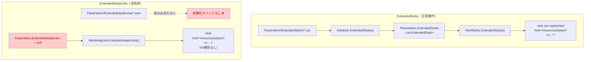
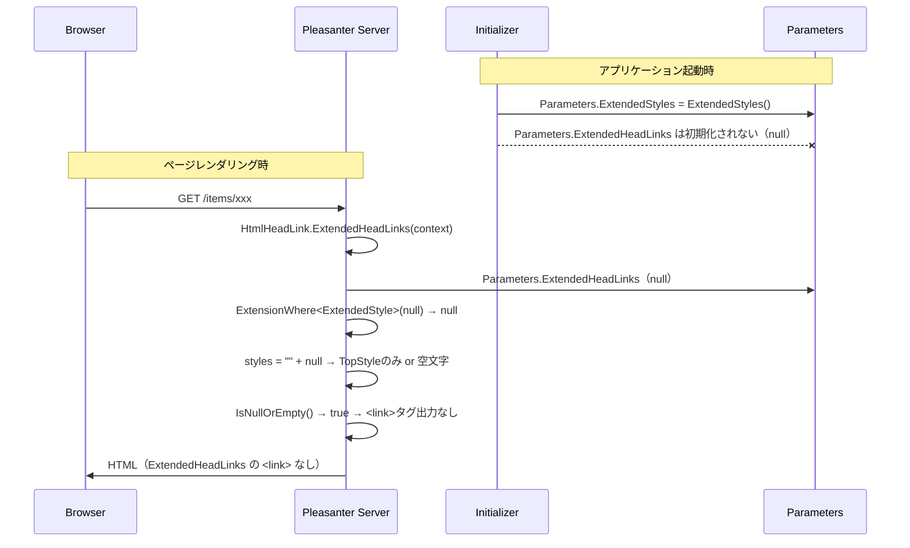

# 拡張ヘッドリンク（ExtendedHeadLinks）

プリザンターの拡張ヘッドリンク機能について、クラス定義・初期化・HTML レンダリング・配信エンドポイントの実装を調査し、現状の問題点を整理する。

<!-- START doctoc generated TOC please keep comment here to allow auto update -->
<!-- DON'T EDIT THIS SECTION, INSTEAD RE-RUN doctoc TO UPDATE -->

- [調査情報](#調査情報)
- [調査目的](#調査目的)
- [概要](#概要)
- [クラス定義](#クラス定義)
    - [ExtendedHeadLink](#extendedheadlink)
    - [ExtendedBase（共通基底クラス）](#extendedbase共通基底クラス)
    - [類似クラスとの比較](#類似クラスとの比較)
- [パラメータ登録](#パラメータ登録)
- [初期化処理（Initializer.cs）](#初期化処理initializercs)
    - [ExtendedStyles の初期化（参考：正常動作する実装）](#extendedstyles-の初期化参考正常動作する実装)
    - [ExtendedHeadLinks の初期化（未実装）](#extendedheadlinks-の初期化未実装)
- [HTML レンダリング（HtmlHeadLinks.cs）](#html-レンダリングhtmlheadlinkscs)
    - [公開メソッド：hb.ExtendedHeadLinks()](#公開メソッドhbextendedheadlinks)
    - [内部メソッド：CSS コンテンツの生成](#内部メソッドcss-コンテンツの生成)
    - [LinkedHeadLink メソッド](#linkedheadlink-メソッド)
- [配信エンドポイント（HeadLink.cs）](#配信エンドポイントheadlinkcs)
- [フィルタリング（ExtensionWhere）](#フィルタリングextensionwhere)
- [ExtendedStyles との比較](#extendedstyles-との比較)
- [問題点の詳細](#問題点の詳細)
    - [1. 初期化処理の欠如](#1-初期化処理の欠如)
    - [2. 型の不整合（ExtensionWhere の型引数）](#2-型の不整合extensionwhere-の型引数)
    - [3. rel 属性の欠如](#3-rel-属性の欠如)
    - [4. ExtendedHeadLink.Link プロパティの未使用](#4-extendedheadlinklink-プロパティの未使用)
- [処理フローの全体像](#処理フローの全体像)
- [結論](#結論)
- [関連ソースコード](#関連ソースコード)
- [関連ドキュメント](#関連ドキュメント)

<!-- END doctoc generated TOC please keep comment here to allow auto update -->

## 調査情報

| 調査日     | リポジトリ        | ブランチ | タグ/バージョン | コミット     | 備考 |
| ---------- | ----------------- | -------- | --------------- | ------------ | ---- |
| 2026-03-11 | Implem.Pleasanter | main     |                 | `c76832d69f` |      |

## 調査目的

プリザンターには「拡張スタイル（ExtendedStyles）」「拡張スクリプト（ExtendedScripts）」など複数の拡張機能が存在する。
その中のひとつである「拡張ヘッドリンク（ExtendedHeadLinks）」について、以下を明らかにする。

- ExtendedHeadLinks とは何か、何を目的とした機能か
- クラス定義・初期化処理・HTML レンダリング・配信エンドポイントの実装詳細
- 類似機能である ExtendedStyles との関係
- 現状の問題点と利用可否

---

## 概要

拡張ヘッドリンク（ExtendedHeadLinks）は、HTML の `<head>` セクションに任意の `<link>` タグを追加するための拡張機能として設計されたものである。
`Parameters/ExtendedHeadLinks/` ディレクトリに JSON ファイルを配置し、サイトやコントローラー・アクション単位で適用条件を制御する想定となっている。

ただし現時点では **初期化処理が未実装** であり、実質的には動作しないデッドコードとなっている（詳細は後述）。

---

## クラス定義

### ExtendedHeadLink

`ExtendedBase` を継承し、`Link` プロパティのみを追加した軽量なクラスである。

```csharp
// Implem.ParameterAccessor/Parts/ExtendedHeadLink.cs
namespace Implem.ParameterAccessor.Parts
{
    public class ExtendedHeadLink : ExtendedBase
    {
        public string Link;
    }
}
```

### ExtendedBase（共通基底クラス）

すべての拡張機能が継承する共通基底クラス。フィルタリング条件を定義する。

```csharp
// Implem.ParameterAccessor/Parts/ExtendedBase.cs
public class ExtendedBase
{
    public string Name;                  // 拡張名
    public bool SpecifyByName;           // true の場合、Name 一致時のみ適用
    public string Path;                  // ランタイム時にInitializerが設定するファイルパス
    public string Description;           // 説明
    public bool Disabled;                // true で無効化
    public List<int> DeptIdList;         // 適用対象の組織ID（null/空 = 全組織）
    public List<int> GroupIdList;        // 適用対象のグループID
    public List<int> UserIdList;        // 適用対象のユーザID
    public List<long> SiteIdList;       // 適用対象のサイトID
    public List<long> IdList;           // 適用対象のレコードID
    public List<string> Controllers;    // 適用対象のコントローラ名
    public List<string> Actions;        // 適用対象のアクション名
    public List<string> ColumnList;     // 適用対象のカラム名
}
```

### 類似クラスとの比較

| クラス             | 継承元       | 固有プロパティ | 説明                       |
| ------------------ | ------------ | -------------- | -------------------------- |
| `ExtendedStyle`    | ExtendedBase | `Style`        | CSS テキストを保持         |
| `ExtendedScript`   | ExtendedBase | `Script`       | JavaScript テキストを保持  |
| `ExtendedHeadLink` | ExtendedBase | `Link`         | リンク情報を保持（未使用） |

---

## パラメータ登録

`Parameters.cs` で `List<ExtendedHeadLink>` として宣言されている。

```csharp
// Implem.ParameterAccessor/Parameters.cs
public static class Parameters
{
    // ...
    public static List<ExtendedStyle> ExtendedStyles;
    public static List<ExtendedHeadLink> ExtendedHeadLinks;
    public static List<ExtendedPlugin> ExtendedPlugins;
    // ...
}
```

---

## 初期化処理（Initializer.cs）

### ExtendedStyles の初期化（参考：正常動作する実装）

`ExtendedStyles` は `SetParameters()` 内で明示的に初期化メソッドが呼ばれ、`.css` ファイルを読み込む。

```csharp
// Implem.DefinitionAccessor/Initializer.cs - SetParameters()
Parameters.ExtendedStyles = ExtendedStyles();
```

```csharp
// Implem.DefinitionAccessor/Initializer.cs
private static List<ExtendedStyle> ExtendedStyles(
    string path = null, List<ExtendedStyle> list = null)
{
    list = list ?? new List<ExtendedStyle>();
    path = path ?? Path.Combine(ParametersPath, "ExtendedStyles");
    var files = new DirectoryInfo(path)
        .GetFiles("*.css")
        .OrderBy(file => file.Name);
    foreach (var file in files)
    {
        var style = Files.Read(file.FullName);
        if (style != null)
        {
            list.Add(new ExtendedStyle()
            {
                Name = file.Name,
                Path = file.FullName,
                Style = style
            });
        }
    }
    // サブディレクトリも再帰的に処理
    foreach (var dir in new DirectoryInfo(path).GetDirectories().OrderBy(dir => dir.Name))
    {
        list = ExtendedStyles(dir.FullName, list);
    }
    return list;
}
```

### ExtendedHeadLinks の初期化（未実装）

`SetParameters()` 内に `Parameters.ExtendedHeadLinks` を初期化する行が **存在しない**。

```csharp
// Implem.DefinitionAccessor/Initializer.cs - SetParameters() 抜粋
Parameters.ExtendedStyles = ExtendedStyles();         // ← 初期化あり
Parameters.ExtendedPlugins = ExtendedPlugins();       // ← 初期化あり
// Parameters.ExtendedHeadLinks = ???                  // ← 初期化なし
```

`List<ExtendedHeadLink>` はフィールドの初期化子もないため、`Parameters.ExtendedHeadLinks` は `null` のまま残る。

---

## HTML レンダリング（HtmlHeadLinks.cs）

### 公開メソッド：hb.ExtendedHeadLinks()

`<head>` セクションに `<link>` タグを追加する拡張メソッド。

```csharp
// Implem.Pleasanter/Libraries/HtmlParts/HtmlHeadLinks.cs
public static HtmlBuilder ExtendedHeadLinks(this HtmlBuilder hb, Context context)
{
    var extendedHeadLinks = ExtendedHeadLinks(context: context);
    return hb
        .Link(
            href: Responses.Locations.Get(
                context: context,
                parts: $"resources/styles?v={extendedHeadLinks.Sha512Cng()}"
                    + $"&site-id={context.SiteId}"
                    + $"&id={context.Id}"
                    + $"&controller={context.Controller}"
                    + $"&action={context.Action}"),
            _using: !extendedHeadLinks.IsNullOrEmpty());
}
```

**ポイント:**

- CSS コンテンツの SHA-512 ハッシュをキャッシュバスティング用クエリパラメータ `v` に使用
- `site-id` / `id` / `controller` / `action` をクエリパラメータで渡し、サーバ側でフィルタリング
- コンテンツが空の場合は `<link>` タグ自体を出力しない（`_using` パラメータ）
- `rel` 属性が **指定されていない**（ExtendedStyles では `rel: "stylesheet"` が指定されている）

### 内部メソッド：CSS コンテンツの生成

```csharp
// Implem.Pleasanter/Libraries/HtmlParts/HtmlHeadLinks.cs
public static string ExtendedHeadLinks(
    Context context, int deptId, List<int> groups, int userId,
    bool siteTop, long siteId, long id, string controller, string action)
{
    var styles = (siteTop && !context.TopStyle.IsNullOrEmpty()
        ? context.TopStyle + '\n'
        : string.Empty)
            + ExtensionUtilities.ExtensionWhere<ExtendedStyle>(
                extensions: Parameters.ExtendedHeadLinks,  // ← List<ExtendedHeadLink>
                name: null,
                deptId: deptId,
                groups: groups,
                userId: userId,
                siteId: siteId,
                id: id,
                controller: controller,
                action: action)
                    .Select(o => o.Style)  // ← ExtendedStyle.Style を参照
                    .Join("\n");
    return styles;
}
```

### LinkedHeadLink メソッド

favicon と ES モジュールの modulepreload リンクを出力する別のメソッドもある。

```csharp
// Implem.Pleasanter/Libraries/HtmlParts/HtmlHeadLinks.cs
public static HtmlBuilder LinkedHeadLink(
    this HtmlBuilder hb, Context context, SiteSettings ss)
{
    return hb
        .Link(
            href: Responses.Locations.Get(context: context, parts: "favicon.ico"),
            rel: "shortcut icon")
        .EsModuleLinks(ManifestLoader.Load(
            Path.Combine(Environments.CurrentDirectoryPath,
                "wwwroot", "components", "manifest.json")
        ), "components", context)
        .EsModuleLinks(ManifestLoader.Load(
            Path.Combine(Environments.CurrentDirectoryPath,
                "wwwroot", "assets", "manifest.json")
        ), "assets", context);
}
```

---

## 配信エンドポイント（HeadLink.cs）

`/resources/styles` エンドポイントで CSS コンテンツを返すコントローラ。

```csharp
// Implem.Pleasanter/Libraries/Resources/HeadLink.cs
public static class HeadLink
{
    public static ContentResultInheritance Get(Context context)
    {
        var siteId = context.QueryStrings.Long("site-id");
        var id = context.QueryStrings.Long("id");
        var controller = context.QueryStrings.Data("controller");
        var action = context.QueryStrings.Data("action");
        var siteTop = siteId == 0 && id == 0
            && controller == "items" && action == "index";
        return new ContentResultInheritance
        {
            Content = HtmlHeadLink.ExtendedHeadLinks(
                context: context,
                deptId: context.DeptId,
                groups: context.Groups,
                userId: context.UserId,
                siteTop: siteTop,
                siteId: siteId,
                id: id,
                controller: controller,
                action: action)
        };
    }
}
```

---

## フィルタリング（ExtensionWhere）

すべての拡張機能に共通するフィルタリングロジック。

```csharp
// Implem.Pleasanter/Models/Extensions/ExtensionUtilities.cs
public static IEnumerable<T> ExtensionWhere<T>(
    IEnumerable<ParameterAccessor.Parts.ExtendedBase> extensions,
    string name, int deptId, List<int> groups, int userId,
    long siteId, long id, string controller, string action,
    string columnName = null)
{
    return extensions
        ?.Where(o => !o.SpecifyByName || o.Name == name)
        .Where(o => MeetConditions(o.DeptIdList, deptId))
        .Where(o => o.GroupIdList?.Any() != true
            || groups?.Any(groupId => MeetConditions(o.GroupIdList, groupId)) == true)
        .Where(o => MeetConditions(o.UserIdList, userId))
        .Where(o => MeetConditions(o.SiteIdList, siteId))
        .Where(o => MeetConditions(o.IdList, id))
        .Where(o => MeetConditions(o.Controllers, controller))
        .Where(o => MeetConditions(o.Actions, action))
        .Where(o => MeetConditions(o.ColumnList, columnName))
        .Where(o => !o.Disabled)
        .Cast<T>();
}
```

フィルタ条件の判定ルール:

| 条件リストの状態   | 例                       | 挙動                             |
| ------------------ | ------------------------ | -------------------------------- |
| null または空      | `SiteIdList: null`       | 制限なし（すべてに適用）         |
| 正の値あり         | `SiteIdList: [100, 200]` | リスト内の値のみに適用           |
| 負（`-` 接頭辞）値 | `SiteIdList: ["-999"]`   | リスト内の値を **除外** して適用 |

---

## ExtendedStyles との比較



| 比較項目                     | ExtendedStyles                 | ExtendedHeadLinks                        |
| ---------------------------- | ------------------------------ | ---------------------------------------- |
| クラス                       | `ExtendedStyle`                | `ExtendedHeadLink`                       |
| 固有プロパティ               | `Style`（CSS テキスト）        | `Link`（用途不明）                       |
| パラメータディレクトリ       | `ExtendedStyles/`              | `ExtendedHeadLinks/`                     |
| ファイル形式                 | `.css`                         | `.json`（想定）                          |
| 初期化メソッド               | `Initializer.ExtendedStyles()` | **なし**                                 |
| 初期化呼び出し               | `SetParameters()` 内にあり     | **なし**                                 |
| HTML 出力                    | `<link rel="stylesheet" ...>`  | `<link href="...">`（rel なし）          |
| `ExtensionWhere<T>` の型引数 | `ExtendedStyle`                | `ExtendedStyle`（型不整合）              |
| 配信エンドポイント           | `resources/styles`             | `resources/styles`（同一エンドポイント） |
| 動作状態                     | 正常動作                       | **動作しない（デッドコード）**           |

---

## 問題点の詳細

### 1. 初期化処理の欠如

`Initializer.SetParameters()` に `Parameters.ExtendedHeadLinks` の初期化行がない。
JSON ファイルを `Parameters/ExtendedHeadLinks/` に配置しても読み込まれない。

### 2. 型の不整合（ExtensionWhere の型引数）

`HtmlHeadLinks.ExtendedHeadLinks()` は `ExtensionWhere<ExtendedStyle>` を呼び出しているが、
引数 `extensions` に渡しているのは `Parameters.ExtendedHeadLinks`（`List<ExtendedHeadLink>`）である。

```csharp
// 型不整合のコード
ExtensionUtilities.ExtensionWhere<ExtendedStyle>(
    extensions: Parameters.ExtendedHeadLinks,  // List<ExtendedHeadLink> を渡している
    ...)
    .Select(o => o.Style)                      // ExtendedStyle.Style を参照
    .Join("\n");
```

`ExtensionWhere<T>` メソッドのシグネチャ:

```csharp
public static IEnumerable<T> ExtensionWhere<T>(
    IEnumerable<ExtendedBase> extensions, ...)  // IEnumerable<ExtendedBase> で受ける
```

- `List<ExtendedHeadLink>` は `IEnumerable<ExtendedBase>` として引数に渡せる（共変性）
- しかし内部の `.Cast<ExtendedStyle>()` で `ExtendedHeadLink` → `ExtendedStyle` のキャストが実行される
- `ExtendedHeadLink` と `ExtendedStyle` は兄弟関係（継承関係なし）のため、**実行時に `InvalidCastException` が発生する**
- 現状は `Parameters.ExtendedHeadLinks` が `null` のため例外は発生しない

### 3. rel 属性の欠如

`HtmlStyles.ExtendedStyles()` は `rel: "stylesheet"` を指定しているが、
`HtmlHeadLink.ExtendedHeadLinks()` は `rel` を指定していない。

```csharp
// ExtendedStyles（正常）
hb.Link(rel: "stylesheet", href: "resources/styles?v=...");

// ExtendedHeadLinks（rel なし）
hb.Link(href: "resources/styles?v=...");
```

`rel` 属性がない `<link>` タグはブラウザにとって意味をなさない。

### 4. ExtendedHeadLink.Link プロパティの未使用

`ExtendedHeadLink` クラスには `Link` プロパティが定義されているが、
レンダリングコードでは `ExtendedStyle.Style` プロパティが参照されており、`Link` は一切使用されていない。

---

## 処理フローの全体像



---

## 結論

| 項目                         | 結果                                                                      |
| ---------------------------- | ------------------------------------------------------------------------- |
| ExtendedHeadLinks の目的     | `<head>` に任意の `<link>` タグを追加する拡張機能（名称・クラスから推測） |
| 現状の動作                   | **動作しない**（初期化未実装・型不整合・プロパティ未使用）                |
| Parameters.ExtendedHeadLinks | `null`（Initializer で初期化されない）                                    |
| ExtendedHeadLink.Link        | **未使用**（レンダリングコードは ExtendedStyle.Style を参照）             |
| ExtensionWhere の型引数      | `ExtendedStyle` を指定（`ExtendedHeadLink` のキャストで例外が発生しうる） |
| rel 属性                     | **未指定**（ブラウザに意味をなさない `<link>` タグが生成される）          |
| 機能の完成度                 | 部分的に実装済み（クラス・パラメータ宣言・レンダリング枠は存在）          |
| 利用可否                     | **利用不可**（代替として ExtendedStyles を使用すべき）                    |

---

## 関連ソースコード

| ファイル                                                    | 役割                                     |
| ----------------------------------------------------------- | ---------------------------------------- |
| `Implem.ParameterAccessor/Parts/ExtendedHeadLink.cs`        | クラス定義（ExtendedBase + Link）        |
| `Implem.ParameterAccessor/Parts/ExtendedBase.cs`            | 共通基底クラス（フィルタ条件）           |
| `Implem.ParameterAccessor/Parts/ExtendedStyle.cs`           | 類似クラス（Style プロパティ）           |
| `Implem.ParameterAccessor/Parameters.cs`                    | 静的リスト宣言                           |
| `Implem.DefinitionAccessor/Initializer.cs`                  | 初期化処理（ExtendedHeadLinks は未実装） |
| `Implem.Pleasanter/Libraries/HtmlParts/HtmlHeadLinks.cs`    | HTML レンダリング                        |
| `Implem.Pleasanter/Libraries/HtmlParts/HtmlStyles.cs`       | ExtendedStyles のレンダリング（参考）    |
| `Implem.Pleasanter/Libraries/Resources/HeadLink.cs`         | CSS 配信エンドポイント                   |
| `Implem.Pleasanter/Models/Extensions/ExtensionUtilities.cs` | ExtensionWhere フィルタリング            |

---

## 関連ドキュメント

- [拡張機能実装方式比較と改善方針](004-拡張機能実装方式比較と改善方針.md)
- [Favicon カスタマイズ](../09-フロントエンド基盤/007-Faviconカスタマイズ.md)
