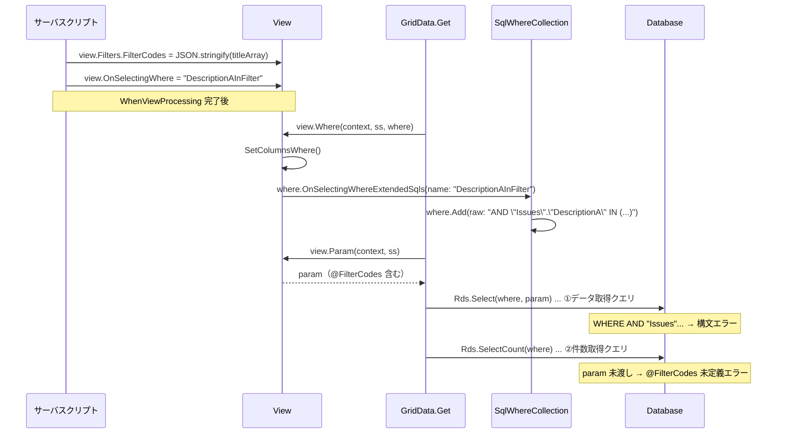

# 拡張 SQL・拡張フィールドの View 設定時 SQL エラー

拡張 SQL（`OnSelectingWhere`）と拡張フィールド（`FieldType: "Filter"`, `SqlParam: true`）を組み合わせ、サーバスクリプトから View に条件をセットした際に発生する SQL 構文エラーの原因を調査した。

<!-- START doctoc generated TOC please keep comment here to allow auto update -->
<!-- DON'T EDIT THIS SECTION, INSTEAD RE-RUN doctoc TO UPDATE -->

- [調査情報](#調査情報)
- [調査目的](#調査目的)
- [再現条件](#再現条件)
    - [拡張 SQL 定義](#拡張-sql-定義)
    - [拡張フィールド定義](#拡張フィールド定義)
    - [サーバスクリプト（WhenViewProcessing）](#サーバスクリプトwhenviewprocessing)
    - [発生するエラー](#発生するエラー)
- [処理フローの全体像](#処理フローの全体像)
- [原因分析](#原因分析)
    - [原因 1: raw SQL フラグメントの先頭 AND/OR が二重に付与される](#原因-1-raw-sql-フラグメントの先頭-andor-が二重に付与される)
    - [原因 2: SelectCount への SqlParam 未渡し](#原因-2-selectcount-への-sqlparam-未渡し)
- [拡張 SQL フィルタリングの仕組み](#拡張-sql-フィルタリングの仕組み)
    - [ExtensionWhere によるフィルタリング](#extensionwhere-によるフィルタリング)
    - [サーバスクリプトから View への反映](#サーバスクリプトから-view-への反映)
    - [拡張フィールドの SqlParam 処理](#拡張フィールドの-sqlparam-処理)
- [SetColumnsWhere の 2 つの呼び出し経路](#setcolumnswhere-の-2-つの呼び出し経路)
    - [経路 1: View.SetColumnsWhere（外側）](#経路-1-viewsetcolumnswhere外側)
    - [経路 2: View.SetColumnsWhere（内側、ColumnFilterHash 走査）](#経路-2-viewsetcolumnswhere内側columnfilterhash-走査)
- [結論](#結論)
    - [修正方針](#修正方針)
- [関連ソースコード](#関連ソースコード)

<!-- END doctoc generated TOC please keep comment here to allow auto update -->

## 調査情報

| 調査日     | リポジトリ        | ブランチ | タグ/バージョン    | コミット    | 備考 |
| ---------- | ----------------- | -------- | ------------------ | ----------- | ---- |
| 2026-04-17 | Implem.Pleasanter | main     | Pleasanter_1.5.3.0 | `e58aa58fc` |      |

## 調査目的

- 拡張 SQL と拡張フィールドを併用した際に発生する SQL 構文エラーの根本原因を特定する
- `SqlWhereCollection` における raw SQL フラグメントの結合ロジックの問題点を明らかにする
- `GridData.Get` における `SelectCount` への SQL パラメータ未渡し問題を確認する
- 修正方針を提示する

---

## 再現条件

### 拡張 SQL 定義

**ファイル**: `App_Data/Parameters/ExtendedSqls/ClassAInFilter.json`

```json
{
    "Name": "DescriptionAInFilter",
    "SpecifyByName": true,
    "OnSelectingWhere": true
}
```

**ファイル**: `App_Data/Parameters/ExtendedSqls/ClassAInFilter.json.sql`

```sql
AND "Issues"."DescriptionA" IN (
    SELECT [value]
    FROM STRING_SPLIT(@FilterCodes, ',')
)
```

### 拡張フィールド定義

**ファイル**: `App_Data/Parameters/ExtendedFields/FilterCodes.json`

```json
{
    "Name": "FilterCodes",
    "FieldType": "Filter",
    "SqlParam": true
}
```

### サーバスクリプト（WhenViewProcessing）

```javascript
try {
    const tempId = context.QueryStrings.Int('tempId');
    const tempRecords = items.Get(tempId);
    const tempRecord = tempRecords[0];
    const keyList = tempRecord.DescriptionA;

    if (keyList) {
        let titleArray = keyList.split(',');
        view.Filters.FilterCodes = JSON.stringify(titleArray);
        view.OnSelectingWhere = 'DescriptionAInFilter';
    }
} catch (e) {
    context.Log(e.stack);
}
```

### 発生するエラー

```
Implem.Libraries.Exceptions.CanNotGridSortException: この項目は並べ替えることができません
 ---> Microsoft.Data.SqlClient.SqlException (0x80131904):
  キーワード 'AND' 付近に不適切な構文があります。
  キーワード 'and' 付近に不適切な構文があります。
  FETCH ステートメントのオプション next の使用法が無効です。
```

---

## 処理フローの全体像



---

## 原因分析

### 原因 1: raw SQL フラグメントの先頭 AND/OR が二重に付与される

#### SqlWhereCollection.Sql() の WHERE 句生成

**ファイル**: `Implem.Libraries/DataSources/SqlServer/SqlWhereCollection.cs`（行番号: 80-107）

```csharp
public string Sql(
    ISqlObjectFactory factory,
    SqlContainer sqlContainer,
    ISqlCommand sqlCommand,
    int? commandCount,
    string multiClauseOperator = " and ",
    bool select = false)
{
    if (!select)
    {
        this.Where(o => o?.ColumnBrackets != null)
            .ForEach(where => where.ColumnBrackets =
                where.ColumnBrackets.Select(o => o.Split('.').Last()).ToArray());
    }
    return this.Where(o => o != null).Any(o => o.Using)
        ? Clause + this                         // ← 常に "where " を先頭付与
            .Where(o => o != null)
            .Where(o => o.Using)
            .Select(o => o.Sql(...))             // ← 各条件の SQL を取得
            .Join(multiClauseOperator) + " "     // ← " and " で結合
        : string.Empty;
}
```

`SqlWhereCollection.Sql()` は以下のように SQL を組み立てる。

1. 各 `SqlWhere` の `Sql()` メソッドで個々の条件文字列を取得
2. `multiClauseOperator`（デフォルト `" and "`）で全条件を結合
3. 先頭に `Clause`（デフォルト `"where "`）を付与

#### SqlWhere.Sql_Raw() の raw SQL 返却

**ファイル**: `Implem.Libraries/DataSources/SqlServer/SqlWhere.cs`（行番号: 256-307）

```csharp
private string Sql_Raw(...)
{
    if (Value.IsCollection())
    {
        // 省略
    }
    else
    {
        return ReplacedRaw(...);
    }
}

private string ReplacedRaw(...)
{
    return left != null
        ? left.Select(columnBracket => ...)
                .Join(MultiColumnOperator)
        : Raw                                    // ← Raw をそのまま返却
            .Replace("#TableBracket#", tableBracket)
            .Replace("#CommandCount#", commandCount.ToString());
}
```

`SqlWhere` の `Sql_Raw()` は `Raw` プロパティの値をそのまま返却する。つまり先頭の `AND` がそのまま残る。

#### 生成される不正な SQL

拡張 SQL の `CommandText` が `AND "Issues"."DescriptionA" IN (...)` であるため、以下のような不正な SQL が生成される。

| パターン                     | 生成される SQL                                              | 問題                   |
| ---------------------------- | ----------------------------------------------------------- | ---------------------- |
| 拡張 SQL が唯一の WHERE 条件 | `WHERE AND "Issues"."DescriptionA" IN (...)`                | `WHERE AND` は不正構文 |
| 他の条件の後に結合           | `WHERE <他の条件> and AND "Issues"."DescriptionA" IN (...)` | `and AND` は不正構文   |

#### OnSelectingWhereExtendedSqls() による raw SQL 追加

**ファイル**: `Implem.Pleasanter/Libraries/DataSources/Rds.cs`（行番号: 5648-5680）

```csharp
public static SqlWhereCollection OnSelectingWhereExtendedSqls(
    this SqlWhereCollection where,
    Context context,
    SiteSettings ss,
    IEnumerable<ExtendedSql> extendedSqls,
    long? siteId = null,
    long? id = null,
    DateTime? timestamp = null,
    string name = null,
    Dictionary<string, string> columnFilterHash = null,
    Dictionary<string, string> columnPlaceholders = null)
{
    extendedSqls
        ?.Where(o => o.OnSelectingWhereParams?.Any() != true
            || o.OnSelectingWhereParams?.All(p =>
                columnFilterHash?.ContainsKey(p) == true) == true)
        .ExtensionWhere<ExtendedSql>(
            context: context,
            siteId: ss.SiteId,
            name: name)
        .ForEach(o => where.Add(raw: o.ReplacedCommandText(  // ← raw SQL をそのまま追加
            siteId: siteId ?? ss?.SiteId ?? context.SiteId,
            id: id ?? context.Id,
            timestamp: timestamp,
            columnPlaceholders: ...)));
    return where;
}
```

`OnSelectingWhereExtendedSqls()` は `ExtendedSql.ReplacedCommandText()` の結果を
そのまま `raw` パラメータとして `SqlWhereCollection.Add()` に渡す。
`ReplacedCommandText()` は `{{SiteId}}` 等のプレースホルダ置換のみを行い、
先頭の `AND`/`OR` を除去しない。

### 原因 2: SelectCount への SqlParam 未渡し

**ファイル**: `Implem.Pleasanter/Libraries/Models/GridData.cs`（行番号: 98-123）

```csharp
var param = view.Param(
    context: context,
    ss: ss);
var statements = new List<SqlStatement>
{
    Rds.Select(
        tableName: ss.ReferenceType,
        // ...
        param: param,                // ← param を渡している
        // ...
        pageSize: pageSize)
};
if (count)
{
    statements.Add(Rds.SelectCount(
        tableName: ss.ReferenceType,
        tableType: tableType,
        join: join,
        where: where));             // ← param を渡していない
}
```

`Rds.SelectCount()` は `param` パラメータを受け付けるシグネチャを持つにもかかわらず、`GridData.Get()` では渡されていない。

**ファイル**: `Implem.Pleasanter/Libraries/DataSources/Rds.cs`（行番号: 342-360）

```csharp
public static SqlSelect SelectCount(
    string tableName,
    Sqls.TableTypes tableType = Sqls.TableTypes.Normal,
    string dataTableName = "Count",
    SqlJoinCollection join = null,
    SqlWhereCollection where = null,
    SqlParamCollection param = null)  // ← param を受け取れるが未使用
{
    return Select(
        tableName: tableName,
        // ...
        param: param);
}
```

これにより、拡張フィールドで定義した `@FilterCodes` パラメータが件数取得クエリに含まれず、SQL 実行時に未定義パラメータのエラーが発生する可能性がある。

---

## 拡張 SQL フィルタリングの仕組み

### ExtensionWhere によるフィルタリング

**ファイル**: `Implem.Pleasanter/Models/Extensions/ExtensionUtilities.cs`（行番号: 206-231）

```csharp
public static IEnumerable<T> ExtensionWhere<T>(
    IEnumerable<ParameterAccessor.Parts.ExtendedBase> extensions,
    string name,
    int deptId,
    List<int> groups,
    int userId,
    long siteId,
    long id,
    string controller,
    string action,
    string columnName = null)
{
    return extensions
        ?.Where(o => !o.SpecifyByName || o.Name == name)  // ← 名前一致チェック
        .Where(o => MeetConditions(o.DeptIdList, deptId))
        .Where(o => o.GroupIdList?.Any() != true
            || groups?.Any(groupId => MeetConditions(o.GroupIdList, groupId)) == true)
        .Where(o => MeetConditions(o.UserIdList, userId))
        .Where(o => MeetConditions(o.SiteIdList, siteId))
        .Where(o => MeetConditions(o.IdList, id))
        .Where(o => MeetConditions(o.Controllers, controller))
        .Where(o => MeetConditions(o.Actions, action))
        .Where(o => MeetConditions(o.ColumnList, columnName))
        .Where(o => !o.Disabled)
        .Cast<T>();
}
```

`SpecifyByName: true` の拡張 SQL は `name` パラメータと一致する場合のみ選択される。
サーバスクリプトで `view.OnSelectingWhere = "DescriptionAInFilter"` をセットすると、
`OnSelectingWhereExtendedSqls` の `name` 引数に `"DescriptionAInFilter"` が渡され、
JSON の `Name` フィールドと照合される。

### サーバスクリプトから View への反映

**ファイル**: `Implem.Pleasanter/Libraries/ServerScripts/ServerScriptUtilities.cs`（行番号: 1016-1034）

```csharp
if (view != null)
{
    view.AlwaysGetColumns = data.View.AlwaysGetColumns;
    view.OnSelectingWhere = data.View.OnSelectingWhere;      // ← スクリプトの値を View に反映
    view.OnSelectingOrderBy = data.View.OnSelectingOrderBy;
    view.ColumnPlaceholders = data.View.ColumnPlaceholders;
    SetColumnFilterHash(
        view: view,
        data: data);
    // ...
}
```

### 拡張フィールドの SqlParam 処理

**ファイル**: `Implem.Pleasanter/Libraries/Settings/View.cs`（行番号: 3511-3548）

```csharp
public SqlParamCollection Param(
    Context context,
    SiteSettings ss,
    SqlParamCollection param = null)
{
    if (param == null) param = new SqlParamCollection();
    AddExtendedFieldParam(
        context: context,
        param: param,
        extendedFieldType: "Filter",
        sourceHash: ColumnFilterHash);  // ← ColumnFilterHash から FilterCodes を取得
    // ...
    return param;
}
```

`view.Filters.FilterCodes` にセットされた値は `ColumnFilterHash` に格納され、
`View.Param()` で `@FilterCodes` という SQL パラメータとして
`SqlParamCollection` に追加される。

---

## SetColumnsWhere の 2 つの呼び出し経路

`OnSelectingWhereExtendedSqls` は 2 箇所から呼ばれる。

### 経路 1: View.SetColumnsWhere（外側）

**ファイル**: `Implem.Pleasanter/Libraries/Settings/View.cs`（行番号: 2145-2178）

```csharp
public void SetColumnsWhere(
    Context context,
    SiteSettings ss,
    SqlWhereCollection where,
    long? siteId = null,
    long? id = null,
    DateTime? timestamp = null)
{
    SetByWhenViewProcessingServerScript(context: context, ss: ss);
    SetColumnsWhere(
        context: context,
        ss: ss,
        where: where,
        columnFilterHash: ColumnFilterHash,
        siteId: siteId,
        id: id,
        timestamp: timestamp);
    // ...
    where.OnSelectingWhereExtendedSqls(     // ← View.OnSelectingWhere を使用
        context: context,
        ss: ss,
        extendedSqls: Parameters.ExtendedSqls?.Where(o => o.OnSelectingWhere),
        name: OnSelectingWhere,              // ← View のプロパティ
        columnFilterHash: ColumnFilterHash,
        columnPlaceholders: ColumnPlaceholders);
}
```

### 経路 2: View.SetColumnsWhere（内側、ColumnFilterHash 走査）

**ファイル**: `Implem.Pleasanter/Libraries/Settings/View.cs`（行番号: 2207, 2373-2385）

```csharp
// ColumnFilterHash のキーが "OnSelectingWhere" の場合
OnSelectingWhere = data.Key == "OnSelectingWhere",

// ...
else if (data.OnSelectingWhere)
{
    where.OnSelectingWhereExtendedSqls(     // ← ColumnFilterHash の値を使用
        context: context,
        ss: ss,
        extendedSqls: Parameters.ExtendedSqls?.Where(o => o.OnSelectingWhere),
        name: data.Value,                   // ← ColumnFilterHash["OnSelectingWhere"] の値
        columnFilterHash: ColumnFilterHash,
        columnPlaceholders: ColumnPlaceholders);
}
```

`ColumnFilterHash` に `"OnSelectingWhere"` というキーが含まれている場合も拡張 SQL が適用される。この場合、値がフィルタ名として使われる。

---

## 結論

| 問題                              | 原因                                                                                                          | 影響                                             |
| --------------------------------- | ------------------------------------------------------------------------------------------------------------- | ------------------------------------------------ |
| `WHERE AND` 構文エラー            | `SqlWhereCollection.Sql()` が `"where "` + 各条件を `" and "` で結合するが、raw SQL の先頭 `AND` を除去しない | 拡張 SQL が単独条件の場合 `WHERE AND` となり不正 |
| `and AND` 構文エラー              | 同上。他の条件と結合される場合に `and AND` となる                                                             | 拡張 SQL に先行条件がある場合も不正              |
| `FETCH` ステートメントエラー      | WHERE 句の構文エラーにより、後続の `OFFSET ... FETCH` ページネーション構文も無効化される                      | ページネーション付き一覧表示が全面的に失敗       |
| `SelectCount` への `param` 未渡し | `GridData.Get()` で `Rds.SelectCount()` に `param` を渡していない                                             | `@FilterCodes` が件数取得クエリで未定義になる    |

### 修正方針

| 修正対象                         | 修正内容                                                                                                                     |
| -------------------------------- | ---------------------------------------------------------------------------------------------------------------------------- |
| `OnSelectingWhereExtendedSqls()` | `where.Add(raw: ...)` に渡す前に、`ReplacedCommandText()` の結果から先頭の `AND`/`OR`（大文字・小文字不問）を除去する        |
| `GridData.Get()`                 | `Rds.SelectCount()` の呼び出しに `param: param` を追加する                                                                   |
| 拡張 SQL のドキュメント          | 拡張 SQL の `CommandText` には先頭に `AND`/`OR` を含めないよう注意喚起するか、プリザンター側で自動的に除去する仕様を明記する |

---

## 関連ソースコード

| ファイル                                                             | 内容                                     |
| -------------------------------------------------------------------- | ---------------------------------------- |
| `Implem.Libraries/DataSources/SqlServer/SqlWhereCollection.cs`       | WHERE 句の組み立て                       |
| `Implem.Libraries/DataSources/SqlServer/SqlWhere.cs`                 | 個別 WHERE 条件（raw SQL 含む）の SQL 化 |
| `Implem.Pleasanter/Libraries/DataSources/Rds.cs`                     | `OnSelectingWhereExtendedSqls` 等        |
| `Implem.Pleasanter/Libraries/Settings/View.cs`                       | View の WHERE 句・Param 構築             |
| `Implem.Pleasanter/Libraries/Models/GridData.cs`                     | 一覧データ取得（Select / SelectCount）   |
| `Implem.Pleasanter/Libraries/ServerScripts/ServerScriptUtilities.cs` | サーバスクリプトから View への反映       |
| `Implem.Pleasanter/Libraries/ServerScripts/ServerScriptModelView.cs` | サーバスクリプト View モデル             |
| `Implem.ParameterAccessor/Parts/ExtendedSql.cs`                      | 拡張 SQL 定義クラス                      |
| `Implem.ParameterAccessor/Parts/ExtendedField.cs`                    | 拡張フィールド定義クラス                 |
| `Implem.Pleasanter/Models/Extensions/ExtensionUtilities.cs`          | `ExtensionWhere` フィルタリング          |
