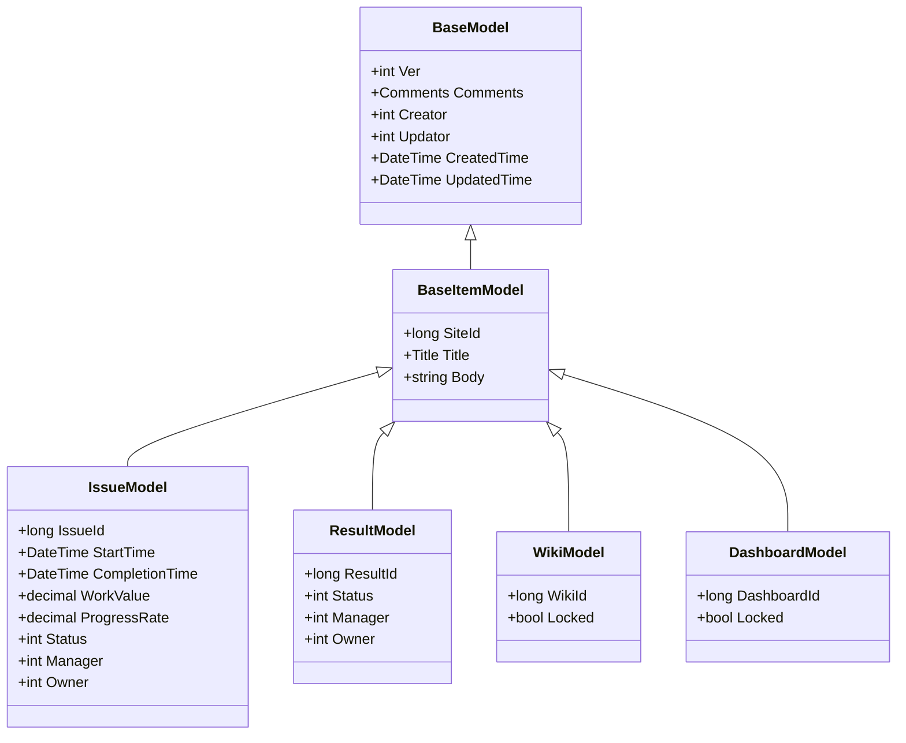
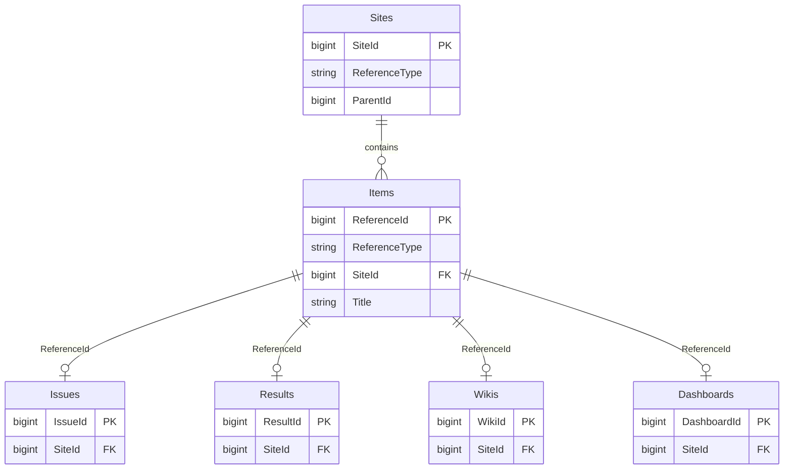
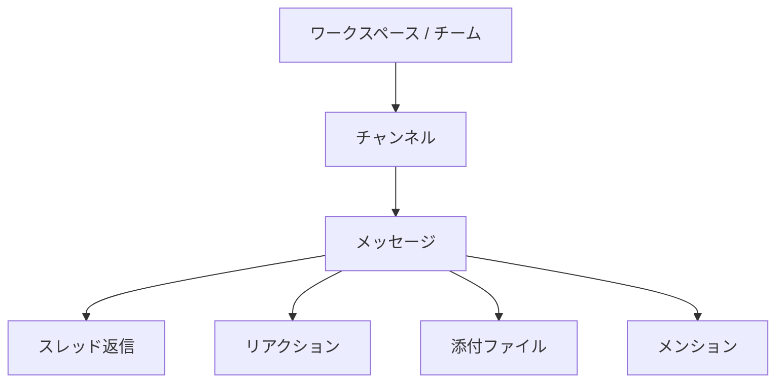
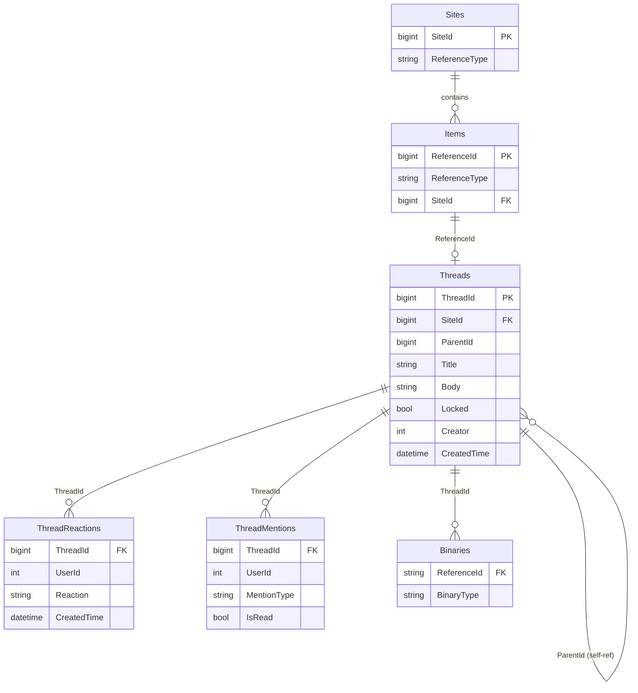
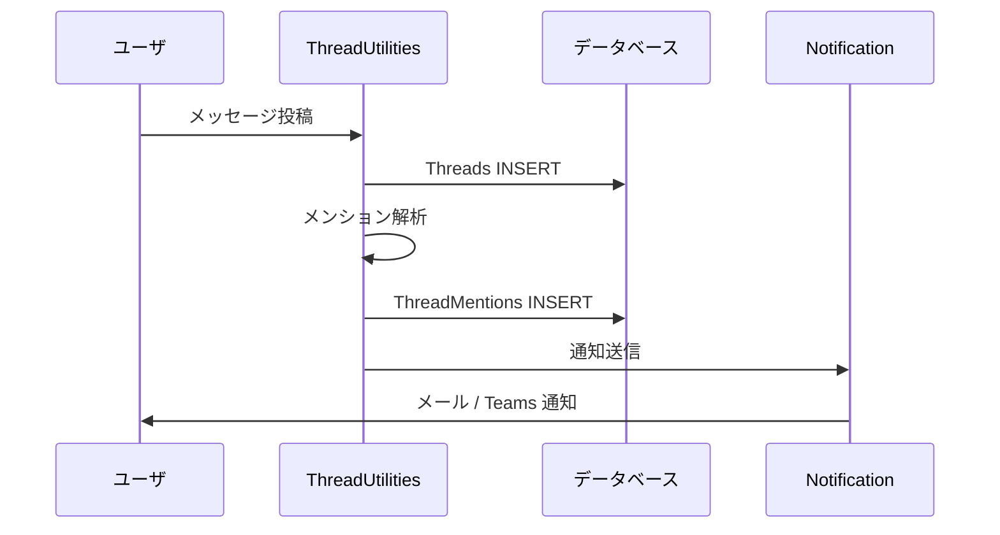

# スレッド型メッセージング機能設計

Rocket.Chat・Mattermost・Slack のようなスレッド形式のメッセージング機能を、新規 SiteType として追加するための設計調査。

<!-- START doctoc generated TOC please keep comment here to allow auto update -->
<!-- DON'T EDIT THIS SECTION, INSTEAD RE-RUN doctoc TO UPDATE -->

- [調査情報](#調査情報)
- [調査目的](#調査目的)
- [現行 SiteType アーキテクチャ](#現行-sitetype-アーキテクチャ)
    - [SiteType の概念](#sitetype-の概念)
    - [テーブル構造](#テーブル構造)
    - [Items テーブルとの関係](#items-テーブルとの関係)
    - [ItemModel のディスパッチパターン](#itemmodel-のディスパッチパターン)
    - [CodeDefiner による自動生成](#codedefiner-による自動生成)
- [スレッド型メッセージング機能の要件](#スレッド型メッセージング機能の要件)
    - [機能概要](#機能概要)
    - [Rocket.Chat / Mattermost / Slack の共通構造](#rocketchat--mattermost--slack-の共通構造)
    - [プリザンターの概念へのマッピング](#プリザンターの概念へのマッピング)
    - [要件一覧](#要件一覧)
- [データベーススキーマ設計](#データベーススキーマ設計)
    - [Threads テーブル](#threads-テーブル)
    - [ThreadReactions テーブル](#threadreactions-テーブル)
    - [ThreadMentions テーブル](#threadmentions-テーブル)
    - [ER 図](#er-図)
    - [スレッド構造の表現](#スレッド構造の表現)
- [Model / Controller / Utilities 実装設計](#model--controller--utilities-実装設計)
    - [モデルクラス設計](#モデルクラス設計)
    - [ファイル構成](#ファイル構成)
    - [ItemModel への統合](#itemmodel-への統合)
    - [SiteUtilities への統合](#siteutilities-への統合)
- [フロントエンド UI 設計](#フロントエンド-ui-設計)
    - [チャンネル一覧画面（Index）](#チャンネル一覧画面index)
    - [スレッド表示（返信パネル）](#スレッド表示返信パネル)
    - [HTML 生成方式](#html-生成方式)
    - [JavaScript による動的操作](#javascript-による動的操作)
- [API 設計](#api-設計)
    - [エンドポイント](#エンドポイント)
    - [リクエスト・レスポンス例](#リクエストレスポンス例)
- [CodeDefiner 統合方針](#codedefiner-統合方針)
    - [定義ファイルの追加](#定義ファイルの追加)
    - [ColumnDefinitionCollection への登録](#columndefinitioncollection-への登録)
    - [派生テーブル](#派生テーブル)
- [SiteSettings への統合](#sitesettings-への統合)
    - [Threads 固有の設定項目](#threads-固有の設定項目)
    - [設定画面のタブ追加](#設定画面のタブ追加)
- [通知・メンション処理](#通知メンション処理)
    - [メンションの解析](#メンションの解析)
    - [通知の統合](#通知の統合)
- [権限制御](#権限制御)
    - [基本方針](#基本方針)
    - [投稿者本人チェック](#投稿者本人チェック)
- [改修対象の全体像](#改修対象の全体像)
    - [改修ファイル一覧](#改修ファイル一覧)
    - [新規テーブル](#新規テーブル)
- [考慮事項](#考慮事項)
    - [パフォーマンス](#パフォーマンス)
    - [リアルタイム更新](#リアルタイム更新)
    - [スレッドの深さ制限](#スレッドの深さ制限)
    - [既存コメントシステムとの関係](#既存コメントシステムとの関係)
    - [CodeDefiner への影響](#codedefiner-への影響)
    - [ファイル添付](#ファイル添付)
- [結論](#結論)
- [関連ソースコード](#関連ソースコード)
- [関連ドキュメント](#関連ドキュメント)

<!-- END doctoc generated TOC please keep comment here to allow auto update -->

## 調査情報

| 調査日       | リポジトリ | ブランチ | タグ/バージョン    | コミット     | 備考     |
| ------------ | ---------- | -------- | ------------------ | ------------ | -------- |
| 2026年3月3日 | Pleasanter | main     | Pleasanter_1.5.1.0 | `34f162a439` | 初回調査 |

## 調査目的

- Rocket.Chat・Mattermost・Slack のようなスレッド型メッセージング機能をプリザンターに追加するための設計を検討する
- 既存の SiteType アーキテクチャを分析し、新規 SiteType `Threads` として実装する方針を策定する
- データベーススキーマ・Model・Controller・フロントエンド・API の各レイヤーにおける改修範囲を明確にする

---

## 現行 SiteType アーキテクチャ

### SiteType の概念

プリザンターでは「サイト」がデータの入れ物であり、サイトの種類（`ReferenceType`）によって保持するデータの構造と振る舞いが決まる。`ReferenceType` は文字列フィールドとして `Sites` テーブルに格納される。

| ReferenceType | 用途           | 特徴                                      |
| ------------- | -------------- | ----------------------------------------- |
| `Sites`       | フォルダ       | 他サイトを格納するコンテナ                |
| `Issues`      | 期限付き記録   | 開始日・完了日・進捗率・工数を持つ        |
| `Results`     | 状況記録       | ステータス・担当者・管理者を持つ          |
| `Wikis`       | Wiki ページ    | サイトあたり 1 レコードのみ（単一ページ） |
| `Dashboards`  | ダッシュボード | 集約表示用。レコード操作なし              |

### テーブル構造

全てのアイテム型 SiteType は以下の階層構造を持つ。



### Items テーブルとの関係

`Items` テーブルは全ての SiteType のレコードを横断的に管理する中間テーブルである。`ReferenceType` と `ReferenceId` によって、各型固有のテーブルにマッピングする。



### ItemModel のディスパッチパターン

`ItemModel` は `Site.ReferenceType` に基づいて各 Utilities クラスにディスパッチする。約 90 箇所の switch 文が存在する。

```csharp
// ItemModel.cs - ディスパッチの基本パターン
switch (Site.ReferenceType)
{
    case "Sites":
        return SiteUtilities.SiteMenu(context: context, ss: ss);
    case "Dashboards":
        return DashboardUtilities.Index(context: context, ss: ss);
    case "Issues":
        return IssueUtilities.Index(context: context, ss: ss);
    case "Results":
        return ResultUtilities.Index(context: context, ss: ss);
    default:
        return HtmlTemplates.Error(context: context, ...);
}
```

### CodeDefiner による自動生成

プリザンターのモデルコードの多くは `CodeDefiner` によって定義ファイルから自動生成される。新規 SiteType を追加する場合、以下の定義が必要となる。

| 定義ファイル                          | 役割                                          |
| ------------------------------------- | --------------------------------------------- |
| `Definition_Column/` 配下の JSON      | カラム定義（型、制約、表示名）                |
| `Definition_Code/` 配下のテンプレート | Model・Utilities・Validators の C# コード生成 |
| `Definition_Sql/` 配下の定義          | SQL ステートメント生成                        |
| `Def.cs`                              | 定義の読み込み・インデックス構築              |

---

## スレッド型メッセージング機能の要件

### 機能概要

Rocket.Chat・Mattermost・Slack のようなスレッド型のリアルタイムメッセージング機能を実現する。プリザンターのサイト階層の中に「チャンネル」を配置し、その中でメッセージのやり取りとスレッド返信を行う。

### Rocket.Chat / Mattermost / Slack の共通構造



### プリザンターの概念へのマッピング

| チャットツールの概念 | プリザンターへのマッピング                           |
| -------------------- | ---------------------------------------------------- |
| ワークスペース       | テナント                                             |
| チーム               | サイト（フォルダ）                                   |
| チャンネル           | Threads サイト（ReferenceType = `Threads`）          |
| メッセージ           | Thread レコード（`ParentId = 0` のルートメッセージ） |
| スレッド返信         | Thread レコード（`ParentId` で親を参照）             |
| リアクション         | ThreadReactions テーブル                             |
| メンション           | メッセージ本文内の `@ユーザ名` パース                |
| 添付ファイル         | 既存の Binaries テーブルを流用                       |

### 要件一覧

| 区分               | 要件                                                     |
| ------------------ | -------------------------------------------------------- |
| 基本機能           | チャンネル（Threads サイト）の作成・設定・削除           |
| 基本機能           | メッセージの投稿・編集・削除                             |
| 基本機能           | スレッド返信（メッセージに対する返信ツリー）             |
| 基本機能           | メッセージの時系列表示（新しい順 / 古い順）              |
| コミュニケーション | メンション（`@ユーザ名`、`@all`、`@here`）               |
| コミュニケーション | リアクション（絵文字リアクション）                       |
| 検索               | メッセージ全文検索                                       |
| 通知               | メンション時の通知（メール・Teams 等）                   |
| 通知               | スレッド返信時の通知                                     |
| 権限               | 既存のサイト権限モデルの継承                             |
| 権限               | メッセージ編集・削除の権限制御（投稿者本人 / 管理者）    |
| ファイル           | メッセージへのファイル添付（既存 Binaries テーブル活用） |
| Markdown           | メッセージ本文での Markdown レンダリング                 |
| API                | メッセージ CRUD の Web API 対応                          |
| ServerScript       | サーバースクリプトからのメッセージ操作                   |

---

## データベーススキーマ設計

### Threads テーブル

スレッド型メッセージの主テーブル。`BaseItemModel` を継承し、親子関係でスレッド構造を表現する。

```sql
CREATE TABLE [Threads] (
    -- BaseModel 共通カラム
    [Ver]           int           NOT NULL DEFAULT 1,
    [Comments]      nvarchar(max) NOT NULL DEFAULT '',
    [Creator]       int           NOT NULL,
    [Updator]       int           NOT NULL,
    [CreatedTime]   datetime      NOT NULL,
    [UpdatedTime]   datetime      NOT NULL,

    -- BaseItemModel 共通カラム
    [SiteId]        bigint        NOT NULL,
    [Title]         nvarchar(max) NOT NULL DEFAULT '',
    [Body]          nvarchar(max) NOT NULL DEFAULT '',

    -- Threads 固有カラム
    [ThreadId]      bigint        NOT NULL IDENTITY(1,1),
    [ParentId]      bigint        NOT NULL DEFAULT 0,  -- 0 = ルートメッセージ
    [Locked]        bit           NOT NULL DEFAULT 0,

    -- 拡張カラム（ClassA-Z, NumA-Z, DateA-Z 等）
    -- BaseItemModel から継承

    CONSTRAINT [PK_Threads] PRIMARY KEY CLUSTERED ([ThreadId])
);

CREATE NONCLUSTERED INDEX [IX_Threads_SiteId]
    ON [Threads] ([SiteId], [CreatedTime] DESC);
CREATE NONCLUSTERED INDEX [IX_Threads_ParentId]
    ON [Threads] ([ParentId], [CreatedTime] ASC);
```

### ThreadReactions テーブル

メッセージへのリアクション（絵文字リアクション）を管理する。

```sql
CREATE TABLE [ThreadReactions] (
    [ThreadId]      bigint        NOT NULL,
    [UserId]        int           NOT NULL,
    [Reaction]      nvarchar(64)  NOT NULL,  -- リアクション識別子
    [CreatedTime]   datetime      NOT NULL,

    CONSTRAINT [PK_ThreadReactions]
        PRIMARY KEY CLUSTERED ([ThreadId], [UserId], [Reaction]),
    CONSTRAINT [FK_ThreadReactions_Threads]
        FOREIGN KEY ([ThreadId]) REFERENCES [Threads]([ThreadId])
        ON DELETE CASCADE
);

CREATE NONCLUSTERED INDEX [IX_ThreadReactions_ThreadId]
    ON [ThreadReactions] ([ThreadId]);
```

### ThreadMentions テーブル

メンション通知の管理。本文パースの結果を格納し、通知処理に使用する。

```sql
CREATE TABLE [ThreadMentions] (
    [ThreadId]      bigint        NOT NULL,
    [UserId]        int           NOT NULL,
    [MentionType]   nvarchar(16)  NOT NULL DEFAULT 'user',  -- user / all / here
    [IsRead]        bit           NOT NULL DEFAULT 0,
    [CreatedTime]   datetime      NOT NULL,

    CONSTRAINT [PK_ThreadMentions]
        PRIMARY KEY CLUSTERED ([ThreadId], [UserId]),
    CONSTRAINT [FK_ThreadMentions_Threads]
        FOREIGN KEY ([ThreadId]) REFERENCES [Threads]([ThreadId])
        ON DELETE CASCADE
);

CREATE NONCLUSTERED INDEX [IX_ThreadMentions_UserId]
    ON [ThreadMentions] ([UserId], [IsRead]);
```

### ER 図



### スレッド構造の表現

`ParentId` を使った自己参照で親子関係を表現する。

```
チャンネル (SiteId = 100, ReferenceType = "Threads")
├── メッセージ A (ThreadId=1, ParentId=0)   ← ルートメッセージ
│   ├── 返信 A-1  (ThreadId=4, ParentId=1)
│   └── 返信 A-2  (ThreadId=5, ParentId=1)
├── メッセージ B (ThreadId=2, ParentId=0)   ← ルートメッセージ
│   └── 返信 B-1  (ThreadId=6, ParentId=2)
└── メッセージ C (ThreadId=3, ParentId=0)   ← ルートメッセージ
```

ルートメッセージのみ `Title` を持ち、返信は `Body` のみで構成する。

---

## Model / Controller / Utilities 実装設計

### モデルクラス設計

#### ThreadModel

```csharp
// Models/Threads/ThreadModel.cs
public class ThreadModel : BaseItemModel
{
    public long ThreadId = 0;
    public long ParentId = 0;
    public bool Locked = false;

    // スレッド固有のプロパティ
    public bool IsRootMessage => ParentId == 0;
    public int ReplyCount { get; set; }
    public DateTime? LastReplyTime { get; set; }
}
```

#### ThreadCollection

```csharp
// Models/Threads/ThreadCollection.cs
public class ThreadCollection : List<ThreadModel>
{
    // ルートメッセージの一覧取得
    // スレッド返信の一覧取得
    // ページネーション対応
}
```

#### ThreadApiModel

```csharp
// Models/Threads/ThreadApiModel.cs
public class ThreadApiModel
{
    public long ThreadId;
    public long SiteId;
    public long ParentId;
    public string Title;
    public string Body;
    public int Creator;
    public string CreatorName;
    public DateTime CreatedTime;
    public DateTime UpdatedTime;
    public int ReplyCount;
    public List<ThreadReactionApiModel> Reactions;
}
```

### ファイル構成

```
Implem.Pleasanter/
├── Models/
│   └── Threads/
│       ├── ThreadModel.cs           -- データモデル
│       ├── ThreadCollection.cs      -- コレクション
│       ├── ThreadUtilities.cs       -- 画面生成・業務ロジック
│       ├── ThreadValidators.cs      -- バリデーション
│       ├── ThreadApiModel.cs        -- API モデル
│       └── ThreadExportModel.cs     -- エクスポートモデル
└── Libraries/
    └── DataTypes/
        └── ThreadReaction.cs        -- リアクション型
```

### ItemModel への統合

`ItemModel.cs` の各 switch 文に `case "Threads":` を追加する。対象は約 20 箇所のディスパッチポイントである。

```csharp
// ItemModel.cs - 代表的なディスパッチポイント
public string Index(Context context)
{
    switch (Site.ReferenceType)
    {
        case "Sites":
            return SiteUtilities.SiteMenu(context: context, ss: ss);
        // ... 既存のケース ...
        case "Threads":
            return ThreadUtilities.Index(context: context, ss: ss);
        default:
            return HtmlTemplates.Error(context: context, ...);
    }
}

public string Create(Context context)
{
    switch (Site.ReferenceType)
    {
        // ... 既存のケース ...
        case "Threads":
            return ThreadUtilities.Create(context: context, ss: ss);
    }
}
```

主要なディスパッチポイントを以下にまとめる。

| メソッド      | 対応する ThreadUtilities メソッド | 備考                       |
| ------------- | --------------------------------- | -------------------------- |
| `Index`       | `ThreadUtilities.Index`           | チャンネル内メッセージ一覧 |
| `IndexJson`   | `ThreadUtilities.IndexJson`       | Ajax 更新                  |
| `Editor`      | `ThreadUtilities.Editor`          | メッセージ編集画面         |
| `EditorJson`  | `ThreadUtilities.EditorJson`      | メッセージ編集 Ajax        |
| `Create`      | `ThreadUtilities.Create`          | メッセージ投稿             |
| `Update`      | `ThreadUtilities.Update`          | メッセージ編集             |
| `Delete`      | `ThreadUtilities.Delete`          | メッセージ削除             |
| `CreateByApi` | `ThreadUtilities.CreateByApi`     | API 経由投稿               |
| `UpdateByApi` | `ThreadUtilities.UpdateByApi`     | API 経由編集               |
| `DeleteByApi` | `ThreadUtilities.DeleteByApi`     | API 経由削除               |
| `GetByApi`    | `ThreadUtilities.GetByApi`        | API 経由取得               |

### SiteUtilities への統合

`SiteUtilities.cs` の ReferenceType 選択肢に `Threads` を追加する。

```csharp
// SiteUtilities.cs - ReferenceType ドロップダウン
new Dictionary<string, ControlData>
{
    { "Sites", new ControlData(...) },
    { "Dashboards", new ControlData(...) },
    { "Issues", new ControlData(...) },
    { "Results", new ControlData(...) },
    { "Wikis", new ControlData(...) },
    { "Threads", new ControlData(
        text: Displays.Get(context: context, id: "Threads"),
        css: " always-send") },
};

// ReferenceTypeDisplayName
case "Threads":
    return Displays.Get(context: context, id: "Threads");
```

---

## フロントエンド UI 設計

### チャンネル一覧画面（Index）

既存の一覧表示（テーブル形式）ではなく、メッセージングに適したタイムライン形式の UI を設計する。

```
+----------------------------------------------------------+
| #general                                    [設定] [検索] |
+----------------------------------------------------------+
| [メッセージ入力欄]                            [送信]      |
+----------------------------------------------------------+
| 田中太郎          2026/03/03 10:30                        |
| プロジェクトの進捗について共有します。                    |
| > 添付: report.pdf                                        |
| [返信 3件]  [リアクション: 👍2 ❤️1]                       |
+----------------------------------------------------------+
| 佐藤花子          2026/03/03 09:15                        |
| 明日の会議資料をアップロードしました。                    |
| [返信 1件]                                                |
+----------------------------------------------------------+
| 鈴木一郎          2026/03/02 17:00                        |
| @田中太郎 レビューお願いします。                          |
| [返信なし]                                                |
+----------------------------------------------------------+
```

### スレッド表示（返信パネル）

メッセージをクリックすると右側パネルまたはモーダルでスレッドが展開される。

```
+-------------------------------+  +---------------------------+
| #general                      |  | スレッド                  |
|                               |  +---------------------------+
| メッセージ一覧               |  | 田中太郎   03/03 10:30    |
| ...                           |  | プロジェクトの進捗につ   |
|                               |  | いて共有します。          |
| [田中太郎のメッセージ]  ←選択 |  +---------------------------+
| プロジェクトの進捗について   |  | 佐藤花子   03/03 10:45    |
|                               |  | 了解しました。確認します  |
|                               |  +---------------------------+
|                               |  | 鈴木一郎   03/03 11:00    |
|                               |  | 資料の p.3 に誤りがあり  |
|                               |  | ます。                    |
|                               |  +---------------------------+
|                               |  | [返信入力欄]    [送信]    |
+-------------------------------+  +---------------------------+
```

### HTML 生成方式

プリザンターの既存パターンに従い、サーバーサイドの `HtmlBuilder` でメッセージ一覧を生成する。

```csharp
// Libraries/HtmlParts/HtmlThreads.cs
public static class HtmlThreads
{
    public static HtmlBuilder ThreadTimeline(
        this HtmlBuilder hb,
        Context context,
        SiteSettings ss,
        IEnumerable<ThreadModel> threads)
    {
        return hb.Div(
            id: "ThreadTimeline",
            css: "thread-timeline",
            action: () => threads.ForEach(thread =>
                hb.ThreadMessage(
                    context: context,
                    ss: ss,
                    thread: thread)));
    }

    private static HtmlBuilder ThreadMessage(
        this HtmlBuilder hb,
        Context context,
        SiteSettings ss,
        ThreadModel thread)
    {
        return hb.Div(
            css: "thread-message",
            attributes: new HtmlAttributes()
                .DataId(thread.ThreadId.ToString()),
            action: () => hb
                .Div(css: "thread-message-header", action: () => hb
                    .Span(css: "thread-message-creator",
                        action: () => hb.Text(
                            SiteInfo.UserName(
                                context: context,
                                userId: thread.Creator)))
                    .Span(css: "thread-message-time",
                        action: () => hb.Text(
                            thread.CreatedTime
                                .ToLocal(context: context)
                                .ToString("yyyy/MM/dd HH:mm"))))
                .Div(css: "thread-message-body", action: () => hb
                    .Raw(thread.Body.ToMarkdown(context: context)))
                .Div(css: "thread-message-footer", action: () => hb
                    .ThreadReplyCount(thread: thread)
                    .ThreadReactions(thread: thread)));
    }
}
```

### JavaScript による動的操作

メッセージ投稿・スレッド展開は Ajax で処理する。

```javascript
// wwwroot/src/scripts/generals/thread.js
$p.postThreadMessage = function () {
    var data = $p.getData($('#ThreadMessageForm'));
    $p.ajax($('#ThreadTimeline').attr('data-action'), 'post', data, $p.onPostThreadMessage);
};

$p.openThread = function (threadId) {
    $p.ajax('/api/items/' + threadId + '/thread', 'get', {}, $p.onOpenThread);
};

$p.onOpenThread = function (data) {
    $('#ThreadPanel').html(data.html);
    $('#ThreadPanel').addClass('open');
};
```

---

## API 設計

### エンドポイント

既存の Items API パターンに従い、`/api/items/{id}` 配下にスレッド操作を追加する。

| メソッド | エンドポイント                 | 説明                 |
| -------- | ------------------------------ | -------------------- |
| POST     | `/api/items/{siteId}/create`   | メッセージ投稿       |
| PUT      | `/api/items/{threadId}/update` | メッセージ編集       |
| DELETE   | `/api/items/{threadId}/delete` | メッセージ削除       |
| POST     | `/api/items/{siteId}/get`      | メッセージ一覧取得   |
| POST     | `/api/items/{threadId}/thread` | スレッド返信一覧取得 |
| POST     | `/api/items/{threadId}/react`  | リアクション追加     |
| DELETE   | `/api/items/{threadId}/react`  | リアクション削除     |

### リクエスト・レスポンス例

#### メッセージ投稿

```json
// POST /api/items/{siteId}/create
// リクエスト
{
    "ApiVersion": 1.1,
    "ApiKey": "...",
    "Title": "新しいトピック",
    "Body": "プロジェクトの進捗について共有します。\n@佐藤花子 確認お願いします。",
    "ParentId": 0
}

// レスポンス
{
    "StatusCode": 200,
    "Response": {
        "Id": 12345,
        "ThreadId": 12345,
        "ParentId": 0,
        "Title": "新しいトピック",
        "Body": "プロジェクトの進捗について...",
        "Creator": 1,
        "CreatedTime": "2026-03-03T10:30:00"
    }
}
```

#### スレッド返信投稿

```json
// POST /api/items/{siteId}/create
// リクエスト
{
    "ApiVersion": 1.1,
    "ApiKey": "...",
    "Body": "了解しました。確認します。",
    "ParentId": 12345
}
```

#### メッセージ一覧取得

```json
// POST /api/items/{siteId}/get
// リクエスト
{
    "ApiVersion": 1.1,
    "ApiKey": "...",
    "View": {
        "ColumnFilterHash": {
            "ParentId": "[0]"
        },
        "ColumnSorterHash": {
            "CreatedTime": "desc"
        }
    },
    "Offset": 0,
    "PageSize": 50
}

// レスポンス
{
    "StatusCode": 200,
    "Response": {
        "Offset": 0,
        "PageSize": 50,
        "TotalCount": 128,
        "Data": [
            {
                "ThreadId": 12345,
                "ParentId": 0,
                "Title": "新しいトピック",
                "Body": "プロジェクトの進捗について...",
                "Creator": 1,
                "CreatorName": "田中太郎",
                "CreatedTime": "2026-03-03T10:30:00",
                "ReplyCount": 3,
                "LastReplyTime": "2026-03-03T11:00:00",
                "Reactions": [
                    { "Reaction": "+1", "Count": 2 }
                ]
            }
        ]
    }
}
```

---

## CodeDefiner 統合方針

### 定義ファイルの追加

以下の定義ファイルを追加して CodeDefiner による自動生成に対応する。

#### カラム定義

`App_Data/Definitions/Definition_Column/` 配下に Threads テーブルのカラム定義 JSON を追加する。

```json
// Threads_ThreadId.json
{
    "Id": "Threads_ThreadId",
    "ModelName": "Thread",
    "TableName": "Threads",
    "ColumnName": "ThreadId",
    "LabelText": "ID",
    "TypeCs": "long",
    "TypeDb": "bigint",
    "Identity": true,
    "Pk": true,
    "ItemId": true,
    "GridColumn": 10,
    "EditorColumn": true
}
```

```json
// Threads_ParentId.json
{
    "Id": "Threads_ParentId",
    "ModelName": "Thread",
    "TableName": "Threads",
    "ColumnName": "ParentId",
    "LabelText": "親メッセージ",
    "TypeCs": "long",
    "TypeDb": "bigint",
    "DefaultValue": "0"
}
```

#### コード生成テンプレート

`Definition_Code/` 配下のテンプレートは既存の `#TableName#` / `#ModelName#` プレースホルダで自動展開されるため、`Threads` / `Thread` がテンプレートに渡されることで以下が自動生成される。

- `ThreadModel.cs` の基本プロパティ
- `Rds.Threads*()` メソッド群（CRUD SQL）
- `ThreadCollection.cs`
- ItemModel.cs 内の switch ケース

### ColumnDefinitionCollection への登録

`Def.cs` の `ColumnDefinitionCollection` に Threads テーブルのカラム定義が読み込まれ、以下のメソッドで利用可能になる。

```csharp
Def.ExistsTable("Threads")               // true
Def.TableNameByModelName("Thread")        // "Threads"
Def.ModelNameByTableName("Threads")       // "Thread"
```

### 派生テーブル

既存パターンに従い、以下の派生テーブルも生成する。

| テーブル          | 用途                     |
| ----------------- | ------------------------ |
| `Threads`         | 主テーブル               |
| `Threads_history` | 編集履歴                 |
| `Threads_deleted` | 論理削除レコードの退避先 |

---

## SiteSettings への統合

### Threads 固有の設定項目

`SiteSettings.cs` に Threads サイト固有の設定を追加する。

```csharp
// SiteSettings.cs に追加するプロパティ
public class SiteSettings
{
    // Threads 固有設定
    public bool? ThreadsEnableReactions;          // リアクション機能の有効化
    public bool? ThreadsEnableMentions;            // メンション機能の有効化
    public bool? ThreadsEnableThreadReplies;       // スレッド返信の有効化
    public int? ThreadsMessageMaxLength;           // メッセージ最大文字数
    public bool? ThreadsEnableMarkdown;            // Markdown 有効化
    public bool? ThreadsEnableFileAttachments;     // ファイル添付の有効化
}
```

### 設定画面のタブ追加

```csharp
// SiteUtilities.cs - 設定タブに Threads 固有タブを追加
case "Threads":
    hb.Tab(new Tab("ThreadsSettingsEditor",
        Displays.Get(context: context, id: "ThreadsSettings")));
    break;
```

---

## 通知・メンション処理

### メンションの解析

メッセージ投稿時に本文から `@ユーザ名` を正規表現でパースし、`ThreadMentions` テーブルに記録する。

```csharp
// Libraries/DataTypes/ThreadMention.cs
public static class ThreadMentionParser
{
    private static readonly Regex MentionPattern =
        new Regex(@"@(\w+)", RegexOptions.Compiled);

    public static IEnumerable<ThreadMention> Parse(
        Context context,
        string body)
    {
        return MentionPattern.Matches(body)
            .Cast<Match>()
            .Select(m => m.Groups[1].Value)
            .Distinct()
            .Select(loginId => new ThreadMention
            {
                UserId = ResolveUserId(context, loginId),
                MentionType = loginId switch
                {
                    "all" => "all",
                    "here" => "here",
                    _ => "user"
                }
            })
            .Where(m => m.UserId > 0 || m.MentionType != "user");
    }
}
```

### 通知の統合

既存の通知フレームワーク（`Notification` クラス）を活用してメンション通知を送信する。



---

## 権限制御

### 基本方針

Threads サイトの権限は既存のサイト権限モデルを継承する。

| 操作                 | 必要権限                                  |
| -------------------- | ----------------------------------------- |
| チャンネル閲覧       | サイトの読み取り権限                      |
| メッセージ投稿       | サイトの作成権限                          |
| 自分のメッセージ編集 | サイトの更新権限 + 投稿者本人             |
| 他人のメッセージ編集 | サイトの管理権限                          |
| メッセージ削除       | サイトの削除権限 + (投稿者本人 or 管理者) |
| リアクション         | サイトの読み取り権限（閲覧可能なら可）    |
| サイト設定変更       | サイトの管理権限                          |

### 投稿者本人チェック

```csharp
// ThreadValidators.cs
public static ErrorData OnUpdating(
    Context context,
    SiteSettings ss,
    ThreadModel threadModel)
{
    if (!context.HasPermission(ss: ss, type: Permissions.Types.Update))
        return new ErrorData(type: Error.Types.HasNotPermission);
    if (threadModel.Creator != context.UserId
        && !context.HasPermission(ss: ss, type: Permissions.Types.ManageSite))
        return new ErrorData(type: Error.Types.HasNotPermission);
    return new ErrorData(type: Error.Types.None);
}
```

---

## 改修対象の全体像

### 改修ファイル一覧

| カテゴリ     | ファイル / ディレクトリ                          | 改修内容                               |
| ------------ | ------------------------------------------------ | -------------------------------------- |
| 定義ファイル | `App_Data/Definitions/Definition_Column/`        | Threads カラム定義 JSON 追加           |
| 定義ファイル | `App_Data/Definitions/Definition_Code/`          | コード生成テンプレート更新             |
| CodeDefiner  | `Implem.CodeDefiner/`                            | Threads テーブル生成対応               |
| Model        | `Models/Threads/`（新規）                        | ThreadModel 等 6 ファイル              |
| Model        | `Models/Items/ItemModel.cs`                      | switch 文に `case "Threads":` 追加     |
| Model        | `Models/Items/ItemUtilities.cs`                  | ItemJoin に Threads 追加               |
| Libraries    | `Libraries/DataTypes/ThreadReaction.cs`（新規）  | リアクション型定義                     |
| Libraries    | `Libraries/DataTypes/ThreadMention.cs`（新規）   | メンション型定義                       |
| Libraries    | `Libraries/HtmlParts/HtmlThreads.cs`（新規）     | タイムライン UI 生成                   |
| Libraries    | `Libraries/Settings/SiteSettings.cs`             | Threads 固有設定追加                   |
| Site         | `Models/Sites/SiteUtilities.cs`                  | ReferenceType 選択肢・表示名追加       |
| Controller   | `Controllers/ItemsController.cs`                 | ルーティング追加（必要に応じて）       |
| Frontend     | `wwwroot/src/scripts/generals/thread.js`（新規） | メッセージ投稿・スレッド展開の JS      |
| Frontend     | `wwwroot/src/styles/thread.css`（新規）          | タイムライン・スレッドパネルのスタイル |
| 多言語       | `App_Data/Displays/`                             | 表示テキスト追加                       |
| SQL          | `App_Data/Definitions/Definition_Sql/`           | Threads 関連 SQL 定義                  |

### 新規テーブル

| テーブル          | レコード数目安     | 説明               |
| ----------------- | ------------------ | ------------------ |
| `Threads`         | 多い（メッセージ） | 主テーブル         |
| `Threads_history` | 中程度             | 編集履歴           |
| `Threads_deleted` | 少ない             | 論理削除退避       |
| `ThreadReactions` | 多い               | リアクション       |
| `ThreadMentions`  | 中程度             | メンション通知管理 |

---

## 考慮事項

### パフォーマンス

- メッセージングは他の SiteType と比較してレコード数が急増しやすい。`SiteId` + `CreatedTime` の複合インデックスが必須
- ルートメッセージの返信数・最終返信日時は `Threads` テーブルへの集計カラム追加（`ReplyCount`、`LastReplyTime`）も検討する。都度サブクエリで集計すると N+1 問題が発生する
- スレッド展開時の返信一覧取得は `ParentId` インデックスで効率化する

### リアルタイム更新

- 初期実装では既存の Ajax ポーリング方式（`$p.ajax` による定期取得）で対応する
- 将来的には SignalR（ASP.NET Core に組み込み済み）によるリアルタイムプッシュへの移行を検討する

| 方式            | 遅延         | サーバー負荷 | 実装コスト |
| --------------- | ------------ | ------------ | ---------- |
| Ajax ポーリング | 数秒～数十秒 | 高い         | 低い       |
| SignalR         | 即時         | 低い         | 中程度     |

### スレッドの深さ制限

- Slack と同様にスレッドは 1 階層のみ（ルートメッセージ → 返信）とする
- ネストされた返信（返信への返信）は許可しない。返信はすべてルートメッセージの直下にフラットに配置される
- これにより `ParentId` の再帰クエリが不要になり、パフォーマンスとUI の複雑さを抑制できる

### 既存コメントシステムとの関係

- 既存のコメント（`Comments` カラム、JSON 配列格納）はレコードに紐づく付帯情報であり、独立したコミュニケーション手段ではない
- Threads は独立した SiteType として、メッセージング専用の UI・データ構造を持つ
- 既存コメントとの統合は行わず、用途に応じて使い分ける方針とする

### CodeDefiner への影響

- `Implem.Pleasanter.CodeDefiner` が `Threads` テーブルの作成・マイグレーションを自動実行できるよう、定義ファイルを正しく配置する必要がある
- 既存の `_BaseItem` カラム定義を継承することで、拡張カラム（ClassA-Z、NumA-Z 等）も自動的に利用可能になる
- `CodeDefiner /rds` コマンドでテーブル作成、`CodeDefiner /cdefine` でモデルコード生成が行われる

### ファイル添付

- 既存の `Binaries` テーブルおよびファイルアップロード機構をそのまま流用する
- `Binaries.ReferenceId` に `ThreadId` を格納することで、メッセージとファイルを紐づける

---

## 結論

| 項目             | 結論                                                                        |
| ---------------- | --------------------------------------------------------------------------- |
| 実現可能性       | 既存 SiteType アーキテクチャに従えば実現可能                                |
| ReferenceType    | `"Threads"` を新規追加                                                      |
| データ構造       | `Threads` テーブル + `ThreadReactions` + `ThreadMentions` の 3 テーブル構成 |
| スレッド構造     | `ParentId` による自己参照（1 階層のみ、Slack 方式）                         |
| ItemModel 改修   | 約 20 箇所の switch 文に `case "Threads":` を追加                           |
| CodeDefiner 統合 | 定義ファイル追加によりモデル・SQL の自動生成に対応                          |
| フロントエンド   | 専用タイムライン UI を `HtmlBuilder` + JavaScript で構築                    |
| API              | 既存 Items API パターン準拠。リアクション用エンドポイントを追加             |
| リアルタイム更新 | 初期は Ajax ポーリング、将来的に SignalR 導入を検討                         |
| 権限制御         | 既存サイト権限モデルを継承。投稿者本人チェックを追加                        |
| 既存機能への影響 | Comments との統合は行わない。ItemModel の switch 文追加のみ既存コードに影響 |

---

## 関連ソースコード

| ファイル                                                | 説明                            |
| ------------------------------------------------------- | ------------------------------- |
| `Implem.Pleasanter/Models/Items/ItemModel.cs`           | SiteType ディスパッチ           |
| `Implem.Pleasanter/Models/Items/ItemUtilities.cs`       | ItemJoin・ユーティリティ        |
| `Implem.Pleasanter/Models/Sites/SiteModel.cs`           | SiteModel（ReferenceType 定義） |
| `Implem.Pleasanter/Models/Sites/SiteUtilities.cs`       | ReferenceType 選択肢・表示名    |
| `Implem.Pleasanter/Libraries/Settings/SiteSettings.cs`  | サイト設定                      |
| `Implem.Pleasanter/Libraries/DataTypes/Comment.cs`      | 既存コメント型                  |
| `Implem.Pleasanter/Libraries/DataTypes/Comments.cs`     | 既存コメントコレクション        |
| `Implem.Pleasanter/Models/Dashboards/DashboardModel.cs` | 最新追加 SiteType（参考）       |
| `Implem.DefinitionAccessor/Def.cs`                      | 定義アクセサ                    |
| `Implem.CodeDefiner/Functions/Rds/Parts/Tables.cs`      | テーブル作成ロジック            |

## 関連ドキュメント

| ドキュメント                                                                                    | 説明                             |
| ----------------------------------------------------------------------------------------------- | -------------------------------- |
| [コメント単独 CRUD 実現可能性調査](../03-データ操作・API/010-コメント単独CRUD実現可能性調査.md) | 既存コメントの CRUD 制約         |
| [データベーステーブル定義一覧](../12-データベース/001-データベーステーブル定義一覧.md)          | DB テーブル構成                  |
| [派生テーブルカラム差分パターン](../12-データベース/003-派生テーブルカラム差分パターン.md)      | history / deleted テーブルの構造 |
