# スレッド型メッセージング機能設計

Rocket.Chat・Mattermost・Slack のようなスレッド形式のメッセージング機能を、新規 SiteType として追加するための設計調査。

<!-- START doctoc generated TOC please keep comment here to allow auto update -->
<!-- DON'T EDIT THIS SECTION, INSTEAD RE-RUN doctoc TO UPDATE -->

- [調査情報](#調査情報)
- [調査目的](#調査目的)
- [現行 SiteType アーキテクチャ](#現行-sitetype-アーキテクチャ)
    - [SiteType の概念](#sitetype-の概念)
    - [テーブル構造](#テーブル構造)
    - [Items テーブルとの関係](#items-テーブルとの関係)
    - [ItemModel のディスパッチパターン](#itemmodel-のディスパッチパターン)
    - [CodeDefiner による自動生成](#codedefiner-による自動生成)
- [スレッド型メッセージング機能の要件](#スレッド型メッセージング機能の要件)
    - [機能概要](#機能概要)
    - [Rocket.Chat / Mattermost / Slack の共通構造](#rocketchat--mattermost--slack-の共通構造)
    - [プリザンターの概念へのマッピング](#プリザンターの概念へのマッピング)
    - [要件一覧](#要件一覧)
- [データベーススキーマ設計](#データベーススキーマ設計)
    - [Threads テーブル](#threads-テーブル)
    - [ThreadReactions テーブル](#threadreactions-テーブル)
    - [ThreadMentions テーブル](#threadmentions-テーブル)
    - [ER 図](#er-図)
    - [スレッド構造の表現](#スレッド構造の表現)
- [Model / Controller / Utilities 実装設計](#model--controller--utilities-実装設計)
    - [モデルクラス設計](#モデルクラス設計)
    - [ファイル構成](#ファイル構成)
    - [ItemModel への統合](#itemmodel-への統合)
    - [SiteUtilities への統合](#siteutilities-への統合)
- [フロントエンド UI 設計](#フロントエンド-ui-設計)
    - [チャンネル一覧画面（Index）](#チャンネル一覧画面index)
    - [スレッド表示（返信パネル）](#スレッド表示返信パネル)
    - [HTML 生成方式](#html-生成方式)
    - [JavaScript による動的操作](#javascript-による動的操作)
- [API 設計](#api-設計)
    - [エンドポイント](#エンドポイント)
    - [リクエスト・レスポンス例](#リクエストレスポンス例)
- [CodeDefiner 統合方針](#codedefiner-統合方針)
    - [定義ファイルの追加](#定義ファイルの追加)
    - [ColumnDefinitionCollection への登録](#columndefinitioncollection-への登録)
    - [派生テーブル（\_history / \_deleted）](#派生テーブル_history--_deleted)
- [SiteSettings への統合](#sitesettings-への統合)
    - [Threads 固有の設定項目](#threads-固有の設定項目)
    - [設定画面のタブ追加](#設定画面のタブ追加)
- [通知・メンション処理](#通知メンション処理)
    - [メンションの解析](#メンションの解析)
    - [通知の統合](#通知の統合)
- [権限制御](#権限制御)
    - [基本方針](#基本方針)
    - [投稿者本人チェック](#投稿者本人チェック)
- [ファイル添付機能設計](#ファイル添付機能設計)
    - [Binaries テーブルとの連携](#binaries-テーブルとの連携)
    - [アップロード処理フロー](#アップロード処理フロー)
    - [ダウンロード・プレビュー](#ダウンロードプレビュー)
    - [ストレージ方式](#ストレージ方式)
    - [バリデーション](#バリデーション)
    - [フロントエンド UI](#フロントエンド-ui)
    - [画像プレビュー](#画像プレビュー)
    - [API でのファイル添付](#api-でのファイル添付)
    - [メッセージ削除時のファイル処理](#メッセージ削除時のファイル処理)
    - [SiteSettings のファイル添付設定](#sitesettings-のファイル添付設定)
- [改修対象の全体像](#改修対象の全体像)
    - [改修ファイル一覧](#改修ファイル一覧)
    - [新規テーブル](#新規テーブル)
- [考慮事項と具体的な実装方針](#考慮事項と具体的な実装方針)
    - [パフォーマンス](#パフォーマンス)
    - [リアルタイム更新](#リアルタイム更新)
    - [スレッドの深さ制限](#スレッドの深さ制限)
    - [既存コメントシステムとの関係](#既存コメントシステムとの関係)
    - [CodeDefiner への影響](#codedefiner-への影響)
    - [ファイル添付](#ファイル添付)
    - [メッセージ検索](#メッセージ検索)
    - [メッセージの編集・削除の UI 表示](#メッセージの編集削除の-ui-表示)
- [結論](#結論)
- [関連ソースコード](#関連ソースコード)
- [関連ドキュメント](#関連ドキュメント)

<!-- END doctoc generated TOC please keep comment here to allow auto update -->

## 調査情報

| 調査日       | リポジトリ | ブランチ | タグ/バージョン    | コミット     | 備考     |
| ------------ | ---------- | -------- | ------------------ | ------------ | -------- |
| 2026年3月3日 | Pleasanter | main     | Pleasanter_1.5.1.0 | `34f162a439` | 初回調査 |

## 調査目的

- Rocket.Chat・Mattermost・Slack のようなスレッド型メッセージング機能をプリザンターに追加するための設計を検討する
- 既存の SiteType アーキテクチャを分析し、新規 SiteType `Threads` として実装する方針を策定する
- データベーススキーマ・Model・Controller・フロントエンド・API の各レイヤーにおける改修範囲を明確にする

---

## 現行 SiteType アーキテクチャ

### SiteType の概念

プリザンターでは「サイト」がデータの入れ物であり、サイトの種類（`ReferenceType`）によって保持するデータの構造と振る舞いが決まる。`ReferenceType` は文字列フィールドとして `Sites` テーブルに格納される。

| ReferenceType | 用途           | 特徴                                      |
| ------------- | -------------- | ----------------------------------------- |
| `Sites`       | フォルダ       | 他サイトを格納するコンテナ                |
| `Issues`      | 期限付き記録   | 開始日・完了日・進捗率・工数を持つ        |
| `Results`     | 状況記録       | ステータス・担当者・管理者を持つ          |
| `Wikis`       | Wiki ページ    | サイトあたり 1 レコードのみ（単一ページ） |
| `Dashboards`  | ダッシュボード | 集約表示用。レコード操作なし              |

### テーブル構造

全てのアイテム型 SiteType は以下の階層構造を持つ。

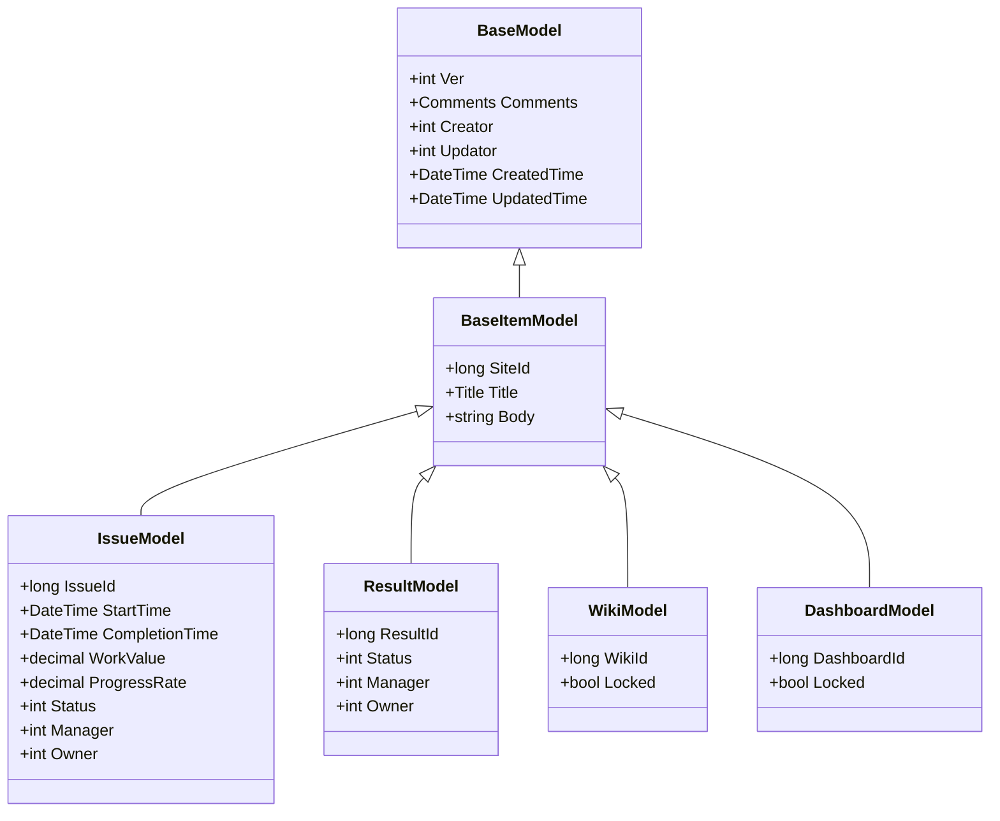

### Items テーブルとの関係

`Items` テーブルは全ての SiteType のレコードを横断的に管理する中間テーブルである。`ReferenceType` と `ReferenceId` によって、各型固有のテーブルにマッピングする。

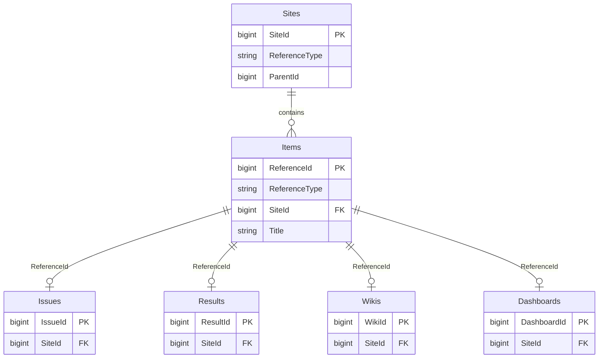

### ItemModel のディスパッチパターン

`ItemModel` は `Site.ReferenceType` に基づいて各 Utilities クラスにディスパッチする。約 90 箇所の switch 文が存在する。

```csharp
// ItemModel.cs - ディスパッチの基本パターン
switch (Site.ReferenceType)
{
    case "Sites":
        return SiteUtilities.SiteMenu(context: context, ss: ss);
    case "Dashboards":
        return DashboardUtilities.Index(context: context, ss: ss);
    case "Issues":
        return IssueUtilities.Index(context: context, ss: ss);
    case "Results":
        return ResultUtilities.Index(context: context, ss: ss);
    default:
        return HtmlTemplates.Error(context: context, ...);
}
```

### CodeDefiner による自動生成

プリザンターのモデルコードの多くは `CodeDefiner` によって定義ファイルから自動生成される。新規 SiteType を追加する場合、以下の定義が必要となる。

| 定義ファイル                          | 役割                                          |
| ------------------------------------- | --------------------------------------------- |
| `Definition_Column/` 配下の JSON      | カラム定義（型、制約、表示名）                |
| `Definition_Code/` 配下のテンプレート | Model・Utilities・Validators の C# コード生成 |
| `Definition_Sql/` 配下の定義          | SQL ステートメント生成                        |
| `Def.cs`                              | 定義の読み込み・インデックス構築              |

---

## スレッド型メッセージング機能の要件

### 機能概要

Rocket.Chat・Mattermost・Slack のようなスレッド型のリアルタイムメッセージング機能を実現する。プリザンターのサイト階層の中に「チャンネル」を配置し、その中でメッセージのやり取りとスレッド返信を行う。

### Rocket.Chat / Mattermost / Slack の共通構造

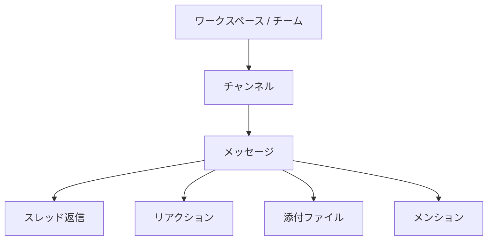

### プリザンターの概念へのマッピング

| チャットツールの概念 | プリザンターへのマッピング                           |
| -------------------- | ---------------------------------------------------- |
| ワークスペース       | テナント                                             |
| チーム               | サイト（フォルダ）                                   |
| チャンネル           | Threads サイト（ReferenceType = `Threads`）          |
| メッセージ           | Thread レコード（`ParentId = 0` のルートメッセージ） |
| スレッド返信         | Thread レコード（`ParentId` で親を参照）             |
| リアクション         | ThreadReactions テーブル                             |
| メンション           | メッセージ本文内の `@ユーザ名` パース                |
| 添付ファイル         | 既存の Binaries テーブルを流用                       |

### 要件一覧

| 区分               | 要件                                                     |
| ------------------ | -------------------------------------------------------- |
| 基本機能           | チャンネル（Threads サイト）の作成・設定・削除           |
| 基本機能           | メッセージの投稿・編集・削除                             |
| 基本機能           | スレッド返信（メッセージに対する返信ツリー）             |
| 基本機能           | メッセージの時系列表示（新しい順 / 古い順）              |
| コミュニケーション | メンション（`@ユーザ名`、`@all`、`@here`）               |
| コミュニケーション | リアクション（絵文字リアクション）                       |
| 検索               | メッセージ全文検索                                       |
| 通知               | メンション時の通知（メール・Teams 等）                   |
| 通知               | スレッド返信時の通知                                     |
| 権限               | 既存のサイト権限モデルの継承                             |
| 権限               | メッセージ編集・削除の権限制御（投稿者本人 / 管理者）    |
| ファイル           | メッセージへのファイル添付（既存 Binaries テーブル活用） |
| Markdown           | メッセージ本文での Markdown レンダリング                 |
| API                | メッセージ CRUD の Web API 対応                          |
| ServerScript       | サーバースクリプトからのメッセージ操作                   |

---

## データベーススキーマ設計

### Threads テーブル

スレッド型メッセージの主テーブル。`BaseItemModel` を継承し、親子関係でスレッド構造を表現する。

```sql
CREATE TABLE [Threads] (
    -- BaseModel 共通カラム
    [Ver]           int           NOT NULL DEFAULT 1,
    [Comments]      nvarchar(max) NOT NULL DEFAULT '',
    [Creator]       int           NOT NULL,
    [Updator]       int           NOT NULL,
    [CreatedTime]   datetime      NOT NULL,
    [UpdatedTime]   datetime      NOT NULL,

    -- BaseItemModel 共通カラム
    [SiteId]        bigint        NOT NULL,
    [Title]         nvarchar(max) NOT NULL DEFAULT '',
    [Body]          nvarchar(max) NOT NULL DEFAULT '',

    -- Threads 固有カラム
    [ThreadId]      bigint        NOT NULL IDENTITY(1,1),
    [ParentId]      bigint        NOT NULL DEFAULT 0,  -- 0 = ルートメッセージ
    [Locked]        bit           NOT NULL DEFAULT 0,

    -- 拡張カラム（ClassA-Z, NumA-Z, DateA-Z 等）
    -- BaseItemModel から継承

    CONSTRAINT [PK_Threads] PRIMARY KEY CLUSTERED ([ThreadId])
);

CREATE NONCLUSTERED INDEX [IX_Threads_SiteId]
    ON [Threads] ([SiteId], [CreatedTime] DESC);
CREATE NONCLUSTERED INDEX [IX_Threads_ParentId]
    ON [Threads] ([ParentId], [CreatedTime] ASC);
```

### ThreadReactions テーブル

メッセージへのリアクション（絵文字リアクション）を管理する。

```sql
CREATE TABLE [ThreadReactions] (
    [ThreadId]      bigint        NOT NULL,
    [UserId]        int           NOT NULL,
    [Reaction]      nvarchar(64)  NOT NULL,  -- リアクション識別子
    [CreatedTime]   datetime      NOT NULL,

    CONSTRAINT [PK_ThreadReactions]
        PRIMARY KEY CLUSTERED ([ThreadId], [UserId], [Reaction]),
    CONSTRAINT [FK_ThreadReactions_Threads]
        FOREIGN KEY ([ThreadId]) REFERENCES [Threads]([ThreadId])
        ON DELETE CASCADE
);

CREATE NONCLUSTERED INDEX [IX_ThreadReactions_ThreadId]
    ON [ThreadReactions] ([ThreadId]);
```

### ThreadMentions テーブル

メンション通知の管理。本文パースの結果を格納し、通知処理に使用する。

```sql
CREATE TABLE [ThreadMentions] (
    [ThreadId]      bigint        NOT NULL,
    [UserId]        int           NOT NULL,
    [MentionType]   nvarchar(16)  NOT NULL DEFAULT 'user',  -- user / all / here
    [IsRead]        bit           NOT NULL DEFAULT 0,
    [CreatedTime]   datetime      NOT NULL,

    CONSTRAINT [PK_ThreadMentions]
        PRIMARY KEY CLUSTERED ([ThreadId], [UserId]),
    CONSTRAINT [FK_ThreadMentions_Threads]
        FOREIGN KEY ([ThreadId]) REFERENCES [Threads]([ThreadId])
        ON DELETE CASCADE
);

CREATE NONCLUSTERED INDEX [IX_ThreadMentions_UserId]
    ON [ThreadMentions] ([UserId], [IsRead]);
```

### ER 図

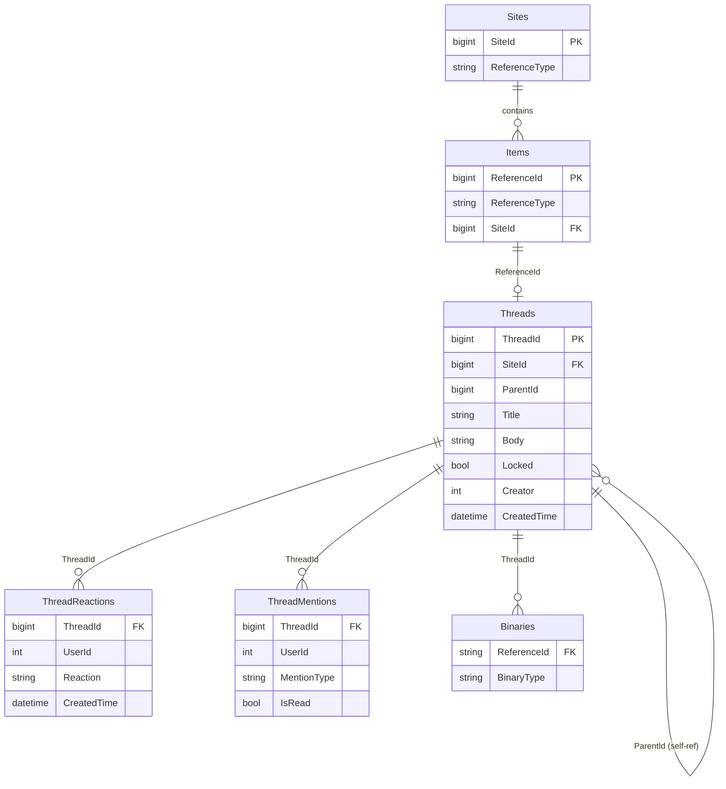

### スレッド構造の表現

`ParentId` を使った自己参照で親子関係を表現する。

```
チャンネル (SiteId = 100, ReferenceType = "Threads")
├── メッセージ A (ThreadId=1, ParentId=0)   ← ルートメッセージ
│   ├── 返信 A-1  (ThreadId=4, ParentId=1)
│   └── 返信 A-2  (ThreadId=5, ParentId=1)
├── メッセージ B (ThreadId=2, ParentId=0)   ← ルートメッセージ
│   └── 返信 B-1  (ThreadId=6, ParentId=2)
└── メッセージ C (ThreadId=3, ParentId=0)   ← ルートメッセージ
```

ルートメッセージのみ `Title` を持ち、返信は `Body` のみで構成する。

---

## Model / Controller / Utilities 実装設計

### モデルクラス設計

#### ThreadModel

```csharp
// Models/Threads/ThreadModel.cs
public class ThreadModel : BaseItemModel
{
    public long ThreadId = 0;
    public long ParentId = 0;
    public bool Locked = false;

    // スレッド固有のプロパティ
    public bool IsRootMessage => ParentId == 0;
    public int ReplyCount { get; set; }
    public DateTime? LastReplyTime { get; set; }
}
```

#### ThreadCollection

```csharp
// Models/Threads/ThreadCollection.cs
public class ThreadCollection : List<ThreadModel>
{
    // ルートメッセージの一覧取得
    // スレッド返信の一覧取得
    // ページネーション対応
}
```

#### ThreadApiModel

```csharp
// Models/Threads/ThreadApiModel.cs
public class ThreadApiModel
{
    public long ThreadId;
    public long SiteId;
    public long ParentId;
    public string Title;
    public string Body;
    public int Creator;
    public string CreatorName;
    public DateTime CreatedTime;
    public DateTime UpdatedTime;
    public int ReplyCount;
    public List<ThreadReactionApiModel> Reactions;
}
```

### ファイル構成

```
Implem.Pleasanter/
├── Models/
│   └── Threads/
│       ├── ThreadModel.cs           -- データモデル
│       ├── ThreadCollection.cs      -- コレクション
│       ├── ThreadUtilities.cs       -- 画面生成・業務ロジック
│       ├── ThreadValidators.cs      -- バリデーション
│       ├── ThreadApiModel.cs        -- API モデル
│       └── ThreadExportModel.cs     -- エクスポートモデル
└── Libraries/
    └── DataTypes/
        └── ThreadReaction.cs        -- リアクション型
```

### ItemModel への統合

`ItemModel.cs` の各 switch 文に `case "Threads":` を追加する。対象は約 20 箇所のディスパッチポイントである。

```csharp
// ItemModel.cs - 代表的なディスパッチポイント
public string Index(Context context)
{
    switch (Site.ReferenceType)
    {
        case "Sites":
            return SiteUtilities.SiteMenu(context: context, ss: ss);
        // ... 既存のケース ...
        case "Threads":
            return ThreadUtilities.Index(context: context, ss: ss);
        default:
            return HtmlTemplates.Error(context: context, ...);
    }
}

public string Create(Context context)
{
    switch (Site.ReferenceType)
    {
        // ... 既存のケース ...
        case "Threads":
            return ThreadUtilities.Create(context: context, ss: ss);
    }
}
```

主要なディスパッチポイントを以下にまとめる。

| メソッド      | 対応する ThreadUtilities メソッド | 備考                       |
| ------------- | --------------------------------- | -------------------------- |
| `Index`       | `ThreadUtilities.Index`           | チャンネル内メッセージ一覧 |
| `IndexJson`   | `ThreadUtilities.IndexJson`       | Ajax 更新                  |
| `Editor`      | `ThreadUtilities.Editor`          | メッセージ編集画面         |
| `EditorJson`  | `ThreadUtilities.EditorJson`      | メッセージ編集 Ajax        |
| `Create`      | `ThreadUtilities.Create`          | メッセージ投稿             |
| `Update`      | `ThreadUtilities.Update`          | メッセージ編集             |
| `Delete`      | `ThreadUtilities.Delete`          | メッセージ削除             |
| `CreateByApi` | `ThreadUtilities.CreateByApi`     | API 経由投稿               |
| `UpdateByApi` | `ThreadUtilities.UpdateByApi`     | API 経由編集               |
| `DeleteByApi` | `ThreadUtilities.DeleteByApi`     | API 経由削除               |
| `GetByApi`    | `ThreadUtilities.GetByApi`        | API 経由取得               |

### SiteUtilities への統合

`SiteUtilities.cs` の ReferenceType 選択肢に `Threads` を追加する。

```csharp
// SiteUtilities.cs - ReferenceType ドロップダウン
new Dictionary<string, ControlData>
{
    { "Sites", new ControlData(...) },
    { "Dashboards", new ControlData(...) },
    { "Issues", new ControlData(...) },
    { "Results", new ControlData(...) },
    { "Wikis", new ControlData(...) },
    { "Threads", new ControlData(
        text: Displays.Get(context: context, id: "Threads"),
        css: " always-send") },
};

// ReferenceTypeDisplayName
case "Threads":
    return Displays.Get(context: context, id: "Threads");
```

---

## フロントエンド UI 設計

### チャンネル一覧画面（Index）

既存の一覧表示（テーブル形式）ではなく、メッセージングに適したタイムライン形式の UI を設計する。

```
+----------------------------------------------------------+
| #general                                    [設定] [検索] |
+----------------------------------------------------------+
| [メッセージ入力欄]                            [送信]      |
+----------------------------------------------------------+
| 田中太郎          2026/03/03 10:30                        |
| プロジェクトの進捗について共有します。                    |
| > 添付: report.pdf                                        |
| [返信 3件]  [リアクション: 👍2 ❤️1]                       |
+----------------------------------------------------------+
| 佐藤花子          2026/03/03 09:15                        |
| 明日の会議資料をアップロードしました。                    |
| [返信 1件]                                                |
+----------------------------------------------------------+
| 鈴木一郎          2026/03/02 17:00                        |
| @田中太郎 レビューお願いします。                          |
| [返信なし]                                                |
+----------------------------------------------------------+
```

### スレッド表示（返信パネル）

メッセージをクリックすると右側パネルまたはモーダルでスレッドが展開される。

```
+-------------------------------+  +---------------------------+
| #general                      |  | スレッド                  |
|                               |  +---------------------------+
| メッセージ一覧               |  | 田中太郎   03/03 10:30    |
| ...                           |  | プロジェクトの進捗につ   |
|                               |  | いて共有します。          |
| [田中太郎のメッセージ]  ←選択 |  +---------------------------+
| プロジェクトの進捗について   |  | 佐藤花子   03/03 10:45    |
|                               |  | 了解しました。確認します  |
|                               |  +---------------------------+
|                               |  | 鈴木一郎   03/03 11:00    |
|                               |  | 資料の p.3 に誤りがあり  |
|                               |  | ます。                    |
|                               |  +---------------------------+
|                               |  | [返信入力欄]    [送信]    |
+-------------------------------+  +---------------------------+
```

### HTML 生成方式

プリザンターの既存パターンに従い、サーバーサイドの `HtmlBuilder` でメッセージ一覧を生成する。

```csharp
// Libraries/HtmlParts/HtmlThreads.cs
public static class HtmlThreads
{
    public static HtmlBuilder ThreadTimeline(
        this HtmlBuilder hb,
        Context context,
        SiteSettings ss,
        IEnumerable<ThreadModel> threads)
    {
        return hb.Div(
            id: "ThreadTimeline",
            css: "thread-timeline",
            action: () => threads.ForEach(thread =>
                hb.ThreadMessage(
                    context: context,
                    ss: ss,
                    thread: thread)));
    }

    private static HtmlBuilder ThreadMessage(
        this HtmlBuilder hb,
        Context context,
        SiteSettings ss,
        ThreadModel thread)
    {
        return hb.Div(
            css: "thread-message",
            attributes: new HtmlAttributes()
                .DataId(thread.ThreadId.ToString()),
            action: () => hb
                .Div(css: "thread-message-header", action: () => hb
                    .Span(css: "thread-message-creator",
                        action: () => hb.Text(
                            SiteInfo.UserName(
                                context: context,
                                userId: thread.Creator)))
                    .Span(css: "thread-message-time",
                        action: () => hb.Text(
                            thread.CreatedTime
                                .ToLocal(context: context)
                                .ToString("yyyy/MM/dd HH:mm"))))
                .Div(css: "thread-message-body", action: () => hb
                    .Raw(thread.Body.ToMarkdown(context: context)))
                .Div(css: "thread-message-footer", action: () => hb
                    .ThreadReplyCount(thread: thread)
                    .ThreadReactions(thread: thread)));
    }
}
```

### JavaScript による動的操作

メッセージ投稿・スレッド展開は Ajax で処理する。

```javascript
// wwwroot/src/scripts/generals/thread.js
$p.postThreadMessage = function () {
    var data = $p.getData($('#ThreadMessageForm'));
    $p.ajax($('#ThreadTimeline').attr('data-action'), 'post', data, $p.onPostThreadMessage);
};

$p.openThread = function (threadId) {
    $p.ajax('/api/items/' + threadId + '/thread', 'get', {}, $p.onOpenThread);
};

$p.onOpenThread = function (data) {
    $('#ThreadPanel').html(data.html);
    $('#ThreadPanel').addClass('open');
};
```

---

## API 設計

### エンドポイント

既存の Items API パターンに従い、`/api/items/{id}` 配下にスレッド操作を追加する。

| メソッド | エンドポイント                 | 説明                 |
| -------- | ------------------------------ | -------------------- |
| POST     | `/api/items/{siteId}/create`   | メッセージ投稿       |
| PUT      | `/api/items/{threadId}/update` | メッセージ編集       |
| DELETE   | `/api/items/{threadId}/delete` | メッセージ削除       |
| POST     | `/api/items/{siteId}/get`      | メッセージ一覧取得   |
| POST     | `/api/items/{threadId}/thread` | スレッド返信一覧取得 |
| POST     | `/api/items/{threadId}/react`  | リアクション追加     |
| DELETE   | `/api/items/{threadId}/react`  | リアクション削除     |

### リクエスト・レスポンス例

#### メッセージ投稿

```json
// POST /api/items/{siteId}/create
// リクエスト
{
    "ApiVersion": 1.1,
    "ApiKey": "...",
    "Title": "新しいトピック",
    "Body": "プロジェクトの進捗について共有します。\n@佐藤花子 確認お願いします。",
    "ParentId": 0
}

// レスポンス
{
    "StatusCode": 200,
    "Response": {
        "Id": 12345,
        "ThreadId": 12345,
        "ParentId": 0,
        "Title": "新しいトピック",
        "Body": "プロジェクトの進捗について...",
        "Creator": 1,
        "CreatedTime": "2026-03-03T10:30:00"
    }
}
```

#### スレッド返信投稿

```json
// POST /api/items/{siteId}/create
// リクエスト
{
    "ApiVersion": 1.1,
    "ApiKey": "...",
    "Body": "了解しました。確認します。",
    "ParentId": 12345
}
```

#### メッセージ一覧取得

```json
// POST /api/items/{siteId}/get
// リクエスト
{
    "ApiVersion": 1.1,
    "ApiKey": "...",
    "View": {
        "ColumnFilterHash": {
            "ParentId": "[0]"
        },
        "ColumnSorterHash": {
            "CreatedTime": "desc"
        }
    },
    "Offset": 0,
    "PageSize": 50
}

// レスポンス
{
    "StatusCode": 200,
    "Response": {
        "Offset": 0,
        "PageSize": 50,
        "TotalCount": 128,
        "Data": [
            {
                "ThreadId": 12345,
                "ParentId": 0,
                "Title": "新しいトピック",
                "Body": "プロジェクトの進捗について...",
                "Creator": 1,
                "CreatorName": "田中太郎",
                "CreatedTime": "2026-03-03T10:30:00",
                "ReplyCount": 3,
                "LastReplyTime": "2026-03-03T11:00:00",
                "Reactions": [
                    { "Reaction": "+1", "Count": 2 }
                ]
            }
        ]
    }
}
```

---

## CodeDefiner 統合方針

### 定義ファイルの追加

以下の定義ファイルを追加して CodeDefiner による自動生成に対応する。

#### カラム定義

`App_Data/Definitions/Definition_Column/` 配下に Threads テーブルのカラム定義 JSON を追加する。

```json
// Threads_ThreadId.json
{
    "Id": "Threads_ThreadId",
    "ModelName": "Thread",
    "TableName": "Threads",
    "ColumnName": "ThreadId",
    "LabelText": "ID",
    "TypeCs": "long",
    "TypeDb": "bigint",
    "Identity": true,
    "Pk": true,
    "ItemId": true,
    "GridColumn": 10,
    "EditorColumn": true
}
```

```json
// Threads_ParentId.json
{
    "Id": "Threads_ParentId",
    "ModelName": "Thread",
    "TableName": "Threads",
    "ColumnName": "ParentId",
    "LabelText": "親メッセージ",
    "TypeCs": "long",
    "TypeDb": "bigint",
    "DefaultValue": "0"
}
```

#### コード生成テンプレート

`Definition_Code/` 配下のテンプレートは既存の `#TableName#` / `#ModelName#` プレースホルダで自動展開されるため、`Threads` / `Thread` がテンプレートに渡されることで以下が自動生成される。

- `ThreadModel.cs` の基本プロパティ
- `Rds.Threads*()` メソッド群（CRUD SQL）
- `ThreadCollection.cs`
- ItemModel.cs 内の switch ケース

### ColumnDefinitionCollection への登録

`Def.cs` の `ColumnDefinitionCollection` に Threads テーブルのカラム定義が読み込まれ、以下のメソッドで利用可能になる。

```csharp
Def.ExistsTable("Threads")               // true
Def.TableNameByModelName("Thread")        // "Threads"
Def.ModelNameByTableName("Threads")       // "Thread"
```

### 派生テーブル（\_history / \_deleted）

既存パターンに従い、変更・削除の追跡用に派生テーブルを生成する。プリザンターの全 28 テーブルが同じ派生テーブルパターンを採用しており、Threads も同様に対応する。

| テーブル          | 用途                               | レコード挿入タイミング           |
| ----------------- | ---------------------------------- | -------------------------------- |
| `Threads`         | 主テーブル                         | メッセージ投稿時                 |
| `Threads_history` | 編集履歴（変更前スナップショット） | メッセージ更新時（`verUp=true`） |
| `Threads_deleted` | 論理削除レコードの退避先           | メッセージ削除時                 |

#### Threads_history テーブル

メッセージの更新時に、更新前の状態を `Threads_history` に保存する。カラム構成は主テーブルと同一（`History > 0` のカラム全て）。

```sql
CREATE TABLE [Threads_history] (
    -- Threads テーブルと同一カラム構成
    [ThreadId]      bigint        NOT NULL,
    [Ver]           int           NOT NULL,
    [SiteId]        bigint        NOT NULL,
    [Title]         nvarchar(max) NOT NULL DEFAULT '',
    [Body]          nvarchar(max) NOT NULL DEFAULT '',
    [ParentId]      bigint        NOT NULL DEFAULT 0,
    [Locked]        bit           NOT NULL DEFAULT 0,
    [Comments]      nvarchar(max) NOT NULL DEFAULT '',
    [Creator]       int           NOT NULL,
    [Updator]       int           NOT NULL,
    [CreatedTime]   datetime      NOT NULL,
    [UpdatedTime]   datetime      NOT NULL,
    -- 拡張カラム（ClassA-Z, NumA-Z, DateA-Z 等）も同一

    CONSTRAINT [PK_Threads_history] PRIMARY KEY CLUSTERED ([ThreadId], [Ver])
);
```

**更新時の SQL 処理フロー**（`CopyToStatement` パターン）:

```sql
-- 1. 更新前の状態を _history にコピー
INSERT INTO "Threads_history"
    ("ThreadId", "Ver", "SiteId", "Title", "Body", "ParentId",
     "Locked", "Comments", "Creator", "Updator", "CreatedTime", "UpdatedTime",
     "ClassA", "ClassB", ...)
SELECT
    "ThreadId", "Ver", "SiteId", "Title", "Body", "ParentId",
    "Locked", "Comments", "Creator", "Updator", "CreatedTime", "UpdatedTime",
    "ClassA", "ClassB", ...
FROM "Threads"
WHERE "ThreadId" = @ThreadId;

-- 2. Ver をインクリメントして主テーブルを更新
UPDATE "Threads"
SET "Ver" = "Ver" + 1,
    "Body" = @NewBody,
    "Updator" = @UserId,
    "UpdatedTime" = GETDATE()
WHERE "ThreadId" = @ThreadId;
```

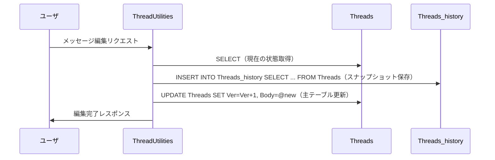

#### Threads_deleted テーブル

メッセージの削除時に、削除対象レコードを `Threads_deleted` に退避する。カラム構成は主テーブルと同一。

```sql
CREATE TABLE [Threads_deleted] (
    -- Threads テーブルと同一カラム構成
    [ThreadId]      bigint        NOT NULL,
    [Ver]           int           NOT NULL,
    [SiteId]        bigint        NOT NULL,
    [Title]         nvarchar(max) NOT NULL DEFAULT '',
    [Body]          nvarchar(max) NOT NULL DEFAULT '',
    [ParentId]      bigint        NOT NULL DEFAULT 0,
    [Locked]        bit           NOT NULL DEFAULT 0,
    [Comments]      nvarchar(max) NOT NULL DEFAULT '',
    [Creator]       int           NOT NULL,
    [Updator]       int           NOT NULL,
    [CreatedTime]   datetime      NOT NULL,
    [UpdatedTime]   datetime      NOT NULL,
    -- 拡張カラム（ClassA-Z, NumA-Z, DateA-Z 等）も同一

    CONSTRAINT [PK_Threads_deleted] PRIMARY KEY CLUSTERED ([ThreadId])
);
```

**削除時の SQL 処理フロー**（`DeleteStatement` パターン）:

```sql
-- 1. 削除者・削除日時を記録
UPDATE "Threads"
SET "Updator" = @UserId,
    "UpdatedTime" = GETDATE()
WHERE "ThreadId" = @ThreadId;

-- 2. _deleted テーブルに退避コピー
INSERT INTO "Threads_deleted"
    ("ThreadId", "Ver", "SiteId", "Title", "Body", "ParentId",
     "Locked", "Comments", "Creator", "Updator", "CreatedTime", "UpdatedTime",
     "ClassA", "ClassB", ...)
SELECT
    "ThreadId", "Ver", "SiteId", "Title", "Body", "ParentId",
    "Locked", "Comments", "Creator", "Updator", "CreatedTime", "UpdatedTime",
    "ClassA", "ClassB", ...
FROM "Threads"
WHERE "ThreadId" = @ThreadId;

-- 3. 主テーブルから削除
DELETE FROM "Threads"
WHERE "ThreadId" = @ThreadId;
```

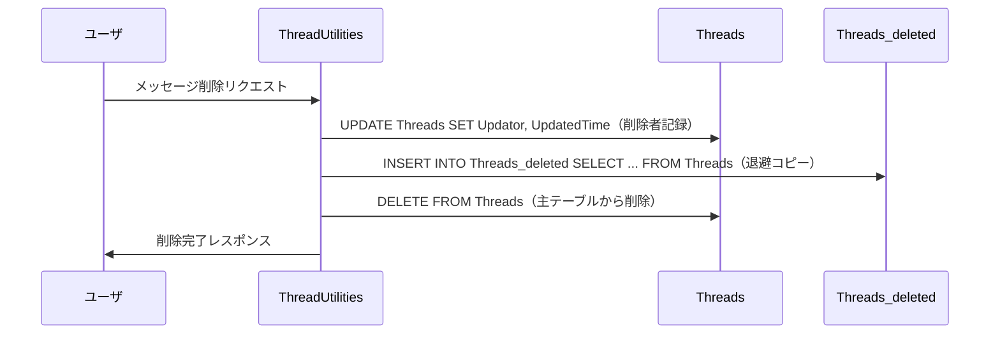

#### 復元（Restore）処理

管理者が削除済みメッセージを復元する場合、`Threads_deleted` から `Threads` にレコードを戻す。

```sql
-- 1. 復元者・復元日時を記録
UPDATE "Threads_deleted"
SET "Updator" = @UserId,
    "UpdatedTime" = GETDATE()
WHERE "ThreadId" = @ThreadId;

-- 2. 主テーブルにコピー
INSERT INTO "Threads"
    ("ThreadId", "Ver", "SiteId", "Title", "Body", "ParentId",
     "Locked", "Comments", "Creator", "Updator", "CreatedTime", "UpdatedTime",
     "ClassA", "ClassB", ...)
SELECT
    "ThreadId", "Ver", "SiteId", "Title", "Body", "ParentId",
    "Locked", "Comments", "Creator", "Updator", "CreatedTime", "UpdatedTime",
    "ClassA", "ClassB", ...
FROM "Threads_deleted"
WHERE "ThreadId" = @ThreadId;

-- 3. _deleted テーブルから削除
DELETE FROM "Threads_deleted"
WHERE "ThreadId" = @ThreadId;
```

#### スレッド返信の連鎖削除

ルートメッセージが削除された場合、その配下の返信もまとめて `Threads_deleted` に退避する。

```sql
-- ルートメッセージと配下の返信を一括で _deleted に退避
INSERT INTO "Threads_deleted" (...)
SELECT ... FROM "Threads"
WHERE "ThreadId" = @ThreadId
   OR "ParentId" = @ThreadId;

DELETE FROM "Threads"
WHERE "ThreadId" = @ThreadId
   OR "ParentId" = @ThreadId;
```

#### 拡張カラムの取り扱い

既存の Issues・Results と同様に、`columnNames.ForEach()` による動的拡張カラムのコピーを `CopyToStatement` に実装する。
これにより `ExtendedColumnsSet` で追加されたカスタムカラムも `_history` に正しくコピーされる。

```csharp
// Rds.cs - Threads 用 CopyToStatement
public static SqlStatement ThreadsCopyToStatement(
    SqlWhereCollection where,
    Sqls.TableTypes tableType,
    List<string> columnNames)
{
    var sql = new StringBuilder();
    sql.Append("INSERT INTO \"Threads_{0}\" ", tableType.ToString().ToLower());
    sql.Append("(\"ThreadId\", \"Ver\", \"SiteId\", ...");
    columnNames.ForEach(cn => sql.Append($", \"{cn}\""));  // 動的拡張カラム
    sql.Append(") ");
    sql.Append("SELECT \"ThreadId\", \"Ver\", \"SiteId\", ...");
    columnNames.ForEach(cn => sql.Append($", \"{cn}\""));  // 動的拡張カラム
    sql.Append(" FROM \"Threads\" ");
    return new SqlStatement(sql.ToString(), where);
}
```

---

## SiteSettings への統合

### Threads 固有の設定項目

`SiteSettings.cs` に Threads サイト固有の設定を追加する。

```csharp
// SiteSettings.cs に追加するプロパティ
public class SiteSettings
{
    // Threads 固有設定
    public bool? ThreadsEnableReactions;          // リアクション機能の有効化
    public bool? ThreadsEnableMentions;            // メンション機能の有効化
    public bool? ThreadsEnableThreadReplies;       // スレッド返信の有効化
    public int? ThreadsMessageMaxLength;           // メッセージ最大文字数
    public bool? ThreadsEnableMarkdown;            // Markdown 有効化
    public bool? ThreadsEnableFileAttachments;     // ファイル添付の有効化
}
```

### 設定画面のタブ追加

```csharp
// SiteUtilities.cs - 設定タブに Threads 固有タブを追加
case "Threads":
    hb.Tab(new Tab("ThreadsSettingsEditor",
        Displays.Get(context: context, id: "ThreadsSettings")));
    break;
```

---

## 通知・メンション処理

### メンションの解析

メッセージ投稿時に本文から `@ユーザ名` を正規表現でパースし、`ThreadMentions` テーブルに記録する。

```csharp
// Libraries/DataTypes/ThreadMention.cs
public static class ThreadMentionParser
{
    private static readonly Regex MentionPattern =
        new Regex(@"@(\w+)", RegexOptions.Compiled);

    public static IEnumerable<ThreadMention> Parse(
        Context context,
        string body)
    {
        return MentionPattern.Matches(body)
            .Cast<Match>()
            .Select(m => m.Groups[1].Value)
            .Distinct()
            .Select(loginId => new ThreadMention
            {
                UserId = ResolveUserId(context, loginId),
                MentionType = loginId switch
                {
                    "all" => "all",
                    "here" => "here",
                    _ => "user"
                }
            })
            .Where(m => m.UserId > 0 || m.MentionType != "user");
    }
}
```

### 通知の統合

既存の通知フレームワーク（`Notification` クラス）を活用してメンション通知を送信する。

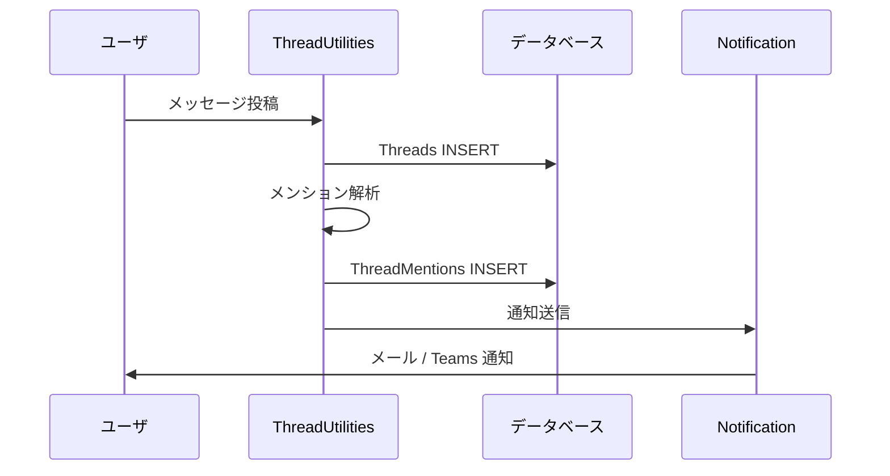

---

## 権限制御

### 基本方針

Threads サイトの権限は既存のサイト権限モデルを継承する。

| 操作                 | 必要権限                                  |
| -------------------- | ----------------------------------------- |
| チャンネル閲覧       | サイトの読み取り権限                      |
| メッセージ投稿       | サイトの作成権限                          |
| 自分のメッセージ編集 | サイトの更新権限 + 投稿者本人             |
| 他人のメッセージ編集 | サイトの管理権限                          |
| メッセージ削除       | サイトの削除権限 + (投稿者本人 or 管理者) |
| リアクション         | サイトの読み取り権限（閲覧可能なら可）    |
| サイト設定変更       | サイトの管理権限                          |

### 投稿者本人チェック

```csharp
// ThreadValidators.cs
public static ErrorData OnUpdating(
    Context context,
    SiteSettings ss,
    ThreadModel threadModel)
{
    if (!context.HasPermission(ss: ss, type: Permissions.Types.Update))
        return new ErrorData(type: Error.Types.HasNotPermission);
    if (threadModel.Creator != context.UserId
        && !context.HasPermission(ss: ss, type: Permissions.Types.ManageSite))
        return new ErrorData(type: Error.Types.HasNotPermission);
    return new ErrorData(type: Error.Types.None);
}
```

---

## ファイル添付機能設計

メッセージにファイルを添付する機能を、既存の `Binaries` テーブルおよびアップロード機構を活用して実装する。

### Binaries テーブルとの連携

プリザンターのファイル添付は `Binaries` テーブルで一元管理されている。
Threads メッセージの添付ファイルも同テーブルに格納し、`ReferenceId` に `ThreadId` を設定することで紐づける。

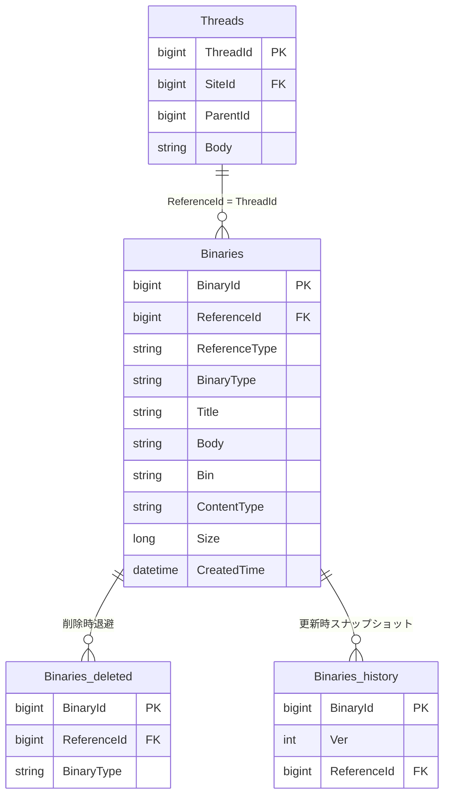

### アップロード処理フロー

ファイルアップロードは既存の `BinariesController` と `BinaryUtilities.UploadFile` を活用する。

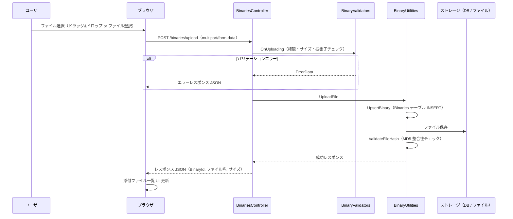

#### メッセージ投稿時の処理

```csharp
// ThreadUtilities.cs - メッセージ作成時のファイル添付処理
public static string Create(Context context, SiteSettings ss)
{
    var threadModel = new ThreadModel(context, ss);
    threadModel.SetByForm(context: context, ss: ss);
    // バリデーション
    var errorData = ThreadValidators.OnCreating(context, ss, threadModel);
    if (errorData.Type != Error.Types.None)
        return errorData.MessageJson(context: context);
    // トランザクション内でメッセージ作成 + 添付ファイル保存
    var statements = new List<SqlStatement>();
    statements.Add(Rds.InsertThreads(param: threadModel.ParamDefault(context)));
    statements.Add(Rds.InsertItems(
        param: Rds.ItemsParam()
            .ReferenceId(raw: Def.Sql.Identity)
            .ReferenceType("Threads")
            .SiteId(threadModel.SiteId)
            .Title(threadModel.Title)));
    // 添付ファイルの Binaries レコード作成
    threadModel.Attachments?.ForEach(attachment =>
    {
        statements.Add(Rds.InsertBinaries(
            param: Rds.BinariesParam()
                .TenantId(context.TenantId)
                .ReferenceId(threadModel.ThreadId)
                .BinaryType("Attachments")
                .Title(attachment.Name)
                .Bin(attachment.Base64Binary())
                .ContentType(attachment.ContentType)
                .Size(attachment.Size)
                .Creator(context.UserId)
                .Updator(context.UserId)));
    });
    Repository.ExecuteNonQuery(context: context, statements: statements.ToArray());
    // メンション解析・通知
    ProcessMentions(context, ss, threadModel);
    return EditorResponse(context, ss, threadModel).ToJson();
}
```

### ダウンロード・プレビュー

既存の `BinariesController` のルーティングをそのまま利用する。

| メソッド | エンドポイント              | 説明                     |
| -------- | --------------------------- | ------------------------ |
| GET      | `/binaries/{guid}/show`     | ブラウザ内プレビュー表示 |
| GET      | `/binaries/{guid}/download` | ファイルダウンロード     |

```csharp
// HtmlThreads.cs - メッセージ内の添付ファイル表示
private static HtmlBuilder ThreadAttachments(
    this HtmlBuilder hb,
    Context context,
    ThreadModel thread)
{
    var attachments = Binaries.Get(
        context: context,
        referenceId: thread.ThreadId,
        binaryType: "Attachments");
    if (!attachments.Any()) return hb;
    return hb.Div(
        css: "thread-attachments",
        action: () => attachments.ForEach(binary =>
            hb.Div(
                css: "thread-attachment-item",
                action: () => hb
                    .A(
                        href: Locations.Get(
                            context: context,
                            parts: new string[]
                            {
                                "binaries",
                                binary.Guid,
                                "show"
                            }),
                        target: "_blank",
                        action: () => hb
                            .Span(css: IsImageFile(binary.ContentType)
                                ? "thread-attachment-thumbnail"
                                : "thread-attachment-icon")
                            .Img(
                                src: IsImageFile(binary.ContentType)
                                    ? $"/binaries/{binary.Guid}/show"
                                    : GetFileIcon(binary.ContentType),
                                css: "thread-attachment-preview"))
                    .Div(
                        css: "thread-attachment-info",
                        action: () => hb
                            .A(
                                href: $"/binaries/{binary.Guid}/download",
                                action: () => hb
                                    .Text(binary.Title))
                            .Span(
                                css: "thread-attachment-size",
                                action: () => hb
                                    .Text(FormatFileSize(binary.Size))))
                    .Div(
                        css: "thread-attachment-delete",
                        attributes: new HtmlAttributes()
                            .DataId(binary.Guid),
                        _using: CanDeleteAttachment(context, thread),
                        action: () => hb
                            .Span(css: "ui-icon ui-icon-trash")))));
}

private static bool IsImageFile(string contentType)
{
    return contentType?.StartsWith("image/") == true;
}

private static string FormatFileSize(long size)
{
    if (size < 1024) return $"{size} B";
    if (size < 1024 * 1024) return $"{size / 1024} KB";
    return $"{size / (1024 * 1024)} MB";
}
```

### ストレージ方式

既存の `BinaryStorage.json` パラメータに従い、ストレージ方式を選択する。

| パラメータ                       | 値        | 説明                                        |
| -------------------------------- | --------- | ------------------------------------------- |
| `Provider`                       | `"Rds"`   | DB 内の `Binaries.Bin` カラムにバイナリ格納 |
| `Provider`                       | `"Local"` | ファイルシステムに保存                      |
| `TemporaryBinaryStorageProvider` | `"Rds"`   | 一時バイナリの格納先                        |

```json
// App_Data/Parameters/BinaryStorage.json
{
    "Provider": "Rds",
    "LocalFolderLimitSize": 3,
    "LimitTotalSize": 0,
    "ExcludedExtensions": [],
    "TemporaryBinaryStorageProvider": "Rds"
}
```

### バリデーション

既存の `BinaryValidators` の検証ロジックを適用する。

```csharp
// BinaryValidators.cs のチェック項目を Threads にも適用
public static class ThreadAttachmentValidators
{
    public static ErrorData OnUploading(
        Context context,
        SiteSettings ss,
        Attachment attachment)
    {
        // 1. 権限チェック
        if (!context.HasPermission(ss: ss, type: Permissions.Types.Create))
            return new ErrorData(type: Error.Types.HasNotPermission);

        // 2. 個別ファイルサイズチェック（MB単位）
        var column = ss.GetColumn(
            context: context,
            columnName: "AttachmentsA");
        if (column?.LimitSize > 0
            && attachment.Size > column.LimitSize * 1024 * 1024)
            return new ErrorData(type: Error.Types.OverLimitSize);

        // 3. 合計サイズチェック
        if (column?.TotalLimitSize > 0)
        {
            var totalSize = Repository.ExecuteScalar_long(
                context: context,
                statements: Rds.SelectBinaries(
                    column: Rds.BinariesColumn().Size(function: Sqls.Functions.Sum),
                    where: Rds.BinariesWhere()
                        .ReferenceId(ss.SiteId)
                        .BinaryType("Attachments")));
            if (totalSize + attachment.Size > column.TotalLimitSize * 1024 * 1024)
                return new ErrorData(type: Error.Types.OverTotalLimitSize);
        }

        // 4. ファイル数チェック（デフォルト上限: 30）
        if (column?.LimitQuantity > 0)
        {
            var count = Repository.ExecuteScalar_long(
                context: context,
                statements: Rds.SelectBinaries(
                    column: Rds.BinariesColumn().BinariesCount(),
                    where: Rds.BinariesWhere()
                        .ReferenceId(ss.SiteId)
                        .BinaryType("Attachments")));
            if (count >= column.LimitQuantity)
                return new ErrorData(type: Error.Types.OverLimitQuantity);
        }

        // 5. 拡張子チェック
        var extension = Path.GetExtension(attachment.Name)?.ToLower();
        if (ss.ExcludedExtensions()?.Contains(extension) == true)
            return new ErrorData(type: Error.Types.InvalidExtension);

        // 6. ファイル名チェック（255文字、禁止文字）
        if (attachment.Name?.Length > 255
            || attachment.Name?.Contains("..") == true
            || attachment.Name?.IndexOfAny(new[] { '/', '\\', ':' }) >= 0)
            return new ErrorData(type: Error.Types.InvalidFileName);

        return new ErrorData(type: Error.Types.None);
    }
}
```

| チェック項目       | 設定箇所                | デフォルト値                      |
| ------------------ | ----------------------- | --------------------------------- |
| 個別サイズ上限     | `column.LimitSize`      | カラム定義による（MB）            |
| 合計サイズ上限     | `column.TotalLimitSize` | カラム定義による（MB）            |
| ファイル数上限     | `column.LimitQuantity`  | 30                                |
| 拡張子制限         | `Parameters/Form.json`  | 42 種の実行可能ファイルをブロック |
| ファイル名長       | ハードコード            | 255 文字                          |
| テナントストレージ | `ContractSettings`      | テナント全体のストレージ容量      |

### フロントエンド UI

#### メッセージ入力欄のファイル添付 UI

```
+----------------------------------------------------------+
| [メッセージ入力欄]                                        |
|                                                          |
| ここにメッセージを入力...                                |
|                                                          |
| +------------------------------------------------------+ |
| | [添付ファイルエリア]                                  | |
| | report.pdf (1.2 MB)  [x]                              | |
| | screenshot.png (340 KB)  [x]                          | |
| +------------------------------------------------------+ |
|                                                          |
| [ファイル添付]  [クリップボード貼り付け]      [送信]      |
+----------------------------------------------------------+
```

#### ドラッグ&ドロップ対応

```javascript
// wwwroot/src/scripts/generals/thread.js - ファイル添付

$p.threadAttachments = {
    files: [],
    maxFileSize: 0, // SiteSettings から取得（MB）
    maxFiles: 30, // SiteSettings から取得

    init: function (messageForm) {
        var self = this;
        var dropArea = $(messageForm);

        // ドラッグ&ドロップ
        dropArea.on('dragover', function (e) {
            e.preventDefault();
            e.stopPropagation();
            $(this).addClass('thread-drag-over');
        });
        dropArea.on('dragleave', function (e) {
            e.preventDefault();
            e.stopPropagation();
            $(this).removeClass('thread-drag-over');
        });
        dropArea.on('drop', function (e) {
            e.preventDefault();
            e.stopPropagation();
            $(this).removeClass('thread-drag-over');
            var files = e.originalEvent.dataTransfer.files;
            self.addFiles(files);
        });

        // ファイル選択ボタン
        $('#ThreadAttachButton').on('click', function () {
            $('#ThreadFileInput').click();
        });
        $('#ThreadFileInput').on('change', function () {
            self.addFiles(this.files);
            $(this).val('');
        });

        // クリップボード貼り付け（画像）
        dropArea.on('paste', function (e) {
            var items = e.originalEvent.clipboardData.items;
            for (var i = 0; i < items.length; i++) {
                if (items[i].type.indexOf('image') !== -1) {
                    var file = items[i].getAsFile();
                    self.addFiles([file]);
                }
            }
        });
    },

    addFiles: function (fileList) {
        var self = this;
        Array.from(fileList).forEach(function (file) {
            // サイズチェック
            if (self.maxFileSize > 0 && file.size > self.maxFileSize * 1024 * 1024) {
                $p.setErrorMessage('ファイルサイズが上限を超えています: ' + file.name);
                return;
            }
            // 数量チェック
            if (self.files.length >= self.maxFiles) {
                $p.setErrorMessage('添付ファイル数の上限に達しました');
                return;
            }
            self.files.push(file);
            self.renderFileList();
        });
    },

    removeFile: function (index) {
        this.files.splice(index, 1);
        this.renderFileList();
    },

    renderFileList: function () {
        var self = this;
        var container = $('#ThreadAttachmentList');
        container.empty();
        this.files.forEach(function (file, index) {
            container.append(
                $('<div>', { class: 'thread-attachment-pending' }).append(
                    $('<span>', { class: 'thread-attachment-name' }).text(file.name),
                    $('<span>', { class: 'thread-attachment-size' }).text(self.formatSize(file.size)),
                    $('<span>', {
                        class: 'thread-attachment-remove',
                        'data-index': index,
                    })
                        .text('[x]')
                        .on('click', function () {
                            self.removeFile($(this).data('index'));
                        })
                )
            );
        });
    },

    upload: function (threadId, callback) {
        if (this.files.length === 0) {
            callback();
            return;
        }
        var formData = new FormData();
        this.files.forEach(function (file, i) {
            formData.append('file_' + i, file);
        });
        formData.append('ReferenceId', threadId);
        formData.append('ReferenceType', 'Threads');
        $.ajax({
            url: '/binaries/multiupload',
            type: 'POST',
            data: formData,
            processData: false,
            contentType: false,
            success: function () {
                callback();
            },
            error: function (xhr) {
                $p.setErrorMessage(xhr.responseJSON?.message || 'ファイルアップロードに失敗しました');
            },
        });
    },

    formatSize: function (bytes) {
        if (bytes < 1024) return bytes + ' B';
        if (bytes < 1024 * 1024) return Math.round(bytes / 1024) + ' KB';
        return (bytes / (1024 * 1024)).toFixed(1) + ' MB';
    },
};
```

#### メッセージ表示時の添付ファイル表示

```
+----------------------------------------------------------+
| 田中太郎          2026/03/03 10:30                        |
| プロジェクトの進捗について共有します。                    |
|                                                          |
| +----------------------------------------------------+   |
| | [PDF]  report.pdf            (1.2 MB) [ダウンロード] |  |
| +----------------------------------------------------+   |
| | [IMG]  +-------------------+                        |   |
| |        | screenshot.png    |         (340 KB)       |   |
| |        | (サムネイル表示)  |       [ダウンロード]    |   |
| |        +-------------------+                        |   |
| +----------------------------------------------------+   |
|                                                          |
| [返信 3件]  [リアクション: +1:2]                          |
+----------------------------------------------------------+
```

#### スタイル定義

```css
/* thread.css - ファイル添付関連スタイル */

/* ドラッグ&ドロップエリア */
.thread-message-form.thread-drag-over {
    border: 2px dashed #4a90d9;
    background-color: rgba(74, 144, 217, 0.05);
}

/* 投稿前の添付ファイル一覧 */
.thread-attachment-pending {
    display: flex;
    align-items: center;
    padding: 4px 8px;
    margin: 2px 0;
    background-color: #f5f5f5;
    border-radius: 4px;
    font-size: 0.9em;
}

.thread-attachment-name {
    flex: 1;
    overflow: hidden;
    text-overflow: ellipsis;
    white-space: nowrap;
}

.thread-attachment-size {
    color: #999;
    margin: 0 8px;
    font-size: 0.85em;
}

.thread-attachment-remove {
    cursor: pointer;
    color: #cc0000;
}

/* 投稿後のファイル表示 */
.thread-attachments {
    margin-top: 8px;
    padding: 8px;
    background-color: #fafafa;
    border-radius: 4px;
}

.thread-attachment-item {
    display: flex;
    align-items: center;
    padding: 6px;
    margin: 4px 0;
    border: 1px solid #e0e0e0;
    border-radius: 4px;
}

.thread-attachment-item:hover {
    background-color: #f0f0f0;
}

.thread-attachment-thumbnail {
    width: 120px;
    height: 80px;
    object-fit: cover;
    border-radius: 4px;
    margin-right: 8px;
}

.thread-attachment-preview {
    max-width: 120px;
    max-height: 80px;
}

.thread-attachment-info {
    flex: 1;
    display: flex;
    flex-direction: column;
}

.thread-attachment-info a {
    color: #1a73e8;
    text-decoration: none;
}

.thread-attachment-info a:hover {
    text-decoration: underline;
}

.thread-attachment-delete {
    cursor: pointer;
    padding: 4px;
    color: #999;
}

.thread-attachment-delete:hover {
    color: #cc0000;
}
```

### 画像プレビュー

画像ファイルの添付にはインラインサムネイルとプレビュー表示を実装する。テーマ世代に応じたプレビュー機構を使い分ける。

| テーマ世代 | プレビュー方式                          | 実装元                |
| ---------- | --------------------------------------- | --------------------- |
| 第 1 世代  | Lightbox v2.11.4（jQuery プラグイン）   | `lightbox.min.js`     |
| 第 2 世代  | `<image-viewer-modal>`（Web Component） | `imageViewerModal.ts` |

```csharp
// HtmlThreads.cs - 画像サムネイルの生成
private static HtmlBuilder ThreadImageAttachment(
    this HtmlBuilder hb,
    Context context,
    BinaryModel binary)
{
    var isImage = binary.ContentType?.StartsWith("image/") == true;
    if (!isImage) return hb;
    return context.ThemeVersion() >= 2.0M
        ? hb.Div(action: () => hb
            .Raw($"<image-viewer-modal src=\"/binaries/{binary.Guid}/show\">" +
                 $"" +
                 $"</image-viewer-modal>"))
        : hb.A(
            attributes: new HtmlAttributes()
                .Add("data-lightbox", $"thread-{binary.ReferenceId}")
                .Add("data-title", binary.Title),
            href: $"/binaries/{binary.Guid}/show",
            action: () => hb
                .Img(
                    src: $"/binaries/{binary.Guid}/show",
                    css: "thread-attachment-thumbnail",
                    alt: binary.Title));
}
```

### API でのファイル添付

API 経由でのファイル添付はマルチパートリクエストで対応する。

#### ファイル付きメッセージ投稿

```
POST /api/items/{siteId}/create
Content-Type: multipart/form-data

--boundary
Content-Disposition: form-data; name="data"
Content-Type: application/json

{
    "ApiVersion": 1.1,
    "ApiKey": "...",
    "Body": "資料を共有します。",
    "ParentId": 0
}
--boundary
Content-Disposition: form-data; name="file_1"; filename="report.pdf"
Content-Type: application/pdf

(バイナリデータ)
--boundary
Content-Disposition: form-data; name="file_2"; filename="screenshot.png"
Content-Type: image/png

(バイナリデータ)
--boundary--
```

#### 添付ファイル一覧取得

```json
// POST /api/items/{threadId}/get レスポンスに Attachments を含める
{
    "StatusCode": 200,
    "Response": {
        "Data": [
            {
                "ThreadId": 12345,
                "Body": "資料を共有します。",
                "Attachments": [
                    {
                        "Guid": "a1b2c3d4-...",
                        "Name": "report.pdf",
                        "Size": 1258291,
                        "ContentType": "application/pdf",
                        "DownloadUrl": "/binaries/a1b2c3d4-.../download"
                    },
                    {
                        "Guid": "e5f6g7h8-...",
                        "Name": "screenshot.png",
                        "Size": 348160,
                        "ContentType": "image/png",
                        "ShowUrl": "/binaries/e5f6g7h8-.../show"
                    }
                ]
            }
        ]
    }
}
```

### メッセージ削除時のファイル処理

メッセージ削除時は紐づく `Binaries` レコードも `Binaries_deleted` に退避する。

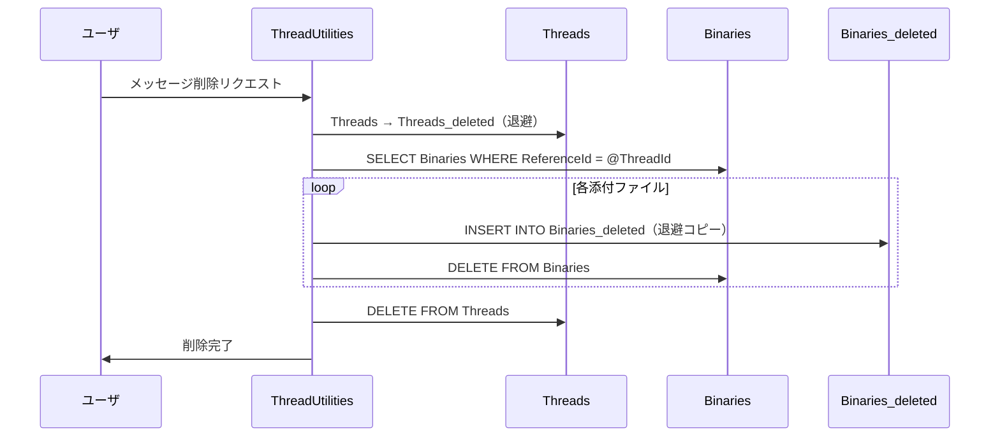

```csharp
// ThreadUtilities.cs - 削除時の添付ファイル退避
private static void DeleteAttachments(
    Context context,
    long threadId,
    List<SqlStatement> statements)
{
    // Binaries を Binaries_deleted に退避
    statements.Add(new SqlStatement(
        commandText: @"
            INSERT INTO ""Binaries_deleted""
                (""BinaryId"", ""TenantId"", ""ReferenceId"", ""BinaryType"",
                 ""Title"", ""Body"", ""Bin"", ""ContentType"", ""Size"",
                 ""Creator"", ""Updator"", ""CreatedTime"", ""UpdatedTime"")
            SELECT
                ""BinaryId"", ""TenantId"", ""ReferenceId"", ""BinaryType"",
                ""Title"", ""Body"", ""Bin"", ""ContentType"", ""Size"",
                ""Creator"", ""Updator"", ""CreatedTime"", ""UpdatedTime""
            FROM ""Binaries""
            WHERE ""ReferenceId"" = @ThreadId
              AND ""BinaryType"" = 'Attachments'",
        param: new { ThreadId = threadId }));
    // 主テーブルから削除
    statements.Add(Rds.DeleteBinaries(
        where: Rds.BinariesWhere()
            .ReferenceId(threadId)
            .BinaryType("Attachments")));
}
```

### SiteSettings のファイル添付設定

```csharp
// SiteSettings.cs - Threads のファイル添付設定
public bool? ThreadsEnableFileAttachments;     // 有効化（デフォルト: true）
public int? ThreadsAttachmentLimitSize;        // 個別サイズ上限（MB、デフォルト: 10）
public int? ThreadsAttachmentTotalLimitSize;   // 合計サイズ上限（MB、デフォルト: 100）
public int? ThreadsAttachmentLimitQuantity;    // メッセージあたりファイル数上限（デフォルト: 10）
public string ThreadsAttachmentAllowedExtensions;   // 許可拡張子（カンマ区切り）
public string ThreadsAttachmentExcludedExtensions;  // 禁止拡張子（カンマ区切り）
```

| 設定項目                              | デフォルト値 | 説明                             |
| ------------------------------------- | ------------ | -------------------------------- |
| `ThreadsEnableFileAttachments`        | `true`       | ファイル添付機能の有効/無効      |
| `ThreadsAttachmentLimitSize`          | `10`         | 1 ファイルあたりの上限（MB）     |
| `ThreadsAttachmentTotalLimitSize`     | `100`        | チャンネル全体の合計上限（MB）   |
| `ThreadsAttachmentLimitQuantity`      | `10`         | 1 メッセージあたりのファイル数   |
| `ThreadsAttachmentAllowedExtensions`  | (空)         | 許可拡張子（空の場合は制限なし） |
| `ThreadsAttachmentExcludedExtensions` | (空)         | 禁止拡張子（既定の 42 種に追加） |

---

## 改修対象の全体像

### 改修ファイル一覧

| カテゴリ     | ファイル / ディレクトリ                          | 改修内容                                |
| ------------ | ------------------------------------------------ | --------------------------------------- |
| 定義ファイル | `App_Data/Definitions/Definition_Column/`        | Threads カラム定義 JSON 追加            |
| 定義ファイル | `App_Data/Definitions/Definition_Code/`          | コード生成テンプレート更新              |
| CodeDefiner  | `Implem.CodeDefiner/`                            | Threads テーブル生成対応                |
| Model        | `Models/Threads/`（新規）                        | ThreadModel 等 6 ファイル               |
| Model        | `Models/Items/ItemModel.cs`                      | switch 文に `case "Threads":` 追加      |
| Model        | `Models/Items/ItemUtilities.cs`                  | ItemJoin に Threads 追加                |
| Model        | `Models/Binaries/BinaryUtilities.cs`             | Threads 用アップロード処理追加          |
| Libraries    | `Libraries/DataTypes/ThreadReaction.cs`（新規）  | リアクション型定義                      |
| Libraries    | `Libraries/DataTypes/ThreadMention.cs`（新規）   | メンション型定義                        |
| Libraries    | `Libraries/HtmlParts/HtmlThreads.cs`（新規）     | タイムライン UI・添付ファイル表示生成   |
| Libraries    | `Libraries/Settings/SiteSettings.cs`             | Threads 固有設定追加（添付設定含む）    |
| Site         | `Models/Sites/SiteUtilities.cs`                  | ReferenceType 選択肢・表示名追加        |
| Controller   | `Controllers/ItemsController.cs`                 | ルーティング追加（必要に応じて）        |
| Controller   | `Controllers/BinariesController.cs`              | Threads 用マルチアップロード対応        |
| Frontend     | `wwwroot/src/scripts/generals/thread.js`（新規） | メッセージ投稿・スレッド展開・D&D の JS |
| Frontend     | `wwwroot/src/styles/thread.css`（新規）          | タイムライン・添付ファイルのスタイル    |
| 多言語       | `App_Data/Displays/`                             | 表示テキスト追加                        |
| SQL          | `App_Data/Definitions/Definition_Sql/`           | Threads 関連 SQL 定義                   |

### 新規テーブル

| テーブル          | レコード数目安     | 説明                               |
| ----------------- | ------------------ | ---------------------------------- |
| `Threads`         | 多い（メッセージ） | 主テーブル                         |
| `Threads_history` | 中程度             | 編集履歴（更新前スナップショット） |
| `Threads_deleted` | 少ない             | 論理削除レコードの退避先           |
| `ThreadReactions` | 多い               | リアクション                       |
| `ThreadMentions`  | 中程度             | メンション通知管理                 |

---

## 考慮事項と具体的な実装方針

### パフォーマンス

メッセージングは他の SiteType と比較してレコード数が急増しやすい。以下の具体的な対策を実装する。

#### インデックス設計

```sql
-- チャンネル内メッセージ一覧（時系列降順）
CREATE NONCLUSTERED INDEX [IX_Threads_SiteId_CreatedTime]
    ON [Threads] ([SiteId], [CreatedTime] DESC)
    INCLUDE ([ThreadId], [ParentId], [Title], [Creator]);

-- スレッド返信の取得
CREATE NONCLUSTERED INDEX [IX_Threads_ParentId_CreatedTime]
    ON [Threads] ([ParentId], [CreatedTime] ASC)
    INCLUDE ([ThreadId], [Creator], [Body]);

-- ルートメッセージのみ抽出
CREATE NONCLUSTERED INDEX [IX_Threads_SiteId_ParentId]
    ON [Threads] ([SiteId], [ParentId])
    WHERE [ParentId] = 0;

-- _history テーブルのインデックス
CREATE NONCLUSTERED INDEX [IX_Threads_history_ThreadId]
    ON [Threads_history] ([ThreadId], [Ver] DESC);
```

#### 非正規化カラム（集計キャッシュ）

ルートメッセージの返信数・最終返信日時を都度サブクエリで集計すると N+1 問題が発生する。Threads テーブルに集計カラムを追加して非正規化する。

```sql
-- Threads テーブルに集計カラムを追加
ALTER TABLE [Threads] ADD
    [ReplyCount]    int       NOT NULL DEFAULT 0,
    [LastReplyTime] datetime  NULL;
```

```csharp
// ThreadUtilities.cs - 返信投稿時に親メッセージの集計カラムを更新
private static void UpdateParentReplyStats(
    Context context,
    long parentId)
{
    if (parentId == 0) return;
    Repository.ExecuteNonQuery(
        context: context,
        statements: new SqlStatement(
            commandText: @"
                UPDATE ""Threads""
                SET ""ReplyCount"" = (
                    SELECT COUNT(*)
                    FROM ""Threads"" AS t
                    WHERE t.""ParentId"" = @ParentId
                ),
                ""LastReplyTime"" = (
                    SELECT MAX(""CreatedTime"")
                    FROM ""Threads"" AS t
                    WHERE t.""ParentId"" = @ParentId
                )
                WHERE ""ThreadId"" = @ParentId",
            param: new { ParentId = parentId }));
}
```

#### メッセージ取得の SQL 最適化

ルートメッセージ一覧は返信数・最終返信日時を含めて 1 クエリで取得する。

```sql
-- ルートメッセージ一覧取得（非正規化カラム使用）
SELECT
    t."ThreadId",
    t."Title",
    t."Body",
    t."Creator",
    t."CreatedTime",
    t."ReplyCount",
    t."LastReplyTime"
FROM "Threads" AS t
WHERE t."SiteId" = @SiteId
  AND t."ParentId" = 0
ORDER BY t."CreatedTime" DESC
OFFSET @Offset ROWS FETCH NEXT @PageSize ROWS ONLY;
```

### リアルタイム更新

#### 初期実装: Ajax ポーリング

既存の `$p.ajax` を利用した定期取得方式で実装する。ポーリング間隔はサイト設定で制御可能とする。

```javascript
// wwwroot/src/scripts/generals/thread.js
$p.threadPolling = {
    timer: null,
    interval: 5000, // デフォルト 5 秒

    start: function (siteId) {
        this.stop();
        this.timer = setInterval(function () {
            $p.ajax(
                '/api/items/' + siteId + '/get',
                'post',
                {
                    View: {
                        ColumnFilterHash: { ParentId: '[0]' },
                        ColumnSorterHash: { CreatedTime: 'desc' },
                    },
                    Offset: 0,
                    PageSize: 50,
                },
                $p.onThreadPollingResult
            );
        }, this.interval);
    },

    stop: function () {
        if (this.timer) {
            clearInterval(this.timer);
            this.timer = null;
        }
    },
};

$p.onThreadPollingResult = function (data) {
    var lastId = $('#ThreadTimeline .thread-message:first').data('id');
    if (data.Response && data.Response.Data) {
        var newMessages = data.Response.Data.filter(function (msg) {
            return msg.ThreadId > lastId;
        });
        if (newMessages.length > 0) {
            $p.prependThreadMessages(newMessages);
        }
    }
};
```

```csharp
// SiteSettings.cs - ポーリング間隔の設定
public int? ThreadsPollingInterval;  // ミリ秒（デフォルト: 5000、0 で無効化）
```

#### 将来実装: SignalR WebSocket

ASP.NET Core に組み込み済みの SignalR を利用してリアルタイムプッシュに移行する。現時点のプリザンターには SignalR パッケージは含まれていないため、新規追加が必要。

```csharp
// Hubs/ThreadHub.cs
public class ThreadHub : Hub
{
    public async Task JoinChannel(long siteId)
    {
        await Groups.AddToGroupAsync(
            Context.ConnectionId,
            $"channel_{siteId}");
    }

    public async Task LeaveChannel(long siteId)
    {
        await Groups.RemoveFromGroupAsync(
            Context.ConnectionId,
            $"channel_{siteId}");
    }
}

// ThreadUtilities.cs - メッセージ投稿後にリアルタイム通知
private static async Task NotifyNewMessage(
    Context context,
    IHubContext<ThreadHub> hubContext,
    ThreadModel thread)
{
    await hubContext.Clients
        .Group($"channel_{thread.SiteId}")
        .SendAsync("ReceiveMessage", new
        {
            thread.ThreadId,
            thread.ParentId,
            thread.Body,
            Creator = SiteInfo.UserName(context, thread.Creator),
            thread.CreatedTime
        });
}
```

```javascript
// wwwroot/src/scripts/generals/threadSignalR.js
$p.threadSignalR = {
    connection: null,

    start: function (siteId) {
        this.connection = new signalR.HubConnectionBuilder().withUrl('/hubs/thread').withAutomaticReconnect().build();

        this.connection.on('ReceiveMessage', function (message) {
            $p.prependThreadMessages([message]);
        });

        this.connection.start().then(function () {
            $p.threadSignalR.connection.invoke('JoinChannel', siteId);
        });
    },

    stop: function () {
        if (this.connection) {
            this.connection.stop();
            this.connection = null;
        }
    },
};
```

| 方式            | 遅延         | サーバー負荷 | 実装コスト | 追加パッケージ               |
| --------------- | ------------ | ------------ | ---------- | ---------------------------- |
| Ajax ポーリング | 数秒～数十秒 | 高い         | 低い       | 不要                         |
| SignalR         | 即時         | 低い         | 中程度     | Microsoft.AspNetCore.SignalR |

### スレッドの深さ制限

Slack と同様にスレッドは 1 階層のみ（ルートメッセージ → 返信）とする。バリデーションで制御する。

```csharp
// ThreadValidators.cs - スレッド深さチェック
public static ErrorData OnCreating(
    Context context,
    SiteSettings ss,
    ThreadModel threadModel)
{
    // 基本権限チェック
    if (!context.HasPermission(ss: ss, type: Permissions.Types.Create))
        return new ErrorData(type: Error.Types.HasNotPermission);

    // スレッド深さ制限: 返信先が既に返信の場合は拒否
    if (threadModel.ParentId > 0)
    {
        var parent = new ThreadModel(
            context: context,
            ss: ss,
            threadId: threadModel.ParentId);
        if (parent.ParentId > 0)
        {
            // 返信への返信は不可（1 階層のみ）
            return new ErrorData(
                type: Error.Types.InvalidRequest,
                data: "スレッドは 1 階層のみ対応しています");
        }
    }
    return new ErrorData(type: Error.Types.None);
}
```

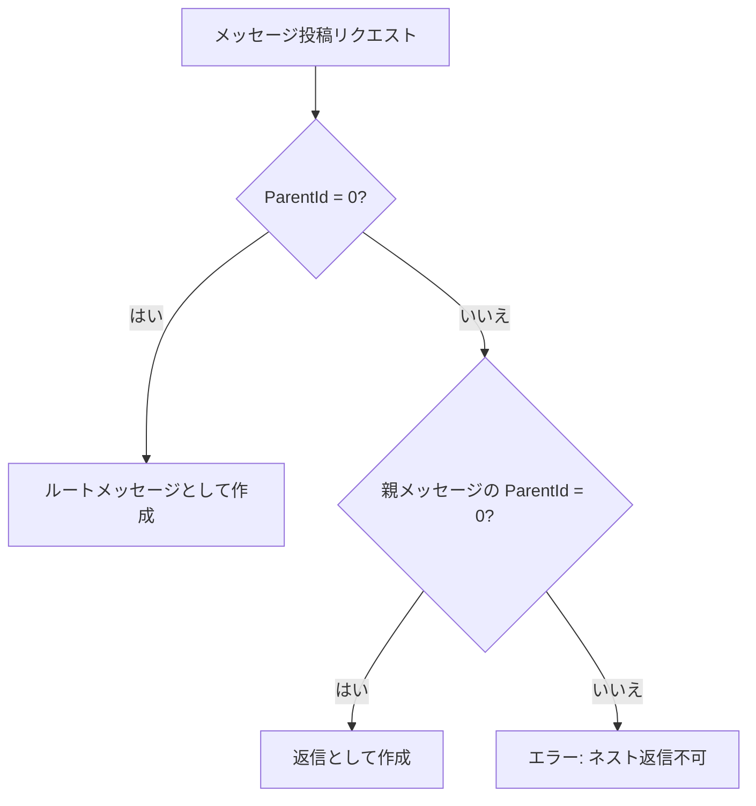

### 既存コメントシステムとの関係

既存のコメント（`Comments` カラム、JSON 配列格納）はレコードに紐づく付帯情報であり、独立したコミュニケーション手段ではない。Threads は独立した SiteType として、メッセージング専用の UI・データ構造を持つ。

| 項目         | 既存コメント                            | Threads                        |
| ------------ | --------------------------------------- | ------------------------------ |
| データ格納   | レコードの Comments カラム（JSON 配列） | 独立テーブル                   |
| 対象         | Issues / Results / Wikis のレコード     | Threads サイト内のメッセージ   |
| 専用 API     | なし（Update API 経由）                 | 専用 CRUD エンドポイント       |
| スレッド     | 非対応（フラットリスト）                | ParentId による親子構造        |
| リアクション | 非対応                                  | ThreadReactions テーブル       |
| メンション   | 非対応                                  | ThreadMentions テーブル + 通知 |
| 変更追跡     | CommentId + UpdatedTime                 | \_history / \_deleted テーブル |

既存コメントとの統合は行わず、用途に応じて使い分ける方針とする。

### CodeDefiner への影響

`Implem.Pleasanter.CodeDefiner` が `Threads` テーブルおよび派生テーブルの作成・マイグレーションを自動実行できるよう、定義ファイルを正しく配置する。

```csharp
// CodeDefiner が生成するテーブル一覧
// /rds コマンド実行時に以下が自動作成される
// 1. Threads         - 主テーブル
// 2. Threads_history - 編集履歴追跡テーブル
// 3. Threads_deleted - 削除レコード退避テーブル
// 4. ThreadReactions  - リアクションテーブル（独立管理）
// 5. ThreadMentions   - メンション通知テーブル（独立管理）
```

| コマンド               | 対象                             | 処理内容                                   |
| ---------------------- | -------------------------------- | ------------------------------------------ |
| `CodeDefiner /rds`     | Threads / \_history / \_deleted  | テーブル作成・カラム追加・インデックス作成 |
| `CodeDefiner /cdefine` | ThreadModel / ThreadUtilities 等 | C# モデルコード・SQL アクセスコードの生成  |

既存の `_BaseItem` カラム定義を継承することで、拡張カラム（ClassA-Z、NumA-Z 等）も自動的に利用可能になる。

### ファイル添付

詳細は[ファイル添付機能設計](#ファイル添付機能設計)セクションを参照。
以下の方針でメッセージへのファイル添付を実現する。

- 既存の `Binaries` テーブルに `ReferenceId = ThreadId` で格納
- ドラッグ&ドロップ、ファイル選択ボタン、クリップボード画像貼り付けに対応
- 画像ファイルはインラインサムネイル + テーマ世代に応じたプレビュー（Lightbox / image-viewer-modal）
- `BinaryValidators` のサイズ・拡張子・ファイル数チェックを適用
- メッセージ削除時は `Binaries` レコードも `Binaries_deleted` に退避
- API はマルチパートリクエストでファイル付きメッセージ投稿に対応
- SiteSettings でファイルサイズ上限・許可拡張子等を設定可能

### メッセージ検索

メッセージの全文検索を実装する。既存の Items 検索機構を拡張し、Threads テーブルの `Title` と `Body` を検索対象とする。

```csharp
// ThreadUtilities.cs - 全文検索
public static string Search(
    Context context,
    SiteSettings ss,
    string searchText)
{
    var threads = Repository.ExecuteTable(
        context: context,
        statements: Rds.SelectThreads(
            column: Rds.ThreadsColumn()
                .ThreadId()
                .Title()
                .Body()
                .Creator()
                .CreatedTime(),
            where: Rds.ThreadsWhere()
                .SiteId(ss.SiteId)
                .SqlWhereLike(
                    tableName: "Threads",
                    name: "SearchText",
                    searchText: searchText,
                    clauseCollection: new List<string>
                    {
                        "\"Threads\".\"Title\"",
                        "\"Threads\".\"Body\""
                    }),
            orderBy: Rds.ThreadsOrderBy()
                .CreatedTime(SqlOrderBy.Types.desc),
            top: 100));
    return ThreadsSearchResults(context, ss, threads);
}
```

### メッセージの編集・削除の UI 表示

メッセージの編集済み・削除済み状態を視覚的に表示する。

```csharp
// HtmlThreads.cs - 編集済み表示
private static HtmlBuilder ThreadMessageTime(
    this HtmlBuilder hb,
    Context context,
    ThreadModel thread)
{
    hb.Span(
        css: "thread-message-time",
        action: () => hb.Text(
            thread.CreatedTime
                .ToLocal(context: context)
                .ToString("yyyy/MM/dd HH:mm")));
    if (thread.Ver > 1)
    {
        hb.Span(
            css: "thread-message-edited",
            action: () => hb.Text("(編集済み)"));
    }
    return hb;
}
```

```css
/* thread.css - 編集済み・削除済みスタイル */
.thread-message-edited {
    font-size: 0.8em;
    color: #999;
    margin-left: 4px;
}

.thread-message-deleted {
    opacity: 0.5;
    font-style: italic;
}
```

---

## 結論

| 項目             | 結論                                                                                           |
| ---------------- | ---------------------------------------------------------------------------------------------- |
| 実現可能性       | 既存 SiteType アーキテクチャに従えば実現可能                                                   |
| ReferenceType    | `"Threads"` を新規追加                                                                         |
| データ構造       | `Threads`（+ \_history / \_deleted） + `ThreadReactions` + `ThreadMentions` の 5 テーブル構成  |
| 変更追跡         | 更新時は `Threads_history` にスナップショット、削除時は `Threads_deleted` に退避。復元にも対応 |
| スレッド構造     | `ParentId` による自己参照（1 階層のみ、Slack 方式）。バリデーションでネスト制限                |
| ItemModel 改修   | 約 20 箇所の switch 文に `case "Threads":` を追加                                              |
| CodeDefiner 統合 | 定義ファイル追加によりモデル・SQL・派生テーブルの自動生成に対応                                |
| フロントエンド   | 専用タイムライン UI を `HtmlBuilder` + JavaScript で構築                                       |
| ファイル添付     | 既存 `Binaries` テーブル活用。D&D・クリップボード貼付対応。画像サムネイル・プレビュー表示      |
| API              | 既存 Items API パターン準拠。リアクション・ファイル添付（マルチパート）エンドポイントを追加    |
| リアルタイム更新 | 初期は Ajax ポーリング（間隔設定可）、将来的に SignalR 導入を検討                              |
| 権限制御         | 既存サイト権限モデルを継承。投稿者本人チェックを追加                                           |
| パフォーマンス   | 複合インデックス + 非正規化集計カラム（ReplyCount / LastReplyTime）で N+1 問題を回避           |
| 既存機能への影響 | Comments との統合は行わない。ItemModel の switch 文追加のみ既存コードに影響                    |

---

## 関連ソースコード

| ファイル                                                   | 説明                            |
| ---------------------------------------------------------- | ------------------------------- |
| `Implem.Pleasanter/Models/Items/ItemModel.cs`              | SiteType ディスパッチ           |
| `Implem.Pleasanter/Models/Items/ItemUtilities.cs`          | ItemJoin・ユーティリティ        |
| `Implem.Pleasanter/Models/Sites/SiteModel.cs`              | SiteModel（ReferenceType 定義） |
| `Implem.Pleasanter/Models/Sites/SiteUtilities.cs`          | ReferenceType 選択肢・表示名    |
| `Implem.Pleasanter/Models/Binaries/BinaryModel.cs`         | ファイル添付モデル              |
| `Implem.Pleasanter/Models/Binaries/BinaryUtilities.cs`     | ファイルアップロード処理        |
| `Implem.Pleasanter/Models/Binaries/BinaryValidators.cs`    | ファイルバリデーション          |
| `Implem.Pleasanter/Controllers/BinariesController.cs`      | ファイル操作コントローラ        |
| `Implem.Pleasanter/Libraries/DataTypes/Attachment.cs`      | 添付ファイル型                  |
| `Implem.Pleasanter/Libraries/Settings/SiteSettings.cs`     | サイト設定                      |
| `Implem.Pleasanter/Libraries/DataTypes/Comment.cs`         | 既存コメント型                  |
| `Implem.Pleasanter/Libraries/DataTypes/Comments.cs`        | 既存コメントコレクション        |
| `Implem.Pleasanter/Libraries/HtmlParts/HtmlControls.cs`    | 添付ファイル UI 生成            |
| `Implem.Pleasanter/Models/Dashboards/DashboardModel.cs`    | 最新追加 SiteType（参考）       |
| `Implem.DefinitionAccessor/Def.cs`                         | 定義アクセサ                    |
| `Implem.CodeDefiner/Functions/Rds/Parts/Tables.cs`         | テーブル作成ロジック            |
| `Implem.Pleasanter/App_Data/Parameters/BinaryStorage.json` | ストレージ設定                  |

## 関連ドキュメント

| ドキュメント                                                                                    | 説明                             |
| ----------------------------------------------------------------------------------------------- | -------------------------------- |
| [コメント単独 CRUD 実現可能性調査](../03-データ操作・API/010-コメント単独CRUD実現可能性調査.md) | 既存コメントの CRUD 制約         |
| [データベーステーブル定義一覧](../12-データベース/001-データベーステーブル定義一覧.md)          | DB テーブル構成                  |
| [派生テーブルカラム差分パターン](../12-データベース/003-派生テーブルカラム差分パターン.md)      | history / deleted テーブルの構造 |
