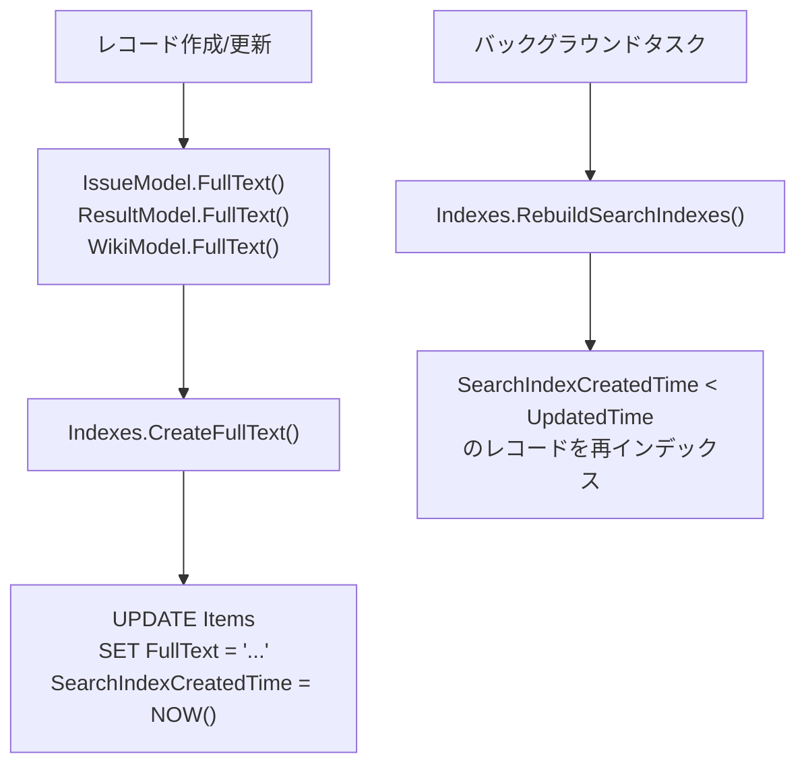
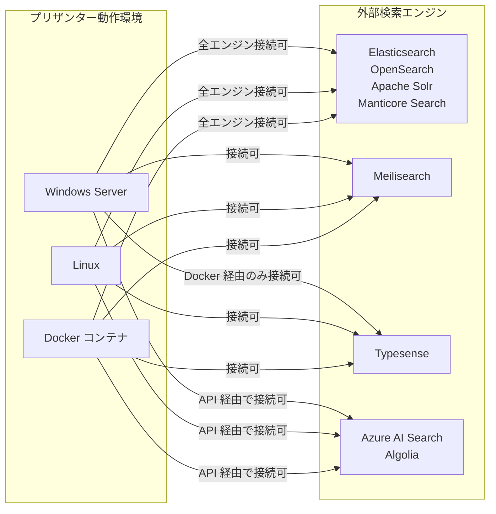
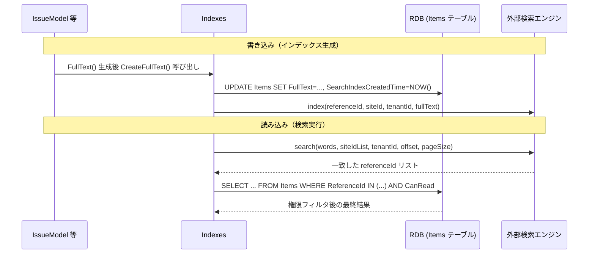
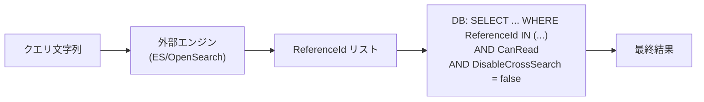

# 検索機能の外部検索エンジン外出し調査

プリザンターの検索機能を Elasticsearch などの外部検索エンジンに外出しする場合に使用するパッケージと実装変更箇所を調査する。

<!-- START doctoc generated TOC please keep comment here to allow auto update -->
<!-- DON'T EDIT THIS SECTION, INSTEAD RE-RUN doctoc TO UPDATE -->

- [調査情報](#調査情報)
- [調査目的](#調査目的)
- [現行の全文検索アーキテクチャ](#現行の全文検索アーキテクチャ)
    - [データ格納方式](#データ格納方式)
    - [検索実行方式](#検索実行方式)
    - [検索タイプ](#検索タイプ)
    - [日本語トークナイザ](#日本語トークナイザ)
- [外部検索エンジン候補](#外部検索エンジン候補)
    - [Elasticsearch / OpenSearch](#elasticsearch--opensearch)
    - [Apache Solr](#apache-solr)
    - [Meilisearch](#meilisearch)
    - [Typesense](#typesense)
    - [Manticore Search](#manticore-search)
    - [Azure AI Search](#azure-ai-search)
    - [Algolia](#algolia)
- [NuGet パッケージ比較](#nuget-パッケージ比較)
- [エンジン選定比較](#エンジン選定比較)
    - [機能比較](#機能比較)
    - [プラットフォーム対応比較](#プラットフォーム対応比較)
    - [プリザンター統合における選定ポイント](#プリザンター統合における選定ポイント)
- [実装変更箇所の調査](#実装変更箇所の調査)
    - [全体アーキテクチャ（変更後）](#全体アーキテクチャ変更後)
    - [変更が必要なファイル一覧](#変更が必要なファイル一覧)
- [日本語解析の考慮事項](#日本語解析の考慮事項)
    - [エンジン別の日本語対応方式](#エンジン別の日本語対応方式)
- [権限制御（アクセス制御）の扱い](#権限制御アクセス制御の扱い)
- [マルチテナントへの対応](#マルチテナントへの対応)
- [結論](#結論)
    - [エンジン採用判断サマリ](#エンジン採用判断サマリ)
    - [実装変更箇所のまとめ](#実装変更箇所のまとめ)
- [関連ソースコード](#関連ソースコード)

<!-- END doctoc generated TOC please keep comment here to allow auto update -->

## 調査情報

| 調査日       | リポジトリ | ブランチ | タグ/バージョン    | コミット    | 備考                       |
| ------------ | ---------- | -------- | ------------------ | ----------- | -------------------------- |
| 2026年3月3日 | Pleasanter | main     | Pleasanter_1.5.1.0 | `34f162a43` | 初回調査                   |
| 2026年3月5日 | -          | -        | -                  | -           | 外部検索エンジン候補を追加 |

## 調査目的

検索機能を Elasticsearch などの外部検索エンジンに外出しするとした場合に、採用するパッケージの候補と、実装上の変更箇所を明確にする。

---

## 現行の全文検索アーキテクチャ

### データ格納方式

プリザンターの全文検索は、各レコードの全フィールド内容を結合したテキストを `Items.FullText` カラムに格納する方式を採用している。
添付ファイル検索は `Binaries.Bin` カラムを直接 SQL で検索する（SQL Server のみ実用的）。



**ファイル**: `Implem.Pleasanter/Libraries/Search/Indexes.cs`（行番号: 131-145）

```csharp
private static void CreateFullText(Context context, long id, string fullText)
{
    if (fullText != null)
    {
        Repository.ExecuteNonQuery(
            context: context,
            statements: Rds.UpdateItems(
                where: Rds.ItemsWhere().ReferenceId(id),
                param: Rds.ItemsParam()
                    .FullText(fullText)
                    .SearchIndexCreatedTime(DateTime.Now),
                addUpdatorParam: false,
                addUpdatedTimeParam: false));
    }
}
```

### 検索実行方式

クロスサーチ（全サイト横断検索）とサイト内検索の両方で `Items.FullText` を参照する。
DB エンジンごとに `ISqlCommandText` インタフェースの実装が異なる。

| DB エンジン | FullText 検索構文                                            | 添付ファイル検索                     | 備考                                |
| ----------- | ------------------------------------------------------------ | ------------------------------------ | ----------------------------------- |
| SQL Server  | `CONTAINS("Items"."FullText", @param)`                       | `CONTAINS("Binaries"."Bin", @param)` | IFilter 経由でバイナリ解析          |
| PostgreSQL  | `"Items"."FullText" %> @param`                               | `encode("Bin", 'escape') %> @param`  | pg_trgm 拡張 + GIN インデックス必須 |
| MySQL       | `MATCH("Items"."FullText") AGAINST (@param IN BOOLEAN MODE)` | `0=1`（非対応）                      | ngram パーサー必須                  |

### 検索タイプ

`SiteSettings.SearchType` によって以下の検索モードが切り替わる。

| SearchType               | 動作                                                                     |
| ------------------------ | ------------------------------------------------------------------------ |
| `FullText`（デフォルト） | `ISqlCommandText.CreateFullTextWhereItem()` が生成する DB 固有の全文検索 |
| `PartialMatch`           | `Items.FullText` に対する `LIKE '%...%'` 検索                            |
| `MatchInFrontOfTitle`    | `Items.Title` に対する前方一致                                           |
| `BroadMatchOfTitle`      | `Items.Title` に対する部分一致                                           |

### 日本語トークナイザ

`Implem.Pleasanter/Libraries/Search/WordBreaker.cs` がひらがな・カタカナ・漢字・英数字を文字種別に分類してトークン分割する。
SQL Server の IFilter や pg_trgm の場合は WordBreaker のトークンをそのまま検索クエリに使用する。

---

## 外部検索エンジン候補

### Elasticsearch / OpenSearch

Elasticsearch と AWS が管理する OpenSearch（v1.x/2.x）はともに Lucene ベースで、日本語解析プラグイン（kuromoji、Sudachi）が充実している。

| 項目                 | Elasticsearch 8.x                                                             | OpenSearch 2.x                                                         |
| -------------------- | ----------------------------------------------------------------------------- | ---------------------------------------------------------------------- |
| ライセンス           | SSPL / Elastic License 2.0                                                    | Apache License 2.0                                                     |
| 実装言語             | Java（Lucene ベース）                                                         | Java（Lucene ベース）                                                  |
| 動作プラットフォーム | Linux ○ / Windows ○ / macOS ○（dev）<br>Docker ○（公式）/ Kubernetes ○（ECK） | Linux ○ / Windows ○ / macOS ○（dev）<br>Docker ○（公式）/ Kubernetes ○ |
| AWS マネージド       | Amazon Elasticsearch Service（非推奨）                                        | Amazon OpenSearch Service                                              |
| セルフホスト         | 可能                                                                          | 可能                                                                   |
| 日本語解析           | `analysis-kuromoji` / `analysis-icu`                                          | `analysis-kuromoji` (built-in)                                         |
| .NET クライアント    | `Elastic.Clients.Elasticsearch`                                               | `OpenSearch.Client`                                                    |
| クラスタ対応         | 分散クラスタ対応                                                              | 分散クラスタ対応                                                       |
| ベクター検索         | kNN ベクター検索対応                                                          | k-NN 対応                                                              |

**特徴**

- 大規模データ・エンタープライズ用途に最も実績が豊富
- kuromoji/Sudachi プラグインによる形態素解析で日本語検索精度が高い
- 集計・分析クエリが豊富で、ログ解析等にも転用可能
- Elasticsearch は 7.x から SSPL ライセンスに変更されたため、自社サービスへの組み込みにはライセンス確認が必要
- OpenSearch は Apache License 2.0 で商用利用制限なし

### Apache Solr

Apache Software Foundation が管理する成熟した Java ベースのオープンソース検索エンジン。Lucene ベースで Elasticsearch と同等の全文検索機能を持つ。

| 項目                 | 内容                                                                                                            |
| -------------------- | --------------------------------------------------------------------------------------------------------------- |
| ライセンス           | Apache License 2.0                                                                                              |
| 実装言語             | Java（Lucene ベース）                                                                                           |
| 最新バージョン       | 9.10.x（2025年11月時点）                                                                                        |
| 動作プラットフォーム | Linux ○ / Windows ○ / macOS ○<br>Docker ○（公式）/ Kubernetes ○（Solr Operator）<br>※ Java 21+ が実行環境に必要 |
| セルフホスト         | 可能（SolrCloud による分散構成も可能）                                                                          |
| 日本語解析           | SmartCN / ICU アナライザー + カスタム設定                                                                       |
| .NET クライアント    | `SolrNet`（NuGet v1.2.1）                                                                                       |
| クラスタ対応         | SolrCloud による ZooKeeper 管理                                                                                 |
| ベクター検索         | DenseVector フィールド対応（9.x 以降）                                                                          |

**特徴**

- 長年の実績があり、企業での採用事例が多い
- SolrCloud により ZooKeeper を使った高可用性クラスタを構築可能
- Elasticsearch と比較して設定の自由度が高い分、初期設定の複雑さがある
- `SolrNet` は netstandard2.0 対応で net10 でも利用可能だが、最新 Solr 9.x への対応はベータ版機能が含まれる
- 日本語は ICU アナライザーまたはカスタムチェーンで対応可能だが、kuromoji プラグインはデフォルト非同梱

```xml
<!-- SolrNet の NuGet 参照例 -->
<PackageReference Include="SolrNet" Version="1.2.1" />
```

### Meilisearch

Rust 製の軽量全文検索エンジン。設定が簡易で日本語トークナイザ（Lindera）も内蔵しているが、権限制御のような複雑なフィルタ条件との組み合わせは考慮が必要になる。

| 項目                 | 内容                                                                           |
| -------------------- | ------------------------------------------------------------------------------ |
| ライセンス           | MIT（コア）/ Meilisearch Cloud あり                                            |
| 実装言語             | Rust                                                                           |
| 動作プラットフォーム | Linux ○ / Windows ○（Server 2022+）/ macOS ○<br>Docker ○（公式）/ Kubernetes ○ |
| セルフホスト         | 可能                                                                           |
| 日本語解析           | Lindera（内蔵、形態素解析）                                                    |
| .NET クライアント    | `Meilisearch`（NuGet）                                                         |
| クラスタ対応         | 単一ノード（冗長構成不可）                                                     |
| ベクター検索         | AI/ハイブリッド検索対応                                                        |

**特徴**

- インストール・設定が最も簡単でプロトタイピングに最適
- タイポ耐性が強くデフォルト設定でも高い検索体験
- AI ベースのハイブリッド検索（キーワード + セマンティック）をネイティブサポート
- 大規模クラスタや複雑な集計は非対応
- Lindera による日本語形態素解析は内蔵だが、kuromoji と比べて精度のチューニング幅が狭い

### Typesense

C++ 製の高速全文検索エンジン。Algolia に似た API 設計で開発者フレンドリー。

| 項目                 | 内容                                                                                                      |
| -------------------- | --------------------------------------------------------------------------------------------------------- |
| ライセンス           | GPL-3.0（コア）/ Typesense Cloud あり                                                                     |
| 実装言語             | C++                                                                                                       |
| 動作プラットフォーム | Linux ○ / Windows ×（ネイティブバイナリなし。Docker 経由のみ）/ macOS ○<br>Docker ○（公式）/ Kubernetes ○ |
| セルフホスト         | 可能                                                                                                      |
| 日本語解析           | Unicode サポートのみ。形態素解析は事前処理が必要                                                          |
| .NET クライアント    | `Typesense`（NuGet v8.1.0、net6+ 対応、コミュニティ製）                                                   |
| クラスタ対応         | 冗長クラスタ対応（データ全量複製方式）                                                                    |
| ベクター検索         | ハイブリッド検索（v0.25+）対応                                                                            |

**特徴**

- RAM 中心のアーキテクチャで検索レスポンスが非常に高速
- タイポ耐性がデフォルトで優秀
- .NET クライアントはコミュニティ製（DAXGRID/typesense-dotnet）であり、公式メンテナンス品ではない点に注意
- 日本語の形態素解析はネイティブに対応しておらず、インデックス登録前にサーバー側でトークン化処理が必要
- GPL-3.0 ライセンスのため商用製品に組み込む場合はライセンス確認が必要

### Manticore Search

Sphinx Search からフォークされた C++ 製の高速検索エンジン。MySQL プロトコル互換で SQL クエリが使える点が特徴。

| 項目                 | 内容                                                                                         |
| -------------------- | -------------------------------------------------------------------------------------------- |
| ライセンス           | GPL-2.0（コア）                                                                              |
| 実装言語             | C++                                                                                          |
| 動作プラットフォーム | Linux ○ / Windows ○（ネイティブインストーラあり）/ macOS ○<br>Docker ○（公式）/ Kubernetes ○ |
| セルフホスト         | 可能                                                                                         |
| 日本語解析           | ngram トークナイザ（`ngram_chars = japanese`）による bigram 分割                             |
| .NET クライアント    | `manticoresearch-net`（公式、NuGet）/ `ManticoreSearch.Provider`                             |
| クラスタ対応         | Galera クラスタによる高可用性対応                                                            |
| ベクター検索         | ベクター検索対応（6.x 以降）                                                                 |

**特徴**

- MySQL プロトコル互換のため、MySQL 用クライアント（MySqlConnector 等）でも接続可能
- ngram トークナイザで `charset_table = japanese`、`ngram_len = 2` を設定することで日本語 bigram 検索が実現できる
- Elasticsearch/Solr と比較してリソース消費が少なく、小〜中規模環境での採用に向く
- リアルタイムインデックスと高速な全文検索が特徴
- 形態素解析は非対応（ngram 方式）のため、検索語のノイズが増える傾向がある

### Azure AI Search

Microsoft が提供するマネージド検索サービス（旧称: Azure Cognitive Search）。Azure 環境に特化した統合が強み。

| 項目                 | 内容                                                                                                        |
| -------------------- | ----------------------------------------------------------------------------------------------------------- |
| ライセンス           | Azure サービス（クローズドソース）                                                                          |
| 動作プラットフォーム | Azure クラウド専用（セルフホスト不可）。プリザンター側は Windows/Linux いずれからも .NET SDK 経由で接続可能 |
| セルフホスト         | 不可（Azure 専用）                                                                                          |
| 日本語解析           | `ja.microsoft` アナライザー（組み込み）                                                                     |
| .NET クライアント    | `Azure.Search.Documents`（NuGet v11.7.0）                                                                   |
| クラスタ対応         | Azure プラットフォームが管理                                                                                |
| ベクター検索         | Azure OpenAI と統合したセマンティック検索                                                                   |

**特徴**

- インフラ管理が不要でフルマネージドの高可用性環境
- Azure OpenAI との統合で、RAG（Retrieval-Augmented Generation）やセマンティック検索が容易
- `ja.microsoft` アナライザーで日本語解析が内蔵されている
- コスト構造は検索ユニット（SU）数と検索/インデックス API 呼び出し回数に依存するため、大量データでは割高になる可能性がある
- Azure 以外の環境では採用できない

### Algolia

SaaS 型フルマネージド検索エンジン。API キーベースの操作が簡単で、EC やコンテンツポータルでの採用実績が豊富。

| 項目                 | 内容                                                                                                          |
| -------------------- | ------------------------------------------------------------------------------------------------------------- |
| ライセンス           | クローズドソース（SaaS）                                                                                      |
| 動作プラットフォーム | Algolia クラウド専用（セルフホスト不可）。プリザンター側は Windows/Linux いずれからも REST API 経由で接続可能 |
| セルフホスト         | 不可（Algolia クラウドのみ）                                                                                  |
| 日本語解析           | 内蔵アナライザー（形態素解析は非対応。事前分割推奨）                                                          |
| .NET クライアント    | `Algolia.Search`（NuGet v7.38.x、netstandard2.0）                                                             |
| クラスタ対応         | Algolia プラットフォームが管理                                                                                |
| ベクター検索         | Algolia NeuralSearch（セマンティック検索対応）                                                                |

**特徴**

- インデックス・検索の API が直感的で最も実装コストが低い
- タイポ耐性・ランキングのデフォルト設定が優秀
- 日本語の形態素解析はサーバー側で非対応のため、事前トークン化またはシノニム設定で対応する必要がある
- 大量データ・大量クエリ環境ではコストが高くなる
- セルフホスト不可のため、データをクラウドに送信するプライバシー面の考慮が必要

---

## NuGet パッケージ比較

| パッケージ名                    | 対象エンジン        | バージョン | .NET 対応            | メンテ状態   | 特徴                                  |
| ------------------------------- | ------------------- | ---------- | -------------------- | ------------ | ------------------------------------- |
| `Elastic.Clients.Elasticsearch` | Elasticsearch 8.x   | 8.x        | net6+ ✓ (net10 対応) | 公式メンテ   | 公式 v8 クライアント。強い型付け API  |
| `NEST`                          | Elasticsearch 7.x   | 7.x        | netstandard2.0 ✓     | EOL 済み     | 旧クライアント。新規採用非推奨        |
| `OpenSearch.Client`             | OpenSearch 1.x/2.x  | 1.x        | netstandard2.0 ✓     | 公式メンテ   | NEST フォーク。API は NEST とほぼ同等 |
| `SolrNet`                       | Apache Solr 1.x-7.x | 1.2.1      | netstandard2.0 ✓     | コミュニティ | Solr 9.x は一部ベータ対応             |
| `Meilisearch`                   | Meilisearch         | 最新版     | net6+ ✓              | 公式メンテ   | 簡易 REST ラッパー                    |
| `Typesense`                     | Typesense           | 8.1.0      | net6+ ✓              | コミュニティ | DAXGRID 製。公式 SDK ではない         |
| `manticoresearch-net`           | Manticore Search    | 最新版     | netstandard2.0 ✓     | 公式メンテ   | ManticoreSoftware 公式                |
| `Azure.Search.Documents`        | Azure AI Search     | 11.7.0     | net6+ ✓              | 公式メンテ   | Azure 専用。Microsoft 公式            |
| `Algolia.Search`                | Algolia             | 7.38.x     | netstandard2.0 ✓     | 公式メンテ   | SaaS 専用。フルマネージド             |

現行プリザンターのターゲットフレームワークは `net10.0` であり、上記のいずれも対応する。
Elasticsearch 8.x 系を使用する場合は `Elastic.Clients.Elasticsearch`、AWS 環境で OpenSearch を使用する場合は `OpenSearch.Client` が第一候補となる。

---

## エンジン選定比較

### 機能比較

| 項目                        | Elasticsearch 8 | OpenSearch 2  |   Apache Solr 9   | Meilisearch  |     Typesense     | Manticore Search |  Azure AI Search  |      Algolia      |
| --------------------------- | :-------------: | :-----------: | :---------------: | :----------: | :---------------: | :--------------: | :---------------: | :---------------: |
| セルフホスト                |        ○        |       ○       |         ○         |      ○       |         ○         |        ○         |         ×         |         ×         |
| 分散クラスタ                |        ○        |       ○       |  ○（SolrCloud）   |      ×       |   △（全量複製）   |   ○（Galera）    |  ○（マネージド）  |  ○（マネージド）  |
| 日本語形態素解析            |  ○（kuromoji）  | ○（kuromoji） | △（ICU/カスタム） | ○（Lindera） |  ×（事前処理要）  |    △（ngram）    | ○（ja.microsoft） |  ×（事前処理要）  |
| ベクター/セマンティック検索 |        ○        |       ○       |         ○         |      ○       |         ○         |        ○         |  ○（OpenAI連携）  | ○（NeuralSearch） |
| 集計・アナリティクス        |        ○        |       ○       |         ○         |      ×       |         ×         |        △         |         △         |         ×         |
| ライセンス（商用）          | 要確認（SSPL）  |  ○（Apache）  |    ○（Apache）    |   ○（MIT）   |  要確認（GPL-3）  | 要確認（GPL-2）  |  Azure 従量課金   |     有料 SaaS     |
| .NET 公式クライアント       |        ○        |       ○       | ×（コミュニティ） |      ○       | ×（コミュニティ） |        ○         |         ○         |         ○         |

### プラットフォーム対応比較

プリザンターは .NET 10.0 で実装されており、Windows Server・Linux・Docker いずれの環境でも動作する。外部検索エンジンも同様にプリザンターと同じ環境で稼働できることが前提となる。

| エンジン         | Windows（ネイティブ） |  Linux（ネイティブ）  |         macOS         | Docker（公式イメージ） |     Kubernetes     | 備考                                   |
| ---------------- | :-------------------: | :-------------------: | :-------------------: | :--------------------: | :----------------: | -------------------------------------- |
| Elasticsearch 8  |           ○           |       ○（推奨）       |     ○（開発用途）     |           ○            |      ○（ECK）      | -                                      |
| OpenSearch 2     |           ○           |       ○（推奨）       |     ○（開発用途）     |           ○            |  ○（Helm Chart）   | -                                      |
| Apache Solr 9    |           ○           |       ○（推奨）       |           ○           |           ○            | ○（Solr Operator） | Java 21+ が別途必要                    |
| Meilisearch      |   ○（Server 2022+）   |           ○           |           ○           |           ○            |         ○          | Windows デスクトップ OS はサポート外   |
| Typesense        | ×（Docker 経由のみ）  |           ○           |           ○           |           ○            |         ○          | Windows ネイティブバイナリは提供なし   |
| Manticore Search | ○（インストーラあり） |           ○           |           ○           |           ○            |         ○          | Windows は最も幅広くネイティブ対応     |
| Azure AI Search  | -（クラウドサービス） | -（クラウドサービス） | -（クラウドサービス） |           -            |         -          | プリザンター側クライアントは任意 OS 可 |
| Algolia          | -（クラウドサービス） | -（クラウドサービス） | -（クラウドサービス） |           -            |         -          | プリザンター側クライアントは任意 OS 可 |

**プリザンターと同居できる環境のまとめ**



### プリザンター統合における選定ポイント

| 選定軸                     | 推奨エンジン               | 理由                                                                           |
| -------------------------- | -------------------------- | ------------------------------------------------------------------------------ |
| 日本語検索精度             | Elasticsearch / OpenSearch | kuromoji による形態素解析で最高精度。ひらがな/カタカナ揺れ吸収も設定で対応可能 |
| 導入・運用の容易さ         | Meilisearch                | セットアップが最も簡単。Lindera 内蔵で最低限の日本語対応                       |
| ライセンス制約なし         | OpenSearch / Apache Solr   | Apache License 2.0 で商用利用制限なし                                          |
| 小〜中規模コスト最適化     | Manticore Search           | リソース消費が少なく安価なインフラで運用可能                                   |
| Azure 環境前提             | Azure AI Search            | マネージドで運用コストが低く、Azure OpenAI との連携が容易                      |
| AWS 環境前提               | Amazon OpenSearch Service  | マネージドで運用コストが低い                                                   |
| フルマネージド（クラウド） | Algolia                    | インフラ管理不要だが大量データで高コスト                                       |

---

## 実装変更箇所の調査

### 全体アーキテクチャ（変更後）



### 変更が必要なファイル一覧

#### 1. パラメータ追加

**ファイル**: `Implem.ParameterAccessor/Parts/Search.cs`

外部検索エンジンへの接続情報と有効/無効フラグを追加する。

```csharp
public class Search
{
    // 既存フィールド（変更なし）
    public bool SearchDocuments;
    public bool CreateIndexes;
    public int PageSize;
    public bool DisableCrossSearch;
    public bool DisableCrossSearchSites;
    public bool FullTextIncludeBreadcrumb;
    public bool FullTextIncludeSiteId;
    public bool FullTextIncludeSiteTitle;
    public int FullTextNumberOfMails;
    public int FullTextMaxNumberOfMails;

    // 追加フィールド
    public ExternalSearch ExternalSearch;
}

public class ExternalSearch
{
    public bool Enabled;          // 外部検索エンジンを使用するか
    public string Engine;         // "Elasticsearch" | "OpenSearch" | "Solr" | "Meilisearch" | "Typesense" | "Manticore" | "AzureSearch" | "Algolia"
    public string Url;            // 接続 URL（例: "http://localhost:9200"）
    public string IndexName;      // インデックス名（例: "pleasanter"）
    public string ApiKey;         // 認証用 API キー（省略可）
    public string CertificateFingerprint; // SSL 証明書フィンガープリント（省略可）
}
```

対応する JSON パラメータファイル（`App_Data/Parameters/Search.json`）にも同フィールドを追加する。

#### 2. 外部検索エンジンインタフェースの追加

現行の `ISqlCommandText` と同様に、検索エンジンの実装を差し替えられるようインタフェースを新設する。

**新規ファイル**: `Implem.Pleasanter/Libraries/Search/IFullTextSearchEngine.cs`

```csharp
namespace Implem.Pleasanter.Libraries.Search
{
    public interface IFullTextSearchEngine
    {
        void Index(long referenceId, long siteId, int tenantId,
                   string referenceType, string fullText);
        void Delete(long referenceId);
        IEnumerable<long> Search(string searchText,
                                 IEnumerable<long> siteIdList,
                                 int tenantId,
                                 int offset,
                                 int pageSize);
    }
}
```

#### 3. Elasticsearch 実装クラスの追加

**新規ファイル**: `Implem.Pleasanter/Libraries/Search/ElasticsearchEngine.cs`

`Elastic.Clients.Elasticsearch` パッケージを使用する実装例。

```csharp
using Elastic.Clients.Elasticsearch;

namespace Implem.Pleasanter.Libraries.Search
{
    public class ElasticsearchEngine : IFullTextSearchEngine
    {
        private readonly ElasticsearchClient _client;
        private readonly string _indexName;

        public ElasticsearchEngine(string url, string indexName, string apiKey = null)
        {
            var settings = new ElasticsearchClientSettings(new Uri(url))
                .DefaultIndex(indexName);
            if (!string.IsNullOrEmpty(apiKey))
                settings = settings.Authentication(new ApiKey(apiKey));
            _client = new ElasticsearchClient(settings);
            _indexName = indexName;
        }

        public void Index(long referenceId, long siteId, int tenantId,
                          string referenceType, string fullText)
        {
            _client.Index(new PleasanterDocument
            {
                ReferenceId = referenceId,
                SiteId = siteId,
                TenantId = tenantId,
                ReferenceType = referenceType,
                FullText = fullText
            }, i => i.Index(_indexName).Id(referenceId));
        }

        public void Delete(long referenceId)
        {
            _client.Delete<PleasanterDocument>(
                referenceId, d => d.Index(_indexName));
        }

        public IEnumerable<long> Search(string searchText,
                                        IEnumerable<long> siteIdList,
                                        int tenantId,
                                        int offset,
                                        int pageSize)
        {
            var response = _client.Search<PleasanterDocument>(s => s
                .Index(_indexName)
                .From(offset)
                .Size(pageSize)
                .Query(q => q
                    .Bool(b => b
                        .Must(m => m
                            .Match(mm => mm
                                .Field(f => f.FullText)
                                .Query(searchText)))
                        .Filter(
                            f => f.Term(t => t.TenantId, tenantId),
                            siteIdList?.Any() == true
                                ? f => f.Terms(t => t
                                    .Field(ff => ff.SiteId)
                                    .Terms(new TermsQueryField(
                                        siteIdList.Select(id =>
                                            FieldValue.Long(id))
                                        .ToArray())))
                                : null
                        ))));
            return response.IsValidResponse
                ? response.Documents.Select(d => d.ReferenceId)
                : Enumerable.Empty<long>();
        }
    }

    internal class PleasanterDocument
    {
        public long ReferenceId { get; set; }
        public long SiteId { get; set; }
        public int TenantId { get; set; }
        public string ReferenceType { get; set; }
        public string FullText { get; set; }
    }
}
```

OpenSearch の場合は同じ構造で `OpenSearch.Client` を使用する実装クラス `OpenSearchEngine` を追加する。
API は NEST と互換性が高いため、コードの変更は最小限となる。

#### 4. Apache Solr 実装クラスの追加（参考）

**新規ファイル**: `Implem.Pleasanter/Libraries/Search/SolrEngine.cs`

`SolrNet` パッケージを使用する実装例。SolrNet のスキーマ定義と DI 登録が別途必要になる。

```csharp
using SolrNet;
using SolrNet.Commands.Parameters;

namespace Implem.Pleasanter.Libraries.Search
{
    public class SolrEngine : IFullTextSearchEngine
    {
        private readonly ISolrOperations<PleasanterDocument> _solr;

        public SolrEngine(ISolrOperations<PleasanterDocument> solr)
        {
            _solr = solr;
        }

        public void Index(long referenceId, long siteId, int tenantId,
                          string referenceType, string fullText)
        {
            _solr.Add(new PleasanterDocument
            {
                ReferenceId = referenceId,
                SiteId = siteId,
                TenantId = tenantId,
                ReferenceType = referenceType,
                FullText = fullText
            });
            _solr.Commit();
        }

        public void Delete(long referenceId)
        {
            _solr.Delete(referenceId.ToString());
            _solr.Commit();
        }

        public IEnumerable<long> Search(string searchText,
                                        IEnumerable<long> siteIdList,
                                        int tenantId,
                                        int offset,
                                        int pageSize)
        {
            var fq = new List<ISolrQuery>
            {
                new SolrQueryByField("tenantId", tenantId.ToString())
            };
            if (siteIdList?.Any() == true)
                fq.Add(new SolrQueryInList("siteId",
                    siteIdList.Select(id => id.ToString())));

            var results = _solr.Query(
                new SolrQuery($"fullText:{searchText}"),
                new QueryOptions
                {
                    FilterQueries = fq,
                    StartOrCursor = new StartOrCursor.Start(offset),
                    Rows = pageSize
                });
            return results.Select(d => d.ReferenceId);
        }
    }
}
```

#### 5. Manticore Search 実装クラスの追加（参考）

Manticore Search は MySQL プロトコル互換のため、`MySqlConnector` を使って SQL で操作することも可能。
`manticoresearch-net` を使用する場合の概要を示す。

```csharp
using ManticoreSearch.Api;
using ManticoreSearch.Client;
using ManticoreSearch.Model;

namespace Implem.Pleasanter.Libraries.Search
{
    public class ManticoreEngine : IFullTextSearchEngine
    {
        private readonly SearchApi _searchApi;
        private readonly IndexApi _indexApi;
        private readonly string _tableName;

        public ManticoreEngine(string url, string tableName)
        {
            var config = new Configuration { BasePath = url };
            _searchApi = new SearchApi(config);
            _indexApi = new IndexApi(config);
            _tableName = tableName;
        }

        public void Index(long referenceId, long siteId, int tenantId,
                          string referenceType, string fullText)
        {
            _indexApi.Replace(new InsertDocumentRequest(
                index: _tableName,
                id: referenceId,
                doc: new Dictionary<string, object>
                {
                    ["referenceId"] = referenceId,
                    ["siteId"] = siteId,
                    ["tenantId"] = tenantId,
                    ["referenceType"] = referenceType,
                    ["fullText"] = fullText
                }));
        }

        public void Delete(long referenceId)
        {
            _indexApi.Delete(new DeleteDocumentRequest(
                index: _tableName,
                id: referenceId));
        }

        public IEnumerable<long> Search(string searchText,
                                        IEnumerable<long> siteIdList,
                                        int tenantId,
                                        int offset,
                                        int pageSize)
        {
            var query = new SearchRequest(index: _tableName,
                query: new SearchQuery(match: new MatchFilter(
                    queryFields: "fullText",
                    queryString: searchText)));
            var response = _searchApi.Search(query);
            return response.Hits.Hits
                .Select(h => (long)h.Source["referenceId"]);
        }
    }
}
```

#### 4. Indexes.CreateFullText() の修正

**ファイル**: `Implem.Pleasanter/Libraries/Search/Indexes.cs`（行番号: 131-145）

DB 更新後に外部検索エンジンへのインデックス登録を追加する。

```csharp
private static void CreateFullText(Context context, long id, string fullText)
{
    if (fullText != null)
    {
        Repository.ExecuteNonQuery(
            context: context,
            statements: Rds.UpdateItems(
                where: Rds.ItemsWhere().ReferenceId(id),
                param: Rds.ItemsParam()
                    .FullText(fullText)
                    .SearchIndexCreatedTime(DateTime.Now),
                addUpdatorParam: false,
                addUpdatedTimeParam: false));

        // 外部検索エンジンが有効な場合はインデックスを送信
        if (Parameters.Search.ExternalSearch?.Enabled == true)
        {
            var engine = SearchEngineFactory.Get();
            // siteId や referenceType は Items テーブルから別途取得が必要
            engine?.Index(referenceId: id, ...);
        }
    }
}
```

#### 5. Indexes.Get() の修正

**ファイル**: `Implem.Pleasanter/Libraries/Search/Indexes.cs`（行番号: 748-810）

外部検索エンジンが有効な場合は ES から一致する `ReferenceId` を先に取得し、DB クエリをそのリストで絞り込む方式に切り替える。

```csharp
public static DataSet Get(
    Context context,
    string searchText,
    IEnumerable<long> siteIdList = null,
    string dataTableName = null,
    int offset = 0,
    int pageSize = 0,
    bool countRecord = false)
{
    // 外部検索エンジンが有効な場合はエンジンから ID リストを取得
    if (Parameters.Search.ExternalSearch?.Enabled == true)
    {
        var engine = SearchEngineFactory.Get();
        var matchedIds = engine?.Search(
            searchText: searchText,
            siteIdList: siteIdList,
            tenantId: context.TenantId,
            offset: offset,
            pageSize: pageSize);
        if (matchedIds?.Any() != true) return null;
        // matchedIds を使って DB から CanRead チェック付きで取得
        return GetByIds(context, matchedIds, dataTableName);
    }

    // 既存の SQL 全文検索ロジック（変更なし）
    var words = context.SqlCommandText.CreateSearchTextWords(...);
    ...
}
```

#### 6. 削除時のインデックス削除

**ファイル**: `Implem.Pleasanter/Models/Items/ItemModel.cs`

レコード削除時に外部検索エンジンからもドキュメントを削除する必要がある。
`IssueModel.Delete()`、`ResultModel.Delete()`、`WikiModel.Delete()` の呼び出し箇所を確認し、同様に外部エンジンへの Delete 呼び出しを追加する。

---

## 日本語解析の考慮事項

現行の `WordBreaker.cs` は DB 側に渡すクエリ文字列の生成を担っているが、外部検索エンジンに外出しした場合はエンジン側のアナライザーが分かち書きを担う。

| 対象                         | 現行                                                                    | 外部エンジン（Elasticsearch）                                          |
| ---------------------------- | ----------------------------------------------------------------------- | ---------------------------------------------------------------------- |
| インデックス時のトークナイズ | `WordBreaker.cs` 経由でトークン化したテキストを `Items.FullText` に格納 | ES のアナライザー（`kuromoji_tokenizer` 等）がインデックス時に自動分割 |
| クエリ時のトークナイズ       | `Words()` + `FullTextClause()` で CONTAINS/MATCH 用文字列生成           | ES の `match` クエリがアナライザー経由で分割                           |
| ひらがな・カタカナ揺れ       | `WordBreaker.cs` でヒラガナ/カタカナの両形を追加                        | kuromoji の `readingform` フィルタで吸収可能                           |

### エンジン別の日本語対応方式

| エンジン         | 日本語解析方式               | WordBreaker との関係                                        |
| ---------------- | ---------------------------- | ----------------------------------------------------------- |
| Elasticsearch    | kuromoji（形態素解析）       | エンジン側が代替。WordBreaker 不要                          |
| OpenSearch       | kuromoji（形態素解析）       | エンジン側が代替。WordBreaker 不要                          |
| Apache Solr      | ICU アナライザー等           | カスタム設定が必要。WordBreaker 不要                        |
| Meilisearch      | Lindera（形態素解析）        | エンジン側が代替。WordBreaker 不要                          |
| Typesense        | Unicode のみ（形態素非対応） | 事前に WordBreaker 等でトークン化してインデックス登録が必要 |
| Manticore Search | ngram（bigram 分割）         | エンジン側の ngram が代替。WordBreaker 不要だが精度は劣る   |
| Azure AI Search  | ja.microsoft（形態素解析）   | エンジン側が代替。WordBreaker 不要                          |
| Algolia          | Unicode のみ（形態素非対応） | 事前に WordBreaker 等でトークン化してインデックス登録が必要 |

ES インデックス作成時に以下のアナライザー設定を行うことで日本語検索精度が向上する。

```json
{
    "settings": {
        "analysis": {
            "analyzer": {
                "pleasanter_ja": {
                    "type": "custom",
                    "tokenizer": "kuromoji_tokenizer",
                    "filter": ["kuromoji_baseform", "kuromoji_part_of_speech", "cjk_width", "ja_stop", "lowercase"]
                }
            }
        }
    },
    "mappings": {
        "properties": {
            "fullText": { "type": "text", "analyzer": "pleasanter_ja" },
            "referenceId": { "type": "long" },
            "siteId": { "type": "long" },
            "tenantId": { "type": "integer" },
            "referenceType": { "type": "keyword" }
        }
    }
}
```

Manticore Search で日本語 ngram を設定する場合のインデックス作成 SQL：

```sql
CREATE TABLE pleasanter (
    reference_id BIGINT,
    site_id BIGINT,
    tenant_id INTEGER,
    reference_type STRING,
    full_text FIELD
)
charset_table='japanese'
ngram_len='2'
ngram_chars='japanese';
```

---

## 権限制御（アクセス制御）の扱い

現行の全文検索では `Def.Sql.CanRead` を SQL WHERE 句に直接適用することで、ユーザーが参照できないレコードが検索結果に含まれないようにしている。

外部検索エンジンは権限情報を持たないため、外出し後も **権限チェックは必ず DB 側で行う**必要がある。



ES からの `ReferenceId` リストに対して DB の `CanRead` チェックを通過したものだけを返す設計を維持する。
このため `Indexes.Get()` の変更は「ES 側で offset/pageSize を適用してから DB 絞り込み」という構成となり、DB 側でのページングと整合が取れない可能性に注意が必要である（ES の件数と DB の権限チェック後の件数が異なる場合がある）。

---

## マルチテナントへの対応

プリザンターはマルチテナント構成を持つため、ES インデックスには `tenantId` フィールドを持たせ、検索クエリに常に `tenantId` フィルタを適用する必要がある。

テナントごとに ES インデックスを分けるか（`pleasanter_tenant1` 等）、単一インデックスに `tenantId` フィールドでフィルタするかは、テナント数・データ量のトレードオフで判断する。

---

## 結論

### エンジン採用判断サマリ

| エンジン         | NuGet パッケージ                | Windows | Linux | Docker | 日本語精度  | 運用コスト | ライセンス      | 推奨シナリオ                             |
| ---------------- | ------------------------------- | :-----: | :---: | :----: | ----------- | ---------- | --------------- | ---------------------------------------- |
| Elasticsearch 8  | `Elastic.Clients.Elasticsearch` |    ○    |   ○   |   ○    | 高          | 中〜高     | 要確認（SSPL）  | エンタープライズ・日本語精度最優先       |
| OpenSearch 2     | `OpenSearch.Client`             |    ○    |   ○   |   ○    | 高          | 中〜高     | Apache 2.0      | AWS 環境・ライセンス制約なし             |
| Apache Solr 9    | `SolrNet`（コミュニティ）       |    ○    |   ○   |   ○    | 中〜高      | 中〜高     | Apache 2.0      | 既存 Solr 資産がある場合                 |
| Meilisearch      | `Meilisearch`                   |   △※1   |   ○   |   ○    | 中          | 低         | MIT             | 小〜中規模・導入容易性優先               |
| Typesense        | `Typesense`（コミュニティ）     |   △※2   |   ○   |   ○    | 低〜中      | 低         | 要確認（GPL-3） | 日本語が重要でない中小規模               |
| Manticore Search | `manticoresearch-net`           |    ○    |   ○   |   ○    | 中（ngram） | 低         | 要確認（GPL-2） | リソース制約のある環境・Windows 混在環境 |
| Azure AI Search  | `Azure.Search.Documents`        |   -※3   |  -※3  |  -※3   | 高          | Azure 従量 | Azure 専用      | Azure 環境・Azure OpenAI 連携            |
| Algolia          | `Algolia.Search`                |   -※3   |  -※3  |  -※3   | 低〜中      | SaaS 従量  | 有料 SaaS       | フルマネージドで運用不要                 |

※1 Meilisearch の Windows: Windows Server 2022+ は公式サポート。Windows デスクトップ OS は非公式。
※2 Typesense の Windows: ネイティブバイナリの提供なし。Docker 経由での動作のみ。
※3 クラウドサービスのため、エンジン自体に動作 OS の概念はない。プリザンター側クライアントは任意 OS から接続可能。

### 実装変更箇所のまとめ

| 項目                            | 内容                                                                                    |
| ------------------------------- | --------------------------------------------------------------------------------------- |
| 主な変更ファイル                | `Indexes.cs`、`Search.cs`（パラメータ）、新規 `IFullTextSearchEngine.cs` と実装クラス   |
| 権限制御                        | エンジンから取得した ID リストを DB で `CanRead` フィルタ後に返す設計を維持             |
| 日本語解析                      | Elasticsearch/OpenSearch は kuromoji へ移行で `WordBreaker.cs` のクエリ加工が不要になる |
| 日本語解析（Typesense/Algolia） | WordBreaker 等で事前トークン化してからインデックス登録が必要                            |
| `RebuildSearchIndexes`          | バックグラウンドタスクで外部エンジンへの一括再送信も実装が必要                          |
| 削除レコードの扱い              | レコード削除時に `IFullTextSearchEngine.Delete()` を呼び出す必要がある                  |
| ページング整合                  | エンジンの件数と DB の権限チェック後件数が乖離する可能性があり設計上の注意が必要        |

実装の主要変更箇所は以下の 4 点に集約される。

1. `Search.cs`（パラメータ）への接続情報追加（Engine 種別含む）
2. `IFullTextSearchEngine` インタフェースと各エンジン実装クラスの新規追加
3. `Indexes.CreateFullText()` への外部エンジンへの書き込み処理追加
4. `Indexes.Get()` への外部エンジンからの ID リスト取得ロジック追加

既存の SQL 全文検索を完全に廃止するのではなく、`Parameters.Search.ExternalSearch.Enabled` フラグで切り替える構成にすることで、外部エンジンを使用しない既存環境への影響をなくすことができる。

---

## 関連ソースコード

| ファイル                                            | 用途                                     |
| --------------------------------------------------- | ---------------------------------------- |
| `Implem.Pleasanter/Libraries/Search/Indexes.cs`     | 全文検索インデックス生成・検索実行の中核 |
| `Implem.Pleasanter/Libraries/Search/WordBreaker.cs` | 日本語トークナイザ                       |
| `Implem.ParameterAccessor/Parts/Search.cs`          | 検索パラメータ定義                       |
| `Rds/Implem.IRds/ISqlCommandText.cs`                | DB 固有の全文検索 SQL 生成インタフェース |
| `Rds/Implem.SqlServer/SqlServerCommandText.cs`      | SQL Server 実装（CONTAINS）              |
| `Rds/Implem.PostgreSql/PostgreSqlCommandText.cs`    | PostgreSQL 実装（pg_trgm %\>）           |
| `Rds/Implem.MySql/MySqlCommandText.cs`              | MySQL 実装（MATCH...AGAINST）            |
