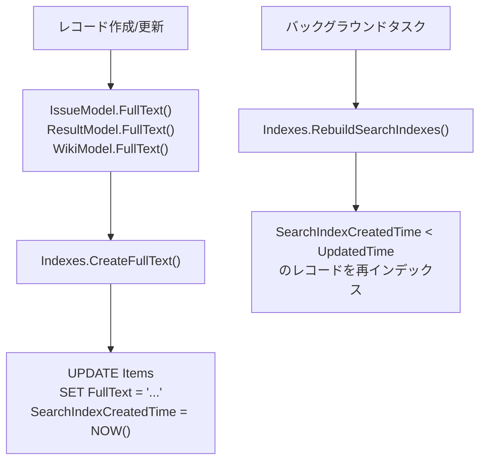
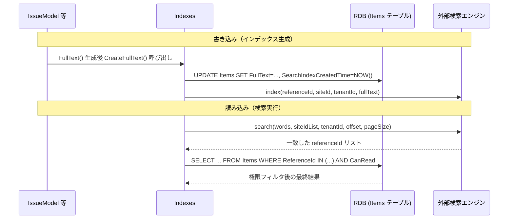
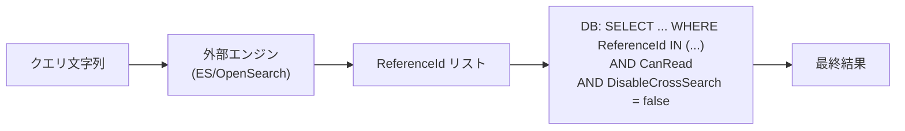

# 検索機能の外部検索エンジン外出し調査

プリザンターの検索機能を Elasticsearch などの外部検索エンジンに外出しする場合に使用するパッケージと実装変更箇所を調査する。

<!-- START doctoc generated TOC please keep comment here to allow auto update -->
<!-- DON'T EDIT THIS SECTION, INSTEAD RE-RUN doctoc TO UPDATE -->

- [調査情報](#調査情報)
- [調査目的](#調査目的)
- [現行の全文検索アーキテクチャ](#現行の全文検索アーキテクチャ)
    - [データ格納方式](#データ格納方式)
    - [検索実行方式](#検索実行方式)
    - [検索タイプ](#検索タイプ)
    - [日本語トークナイザ](#日本語トークナイザ)
- [外部検索エンジン候補](#外部検索エンジン候補)
    - [Elasticsearch / OpenSearch](#elasticsearch--opensearch)
    - [Meilisearch](#meilisearch)
- [NuGet パッケージ比較](#nuget-パッケージ比較)
- [実装変更箇所の調査](#実装変更箇所の調査)
    - [全体アーキテクチャ（変更後）](#全体アーキテクチャ変更後)
    - [変更が必要なファイル一覧](#変更が必要なファイル一覧)
- [日本語解析の考慮事項](#日本語解析の考慮事項)
- [権限制御（アクセス制御）の扱い](#権限制御アクセス制御の扱い)
- [マルチテナントへの対応](#マルチテナントへの対応)
- [結論](#結論)
- [関連ソースコード](#関連ソースコード)

<!-- END doctoc generated TOC please keep comment here to allow auto update -->

## 調査情報

| 調査日       | リポジトリ | ブランチ | タグ/バージョン    | コミット    | 備考     |
| ------------ | ---------- | -------- | ------------------ | ----------- | -------- |
| 2026年3月3日 | Pleasanter | main     | Pleasanter_1.5.1.0 | `34f162a43` | 初回調査 |

## 調査目的

検索機能を Elasticsearch などの外部検索エンジンに外出しするとした場合に、採用するパッケージの候補と、実装上の変更箇所を明確にする。

---

## 現行の全文検索アーキテクチャ

### データ格納方式

プリザンターの全文検索は、各レコードの全フィールド内容を結合したテキストを `Items.FullText` カラムに格納する方式を採用している。
添付ファイル検索は `Binaries.Bin` カラムを直接 SQL で検索する（SQL Server のみ実用的）。



**ファイル**: `Implem.Pleasanter/Libraries/Search/Indexes.cs`（行番号: 131-145）

```csharp
private static void CreateFullText(Context context, long id, string fullText)
{
    if (fullText != null)
    {
        Repository.ExecuteNonQuery(
            context: context,
            statements: Rds.UpdateItems(
                where: Rds.ItemsWhere().ReferenceId(id),
                param: Rds.ItemsParam()
                    .FullText(fullText)
                    .SearchIndexCreatedTime(DateTime.Now),
                addUpdatorParam: false,
                addUpdatedTimeParam: false));
    }
}
```

### 検索実行方式

クロスサーチ（全サイト横断検索）とサイト内検索の両方で `Items.FullText` を参照する。
DB エンジンごとに `ISqlCommandText` インタフェースの実装が異なる。

| DB エンジン | FullText 検索構文                                            | 添付ファイル検索                     | 備考                                |
| ----------- | ------------------------------------------------------------ | ------------------------------------ | ----------------------------------- |
| SQL Server  | `CONTAINS("Items"."FullText", @param)`                       | `CONTAINS("Binaries"."Bin", @param)` | IFilter 経由でバイナリ解析          |
| PostgreSQL  | `"Items"."FullText" %> @param`                               | `encode("Bin", 'escape') %> @param`  | pg_trgm 拡張 + GIN インデックス必須 |
| MySQL       | `MATCH("Items"."FullText") AGAINST (@param IN BOOLEAN MODE)` | `0=1`（非対応）                      | ngram パーサー必須                  |

### 検索タイプ

`SiteSettings.SearchType` によって以下の検索モードが切り替わる。

| SearchType               | 動作                                                                     |
| ------------------------ | ------------------------------------------------------------------------ |
| `FullText`（デフォルト） | `ISqlCommandText.CreateFullTextWhereItem()` が生成する DB 固有の全文検索 |
| `PartialMatch`           | `Items.FullText` に対する `LIKE '%...%'` 検索                            |
| `MatchInFrontOfTitle`    | `Items.Title` に対する前方一致                                           |
| `BroadMatchOfTitle`      | `Items.Title` に対する部分一致                                           |

### 日本語トークナイザ

`Implem.Pleasanter/Libraries/Search/WordBreaker.cs` がひらがな・カタカナ・漢字・英数字を文字種別に分類してトークン分割する。
SQL Server の IFilter や pg_trgm の場合は WordBreaker のトークンをそのまま検索クエリに使用する。

---

## 外部検索エンジン候補

### Elasticsearch / OpenSearch

Elasticsearch と AWS が管理する OpenSearch（v1.x/2.x）はともに Lucene ベースで、日本語解析プラグイン（kuromoji、Sudachi）が充実している。

| 項目              | Elasticsearch 8.x                      | OpenSearch 2.x                 |
| ----------------- | -------------------------------------- | ------------------------------ |
| ライセンス        | SSPL / Elastic License 2.0             | Apache License 2.0             |
| AWS マネージド    | Amazon Elasticsearch Service（非推奨） | Amazon OpenSearch Service      |
| セルフホスト      | 可能                                   | 可能                           |
| 日本語解析        | `analysis-kuromoji` / `analysis-icu`   | `analysis-kuromoji` (built-in) |
| .NET クライアント | `Elastic.Clients.Elasticsearch`        | `OpenSearch.Client`            |

### Meilisearch

Rust 製の軽量全文検索エンジン。設定が簡易で日本語トークナイザも内蔵しているが、権限制御のような複雑なフィルタ条件との組み合わせは考慮が必要になる。

| 項目              | 内容            |
| ----------------- | --------------- |
| ライセンス        | MIT             |
| 日本語解析        | Lindera（内蔵） |
| .NET クライアント | `Meilisearch`   |
| セルフホスト      | 可能            |

---

## NuGet パッケージ比較

| パッケージ名                    | 対象エンジン       | .NET 対応            | 特徴                                         |
| ------------------------------- | ------------------ | -------------------- | -------------------------------------------- |
| `Elastic.Clients.Elasticsearch` | Elasticsearch 8.x  | net6+ ✓ (net10 対応) | 公式最新 v8 クライアント。強い型付け API     |
| `NEST`                          | Elasticsearch 7.x  | netstandard2.0 ✓     | 旧クライアント。EOL 済み。新規採用非推奨     |
| `OpenSearch.Client`             | OpenSearch 1.x/2.x | netstandard2.0 ✓     | NEST フォーク。API は NEST とほぼ同等        |
| `Meilisearch`                   | Meilisearch        | net6+ ✓              | 簡易 REST ラッパー                           |
| `Azure.Search.Documents`        | Azure AI Search    | net6+ ✓              | Azure 専用。Azure 環境以外での採用は非現実的 |

現行プリザンターのターゲットフレームワークは `net10.0` であり、上記のいずれも対応する。
Elasticsearch 8.x 系を使用する場合は `Elastic.Clients.Elasticsearch`、AWS 環境で OpenSearch を使用する場合は `OpenSearch.Client` が第一候補となる。

---

## 実装変更箇所の調査

### 全体アーキテクチャ（変更後）



### 変更が必要なファイル一覧

#### 1. パラメータ追加

**ファイル**: `Implem.ParameterAccessor/Parts/Search.cs`

外部検索エンジンへの接続情報と有効/無効フラグを追加する。

```csharp
public class Search
{
    // 既存フィールド（変更なし）
    public bool SearchDocuments;
    public bool CreateIndexes;
    public int PageSize;
    public bool DisableCrossSearch;
    public bool DisableCrossSearchSites;
    public bool FullTextIncludeBreadcrumb;
    public bool FullTextIncludeSiteId;
    public bool FullTextIncludeSiteTitle;
    public int FullTextNumberOfMails;
    public int FullTextMaxNumberOfMails;

    // 追加フィールド
    public ExternalSearch ExternalSearch;
}

public class ExternalSearch
{
    public bool Enabled;          // 外部検索エンジンを使用するか
    public string Engine;         // "Elasticsearch" or "OpenSearch" or "Meilisearch"
    public string Url;            // 接続 URL（例: "http://localhost:9200"）
    public string IndexName;      // インデックス名（例: "pleasanter"）
    public string ApiKey;         // 認証用 API キー（省略可）
    public string CertificateFingerprint; // SSL 証明書フィンガープリント（省略可）
}
```

対応する JSON パラメータファイル（`App_Data/Parameters/Search.json`）にも同フィールドを追加する。

#### 2. 外部検索エンジンインタフェースの追加

現行の `ISqlCommandText` と同様に、検索エンジンの実装を差し替えられるようインタフェースを新設する。

**新規ファイル**: `Implem.Pleasanter/Libraries/Search/IFullTextSearchEngine.cs`

```csharp
namespace Implem.Pleasanter.Libraries.Search
{
    public interface IFullTextSearchEngine
    {
        void Index(long referenceId, long siteId, int tenantId,
                   string referenceType, string fullText);
        void Delete(long referenceId);
        IEnumerable<long> Search(string searchText,
                                 IEnumerable<long> siteIdList,
                                 int tenantId,
                                 int offset,
                                 int pageSize);
    }
}
```

#### 3. Elasticsearch 実装クラスの追加

**新規ファイル**: `Implem.Pleasanter/Libraries/Search/ElasticsearchEngine.cs`

`Elastic.Clients.Elasticsearch` パッケージを使用する実装例。

```csharp
using Elastic.Clients.Elasticsearch;

namespace Implem.Pleasanter.Libraries.Search
{
    public class ElasticsearchEngine : IFullTextSearchEngine
    {
        private readonly ElasticsearchClient _client;
        private readonly string _indexName;

        public ElasticsearchEngine(string url, string indexName, string apiKey = null)
        {
            var settings = new ElasticsearchClientSettings(new Uri(url))
                .DefaultIndex(indexName);
            if (!string.IsNullOrEmpty(apiKey))
                settings = settings.Authentication(new ApiKey(apiKey));
            _client = new ElasticsearchClient(settings);
            _indexName = indexName;
        }

        public void Index(long referenceId, long siteId, int tenantId,
                          string referenceType, string fullText)
        {
            _client.Index(new PleasanterDocument
            {
                ReferenceId = referenceId,
                SiteId = siteId,
                TenantId = tenantId,
                ReferenceType = referenceType,
                FullText = fullText
            }, i => i.Index(_indexName).Id(referenceId));
        }

        public void Delete(long referenceId)
        {
            _client.Delete<PleasanterDocument>(
                referenceId, d => d.Index(_indexName));
        }

        public IEnumerable<long> Search(string searchText,
                                        IEnumerable<long> siteIdList,
                                        int tenantId,
                                        int offset,
                                        int pageSize)
        {
            var response = _client.Search<PleasanterDocument>(s => s
                .Index(_indexName)
                .From(offset)
                .Size(pageSize)
                .Query(q => q
                    .Bool(b => b
                        .Must(m => m
                            .Match(mm => mm
                                .Field(f => f.FullText)
                                .Query(searchText)))
                        .Filter(
                            f => f.Term(t => t.TenantId, tenantId),
                            siteIdList?.Any() == true
                                ? f => f.Terms(t => t
                                    .Field(ff => ff.SiteId)
                                    .Terms(new TermsQueryField(
                                        siteIdList.Select(id =>
                                            FieldValue.Long(id))
                                        .ToArray())))
                                : null
                        ))));
            return response.IsValidResponse
                ? response.Documents.Select(d => d.ReferenceId)
                : Enumerable.Empty<long>();
        }
    }

    internal class PleasanterDocument
    {
        public long ReferenceId { get; set; }
        public long SiteId { get; set; }
        public int TenantId { get; set; }
        public string ReferenceType { get; set; }
        public string FullText { get; set; }
    }
}
```

OpenSearch の場合は同じ構造で `OpenSearch.Client` を使用する実装クラス `OpenSearchEngine` を追加する。
API は NEST と互換性が高いため、コードの変更は最小限となる。

#### 4. Indexes.CreateFullText() の修正

**ファイル**: `Implem.Pleasanter/Libraries/Search/Indexes.cs`（行番号: 131-145）

DB 更新後に外部検索エンジンへのインデックス登録を追加する。

```csharp
private static void CreateFullText(Context context, long id, string fullText)
{
    if (fullText != null)
    {
        Repository.ExecuteNonQuery(
            context: context,
            statements: Rds.UpdateItems(
                where: Rds.ItemsWhere().ReferenceId(id),
                param: Rds.ItemsParam()
                    .FullText(fullText)
                    .SearchIndexCreatedTime(DateTime.Now),
                addUpdatorParam: false,
                addUpdatedTimeParam: false));

        // 外部検索エンジンが有効な場合はインデックスを送信
        if (Parameters.Search.ExternalSearch?.Enabled == true)
        {
            var engine = SearchEngineFactory.Get();
            // siteId や referenceType は Items テーブルから別途取得が必要
            engine?.Index(referenceId: id, ...);
        }
    }
}
```

#### 5. Indexes.Get() の修正

**ファイル**: `Implem.Pleasanter/Libraries/Search/Indexes.cs`（行番号: 748-810）

外部検索エンジンが有効な場合は ES から一致する `ReferenceId` を先に取得し、DB クエリをそのリストで絞り込む方式に切り替える。

```csharp
public static DataSet Get(
    Context context,
    string searchText,
    IEnumerable<long> siteIdList = null,
    string dataTableName = null,
    int offset = 0,
    int pageSize = 0,
    bool countRecord = false)
{
    // 外部検索エンジンが有効な場合はエンジンから ID リストを取得
    if (Parameters.Search.ExternalSearch?.Enabled == true)
    {
        var engine = SearchEngineFactory.Get();
        var matchedIds = engine?.Search(
            searchText: searchText,
            siteIdList: siteIdList,
            tenantId: context.TenantId,
            offset: offset,
            pageSize: pageSize);
        if (matchedIds?.Any() != true) return null;
        // matchedIds を使って DB から CanRead チェック付きで取得
        return GetByIds(context, matchedIds, dataTableName);
    }

    // 既存の SQL 全文検索ロジック（変更なし）
    var words = context.SqlCommandText.CreateSearchTextWords(...);
    ...
}
```

#### 6. 削除時のインデックス削除

**ファイル**: `Implem.Pleasanter/Models/Items/ItemModel.cs`

レコード削除時に外部検索エンジンからもドキュメントを削除する必要がある。
`IssueModel.Delete()`、`ResultModel.Delete()`、`WikiModel.Delete()` の呼び出し箇所を確認し、同様に外部エンジンへの Delete 呼び出しを追加する。

---

## 日本語解析の考慮事項

現行の `WordBreaker.cs` は DB 側に渡すクエリ文字列の生成を担っているが、外部検索エンジンに外出しした場合はエンジン側のアナライザーが分かち書きを担う。

| 対象                         | 現行                                                                    | 外部エンジン（Elasticsearch）                                          |
| ---------------------------- | ----------------------------------------------------------------------- | ---------------------------------------------------------------------- |
| インデックス時のトークナイズ | `WordBreaker.cs` 経由でトークン化したテキストを `Items.FullText` に格納 | ES のアナライザー（`kuromoji_tokenizer` 等）がインデックス時に自動分割 |
| クエリ時のトークナイズ       | `Words()` + `FullTextClause()` で CONTAINS/MATCH 用文字列生成           | ES の `match` クエリがアナライザー経由で分割                           |
| ひらがな・カタカナ揺れ       | `WordBreaker.cs` でヒラガナ/カタカナの両形を追加                        | kuromoji の `readingform` フィルタで吸収可能                           |

ES インデックス作成時に以下のアナライザー設定を行うことで日本語検索精度が向上する。

```json
{
    "settings": {
        "analysis": {
            "analyzer": {
                "pleasanter_ja": {
                    "type": "custom",
                    "tokenizer": "kuromoji_tokenizer",
                    "filter": ["kuromoji_baseform", "kuromoji_part_of_speech", "cjk_width", "ja_stop", "lowercase"]
                }
            }
        }
    },
    "mappings": {
        "properties": {
            "fullText": { "type": "text", "analyzer": "pleasanter_ja" },
            "referenceId": { "type": "long" },
            "siteId": { "type": "long" },
            "tenantId": { "type": "integer" },
            "referenceType": { "type": "keyword" }
        }
    }
}
```

---

## 権限制御（アクセス制御）の扱い

現行の全文検索では `Def.Sql.CanRead` を SQL WHERE 句に直接適用することで、ユーザーが参照できないレコードが検索結果に含まれないようにしている。

外部検索エンジンは権限情報を持たないため、外出し後も **権限チェックは必ず DB 側で行う**必要がある。



ES からの `ReferenceId` リストに対して DB の `CanRead` チェックを通過したものだけを返す設計を維持する。
このため `Indexes.Get()` の変更は「ES 側で offset/pageSize を適用してから DB 絞り込み」という構成となり、DB 側でのページングと整合が取れない可能性に注意が必要である（ES の件数と DB の権限チェック後の件数が異なる場合がある）。

---

## マルチテナントへの対応

プリザンターはマルチテナント構成を持つため、ES インデックスには `tenantId` フィールドを持たせ、検索クエリに常に `tenantId` フィルタを適用する必要がある。

テナントごとに ES インデックスを分けるか（`pleasanter_tenant1` 等）、単一インデックスに `tenantId` フィールドでフィルタするかは、テナント数・データ量のトレードオフで判断する。

---

## 結論

| 項目                                | 内容                                                                                   |
| ----------------------------------- | -------------------------------------------------------------------------------------- |
| 推奨パッケージ（Elasticsearch 8.x） | `Elastic.Clients.Elasticsearch`（NuGet）                                               |
| 推奨パッケージ（OpenSearch / AWS）  | `OpenSearch.Client`（NuGet）                                                           |
| 推奨パッケージ（Meilisearch）       | `Meilisearch`（NuGet）                                                                 |
| 現行 net10.0 との互換性             | いずれも対応                                                                           |
| 主な変更ファイル                    | `Indexes.cs`、`Search.cs`（パラメータ）、新規 `IFullTextSearchEngine.cs` と実装クラス  |
| 権限制御                            | ES から取得した ID リストを DB で `CanRead` フィルタ後に返す設計を維持                 |
| 日本語解析                          | ES 側では `kuromoji_tokenizer` を使用し、`WordBreaker.cs` によるクエリ加工は不要になる |
| `RebuildSearchIndexes`              | バックグラウンドタスクで ES への一括再送信も実装が必要                                 |
| 削除レコードの扱い                  | レコード削除時に `IFullTextSearchEngine.Delete()` を呼び出す必要がある                 |
| ページング整合                      | ES の件数と DB の権限チェック後件数が乖離する可能性があり設計上の注意が必要            |

実装の主要変更箇所は以下の 4 点に集約される。

1. `Search.cs`（パラメータ）への接続情報追加
2. `IFullTextSearchEngine` インタフェースと ES/OpenSearch/Meilisearch 実装クラスの新規追加
3. `Indexes.CreateFullText()` への外部エンジンへの書き込み処理追加
4. `Indexes.Get()` への外部エンジンからの ID リスト取得ロジック追加

既存の SQL 全文検索を完全に廃止するのではなく、`Parameters.Search.ExternalSearch.Enabled` フラグで切り替える構成にすることで、外部エンジンを使用しない既存環境への影響をなくすことができる。

---

## 関連ソースコード

| ファイル                                            | 用途                                     |
| --------------------------------------------------- | ---------------------------------------- |
| `Implem.Pleasanter/Libraries/Search/Indexes.cs`     | 全文検索インデックス生成・検索実行の中核 |
| `Implem.Pleasanter/Libraries/Search/WordBreaker.cs` | 日本語トークナイザ                       |
| `Implem.ParameterAccessor/Parts/Search.cs`          | 検索パラメータ定義                       |
| `Rds/Implem.IRds/ISqlCommandText.cs`                | DB 固有の全文検索 SQL 生成インタフェース |
| `Rds/Implem.SqlServer/SqlServerCommandText.cs`      | SQL Server 実装（CONTAINS）              |
| `Rds/Implem.PostgreSql/PostgreSqlCommandText.cs`    | PostgreSQL 実装（pg_trgm %\>）           |
| `Rds/Implem.MySql/MySqlCommandText.cs`              | MySQL 実装（MATCH...AGAINST）            |
