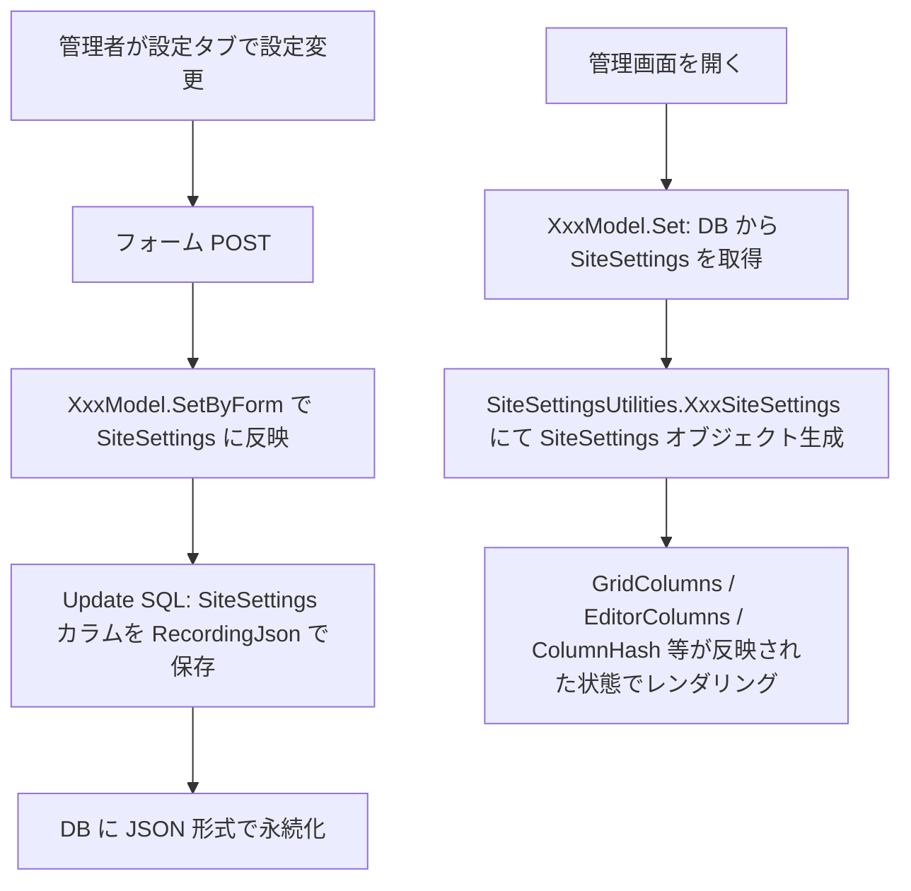
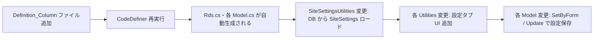
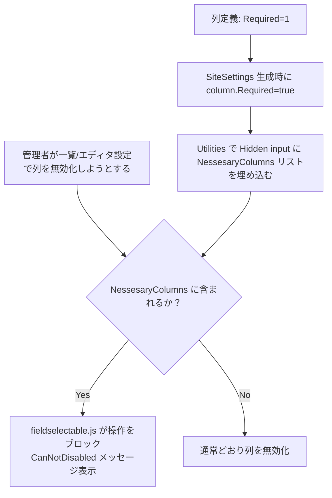

# テナント・グループ・組織・ユーザー管理画面への設定機能追加

テナント・グループ・組織（Dept）・ユーザーの管理画面に、サイト設定（SiteSettings）と同等の設定タブ（全般/ガイド・一覧・リンク・エディタ・履歴）を追加するための実装方針を調査した結果。

<!-- START doctoc generated TOC please keep comment here to allow auto update -->
<!-- DON'T EDIT THIS SECTION, INSTEAD RE-RUN doctoc TO UPDATE -->

- [調査情報](#調査情報)
- [調査目的](#調査目的)
- [現状調査](#現状調査)
    - [各エンティティの管理画面タブ構成](#各エンティティの管理画面タブ構成)
    - [SiteSettings の現在の生成方法](#sitesettings-の現在の生成方法)
    - [Sites テーブルとの比較](#sites-テーブルとの比較)
- [追加すべき設定タブの内容](#追加すべき設定タブの内容)
    - [全般タブへのガイド追加](#全般タブへのガイド追加)
    - [一覧タブ](#一覧タブ)
    - [リンクタブ](#リンクタブ)
    - [エディタタブ](#エディタタブ)
    - [履歴タブ（設定）](#履歴タブ設定)
- [設定の永続化方針](#設定の永続化方針)
    - [選択肢の比較](#選択肢の比較)
    - [推奨方針](#推奨方針)
    - [SiteSettings 内のガイドフィールド](#sitesettings-内のガイドフィールド)
- [実装方針](#実装方針)
    - [全体フロー](#全体フロー)
    - [1. Definition_Column ファイルの追加（CodeDefiner 定義）](#1-definition_column-ファイルの追加codedefiner-定義)
    - [2. SiteSettingsUtilities の変更](#2-sitesettingsutilities-の変更)
    - [3. 各 Utilities の変更（EditorTabs・設定エディタ）](#3-各-utilities-の変更editortabs設定エディタ)
    - [4. 各 Model の変更（SetByForm・Update）](#4-各-model-の変更setbyformupdate)
    - [5. CodeDefiner の再実行](#5-codedefiner-の再実行)
- [改修対象ファイル一覧](#改修対象ファイル一覧)
- [エンティティ別の設定対象カラム](#エンティティ別の設定対象カラム)
    - [Tenants（テナント）](#tenantsテナント)
    - [Groups（グループ）](#groupsグループ)
    - [Depts（組織）](#depts組織)
    - [Users（ユーザー）](#usersユーザー)
- [エディタ設定の詳細](#エディタ設定の詳細)
    - [AutoVerUpType（バージョンアップモード）](#autoveruptypeバージョンアップモード)
    - [DefaultInput（規定値）](#defaultinput規定値)
- [拡張カラム設定（カラムプロパティ編集）](#拡張カラム設定カラムプロパティ編集)
    - [SiteSettings のカラムプロパティ](#sitesettings-のカラムプロパティ)
    - [管理エンティティへの適用](#管理エンティティへの適用)
    - [実装方針](#実装方針-1)
- [無効化できない項目（必須表示カラム）](#無効化できない項目必須表示カラム)
    - [既存の無効化防止機構（エディタのみ）](#既存の無効化防止機構エディタのみ)
    - [一覧（GridColumns）の無効化防止機構](#一覧gridcolumnsの無効化防止機構)
    - [カラム定義側の Required 設定](#カラム定義側の-required-設定)
    - [実装手順まとめ](#実装手順まとめ)
- [結論](#結論)
- [関連ソースコード](#関連ソースコード)
- [関連ドキュメント](#関連ドキュメント)

<!-- END doctoc generated TOC please keep comment here to allow auto update -->

## 調査情報

| 調査日       | リポジトリ | ブランチ | タグ/バージョン    | コミット    | 備考     |
| ------------ | ---------- | -------- | ------------------ | ----------- | -------- |
| 2026年3月4日 | Pleasanter | main     | Pleasanter_1.5.1.0 | `34f162a43` | 初回調査 |

## 調査目的

- テナント・グループ・組織・ユーザーの管理画面に対して、サイト設定と同等の設定タブを追加するために必要な実装変更を把握する
- 特に以下の設定機能の追加に必要な変更箇所を特定する
    - 全般タブへのガイド（GridGuide / EditorGuide）設定追加
    - 一覧設定（GridColumns の選択）
    - リンク設定（LinkColumns の選択）
    - エディタ設定（DefaultInput による規定値設定・AutoVerUpType によるバージョンアップモード変更）
    - 拡張カラム設定（列ラベル・選択肢・既定値などのカラムプロパティ編集）
    - 一覧・編集画面の無効化できない項目（必須表示カラム）設定
    - 履歴設定（HistoryColumns の選択）

---

## 現状調査

### 各エンティティの管理画面タブ構成

各エンティティの `EditorTabs()` メソッドが生成する現在のタブ一覧を以下に示す。

| エンティティ | 現在のタブ                                                           | 定義メソッド                 |
| ------------ | -------------------------------------------------------------------- | ---------------------------- |
| Tenant       | 全般、ServerScript（契約・HasPrivilege 条件付き）                    | `TenantUtilities.EditorTabs` |
| Group        | 全般、メンバー（既存レコードのみ）、子グループ（既存のみ）、変更履歴 | `GroupUtilities.EditorTabs`  |
| Dept         | 全般、変更履歴（非公開かつ既存のみ）                                 | `DeptUtilities.EditorTabs`   |
| User         | 全般、メールアドレス（EnableManageTenant 以外）、変更履歴            | `UserUtilities.EditorTabs`   |

上記いずれのエンティティも、サイト設定（SiteSettings）と同等の**設定専用タブ**（全般ガイド・一覧・リンク・エディタ・履歴設定）は存在しない。

### SiteSettings の現在の生成方法

各エンティティの SiteSettings は `SiteSettingsUtilities.cs` 内のメソッドでハードコードされており、データベースに保存・取得する仕組みは存在しない。

```csharp
// SiteSettingsUtilities.cs（例: TenantsSiteSettings）
public static SiteSettings TenantsSiteSettings(Context context, ...)
{
    var ss = new SiteSettings() { ReferenceType = "Tenants" };
    ss.Init(context: context);
    ss.SetLinks(context: context);
    ss.SetChoiceHash(context: context, withLink: false);
    ss.PermissionType = Permissions.Admins(context: context);
    ss.TableType = tableTypes;
    return ss;  // ←設定値はすべてデフォルト値
}
```

同様のメソッドが `GroupsSiteSettings`・`DeptsSiteSettings`・`UsersSiteSettings` にも存在し、いずれも DB からの設定読み込みは行っていない。

### Sites テーブルとの比較

Sites テーブルは `SiteSettings` カラム（`nvarchar(max)`）に JSON 形式で設定を格納している。
このカラムを SiteModel が読み込み、`SitesSiteSettings()` で SiteSettings オブジェクトに変換する。

また、`GridGuide`・`EditorGuide` 等のガイドフィールドは Sites テーブルに**独立したカラムとして**格納されており、`SiteSettings` の各フィールドとして SiteSettings オブジェクトに反映される。

| 比較項目         | Sites                                  | Tenants / Groups / Depts / Users |
| ---------------- | -------------------------------------- | -------------------------------- |
| SiteSettings保存 | `Sites.SiteSettings` カラム（DB）      | なし（ハードコード）             |
| ガイド保存       | `Sites.GridGuide`・`EditorGuide`（DB） | なし                             |
| GridColumns      | SiteSettings.GridColumns で永続化      | 常にデフォルト値                 |
| EditorColumns    | SiteSettings.EditorColumns で永続化    | 常にデフォルト値                 |
| DefaultInput     | SiteSettings.ColumnHash で永続化       | 常にデフォルト値                 |
| AutoVerUpType    | SiteSettings.AutoVerUpType で永続化    | 常にデフォルト（Default=1）      |

---

## 追加すべき設定タブの内容

### 全般タブへのガイド追加

現状の「全般タブ」はレコードの通常フィールド（テナント名・グループ名等）を表示するだけで、ガイドテキスト設定 UI は存在しない。

サイト設定の `GuideEditor()` に相当する UI を追加する。Sites の場合は `Sites_GridGuide`・`Sites_EditorGuide` の 2 フィールドが該当する。

- **一覧ガイド（GridGuide）**: 一覧画面の上部に表示するガイドテキスト
- **編集ガイド（EditorGuide）**: 編集フォームの上部に表示するガイドテキスト

### 一覧タブ

`SiteUtilities.GridSettingsEditor()` に相当する UI を追加する。`SiteSettings.GridColumns` により、一覧に表示するカラムと並び順を制御できる。

現状はすべてのエンティティで `ColumnDefinition` の `Grid = 1` 設定に従いデフォルト列が表示されるが、設定タブ追加後は管理者が列を選択可能になる。

### リンクタブ

`SiteUtilities.LinksSettingsEditor()` に相当する UI を追加する。`SiteSettings.LinkColumns` により、リンクモーダル内に表示するカラムを制御できる。

### エディタタブ

`SiteUtilities.EditorSettingsEditor()` に相当する UI を追加する。主に以下の 2 つの設定が目的となる。

1. **DefaultInput（規定値）**: 新規レコード作成時にフォームへ自動入力する値。`SiteSettings.ColumnHash` 内の `Column.DefaultInput` として格納される。
2. **AutoVerUpType（バージョンアップモード）**: 更新時に版管理レコード（履歴）を作成するタイミング。`SiteSettings.AutoVerUpType` として格納される。

### 履歴タブ（設定）

`SiteUtilities.HistoriesSettingsEditor()` に相当する UI を追加する。`SiteSettings.HistoryColumns` により、履歴一覧に表示するカラムを制御できる。

> 注意: 各エンティティが既に持つ「変更履歴」タブ（`FieldSetHistories`）は**履歴の閲覧**用であり、「履歴設定タブ」は**履歴一覧表示カラムの設定**用として別タブになる。

---

## 設定の永続化方針

### 選択肢の比較

| 方針                                    | 概要                                                                     | メリット                                                        | デメリット                                  |
| --------------------------------------- | ------------------------------------------------------------------------ | --------------------------------------------------------------- | ------------------------------------------- |
| A. 各テーブルに SiteSettings カラム追加 | Tenants/Groups/Depts/Users に `SiteSettings nvarchar(max)` 列を追加      | Sites と同一パターン。既存 SiteSettings クラスをそのまま再利用  | CodeDefiner 再実行・DB マイグレーション必要 |
| B. TenantSettings に内包                | TenantSettings に SiteSettings プロパティを追加                          | Tenants のみ対応可能（Groups/Depts/Users は既存設定クラスなし） | 各エンティティで設計が統一されない          |
| C. 新設定クラスを追加                   | GroupSettings・DeptSettings・UserSettings に管理画面専用プロパティを追加 | 型安全な設定管理が可能                                          | クラス追加ごとに DB カラム追加が必要        |

### 推奨方針

**方針 A（各テーブルに SiteSettings カラム追加）** を推奨する。Sites テーブルと同一のパターンであり、既存の `SiteSettings` クラス・`SiteSettingsUtilities` の仕組みをそのまま活用できる。

4 エンティティすべてに `SiteSettings nvarchar(max)` カラムを追加し、以下のフローで読み書きを行う。



### SiteSettings 内のガイドフィールド

Sites テーブルでは `GridGuide`・`EditorGuide` は独立したカラムだが、Tenants/Groups/Depts/Users では独立カラムを追加せず、**SiteSettings JSON の中にガイドテキストを格納する**方針も取れる。

ただし、SiteSettings.GridGuide は `SiteSettings.cs` のフィールドとして定義されており（`public string GridGuide`）、JSON 形式で `SiteSettings` カラムに含めることが可能である。そのため、独立カラムは不要となる。

---

## 実装方針

### 全体フロー



### 1. Definition_Column ファイルの追加（CodeDefiner 定義）

以下の 4 ファイルを追加する（`Sites_SiteSettings.json` を参考にする）。

```
Implem.Pleasanter/App_Data/Definitions/Definition_Column/Tenants_SiteSettings.json
Implem.Pleasanter/App_Data/Definitions/Definition_Column/Groups_SiteSettings.json
Implem.Pleasanter/App_Data/Definitions/Definition_Column/Depts_SiteSettings.json
Implem.Pleasanter/App_Data/Definitions/Definition_Column/Users_SiteSettings.json
```

各ファイルの基本構成（Tenants を例に）は以下の通り。

```json
{
    "Id": "Tenants_SiteSettings",
    "ModelName": "Tenant",
    "TableName": "Tenants",
    "Label": "テナント",
    "ColumnName": "SiteSettings",
    "LabelText": "管理画面設定",
    "No": "XXX",
    "TypeName": "nvarchar",
    "TypeCs": "SiteSettings",
    "RecordingData": ".RecordingJson(context: context)",
    "MaxLength": "-1",
    "Nullable": "1",
    "NotForm": "1",
    "ByDataRow": "GetSiteSettings(context: context, dataRow: dataRow)",
    "BySession": "context.SessionData.Get(\"SiteSettings\")?.ToString().DeserializeSiteSettings(context: context) ?? new SiteSettings(context: context, referenceType: ReferenceType)"
}
```

> `No` には各テーブルで既存番号と重複しない値を割り当てる。

### 2. SiteSettingsUtilities の変更

CodeDefiner 再実行後、各 `*SiteSettings()` メソッドを修正して DB から `SiteSettings` を取得するように変更する。

```csharp
// 変更前（現状）
public static SiteSettings TenantsSiteSettings(Context context, ...)
{
    var ss = new SiteSettings() { ReferenceType = "Tenants" };
    ss.Init(context: context);
    // ...
    return ss;
}

// 変更後（イメージ）
public static SiteSettings TenantsSiteSettings(
    Context context,
    int tenantId = 0,
    Sqls.TableTypes tableTypes = Sqls.TableTypes.Normal)
{
    var ss = tenantId > 0
        ? Repository.ExecuteTable(context, Rds.SelectTenants(
            column: Rds.TenantsColumn().SiteSettings(),
            where: Rds.TenantsWhere().TenantId(tenantId)))
            .AsEnumerable()
            .FirstOrDefault()
            ?.String("SiteSettings")
            ?.DeserializeSiteSettings(context: context)
            ?? new SiteSettings() { ReferenceType = "Tenants" }
        : new SiteSettings() { ReferenceType = "Tenants" };
    ss.Init(context: context);
    ss.SetLinks(context: context);
    ss.SetChoiceHash(context: context, withLink: false);
    ss.PermissionType = Permissions.Admins(context: context);
    ss.TableType = tableTypes;
    return ss;
}
```

### 3. 各 Utilities の変更（EditorTabs・設定エディタ）

各エンティティの `EditorTabs()` メソッドに設定タブを追加する。以下は Tenant を例に示す。

#### タブ追加（EditorTabs）

```csharp
// TenantUtilities.cs の EditorTabs() への追加
private static HtmlBuilder EditorTabs(
    this HtmlBuilder hb, Context context, TenantModel tenantModel)
{
    return hb.Ul(id: "EditorTabs", action: () => hb
        .Li(action: () => hb
            .A(
                href: "#FieldSetGeneral",
                text: Displays.General(context: context)))
        // 追加: ガイド設定タブ（新規作成後のみ）
        .Li(
            _using: tenantModel.MethodType != BaseModel.MethodTypes.New,
            action: () => hb
                .A(
                    href: "#GuideEditor",
                    text: Displays.Guide(context: context)))
        // 追加: 一覧設定タブ
        .Li(
            _using: tenantModel.MethodType != BaseModel.MethodTypes.New,
            action: () => hb
                .A(
                    href: "#GridSettingsEditor",
                    text: Displays.Grid(context: context)))
        // 追加: リンク設定タブ
        .Li(
            _using: tenantModel.MethodType != BaseModel.MethodTypes.New,
            action: () => hb
                .A(
                    href: "#LinksSettingsEditor",
                    text: Displays.Links(context: context)))
        // 追加: エディタ設定タブ
        .Li(
            _using: tenantModel.MethodType != BaseModel.MethodTypes.New,
            action: () => hb
                .A(
                    href: "#EditorSettingsEditor",
                    text: Displays.Editor(context: context)))
        // 追加: 履歴設定タブ
        .Li(
            _using: tenantModel.MethodType != BaseModel.MethodTypes.New,
            action: () => hb
                .A(
                    href: "#HistoriesSettingsEditor",
                    text: Displays.Histories(context: context)))
        .Li(
            action: () => hb
                .A(
                    href: "#FieldSetServerScript",
                    text: Displays.ServerScript(context: context)),
            _using: context.HasPrivilege != false
                        && context.ContractSettings.ServerScript != false
                        && Parameters.Script.ServerScript != false
                        && Parameters.Script.BackgroundServerScript != false));
}
```

#### 設定エディタの描画追加

`FieldSetGeneral()` 内、または `Editor()` の描画処理部分に、`SiteUtilities` の設定エディタメソッドを呼び出すコードを追加する。

```csharp
// TenantUtilities.cs の Editor() 描画部分への追加（既存の EditorExtensions の前後）
hb
    .GuideEditor(context: context, ss: ss, siteModel: null)          // ガイド設定
    .GridSettingsEditor(context: context, ss: ss)                     // 一覧設定
    .LinksSettingsEditor(context: context, ss: ss)                    // リンク設定
    .EditorSettingsEditor(context: context, ss: ss)                   // エディタ設定
    .HistoriesSettingsEditor(context: context, ss: ss);               // 履歴設定
```

> `GuideEditor()` は現状 `SiteUtilities` に定義されているが、`siteModel` への依存を外すことで他エンティティからも呼び出し可能になる。または、エンティティごとに同様のメソッドを実装する。

### 4. 各 Model の変更（SetByForm・Update）

`SetByForm()` で SiteSettings の設定変更フォームデータを反映し、`Update()` で `SiteSettings` カラムに永続化する処理を追加する。

参考: `SiteModel.SetByForm()` では `SiteSettings` 関連のフォームデータ（`GridColumns`・`EditorColumns`・
`LinkColumns`・`HistoryColumns`・`AutoVerUpType`・各列の `DefaultInput`）を以下のように処理している。

```csharp
// SiteModel.SetByForm() の一部（抜粋）
case "ToDisableGridColumns":
    SiteSettings.GridColumns = context.Forms.List("GridColumnsAll");
    break;
case "AutoVerUpType":
    SiteSettings.AutoVerUpType = (Versions.AutoVerUpTypes)value.ToInt();
    break;
```

各エンティティの `XxxModel.SetByForm()` にも同様の処理を追加する。

### 5. CodeDefiner の再実行

`Definition_Column` ファイルを追加した後は CodeDefiner を実行し、以下のファイルを再生成する。

- `Implem.Pleasanter/Libraries/DataSources/Rds.cs`（SELECT/INSERT/UPDATE の SiteSettings カラム対応）
- `Implem.Pleasanter/Models/Tenants/TenantModel.cs`（`SiteSettings` プロパティ追加）
- `Implem.Pleasanter/Models/Groups/GroupModel.cs`
- `Implem.Pleasanter/Models/Depts/DeptModel.cs`
- `Implem.Pleasanter/Models/Users/UserModel.cs`

合わせて DB マイグレーションスクリプトで各テーブルに `SiteSettings nvarchar(max)` カラムを追加する。

---

## 改修対象ファイル一覧

| ファイル                                      | 変更種別 | 内容                                                       |
| --------------------------------------------- | -------- | ---------------------------------------------------------- |
| `Definition_Column/Tenants_SiteSettings.json` | 新規     | Tenants テーブルへの SiteSettings カラム定義追加           |
| `Definition_Column/Groups_SiteSettings.json`  | 新規     | Groups テーブルへの SiteSettings カラム定義追加            |
| `Definition_Column/Depts_SiteSettings.json`   | 新規     | Depts テーブルへの SiteSettings カラム定義追加             |
| `Definition_Column/Users_SiteSettings.json`   | 新規     | Users テーブルへの SiteSettings カラム定義追加             |
| `Libraries/DataSources/Rds.cs`                | 自動生成 | CodeDefiner により各エンティティの SiteSettings カラム対応 |
| `Models/Tenants/TenantModel.cs`               | 自動生成 | `SiteSettings` プロパティ追加                              |
| `Models/Groups/GroupModel.cs`                 | 自動生成 | `SiteSettings` プロパティ追加                              |
| `Models/Depts/DeptModel.cs`                   | 自動生成 | `SiteSettings` プロパティ追加                              |
| `Models/Users/UserModel.cs`                   | 自動生成 | `SiteSettings` プロパティ追加                              |
| `Libraries/Settings/SiteSettingsUtilities.cs` | 修正     | 各 `*SiteSettings()` メソッドで DB からロード              |
| `Models/Tenants/TenantUtilities.cs`           | 修正     | EditorTabs・設定エディタ描画の追加                         |
| `Models/Groups/GroupUtilities.cs`             | 修正     | EditorTabs・設定エディタ描画の追加                         |
| `Models/Depts/DeptUtilities.cs`               | 修正     | EditorTabs・設定エディタ描画の追加                         |
| `Models/Users/UserUtilities.cs`               | 修正     | EditorTabs・設定エディタ描画の追加                         |
| DBマイグレーションスクリプト                  | 新規     | 各テーブルへの `SiteSettings` カラム追加 SQL               |

---

## エンティティ別の設定対象カラム

各エンティティのカラム定義（`ColumnDefinition`）に登録されているカラムが設定対象となる。

### Tenants（テナント）

| カラム名                  | 一覧 | リンク | エディタ | 履歴 |
| ------------------------- | :--: | :----: | :------: | :--: |
| TenantName                |  o   |   o    |    o     |  o   |
| Title                     |  o   |   o    |    o     |  o   |
| Body                      |      |        |    o     |  o   |
| ContractDeadline          |  o   |   o    |    o     |  o   |
| DisableAllUsersPermission |  o   |        |    o     |  o   |
| DisableApi                |  o   |        |    o     |  o   |
| Theme                     |  o   |        |    o     |  o   |
| Language                  |  o   |        |    o     |  o   |
| TimeZone                  |  o   |        |    o     |  o   |

### Groups（グループ）

| カラム名  | 一覧 | リンク | エディタ | 履歴 |
| --------- | :--: | :----: | :------: | :--: |
| GroupName |  o   |   o    |    o     |  o   |
| Body      |      |        |    o     |  o   |

### Depts（組織）

| カラム名 | 一覧 | リンク | エディタ | 履歴 |
| -------- | :--: | :----: | :------: | :--: |
| DeptCode |  o   |   o    |    o     |  o   |
| DeptName |  o   |   o    |    o     |  o   |
| Body     |      |        |    o     |  o   |

### Users（ユーザー）

| カラム名  | 一覧 | リンク | エディタ | 履歴 |
| --------- | :--: | :----: | :------: | :--: |
| LoginId   |  o   |   o    |    o     |  o   |
| Name      |  o   |   o    |    o     |  o   |
| FirstName |  o   |        |    o     |  o   |
| LastName  |  o   |        |    o     |  o   |
| DeptId    |  o   |   o    |    o     |  o   |
| Gender    |  o   |        |    o     |  o   |
| Language  |  o   |        |    o     |  o   |
| TimeZone  |  o   |        |    o     |  o   |
| Theme     |  o   |        |    o     |  o   |
| Disabled  |  o   |        |    o     |  o   |
| AllowApi  |  o   |        |    o     |  o   |

---

## エディタ設定の詳細

### AutoVerUpType（バージョンアップモード）

`Versions.AutoVerUpTypes` 列挙体で定義された 3 段階を `SiteSettings.AutoVerUpType` に格納する。

| 値       | 整数値 | 動作                                                       |
| -------- | ------ | ---------------------------------------------------------- |
| Default  | 1      | 別ユーザーによる更新、または日付をまたぐ更新時に版を上げる |
| Always   | 2      | 毎回の更新で版を上げる                                     |
| Disabled | 3      | 版を上げない                                               |

現状、各エンティティ（Tenants/Groups/Depts/Users）の `Versions.VerUp()` 呼び出しでは `ss.AutoVerUpType`
が参照されているが、SiteSettings が常にデフォルト値で生成されるため `AutoVerUpType = Default(1)` のまま固定されている。

`SiteSettings` カラムをDB に追加することで、エンティティごとに `AutoVerUpType` を設定可能になる。

### DefaultInput（規定値）

`SiteSettings.ColumnHash` 内の `Column.DefaultInput` プロパティとして格納される。

新規レコード作成時に `GetDefaultInput()` が呼ばれ、フォームの初期値として設定される。各エンティティの `SetByForm()` では `DefaultInput` を含む SiteSettings のカラムプロパティ変更を処理する必要がある。

---

## 拡張カラム設定（カラムプロパティ編集）

一覧・エディタタブの列選択に加えて、各カラムのプロパティ（ラベル名・選択肢・規定値等）を編集できる機能を管理画面設定に追加する。サイト設定の `EditorColumnDialog`・`GridColumnDialog` に相当する機能を管理エンティティにも提供することが目的である。

### SiteSettings のカラムプロパティ

`SiteSettings.ColumnHash[ColumnName]`（`Column` オブジェクト）の各プロパティが「拡張カラム設定」の実体となる。

主なプロパティ一覧を以下に示す。

| プロパティ          | 用途                                  | 対象型         |
| ------------------- | ------------------------------------- | -------------- |
| LabelText           | 表示名（ラベル）の変更                | 全型           |
| ChoicesText         | プルダウン/チェックボックス選択肢定義 | ChoicesText 型 |
| DefaultInput        | 新規作成時の規定値                    | 全型           |
| ValidateRequired    | 入力必須バリデーション                | 全型           |
| FieldCss            | フィールドの CSS スタイル             | 全型           |
| TextAlign           | テキスト配置（左/右/中央）            | 全型           |
| MaxLength           | 最大文字数                            | nvarchar 型    |
| NoDuplication       | 重複禁止設定                          | 文字/数値/日付 |
| ViewerSwitchingType | Markdown ビューア切替設定             | MarkDown 型    |

これらは `SiteSettings.RecordingJson()` を通じて `SiteSettings` カラムに JSON 永続化される。

### 管理エンティティへの適用

管理エンティティ（Tenants/Groups/Depts/Users）のカラムは、`Definition_Column` の `GridEnabled`・`EditorEnabled` フラグが `1` に設定されているカラムのみが一覧・編集設定の対象となる。

各エンティティで設定 UI から変更可能にするカラムプロパティの代表例を以下に示す。

| エンティティ | 対象カラム                | 主な変更可能プロパティ                                                |
| ------------ | ------------------------- | --------------------------------------------------------------------- |
| Tenants      | Theme, Language, TimeZone | LabelText, DefaultInput                                               |
| Groups       | GroupName, Body           | LabelText, DefaultInput, ValidateRequired                             |
| Depts        | DeptCode, DeptName, Body  | LabelText, DefaultInput, ValidateRequired                             |
| Users        | LoginId, Name, DeptId 等  | LabelText, DefaultInput, ChoicesText（DeptId のみ）, ValidateRequired |

### 実装方針

`SiteUtilities.EditorColumnDialog()` および `GridColumnDialog()` は `SiteSettings` と `Column` を引数に取る
汎用メソッドであり、各管理エンティティの SiteSettings を渡すことで再利用可能である。

追加が必要な実装は以下の通り。

1. 各 Utilities の EditorSettings・GridColumns UI にカラムプロパティ編集ダイアログ起動ボタンを追加する
2. 各 Model の `SetByForm()` に、ダイアログから送信されるカラムプロパティを `SiteSettings.SetColumnProperty()` 経由で反映する処理を追加する

```csharp
// SiteModel.SetByForm() の既存実装（参考）
// context.Forms.ForEach(control => SiteSettings.SetColumnProperty(...))
// 同様の処理を XxxModel.SetByForm() にも追加する
```

---

## 無効化できない項目（必須表示カラム）

一覧（GridColumns）・編集画面（EditorColumns）の設定 UI において、管理者がカラムを「無効化できない（必ず表示する）項目」として指定できる機能の実装方針を示す。

### 既存の無効化防止機構（エディタのみ）

サイト設定のエディタ設定タブでは、`column.Required = true`（`ColumnDefinition.Required = 1`）のカラムを「無効化できない項目」として扱う仕組みが既に存在する。

```csharp
// SiteUtilities.cs - EditorSettings の実装
.Hidden(
    controlId: "EditorColumnsNessesaryColumns",
    value: Jsons.ToJson(
        ss.GetEditorColumnNames()
        ?.Where(o => ss.EditorColumn(o)?.Required == true)
        .Select(o => o)))
```

クライアントサイドでは `fieldselectable.js` の `moveColumns()` が `EditorColumnsNessesaryColumns`
の内容を参照し、該当カラムを「無効化」しようとすると警告メッセージを表示して操作をブロックする。

この機構は**エディタ設定（EditorColumns）にのみ**存在し、**一覧設定（GridColumns）には存在しない**。

### 一覧（GridColumns）の無効化防止機構

現状、GridColumns には `GridColumnsNessesaryColumns` に相当する仕組みが存在しない。
管理画面に一覧設定を追加する際、同様の機構を新規実装する必要がある。

実装方針を以下に示す。

```csharp
// TenantUtilities.cs の GridColumns UI（追加実装イメージ）
.Hidden(
    controlId: "GridColumnsNessesaryColumns",
    value: Jsons.ToJson(
        ss.GetGridColumnNames()
        ?.Where(o => ss.GridColumn(o)?.Required == true)
        .Select(o => o)))
```

クライアントサイドでは `fieldselectable.js` の `moveColumns()` が
`GridColumnsNessesaryColumns` を参照する形で対応できる（`EditorColumnsNessesaryColumns`
のパターンを `GridColumnsNessesaryColumns` に適用するだけで実現可能）。

### カラム定義側の Required 設定

「必ず表示する（無効化できない）カラム」を静的に定義する場合、`Definition_Column` の
`Required` フィールドを `1` に設定する。

Tenants/Groups/Depts/Users で無効化防止候補となるカラムの例を以下に示す。

| エンティティ | カラム     | 一覧（Grid）必須 | エディタ（Editor）必須 | 備考                      |
| ------------ | ---------- | :--------------: | :--------------------: | ------------------------- |
| Tenants      | TenantName |        o         |           o            | テナント識別名は必須      |
| Tenants      | TenantId   |        o         |           -            | ID カラムはデフォルト表示 |
| Groups       | GroupId    |        o         |           -            |                           |
| Groups       | GroupName  |        o         |           o            |                           |
| Depts        | DeptId     |        o         |           -            |                           |
| Depts        | DeptCode   |        -         |           o            | `Required = 1` 既定       |
| Depts        | DeptName   |        o         |           o            |                           |
| Users        | UserId     |        o         |           -            | `Required = 1` 既定       |
| Users        | LoginId    |        o         |           o            |                           |
| Users        | Name       |        o         |           o            |                           |

### 実装手順まとめ



| 実装項目                    | 対象箇所                                                                         |
| --------------------------- | -------------------------------------------------------------------------------- |
| 一覧の NessesaryColumns     | 各 Utilities の GridColumns UI に `GridColumnsNessesaryColumns` Hidden 追加      |
| エディタの NessesaryColumns | 各 Utilities の EditorSettings UI に `EditorColumnsNessesaryColumns` Hidden 追加 |
| クライアント側ブロック処理  | `fieldselectable.js` の GridColumnsNessesaryColumns 対応（EditorColumns と同様） |
| 列定義                      | 各エンティティの `Definition_Column/*.json` に `"Required": "1"` を追加          |

| 項目                       | 内容                                                                                                                                                         |
| -------------------------- | ------------------------------------------------------------------------------------------------------------------------------------------------------------ |
| CodeDefiner 依存           | Definition_Column ファイルの追加後は必ず CodeDefiner を実行して関連ファイルを再生成する必要がある                                                            |
| DB マイグレーション        | 既存環境へのデプロイ時に `ALTER TABLE` で SiteSettings カラムを追加する SQL が必要                                                                           |
| GuideEditor の依存         | `SiteUtilities.GuideEditor()` は `SiteModel` を引数に取っているため、エンティティ汎用化か個別実装が必要                                                      |
| AdminSiteSettings との分離 | `SiteSettings` は元来サイト（Issues/Results等）向けに設計されているため、全機能が管理画面設定に適用可能なわけではない（Calendar/Gantt/KambanGuide 等は不要） |
| TenantSettings との共存    | Tenants では既存の `TenantSettings` カラム（BackgroundServerScript格納）とは別に `SiteSettings` カラムを追加する形になる                                     |
| 設定タブの表示権限         | 設定タブは管理者権限保持者のみに表示すべきである（`context.HasPrivilege` または `context.CanManageSite(ss)` 等で制御）                                       |

---

## 結論

| 項目                   | 内容                                                                                                                 |
| ---------------------- | -------------------------------------------------------------------------------------------------------------------- |
| 設定の保存方式         | 各エンティティテーブルに `SiteSettings nvarchar(max)` カラムを追加して JSON 保存                                     |
| ガイド設定             | SiteSettings JSON 内に `GridGuide`・`EditorGuide` フィールドとして格納（独立カラム不要）                             |
| 一覧設定               | `SiteSettings.GridColumns` を設定 UI から変更可能にする                                                              |
| リンク設定             | `SiteSettings.LinkColumns` を設定 UI から変更可能にする                                                              |
| エディタ設定           | `SiteSettings.AutoVerUpType` と `SiteSettings.ColumnHash[*].DefaultInput` を設定可能にする                           |
| 履歴設定               | `SiteSettings.HistoryColumns` を設定 UI から変更可能にする                                                           |
| 拡張カラム設定         | `EditorColumnDialog`・`GridColumnDialog` を管理エンティティに流用し、カラムプロパティを編集可能にする                |
| 無効化できない項目     | `Required = 1` フラグ + `EditorColumnsNessesaryColumns`（既存）・`GridColumnsNessesaryColumns`（新規追加）で実現する |
| CodeDefiner 再実行要否 | 必要（Definition_Column 追加後に Rds.cs・各 Model.cs を再生成）                                                      |
| DB マイグレーション    | 必要（`ALTER TABLE` で SiteSettings カラムを 4 テーブルに追加）                                                      |
| 影響範囲               | 大（CodeDefiner 経由で多数のファイルが自動生成される。既存の管理画面の動作には非互換変更なし）                       |

---

## 関連ソースコード

| ファイル                                                                    | 内容                                                                 |
| --------------------------------------------------------------------------- | -------------------------------------------------------------------- |
| `Implem.Pleasanter/Models/Sites/SiteUtilities.cs`                           | サイト設定の EditorTabs・各設定エディタ・カラムダイアログメソッド    |
| `Implem.Pleasanter/Models/Tenants/TenantUtilities.cs`                       | テナント管理画面の EditorTabs                                        |
| `Implem.Pleasanter/Models/Groups/GroupUtilities.cs`                         | グループ管理画面の EditorTabs                                        |
| `Implem.Pleasanter/Models/Depts/DeptUtilities.cs`                           | 組織管理画面の EditorTabs                                            |
| `Implem.Pleasanter/Models/Users/UserUtilities.cs`                           | ユーザー管理画面の EditorTabs                                        |
| `Implem.Pleasanter/Libraries/Settings/SiteSettings.cs`                      | SiteSettings クラス（GridColumns・AutoVerUpType 等）                 |
| `Implem.Pleasanter/Libraries/Settings/SiteSettingsUtilities.cs`             | 各エンティティの SiteSettings 生成メソッド                           |
| `Implem.Pleasanter/Libraries/Settings/Column.cs`                            | Column クラス（Required・NotEditorSettings・DefaultInput 等）        |
| `Implem.Pleasanter/Libraries/Settings/ColumnUtilities.cs`                   | GridDefinitions/EditorDefinitions（GridEnabled・EditorEnabled 参照） |
| `Implem.Pleasanter/Libraries/Models/Versions.cs`                            | AutoVerUpTypes 列挙体・VerUp ロジック                                |
| `Implem.PleasanterFrontend/wwwroot/src/scripts/generals/fieldselectable.js` | NessesaryColumns の無効化防止クライアントサイド実装（L.112-130）     |
| `Definition_Column/Sites_SiteSettings.json`                                 | Sites の SiteSettings カラム定義（参考）                             |
| `Definition_Column/Tenants_TenantSettings.json`                             | Tenants の TenantSettings カラム定義（参考）                         |

## 関連ドキュメント

- [CodeDefiner による自動生成](../11-CodeDefiner/)
- [SiteSetting 変更履歴](../03-データ操作・API/002-SiteSetting変更履歴.md)
- [履歴タブ表示条件](../07-編集画面・モーダル/005-履歴タブ表示条件.md)
