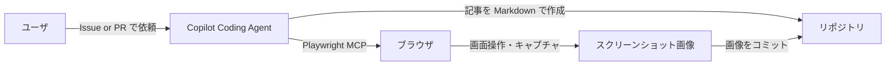
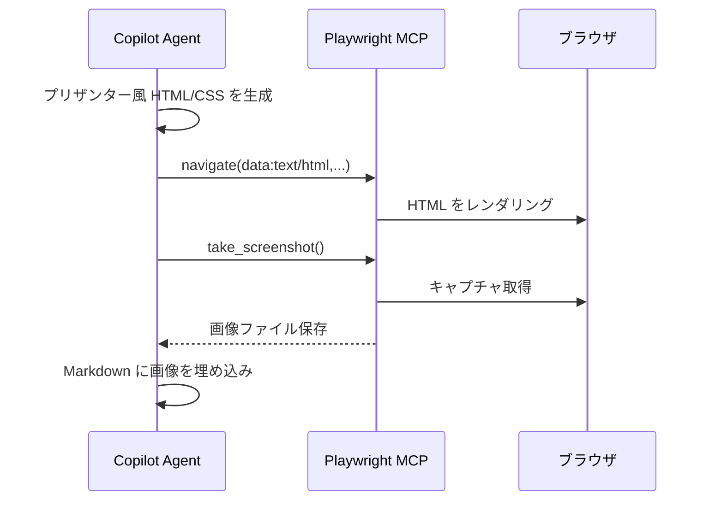
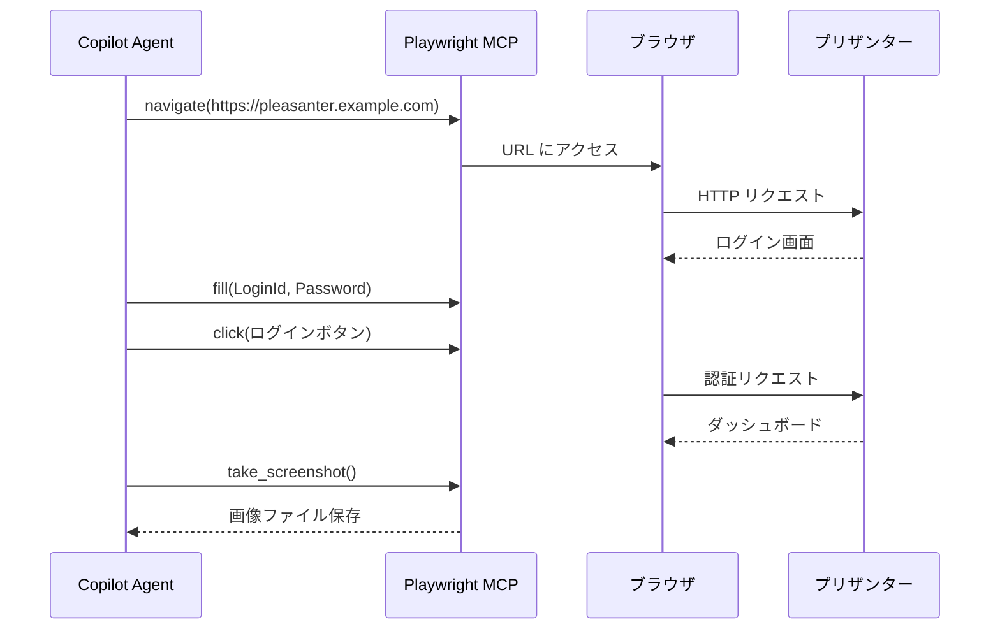
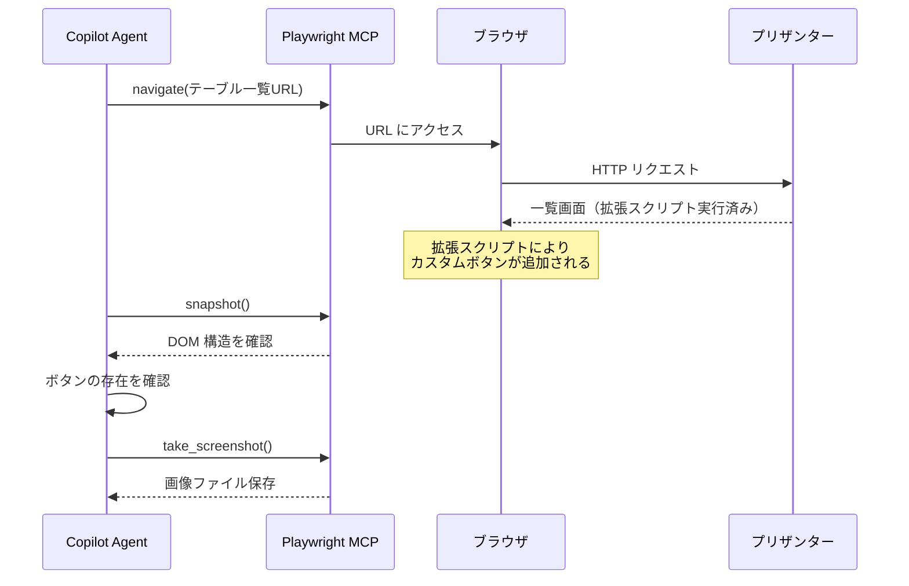

# Copilot によるテストプロジェクト・スクリーンショット作成ワークフロー

GitHub Copilot Coding Agent と Playwright MCP を組み合わせ、プリザンターのテストプロジェクト構築からスクリーンショット（実行イメージ）の作成までを自動化するワークフローの実現可能性を調査する。

<!-- START doctoc generated TOC please keep comment here to allow auto update -->
<!-- DON'T EDIT THIS SECTION, INSTEAD RE-RUN doctoc TO UPDATE -->

- [調査情報](#調査情報)
- [調査目的](#調査目的)
- [背景](#背景)
- [技術構成](#技術構成)
    - [全体アーキテクチャ](#全体アーキテクチャ)
    - [使用する主要コンポーネント](#使用する主要コンポーネント)
- [スクリーンショット取得の 2 つの方式](#スクリーンショット取得の-2-つの方式)
    - [方式 A: `data:` URL によるモック HTML レンダリング](#方式-a-data-url-によるモック-html-レンダリング)
    - [方式 B: 実行中のプリザンターインスタンスへの直接アクセス](#方式-b-実行中のプリザンターインスタンスへの直接アクセス)
- [具体的なユースケース: 拡張スクリプトの表示確認](#具体的なユースケース-拡張スクリプトの表示確認)
    - [なぜ方式 B が必要か](#なぜ方式-b-が必要か)
    - [方式 B での操作フロー例](#方式-b-での操作フロー例)
    - [現実性の評価](#現実性の評価)
- [方式比較](#方式比較)
- [Copilot への依頼方法](#copilot-への依頼方法)
    - [Issue テンプレート例](#issue-テンプレート例)
    - [Copilot Instructions での指示例](#copilot-instructions-での指示例)
- [実用上の注意点](#実用上の注意点)
- [結論](#結論)

<!-- END doctoc generated TOC please keep comment here to allow auto update -->

## 調査情報

| 調査日       | リポジトリ | ブランチ | タグ/バージョン | コミット | 備考                                                   |
| ------------ | ---------- | -------- | --------------- | -------- | ------------------------------------------------------ |
| 2026年3月6日 | -          | -        | -               | -        | Copilot Coding Agent + Playwright MCP の実機検証を含む |

## 調査目的

プリザンターのテストプロジェクトを Copilot に依頼して構築する際、プロジェクト設定だけでなくスクリーンショット（実行イメージ）まで一気通貫で生成できるかを明らかにする。

---

## 背景

テストプロジェクトやドキュメントを作成する際、以下のような作業が発生する。

| 作業                   | 手動の場合の負荷                                       |
| ---------------------- | ------------------------------------------------------ |
| プロジェクト設計       | テーマの構成・テストデータ設計に時間がかかる           |
| 画面操作               | プリザンターの操作手順を再現する必要がある             |
| スクリーンショット取得 | 各ステップで画面キャプチャを取り、トリミング・加工する |
| 画像の埋め込み         | Markdown に画像パスを埋め込み、表示確認する            |

これらを Copilot に一括で依頼できれば、大幅な工数削減が見込める。

---

## 技術構成

### 全体アーキテクチャ



### 使用する主要コンポーネント

| コンポーネント       | 役割                                                                            |
| -------------------- | ------------------------------------------------------------------------------- |
| Copilot Coding Agent | Issue/PR を起点にタスクを実行するエージェント                                   |
| Playwright MCP       | ブラウザ操作（ナビゲーション・クリック・入力・キャプチャ）を提供する MCP サーバ |
| `data:` URL          | HTML を直接レンダリングし、外部サーバなしでスクリーンショットを取得する手法     |

---

## スクリーンショット取得の 2 つの方式

Copilot Coding Agent でスクリーンショットを取得するには、大きく分けて 2 つの方式がある。

### 方式 A: `data:` URL によるモック HTML レンダリング

Playwright の `data:` URL スキームを使い、HTML/CSS を直接ブラウザに読み込ませてスクリーンショットを取得する方式。



#### 特徴

| 項目         | 内容                                                              |
| ------------ | ----------------------------------------------------------------- |
| 外部サーバ   | 不要（ブラウザ内で完結）                                          |
| ネットワーク | 不要（サンドボックス環境でも動作する）                            |
| 再現性       | HTML/CSS をコード管理できるため、いつでも同じ画像を再生成可能     |
| 精度         | プリザンター本物の画面とは差異が生じるため、イメージ図として扱う  |
| 用途         | UI のレイアウト説明、概念的な画面遷移の説明、操作手順のイメージ図 |

#### 実践例

以下のように、プリザンターの一覧画面風の HTML をインラインで記述し、スクリーンショットを取得する。

**手順 1**: `data:` URL でブラウザに HTML を読み込ませる

```text
playwright-browser_navigate:
  url: data:text/html;charset=utf-8,<!DOCTYPE html><html>
    <head><style>/* プリザンター風 CSS */</style></head>
    <body>
      <div class="header"><h1>プリザンター</h1></div>
      <table class="grid">
        <tr><th>タイトル</th><th>状況</th></tr>
        <tr><td>サンプル</td><td>実施中</td></tr>
      </table>
    </body>
  </html>
```

**手順 2**: スクリーンショットを取得する

```text
playwright-browser_take_screenshot:
  filename: grid-view.png
```

画像ファイルは Playwright のログディレクトリに保存されるため、必要に応じてリポジトリにコミットする。

### 方式 B: 実行中のプリザンターインスタンスへの直接アクセス

実際に稼働しているプリザンターインスタンスにブラウザでアクセスし、操作しながらスクリーンショットを取得する方式。



#### 特徴

| 項目         | 内容                                                                   |
| ------------ | ---------------------------------------------------------------------- |
| 外部サーバ   | 稼働中のプリザンターインスタンスが必要                                 |
| ネットワーク | Copilot Agent からプリザンターへのネットワーク到達性が必要             |
| 再現性       | データの状態に依存するため、同一画面の再現にはテストデータの整備が必要 |
| 精度         | 本物のプリザンター画面をそのままキャプチャするため完全一致             |
| 用途         | 実機操作手順の解説、実画面ベースのチュートリアル                       |

#### ネットワーク到達性の制約

Copilot Coding Agent は GitHub がホストするサンドボックス環境で実行される。このサンドボックスにはネットワーク制限があり、任意の外部 URL にはアクセスできない。

| 環境                          | 外部 URL アクセス | localhost アクセス | `data:` URL |
| ----------------------------- | :---------------: | :----------------: | :---------: |
| GitHub ホスト型サンドボックス |     制限あり      |  不可（分離環境）  |    可能     |
| セルフホストランナー          |     制限なし      |        可能        |    可能     |
| GitHub Codespaces             |     制限なし      |        可能        |    可能     |

方式 B を使用する場合、以下のいずれかの構成が必要になる。

1. **セルフホストランナー** + 同一ネットワーク内のプリザンターインスタンス
2. **GitHub Codespaces** + Docker Compose でプリザンターを起動

---

## 具体的なユースケース: 拡張スクリプトの表示確認

拡張スクリプト（拡張 HTML / 拡張スクリプト）でボタンや UI 要素を追加した際に、意図どおり表示されているかをスクリーンショットで確認するケースを考える。

### なぜ方式 B が必要か

拡張スクリプトはプリザンター上で JavaScript として実行される。そのため、以下の理由から**方式 B（実インスタンス）でなければ検証できない**。

| 観点                   | 方式 A（`data:` URL） | 方式 B（実インスタンス） |
| ---------------------- | --------------------- | ------------------------ |
| 拡張スクリプトの実行   | 不可                  | 可能                     |
| DOM 操作後の状態確認   | 不可                  | 可能                     |
| サーバスクリプトの反映 | 不可                  | 可能                     |
| テーマ・CSS の適用     | 近似のみ              | 完全一致                 |

### 方式 B での操作フロー例

拡張スクリプトで一覧画面にカスタムボタンを追加した場合の確認手順を示す。



### 現実性の評価

| 項目           | 評価                                                                                               |
| -------------- | -------------------------------------------------------------------------------------------------- |
| 技術的な実現性 | Playwright は JavaScript 実行後の DOM を操作できるため、拡張スクリプト適用後の画面キャプチャは可能 |
| 環境構築       | セルフホストランナーまたは Codespaces でプリザンターを起動する構成が必要                           |
| 認証           | ログイン操作を Playwright で自動化する必要がある（シークレットで認証情報を管理）                   |
| テストデータ   | 拡張スクリプトが動作する前提のサイト設定・テストデータをあらかじめ用意しておく必要がある           |
| 所要時間       | 環境構築を除けば、ログインからスクリーンショット取得まで数秒で完了する                             |
| 総合判定       | 環境が整っていれば現実的に運用可能。ただし初回の環境構築コストがかかる                             |

---

## 方式比較

| 比較項目                   | 方式 A（`data:` URL）           | 方式 B（実インスタンス）                 |
| -------------------------- | ------------------------------- | ---------------------------------------- |
| セットアップの容易さ       | 追加設定不要                    | インスタンス構築・ネットワーク設定が必要 |
| スクリーンショットの忠実度 | イメージ図レベル（CSS で近似）  | 完全一致                                 |
| 動的コンテンツの扱い       | 静的 HTML のみ                  | JavaScript 動作後の状態もキャプチャ可能  |
| CI/CD 統合                 | 特別な依存なし                  | テスト環境の維持が必要                   |
| 再現性                     | HTML がコード管理されるため高い | データ状態に依存するため管理が必要       |
| 推奨用途                   | コンセプト説明、レイアウト解説  | 操作手順、チュートリアル                 |

---

## Copilot への依頼方法

### Issue テンプレート例

テストプロジェクト作成を Copilot に依頼する際の Issue テンプレート例を以下に示す。

```markdown
## テストプロジェクト作成依頼

### プロジェクト名

プリザンターのサーバスクリプトで一覧画面をカスタマイズする方法

### 対象読者

プリザンターを業務で利用している開発者

### 記事の構成

1. サーバスクリプトの概要
2. 一覧画面の表示カスタム（条件付き書式）
3. ボタン追加によるワンクリック操作
4. まとめ

### スクリーンショット要件

- 各ステップの操作画面をスクリーンショットで示すこと
- 方式 A（`data:` URL）でイメージ図を生成すること
- 画像は `docs/projects/images/` に保存すること

### 出力先

`docs/projects/server-script-customization/`
```

### Copilot Instructions での指示例

リポジトリの `.github/copilot-instructions.md` に以下のような指示を追加することで、Copilot がテストプロジェクト作成時にスクリーンショットを自動生成するようになる。

```markdown
## テストプロジェクト作成時のルール

- スクリーンショットが必要な場合は Playwright MCP の `data:` URL 方式を使用すること
- HTML はプリザンターの実際の UI に近いスタイルで作成すること
- 画像ファイル名は `{連番}-{内容}.png` の形式にすること
- Markdown への画像埋め込みは相対パスを使用すること
```

---

## 実用上の注意点

| 注意点                     | 説明                                                                                         |
| -------------------------- | -------------------------------------------------------------------------------------------- |
| `data:` URL の長さ制限     | ブラウザによっては長大な `data:` URL を処理できない場合がある。複雑な画面は分割して生成する  |
| 日本語フォント             | サンドボックス環境のフォントはホスト OS に依存する。フォント未搭載の場合は代替フォントになる |
| スクリーンショットの保存先 | Playwright MCP は画像を `/tmp/playwright-logs/` に保存する。リポジトリへのコピーが必要       |
| 認証情報の取り扱い         | 方式 B でログインが必要な場合、認証情報をシークレットで管理し、コードにハードコードしない    |
| 画像のファイルサイズ       | PNG 画像はサイズが大きくなりやすい。必要に応じて JPEG 形式を指定する                         |
| ビューポートサイズ         | `playwright-browser_resize` でウィンドウサイズを指定し、一貫したスクリーンショットを取得する |

---

## 結論

| 項目              | 結論                                                                                                           |
| ----------------- | -------------------------------------------------------------------------------------------------------------- |
| 実現可能性        | Copilot Coding Agent + Playwright MCP の組み合わせでテストプロジェクトとスクリーンショットの自動生成は実現可能 |
| 方式の使い分け    | レイアウト説明には方式 A、拡張スクリプト等の動作確認には方式 B を使用する                                      |
| 方式 A の利点     | 外部依存なし・再現性が高い・サンドボックス環境で動作する                                                       |
| 方式 B の利点     | 拡張スクリプト・サーバスクリプト適用後の実画面をそのままキャプチャできる                                       |
| 方式 B の前提条件 | セルフホストランナーまたは Codespaces + プリザンターインスタンスのネットワーク到達性が必要                     |
| 運用上のポイント  | Issue テンプレートと Copilot Instructions でプロジェクト構成・画像仕様を明確に指示する                         |
