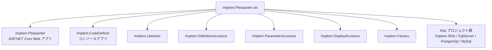
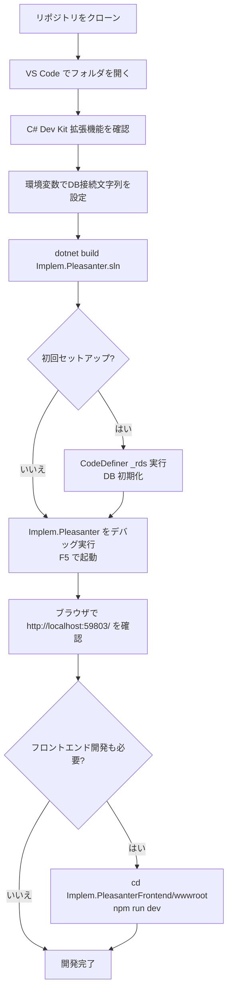

# VS Code のみでビルド・デバッグする手順

Visual Studio を使用せず、VS Code だけでプリザンターをビルド・デバッグするための環境構築手順と設定方法を調査した。

<!-- START doctoc generated TOC please keep comment here to allow auto update -->
<!-- DON'T EDIT THIS SECTION, INSTEAD RE-RUN doctoc TO UPDATE -->

- [調査情報](#調査情報)
- [調査目的](#調査目的)
- [前提条件](#前提条件)
    - [必要なツール](#必要なツール)
    - [必須 VS Code 拡張機能](#必須-vs-code-拡張機能)
    - [推奨 VS Code 拡張機能（フロントエンド開発時）](#推奨-vs-code-拡張機能フロントエンド開発時)
- [ソリューションの構成](#ソリューションの構成)
- [データベースの準備](#データベースの準備)
    - [SQL Server の場合](#sql-server-の場合)
    - [PostgreSQL の場合](#postgresql-の場合)
    - [MySQL の場合](#mysql-の場合)
    - [DBMS の選択](#dbms-の選択)
    - [環境変数の設定方法](#環境変数の設定方法)
- [VS Code でのセットアップ手順](#vs-code-でのセットアップ手順)
    - [1. リポジトリのクローン](#1-リポジトリのクローン)
    - [2. VS Code でソリューションを開く](#2-vs-code-でソリューションを開く)
    - [3. フロントエンド依存パッケージのインストール](#3-フロントエンド依存パッケージのインストール)
- [ビルド](#ビルド)
    - [dotnet CLI によるビルド](#dotnet-cli-によるビルド)
    - [VS Code コマンドパレットからのビルド](#vs-code-コマンドパレットからのビルド)
- [データベースの初期化（CodeDefiner）](#データベースの初期化codedefiner)
    - [実行コマンド](#実行コマンド)
    - [VS Code からデバッグ実行する場合](#vs-code-からデバッグ実行する場合)
    - [CodeDefiner の主なコマンド一覧](#codedefiner-の主なコマンド一覧)
    - [CodeDefiner のオプション引数](#codedefiner-のオプション引数)
    - [CodeDefiner 実行時のログ](#codedefiner-実行時のログ)
- [Implem.Pleasanter のデバッグ実行](#implempleasanter-のデバッグ実行)
    - [dotnet CLI による起動](#dotnet-cli-による起動)
    - [VS Code からデバッグ実行する場合](#vs-code-からデバッグ実行する場合-1)
- [フロントエンドの開発（Implem.PleasanterFrontend）](#フロントエンドの開発implempleasanterfrontend)
    - [ビルドシステム構成](#ビルドシステム構成)
    - [開発用ウォッチビルドの起動](#開発用ウォッチビルドの起動)
    - [本番ビルド](#本番ビルド)
- [VS Code の推奨設定（tasks.json / launch.json）](#vs-code-の推奨設定tasksjson--launchjson)
    - [launch.json のサンプル](#launchjson-のサンプル)
    - [tasks.json のサンプル](#tasksjson-のサンプル)
- [デバッグテクニック](#デバッグテクニック)
    - [ブレークポイントの活用](#ブレークポイントの活用)
    - [デバッグコンソールでの式評価](#デバッグコンソールでの式評価)
    - [ウォッチ式の活用](#ウォッチ式の活用)
    - [ホットリロード](#ホットリロード)
    - [アタッチデバッグ](#アタッチデバッグ)
- [トラブルシューティング](#トラブルシューティング)
    - [C# Dev Kit がソリューションを認識しない](#c-dev-kit-がソリューションを認識しない)
    - [ビルドエラー: SDK が見つからない](#ビルドエラー-sdk-が見つからない)
    - [CodeDefiner 実行時のデータベース接続エラー](#codedefiner-実行時のデータベース接続エラー)
    - [フロントエンドビルドエラー: `npm install` でエラー](#フロントエンドビルドエラー-npm-install-でエラー)
    - [デバッグ実行時にブラウザが起動しない](#デバッグ実行時にブラウザが起動しない)
    - [ブレークポイントが無効（グレーアウト）になる](#ブレークポイントが無効グレーアウトになる)
    - [ホットリロードが機能しない](#ホットリロードが機能しない)
- [パフォーマンス最適化のヒント](#パフォーマンス最適化のヒント)
    - [ビルド時間の短縮](#ビルド時間の短縮)
    - [フロントエンドビルドの最適化](#フロントエンドビルドの最適化)
    - [デバッグ実行の高速化](#デバッグ実行の高速化)
- [その他の便利な設定](#その他の便利な設定)
    - [VS Code のワークスペース設定](#vs-code-のワークスペース設定)
    - [Git の設定（ビルド成果物の除外）](#git-の設定ビルド成果物の除外)
    - [EditorConfig の活用](#editorconfig-の活用)
- [全体の手順フロー](#全体の手順フロー)
- [結論](#結論)
- [関連ソースコード](#関連ソースコード)
- [関連リンク](#関連リンク)

<!-- END doctoc generated TOC please keep comment here to allow auto update -->

## 調査情報

| 調査日       | リポジトリ | ブランチ | タグ/バージョン    | コミット   | 備考                                     |
| ------------ | ---------- | -------- | ------------------ | ---------- | ---------------------------------------- |
| 2026年3月6日 | Pleasanter | main     | Pleasanter_1.5.1.0 | `34f162a4` | .NET SDK 10.0.100 / Visual Studio 不使用 |

## 調査目的

Visual Studio なしで VS Code だけを用いてプリザンターをビルド・デバッグできるかを調査し、  
具体的な手順と必要な設定を文書化する。

---

## 前提条件

### 必要なツール

| ツール       | バージョン       | 用途                                                                                                      |
| ------------ | ---------------- | --------------------------------------------------------------------------------------------------------- |
| VS Code      | 最新版           | メインエディタ                                                                                            |
| .NET SDK     | 10.0.100 以上    | .NET プロジェクトのビルド・実行                                                                           |
| Node.js      | volta で管理推奨 | フロントエンドビルド（`Implem.PleasanterFrontend/wwwroot` の `package.json` の `volta` セクションで確認） |
| Git          | 任意             | ソースコード管理                                                                                          |
| データベース | いずれか 1 つ    | SQL Server / PostgreSQL / MySQL                                                                           |

### 必須 VS Code 拡張機能

| 拡張機能 ID               | 名称       | 用途                                                |
| ------------------------- | ---------- | --------------------------------------------------- |
| `ms-dotnettools.csdevkit` | C# Dev Kit | ソリューション管理・ビルド・デバッグ（必須）        |
| `ms-dotnettools.csharp`   | C#         | C# Dev Kit に自動同梱されるため個別インストール不要 |

### 推奨 VS Code 拡張機能（フロントエンド開発時）

| 拡張機能 ID              | 名称     | 用途                    |
| ------------------------ | -------- | ----------------------- |
| `esbenp.prettier-vscode` | Prettier | コードフォーマット      |
| `dbaeumer.vscode-eslint` | ESLint   | JavaScript / TypeScript |

---

## ソリューションの構成

プリザンターのソリューション（`Implem.Pleasanter.sln`）は複数プロジェクトで構成される。



| プロジェクト            | 種別                    | 役割                         |
| ----------------------- | ----------------------- | ---------------------------- |
| `Implem.Pleasanter`     | ASP.NET Core Web アプリ | プリザンター本体             |
| `Implem.CodeDefiner`    | コンソールアプリ        | DB 初期化・コード自動生成    |
| `Implem.Libraries` ほか | クラスライブラリ        | 共通ライブラリ・RDS 抽象化等 |

---

## データベースの準備

データベースとの接続文字列は**環境変数**で設定する。  
CodeDefiner によるデータベース初期化前に、以下のいずれかを設定しておく必要がある。

### SQL Server の場合

| 環境変数名                                              | 設定値の例                                                                                              |
| ------------------------------------------------------- | ------------------------------------------------------------------------------------------------------- |
| `Implem.Pleasanter_Rds_SQLServer_SaConnectionString`    | `Server=(local);Database=master;UID=sa;PWD={パスワード};Connection Timeout=30;`                         |
| `Implem.Pleasanter_Rds_SQLServer_OwnerConnectionString` | `Server=(local);Database=#ServiceName#;UID=#ServiceName#_Owner;PWD={パスワード};Connection Timeout=30;` |
| `Implem.Pleasanter_Rds_SQLServer_UserConnectionString`  | `Server=(local);Database=#ServiceName#;UID=#ServiceName#_User;PWD={パスワード};Connection Timeout=30;`  |

### PostgreSQL の場合

| 環境変数名                                               | 設定値の例                                                                         |
| -------------------------------------------------------- | ---------------------------------------------------------------------------------- |
| `Implem.Pleasanter_Rds_PostgreSQL_SaConnectionString`    | `Server=localhost;Database=postgres;UID=postgres;PWD={パスワード}`                 |
| `Implem.Pleasanter_Rds_PostgreSQL_OwnerConnectionString` | `Server=localhost;Database=#ServiceName#;UID=#ServiceName#_Owner;PWD={パスワード}` |
| `Implem.Pleasanter_Rds_PostgreSQL_UserConnectionString`  | `Server=localhost;Database=#ServiceName#;UID=#ServiceName#_User;PWD={パスワード}`  |

### MySQL の場合

| 環境変数名                                          | 設定値の例                                                                         |
| --------------------------------------------------- | ---------------------------------------------------------------------------------- |
| `Implem.Pleasanter_Rds_MySQL_SaConnectionString`    | `Server=localhost;Database=mysql;UID=root;PWD={パスワード}`                        |
| `Implem.Pleasanter_Rds_MySQL_OwnerConnectionString` | `Server=localhost;Database=#ServiceName#;UID=#ServiceName#_Owner;PWD={パスワード}` |
| `Implem.Pleasanter_Rds_MySQL_UserConnectionString`  | `Server=localhost;Database=#ServiceName#;UID=#ServiceName#_User;PWD={パスワード}`  |
| `Implem.Pleasanter_Rds_MySqlConnectingHost`         | `%`（任意のホストからの接続を許可）または `localhost`（ローカルのみ）              |

### DBMS の選択

デフォルトの DBMS は `Implem.Pleasanter/App_Data/Parameters/Rds.json` の `Dbms` プロパティで指定されている（`SQLServer`、`PostgreSQL`、`MySQL` のいずれか）。
環境変数で DBMS を切り替える場合は `Implem.Pleasanter_Rds_Dbms` を設定する。

| 環境変数名                   | 設定値                               | 説明                 |
| ---------------------------- | ------------------------------------ | -------------------- |
| `Implem.Pleasanter_Rds_Dbms` | `SQLServer` / `PostgreSQL` / `MySQL` | 使用する DBMS を指定 |

### 環境変数の設定方法

#### Windows（PowerShell）

```powershell
$env:Implem.Pleasanter_Rds_Dbms = "PostgreSQL"
$env:Implem.Pleasanter_Rds_PostgreSQL_SaConnectionString = "Server=localhost;Database=postgres;UID=postgres;PWD=yourpassword"
```

#### Linux / macOS（bash / zsh）

```bash
export Implem.Pleasanter_Rds_Dbms="PostgreSQL"
export Implem.Pleasanter_Rds_PostgreSQL_SaConnectionString="Server=localhost;Database=postgres;UID=postgres;PWD=yourpassword"
```

または `~/.bashrc` や `~/.zshrc` に記述して永続化する。

#### VS Code の設定ファイルによる管理

`.vscode/settings.json` に環境変数を定義することで、プロジェクト固有の設定として管理できる。

```json
{
    "terminal.integrated.env.windows": {
        "Implem.Pleasanter_Rds_Dbms": "PostgreSQL",
        "Implem.Pleasanter_Rds_PostgreSQL_SaConnectionString": "Server=localhost;Database=postgres;UID=postgres;PWD=yourpassword"
    },
    "terminal.integrated.env.linux": {
        "Implem.Pleasanter_Rds_Dbms": "PostgreSQL",
        "Implem.Pleasanter_Rds_PostgreSQL_SaConnectionString": "Server=localhost;Database=postgres;UID=postgres;PWD=yourpassword"
    }
}
```

---

## VS Code でのセットアップ手順

### 1. リポジトリのクローン

```bash
git clone https://github.com/Implem/Implem.Pleasanter
cd Implem.Pleasanter
```

### 2. VS Code でソリューションを開く

```bash
code Implem.Pleasanter.sln
```

または VS Code を起動後、`ファイル > フォルダを開く` でリポジトリルートを開く。  
C# Dev Kit がソリューションファイルを自動検出し、ソリューションエクスプローラに表示される。

### 3. フロントエンド依存パッケージのインストール

```bash
cd Implem.PleasanterFrontend/wwwroot
npm install
```

---

## ビルド

### dotnet CLI によるビルド

ターミナルからソリューション全体をビルドする。

```bash
dotnet build Implem.Pleasanter.sln
```

特定プロジェクトのみビルドする場合は、プロジェクトファイルを指定する。

```bash
dotnet build Implem.Pleasanter/Implem.Pleasanter.csproj
dotnet build Implem.CodeDefiner/Implem.CodeDefiner.csproj
```

### VS Code コマンドパレットからのビルド

1. `Ctrl+Shift+P` でコマンドパレットを開く
2. `.NET: Build` を実行する（C# Dev Kit が必要）

または `Ctrl+Shift+B` でデフォルトビルドタスクを実行する。

---

## データベースの初期化（CodeDefiner）

### 実行コマンド

データベースの初期化は `Implem.CodeDefiner` の `_rds` コマンドで行う。

```bash
dotnet run --project Implem.CodeDefiner/Implem.CodeDefiner.csproj -- _rds
```

### VS Code からデバッグ実行する場合

C# Dev Kit は `Implem.CodeDefiner/Properties/launchSettings.json` のプロファイルを自動的に認識する。

**ファイル**: `Implem.CodeDefiner/Properties/launchSettings.json`

```json
{
    "profiles": {
        "Implem.CodeDefiner": {
            "commandName": "Project",
            "commandLineArgs": "def"
        },
        "Implem.CodeDefiner_rds": {
            "commandName": "Project",
            "commandLineArgs": "_rds"
        }
    }
}
```

デバッグ実行の手順：

1. VS Code のサイドバーで「実行とデバッグ」（`Ctrl+Shift+D`）を開く
2. プロファイル `Implem.CodeDefiner_rds` を選択する
3. `F5` でデバッグ実行する

### CodeDefiner の主なコマンド一覧

| コマンド引数              | 動作                             | 用途                                         |
| ------------------------- | -------------------------------- | -------------------------------------------- |
| `_rds`                    | DB 初期化（コード生成なし）      | 初回セットアップ時                           |
| `rds`                     | DB 初期化 + コード生成           | 初回セットアップ + コード自動生成            |
| `def`                     | コード生成のみ（DB 操作なし）    | 定義変更後のコード再生成                     |
| `_def`                    | 定義アクセサのコード生成のみ     | パラメータ定義変更後                         |
| `mvc`                     | MVC コード生成のみ               | MVC コード（Model/View/Controller）の再生成  |
| `backup`                  | ソリューションのバックアップ作成 | メンテナンス前のバックアップ                 |
| `migrate`                 | データベースマイグレーション実行 | バージョンアップ時                           |
| `ConvertTime /h {offset}` | タイムゾーン変換ツール           | データベース内の時刻データのタイムゾーン変換 |

### CodeDefiner のオプション引数

CodeDefiner には以下のオプション引数を指定できる。

| オプション | 説明                                                               | 使用例                                     |
| ---------- | ------------------------------------------------------------------ | ------------------------------------------ |
| `/p`       | プロジェクトルートパスを指定する                                   | `dotnet run -- _rds /p C:\path\to\project` |
| `/t`       | コード生成対象を指定する（テーブル名）                             | `dotnet run -- mvc /t Users`               |
| `/l`       | 使用言語を指定する（`ja-JP`、`en-US` など）                        | `dotnet run -- _rds /l en-US`              |
| `/z`       | タイムゾーンを指定する（`+09:00`、`UTC` など）                     | `dotnet run -- _rds /z +09:00`             |
| `/s`       | 管理者（sa）パスワードを対話的に設定する                           | `dotnet run -- _rds /s`                    |
| `/r`       | ランダムパスワードを生成して設定する                               | `dotnet run -- _rds /r`                    |
| `/f`       | データベースの強制再作成（既存データ削除）                         | `dotnet run -- _rds /f`                    |
| `/y`       | 対話的な確認をスキップする（自動化時に使用）                       | `dotnet run -- _rds /y`                    |
| `/c`       | マイグレーション可能性チェックのみ実行する（データベース変更なし） | `dotnet run -- _rds /c`                    |

### CodeDefiner 実行時のログ

CodeDefiner の実行ログは `logs/` ディレクトリに保存される。

| ファイル名形式                           | 説明                                      |
| ---------------------------------------- | ----------------------------------------- |
| `Implem.CodeDefiner_yyyyMMdd_HHmmss.log` | 各実行のログファイル                      |
| `Implem.CodeDefiner_yyyyMMdd_HHmmss.sql` | 実行された SQL スクリプト（該当する場合） |

エラーが発生した場合は、このログファイルを確認することで詳細なエラー情報を得られる。

---

## Implem.Pleasanter のデバッグ実行

### dotnet CLI による起動

```bash
dotnet run --project Implem.Pleasanter/Implem.Pleasanter.csproj
```

### VS Code からデバッグ実行する場合

`Implem.Pleasanter/Properties/launchSettings.json` には以下のプロファイルが定義されている。

**ファイル**: `Implem.Pleasanter/Properties/launchSettings.json`

```json
{
    "profiles": {
        "Implem.Pleasanter.NetCore": {
            "commandName": "Project",
            "launchBrowser": true,
            "environmentVariables": {
                "ASPNETCORE_ENVIRONMENT": "Development"
            },
            "applicationUrl": "http://localhost:59803/"
        }
    }
}
```

デバッグ実行の手順：

1. VS Code のサイドバーで「実行とデバッグ」（`Ctrl+Shift+D`）を開く
2. プロファイル `Implem.Pleasanter.NetCore` を選択する
3. `F5` でデバッグ実行する
4. ブラウザが起動し、`http://localhost:59803/` でプリザンターにアクセスできる

ブレークポイントを設定することで C# コードのステップ実行が可能になる。

---

## フロントエンドの開発（Implem.PleasanterFrontend）

フロントエンドのビルドは Vite + TypeScript + npm で管理されており、VS Code のターミナルから直接実行できる。

### ビルドシステム構成

| 項目           | 値                                                         |
| -------------- | ---------------------------------------------------------- |
| ビルドツール   | Vite 7.x                                                   |
| 言語           | TypeScript 5.x                                             |
| パッケージ管理 | npm                                                        |
| 設定ファイル   | `vite.config.ts`（本番）/ `vite.config.dev.*.ts`（開発用） |

### 開発用ウォッチビルドの起動

```bash
cd Implem.PleasanterFrontend/wwwroot
npm run dev
```

`npm run dev` は `watch:scripts` と `watch:styles` を並列実行する。  
TypeScript / SCSS ファイルを変更すると自動的に再ビルドされる。

### 本番ビルド

```bash
cd Implem.PleasanterFrontend/wwwroot
npm run build
```

---

## VS Code の推奨設定（tasks.json / launch.json）

C# Dev Kit を使用している場合、`launchSettings.json` のプロファイルが自動的に「実行とデバッグ」のドロップダウンに表示される。  
手動で `launch.json` を作成する場合は、以下の構成を参考にする。

### launch.json のサンプル

```json
{
    "version": "0.2.0",
    "configurations": [
        {
            "name": "Implem.Pleasanter",
            "type": "dotnet",
            "request": "launch",
            "projectPath": "${workspaceFolder}/Implem.Pleasanter/Implem.Pleasanter.csproj",
            "launchSettingsProfile": "Implem.Pleasanter.NetCore"
        },
        {
            "name": "Implem.CodeDefiner (_rds)",
            "type": "dotnet",
            "request": "launch",
            "projectPath": "${workspaceFolder}/Implem.CodeDefiner/Implem.CodeDefiner.csproj",
            "launchSettingsProfile": "Implem.CodeDefiner_rds"
        },
        {
            "name": "Implem.CodeDefiner (def)",
            "type": "dotnet",
            "request": "launch",
            "projectPath": "${workspaceFolder}/Implem.CodeDefiner/Implem.CodeDefiner.csproj",
            "launchSettingsProfile": "Implem.CodeDefiner"
        }
    ]
}
```

### tasks.json のサンプル

```json
{
    "version": "2.0.0",
    "tasks": [
        {
            "label": "build: Implem.Pleasanter.sln",
            "command": "dotnet",
            "type": "process",
            "args": ["build", "${workspaceFolder}/Implem.Pleasanter.sln"],
            "problemMatcher": "$msCompile",
            "group": {
                "kind": "build",
                "isDefault": true
            }
        },
        {
            "label": "frontend: dev",
            "type": "npm",
            "script": "dev",
            "path": "Implem.PleasanterFrontend/wwwroot/",
            "group": "build"
        }
    ]
}
```

---

## デバッグテクニック

### ブレークポイントの活用

VS Code の C# Dev Kit では、ソースコード上で行番号の左をクリックすることでブレークポイントを設定できる。

| ブレークポイントの種類   | 設定方法                                                         | 用途                                      |
| ------------------------ | ---------------------------------------------------------------- | ----------------------------------------- |
| 通常のブレークポイント   | 行番号の左をクリック                                             | 特定の行で実行を停止                      |
| 条件付きブレークポイント | ブレークポイントを右クリック > `編集` > 条件式を入力             | 特定の条件でのみ停止（例: `userId == 1`） |
| ログポイント             | ブレークポイントを右クリック > `編集` > ログメッセージを入力     | 停止せずにログ出力                        |
| ヒットカウント           | ブレークポイントを右クリック > `編集` > ヒットカウント条件を入力 | ループ内で特定回数のみ停止                |

### デバッグコンソールでの式評価

デバッグ実行中は、デバッグコンソール（`Ctrl+Shift+Y`）で C# の式を評価できる。

**例**:

```csharp
// 変数の値を確認
context.UserId
context.TenantId

// メソッドを実行
siteModel.SiteSettings.GetColumn(context: context, columnName: "Title")

// LINQ クエリを実行
items.Where(x => x.Status == 100).Count()
```

### ウォッチ式の活用

デバッグサイドバーの「ウォッチ」セクションで、監視したい式を追加できる。
ステップ実行中に自動的に式が評価され、値の変化を追跡できる。

### ホットリロード

.NET 6 以降、C# コードの変更をデバッグ実行中に即座に反映できる「ホットリロード」機能が利用可能。

1. デバッグ実行中にコードを変更する
2. `Ctrl+S` で保存する
3. 変更が自動的に反映される（メソッドシグネチャの変更など、一部の変更は再起動が必要）

### アタッチデバッグ

すでに起動中のプリザンタープロセスにデバッガをアタッチすることも可能。

1. `dotnet run --project Implem.Pleasanter/Implem.Pleasanter.csproj` でプロセスを起動
2. VS Code で `Ctrl+Shift+P` > `.NET: Attach to Process` を実行
3. `Implem.Pleasanter` プロセスを選択

---

## トラブルシューティング

### C# Dev Kit がソリューションを認識しない

**症状**: ソリューションエクスプローラにプロジェクトが表示されない。

**解決方法**:

1. `Ctrl+Shift+P` > `.NET: Restart Language Server` を実行
2. VS Code を再起動する
3. `Implem.Pleasanter.sln` ファイルを明示的に開く（`File > Open File`）

### ビルドエラー: SDK が見つからない

**症状**: `error NETSDK1045: The current .NET SDK does not support targeting .NET 10.0.`

**解決方法**:

```bash
# .NET SDK のバージョンを確認
dotnet --version

# 10.0.100 以上がインストールされていない場合は、公式サイトからインストール
# https://dotnet.microsoft.com/download
```

### CodeDefiner 実行時のデータベース接続エラー

**症状**: `Unable to connect to any of the specified MySQL hosts.` または
`A network-related or instance-specific error occurred while establishing a connection to SQL Server.`

**解決方法**:

1. 環境変数が正しく設定されているか確認する

    ```bash
    # 環境変数の確認（Windows PowerShell）
    $env:Implem.Pleasanter_Rds_PostgreSQL_SaConnectionString

    # Linux / macOS
    echo $Implem.Pleasanter_Rds_PostgreSQL_SaConnectionString
    ```

2. データベースサーバが起動しているか確認する

    ```bash
    # PostgreSQL の場合
    sudo systemctl status postgresql

    # SQL Server の場合（Docker）
    docker ps | grep mssql

    # MySQL の場合
    sudo systemctl status mysql
    ```

3. 接続文字列のホスト名・ポート番号・パスワードが正しいか確認する

### フロントエンドビルドエラー: `npm install` でエラー

**症状**: `npm ERR! code ERESOLVE` または依存関係の競合エラー

**解決方法**:

```bash
cd Implem.PleasanterFrontend/wwwroot

# node_modules と package-lock.json を削除
rm -rf node_modules package-lock.json

# クリーンインストール
npm install

# Volta が設定されている場合は、Volta を使用
volta install node
npm install
```

### デバッグ実行時にブラウザが起動しない

**症状**: `F5` でデバッグを開始しても、ブラウザが起動しない。

**解決方法**:

1. `launchSettings.json` の `launchBrowser` プロパティを確認する
2. 手動でブラウザを開き、`http://localhost:59803/` にアクセスする
3. デフォルトブラウザが設定されているか確認する

### ブレークポイントが無効（グレーアウト）になる

**症状**: ブレークポイントが赤い丸ではなく、グレーの円で表示される。

**原因**:

- コードが最適化されている（リリースビルド）
- デバッグシンボル（.pdb ファイル）が見つからない
- ソースコードとビルド済みバイナリが一致していない

**解決方法**:

```bash
# デバッグモードで再ビルド
dotnet build -c Debug Implem.Pleasanter.sln

# bin/obj ディレクトリをクリーンして再ビルド
dotnet clean
dotnet build
```

### ホットリロードが機能しない

**症状**: コードを変更して保存しても、デバッグ実行中のアプリに反映されない。

**解決方法**:

1. `.NET Hot Reload` が有効になっているか確認する（VS Code のステータスバー）
2. 変更内容がホットリロード対象外の可能性がある（メソッドシグネチャ変更、新しいクラス追加など）
3. アプリケーションを再起動する（`Ctrl+Shift+F5`）

---

## パフォーマンス最適化のヒント

### ビルド時間の短縮

| 手法                   | 方法                                                                    | 効果                            |
| ---------------------- | ----------------------------------------------------------------------- | ------------------------------- |
| 並列ビルド             | `dotnet build -m` または `dotnet build -maxCpuCount`                    | マルチコア CPU でビルド時間短縮 |
| 部分ビルド             | `dotnet build --no-restore`（パッケージ復元をスキップ）                 | 2回目以降のビルドが高速化       |
| ウォッチモード         | `dotnet watch --project Implem.Pleasanter/Implem.Pleasanter.csproj run` | ファイル変更時に自動再起動      |
| NuGet キャッシュクリア | `dotnet nuget locals all --clear`（不具合時のみ）                       | キャッシュ起因の問題を解消      |

### フロントエンドビルドの最適化

```bash
# Vite のキャッシュディレクトリ
cd Implem.PleasanterFrontend/wwwroot

# キャッシュのクリア（ビルドエラー時）
rm -rf node_modules/.vite

# 開発ビルドのウォッチモード（HMR 有効）
npm run dev
```

### デバッグ実行の高速化

**launch.json でのオプション設定**:

```json
{
    "version": "0.2.0",
    "configurations": [
        {
            "name": "Implem.Pleasanter (Fast Debug)",
            "type": "dotnet",
            "request": "launch",
            "projectPath": "${workspaceFolder}/Implem.Pleasanter/Implem.Pleasanter.csproj",
            "launchSettingsProfile": "Implem.Pleasanter.NetCore",
            "justMyCode": true,
            "suppressJITOptimizations": false
        }
    ]
}
```

| オプション                        | 説明                                                       | デバッグ速度への影響 |
| --------------------------------- | ---------------------------------------------------------- | -------------------- |
| `justMyCode: true`                | 自分のコードのみデバッグ（フレームワークコードはスキップ） | 高速化               |
| `suppressJITOptimizations: false` | JIT 最適化を有効化（デバッグ情報は一部失われる）           | 高速化               |

---

## その他の便利な設定

### VS Code のワークスペース設定

`.vscode/settings.json` にプロジェクト固有の設定を追加する。

```json
{
    "files.exclude": {
        "**/bin": true,
        "**/obj": true,
        "**/logs": true
    },
    "search.exclude": {
        "**/node_modules": true,
        "**/bin": true,
        "**/obj": true
    },
    "editor.formatOnSave": true,
    "omnisharp.enableRoslynAnalyzers": true,
    "omnisharp.enableEditorConfigSupport": true
}
```

### Git の設定（ビルド成果物の除外）

`.gitignore` ファイルでビルド成果物を除外する（通常はすでに設定済み）。

```gitignore
bin/
obj/
logs/
node_modules/
*.user
*.suo
.vs/
.vscode/
```

### EditorConfig の活用

プリザンターには `.editorconfig` ファイルが含まれており、コーディングスタイルが統一されている。
VS Code で自動的に認識されるため、追加設定は不要。

---

## 全体の手順フロー



---

## 結論

| 項目                       | 結論                                                                                                                                                       |
| -------------------------- | ---------------------------------------------------------------------------------------------------------------------------------------------------------- |
| VS Code のみでビルド可能か | 可能。C# Dev Kit 拡張機能 + dotnet CLI で Visual Studio なしでビルド・デバッグが可能。複数の DBMS（SQL Server / PostgreSQL / MySQL）にも対応               |
| デバッグ起動の方法         | `launchSettings.json` のプロファイルが C# Dev Kit により自動認識される。ブレークポイント・条件付きブレークポイント・ホットリロードなど高度な機能も利用可能 |
| CodeDefiner の実行         | `dotnet run -- _rds` またはデバッグプロファイル `Implem.CodeDefiner_rds` で実行可能。オプション引数（`/f`、`/y`、`/s` など）で柔軟な制御が可能             |
| フロントエンド開発         | `npm run dev` でウォッチビルドが可能。Vite + TypeScript + SCSS の構成。VS Code のターミナルから直接実行できる                                              |
| 必要最低限の拡張機能       | `ms-dotnettools.csdevkit`（C# Dev Kit）のみで C# 開発の全工程が完結。フロントエンド開発時は Prettier / ESLint を推奨                                       |
| 環境変数による設定         | データベース接続文字列・DBMS 種別は環境変数で設定可能。`.vscode/settings.json` でプロジェクト固有の環境変数を管理できる                                    |
| トラブルシューティング     | 一般的な問題（SDK エラー・DB 接続エラー・ブレークポイント無効）の解決方法を記載。ログファイルによる詳細な診断が可能                                        |
| パフォーマンス最適化       | 並列ビルド・ホットリロード・ウォッチモードなどの活用により、開発効率を向上できる                                                                           |

---

## 関連ソースコード

| ファイル                                            | 役割                                |
| --------------------------------------------------- | ----------------------------------- |
| `Implem.Pleasanter.sln`                             | ソリューションファイル              |
| `global.json`                                       | .NET SDK バージョン固定（10.0.100） |
| `Implem.Pleasanter/Properties/launchSettings.json`  | Pleasanter の起動プロファイル定義   |
| `Implem.CodeDefiner/Properties/launchSettings.json` | CodeDefiner の起動プロファイル定義  |
| `Implem.PleasanterFrontend/wwwroot/package.json`    | フロントエンドビルドスクリプト定義  |
| `Implem.CodeDefiner/Starter.cs`                     | CodeDefiner コマンドライン引数処理  |

---

## 関連リンク

- [CONTRIBUTING_JA.md](https://github.com/Implem/Implem.Pleasanter/blob/main/CONTRIBUTING_JA.md) -
  公式コントリビューションガイド（Visual Studio 版も記載）
- [CodeDefiner データベース作成・更新ロジック](../11-CodeDefiner/001-CodeDefiner-DB作成更新.md) - CodeDefiner の処理フロー詳細
