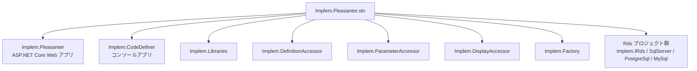
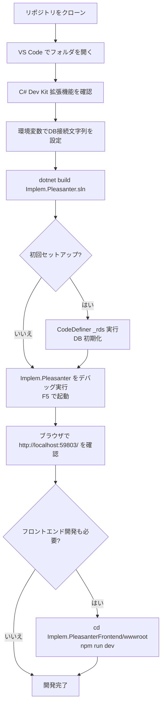

# VS Code のみでビルド・デバッグする手順

Visual Studio を使用せず、VS Code だけでプリザンターをビルド・デバッグするための環境構築手順と設定方法を調査した。

<!-- START doctoc generated TOC please keep comment here to allow auto update -->
<!-- DON'T EDIT THIS SECTION, INSTEAD RE-RUN doctoc TO UPDATE -->

- [調査情報](#調査情報)
- [調査目的](#調査目的)
- [前提条件](#前提条件)
    - [必要なツール](#必要なツール)
    - [必須 VS Code 拡張機能](#必須-vs-code-拡張機能)
    - [推奨 VS Code 拡張機能（フロントエンド開発時）](#推奨-vs-code-拡張機能フロントエンド開発時)
- [ソリューションの構成](#ソリューションの構成)
- [データベースの準備](#データベースの準備)
    - [SQL Server の場合](#sql-server-の場合)
    - [PostgreSQL の場合](#postgresql-の場合)
- [VS Code でのセットアップ手順](#vs-code-でのセットアップ手順)
    - [1. リポジトリのクローン](#1-リポジトリのクローン)
    - [2. VS Code でソリューションを開く](#2-vs-code-でソリューションを開く)
    - [3. フロントエンド依存パッケージのインストール](#3-フロントエンド依存パッケージのインストール)
- [ビルド](#ビルド)
    - [dotnet CLI によるビルド](#dotnet-cli-によるビルド)
    - [VS Code コマンドパレットからのビルド](#vs-code-コマンドパレットからのビルド)
- [データベースの初期化（CodeDefiner）](#データベースの初期化codedefiner)
    - [実行コマンド](#実行コマンド)
    - [VS Code からデバッグ実行する場合](#vs-code-からデバッグ実行する場合)
    - [CodeDefiner の主なコマンド一覧](#codedefiner-の主なコマンド一覧)
- [Implem.Pleasanter のデバッグ実行](#implempleasanter-のデバッグ実行)
    - [dotnet CLI による起動](#dotnet-cli-による起動)
    - [VS Code からデバッグ実行する場合](#vs-code-からデバッグ実行する場合-1)
- [フロントエンドの開発（Implem.PleasanterFrontend）](#フロントエンドの開発implempleasanterfrontend)
    - [ビルドシステム構成](#ビルドシステム構成)
    - [開発用ウォッチビルドの起動](#開発用ウォッチビルドの起動)
    - [本番ビルド](#本番ビルド)
- [VS Code の推奨設定（tasks.json / launch.json）](#vs-code-の推奨設定tasksjson--launchjson)
    - [launch.json のサンプル](#launchjson-のサンプル)
    - [tasks.json のサンプル](#tasksjson-のサンプル)
- [全体の手順フロー](#全体の手順フロー)
- [結論](#結論)
- [関連ソースコード](#関連ソースコード)
- [関連リンク](#関連リンク)

<!-- END doctoc generated TOC please keep comment here to allow auto update -->

## 調査情報

| 調査日       | リポジトリ | ブランチ | タグ/バージョン    | コミット   | 備考                                     |
| ------------ | ---------- | -------- | ------------------ | ---------- | ---------------------------------------- |
| 2026年3月6日 | Pleasanter | main     | Pleasanter_1.5.1.0 | `34f162a4` | .NET SDK 10.0.100 / Visual Studio 不使用 |

## 調査目的

Visual Studio なしで VS Code だけを用いてプリザンターをビルド・デバッグできるかを調査し、  
具体的な手順と必要な設定を文書化する。

---

## 前提条件

### 必要なツール

| ツール       | バージョン       | 用途                                                                                                      |
| ------------ | ---------------- | --------------------------------------------------------------------------------------------------------- |
| VS Code      | 最新版           | メインエディタ                                                                                            |
| .NET SDK     | 10.0.100 以上    | .NET プロジェクトのビルド・実行                                                                           |
| Node.js      | volta で管理推奨 | フロントエンドビルド（`Implem.PleasanterFrontend/wwwroot` の `package.json` の `volta` セクションで確認） |
| Git          | 任意             | ソースコード管理                                                                                          |
| データベース | いずれか 1 つ    | SQL Server / PostgreSQL / MySQL                                                                           |

### 必須 VS Code 拡張機能

| 拡張機能 ID               | 名称       | 用途                                                |
| ------------------------- | ---------- | --------------------------------------------------- |
| `ms-dotnettools.csdevkit` | C# Dev Kit | ソリューション管理・ビルド・デバッグ（必須）        |
| `ms-dotnettools.csharp`   | C#         | C# Dev Kit に自動同梱されるため個別インストール不要 |

### 推奨 VS Code 拡張機能（フロントエンド開発時）

| 拡張機能 ID              | 名称     | 用途                    |
| ------------------------ | -------- | ----------------------- |
| `esbenp.prettier-vscode` | Prettier | コードフォーマット      |
| `dbaeumer.vscode-eslint` | ESLint   | JavaScript / TypeScript |

---

## ソリューションの構成

プリザンターのソリューション（`Implem.Pleasanter.sln`）は複数プロジェクトで構成される。



| プロジェクト            | 種別                    | 役割                         |
| ----------------------- | ----------------------- | ---------------------------- |
| `Implem.Pleasanter`     | ASP.NET Core Web アプリ | プリザンター本体             |
| `Implem.CodeDefiner`    | コンソールアプリ        | DB 初期化・コード自動生成    |
| `Implem.Libraries` ほか | クラスライブラリ        | 共通ライブラリ・RDS 抽象化等 |

---

## データベースの準備

データベースとの接続文字列は**環境変数**で設定する。  
CodeDefiner によるデータベース初期化前に、以下のいずれかを設定しておく必要がある。

### SQL Server の場合

| 環境変数名                                              | 設定値の例                                                                                              |
| ------------------------------------------------------- | ------------------------------------------------------------------------------------------------------- |
| `Implem.Pleasanter_Rds_SQLServer_SaConnectionString`    | `Server=(local);Database=master;UID=sa;PWD={パスワード};Connection Timeout=30;`                         |
| `Implem.Pleasanter_Rds_SQLServer_OwnerConnectionString` | `Server=(local);Database=#ServiceName#;UID=#ServiceName#_Owner;PWD={パスワード};Connection Timeout=30;` |
| `Implem.Pleasanter_Rds_SQLServer_UserConnectionString`  | `Server=(local);Database=#ServiceName#;UID=#ServiceName#_User;PWD={パスワード};Connection Timeout=30;`  |

### PostgreSQL の場合

| 環境変数名                                               | 設定値の例                                                                         |
| -------------------------------------------------------- | ---------------------------------------------------------------------------------- |
| `Implem.Pleasanter_Rds_PostgreSQL_SaConnectionString`    | `Server=localhost;Database=postgres;UID=postgres;PWD={パスワード}`                 |
| `Implem.Pleasanter_Rds_PostgreSQL_OwnerConnectionString` | `Server=localhost;Database=#ServiceName#;UID=#ServiceName#_Owner;PWD={パスワード}` |
| `Implem.Pleasanter_Rds_PostgreSQL_UserConnectionString`  | `Server=localhost;Database=#ServiceName#;UID=#ServiceName#_User;PWD={パスワード}`  |

---

## VS Code でのセットアップ手順

### 1. リポジトリのクローン

```bash
git clone https://github.com/Implem/Implem.Pleasanter
cd Implem.Pleasanter
```

### 2. VS Code でソリューションを開く

```bash
code Implem.Pleasanter.sln
```

または VS Code を起動後、`ファイル > フォルダを開く` でリポジトリルートを開く。  
C# Dev Kit がソリューションファイルを自動検出し、ソリューションエクスプローラに表示される。

### 3. フロントエンド依存パッケージのインストール

```bash
cd Implem.PleasanterFrontend/wwwroot
npm install
```

---

## ビルド

### dotnet CLI によるビルド

ターミナルからソリューション全体をビルドする。

```bash
dotnet build Implem.Pleasanter.sln
```

特定プロジェクトのみビルドする場合は、プロジェクトファイルを指定する。

```bash
dotnet build Implem.Pleasanter/Implem.Pleasanter.csproj
dotnet build Implem.CodeDefiner/Implem.CodeDefiner.csproj
```

### VS Code コマンドパレットからのビルド

1. `Ctrl+Shift+P` でコマンドパレットを開く
2. `.NET: Build` を実行する（C# Dev Kit が必要）

または `Ctrl+Shift+B` でデフォルトビルドタスクを実行する。

---

## データベースの初期化（CodeDefiner）

### 実行コマンド

データベースの初期化は `Implem.CodeDefiner` の `_rds` コマンドで行う。

```bash
dotnet run --project Implem.CodeDefiner/Implem.CodeDefiner.csproj -- _rds
```

### VS Code からデバッグ実行する場合

C# Dev Kit は `Implem.CodeDefiner/Properties/launchSettings.json` のプロファイルを自動的に認識する。

**ファイル**: `Implem.CodeDefiner/Properties/launchSettings.json`

```json
{
    "profiles": {
        "Implem.CodeDefiner": {
            "commandName": "Project",
            "commandLineArgs": "def"
        },
        "Implem.CodeDefiner_rds": {
            "commandName": "Project",
            "commandLineArgs": "_rds"
        }
    }
}
```

デバッグ実行の手順：

1. VS Code のサイドバーで「実行とデバッグ」（`Ctrl+Shift+D`）を開く
2. プロファイル `Implem.CodeDefiner_rds` を選択する
3. `F5` でデバッグ実行する

### CodeDefiner の主なコマンド一覧

| コマンド引数 | 動作                             |
| ------------ | -------------------------------- |
| `_rds`       | DB 初期化（コード生成なし）      |
| `rds`        | DB 初期化 + コード生成           |
| `def`        | コード生成のみ（DB 操作なし）    |
| `_def`       | 定義アクセサのコード生成のみ     |
| `mvc`        | MVC コード生成のみ               |
| `backup`     | ソリューションのバックアップ作成 |

---

## Implem.Pleasanter のデバッグ実行

### dotnet CLI による起動

```bash
dotnet run --project Implem.Pleasanter/Implem.Pleasanter.csproj
```

### VS Code からデバッグ実行する場合

`Implem.Pleasanter/Properties/launchSettings.json` には以下のプロファイルが定義されている。

**ファイル**: `Implem.Pleasanter/Properties/launchSettings.json`

```json
{
    "profiles": {
        "Implem.Pleasanter.NetCore": {
            "commandName": "Project",
            "launchBrowser": true,
            "environmentVariables": {
                "ASPNETCORE_ENVIRONMENT": "Development"
            },
            "applicationUrl": "http://localhost:59803/"
        }
    }
}
```

デバッグ実行の手順：

1. VS Code のサイドバーで「実行とデバッグ」（`Ctrl+Shift+D`）を開く
2. プロファイル `Implem.Pleasanter.NetCore` を選択する
3. `F5` でデバッグ実行する
4. ブラウザが起動し、`http://localhost:59803/` でプリザンターにアクセスできる

ブレークポイントを設定することで C# コードのステップ実行が可能になる。

---

## フロントエンドの開発（Implem.PleasanterFrontend）

フロントエンドのビルドは Vite + TypeScript + npm で管理されており、VS Code のターミナルから直接実行できる。

### ビルドシステム構成

| 項目           | 値                                                         |
| -------------- | ---------------------------------------------------------- |
| ビルドツール   | Vite 7.x                                                   |
| 言語           | TypeScript 5.x                                             |
| パッケージ管理 | npm                                                        |
| 設定ファイル   | `vite.config.ts`（本番）/ `vite.config.dev.*.ts`（開発用） |

### 開発用ウォッチビルドの起動

```bash
cd Implem.PleasanterFrontend/wwwroot
npm run dev
```

`npm run dev` は `watch:scripts` と `watch:styles` を並列実行する。  
TypeScript / SCSS ファイルを変更すると自動的に再ビルドされる。

### 本番ビルド

```bash
cd Implem.PleasanterFrontend/wwwroot
npm run build
```

---

## VS Code の推奨設定（tasks.json / launch.json）

C# Dev Kit を使用している場合、`launchSettings.json` のプロファイルが自動的に「実行とデバッグ」のドロップダウンに表示される。  
手動で `launch.json` を作成する場合は、以下の構成を参考にする。

### launch.json のサンプル

```json
{
    "version": "0.2.0",
    "configurations": [
        {
            "name": "Implem.Pleasanter",
            "type": "dotnet",
            "request": "launch",
            "projectPath": "${workspaceFolder}/Implem.Pleasanter/Implem.Pleasanter.csproj",
            "launchSettingsProfile": "Implem.Pleasanter.NetCore"
        },
        {
            "name": "Implem.CodeDefiner (_rds)",
            "type": "dotnet",
            "request": "launch",
            "projectPath": "${workspaceFolder}/Implem.CodeDefiner/Implem.CodeDefiner.csproj",
            "launchSettingsProfile": "Implem.CodeDefiner_rds"
        },
        {
            "name": "Implem.CodeDefiner (def)",
            "type": "dotnet",
            "request": "launch",
            "projectPath": "${workspaceFolder}/Implem.CodeDefiner/Implem.CodeDefiner.csproj",
            "launchSettingsProfile": "Implem.CodeDefiner"
        }
    ]
}
```

### tasks.json のサンプル

```json
{
    "version": "2.0.0",
    "tasks": [
        {
            "label": "build: Implem.Pleasanter.sln",
            "command": "dotnet",
            "type": "process",
            "args": ["build", "${workspaceFolder}/Implem.Pleasanter.sln"],
            "problemMatcher": "$msCompile",
            "group": {
                "kind": "build",
                "isDefault": true
            }
        },
        {
            "label": "frontend: dev",
            "type": "npm",
            "script": "dev",
            "path": "Implem.PleasanterFrontend/wwwroot/",
            "group": "build"
        }
    ]
}
```

---

## 全体の手順フロー



---

## 結論

| 項目                       | 結論                                                                                |
| -------------------------- | ----------------------------------------------------------------------------------- |
| VS Code のみでビルド可能か | 可能。C# Dev Kit 拡張機能 + dotnet CLI で Visual Studio なしでビルド・デバッグ可能  |
| デバッグ起動の方法         | `launchSettings.json` のプロファイルが C# Dev Kit により自動認識される              |
| CodeDefiner の実行         | `dotnet run -- _rds` またはデバッグプロファイル `Implem.CodeDefiner_rds` で実行可能 |
| フロントエンド開発         | `npm run dev` でウォッチビルドが可能。VS Code のターミナルから直接実行できる        |
| 必要最低限の拡張機能       | `ms-dotnettools.csdevkit`（C# Dev Kit）のみで C# 開発の全工程が完結                 |

---

## 関連ソースコード

| ファイル                                            | 役割                                |
| --------------------------------------------------- | ----------------------------------- |
| `Implem.Pleasanter.sln`                             | ソリューションファイル              |
| `global.json`                                       | .NET SDK バージョン固定（10.0.100） |
| `Implem.Pleasanter/Properties/launchSettings.json`  | Pleasanter の起動プロファイル定義   |
| `Implem.CodeDefiner/Properties/launchSettings.json` | CodeDefiner の起動プロファイル定義  |
| `Implem.PleasanterFrontend/wwwroot/package.json`    | フロントエンドビルドスクリプト定義  |
| `Implem.CodeDefiner/Starter.cs`                     | CodeDefiner コマンドライン引数処理  |

---

## 関連リンク

- [CONTRIBUTING_JA.md](https://github.com/Implem/Implem.Pleasanter/blob/main/CONTRIBUTING_JA.md) -
  公式コントリビューションガイド（Visual Studio 版も記載）
- [CodeDefiner データベース作成・更新ロジック](../11-CodeDefiner/001-CodeDefiner-DB作成更新.md) - CodeDefiner の処理フロー詳細
