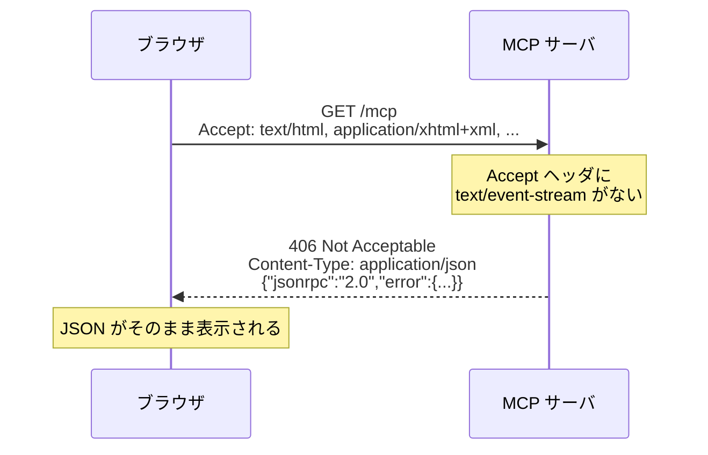
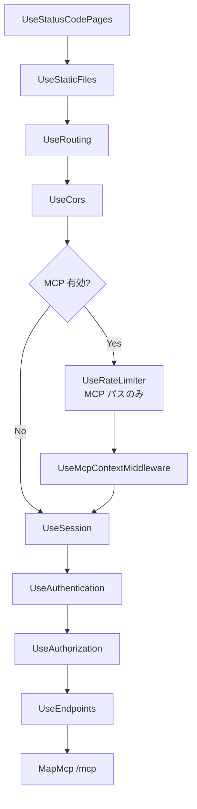
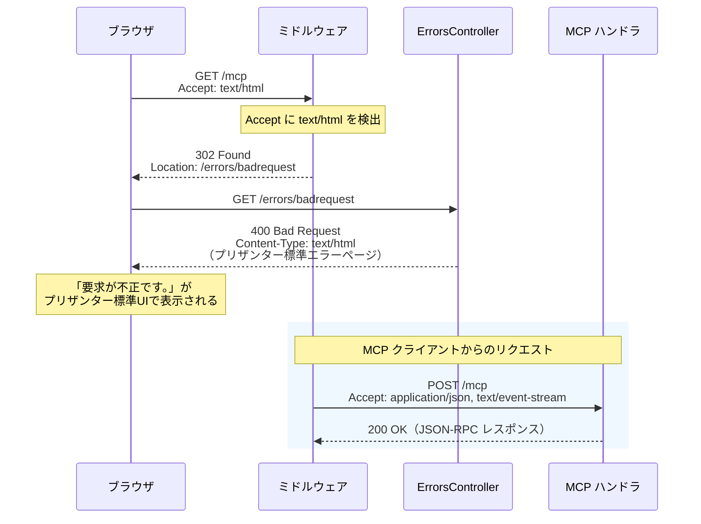

# MCP サーバエンドポイントのブラウザアクセス対策

MCP（Model Context Protocol）の Streamable HTTP エンドポイントをブラウザで直接開いた際に、
生の JSON エラーが表示される問題について調査し、対策案を比較・検討する。

<!-- START doctoc generated TOC please keep comment here to allow auto update -->
<!-- DON'T EDIT THIS SECTION, INSTEAD RE-RUN doctoc TO UPDATE -->

- [調査情報](#調査情報)
- [調査目的](#調査目的)
- [問題の詳細](#問題の詳細)
    - [現象](#現象)
    - [原因](#原因)
    - [MCP 仕様の該当箇所](#mcp-仕様の該当箇所)
- [C# SDK の実装分析](#c-sdk-の実装分析)
    - [エンドポイント登録](#エンドポイント登録)
    - [GET リクエストハンドラ](#get-リクエストハンドラ)
- [プリザンター側の実装分析](#プリザンター側の実装分析)
    - [MCP サーバの有効化](#mcp-サーバの有効化)
    - [エンドポイントの登録](#エンドポイントの登録)
    - [ミドルウェアパイプラインの構成](#ミドルウェアパイプラインの構成)
    - [McpContextMiddleware の役割](#mcpcontextmiddleware-の役割)
    - [UseStatusCodePages との関係](#usestatuscodepages-との関係)
    - [プリザンターが提供するツール・リソース・プロンプト](#プリザンターが提供するツールリソースプロンプト)
    - [既存エラーページ機構](#既存エラーページ機構)
    - [対策実装時の注意点（プリザンター固有）](#対策実装時の注意点プリザンター固有)
- [対策案の比較](#対策案の比較)
    - [対策 A: ミドルウェアによる既存エラーページへのリダイレクト](#対策-a-ミドルウェアによる既存エラーページへのリダイレクト)
    - [対策 B: 静的ファイル + フォールバックルート](#対策-b-静的ファイル--フォールバックルート)
    - [対策 C: リバースプロキシによるルーティング分離](#対策-c-リバースプロキシによるルーティング分離)
    - [対策 D: MapMcp の前段で HTML ファイルを返すミニマルエンドポイント](#対策-d-mapmcp-の前段で-html-ファイルを返すミニマルエンドポイント)
- [対策案の総合比較](#対策案の総合比較)
- [エラーページの表示方針](#エラーページの表示方針)
    - [既存エラーページの表示要素](#既存エラーページの表示要素)
    - [独自ランディングページが必要な場合](#独自ランディングページが必要な場合)
- [結論](#結論)
- [関連ソースコード](#関連ソースコード)
- [関連リンク](#関連リンク)

<!-- END doctoc generated TOC please keep comment here to allow auto update -->

## 調査情報

| 調査日        | リポジトリ                      | ブランチ | タグ/バージョン | コミット    | 備考                                     |
| ------------- | ------------------------------- | -------- | --------------- | ----------- | ---------------------------------------- |
| 2026年3月16日 | modelcontextprotocol/csharp-sdk | main     | 1.0.0           | -           | MCP C# SDK の Streamable HTTP 実装を調査 |
| 2026年3月16日 | Implem/Implem.Pleasanter        | main     | -               | `c76832d69` | プリザンター側の MCP 実装を調査          |

## 調査目的

- ブラウザで MCP エンドポイントを直接開いた際に表示される JSON エラーの原因を明らかにする
- MCP 仕様上の制約を把握したうえで、ブラウザアクセス時に人間にとって分かりやすい応答を返す方法を整理する
- 実装コストと仕様適合性の観点から最適な対策を選定する

---

## 問題の詳細

### 現象

MCP サーバの Streamable HTTP エンドポイント（例: `https://example.com/mcp`）をブラウザのアドレスバーに入力してアクセスすると、以下のような JSON エラーがそのまま表示される。

```json
{
    "jsonrpc": "2.0",
    "error": {
        "code": -32600,
        "message": "Not Acceptable: Client must accept text/event-stream"
    }
}
```

### 原因

ブラウザの通常のナビゲーションは HTTP GET リクエストを送信し、`Accept` ヘッダには `text/html` が含まれるが、
`text/event-stream` は含まれない。MCP C# SDK の `StreamableHttpHandler.HandleGetRequestAsync` は
`Accept` ヘッダに `text/event-stream` が含まれない場合、HTTP 406 Not Acceptable とともに
JSON-RPC エラーを返す設計になっている。



### MCP 仕様の該当箇所

MCP 仕様（2025-03-26）の Streamable HTTP トランスポートセクションでは、GET リクエストについて以下のように規定している。

> The client MAY issue an HTTP GET to the MCP endpoint.
> This can be used to open an SSE stream, allowing the server to communicate
> to the client, without the client first sending data via HTTP POST.
>
> The client MUST include an Accept header,
> listing text/event-stream as a supported content type.
>
> The server MUST either return Content-Type: text/event-stream
> in response to this HTTP GET, or else return HTTP 405 Method Not Allowed,
> indicating that the server does not offer an SSE stream at this endpoint.

**参考**: [MCP Specification - Transports](https://modelcontextprotocol.io/specification/2025-03-26/basic/transports)

つまり、仕様上の正規クライアントは `Accept: text/event-stream` を含む GET リクエストを送る前提であり、ブラウザからの直接アクセスは想定されていない。

---

## C# SDK の実装分析

### エンドポイント登録

**ファイル**: `src/ModelContextProtocol.AspNetCore/McpEndpointRouteBuilderExtensions.cs`

```csharp
public static IEndpointConventionBuilder MapMcp(
    this IEndpointRouteBuilder endpoints,
    string pattern = "")
{
    var streamableHttpHandler = endpoints.ServiceProvider
        .GetService<StreamableHttpHandler>();

    var mcpGroup = endpoints.MapGroup(pattern);
    var streamableHttpGroup = mcpGroup.MapGroup("");

    // POST: JSON-RPC メッセージ送受信
    streamableHttpGroup.MapPost("",
        streamableHttpHandler.HandlePostRequestAsync);

    if (!streamableHttpHandler.HttpServerTransportOptions.Stateless)
    {
        // GET: SSE ストリーム（Stateful モード時のみ）
        streamableHttpGroup.MapGet("",
            streamableHttpHandler.HandleGetRequestAsync);

        // DELETE: セッション終了
        streamableHttpGroup.MapDelete("",
            streamableHttpHandler.HandleDeleteRequestAsync);
    }

    return mcpGroup;
}
```

`MapGet` が登録されるのは Stateful モード時のみである。Stateless モードでは GET エンドポイント自体が存在しないため、ASP.NET Core のデフォルトの 404/405 レスポンスが返る。

### GET リクエストハンドラ

**ファイル**: `src/ModelContextProtocol.AspNetCore/StreamableHttpHandler.cs`

```csharp
public async Task HandleGetRequestAsync(HttpContext context)
{
    if (!ValidateProtocolVersionHeader(context, out var errorMessage))
    {
        await WriteJsonRpcErrorAsync(context, errorMessage!,
            StatusCodes.Status400BadRequest);
        return;
    }

    if (!context.Request.GetTypedHeaders()
        .Accept.Any(MatchesTextEventStreamMediaType))
    {
        await WriteJsonRpcErrorAsync(context,
            "Not Acceptable: Client must accept text/event-stream",
            StatusCodes.Status406NotAcceptable);
        return;
    }

    // ... SSE ストリーム処理
}
```

ブラウザからのアクセスは 2 番目の条件分岐（Accept ヘッダチェック）で弾かれ、JSON-RPC エラーレスポンスが返される。

---

## プリザンター側の実装分析

### MCP サーバの有効化

プリザンターの MCP サーバは `Parameters.McpServer.Enabled` で有効/無効を切り替える。
デフォルトは **無効**（`false`）である。

**ファイル**: `Implem.Pleasanter/App_Data/Parameters/McpServer.json`

```json
{
    "Enabled": false,
    "ReadOnlyMode": false,
    "LogExportLimit": 10000,
    "RateLimit": {
        "FixedWindow": { "Enabled": false, ... },
        "SlidingWindow": { "Enabled": false, ... },
        "TokenBucket": { "Enabled": false, ... },
        "Concurrency": { "Enabled": false, ... }
    },
    "Logging": {
        "EnableLoggingToDatabase": true,
        "EnableLoggingToFile": false
    }
}
```

### エンドポイントの登録

**ファイル**: `Implem.Pleasanter/Startup.cs`（行番号: 320-361, 471-482, 629-632）

プリザンターは `McpConstants.BasePath`（= `"/mcp"`）を MCP エンドポイントとして
`ModelContextProtocol.AspNetCore` v1.0.0 の `MapMcp` で登録している。

```csharp
// サービス登録（ConfigureMcpServer）
private static void ConfigureMcpServer(IServiceCollection services)
{
    if (Parameters.McpServer?.Enabled == true)
    {
        services.AddMcpServer()
            .WithHttpTransport()
            .WithToolsFromAssembly()
            .WithPromptsFromAssembly()
            .WithResourcesFromAssembly();
        // ... レートリミッター設定
    }
}

// エンドポイントマッピング
if (Parameters.McpServer?.Enabled == true)
{
    endpoints.MapMcp(McpConstants.BasePath); // "/mcp"
}
```

`WithHttpTransport()` のデフォルトは Stateful モードのため、
GET/POST/DELETE の全メソッドが `/mcp` に登録される。

### ミドルウェアパイプラインの構成

MCP に関連するミドルウェアの登録順序は以下の通りである。



### McpContextMiddleware の役割

**ファイル**: `Implem.Pleasanter/MCP/Infrastructure/McpContextMiddleware.cs`

`McpContextMiddleware` は `/mcp` パスへのリクエストに対して以下を行う。

| 処理             | 内容                                                 |
| ---------------- | ---------------------------------------------------- |
| API キー抽出     | `X-API-Key` / `Authorization: Bearer` からキーを取得 |
| リクエスト解析   | POST リクエストの JSON-RPC ボディを解析              |
| レスポンス記録   | レスポンスボディをキャプチャしてログに記録           |
| クライアント情報 | `initialize` 時にクライアント名・バージョンを抽出    |
| ログ保存         | `McpLogModel` に非同期でログを書き込み               |

```csharp
public async Task InvokeAsync(HttpContext context)
{
    if (!context.Request.Path
        .StartsWithSegments(McpConstants.BasePath))
    {
        await _next(context);
        return;
    }
    // ... API キー抽出・リクエスト解析
    await _next(context);
    // ... レスポンス記録・ログ保存
}
```

このミドルウェアは POST リクエストのみログ記録を行い、
GET リクエストには実質的に `_next(context)` をそのまま呼ぶだけである。
そのため、ブラウザからの GET アクセスはこのミドルウェアを素通りし、
SDK の `HandleGetRequestAsync` に到達する。

### UseStatusCodePages との関係

`Startup.cs` の `UseStatusCodePages`（行番号: 414-434）は
ステータスコード 405 を `/errors/badrequest` にリダイレクトする設定がある。

```csharp
app.UseStatusCodePages(context =>
{
    var statusCode = context.HttpContext.Response.StatusCode;
    if (statusCode == 405)
        context.HttpContext.Response.Redirect("/errors/badrequest");
    // ...
});
```

ただし、SDK の `HandleGetRequestAsync` はレスポンスボディに JSON を書き込んでから
ステータスコード 406 を返すため、`UseStatusCodePages` の発動条件
（レスポンスボディが空であること）を満たさず、リダイレクトは行われない。
結果として、ブラウザには JSON-RPC エラーがそのまま表示される。

### プリザンターが提供するツール・リソース・プロンプト

MCP サーバとして以下の機能が登録されている。

#### ツール（Tools）

| ファイル               | 内容                         |
| ---------------------- | ---------------------------- |
| `ItemsTool.cs`         | レコードの CRUD 操作         |
| `SitesTool.cs`         | サイト（テーブル定義）の管理 |
| `ViewsTool.cs`         | ビューの操作                 |
| `UsersTool.cs`         | ユーザー情報の取得           |
| `OutgoingMailsTool.cs` | メール送信機能               |

#### リソース（Resources）

| ファイル                      | 内容               |
| ----------------------------- | ------------------ |
| `ItemFieldsResource.cs`       | 項目フィールド仕様 |
| `ViewJsonSpecResource.cs`     | ビュー JSON 仕様   |
| `SiteSettingsResource.cs`     | サイト設定仕様     |
| `PagingSpecResource.cs`       | ページング仕様     |
| `ChoicesPatternResource.cs`   | 選択肢パターン仕様 |
| `ToolCapabilitiesResource.cs` | ツール機能一覧     |

#### プロンプト（Prompts）

| ファイル             | 内容                           |
| -------------------- | ------------------------------ |
| `WorkflowPrompts.cs` | 担当者設定等のワークフロー支援 |

### 既存エラーページ機構

プリザンターには、存在しないファイルやアクセス権のないサイトにアクセスした際のエラーページ機構が既に存在する。
MCP エンドポイントのブラウザアクセス対策でもこの機構を流用することで、UI の統一性を保てる。

#### ErrorsController

**ファイル**: `Implem.Pleasanter/Controllers/ErrorsController.cs`

`ErrorsController` は各種エラーに対応するアクションを持つ。すべて `[AllowAnonymous]` で公開されている。

| アクション             | ステータスコード | Error.Types            | 表示メッセージ（日本語）                 |
| ---------------------- | :--------------: | ---------------------- | ---------------------------------------- |
| `NotFound()`           |       404        | `NotFound`             | 指定された情報は見つかりませんでした。   |
| `BadRequest()`         |       400        | `BadRequest`           | 要求が不正です。                         |
| `InternalServerError`  |       500        | `InternalServerError`  | サーバで予期しないエラーが発生しました。 |
| `InvalidIpAddress`     |       403        | `InvalidIpAddress`     | IP アドレスが許可されていません。        |
| `ParameterSyntaxError` |       403        | `ParameterSyntaxError` | パラメータの構文にエラーがあります。     |

各アクションは非 Ajax の場合 `HtmlTemplates.Error()` でプリザンター標準のレイアウト（ヘッダ・ナビゲーション・メッセージエリア）を含む HTML を生成する。

```csharp
// NotFound アクションの例
[AllowAnonymous]
public new ActionResult NotFound()
{
    Response.StatusCode = (int)HttpStatusCode.NotFound;
    var context = new Context();
    if (!context.Ajax)
    {
        var html = HtmlTemplates.Error(
            context: context,
            errorData: new ErrorData(
                context: context,
                type: Error.Types.NotFound,
                sysLogsStatus: 404,
                sysLogsDescription: Debugs.GetSysLogsDescription()));
        ViewBag.HtmlBody = html;
        return View();
    }
    else
    {
        return Content(Error.Types.NotFound.MessageJson(context: context));
    }
}
```

#### UseStatusCodePages によるリダイレクト

**ファイル**: `Implem.Pleasanter/Startup.cs`（行番号: 414-434）

`UseStatusCodePages` は、レスポンスボディが未書き込みの状態でステータスコードが返された場合に、
対応する `ErrorsController` のアクションにリダイレクトする。

```csharp
app.UseStatusCodePages(context =>
{
    var statusCode = context.HttpContext.Response.StatusCode;
    if (statusCode == 400) context.HttpContext.Response.Redirect("/errors/badrequest");
    else if (statusCode == 404) context.HttpContext.Response.Redirect("/errors/notfound");
    else if (statusCode == 405) context.HttpContext.Response.Redirect("/errors/badrequest");
    else if (statusCode == 500) context.HttpContext.Response.Redirect("/errors/internalservererror");
    // ...
    else context.HttpContext.Response.Redirect("/errors/internalservererror");
    return Task.CompletedTask;
});
```

ただし、MCP SDK が JSON-RPC エラーをボディに書き込んでから 406 を返すため、
このリダイレクトは発動しない（前述の「UseStatusCodePages との関係」参照）。
対策ミドルウェアでは SDK に到達する前にリクエストを `/errors/badrequest` へリダイレクトすることで、
既存のエラーページ機構をそのまま流用できる。

#### HtmlTemplates.Error の画面構成

`HtmlTemplates.Error()` はプリザンター標準の `_Layout.cshtml` を使用し、
以下の要素を含む統一的なエラー画面を表示する。

| 画面要素         | 内容                                                                   |
| ---------------- | ---------------------------------------------------------------------- |
| ヘッダ           | プリザンターのナビゲーションメニュー                                   |
| メッセージエリア | `Error.Types` に対応する多言語メッセージ（`App_Data/Displays/*.json`） |
| テーマ・スタイル | テナント設定のテーマが適用される                                       |
| レスポンシブ対応 | 共通レイアウトと同一のレスポンシブ CSS                                 |

この機構を流用することで、カスタム HTML を別途管理する必要がなくなり、
テーマ変更やメッセージの多言語対応も自動的に反映される。

### 対策実装時の注意点（プリザンター固有）

プリザンターに対策を実装する場合、以下の点に注意が必要である。

| 注意点                 | 詳細                                                                      |
| ---------------------- | ------------------------------------------------------------------------- |
| ミドルウェアの配置位置 | `UseMcpContextMiddleware()` より前に配置する必要がある                    |
| パス定数の利用         | ハードコードせず `McpConstants.BasePath` を使用すること                   |
| 有効フラグの確認       | `Parameters.McpServer?.Enabled == true` の条件分岐内に配置すること        |
| 既存エラーページの流用 | `/errors/badrequest` へリダイレクトし、独自 HTML は持たない               |
| UseStatusCodePages     | SDK の 406 はリダイレクト不可のため、ミドルウェアで事前にリダイレクトする |

---

## 対策案の比較

### 対策 A: ミドルウェアによる既存エラーページへのリダイレクト

MCP エンドポイントの前段にミドルウェアを配置し、ブラウザからのアクセスを検出して
プリザンター既存のエラーページ（`/errors/badrequest`）へリダイレクトする。
プリザンターでは `McpContextMiddleware` の前に配置する。

独自の HTML を管理する必要がなく、プリザンター標準のエラーページ（テーマ・多言語対応含む）が
そのまま表示されるため、UI の統一性と保守性に優れる。

```csharp
// Startup.cs の Configure メソッド内
if (Parameters.McpServer?.Enabled == true)
{
    // ブラウザからの MCP エンドポイントアクセスを既存エラーページへリダイレクト
    app.Use(async (context, next) =>
    {
        if (context.Request.Path
                .StartsWithSegments(McpConstants.BasePath)
            && context.Request.Method == HttpMethods.Get
            && context.Request.GetTypedHeaders().Accept
                .Any(a => a.MediaType.Equals("text/html",
                    StringComparison.OrdinalIgnoreCase)))
        {
            context.Response.Redirect("/errors/badrequest");
            return;
        }
        await next();
    });

    // 既存のレートリミッター・MCP ミドルウェア
    var rateLimit = Parameters.McpServer.RateLimit;
    if (rateLimit?.AnyEnabled == true)
    {
        app.UseWhen(
            ctx => ctx.Request.Path
                .StartsWithSegments(McpConstants.BasePath),
            appBuilder => appBuilder.UseRateLimiter());
    }
    app.UseMcpContextMiddleware();
}
```



#### 既存エラーページの流用が適切な理由

| 観点       | 説明                                                                             |
| ---------- | -------------------------------------------------------------------------------- |
| 一貫性     | 存在しないページ（404）やアクセス権エラー（403）と同じ画面体験を提供できる       |
| テーマ対応 | テナントごとのテーマ設定が自動適用される                                         |
| 多言語対応 | `App_Data/Displays/BadRequest.json` の定義により日本語・英語等が自動で切り替わる |
| 保守コスト | 独自 HTML の管理が不要                                                           |

#### 特徴

| 観点           | 評価                                                                           |
| -------------- | ------------------------------------------------------------------------------ |
| 実装コスト     | 低（ミドルウェア追加のみ、独自 HTML 不要）                                     |
| MCP 仕様適合性 | 高（正規クライアントのリクエストには影響しない）                               |
| 保守性         | 高（プリザンター既存のエラーページ機構を流用するため個別管理不要）             |
| 拡張性         | 中（表示内容のカスタマイズは `ErrorsController` や Displays 定義の変更が必要） |

### 対策 B: 静的ファイル + フォールバックルート

静的 HTML ファイルを `wwwroot` に配置し、MCP エンドポイントと同じパスでブラウザ向けにフォールバックする。

```csharp
// wwwroot/mcp/index.html を配置
app.UseStaticFiles();

// MCP エンドポイント
app.MapMcp("/mcp");

// フォールバック: ブラウザからの GET のみ
app.MapGet("/mcp", async context =>
{
    if (context.Request.GetTypedHeaders().Accept
        .Any(a => a.MediaType.Equals("text/html",
            StringComparison.OrdinalIgnoreCase)))
    {
        context.Response.ContentType = "text/html; charset=utf-8";
        await context.Response.SendFileAsync(
            Path.Combine("wwwroot", "mcp", "index.html"));
    }
    else
    {
        context.Response.StatusCode =
            StatusCodes.Status405MethodNotAllowed;
    }
});
```

> **注意**: `MapMcp` のルート登録と `MapGet` の登録順序により、ASP.NET Core のルーティングが正しく動作しない可能性がある。実際にはミドルウェア方式（対策 A）のほうが安全に動作する。

#### 特徴

| 観点           | 評価                                                      |
| -------------- | --------------------------------------------------------- |
| 実装コスト     | 中（静的ファイル配置 + ルート登録）                       |
| MCP 仕様適合性 | 中（ルーティング競合のリスクあり）                        |
| 保守性         | 高（HTML ファイルの編集のみで変更可能）                   |
| 拡張性         | 静的ファイルのためサーバ情報の動的表示には別途 API が必要 |

### 対策 C: リバースプロキシによるルーティング分離

nginx 等のリバースプロキシで `Accept` ヘッダを判定し、ブラウザアクセスには静的ページを返す。

```nginx
server {
    listen 443 ssl;
    server_name mcp.example.com;

    # ブラウザからのアクセス: Accept に text/html が含まれる場合
    location /mcp {
        if ($http_accept ~* "text/html") {
            rewrite ^ /mcp-landing.html break;
        }

        # MCP クライアントからのアクセス: バックエンドにプロキシ
        proxy_pass http://localhost:5000;
        proxy_http_version 1.1;
        proxy_set_header Connection "";
        proxy_set_header Host $host;
        proxy_buffering off;
        proxy_cache off;
    }

    location = /mcp-landing.html {
        root /var/www/static;
        internal;
    }
}
```

#### 特徴

| 観点           | 評価                                       |
| -------------- | ------------------------------------------ |
| 実装コスト     | 中（nginx 設定の追加）                     |
| MCP 仕様適合性 | 高（アプリケーション側に変更なし）         |
| 保守性         | 高（HTML・nginx 設定の変更のみ）           |
| 拡張性         | 低（静的ページのため動的情報の表示が困難） |

### 対策 D: MapMcp の前段で HTML ファイルを返すミニマルエンドポイント

`MapMcp` よりも先にルートを登録し、ブラウザアクセスだけを処理するミニマルなエンドポイントを追加する。対策 A のバリエーションだが、Razor や静的ファイルの仕組みを利用する。

```csharp
// MCP エンドポイントのランディングページ
app.MapGet("/mcp", (HttpContext context) =>
{
    var accept = context.Request.GetTypedHeaders().Accept;
    if (accept.Any(a => a.MediaType.Equals("text/html",
        StringComparison.OrdinalIgnoreCase)))
    {
        return Results.Content(
            File.ReadAllText("wwwroot/mcp-landing.html"),
            "text/html");
    }

    // ブラウザ以外は MCP ハンドラに任せたいが、
    // ルート競合のため next() が呼べない
    return Results.StatusCode(StatusCodes.Status405MethodNotAllowed);
}).ExcludeFromDescription();

app.MapMcp("/mcp");
```

> **注意**: ASP.NET Core の Minimal API では同じパスに複数の `MapGet` を登録するとルーティング競合が起きるため、この方式は推奨しない。

#### 特徴

| 観点           | 評価                           |
| -------------- | ------------------------------ |
| 実装コスト     | 低                             |
| MCP 仕様適合性 | 低（ルート競合のリスクが高い） |
| 保守性         | 中                             |
| 拡張性         | 中                             |

---

## 対策案の総合比較

| 対策 | 方式                              | 実装コスト | 仕様適合性 | 保守性 | 拡張性 | 推奨度 |
| ---- | --------------------------------- | :--------: | :--------: | :----: | :----: | :----: |
| A    | ミドルウェア+既存エラーページ流用 |     低     |     高     |   高   |   中   |  ★★★   |
| B    | 静的ファイル+フォールバック       |     中     |     中     |   中   |   低   |   ★★   |
| C    | リバースプロキシ                  |     中     |     高     |   中   |   低   |   ★★   |
| D    | ミニマルエンドポイント            |     低     |     低     |   中   |   中   |   ★    |

---

## エラーページの表示方針

推奨対策 A では、プリザンターの既存エラーページ機構（`ErrorsController.BadRequest`）をそのまま流用する。
これにより、存在しないファイルやアクセス権のないサイトにアクセスしたときと同じ画面が表示される。

### 既存エラーページの表示要素

| 要素                   | 内容                                                                                               |
| ---------------------- | -------------------------------------------------------------------------------------------------- |
| ヘッダ・ナビゲーション | プリザンター標準のナビゲーションメニュー（テーマ適用済み）                                         |
| メッセージ             | 「要求が不正です。」（`BadRequest`）または「指定された情報は見つかりませんでした。」（`NotFound`） |
| 多言語対応             | `App_Data/Displays/*.json` の定義に基づき、ユーザーの言語設定で自動切替                            |
| レスポンシブ対応       | 共通の `_Layout.cshtml` と CSS が適用される                                                        |

### 独自ランディングページが必要な場合

将来的に MCP エンドポイント固有の情報（接続方法・ツール一覧等）をブラウザに表示する要件が生じた場合は、
以下のいずれかで対応できる。

| 方式                                | 概要                                                                          |
| ----------------------------------- | ----------------------------------------------------------------------------- |
| `ErrorsController` にアクション追加 | `McpEndpointInfo()` 等の専用アクションを追加し、対策 A のリダイレクト先を変更 |
| `Error.Types` にタイプ追加          | MCP 固有のエラータイプを追加し、`Displays` JSON に説明文を定義                |
| 別途インフォメーションページ        | MCP の説明専用ページを作成し、ミドルウェアからリダイレクト                    |

ただし、現時点では既存の `BadRequest` ページへのリダイレクトで十分であり、
独自ページの作成は不要である。

---

## 結論

| 項目               | 結論                                                                                                                       |
| ------------------ | -------------------------------------------------------------------------------------------------------------------------- |
| 問題の原因         | MCP 仕様はブラウザからの直接アクセスを想定しておらず、Accept ヘッダの不一致により JSON エラーが返される                    |
| プリザンターの状況 | `/mcp` エンドポイントに Stateful モードで SDK を登録。UseStatusCodePages の 406 リダイレクトは発動しない                   |
| 既存エラーページ   | `ErrorsController` / `HtmlTemplates.Error` による統一的なエラー画面がテーマ・多言語対応付きで存在する                      |
| 推奨対策           | **対策 A（ミドルウェア + 既存エラーページへのリダイレクト）** — 既存の `/errors/badrequest` へリダイレクトし UI を統一する |
| 実装の注意点       | `Parameters.McpServer?.Enabled` 条件内で `McpConstants.BasePath` を使い、`UseMcpContextMiddleware` の前に配置              |
| MCP 仕様への影響   | 正規クライアントは `Accept: text/event-stream` で接続するため、ミドルウェアの追加による副作用はない                        |

---

## 関連ソースコード

| ファイル                                                       | 内容                               |
| -------------------------------------------------------------- | ---------------------------------- |
| `Implem.Pleasanter/Startup.cs`                                 | MCP サーバの登録・パイプライン構成 |
| `Implem.Pleasanter/Controllers/ErrorsController.cs`            | 既存エラーページコントローラ       |
| `Implem.Pleasanter/Libraries/HtmlParts/HtmlTemplates.cs`       | エラーページ HTML 生成             |
| `Implem.Pleasanter/Views/Errors/BadRequest.cshtml`             | BadRequest エラービュー            |
| `Implem.Pleasanter/Views/Errors/NotFound.cshtml`               | NotFound エラービュー              |
| `Implem.Pleasanter/App_Data/Displays/BadRequest.json`          | BadRequest 多言語メッセージ定義    |
| `Implem.Pleasanter/App_Data/Displays/NotFound.json`            | NotFound 多言語メッセージ定義      |
| `Implem.Pleasanter/MCP/Infrastructure/McpConstants.cs`         | エンドポイントパス定数             |
| `Implem.Pleasanter/MCP/Infrastructure/McpContextMiddleware.cs` | MCP 固有ミドルウェア               |
| `Implem.Pleasanter/MCP/Infrastructure/McpRateLimitPolicies.cs` | レートリミッター設定               |
| `Implem.ParameterAccessor/Parts/McpServer.cs`                  | パラメータクラス                   |
| `Implem.Pleasanter/App_Data/Parameters/McpServer.json`         | パラメータデフォルト値             |

---

## 関連リンク

- [MCP Specification - Transports（2025-03-26）](https://modelcontextprotocol.io/specification/2025-03-26/basic/transports)
- [modelcontextprotocol/csharp-sdk](https://github.com/modelcontextprotocol/csharp-sdk) - MCP C# SDK
- [ModelContextProtocol.AspNetCore NuGet パッケージ](https://www.nuget.org/packages/ModelContextProtocol.AspNetCore/)
- [Build a Model Context Protocol (MCP) server in C# - .NET Blog](https://devblogs.microsoft.com/dotnet/build-a-model-context-protocol-mcp-server-in-csharp/)
