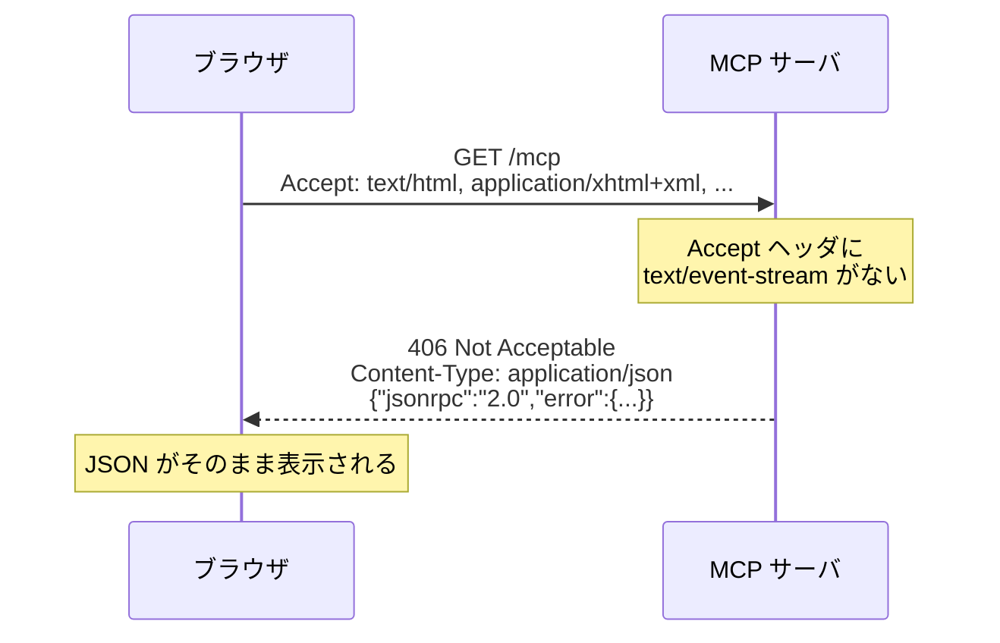
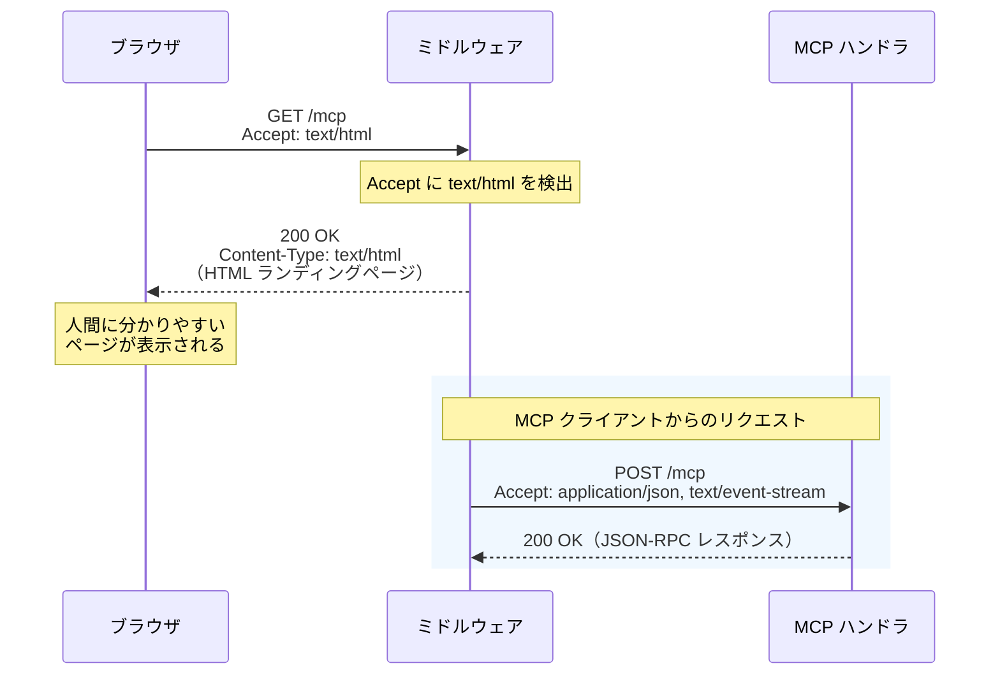

# MCP サーバエンドポイントのブラウザアクセス対策

MCP（Model Context Protocol）の Streamable HTTP エンドポイントをブラウザで直接開いた際に、
生の JSON エラーが表示される問題について調査し、対策案を比較・検討する。

<!-- START doctoc generated TOC please keep comment here to allow auto update -->
<!-- DON'T EDIT THIS SECTION, INSTEAD RE-RUN doctoc TO UPDATE -->

- [調査情報](#調査情報)
- [調査目的](#調査目的)
- [問題の詳細](#問題の詳細)
    - [現象](#現象)
    - [原因](#原因)
    - [MCP 仕様の該当箇所](#mcp-仕様の該当箇所)
- [C# SDK の実装分析](#c-sdk-の実装分析)
    - [エンドポイント登録](#エンドポイント登録)
    - [GET リクエストハンドラ](#get-リクエストハンドラ)
- [対策案の比較](#対策案の比較)
    - [対策 A: ミドルウェアによるコンテンツネゴシエーション](#対策-a-ミドルウェアによるコンテンツネゴシエーション)
    - [対策 B: 静的ファイル + フォールバックルート](#対策-b-静的ファイル--フォールバックルート)
    - [対策 C: リバースプロキシによるルーティング分離](#対策-c-リバースプロキシによるルーティング分離)
    - [対策 D: MapMcp の前段で HTML ファイルを返すミニマルエンドポイント](#対策-d-mapmcp-の前段で-html-ファイルを返すミニマルエンドポイント)
- [対策案の総合比較](#対策案の総合比較)
- [ランディングページのコンテンツ設計](#ランディングページのコンテンツ設計)
    - [ランディングページの表示イメージ](#ランディングページの表示イメージ)
- [結論](#結論)
- [関連リンク](#関連リンク)

<!-- END doctoc generated TOC please keep comment here to allow auto update -->

## 調査情報

| 調査日        | リポジトリ                      | ブランチ | タグ/バージョン | コミット | 備考                                     |
| ------------- | ------------------------------- | -------- | --------------- | -------- | ---------------------------------------- |
| 2026年3月16日 | modelcontextprotocol/csharp-sdk | main     | -               | -        | MCP C# SDK の Streamable HTTP 実装を調査 |

## 調査目的

- ブラウザで MCP エンドポイントを直接開いた際に表示される JSON エラーの原因を明らかにする
- MCP 仕様上の制約を把握したうえで、ブラウザアクセス時に人間にとって分かりやすい応答を返す方法を整理する
- 実装コストと仕様適合性の観点から最適な対策を選定する

---

## 問題の詳細

### 現象

MCP サーバの Streamable HTTP エンドポイント（例: `https://example.com/mcp`）をブラウザのアドレスバーに入力してアクセスすると、以下のような JSON エラーがそのまま表示される。

```json
{
    "jsonrpc": "2.0",
    "error": {
        "code": -32600,
        "message": "Not Acceptable: Client must accept text/event-stream"
    }
}
```

### 原因

ブラウザの通常のナビゲーションは HTTP GET リクエストを送信し、`Accept` ヘッダには `text/html` が含まれるが、
`text/event-stream` は含まれない。MCP C# SDK の `StreamableHttpHandler.HandleGetRequestAsync` は
`Accept` ヘッダに `text/event-stream` が含まれない場合、HTTP 406 Not Acceptable とともに
JSON-RPC エラーを返す設計になっている。



### MCP 仕様の該当箇所

MCP 仕様（2025-03-26）の Streamable HTTP トランスポートセクションでは、GET リクエストについて以下のように規定している。

> The client MAY issue an HTTP GET to the MCP endpoint.
> This can be used to open an SSE stream, allowing the server to communicate
> to the client, without the client first sending data via HTTP POST.
>
> The client MUST include an Accept header,
> listing text/event-stream as a supported content type.
>
> The server MUST either return Content-Type: text/event-stream
> in response to this HTTP GET, or else return HTTP 405 Method Not Allowed,
> indicating that the server does not offer an SSE stream at this endpoint.

**参考**: [MCP Specification - Transports](https://modelcontextprotocol.io/specification/2025-03-26/basic/transports)

つまり、仕様上の正規クライアントは `Accept: text/event-stream` を含む GET リクエストを送る前提であり、ブラウザからの直接アクセスは想定されていない。

---

## C# SDK の実装分析

### エンドポイント登録

**ファイル**: `src/ModelContextProtocol.AspNetCore/McpEndpointRouteBuilderExtensions.cs`

```csharp
public static IEndpointConventionBuilder MapMcp(
    this IEndpointRouteBuilder endpoints,
    string pattern = "")
{
    var streamableHttpHandler = endpoints.ServiceProvider
        .GetService<StreamableHttpHandler>();

    var mcpGroup = endpoints.MapGroup(pattern);
    var streamableHttpGroup = mcpGroup.MapGroup("");

    // POST: JSON-RPC メッセージ送受信
    streamableHttpGroup.MapPost("",
        streamableHttpHandler.HandlePostRequestAsync);

    if (!streamableHttpHandler.HttpServerTransportOptions.Stateless)
    {
        // GET: SSE ストリーム（Stateful モード時のみ）
        streamableHttpGroup.MapGet("",
            streamableHttpHandler.HandleGetRequestAsync);

        // DELETE: セッション終了
        streamableHttpGroup.MapDelete("",
            streamableHttpHandler.HandleDeleteRequestAsync);
    }

    return mcpGroup;
}
```

`MapGet` が登録されるのは Stateful モード時のみである。Stateless モードでは GET エンドポイント自体が存在しないため、ASP.NET Core のデフォルトの 404/405 レスポンスが返る。

### GET リクエストハンドラ

**ファイル**: `src/ModelContextProtocol.AspNetCore/StreamableHttpHandler.cs`

```csharp
public async Task HandleGetRequestAsync(HttpContext context)
{
    if (!ValidateProtocolVersionHeader(context, out var errorMessage))
    {
        await WriteJsonRpcErrorAsync(context, errorMessage!,
            StatusCodes.Status400BadRequest);
        return;
    }

    if (!context.Request.GetTypedHeaders()
        .Accept.Any(MatchesTextEventStreamMediaType))
    {
        await WriteJsonRpcErrorAsync(context,
            "Not Acceptable: Client must accept text/event-stream",
            StatusCodes.Status406NotAcceptable);
        return;
    }

    // ... SSE ストリーム処理
}
```

ブラウザからのアクセスは 2 番目の条件分岐（Accept ヘッダチェック）で弾かれ、JSON-RPC エラーレスポンスが返される。

---

## 対策案の比較

### 対策 A: ミドルウェアによるコンテンツネゴシエーション

MCP エンドポイントの前段にミドルウェアを配置し、ブラウザからのアクセスを検出して HTML ページを返す。

```csharp
app.Use(async (context, next) =>
{
    if (context.Request.Path.StartsWithSegments("/mcp")
        && context.Request.Method == HttpMethods.Get
        && context.Request.GetTypedHeaders().Accept
            .Any(a => a.MediaType.Equals("text/html",
                StringComparison.OrdinalIgnoreCase)))
    {
        context.Response.ContentType = "text/html; charset=utf-8";
        await context.Response.WriteAsync("""
            <!DOCTYPE html>
            <html lang="ja">
            <head>
              <meta charset="utf-8">
              <title>MCP Server</title>
              <style>
                body { font-family: system-ui, sans-serif;
                       max-width: 600px; margin: 80px auto;
                       color: #333; }
                h1 { border-bottom: 2px solid #0969da; }
                code { background: #f0f0f0; padding: 2px 6px;
                       border-radius: 4px; }
              </style>
            </head>
            <body>
              <h1>🔌 MCP Server</h1>
              <p>このエンドポイントは
                <strong>Model Context Protocol (MCP)</strong>
                クライアント向けです。</p>
              <p>ブラウザから直接利用することはできません。
                MCP 対応クライアント（GitHub Copilot、
                Claude Desktop 等）から接続してください。</p>
              <h2>接続情報</h2>
              <ul>
                <li>トランスポート:
                  <code>Streamable HTTP</code></li>
                <li>エンドポイント:
                  <code>/mcp</code></li>
              </ul>
            </body>
            </html>
            """);
        return;
    }

    await next();
});

app.MapMcp("/mcp");
```



#### 特徴

| 観点           | 評価                                                            |
| -------------- | --------------------------------------------------------------- |
| 実装コスト     | 低（ミドルウェア追加のみ）                                      |
| MCP 仕様適合性 | 高（正規クライアントのリクエストには影響しない）                |
| 保守性         | HTML をコード内にインラインで持つため、変更時に再デプロイが必要 |
| 拡張性         | 接続情報やツール一覧を動的生成できる                            |

### 対策 B: 静的ファイル + フォールバックルート

静的 HTML ファイルを `wwwroot` に配置し、MCP エンドポイントと同じパスでブラウザ向けにフォールバックする。

```csharp
// wwwroot/mcp/index.html を配置
app.UseStaticFiles();

// MCP エンドポイント
app.MapMcp("/mcp");

// フォールバック: ブラウザからの GET のみ
app.MapGet("/mcp", async context =>
{
    if (context.Request.GetTypedHeaders().Accept
        .Any(a => a.MediaType.Equals("text/html",
            StringComparison.OrdinalIgnoreCase)))
    {
        context.Response.ContentType = "text/html; charset=utf-8";
        await context.Response.SendFileAsync(
            Path.Combine("wwwroot", "mcp", "index.html"));
    }
    else
    {
        context.Response.StatusCode =
            StatusCodes.Status405MethodNotAllowed;
    }
});
```

> **注意**: `MapMcp` のルート登録と `MapGet` の登録順序により、ASP.NET Core のルーティングが正しく動作しない可能性がある。実際にはミドルウェア方式（対策 A）のほうが安全に動作する。

#### 特徴

| 観点           | 評価                                                      |
| -------------- | --------------------------------------------------------- |
| 実装コスト     | 中（静的ファイル配置 + ルート登録）                       |
| MCP 仕様適合性 | 中（ルーティング競合のリスクあり）                        |
| 保守性         | 高（HTML ファイルの編集のみで変更可能）                   |
| 拡張性         | 静的ファイルのためサーバ情報の動的表示には別途 API が必要 |

### 対策 C: リバースプロキシによるルーティング分離

nginx 等のリバースプロキシで `Accept` ヘッダを判定し、ブラウザアクセスには静的ページを返す。

```nginx
server {
    listen 443 ssl;
    server_name mcp.example.com;

    # ブラウザからのアクセス: Accept に text/html が含まれる場合
    location /mcp {
        if ($http_accept ~* "text/html") {
            rewrite ^ /mcp-landing.html break;
        }

        # MCP クライアントからのアクセス: バックエンドにプロキシ
        proxy_pass http://localhost:5000;
        proxy_http_version 1.1;
        proxy_set_header Connection "";
        proxy_set_header Host $host;
        proxy_buffering off;
        proxy_cache off;
    }

    location = /mcp-landing.html {
        root /var/www/static;
        internal;
    }
}
```

#### 特徴

| 観点           | 評価                                       |
| -------------- | ------------------------------------------ |
| 実装コスト     | 中（nginx 設定の追加）                     |
| MCP 仕様適合性 | 高（アプリケーション側に変更なし）         |
| 保守性         | 高（HTML・nginx 設定の変更のみ）           |
| 拡張性         | 低（静的ページのため動的情報の表示が困難） |

### 対策 D: MapMcp の前段で HTML ファイルを返すミニマルエンドポイント

`MapMcp` よりも先にルートを登録し、ブラウザアクセスだけを処理するミニマルなエンドポイントを追加する。対策 A のバリエーションだが、Razor や静的ファイルの仕組みを利用する。

```csharp
// MCP エンドポイントのランディングページ
app.MapGet("/mcp", (HttpContext context) =>
{
    var accept = context.Request.GetTypedHeaders().Accept;
    if (accept.Any(a => a.MediaType.Equals("text/html",
        StringComparison.OrdinalIgnoreCase)))
    {
        return Results.Content(
            File.ReadAllText("wwwroot/mcp-landing.html"),
            "text/html");
    }

    // ブラウザ以外は MCP ハンドラに任せたいが、
    // ルート競合のため next() が呼べない
    return Results.StatusCode(StatusCodes.Status405MethodNotAllowed);
}).ExcludeFromDescription();

app.MapMcp("/mcp");
```

> **注意**: ASP.NET Core の Minimal API では同じパスに複数の `MapGet` を登録するとルーティング競合が起きるため、この方式は推奨しない。

#### 特徴

| 観点           | 評価                           |
| -------------- | ------------------------------ |
| 実装コスト     | 低                             |
| MCP 仕様適合性 | 低（ルート競合のリスクが高い） |
| 保守性         | 中                             |
| 拡張性         | 中                             |

---

## 対策案の総合比較

| 対策 | 方式                        | 実装コスト | 仕様適合性 | 保守性 | 拡張性 | 推奨度 |
| ---- | --------------------------- | :--------: | :--------: | :----: | :----: | :----: |
| A    | ミドルウェア                |     低     |     高     |   中   |   高   |  ★★★   |
| B    | 静的ファイル+フォールバック |     中     |     中     |   高   |   低   |   ★★   |
| C    | リバースプロキシ            |     中     |     高     |   高   |   低   |   ★★   |
| D    | ミニマルエンドポイント      |     低     |     低     |   中   |   中   |   ★    |

---

## ランディングページのコンテンツ設計

対策を実装する際、ブラウザに表示するランディングページには以下の情報を含めることを推奨する。

| 項目                 | 内容                                                             |
| -------------------- | ---------------------------------------------------------------- |
| エンドポイントの説明 | MCP サーバであり、ブラウザから直接利用できないことを明示する     |
| 接続方法の案内       | MCP 対応クライアント（例: GitHub Copilot, Claude Desktop）を案内 |
| 接続情報             | トランスポート種別・エンドポイントパスを表示する                 |
| ツール一覧（任意）   | サーバが提供するツール名と概要を動的表示する                     |

### ランディングページの表示イメージ

```text
┌─────────────────────────────────────────┐
│  🔌 MCP Server                         │
│─────────────────────────────────────────│
│                                         │
│  このエンドポイントは Model Context     │
│  Protocol (MCP) クライアント向けです。  │
│                                         │
│  ブラウザから直接利用することは          │
│  できません。MCP 対応クライアントから    │
│  接続してください。                     │
│                                         │
│  接続情報                               │
│  ・トランスポート: Streamable HTTP      │
│  ・エンドポイント: /mcp                 │
│                                         │
│  利用可能なツール                       │
│  ・search_items - アイテムを検索する    │
│  ・get_record   - レコードを取得する    │
│                                         │
└─────────────────────────────────────────┘
```

---

## 結論

| 項目               | 結論                                                                                                          |
| ------------------ | ------------------------------------------------------------------------------------------------------------- |
| 問題の原因         | MCP 仕様はブラウザからの直接アクセスを想定しておらず、Accept ヘッダの不一致により JSON エラーが返される       |
| 推奨対策           | **対策 A（ミドルウェアによるコンテンツネゴシエーション）** が実装コスト・仕様適合性・拡張性のバランスに優れる |
| ランディングページ | MCP サーバの説明・接続方法・接続情報を表示する HTML ページを返すことで UX を改善できる                        |
| 実装の注意点       | ミドルウェアは `MapMcp` より前に配置し、Accept ヘッダに `text/html` が含まれる場合のみ HTML を返すようにする  |
| MCP 仕様への影響   | 正規クライアントは `Accept: text/event-stream` で接続するため、ミドルウェアの追加による副作用はない           |

---

## 関連リンク

- [MCP Specification - Transports（2025-03-26）](https://modelcontextprotocol.io/specification/2025-03-26/basic/transports)
- [modelcontextprotocol/csharp-sdk](https://github.com/modelcontextprotocol/csharp-sdk) - MCP C# SDK
- [ModelContextProtocol.AspNetCore NuGet パッケージ](https://www.nuget.org/packages/ModelContextProtocol.AspNetCore/)
- [Build a Model Context Protocol (MCP) server in C# - .NET Blog](https://devblogs.microsoft.com/dotnet/build-a-model-context-protocol-mcp-server-in-csharp/)
