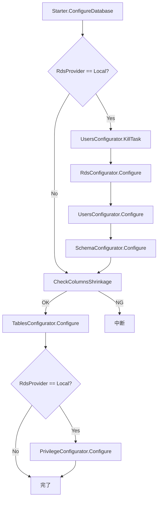
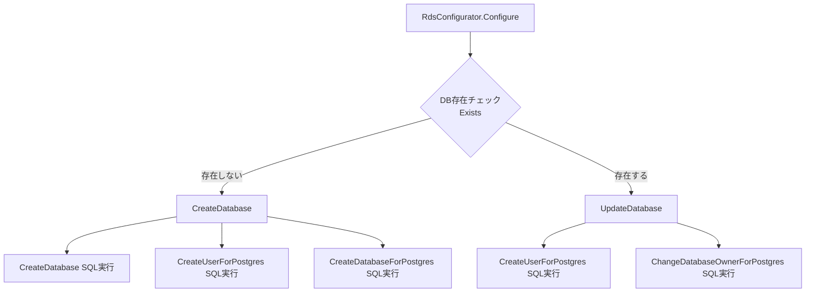
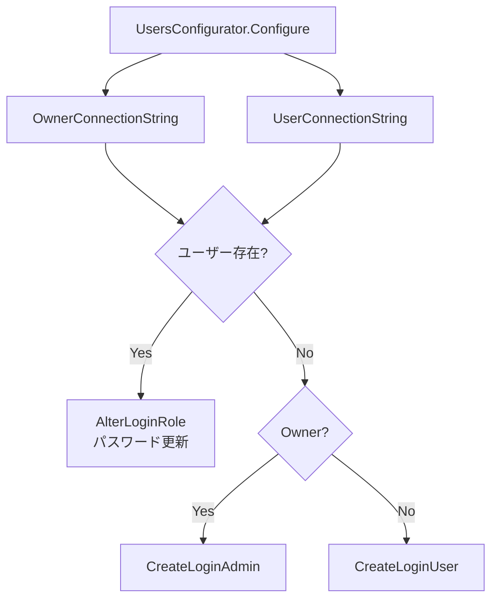
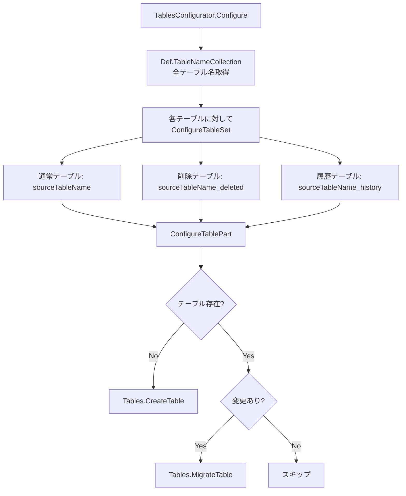
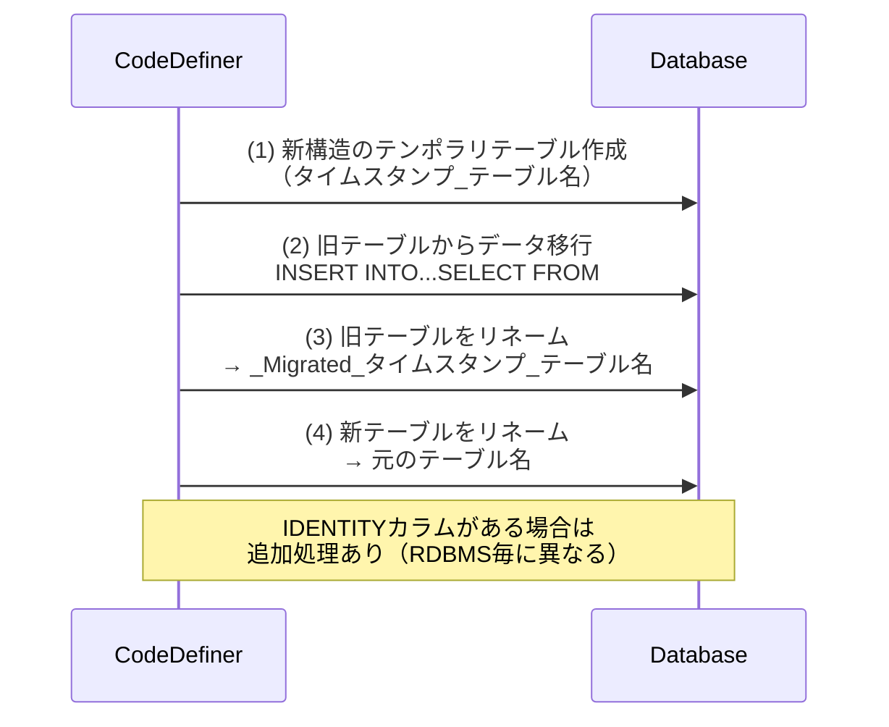
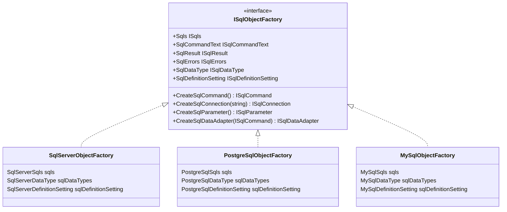
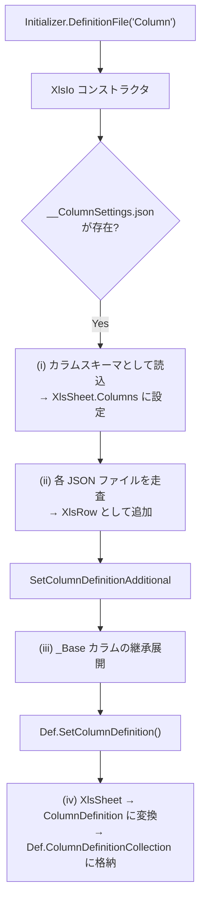
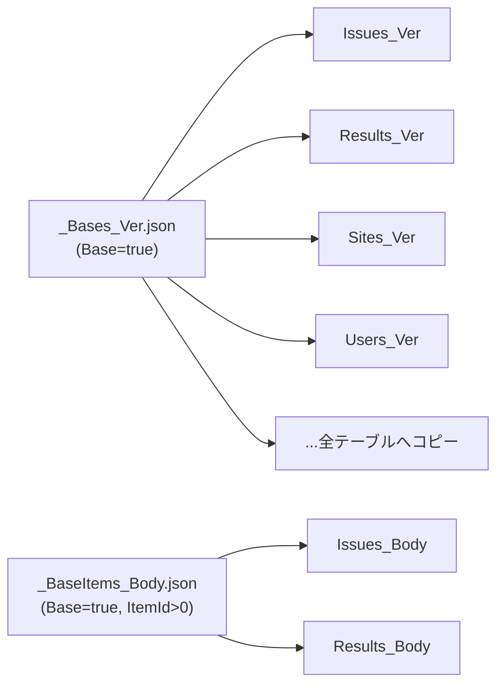

# プリザンター CodeDefiner データベース作成・更新ロジック調査

CodeDefiner がデータベースを作成・更新する処理フローと、RDBMS 毎の差違吸収メカニズムについて調査した。

<!-- START doctoc generated TOC please keep comment here to allow auto update -->
<!-- DON'T EDIT THIS SECTION, INSTEAD RE-RUN doctoc TO UPDATE -->

- [調査情報](#調査情報)
- [調査目的](#調査目的)
- [CodeDefiner の概要](#codedefiner-の概要)
    - [起動と主要コマンド](#起動と主要コマンド)
    - [主要オプション](#主要オプション)
- [データベース構成処理の全体フロー](#データベース構成処理の全体フロー)
    - [フェーズ別の詳細](#フェーズ別の詳細)
- [RDBMS差違吸収のアーキテクチャ](#rdbms差違吸収のアーキテクチャ)
    - [層1: Abstract Factory パターン（`ISqlObjectFactory`）](#層1-abstract-factory-パターンisqlobjectfactory)
    - [層2: SQL定義ファイル（RDBMS毎のSQLテンプレート）](#層2-sql定義ファイルrdbms毎のsqlテンプレート)
    - [層3: コード内の分岐処理](#層3-コード内の分岐処理)
    - [データ型の変換](#データ型の変換)
    - [RDBMS固有の設定値（ISqlDefinitionSetting）](#rdbms固有の設定値isqldefinitionsetting)
    - [SQL方言の差異（ISqls）](#sql方言の差異isqls)
- [接続方式と権限レベル](#接続方式と権限レベル)
- [マイグレーションチェックモード](#マイグレーションチェックモード)
- [結論](#結論)
- [関連ソースコード](#関連ソースコード)

<!-- END doctoc generated TOC please keep comment here to allow auto update -->

---

## 調査情報

| 調査日        | リポジトリ | ブランチ           | タグ/バージョン | コミット    | 備考     |
| ------------- | ---------- | ------------------ | --------------- | ----------- | -------- |
| 2026年2月10日 | Pleasanter | Pleasanter_1.5.0.0 |                 | `34f162a43` | 初回調査 |

## 調査目的

CodeDefiner はプリザンターの初期セットアップおよびバージョンアップ時にデータベーススキーマを管理するツールである。
データベースの新規作成・テーブルのマイグレーション・インデックス管理・権限設定などがどのようなロジックで実行されるのか、
また SQL Server / PostgreSQL / MySQL の3種類の RDBMS を
1つのコードベースでどのように差違吸収しているのかを明らかにする。

---

## CodeDefiner の概要

### 起動と主要コマンド

CodeDefiner はコマンドラインツール（`Implem.CodeDefiner`）として動作する。`Starter.Main()` がエントリーポイントであり、第一引数でアクションを指定する。

**ファイル**: `Implem.CodeDefiner/Starter.cs`

| アクション    | 説明                                                  |
| ------------- | ----------------------------------------------------- |
| `rds`         | DB構成 + DefinitionAccessorコード生成 + MVCコード生成 |
| `_rds`        | DB構成のみ（コード生成なし）                          |
| `_def`        | DefinitionAccessorコード生成のみ                      |
| `def`         | DefinitionAccessorコード生成 + MVCコード生成          |
| `mvc`         | MVCコード生成のみ                                     |
| `backup`      | ソリューションバックアップ                            |
| `migrate`     | 他DBMSからの移行（SQL Server → PostgreSQL/MySQLなど） |
| `trial`       | トライアルライセンス用DB構成                          |
| `ConvertTime` | 日時データの変換                                      |
| `merge`       | パラメータファイルのマージ（バージョンアップ時）      |

### 主要オプション

| オプション | 説明                                           |
| ---------- | ---------------------------------------------- |
| `/p`       | パラメータファイルのパス指定                   |
| `/f`       | カラム削減チェックを強制スキップ               |
| `/y`       | ユーザー入力確認をスキップ                     |
| `/c`       | マイグレーションチェックモード（変更確認のみ） |
| `/l`       | 言語設定                                       |
| `/z`       | タイムゾーン設定                               |
| `/s`       | SA パスワード設定                              |
| `/r`       | ランダムパスワード設定                         |

---

## データベース構成処理の全体フロー

`rds` または `_rds` コマンド実行時に、以下の順序でデータベース構成が行われる。



### フェーズ別の詳細

各Configuratorクラスは `Implem.CodeDefiner/Functions/Rds/` に配置されている。

#### フェーズ1: プロセス停止（KillTask）

**クラス**: `UsersConfigurator.KillTask()`

データベースに接続中のプロセスを切断し、スキーマ変更の競合を防止する。

#### フェーズ2: データベース作成/更新（RdsConfigurator）

**クラス**: `RdsConfigurator`（`Functions/Rds/RdsConfigurator.cs`）



- **Exists()**: `Def.Sql.ExistsDatabase` を実行し、データベースの存在を確認する。同時にスキーマの存在もチェックし、`SchemaName` と `IsCreatingDb` フラグを設定する。
- **CreateDatabase()**: SA権限（`SqlIoBySa`）でデータベース作成 → ユーザー作成 → PostgreSQL固有のDB設定を実行する。
- **UpdateDatabase()**: 既存DBに対して、ユーザー情報の更新とオーナー変更を実行する。

#### フェーズ3: ユーザー作成/更新（UsersConfigurator）

**クラス**: `UsersConfigurator`（`Functions/Rds/UsersConfigurator.cs`）

Owner ユーザーと一般ユーザーの2つのロールを作成・更新する。



- ユーザー名の末尾が `_Owner` かどうかで、管理者用（`CreateLoginAdmin`）と一般用（`CreateLoginUser`）を使い分ける。
- MySQL の場合は `MySqlConnectingHost` によるホスト指定にも対応する。

#### フェーズ4: スキーマ設定（SchemaConfigurator）

**クラス**: `SchemaConfigurator`（`Functions/Rds/SchemaConfigurator.cs`）

- **新規作成時**（`IsCreatingDb == true`）: `CreateSchema` SQL を実行。PostgreSQL ではスキーマ作成、`pg_trgm` / `pgcrypto` 拡張のインストールが行われる。
- **更新時**: `GrantDatabaseForPostgres` SQL を実行。既存スキーマに対する権限付与のみ。

#### フェーズ5: カラム削減チェック（CheckColumnsShrinkage）

Issues テーブルと Results テーブルに対し、定義ファイルのカラム一覧と現在DBのカラム一覧を比較する。カラムが減少している場合は、データ損失の危険があるため処理を停止する（`/f` オプションで強制スキップ可能）。

#### フェーズ6: テーブル構成（TablesConfigurator）

**クラス**: `TablesConfigurator`（`Functions/Rds/TablesConfigurator.cs`）

全テーブルに対して以下を実行する。



##### テーブル作成（CreateTable）

**ファイル**: `Functions/Rds/Parts/Tables.cs`

`SqlStatement` を構築し、以下のプレースホルダを順番に置換する:

1. **`#Columns#`**: カラム定義（型、サイズ、NULL制約、IDENTITY）
2. **`#Pks#`**: 主キー制約
3. **`#Defaults#`**（SQLServer/PostgreSQL）/ **`#ModifyColumn#`**（MySQL）: デフォルト値制約
4. **`#DropConstraint#`**: インデックスの再作成
5. **`#TableName#`**: テーブル名

##### テーブルマイグレーション（MigrateTable）

テーブル構造に変更がある場合のマイグレーション手順:



**変更検知のロジック**（`Tables.HasChanges`）:

| チェック項目       | 検知方法                                                       |
| ------------------ | -------------------------------------------------------------- |
| カラム数の変化     | 定義カラム数 vs 現行カラム数                                   |
| カラム名の変化     | `ColumnName` の一致確認                                        |
| データ型の変化     | `TypeName`（`ConvertBack` で正規化して比較）                   |
| カラムサイズの変化 | `ColumnSize.HasChanges`（RDBMS毎に専用ロジック）               |
| NULL制約の変化     | `is_nullable` の一致確認                                       |
| IDENTITY属性の変化 | `is_identity` の一致確認（`_history`/`_deleted` テーブル除外） |
| デフォルト値の変化 | `Constraints.HasChanges`                                       |
| インデックスの変化 | `Indexes.HasChanges`                                           |

##### フルテキストインデックス

テーブル構成完了後、RDBMS毎に異なるフルテキストインデックスを設定する:

| RDBMS      | 方式                                            | 対象テーブル    |
| ---------- | ----------------------------------------------- | --------------- |
| SQLServer  | `FULLTEXT CATALOG` + `FULLTEXT INDEX`（日本語） | Items, Binaries |
| PostgreSQL | `GIN` インデックス（`pg_trgm` 拡張）            | Items           |
| MySQL      | `FULLTEXT INDEX`（`ngram` パーサー）            | Items           |

#### フェーズ7: 権限設定（PrivilegeConfigurator）

**クラス**: `PrivilegeConfigurator`（`Functions/Rds/PrivilegeConfigurator.cs`）

Owner ユーザーと一般ユーザーに対して、RDBMS毎の権限付与を実行する。

| ユーザー種別 | SQLServer              | PostgreSQL                    | MySQL                               |
| ------------ | ---------------------- | ----------------------------- | ----------------------------------- |
| Owner        | `db_owner` ロール付与  | `ALTER ROLE` のみ             | CREATE, ALTER, INDEX, DROP等のGRANT |
| User         | `db_datareader/writer` | テーブル単位のSELECT/INSERT等 | SELECT, INSERT, UPDATE, DELETE等    |

---

## RDBMS差違吸収のアーキテクチャ

プリザンターは3つの RDBMS（SQL Server, PostgreSQL, MySQL）をサポートしており、以下の3層構造で差違を吸収している。

### 層1: Abstract Factory パターン（`ISqlObjectFactory`）

**ファイル**: `Rds/Implem.IRds/ISqlObjectFactory.cs`, `Implem.Factory/RdsFactory.cs`



`RdsFactory.Create()` が `Parameters.Rds.Dbms` の値（`"SQLServer"`, `"PostgreSQL"`, `"MySQL"`）に応じて適切なファクトリを生成する。

### 層2: SQL定義ファイル（RDBMS毎のSQLテンプレート）

**ディレクトリ**: `Implem.Pleasanter/App_Data/Definitions/Sqls/{SQLServer|PostgreSQL|MySQL}/`

各ディレクトリに同名の `.sql` ファイルが55個配置されており、RDBMS固有のSQL構文が記述されている。`Def.Sql.*` フィールドに読み込まれ、`#プレースホルダ#` を `String.Replace()` で実行時に置換する方式をとる。

#### 代表的なSQL定義の差異

| SQL定義                    | SQLServer                                          | PostgreSQL                                               | MySQL                                            |
| -------------------------- | -------------------------------------------------- | -------------------------------------------------------- | ------------------------------------------------ |
| `CreateDatabase`           | `CREATE DATABASE ... COLLATE japanese_90_ci_as_ks` | `SELECT 1`（ダミー）→ `CreateDatabaseForPostgres` で実行 | `CREATE DATABASE ... COLLATE utf8mb4_general_ci` |
| `CreateTable`              | `"dbo"."#TableName#"` スキーマ付き                 | `"#TableName#"` スキーマなし                             | `"#TableName#"` スキーマなし                     |
| `ExistsDatabase`           | `sys.databases`                                    | `pg_database`                                            | `SHOW DATABASES`                                 |
| `ExistsTable`              | `dbo.sysobjects`                                   | `information_schema.tables`（スキーマ指定あり）          | `information_schema.tables`                      |
| `MigrateTableWithIdentity` | `SET IDENTITY_INSERT ON/OFF`                       | `setval(pg_get_serial_sequence(...))`                    | 追加処理なし                                     |
| `CreateFullText`           | `FULLTEXT CATALOG` + `FULLTEXT INDEX`              | `GIN` + `pg_trgm`                                        | `FULLTEXT INDEX` + `ngram`                       |
| `ExistsUser`               | `sysusers`                                         | `pg_user`                                                | `mysql.user`（ホスト指定あり）                   |
| `CreateLoginAdmin`         | `CREATE LOGIN` + `db_owner`                        | 空（`CreateUserForPostgres` で一括処理）                 | `CREATE USER` + `GRANT`                          |

### 層3: コード内の分岐処理

SQL定義ファイルだけではカバーできない差異は、C# コード内で `Parameters.Rds.Dbms` に基づく `switch` 文で分岐する。

#### カラム作成（Columns.CreateColumn）

**ファイル**: `Functions/Rds/Parts/Columns.cs`

```csharp
switch (Parameters.Rds.Dbms)
{
    case "SQLServer":
        // Columns.Sql_Create()
        break;
    case "PostgreSQL":
        // PostgreSqlColumns.Sql_Create()
        break;
    case "MySQL":
        // MySqlColumns.Sql_Create()
        break;
}
```

#### インデックス構成（Indexes.IndexInfoCollection）

**ファイル**: `Functions/Rds/Parts/Indexes.cs`

SQLServer / PostgreSQL は共通ロジックを使用し、MySQL のみ `MySqlIndexes` クラスで別処理を行う。

#### デフォルト値制約（Constraints.CreateDefault）

**ファイル**: `Functions/Rds/Parts/Constraints.cs`

SQLServer / PostgreSQL は `CREATE DEFAULT` 方式、MySQL は `MODIFY COLUMN` 方式で処理する。

#### カラムサイズ比較

SQLServer / PostgreSQL は `ColumnSize.HasChanges()`、MySQL は `MySqlColumnSize.HasChanges()` を使用する。

### データ型の変換

**インターフェース**: `ISqlDataType`

CodeDefiner の定義ファイルは SQL Server 形式のデータ型名で統一されており、
PostgreSQL / MySQL では `ISqlDataType.Convert()` でテーブル作成時に変換し、
`ConvertBack()` で現行DB情報との比較時に逆変換する。

| 定義上の型名（SQLServer基準） | PostgreSQL 変換先 | MySQL 変換先  |
| ----------------------------- | ----------------- | ------------- |
| `nchar`                       | `char`            | `char`        |
| `nvarchar(max)`               | `text`            | `longtext`    |
| `nvarchar`                    | `varchar`         | `varchar`     |
| `bit`                         | `boolean`         | `tinyint(1)`  |
| `varbinary`                   | `bytea`           | `blob`        |
| `image`                       | `bytea`           | `longblob`    |
| `datetime`                    | `timestamp(3)`    | `datetime(3)` |

### RDBMS固有の設定値（ISqlDefinitionSetting）

| 設定項目                                 | SQLServer     | PostgreSQL | MySQL     |
| ---------------------------------------- | ------------- | ---------- | --------- |
| `IdentifierPostfixLength`                | 64            | 32         | 32        |
| `NationalCharacterStoredSizeCoefficient` | 2             | 4          | 4         |
| `ReducedVarcharLength`                   | 0             | 0          | 760       |
| `SchemaName`（可変）                     | 空（dbo固定） | 動的設定   | 空        |
| `IsCreatingDb`（可変）                   | false固定     | 動的設定   | false固定 |

### SQL方言の差異（ISqls）

| 項目         | SQLServer        | PostgreSQL                         | MySQL                  |
| ------------ | ---------------- | ---------------------------------- | ---------------------- |
| Boolean真    | `1`              | `true`                             | `1`                    |
| Boolean偽    | `0`              | `false`                            | `0`                    |
| 現在日時     | `getdate()`      | `CURRENT_TIMESTAMP`                | `CURRENT_TIMESTAMP(3)` |
| LIKE演算子   | `like`           | `ilike`（大小無視）                | `like`                 |
| NULL置換関数 | `isnull`         | `coalesce`                         | `ifnull`               |
| IDENTITY生成 | `identity(n, 1)` | `generated by default as identity` | なし（AUTO_INCREMENT） |

---

## 接続方式と権限レベル

CodeDefiner は2種類の接続を使い分ける。

| 接続方式           | メソッド             | 接続文字列                             | 用途                           |
| ------------------ | -------------------- | -------------------------------------- | ------------------------------ |
| SA接続             | `Def.SqlIoBySa()`    | `Parameters.Rds.SaConnectionString`    | DB作成、ユーザー作成、権限設定 |
| Admin（Owner）接続 | `Def.SqlIoByAdmin()` | `Parameters.Rds.OwnerConnectionString` | テーブル操作、マイグレーション |

`RdsProvider == "Local"` の場合のみ、DB作成・ユーザー管理・スキーマ設定・権限設定が実行される。Azure Database 等のマネージドサービス（`RdsProvider != "Local"`）では、これらのフェーズはスキップされ、テーブル構成のみが実行される。

---

## マイグレーションチェックモード

`_rds /c` コマンドで実行されるマイグレーションチェックモードでは、
実際のDB変更を行わず、以下の確認のみを行う:

1. データベースの存在確認
2. テーブル構成の変更有無の確認
   （`TablesConfigurator.Configure(checkMigration: true)`）
3. `checkMigration == true` の場合、
   `CreateTable` / `MigrateTable` は実際のSQL実行をスキップする

---

## テーブル定義ファイル（Definition_Column）

### 格納場所

テーブル・カラムの定義は以下のディレクトリに JSON ファイルとして格納されている。

```text
Implem.Pleasanter/App_Data/Definitions/Definition_Column/
├── __ColumnSettings.json        ← カラムスキーマ定義（全プロパティ名と型の一覧）
├── _Bases_Ver.json              ← 共通ベースカラム（全テーブルに継承）
├── _Bases_CreatedTime.json
├── _BaseItems_Body.json         ← アイテム系テーブル共通カラム
├── _BaseItems_Title.json
├── Items_ReferenceId.json       ← テーブル固有カラム
├── Issues_IssueId.json
├── Sites_SiteId.json
├── Users_UserId.json
├── QRTZ_JOB_DETAILS_JOB_NAME.json  ← Quartzテーブル定義
└── ...（計427ファイル + __ColumnSettings.json）
```

### ファイル命名規則

```text
{テーブル名}_{カラム名}.json
```

1カラムにつき1つの JSON ファイルが存在する。
ファイル名がそのまま `{TableName}_{ColumnName}` となる。

### テーブル一覧と定義ファイル数

| テーブル名              | カラム定義数 | 説明                           |
| ----------------------- | -----------: | ------------------------------ |
| `_Bases`                |            8 | 全テーブル共通ベースカラム     |
| `_BaseItems`            |            5 | アイテム系テーブル共通カラム   |
| `Users`                 |           62 | ユーザー管理                   |
| `SysLogs`               |           48 | システムログ                   |
| `Sites`                 |           32 | サイト管理                     |
| `Tenants`               |           21 | テナント管理                   |
| `Binaries`              |           15 | バイナリデータ                 |
| `OutgoingMails`         |           15 | 送信メール                     |
| `Registrations`         |           15 | ユーザー登録                   |
| `Groups`                |           14 | グループ管理                   |
| `Issues`                |           11 | 期限付きテーブル               |
| `Items`                 |            8 | アイテム管理                   |
| `Results`               |            7 | 結果テーブル                   |
| `QRTZ_*`（複数テーブル）|           80 | Quartz.NET スケジューラ用      |
| その他                  |           86 | セッション、権限、リンク等     |

### JSON ファイルの構造

各 JSON ファイルは、`__ColumnSettings.json` で定義されたスキーマに従う
フラットなキーバリュー形式である。

**スキーマ定義ファイル**: `__ColumnSettings.json`（139項目）

```json
{
    "Id": "string",
    "ModelName": "string",
    "TableName": "string",
    "ColumnName": "string",
    "TypeName": "string",
    "MaxLength": "int",
    "Pk": "int",
    "Nullable": "bool",
    "Identity": "bool",
    "Default": "string",
    ...
}
```

**カラム定義ファイルの例**（`Issues_IssueId.json`）:

```json
{
    "Id": "Issues_IssueId",
    "ModelName": "Issue",
    "TableName": "Issues",
    "Label": "期限付きテーブル",
    "ColumnName": "IssueId",
    "LabelText": "ID",
    "No": "4",
    "TypeName": "bigint",
    "Pk": "10",
    "PkHistory": "2",
    "Ix1": "1",
    "Unique": "1",
    "Identity": "0",
    "ItemId": "20",
    ...
}
```

#### DB構成に関わる主要プロパティ

| プロパティ     | 型       | 説明                                            |
| -------------- | -------- | ----------------------------------------------- |
| `TableName`    | `string` | 作成先テーブル名                                |
| `ColumnName`   | `string` | カラム名                                        |
| `TypeName`     | `string` | データ型（SQL Server 基準名）                   |
| `MaxLength`    | `int`    | 最大長（`-1` = max / text）                     |
| `Size`         | `string` | decimal等のサイズ指定（例: `18,4`）             |
| `Pk`           | `int`    | 主キー順序（>0 で PK構成列）                    |
| `PkOrderBy`    | `string` | PK のソート順（`asc`/`desc`）                   |
| `PkHistory`    | `int`    | 履歴テーブル用PK順序                            |
| `Ix1`〜`Ix5`  | `int`    | インデックス1〜5の構成列順序                    |
| `Nullable`     | `bool`   | NULL許可                                        |
| `Identity`     | `bool`   | IDENTITY（自動採番）属性                        |
| `Seed`         | `int`    | IDENTITYの初期値                                |
| `Unique`       | `bool`   | ユニーク制約                                    |
| `Default`      | `string` | デフォルト値                                    |
| `NotUpdate`    | `bool`   | テーブル構成対象外フラグ                        |
| `History`      | `int`    | 履歴テーブル構成列順序（>0 で対象）             |
| `OldColumnName`| `string` | マイグレーション用の旧カラム名                  |

### 読み込みの仕組み



#### (i) スキーマ読み込み

`__ColumnSettings.json` を最初に読み込み、
全プロパティ名のリストを `XlsSheet.Columns` として保持する。
これが以降の各 JSON ファイル読み込み時の「列名一覧」となる。

#### (ii) 個別ファイル読み込み

`Definition_Column/` 内の全 `.json` ファイル
（`__ColumnSettings.json` 以外）を走査し、
各ファイルを `Dictionary<string, string>` にデシリアライズして
`XlsRow` として `XlsSheet` に追加する。

**ファイル**: `Implem.Libraries/Classes/XlsIo.cs`（`ReadDefinitionFiles` メソッド）

#### (iii) _Base カラムの継承展開

`SetColumnDefinitionAdditional()` により、
`_Base` / `_BaseItem` の共通カラム定義が各テーブルにコピーされる。



- `Base == true` のカラム定義が、`Base == false` の全テーブルに対してコピーされる
- コピー時に `ModelName`, `TableName`, `Label` を対象テーブルの値に書き換える
- `ItemId > 0` の `_BaseItem` カラムは、
  `ItemId > 0` のテーブル（Issues, Results 等）にのみ展開される
- 既に同名カラムが存在する場合はコピーをスキップする

#### (iv) ColumnDefinition への変換

`Def.SetColumnDefinition()` で `XlsSheet` の各行を
`ColumnDefinition` オブジェクトに変換し、
`Def.ColumnDefinitionCollection` に格納する。
CodeDefiner の `TablesConfigurator` はこのコレクションを参照して
テーブルの作成・更新を行う。

---

## 結論

| 項目             | 内容                                                                                                  |
| ---------------- | ----------------------------------------------------------------------------------------------------- |
| 処理フロー       | KillTask → DB作成/更新 → ユーザー設定 → スキーマ設定 → カラム削減チェック → テーブル構成 → 権限設定   |
| テーブル更新方式 | 新テーブル作成 → データ移行 → リネーム方式（データロスを最小化）                                      |
| 変更検知         | カラム数・カラム名・データ型・サイズ・NULL制約・IDENTITY・デフォルト値・インデックスの8項目で差分検知 |
| RDBMS差異吸収層1 | Abstract Factory パターン（`ISqlObjectFactory` と各RDBMS実装クラス）                                  |
| RDBMS差異吸収層2 | SQL定義ファイル（`App_Data/Definitions/Sqls/{RDBMS}/` に55個ずつ同名ファイルを配置）                  |
| RDBMS差異吸収層3 | C# コード内 `switch` 分岐（カラム作成・インデックス・制約設定など）                                   |
| データ型統一     | 定義ファイルは SQL Server 型名で統一、`ISqlDataType.Convert/ConvertBack` で実行時に変換               |
| 接続権限         | SA接続（サーバーレベル操作）と Admin接続（DB内操作）の2段階                                           |
| マネージド対応   | `RdsProvider` フラグで、DB/ユーザー/スキーマ/権限の管理をスキップ可能                                 |

---

## 関連ソースコード

| ファイル                                                    | 役割                                             |
| ----------------------------------------------------------- | ------------------------------------------------ |
| `Implem.CodeDefiner/Starter.cs`                             | エントリーポイント、コマンドディスパッチ         |
| `Implem.CodeDefiner/Functions/Rds/Configurator.cs`          | DB構成のオーケストレーション                     |
| `Implem.CodeDefiner/Functions/Rds/RdsConfigurator.cs`       | データベース作成・更新                           |
| `Implem.CodeDefiner/Functions/Rds/UsersConfigurator.cs`     | ユーザー作成・更新                               |
| `Implem.CodeDefiner/Functions/Rds/SchemaConfigurator.cs`    | スキーマ設定                                     |
| `Implem.CodeDefiner/Functions/Rds/TablesConfigurator.cs`    | テーブル構成（作成・マイグレーション）           |
| `Implem.CodeDefiner/Functions/Rds/PrivilegeConfigurator.cs` | 権限設定                                         |
| `Implem.CodeDefiner/Functions/Rds/Parts/Tables.cs`          | テーブル操作（作成・マイグレーション・存在確認） |
| `Implem.CodeDefiner/Functions/Rds/Parts/Columns.cs`         | カラム定義生成・変更検知                         |
| `Implem.CodeDefiner/Functions/Rds/Parts/Indexes.cs`         | インデックス定義・変更検知                       |
| `Implem.CodeDefiner/Functions/Rds/Parts/Constraints.cs`     | デフォルト値制約                                 |
| `Implem.Factory/RdsFactory.cs`                              | Abstract Factoryの生成                           |
| `Rds/Implem.IRds/ISqlObjectFactory.cs`                      | 抽象ファクトリインターフェース                   |
| `Rds/Implem.IRds/ISqls.cs`                                  | SQL方言インターフェース                          |
| `Rds/Implem.IRds/ISqlDataTypes.cs`                          | データ型変換インターフェース                     |
| `Rds/Implem.IRds/ISqlDefinitionSetting.cs`                  | RDBMS固有設定インターフェース                    |
| `Rds/Implem.SqlServer/SqlServerObjectFactory.cs`            | SQL Server ファクトリ実装                        |
| `Rds/Implem.PostgreSql/PostgreSqlObjectFactory.cs`          | PostgreSQL ファクトリ実装                        |
| `Rds/Implem.MySql/MySqlObjectFactory.cs`                    | MySQL ファクトリ実装                             |
| `App_Data/Definitions/Sqls/SQLServer/*.sql`                 | SQL Server 用SQLテンプレート（55個）             |
| `App_Data/Definitions/Sqls/PostgreSQL/*.sql`                | PostgreSQL 用SQLテンプレート（55個）             |
| `App_Data/Definitions/Sqls/MySQL/*.sql`                     | MySQL 用SQLテンプレート（55個）                  |
