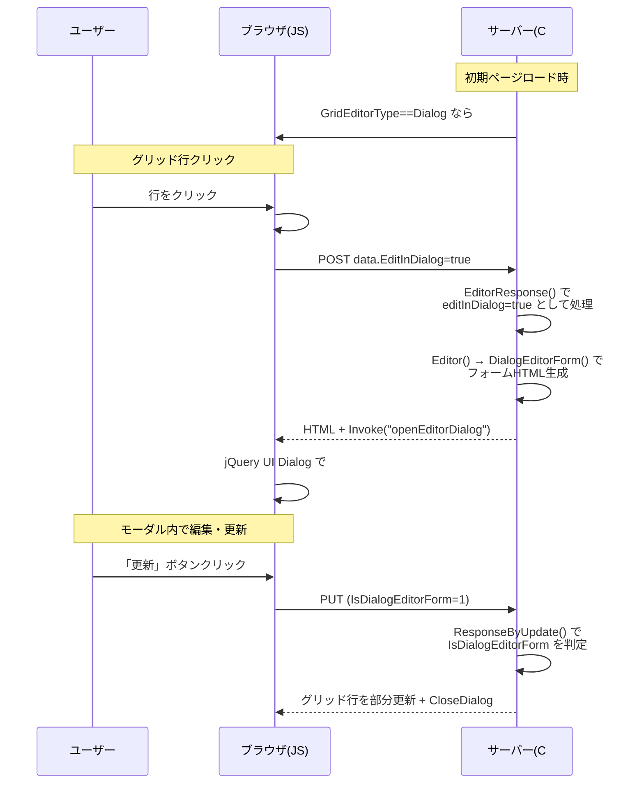
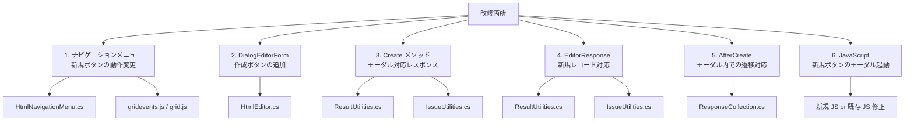

# プリザンター 編集モーダル（モーダルで開く）新規作成対応 調査

一覧画面の「モーダルで開く」機能の現状仕様と、新規作成画面への適用に必要な改修点を調査する。

<!-- START doctoc generated TOC please keep comment here to allow auto update -->
<!-- DON'T EDIT THIS SECTION, INSTEAD RE-RUN doctoc TO UPDATE -->

- [調査情報](#調査情報)
- [調査目的](#調査目的)
- [現状の仕様](#現状の仕様)
    - [設定の仕組み](#設定の仕組み)
    - [既存レコード編集のモーダルフロー](#既存レコード編集のモーダルフロー)
    - [主要コンポーネントの関係](#主要コンポーネントの関係)
    - [HTML 要素 ID の関係](#html-要素-id-の関係)
- [新規作成の現状フロー](#新規作成の現状フロー)
    - [ナビゲーションメニューの「新規」ボタン](#ナビゲーションメニューの新規ボタン)
    - [新規作成後のアクション](#新規作成後のアクション)
    - [`DialogEditorForm` のボタン](#dialogeditorform-のボタン)
- [改修点の分析](#改修点の分析)
    - [改修箇所一覧](#改修箇所一覧)
    - [改修1: ナビゲーションメニュー「新規」ボタンの動作変更](#改修1-ナビゲーションメニュー新規ボタンの動作変更)
    - [改修2: `DialogEditorForm` への「作成」ボタン追加](#改修2-dialogeditorform-への作成ボタン追加)
    - [改修3: `Create` メソッドのモーダル対応レスポンス](#改修3-create-メソッドのモーダル対応レスポンス)
    - [改修4: `EditorResponse` の新規レコード対応](#改修4-editorresponse-の新規レコード対応)
    - [改修5: `AfterCreate` のモーダル内遷移対応](#改修5-aftercreate-のモーダル内遷移対応)
    - [改修6: JavaScript 側の新規ボタン対応](#改修6-javascript-側の新規ボタン対応)
- [影響を受ける他の機能](#影響を受ける他の機能)
    - [ダイアログ内で特別対応が必要な機能](#ダイアログ内で特別対応が必要な機能)
    - [既存の「一覧上で直接編集」（GridEditorType = Grid）との関係](#既存の一覧上で直接編集grideditortype--gridとの関係)
- [改修ファイルまとめ](#改修ファイルまとめ)
    - [サーバーサイド（C#）](#サーバーサイドc)
    - [フロントエンド（JavaScript/TypeScript）](#フロントエンドjavascripttypescript)
- [結論](#結論)
    - [実装優先度](#実装優先度)

<!-- END doctoc generated TOC please keep comment here to allow auto update -->

---

## 調査情報

| 調査日        | リポジトリ | ブランチ | タグ/バージョン | コミット     | 備考     |
| ------------- | ---------- | -------- | --------------- | ------------ | -------- |
| 2026年2月12日 | Pleasanter | main     |                 | `34f162a439` | 初回調査 |

## 調査目的

プリザンターの一覧画面には「モーダルで開く」（`GridEditorType = Dialog`）機能が既に存在するが、この機能は **既存レコードの編集にのみ適用** され、一覧画面からの **新規作成にはモーダルが使われない**。

新規作成時にもモーダルで開くようにしたい場合、現状の仕様を整理した上で、具体的にどのファイルのどの箇所を改修すべきかを調査する。

---

## 現状の仕様

### 設定の仕組み

テーブル管理画面（エディタ設定 > 一覧タブ）で「一覧の編集方式」を設定できる。

**ファイル**: `Implem.Pleasanter/Libraries/Settings/SiteSettings.cs`

```csharp
public enum GridEditorTypes : int
{
    None = 0,    // デフォルト（別画面遷移）
    Grid = 10,   // 一覧上で直接編集
    Dialog = 20  // モーダルで開く
}

public GridEditorTypes? GridEditorType;
```

`Dialog (20)` を選択すると「モーダルで開く」が有効になる。

### 既存レコード編集のモーダルフロー



### 主要コンポーネントの関係

| コンポーネント          | ファイル                                   | 役割                                                                                    |
| ----------------------- | ------------------------------------------ | --------------------------------------------------------------------------------------- |
| `EditorDialog` div 生成 | `HtmlEditor.cs`                            | `EditorDialog()` - 一覧ページに `#EditorDialog` コンテナを配置                          |
| ダイアログ内フォーム    | `HtmlEditor.cs`                            | `DialogEditorForm()` - `#DialogEditorForm` でラップ。**更新ボタンのみ**、作成ボタンなし |
| 行クリックハンドラ      | `gridevents.js`                            | `#EditorDialog` の存在で分岐し、Ajax POST を送信                                        |
| モーダル表示            | `grid.js`                                  | `$p.openEditorDialog()` - jQuery UI Dialog で表示                                       |
| サーバー応答生成        | `ResultUtilities.cs` / `IssueUtilities.cs` | `EditorResponse()` - `editInDialog` フラグでレスポンス形式を切替                        |
| 更新時の処理            | `ResultUtilities.cs` / `IssueUtilities.cs` | `ResponseByUpdate()` - `IsDialogEditorForm` でグリッド行部分更新                        |

### HTML 要素 ID の関係

| HTML ID                   | 役割                                            |
| ------------------------- | ----------------------------------------------- |
| `#EditorDialog`           | モーダルのコンテナ div（jQuery UI Dialog 対象） |
| `#EditInDialogBody`       | エディタ HTML が注入される内側の div            |
| `#DialogEditorForm`       | モーダル内のフォーム（`#MainForm` の代替）      |
| `#IsDialogEditorForm`     | hidden フィールド、更新時にモーダル経由かを判定 |
| `#EditorInDialogRecordId` | hidden フィールド、編集中のレコード ID          |
| `#EditorLoading`          | hidden フィールド、エディタ読み込み状態管理     |

---

## 新規作成の現状フロー

### ナビゲーションメニューの「新規」ボタン

一覧画面のナビゲーションメニューにある「新規」ボタンは、**常にページ遷移（`/Items/{SiteId}/New`）** で新規作成画面を開く。

**ファイル**: `Implem.Pleasanter/Libraries/HtmlParts/HtmlNavigationMenu.cs`（行番号: 911-922）

```csharp
private static string NewHref(Context context, SiteSettings ss)
{
    switch (context.Controller)
    {
        case "items":
            return SiteIndex(context: context, ss: ss)
                ? null
                : $"Items/{ss.SiteId}/New";
        default:
            return $"{context.Controller}/New";
    }
}
```

この `NewHref` はナビゲーションメニューの `<a>` タグの `href` 属性に直接セットされる。`GridEditorType` の値を**一切参照していない**。

### 新規作成後のアクション

作成成功後の遷移先は `AfterCreateActionType` で制御される。

**ファイル**: `Implem.Pleasanter/Libraries/Models/Versions.cs`

```csharp
public enum AfterCreateActionTypes : int
{
    Default = 0,      // 作成したレコードの編集画面へ
    ReturnToList = 1, // 一覧に戻る
    OpenNewEditor = 2 // 新規作成画面を再表示
}
```

**ファイル**: `Implem.Pleasanter/Libraries/Responses/ResponseCollection.cs`（行番号: 164-180）

```csharp
if (ss.AfterCreateActionType == Versions.AfterCreateActionTypes.ReturnToList)
{
    href = Locations.ItemIndex(context: Context, id: ss.SiteId);
}
else if (ss.AfterCreateActionType == Versions.AfterCreateActionTypes.OpenNewEditor)
{
    href = Locations.ItemNew(context: Context, id: ss.SiteId);
}
```

いずれも**ページ遷移（Href）** ベースであり、モーダル内でのハンドリングは考慮されていない。

### `DialogEditorForm` のボタン

**ファイル**: `Implem.Pleasanter/Libraries/HtmlParts/HtmlEditor.cs`（行番号: 24-73）

`DialogEditorForm()` は以下のボタンのみを生成する：

- **「更新」ボタン**（action: `Update`, method: `put`）
- **「キャンセル」ボタン**

**「作成」ボタン（action: `Create`, method: `post`）は存在しない**。これがモーダルで新規作成できない直接的な原因の1つ。

---

## 改修点の分析

### 改修箇所一覧



### 改修1: ナビゲーションメニュー「新規」ボタンの動作変更

**対象ファイル**: `Implem.Pleasanter/Libraries/HtmlParts/HtmlNavigationMenu.cs`

**現状**: `<a href="Items/{SiteId}/New">` によるページ遷移。

**改修内容**:

- `GridEditorType == Dialog` の場合、`href` を `#` に変更し `onclick` で Ajax リクエストを発行
- サーバーに対し `EditInDialog=true` + `ResultId=0`（新規）のリクエストを送信
- または、`NewHref()` の代わりにクリックイベントベースの制御をJSで実装

**考慮事項**:

- ナビゲーションメニューの HTML 構造はテンプレート化されており、`NewMenuContainer` の特別処理が既にある
- Sites テーブル（フォルダ）の場合はテンプレート選択ダイアログが開くため、その分岐を維持する必要がある

### 改修2: `DialogEditorForm` への「作成」ボタン追加

**対象ファイル**: `Implem.Pleasanter/Libraries/HtmlParts/HtmlEditor.cs`

**現状**: `DialogEditorForm()` は「更新」と「キャンセル」ボタンのみ。

**改修内容**:

```csharp
// 改修案: MethodType に応じてボタンを出し分け
.Button(
    text: Displays.Create(context: context),
    controlCss: "button-icon validate button-positive",
    accessKey: "s",
    onClick: "$p.send($(this));",
    icon: "ui-icon-disk",
    action: "Create",
    method: "post",
    _using: methodType == BaseModel.MethodTypes.New)  // 新規の場合
.Button(
    text: Displays.Update(context: context),
    controlCss: "button-icon validate button-positive",
    accessKey: "s",
    onClick: "$p.send($(this));",
    icon: "ui-icon-copy",
    action: "Update",
    method: "put",
    _using: methodType == BaseModel.MethodTypes.Edit && !isHistory) // 編集の場合
```

**考慮事項**:

- `DialogEditorForm()` のシグネチャに `methodType` パラメータを追加する必要がある
- 呼び出し元（`ResultUtilities.cs`、`IssueUtilities.cs`、`WikiUtilities.cs`）すべてを修正

### 改修3: `Create` メソッドのモーダル対応レスポンス

**対象ファイル**:

- `Implem.Pleasanter/Models/Results/ResultUtilities.cs`（行番号: 3211）
- `Implem.Pleasanter/Models/Issues/IssueUtilities.cs`（対応箇所）

**現状**: `Create()` メソッドの成功時レスポンスは `AfterCreate()` でページ遷移（`Href`）を返す。

**改修内容**:

```csharp
// 改修案: IsDialogEditorForm の場合の分岐を追加
case Error.Types.None:
    if (context.Forms.Bool("IsDialogEditorForm"))
    {
        // モーダル内での作成成功時
        // 1. グリッドに新しい行を追加
        // 2. モーダルを閉じる
        // 3. 成功メッセージを表示
        return new ResponseCollection(context: context, id: resultModel.ResultId)
            .SetMemory("formChanged", false)
            // グリッド行を追加 or リロード
            .CloseDialog()
            .Message(message)
            .ToJson();
    }
    // 既存処理...
```

**考慮事項**:

- 作成後のグリッド更新方法: 行の追加（`Append`）か、グリッド全体の再読み込みか
- `AfterCreateActionType` との整合性:
    - `ReturnToList`（一覧に戻る）→ モーダルを閉じてグリッドを更新
    - `OpenNewEditor`（新規画面を再表示）→ モーダル内をクリアして再度新規フォームを表示
    - `Default`（編集画面へ）→ モーダル内を作成したレコードの編集画面に切り替え
- ページングやソートの状態を考慮すると、**グリッド全体の再読み込み**が安全

### 改修4: `EditorResponse` の新規レコード対応

**対象ファイル**:

- `Implem.Pleasanter/Models/Results/ResultUtilities.cs`（行番号: 2446-2500）
- `Implem.Pleasanter/Models/Issues/IssueUtilities.cs`（対応箇所）

**現状**: `EditorResponse()` は `editInDialog=true` の場合、`#EditInDialogBody` に HTML を注入して
`openEditorDialog` を呼び出す。この処理自体は `ResultId == 0`（新規）でも動作するように見える。

**改修内容**:

- `EditorResponse()` 自体は新規レコード（`ResultId == 0`）でも `editInDialog=true` が渡されれば正しく動作する可能性が高い
- ただし、`DialogEditorForm` の `Action` URL が正しく設定されるか確認が必要

**ファイル**: `Implem.Pleasanter/Libraries/HtmlParts/HtmlEditor.cs`（行番号: 29-33）

```csharp
.Action(Locations.ItemAction(
    context: context,
    id: referenceId != 0
        ? referenceId
        : siteId))  // 新規の場合は siteId を使用 → OK
```

`referenceId == 0` の場合は `siteId` が使われるため、Create のPOST先は `/api/items/{SiteId}` となり問題ない。

### 改修5: `AfterCreate` のモーダル内遷移対応

**対象ファイル**: `Implem.Pleasanter/Libraries/Responses/ResponseCollection.cs`（行番号: 148-181）

**現状**: `AfterCreate()` は常に `Href`（ページ遷移）を返す。

**改修内容**:

- `IsDialogEditorForm` の場合は `Href` の代わりにモーダル内での操作に変更
- `AfterCreateActionType` に応じた動作:

| AfterCreateActionType | モーダル内での動作案                                   |
| --------------------- | ------------------------------------------------------ |
| `Default`（編集画面） | 作成したレコードの編集フォームをモーダル内に再読み込み |
| `ReturnToList`        | モーダルを閉じてグリッドをリフレッシュ                 |
| `OpenNewEditor`       | モーダル内をクリアして新規フォームを再表示             |

### 改修6: JavaScript 側の新規ボタン対応

**対象ファイル**:

- `Implem.PleasanterFrontend/wwwroot/src/scripts/generals/grid.js`
- `Implem.PleasanterFrontend/wwwroot/src/scripts/generals/gridevents.js`
- または新規 JS ファイル

**改修内容**:

- ナビゲーションメニューの「新規」ボタンクリック時に `#EditorDialog` が存在する場合、ページ遷移を抑止して Ajax でエディタ HTML を取得
- `$p.openEditorDialog()` を呼び出してモーダル表示

```javascript
// 改修案
$(document).on('click', '#NewMenuContainer a', function (e) {
    if ($('#EditorDialog').length === 1) {
        e.preventDefault();
        let data = { EditInDialog: true };
        let url = $(this).attr('href');
        $p.ajax(url, 'post', data);
    }
});
```

**考慮事項**:

- `NewMenuContainer` の `<a>` タグの `href` が `/Items/{SiteId}/New` を保持する必要がある（モーダル非対応ブラウザのフォールバック）
- `$p.send()` と `$p.ajax()` の違いを考慮
- ダイアログ内の Auto PostBack、画像アップロード、ドロップダウン検索が新規レコードでも正しく動作するか確認が必要

---

## 影響を受ける他の機能

### ダイアログ内で特別対応が必要な機能

| 機能                    | ファイル                                 | 影響                                                                              |
| ----------------------- | ---------------------------------------- | --------------------------------------------------------------------------------- |
| Auto PostBack           | `_controllevents.js`                     | `#DialogEditorForm` 内のフォーム差し替え処理。新規でも同様に動作する見込み        |
| 画像アップロード        | `video.js`                               | `EditorInDialogRecordId` からURL構成。新規（ID=0）の場合のハンドリングが必要      |
| ドロップダウン検索      | `dropdownsearch.js`                      | `EditorInDialogRecordId` を参照。新規時は `SiteId` にフォールバックする処理が必要 |
| リンク項目              | `ResultUtilities.cs` 等                  | `editInDialog: true` の場合 `LinkId` 解決をスキップ。新規でも同様                 |
| Markdown/リッチテキスト | `markdownField.ts` / `richTextEditor.ts` | ダイアログ内の ID 差し替え処理。新規でも同様に動作する見込み                      |
| プロセス機能            | `ResultUtilities.cs`                     | `Create` 時のプロセス実行。モーダル内でのレスポンス処理を追加する必要あり         |

### 既存の「一覧上で直接編集」（GridEditorType = Grid）との関係

`GridEditorType = Grid`（一覧上で直接編集）にも新規作成（`NewOnGrid`）の仕組みが既に存在する。

**ファイル**: `Implem.Pleasanter/Models/Results/ResultUtilities.cs`（行番号: 350、2889）

```csharp
var newOnGrid = context.Action == "newongrid"
    || context.Action == "copyrow";
```

`NewOnGrid` はグリッド行に直接入力行を追加する方式であり、モーダルとは異なるアプローチ。

---

## 改修ファイルまとめ

### サーバーサイド（C#）

| #   | ファイル                                    | 改修内容                                                                                   | 影響度 |
| --- | ------------------------------------------- | ------------------------------------------------------------------------------------------ | ------ |
| 1   | `Libraries/HtmlParts/HtmlEditor.cs`         | `DialogEditorForm()` に MethodType パラメータ追加、Create ボタンと Update ボタンの出し分け | 中     |
| 2   | `Libraries/HtmlParts/HtmlNavigationMenu.cs` | `NewHref()` を GridEditorType==Dialog の場合に Ajax 起動に変更                             | 中     |
| 3   | `Models/Results/ResultUtilities.cs`         | `Create()` に `IsDialogEditorForm` 分岐追加、モーダル内作成レスポンス                      | 高     |
| 4   | `Models/Issues/IssueUtilities.cs`           | 同上（Issues テーブル対応）                                                                | 高     |
| 5   | `Models/Wikis/WikiUtilities.cs`             | 同上（Wiki 対応、必要に応じて）                                                            | 低     |
| 6   | `Libraries/Responses/ResponseCollection.cs` | `AfterCreate()` のモーダル対応分岐                                                         | 中     |
| 7   | `Controllers/ItemsController.cs`            | 新規画面の POST リクエスト時に `EditInDialog` を処理するルーティング対応（必要に応じて）   | 低     |

### フロントエンド（JavaScript/TypeScript）

| #   | ファイル                               | 改修内容                                           | 影響度 |
| --- | -------------------------------------- | -------------------------------------------------- | ------ |
| 1   | `generals/gridevents.js` または新規 JS | ナビゲーション「新規」ボタンのクリックイベント追加 | 中     |
| 2   | `generals/grid.js`                     | `$p.openEditorDialog()` の新規対応（必要に応じて） | 低     |
| 3   | `generals/video.js`                    | 画像アップロード URL の新規レコード対応            | 低     |
| 4   | `generals/dropdownsearch.js`           | `EditorInDialogRecordId` 未設定時のフォールバック  | 低     |

---

## 結論

| 項目           | 内容                                                                                                                                                                                                                       |
| -------------- | -------------------------------------------------------------------------------------------------------------------------------------------------------------------------------------------------------------------------- |
| 現状           | 「モーダルで開く」は既存レコードの**編集のみ**に適用。新規作成は常にページ遷移                                                                                                                                             |
| 主な原因       | (1) ナビゲーション「新規」ボタンが常にページ遷移 (2) `DialogEditorForm` に「作成」ボタンがない (3) `Create` メソッドにモーダル対応レスポンスがない                                                                         |
| 改修規模       | サーバーサイド: 最大7ファイル、フロントエンド: 最大4ファイル                                                                                                                                                               |
| 改修の複雑さ   | **中〜高**。既存の `EditorResponse()` と `Editor()` の仕組みは新規レコード（`ResultId==0`）でも動作するため流用可能。主な追加作業は (1) ボタンの出し分け (2) Create レスポンスのモーダル対応 (3) JS でのナビゲーション制御 |
| リスク         | `AfterCreateActionType` との整合性、画像アップロードの新規レコード対応、プロセス機能との連携                                                                                                                               |
| 推奨アプローチ | 既存の `EditorDialog` / `DialogEditorForm` の仕組みをベースに、`MethodType` に応じたボタン出し分けと `Create` のモーダル対応レスポンスを追加する                                                                           |

### 実装優先度

1. **`HtmlEditor.cs`**: ボタンの出し分け（必須・最初に対応）
2. **`ResultUtilities.cs` / `IssueUtilities.cs`**: `Create` メソッドのモーダル対応（必須）
3. **JS**: ナビゲーション「新規」ボタンのモーダル起動（必須）
4. **`ResponseCollection.cs`**: `AfterCreate` のモーダル対応（必須）
5. **`video.js` / `dropdownsearch.js`**: エッジケースの対応（推奨）
