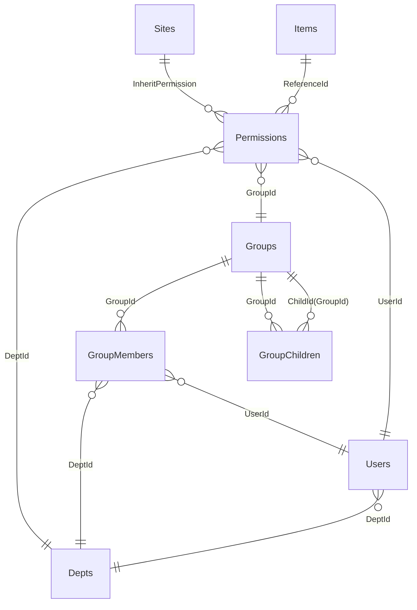
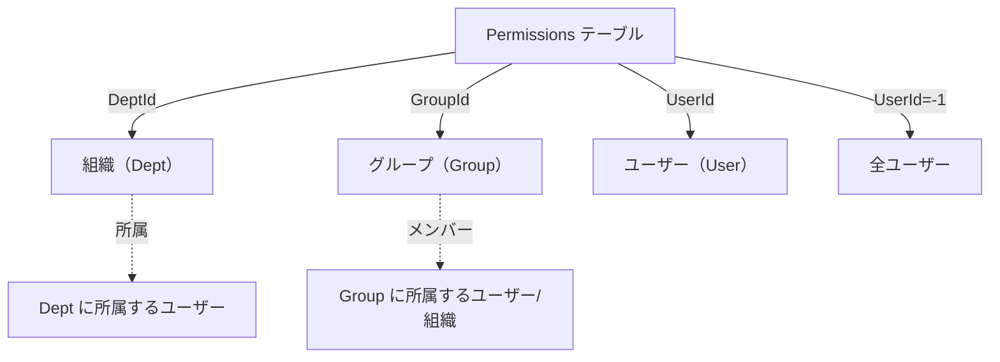
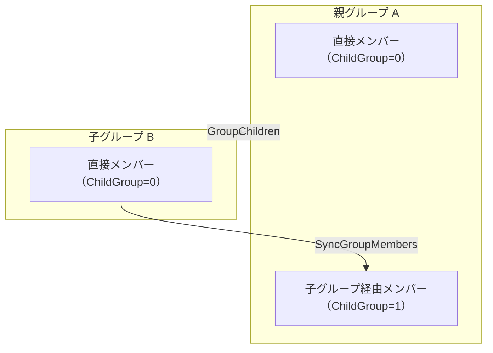
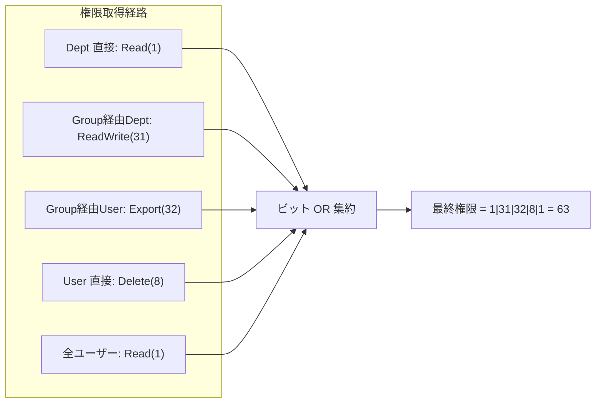
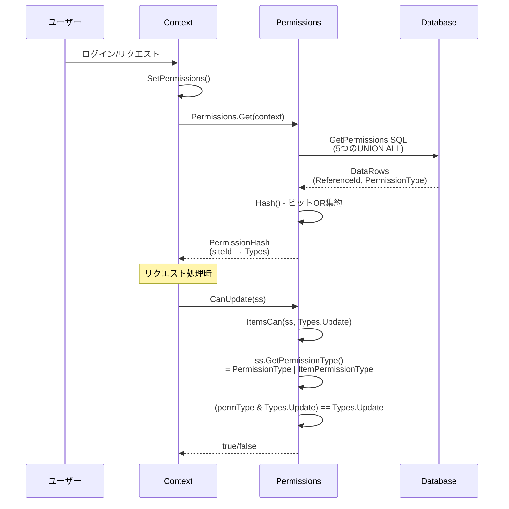

# プリザンター 権限階層構造（User・Group・Dept）調査

プリザンターにおけるアクセス制御の権限モデル（Permission）と、ユーザー・グループ・組織（Dept）階層構造の実装を調査したドキュメントです。

<!-- START doctoc generated TOC please keep comment here to allow auto update -->
<!-- DON'T EDIT THIS SECTION, INSTEAD RE-RUN doctoc TO UPDATE -->

- [調査情報](#調査情報)
- [調査目的](#調査目的)
- [権限モデル全体像](#権限モデル全体像)
- [PermissionType フラグ定義](#permissiontype-フラグ定義)
    - [プリセットパターン](#プリセットパターン)
- [Permissions テーブル構造](#permissions-テーブル構造)
    - [Permission クラス（メモリ上の表現）](#permission-クラスメモリ上の表現)
- [権限の 3 主体（Dept・Group・User）](#権限の-3-主体deptgroupuser)
- [User と Dept の関係](#user-と-dept-の関係)
- [Group メンバーシップ](#group-メンバーシップ)
    - [GroupMembers テーブル](#groupmembers-テーブル)
    - [子グループ（GroupChildren テーブル）](#子グループgroupchildren-テーブル)
    - [ネストの深さ制限](#ネストの深さ制限)
    - [循環参照チェック](#循環参照チェック)
    - [子グループメンバーの同期（RefreshAllChildMembers）](#子グループメンバーの同期refreshallchildmembers)
- [権限の取得と集約ロジック](#権限の取得と集約ロジック)
    - [Context.SetPermissions()](#contextsetpermissions)
    - [GetPermissions SQL（集約の核心）](#getpermissions-sql集約の核心)
    - [権限の OR 結合（ビット OR 集約）](#権限の-or-結合ビット-or-集約)
- [権限チェックの流れ](#権限チェックの流れ)
    - [Can / CanRead / CanUpdate 等のメソッド](#can--canread--canupdate-等のメソッド)
    - [ItemsCan（実際の権限チェックの中核）](#itemscan実際の権限チェックの中核)
    - [SiteSettings.GetPermissionType](#sitesettingsgetpermissiontype)
- [権限チェック全体フロー](#権限チェック全体フロー)
- [PermissionsWhere（SQL内の権限フィルタ）](#permissionswheresql内の権限フィルタ)
- [列レベルアクセス制御（ColumnAccessControl）](#列レベルアクセス制御columnaccesscontrol)
    - [Allowed メソッドの判定ロジック](#allowed-メソッドの判定ロジック)
- [グループ所属の取得](#グループ所属の取得)
    - [GetGroup / GetEnabledGroup SQL](#getgroup--getenabledgroup-sql)
- [権限の継承（InheritPermission）](#権限の継承inheritpermission)
- [特権ユーザー](#特権ユーザー)
- [結論](#結論)
- [関連ソースコード](#関連ソースコード)

<!-- END doctoc generated TOC please keep comment here to allow auto update -->

## 調査情報

| 調査日        | リポジトリ | ブランチ | タグ/バージョン    | コミット   | 備考     |
| ------------- | ---------- | -------- | ------------------ | ---------- | -------- |
| 2026年2月10日 | Pleasanter | main     | Pleasanter_1.5.1.0 | `34f162a4` | 初回調査 |

## 調査目的

プリザンターの権限制御の全体像を把握するため、以下の観点から内部実装を調査する。

- **PermissionType** フラグの定義と各権限の意味
- **Permissions テーブル**の構造（Dept・Group・User の 3 主体に対する権限付与）
- **User → Dept → Group** の階層的な権限解決ロジック
- **グループのネスト（子グループ）** の再帰解決メカニズム
- 複数経路から付与された権限の **集約（OR 結合）** ロジック
- **列レベルアクセス制御**（ColumnAccessControl）の仕組み

---

## 権限モデル全体像



---

## PermissionType フラグ定義

権限は `Permissions.Types` 列挙型としてビットフラグで定義されている。

**ファイル**: `Implem.Pleasanter/Libraries/Security/Permissions.cs`（行番号: 15-29）

```csharp
public enum Types : long
{
    NotSet = 0,                         // 00000000000000000000000000000000
    Read = 1,                           // 00000000000000000000000000000001
    Create = 2,                         // 00000000000000000000000000000010
    Update = 4,                         // 00000000000000000000000000000100
    Delete = 8,                         // 00000000000000000000000000001000
    SendMail = 16,                      // 00000000000000000000000000010000
    Export = 32,                        // 00000000000000000000000000100000
    Import = 64,                        // 00000000000000000000000001000000
    ManageSite = 128,                   // 00000000000000000000000010000000
    ManagePermission = 256,             // 00000000000000000000000100000000
    ManageTenant = 1073741824,          // 01000000000000000000000000000000
    ManageService = 2147483648,         // 10000000000000000000000000000000
}
```

### プリセットパターン

`App_Data/Parameters/Permissions.json` で定義されるプリセット権限パターン：

| パターン名 | 数値 | 含まれる権限                               |
| ---------- | ---- | ------------------------------------------ |
| ReadOnly   | 1    | Read                                       |
| ReadWrite  | 31   | Read + Create + Update + Delete + SendMail |
| Leader     | 255  | ReadWrite + Export + Import + ManageSite   |
| Manager    | 511  | Leader + ManagePermission                  |

- `General`（一般ユーザーのデフォルト）= `31`（ReadWrite）
- `Manager`（管理者のデフォルト）= `511`（Manager パターン）

---

## Permissions テーブル構造

**ファイル**: `Implem.Pleasanter/Models/Permissions/PermissionModel.cs`（行番号: 28-35）

```csharp
public class PermissionModel : BaseModel
{
    public long ReferenceId = 0;      // サイトID またはレコードID
    public int DeptId = 0;            // 組織ID（0の場合は組織指定なし）
    public int GroupId = 0;           // グループID（0の場合はグループ指定なし）
    public int UserId = 0;            // ユーザーID（0の場合はユーザー指定なし, -1は全ユーザー）
    public Permissions.Types PermissionType = (Permissions.Types)31;
    // ...
}
```

各レコードは **DeptId / GroupId / UserId のいずれか 1 つ**に値を持ち、**ReferenceId**（サイトまたはレコード）に対する権限を定義する。

### Permission クラス（メモリ上の表現）

**ファイル**: `Implem.Pleasanter/Libraries/Security/Permission.cs`（行番号: 12-17）

```csharp
public class Permission
{
    public string Name;            // "Dept" | "Group" | "User"
    public int Id;                 // 対応する DeptId / GroupId / UserId
    public Permissions.Types Type; // PermissionType ビットフラグ
    public bool Source;            // ソースリスト由来かどうか
}
```

`DataRow` からの構築時に `DeptId → GroupId → UserId` の優先順で Name を判定する：

```csharp
public Permission(DataRow dataRow, bool source = false)
{
    if (dataRow.Int("DeptId") != 0)      { Name = "Dept";  Id = dataRow.Int("DeptId"); }
    else if (dataRow.Int("GroupId") != 0) { Name = "Group"; Id = dataRow.Int("GroupId"); }
    else if (dataRow.Int("UserId") != 0)  { Name = "User";  Id = dataRow.Int("UserId"); }
    if (dataRow.Table.Columns.Contains("PermissionType"))
    {
        Type = (Permissions.Types)dataRow["PermissionType"].ToLong();
    }
}
```

---

## 権限の 3 主体（Dept・Group・User）

Permissions テーブルでは、以下の 3 つの主体に対して権限を設定できる。



| 主体     | 説明                                                       |
| -------- | ---------------------------------------------------------- |
| Dept     | 組織単位の権限付与。ユーザーは 1 つの Dept に所属する      |
| Group    | グループ単位の権限付与。ユーザーまたは Dept がメンバー     |
| User     | 個人単位の権限付与                                         |
| User(-1) | 全ユーザー（`UserId = -1` は特殊値で全認証ユーザーを意味） |

---

## User と Dept の関係

ユーザーは **1 つの Dept（組織）に所属**する。

**ファイル**: `Implem.Pleasanter/Libraries/Requests/Context.cs`（行番号: 96, 477-479）

```csharp
public int DeptId { get; set; }
// ...
DeptId = userModel.DeptId;
Dept = SiteInfo.Dept(tenantId: TenantId, deptId: DeptId);
```

- ユーザーのログイン時に `Context.DeptId` が設定される
- Dept に権限が付与されていると、その Dept に所属する全ユーザーが対象となる
- Dept の `Disabled` が `true` の場合は権限が無効化される

---

## Group メンバーシップ

### GroupMembers テーブル

グループのメンバーは `GroupMembers` テーブルで管理され、**Dept** または **User** をメンバーに含められる。

| カラム     | 型   | 説明                            |
| ---------- | ---- | ------------------------------- |
| GroupId    | int  | グループID                      |
| DeptId     | int  | 組織ID（0ならDept指定なし）     |
| UserId     | int  | ユーザーID（0ならUser指定なし） |
| Admin      | bool | グループ管理者フラグ            |
| ChildGroup | bool | 子グループ経由の自動登録フラグ  |

**ファイル**: `Implem.Pleasanter/Models/Groups/GroupModel.cs`（行番号: 1126-1157）

```csharp
groupMembers?.ForEach(data =>
{
    if (data.StartsWith("Dept,"))
    {
        // DeptId をメンバーとして InsertGroupMembers
        Repository.ExecuteNonQuery(
            statements: Rds.InsertGroupMembers(
                param: Rds.GroupMembersParam()
                    .GroupId(GroupId)
                    .DeptId(data.Split_2nd().ToInt())
                    .Admin(data.Split_3rd().ToBool())));
    }
    if (data.StartsWith("User,"))
    {
        // UserId をメンバーとして InsertGroupMembers
        Repository.ExecuteNonQuery(
            statements: Rds.InsertGroupMembers(
                param: Rds.GroupMembersParam()
                    .GroupId(GroupId)
                    .UserId(data.Split_2nd().ToInt())
                    .Admin(data.Split_3rd().ToBool())));
    }
});
```

### 子グループ（GroupChildren テーブル）

プリザンターはグループの **ネスト（入れ子）** をサポートする。

**ファイル**: `Implem.Pleasanter/Models/GroupChildren/GroupChildModel.cs`（行番号: 28-31）

```csharp
public class GroupChildModel : BaseModel
{
    public int GroupId = 0;   // 親グループID
    public int ChildId = 0;   // 子グループID
}
```

グループ作成時に子グループ情報を `GroupChildren` テーブルに挿入する：

```csharp
groupChildren?.ForEach(data =>
{
    if (data.StartsWith("Group,"))
    {
        Repository.ExecuteNonQuery(
            statements: Rds.InsertGroupChildren(
                param: Rds.GroupChildrenParam()
                    .GroupId(GroupId)
                    .ChildId(data.Split_2nd().ToInt())));
    }
});
```

### ネストの深さ制限

`App_Data/Parameters/General.json` で `GroupsDepthMax` パラメータ（デフォルト: `30`）によってネストの深さが制限される。

### 循環参照チェック

**ファイル**: `Implem.Pleasanter/Models/GroupChildren/GroupChildUtilities.cs`（行番号: 88-146）

子グループ設定時に、再帰的な DFS（深さ優先探索）で循環参照がないか検出する。

```csharp
private static (Error.Types status, int groupIdx) CheckGroupScanning(
    Dictionary<int, int[]> graph,
    int idx,
    Stack<int> parentIds,
    int lv,
    int lvMax)
{
    if (lv > lvMax) return (status: Error.Types.GroupDepthMax, groupIdx: idx);
    if (!graph.ContainsKey(idx)) return (status: Error.Types.None, groupIdx: 0);
    parentIds.Push(idx);
    foreach (var idx1 in graph[idx])
    {
        if (parentIds.Contains(idx1))
            return (status: Error.Types.CircularGroupChild, groupIdx: idx);
        var val = CheckGroupScanning(graph, idx1, parentIds, lv + 1, lvMax);
        if (val.status != Error.Types.None) return val;
    }
    parentIds.Pop();
    return (status: Error.Types.None, groupIdx: 0);
}
```

### 子グループメンバーの同期（RefreshAllChildMembers）

子グループのメンバーは **GroupMembers テーブルに `ChildGroup=1` フラグ付きで物理的にコピー**される。

**ファイル**: `Implem.Pleasanter/Models/GroupMembers/GroupMemberUtilities.cs`（行番号: 33-46）

```csharp
public static void SyncGroupMembers(Context context, int groupId)
{
    Repository.ExecuteNonQuery(
        context: context,
        transactional: true,
        statements: SyncGroupMembersSql(
            tenantId: context.TenantId,
            groupId: groupId,
            oldParents: GroupChildUtilities.GetParentIds(context: context, startId: groupId)));
}
```

SQLレベルでは再帰CTE（Common Table Expression）で子グループを走査し、`MERGE` 文で同期する。

**ファイル**: `Implem.Pleasanter/App_Data/Definitions/Sqls/SQLServer/RefreshAllChildMembers.sql`

```sql
with "GroupsChildIsNotInSelfId"("Lv", "GroupId", "ChildId") as (
    -- 子GroupIdリスト(自ID含まない) - 再帰CTE
    select 1 as "Lv", "t2"."GroupId", "t2"."ChildId"
    from "GroupChildren" as "t2"
        inner join "Groups" as "t3" on "t2"."GroupId"="t3"."GroupId"
    where "t3"."TenantId" = @TenantId and "t3"."Disabled" = 0
        and "t2"."GroupId" = @v_group2
    union all
    select "t1"."Lv" + 1, "t2"."GroupId", "t2"."ChildId"
    from "GroupsChildIsNotInSelfId" as "t1", "GroupChildren" as "t2"
        inner join "Groups" as "t3" on "t2"."GroupId"="t3"."GroupId"
    where "t3"."TenantId" = @TenantId
        and "t1"."Lv" < @GroupsDepthMax
        and "t3"."Disabled" = 0
        and "t1"."ChildId" = "t2"."GroupId"
)
merge into "GroupMembers" as "tgt"
using (
    select distinct @v_group2 as "GroupId", "DeptId", "UserId", 1 as "ChildGroup"
    from "GroupMembers" as "t9"
    where "t9"."ChildGroup" = 0
        and "t9"."GroupId" in (
            select "GroupId" from "Groups"
            where "TenantId" = @TenantId and "Disabled" = 0
                and "GroupId" in (select "ChildId" from "GroupsChildIsNotInSelfId")
        )
) as "src"
on ("tgt"."GroupId" = "src"."GroupId"
    and "tgt"."DeptId" = "src"."DeptId"
    and "tgt"."UserId" = "src"."UserId"
    and "tgt"."ChildGroup" = "src"."ChildGroup")
when not matched by target then insert (...) values (...)
when not matched by source
    and ("tgt"."GroupId" = @v_group2 AND "tgt"."ChildGroup" <> 0)
    then delete;
```

**ポイント**:

- 子グループのメンバー（`ChildGroup=0` の直接メンバーのみ）を、親グループに `ChildGroup=1` で物理コピー
- `MERGE` 文により差分同期（新規挿入・不要レコード削除）が行われる
- グループ更新時に `SyncGroupMembers` が呼ばれて自動同期される



---

## 権限の取得と集約ロジック

### Context.SetPermissions()

ログイン時・リクエスト処理時に `PermissionHash`（サイトID → 権限ビットフラグ）が構築される。

**ファイル**: `Implem.Pleasanter/Libraries/Requests/Context.cs`（行番号: 819-823）

```csharp
public void SetPermissions()
{
    PermissionHash = Permissions.Get(context: this);
    Groups = PermissionUtilities.Groups(context: this);
}
```

### GetPermissions SQL（集約の核心）

`GetPermissions` SQLは **5 つの UNION ALL** で、異なる経路からの権限を一括取得する。

**ファイル**: `Rds/Implem.SqlServer/SqlServerSqls.cs`（行番号: 84-140）

```sql
-- (1) Dept 直接: ユーザーの所属Deptに付与された権限
select distinct "Sites"."SiteId" as "ReferenceId",
    "Permissions"."PermissionType"
from "Sites"
    inner join "Permissions" on "Permissions"."ReferenceId"="Sites"."InheritPermission"
    inner join "Depts" on "Permissions"."DeptId"="Depts"."DeptId"
where "Sites"."TenantId"=@_T
    and "Depts"."DeptId"=@_D
    and "Depts"."Disabled"='false'

union all

-- (2) Group経由Dept: グループに付与された権限（ユーザーの所属DeptがGroupMember）
select distinct "Sites"."SiteId" as "ReferenceId",
    "Permissions"."PermissionType"
from "Sites"
    inner join "Permissions" on "Permissions"."ReferenceId"="Sites"."InheritPermission"
    inner join "Groups" on "Permissions"."GroupId"="Groups"."GroupId"
    inner join "GroupMembers" on "Groups"."GroupId"="GroupMembers"."GroupId"
    inner join "Depts" on "GroupMembers"."DeptId"="Depts"."DeptId"
where "Sites"."TenantId"=@_T
    and "Groups"."Disabled"='false'
    and "Depts"."DeptId"=@_D
    and "Depts"."Disabled"='false'

union all

-- (3) Group経由User: グループに付与された権限（ユーザー自身がGroupMember）
select distinct "Sites"."SiteId" as "ReferenceId",
    "Permissions"."PermissionType"
from "Sites"
    inner join "Permissions" on "Permissions"."ReferenceId"="Sites"."InheritPermission"
    inner join "Groups" on "Permissions"."GroupId"="Groups"."GroupId"
    inner join "GroupMembers" on "Groups"."GroupId"="GroupMembers"."GroupId"
    inner join "Users" on "GroupMembers"."UserId"="Users"."UserId"
where "Sites"."TenantId"=@_T
    and "Groups"."Disabled"='false'
    and "Users"."UserId"=@_U
    and "Users"."Disabled"='false'

union all

-- (4) User 直接: ユーザー個人に付与された権限
select distinct "Sites"."SiteId" as "ReferenceId",
    "Permissions"."PermissionType"
from "Sites"
    inner join "Permissions" on "Permissions"."ReferenceId"="Sites"."InheritPermission"
where "Sites"."TenantId"=@_T
    and "Permissions"."UserId" > 0
    and "Permissions"."UserId"=@_U

union all

-- (5) 全ユーザー: UserId=-1（全認証ユーザー向け）の権限
select distinct "Sites"."SiteId" as "ReferenceId",
    "Permissions"."PermissionType"
from "Sites"
    inner join "Permissions" on "Permissions"."ReferenceId"="Sites"."InheritPermission"
where "Sites"."TenantId"=@_T
    and "Permissions"."UserId"=-1
```

### 権限の OR 結合（ビット OR 集約）

クエリ結果はC#側で **ビット OR** によって集約される。

**ファイル**: `Implem.Pleasanter/Libraries/Security/Permissions.cs`（行番号: 337-347）

```csharp
private static Dictionary<long, Types> Hash(EnumerableRowCollection<DataRow> dataRows)
{
    var hash = dataRows
        .Select(o => o.Long("ReferenceId"))
        .Distinct()
        .ToDictionary(o => o, o => Types.NotSet);
    dataRows.ForEach(dataRow =>
    {
        var key = dataRow.Long("ReferenceId");
        hash[key] |= (Types)dataRow.Long("PermissionType");  // ビット OR で合成
    });
    return hash;
}
```

**重要**: 同一サイトに対して複数経路（Dept + Group + User）から権限が付与された場合、すべての権限が **ビット OR で合算**される。権限は「加算的」であり、減算（拒否）は存在しない。



---

## 権限チェックの流れ

### Can / CanRead / CanUpdate 等のメソッド

**ファイル**: `Implem.Pleasanter/Libraries/Security/Permissions.cs`（行番号: 352-375）

```csharp
public static bool Can(Context context, long siteId, Types type)
{
    return (Get(context: context, siteId: siteId) & type) == type
        || context.HasPrivilege;
}

public static bool CanRead(Context context, long siteId)
{
    return context.HasPrivilege
        || (Get(context: context, siteId: siteId) & Types.Read) == Types.Read;
}
```

### ItemsCan（実際の権限チェックの中核）

コントローラー別の権限チェック後、最終的に `ItemsCan` に到達する。

**ファイル**: `Implem.Pleasanter/Libraries/Security/Permissions.cs`（行番号: 808-826）

```csharp
private static bool ItemsCan(
    this Context context,
    SiteSettings ss,
    Types type,
    bool site,
    bool checkLocked = true)
{
    if (checkLocked && ss.Locked())
    {
        if ((type & Types.Update) == Types.Update) return false;
        if ((type & Types.Delete) == Types.Delete) return false;
    }
    if (ss.LockedTable())
    {
        if ((type & Types.Create) == Types.Create) return false;
        if ((type & Types.Import) == Types.Import) return false;
    }
    return (ss.GetPermissionType(context: context, site: site) & type) == type
        || context.HasPrivilege;
}
```

### SiteSettings.GetPermissionType

サイト権限とレコード権限を合成する。

**ファイル**: `Implem.Pleasanter/Libraries/Settings/SiteSettings.cs`（行番号: 5218-5229）

```csharp
public Permissions.Types GetPermissionType(Context context, bool site = false)
{
    var permission = Permissions.Types.NotSet;
    if (PermissionType != null)
    {
        permission |= (Permissions.Types)PermissionType;
    }
    if (ItemPermissionType != null && !site)
    {
        permission |= (Permissions.Types)ItemPermissionType;
    }
    return permission;
}
```

- `PermissionType`: サイトレベルの権限（`PermissionHash` から取得）
- `ItemPermissionType`: レコードレベルの権限（特定レコードへのアクセス制御が設定されている場合）
- 両者が **ビット OR** で合成される

---

## 権限チェック全体フロー



---

## PermissionsWhere（SQL内の権限フィルタ）

データ取得時に SQL の WHERE 句で権限フィルタリングを行う場合に使用される。

**ファイル**: `Rds/Implem.SqlServer/SqlServerSqls.cs`（行番号: 236-289）

```sql
(
    exists (
        -- (1) Dept 直接
        select "Depts"."DeptId" as "Id"
        from "Depts"
        where "Depts"."TenantId"=@_T
            and "Depts"."DeptId"=@_D
            and "Depts"."Disabled"='false'
            and "Permissions"."DeptId"="Depts"."DeptId"
            and @_D<>0

        union all

        -- (2) Group 経由 Dept
        select "Groups"."GroupId" as "Id"
        from "Groups"
            inner join "GroupMembers" on "Groups"."GroupId"="GroupMembers"."GroupId"
        where "Groups"."TenantId"=@_T
            and "Groups"."Disabled"='false'
            and "Permissions"."GroupId"="Groups"."GroupId"
            and exists (
                select "DeptId" from "Depts"
                where "Depts"."TenantId"=@_T
                    and "Depts"."DeptId"=@_D
                    and "Depts"."Disabled"='false'
                    and "GroupMembers"."DeptId"="Depts"."DeptId"
                    and @_D<>0
            )

        union all

        -- (3) Group 経由 User
        select "Groups"."GroupId" as "Id"
        from "Groups"
            inner join "GroupMembers" on "Groups"."GroupId"="GroupMembers"."GroupId"
        where "Groups"."TenantId"=@_T
            and "Groups"."Disabled"='false'
            and "Permissions"."GroupId"="Groups"."GroupId"
            and "GroupMembers"."UserId"=@_U
            and @_U<>0

        union all

        -- (4) User 直接
        select "P"."UserId" as "Id"
        from "Permissions" as "P"
        where "P"."ReferenceId"="Permissions"."ReferenceId"
            and "P"."UserId"="Permissions"."UserId"
            and "P"."UserId"=@_U

        union all

        -- (5) 全ユーザー (UserId=-1)
        select "P"."UserId" as "Id"
        from "Permissions" as "P"
        where "P"."ReferenceId"="Permissions"."ReferenceId"
            and "P"."UserId"=-1
    )
)
```

SQLパラメータ `@_T`（TenantId）、`@_D`（DeptId）、`@_U`（UserId）はContextから設定される。

---

## 列レベルアクセス制御（ColumnAccessControl）

サイト設定で列ごとに読み取り/作成/更新のアクセス制御を設定できる。

**ファイル**: `Implem.Pleasanter/Libraries/Settings/ColumnAccessControl.cs`（行番号: 13-24）

```csharp
public class ColumnAccessControl
{
    public string ColumnName;
    public List<int> Depts;           // 許可する組織IDリスト
    public List<int> Groups;          // 許可するグループIDリスト
    public List<int> Users;           // 許可するユーザーIDリスト
    public List<string> RecordUsers;  // レコードのユーザー列を参照
    public Permissions.Types? Type;   // 必要な権限タイプ
}
```

### Allowed メソッドの判定ロジック

**ファイル**: `Implem.Pleasanter/Libraries/Settings/ColumnAccessControl.cs`（行番号: 72-120）

```csharp
public bool Allowed(Context context, SiteSettings ss, List<string> mine)
{
    // (1) 制限未設定 → 全許可
    if (Depts/Groups/Users/RecordUsers すべて空 && Type == NotSet) return true;
    // (2) Dept に含まれるか
    else if (DeptContains(context)) return true;
    // (3) Group に含まれるか（Context.Groups と Intersect）
    else if (GroupContains(context)) return true;
    // (4) User に含まれるか（-1=全認証ユーザー対応）
    else if (UserContains(context)) return true;
    // (5) Type 指定がありサイト権限に含まれるか
    else if (Type != null && (Type & ss.PermissionType) == Type) return true;
    // (6) RecordUsers（自分が作成者/担当者等かで判定）
    else if (RecordUsers に自分が含まれる) return true;
    else return false;
}
```

`GroupContains` では `context.Groups`（ログイン時に取得済みのグループIDリスト）との共通部分をチェックする：

```csharp
private bool GroupContains(Context context)
{
    return Groups?.Any() == true
        && context.Groups?.Any() == true
        && Groups.Intersect(context.Groups)
            .Any(o => {
                var group = SiteInfo.Group(tenantId: context.TenantId, groupId: o);
                return group?.Id == o && group?.Disabled == false;
            });
}
```

---

## グループ所属の取得

ログイン時に `PermissionUtilities.Groups()` でユーザーの所属グループ一覧を取得する。

**ファイル**: `Implem.Pleasanter/Models/Permissions/PermissionUtilities.cs`（行番号: 700-715）

```csharp
public static List<int> Groups(Context context, bool enableOnly = false)
{
    if (context.Authenticated)
    {
        var sql = enableOnly
            ? context.Sqls.GetEnabledGroup
            : context.Sqls.GetGroup;
        return Repository.ExecuteTable(
            context: context,
            statements: new SqlStatement(sql))
                .AsEnumerable()
                .Select(o => o.Int("GroupId"))
                .ToList();
    }
    else
    {
        return new List<int>();
    }
}
```

### GetGroup / GetEnabledGroup SQL

Dept 経由またはUser直接のグループメンバーシップを取得する。

**ファイル**: `Rds/Implem.SqlServer/SqlServerSqls.cs`（行番号: 211-234）

```sql
-- GetEnabledGroup
select "Groups"."GroupId"
from "Groups"
    inner join "GroupMembers" on "Groups"."GroupId"="GroupMembers"."GroupId"
    inner join "Depts" on "GroupMembers"."DeptId"="Depts"."DeptId"
where "Groups"."Disabled"='false'
    and "Depts"."TenantId"=@_T
    and "Depts"."DeptId"=@_D
    and "Depts"."Disabled"='false'
union all
select "Groups"."GroupId"
from "Groups"
    inner join "GroupMembers" on "Groups"."GroupId"="GroupMembers"."GroupId"
    inner join "Users" on "GroupMembers"."UserId"="Users"."UserId"
where "Groups"."Disabled"='false'
    and "Users"."TenantId"=@_T
    and "Users"."UserId"=@_U
```

**注**: `GroupMembers` テーブルには `ChildGroup=1` のレコード（子グループの同期済みメンバー）も含まれるため、ユーザーが子グループのメンバーであれば親グループの権限も自動的に継承される。

---

## 権限の継承（InheritPermission）

サイトの権限設定は `Sites.InheritPermission` により上位サイトからの継承をサポートする。

- `InheritPermission == SiteId`（自身）: サイト独自の権限を使用
- `InheritPermission != SiteId`: 指定されたサイトの権限を継承

`GetPermissions` SQL では `"Permissions"."ReferenceId"="Sites"."InheritPermission"` の JOIN 条件でこの継承を実現している。

---

## 特権ユーザー

以下の条件で権限チェックを**バイパス**できる：

| 条件             | 判定方法                                                     |
| ---------------- | ------------------------------------------------------------ |
| `HasPrivilege`   | `Parameters.Security.PrivilegedUsers` にログインIDが含まれる |
| `TenantManager`  | `User.TenantManager == true`（テナント管理権限）             |
| `ServiceManager` | `User.ServiceManager == true`（サービス管理権限）            |

```csharp
// Permissions.cs
public static bool CanManageTenant(Context context)
{
    return context.User?.TenantManager == true || context.HasPrivilege;
}
```

---

## 結論

| 項目           | 内容                                                                                                            |
| -------------- | --------------------------------------------------------------------------------------------------------------- |
| 権限モデル     | ビットフラグ方式（`Permissions.Types`）。11 種類の権限をビット OR で組み合わせ                                  |
| 権限の主体     | Dept（組織）、Group（グループ）、User（ユーザー）、全ユーザー（UserId=-1）                                      |
| 階層構造       | User は 1 Dept に所属。Group は Dept/User をメンバーに持つ。Group は子グループをネスト可能                      |
| グループネスト | `GroupChildren` テーブル + 再帰 CTE で走査。`GroupMembers` に `ChildGroup=1` で物理同期                         |
| ネスト深さ上限 | `GroupsDepthMax`（デフォルト: 30）。循環参照チェックあり                                                        |
| 権限集約       | 5 経路（Dept直接/Group経由Dept/Group経由User/User直接/全ユーザー）から UNION ALL で取得し、**ビット OR で合算** |
| 権限性質       | **加算的**（拒否ルールは存在しない）。複数経路の権限は常に合算される                                            |
| 列レベル制御   | `ColumnAccessControl` で列ごとに Dept/Group/User/RecordUsers で制限可能                                         |
| サイト継承     | `InheritPermission` で上位サイトの権限を継承可能                                                                |
| 特権バイパス   | `PrivilegedUsers`、`TenantManager`、`ServiceManager` で権限チェックをバイパス                                   |

---

## 関連ソースコード

| ファイル                                                                           | 概要                                                 |
| ---------------------------------------------------------------------------------- | ---------------------------------------------------- |
| `Implem.Pleasanter/Libraries/Security/Permissions.cs`                              | 権限チェック中核クラス（Types enum、Can系メソッド）  |
| `Implem.Pleasanter/Libraries/Security/Permission.cs`                               | Permission モデルクラス                              |
| `Implem.Pleasanter/Models/Permissions/PermissionModel.cs`                          | Permissions テーブル ORM モデル                      |
| `Implem.Pleasanter/Models/Permissions/PermissionUtilities.cs`                      | 権限ユーティリティ（Groups取得、Source/Current管理） |
| `Implem.Pleasanter/Models/Groups/GroupModel.cs`                                    | グループモデル（メンバー・子グループ管理）           |
| `Implem.Pleasanter/Models/GroupMembers/GroupMemberUtilities.cs`                    | 子グループメンバー同期ロジック                       |
| `Implem.Pleasanter/Models/GroupChildren/GroupChildUtilities.cs`                    | 親/子グループ ID 走査、循環参照チェック              |
| `Implem.Pleasanter/Models/GroupChildren/GroupChildModel.cs`                        | GroupChildren テーブルモデル                         |
| `Implem.Pleasanter/Libraries/Settings/SiteSettings.cs`                             | SiteSettings.GetPermissionType()                     |
| `Implem.Pleasanter/Libraries/Settings/ColumnAccessControl.cs`                      | 列レベルアクセス制御                                 |
| `Implem.Pleasanter/Libraries/Requests/Context.cs`                                  | Context（PermissionHash、Groups、DeptId）            |
| `Rds/Implem.SqlServer/SqlServerSqls.cs`                                            | SQL 定義（GetPermissions、PermissionsWhere 等）      |
| `Implem.Pleasanter/App_Data/Definitions/Sqls/SQLServer/RefreshAllChildMembers.sql` | 子グループメンバー同期 SQL                           |
| `Implem.Pleasanter/App_Data/Parameters/Permissions.json`                           | 権限パラメータ（プリセットパターン定義）             |
| `Implem.ParameterAccessor/Parts/Permissions.cs`                                    | 権限パラメータモデル                                 |
