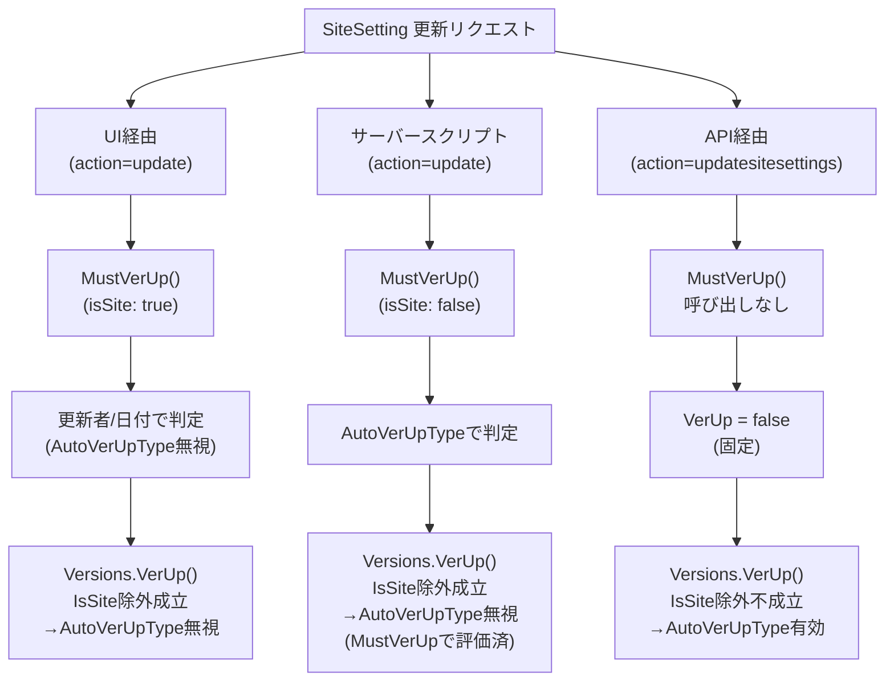
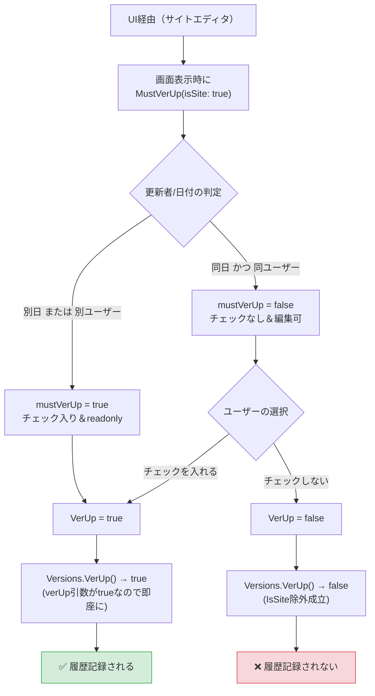
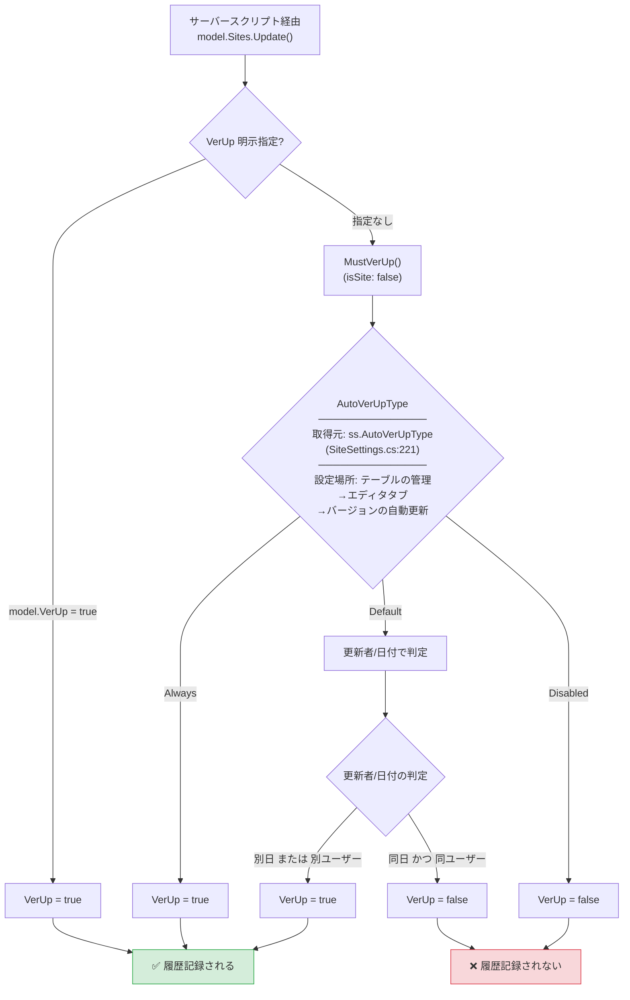
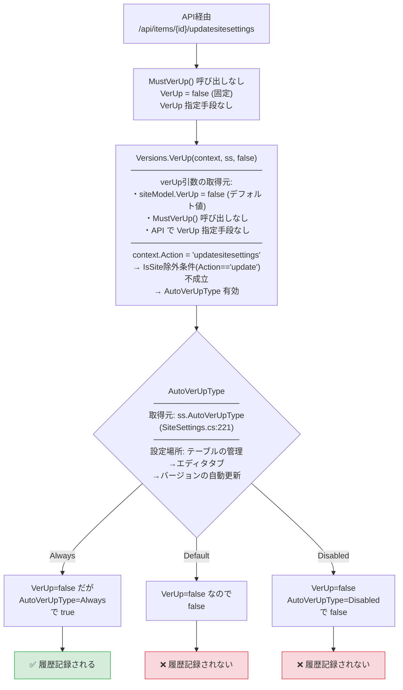
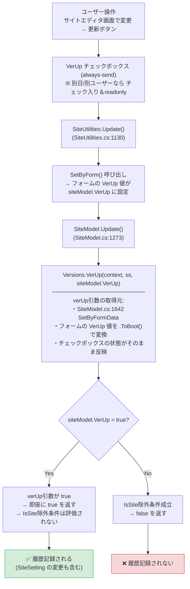
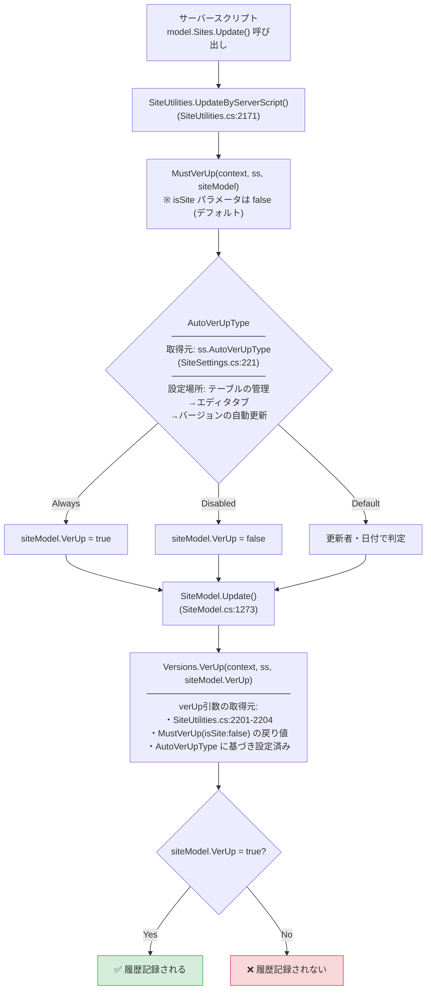
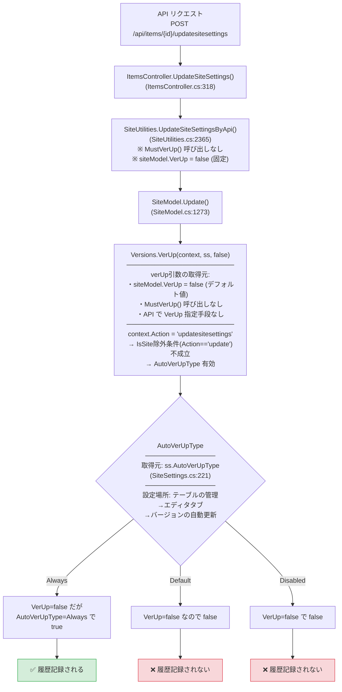

# プリザンター SiteSetting 更新時の変更履歴記録調査

このドキュメントでは、プリザンター本体の SiteSetting が更新された際に、変更履歴の一覧へ履歴が記録されないケースについて調査した内容をまとめます。

<!-- START doctoc generated TOC please keep comment here to allow auto update -->
<!-- DON'T EDIT THIS SECTION, INSTEAD RE-RUN doctoc TO UPDATE -->

- [調査情報](#調査情報)
- [調査目的](#調査目的)
- [流入経路別 VerUp 判定フローチャート](#流入経路別-verup-判定フローチャート)
    - [全体像](#全体像)
    - [UI経由の詳細フロー](#ui経由の詳細フロー)
    - [サーバースクリプト経由の詳細フロー](#サーバースクリプト経由の詳細フロー)
    - [API経由の詳細フロー](#api経由の詳細フロー)
    - [判定結果サマリー](#判定結果サマリー)
- [履歴記録の判定ロジック（共通）](#履歴記録の判定ロジック共通)
    - [核心となるコード: Versions.VerUp()](#核心となるコード-versionsverup)
    - [IsSite() の判定](#issite-の判定)
    - [AutoVerUpType の設定](#autoveruptype-の設定)
- [流入経路別の動作](#流入経路別の動作)
    - [1. UI経由](#1-ui経由)
    - [2. サーバースクリプト経由](#2-サーバースクリプト経由)
    - [3. API経由（`/api/items/{id}/updatesitesettings`）](#3-api経由apiitemsidupdatesitesettings)
- [流入経路別の比較まとめ](#流入経路別の比較まとめ)
    - [流入経路別の動作一覧](#流入経路別の動作一覧)
    - [UI経由の VerUp チェックボックス詳細](#ui経由の-verup-チェックボックス詳細)
    - [ハードコーディング・無視される値の詳細](#ハードコーディング無視される値の詳細)
    - [履歴記録の判定結果](#履歴記録の判定結果)
    - [履歴が記録されないケース](#履歴が記録されないケース)
- [関連ソースコード一覧](#関連ソースコード一覧)
    - [流入経路別の処理](#流入経路別の処理)
    - [履歴判定](#履歴判定)
    - [UI部品](#ui部品)
    - [更新処理](#更新処理)

<!-- END doctoc generated TOC please keep comment here to allow auto update -->

## 調査情報

| 調査日       | リポジトリ | ブランチ | タグ/バージョン | コミット                                 | 備考     |
| ------------ | ---------- | -------- | --------------- | ---------------------------------------- | -------- |
| 2026年2月3日 | Pleasanter | main     |                 | 調査時点の最新（コミットハッシュ未取得） | 初回調査 |

## 調査目的

SiteSetting 更新時の履歴記録の有無が流入経路（UI、サーバースクリプト、API）によって異なる挙動を示す原因を明確にする。

---

## 流入経路別 VerUp 判定フローチャート

### 全体像



### UI経由の詳細フロー



### サーバースクリプト経由の詳細フロー



### API経由の詳細フロー



### 判定結果サマリー

| 流入経路               | 条件                           | Always           | Default          | Disabled         |
| ---------------------- | ------------------------------ | ---------------- | ---------------- | ---------------- |
| **UI**                 | 別日/別ユーザー (readonly)     | ✅ 記録 (強制ON) | ✅ 記録 (強制ON) | ✅ 記録 (強制ON) |
| **UI**                 | 同日/同ユーザー (チェックなし) | ❌ 記録されない  | ❌ 記録されない  | ❌ 記録されない  |
| **サーバースクリプト** | -                              | ✅ 記録          | 条件次第         | ❌ 記録されない  |
| **API**                | -                              | ✅ 記録          | ❌ 記録されない  | ❌ 記録されない  |

> **Note**:
>
> - UI経由では AutoVerUpType は**完全に無視**される
> - サーバースクリプトで `VerUp = true` を明示指定した場合は**常に記録**される

---

## 履歴記録の判定ロジック（共通）

### 核心となるコード: Versions.VerUp()

**ファイル**: `Implem.Pleasanter/Libraries/Models/Versions.cs` (35-40行目)

```csharp
public static bool VerUp(Context context, SiteSettings ss, bool verUp)
{
    return verUp ||
        (ss.SiteId > 0
        && !(ss.IsSite(context: context) && context.Action == "update")
        && ss.AutoVerUpType == AutoVerUpTypes.Always);
}
```

#### 判定条件

| 条件                              | 説明                                                  |
| --------------------------------- | ----------------------------------------------------- |
| `verUp`                           | 明示的に VerUp フラグが true の場合 → **即座に true** |
| `ss.SiteId > 0`                   | 有効なサイトIDが存在する                              |
| `!(IsSite && Action == "update")` | **サイト自体のUI更新ではない**                        |
| `AutoVerUpType == Always`         | 自動バージョンアップが「常に」設定                    |

**重要**: `IsSite && Action == "update"` の条件は**UI経由のサイト更新のみ**で成立する。

### IsSite() の判定

**ファイル**: `Implem.Pleasanter/Libraries/Settings/SiteSettings.cs` (692-695行目)

```csharp
public bool IsSite(Context context)
{
    return SiteId == context.Id;
}
```

### AutoVerUpType の設定

**定義**: `SiteSettings.cs` (221行目)

```csharp
public Versions.AutoVerUpTypes? AutoVerUpType;
```

**UI上の設定場所**: テーブルの管理 → エディタタブ → 「バージョンの自動更新」

| 値       | 説明               |
| -------- | ------------------ |
| Default  | 更新者・日付で判定 |
| Always   | 常に履歴作成       |
| Disabled | 履歴作成しない     |

#### 直感に反する動作についての注意

この設定は「エディタタブ」内にあり、本来は **Items（レコード）の更新時** のバージョン管理を想定した設定ですが、以下のケースでも参照されます：

| 適用されるケース                       | 理由                                                                                                                                                   |
| -------------------------------------- | ------------------------------------------------------------------------------------------------------------------------------------------------------ |
| **サーバースクリプト経由のサイト更新** | `MustVerUp(isSite: false)` が呼ばれるため、`AutoVerUpType` が評価される                                                                                |
| **API経由のサイト設定更新**            | `context.Action = "updatesitesettings"` のため `IsSite && Action == "update"` 条件が不成立となり、`Versions.VerUp()` 内で `AutoVerUpType` が評価される |

**これは設計上の問題である可能性があります**：

- UI経由のサイト更新では `IsSite && Action == "update"` 条件により `AutoVerUpType` は**明示的に除外**されている
- しかしサーバースクリプトやAPIでは、この除外条件が効かない（または別のパスを通る）ため、`AutoVerUpType` が適用される
- 結果として、「エディタタブのレコード用設定」が「サイト設定の更新」に影響を与えるという直感に反する動作になっている

---

## 流入経路別の動作

### 1. UI経由

#### 概要

サイトエディタ画面は以下で構成されています：

- **基本情報**（タイトル、説明、アイコン等）
- **テーブルの管理タブ**（エディタ、ビュー、サーバースクリプト等の詳細設定）
- **VerUpチェックボックス**（基本情報セクション内に存在）

これらは**同じ画面**であり、画面下部の「更新」ボタンを押すと、基本情報の変更も SiteSetting の変更も**同時に**保存されます。

#### VerUp チェックボックスの動作

**ファイル**: `HtmlVerUps.cs` (12-34行目)

```csharp
var mustVerUp = Versions.MustVerUp(
    context: context,
    ss: ss,
    baseModel: baseModel,
    isSite: ss.SiteId == 0 || ss.IsSite(context: context));  // サイト編集時は isSite: true
return hb.FieldCheckBox(
    controlId: "VerUp",
    _checked: mustVerUp,    // 初期値（mustVerUp が true ならチェック入り）
    disabled: mustVerUp,    // mustVerUp = true なら readonly（変更不可）
    controlCss: " always-send");  // 常にフォームに含まれる
```

**MustVerUp(isSite: true) の判定ロジック**:

```csharp
public static bool MustVerUp(..., bool isSite = false)
{
    if (!isSite)  // サイト編集時は isSite: true なのでここはスキップ
    {
        switch (ss.AutoVerUpType) { ... }  // AutoVerUpType は評価されない
    }
    // サイト編集時はここが評価される
    return baseModel.Updator.Id != context.UserId ||
        (baseModel.UpdatedTime?.DifferentDate(context: context) ?? false);
}
```

#### チェックボックスの状態

| 条件                             | mustVerUp | チェック状態     | 操作可否                 |
| -------------------------------- | --------- | ---------------- | ------------------------ |
| 更新者が現在ユーザーと**異なる** | `true`    | **チェック入り** | **readonly（変更不可）** |
| 最終更新日が**今日と異なる**     | `true`    | **チェック入り** | **readonly（変更不可）** |
| 同日に同じユーザーが更新         | `false`   | チェックなし     | 編集可能                 |

**実運用上の結論**:

- **通常の運用（別日に設定変更）では、チェックボックスは「チェック入り＆readonly」となり、ユーザーは OFF にできない**
- したがって、**別日に更新する場合は常に履歴が記録される**
- 同日に同じユーザーが連続して更新する場合のみ、チェックボックスを操作可能（デフォルト OFF）

#### 処理フロー



#### Context の状態

| 項目                 | 値         |
| -------------------- | ---------- |
| `context.Id`         | サイトID   |
| `context.Action`     | `"update"` |
| `ss.IsSite(context)` | `true`     |

#### 履歴記録の条件

| 更新タイミング           | VerUp チェックボックス       | 履歴記録         | 理由                                        |
| ------------------------ | ---------------------------- | ---------------- | ------------------------------------------- |
| **別日または別ユーザー** | **チェック入り（readonly）** | **記録される**   | mustVerUp = true、ユーザーは OFF にできない |
| 同日・同ユーザー         | デフォルト OFF（編集可）     | **記録されない** | ユーザーが ON にしない限り VerUp = false    |
| 同日・同ユーザー         | ユーザーが ON に変更         | **記録される**   | VerUp = true が最優先で評価される           |

**結論**:

- **通常の運用（別日に更新）では、UI経由で SiteSetting を変更すると履歴は常に記録される**
- 同日に同じユーザーが連続更新する場合のみ、VerUp チェックボックスを操作可能であり、チェックを入れないと履歴は記録されない
- AutoVerUpType は**サイト編集時には完全に無視**される

#### 例外ケース

以下の場合も履歴が記録される：

- 履歴からの復元時（`RestoreFromHistory` で `VerUp = true` が設定される）

---

### 2. サーバースクリプト経由

#### 処理フロー



#### Context の状態

| 項目                 | 値         |
| -------------------- | ---------- |
| `context.Id`         | サイトID   |
| `context.Action`     | `"update"` |
| `ss.IsSite(context)` | `true`     |

#### 履歴記録の条件

| AutoVerUpType | VerUp 明示指定 | 履歴記録           | 理由                                  |
| ------------- | -------------- | ------------------ | ------------------------------------- |
| Always        | なし           | **記録される**     | MustVerUp() が VerUp = `true` を設定  |
| Default       | なし           | 更新者・日付で判定 | MustVerUp() が更新者・日付で判定      |
| Disabled      | なし           | **記録されない**   | MustVerUp() が VerUp = `false` を設定 |
| 任意          | `true`         | **記録される**     | VerUp = `true` が最優先で評価される   |

**結論**: **サーバースクリプト経由では AutoVerUpType に従って履歴が記録される**

- MustVerUp() が呼び出され、AutoVerUpType に基づいて `siteModel.VerUp` が設定される
- `Versions.VerUp()` では VerUp が `true` なら即座に `true` を返すため、IsSite除外条件は実質的に無視される

#### VerUp 明示指定の方法

```javascript
// 方法1: model オブジェクトに直接設定
model.VerUp = true;

// 方法2: Update の引数で指定
model.Sites.Update(siteId, {
    VerUp: true,
});
```

#### 補足: isSite パラメータの問題

`UpdateByServerScript()` で `MustVerUp()` を呼び出す際に `isSite: true` が渡されていない：

```csharp
// SiteUtilities.cs:2201-2204
siteModel.VerUp = Versions.MustVerUp(
    context: context,
    ss: ss,
    baseModel: siteModel);  // isSite パラメータなし（デフォルト false）
```

これにより `AutoVerUpType` の判定が適用される（Issues/Results と同じ動作）。

---

### 3. API経由（`/api/items/{id}/updatesitesettings`）

#### 処理フロー



#### Context の状態

| 項目                 | 値                     | 理由                                |
| -------------------- | ---------------------- | ----------------------------------- |
| `context.Id`         | サイトID               | URLの `{id}` パラメータから設定     |
| `context.Action`     | `"updatesitesettings"` | APIルートのアクション名が設定される |
| `ss.IsSite(context)` | `true`                 | `SiteId == context.Id` が成立       |

**重要**: API経由では `context.Action` が `"updatesitesettings"` のため、`IsSite && Action == "update"` 条件が成立しない。

#### 履歴記録の条件

| AutoVerUpType | VerUp 明示指定 | 履歴記録         | 理由                                                                                          |
| ------------- | -------------- | ---------------- | --------------------------------------------------------------------------------------------- |
| Always        | 指定不可       | **記録される**   | VerUp = `false` だが、IsSite除外条件が不成立のため AutoVerUpType が評価され、Always で `true` |
| Default       | 指定不可       | **記録されない** | VerUp = `false`（ハードコード）、AutoVerUpType = Default は MustVerUp() が必要だが呼ばれない  |
| Disabled      | 指定不可       | **記録されない** | VerUp = `false`（ハードコード）、AutoVerUpType = Disabled で `false`                          |

**結論**: **API経由では `AutoVerUpType = Always` の場合のみ履歴が記録される**

- `siteModel.VerUp` は `false` にハードコードされている（MustVerUp() が呼ばれない）
- `context.Action` が `"updatesitesettings"` のため `IsSite && Action == "update"` 条件が**不成立**
- そのため AutoVerUpType が評価されるが、VerUp = `false` のため Always 以外では履歴作成されない

#### VerUp 明示指定について

`SiteSettingsApiModel` には `VerUp` プロパティが**定義されていない**ため、明示的に指定することは不可能。

```csharp
public class SiteSettingsApiModel
{
    public List<ServerScriptApiSettingModel> ServerScripts { get; set; }
    public List<ScriptApiSettingModel> Scripts { get; set; }
    public List<StyleApiSettingModel> Styles { get; set; }
    // VerUp プロパティは存在しない
}
```

また、`UpdateSiteSettingsByApi()` 内で `SetByApi()` が呼ばれないため、仮に VerUp を JSON に含めても無視される。

---

## 流入経路別の比較まとめ

### 流入経路別の動作一覧

| 流入経路                 | MustVerUp()                      | VerUp 初期値                  | VerUp 指定   | context.Action         | IsSite除外条件  | AutoVerUpType                                   |
| ------------------------ | -------------------------------- | ----------------------------- | ------------ | ---------------------- | --------------- | ----------------------------------------------- |
| **UI（サイトエディタ）** | チェックボックス表示時に呼び出し | MustVerUp(isSite:true)で設定  | **条件付き** | `"update"`             | **成立→無視**   | **無視**（MustVerUp で isSite:true により除外） |
| **サーバースクリプト**   | **呼び出しあり**                 | MustVerUp(isSite:false)で設定 | **可能**     | `"update"`             | 成立→無視       | **MustVerUp で評価済**                          |
| **API**                  | 呼び出しなし                     | `false`（デフォルト）         | **不可**     | `"updatesitesettings"` | **不成立→有効** | **有効**                                        |

### UI経由の VerUp チェックボックス詳細

| 更新タイミング           | mustVerUp | チェック状態     | 操作可否                 | 履歴記録                               |
| ------------------------ | --------- | ---------------- | ------------------------ | -------------------------------------- |
| **別日または別ユーザー** | `true`    | **チェック入り** | **readonly（変更不可）** | **常に記録される**                     |
| 同日・同ユーザー         | `false`   | チェックなし     | 編集可能                 | ユーザーが ON にしない限り記録されない |

**重要**: 通常の運用（別日に設定変更）では、チェックボックスは「チェック入り＆readonly」となり、ユーザーは OFF にできないため**履歴は常に記録される**。

### ハードコーディング・無視される値の詳細

| 流入経路 | 項目                         | 状態                             | 詳細                                                                                                   |
| -------- | ---------------------------- | -------------------------------- | ------------------------------------------------------------------------------------------------------ |
| **UI**   | `VerUp` チェックボックス     | **存在する**                     | 別日/別ユーザーの場合は**チェック入り＆readonly**。同日/同ユーザーの場合のみ編集可能                   |
| **UI**   | `AutoVerUpType`              | **完全に無視**                   | `MustVerUp(isSite: true)` のため AutoVerUpType は評価されない                                          |
| **API**  | `siteModel.VerUp`            | デフォルト `false`               | `SiteUtilities.UpdateSiteSettingsByApi()` で MustVerUp() が呼ばれないため、デフォルト値 `false` のまま |
| **API**  | `SiteSettingsApiModel.VerUp` | **プロパティなし**               | API モデルに VerUp プロパティが定義されていないため指定不可                                            |
| **API**  | `AutoVerUpType = Default`    | **評価されるが履歴作成されない** | `verUp = false` のため、AutoVerUpType = Always 以外では履歴作成されない                                |

### 履歴記録の判定結果

| 流入経路               | 通常運用（別日更新） | 同日・同ユーザー更新 | AutoVerUpType の効果    |
| ---------------------- | -------------------- | -------------------- | ----------------------- |
| **UI**                 | **常に記録される**   | チェック入れれば記録 | **無視される**          |
| **サーバースクリプト** | AutoVerUpType に従う | AutoVerUpType に従う | **有効**                |
| **API**                | Always なら記録      | Always なら記録      | **有効**（Always のみ） |

### 履歴が記録されないケース

| 流入経路               | 条件                                    | 原因                                              |
| ---------------------- | --------------------------------------- | ------------------------------------------------- |
| **UI**                 | 同日・同ユーザーで VerUp チェックなし   | チェックボックスが編集可能でデフォルト OFF のため |
| **サーバースクリプト** | AutoVerUpType = Disabled                | MustVerUp() が false を返す                       |
| **API**                | AutoVerUpType = Default または Disabled | MustVerUp() が呼ばれず VerUp = false のまま       |

---

## 関連ソースコード一覧

### 流入経路別の処理

| 流入経路           | ファイルパス         | 行番号    | 説明                         |
| ------------------ | -------------------- | --------- | ---------------------------- |
| UI                 | `SiteUtilities.cs`   | 1130-1215 | Update 処理                  |
| サーバースクリプト | `SiteUtilities.cs`   | 2171-2260 | UpdateByServerScript 処理    |
| API                | `SiteUtilities.cs`   | 2365-2467 | UpdateSiteSettingsByApi 処理 |
| API                | `ItemsController.cs` | 318-335   | API エンドポイント           |

### 履歴判定

| ファイルパス      | 行番号  | 説明               |
| ----------------- | ------- | ------------------ |
| `Versions.cs`     | 35-40   | VerUp メソッド     |
| `Versions.cs`     | 42-59   | MustVerUp メソッド |
| `SiteSettings.cs` | 692-695 | IsSite メソッド    |

### UI部品

| ファイルパス       | 行番号 | 説明                                           |
| ------------------ | ------ | ---------------------------------------------- |
| `HtmlVerUps.cs`    | 12-34  | VerUpCheckBox メソッド（サイトエディタで使用） |
| `SiteUtilities.cs` | 5583   | サイトエディタでの VerUpCheckBox 呼び出し      |

### 更新処理

| ファイルパス   | 行番号    | 説明                          |
| -------------- | --------- | ----------------------------- |
| `SiteModel.cs` | 1273-1320 | Update メソッド               |
| `SiteModel.cs` | 1340-1345 | 履歴テーブルへのコピー        |
| `SiteModel.cs` | 1642      | SetByFormData での VerUp 処理 |
